# Linux系统管理：P26：逻辑卷管理（LVM）详解

## 概述
在本节课中，我们将学习Linux系统中一个非常重要的存储管理技术——逻辑卷管理（LVM）。我们将理解LVM的核心概念、工作原理，并掌握如何创建、管理和扩展逻辑卷，以实现存储空间的动态扩容，满足企业级应用对存储灵活性的需求。

## 逻辑卷（LVM）的核心概念与原理

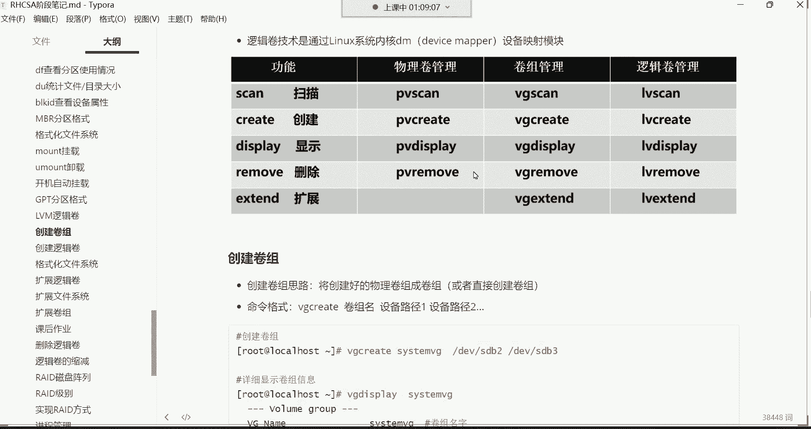

上一节我们介绍了分区和挂载的基础操作。本节中我们来看看如何突破传统分区空间固定的限制。

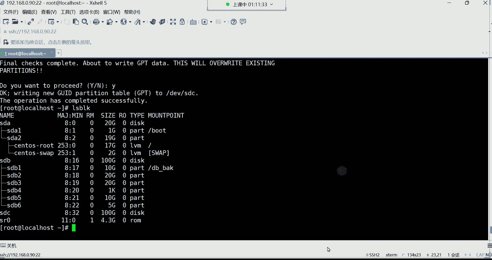

逻辑卷管理（LVM）是一种将底层物理硬盘空间抽象化、逻辑化的技术。它的核心目标是实现存储空间的**动态扩展**，而无需像传统分区那样，在空间不足时需要备份数据、重新分区、格式化等一系列复杂且高风险的操作。

我们可以通过一个比喻来理解LVM的架构：
*   **物理卷（PV）**：相当于一块块“砖头”（物理硬盘或分区）。
*   **卷组（VG）**：相当于一个“大池子”，由多块“砖头”（PV）堆砌而成，形成一个统一的、大容量的存储池。
*   **逻辑卷（LV）**：相当于从“大池子”（VG）里舀出的一“瓢”水，分配给具体应用使用。这“瓢”水的大小可以根据需要随时从池子里增加。

LVM最大的优势在于，**逻辑卷（LV）的空间可以随时从卷组（VG）中扩展**。而卷组（VG）的空间，又可以随时通过添加新的物理卷（PV，即新的硬盘或分区）来扩充。整个过程**无需格式化现有数据分区**，仅在最终赋予逻辑卷文件系统时需要一次格式化。

## 逻辑卷管理常用命令

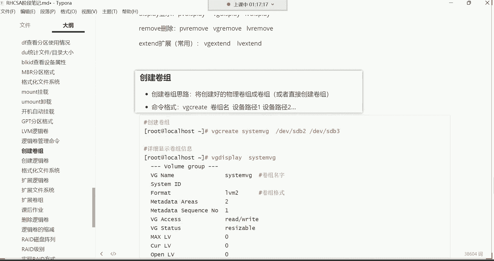

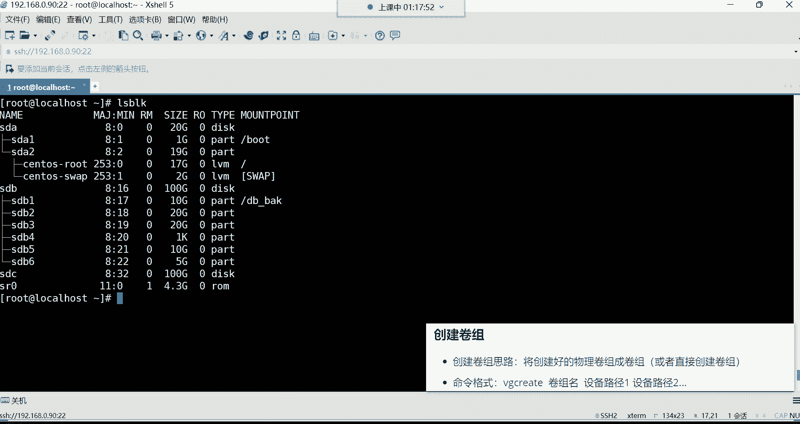

理解了原理后，我们来看看操作逻辑卷所需的命令。LVM的命令非常有规律，易于记忆。

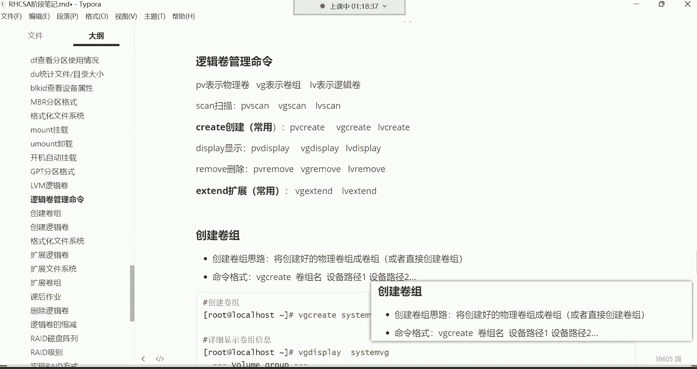

以下是LVM管理的核心命令分类，主要分为创建、显示和扩展三类：

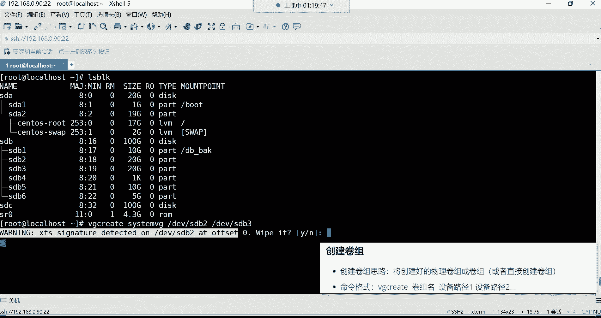

*   **创建命令**：
    *   `vgcreate`：创建卷组（VG）。
    *   `lvcreate`：创建逻辑卷（LV）。
    （注：在RHEL/CentOS 7及以后版本中，创建物理卷（PV）的`pvcreate`命令通常由系统自动执行，初学者可暂不记忆。）

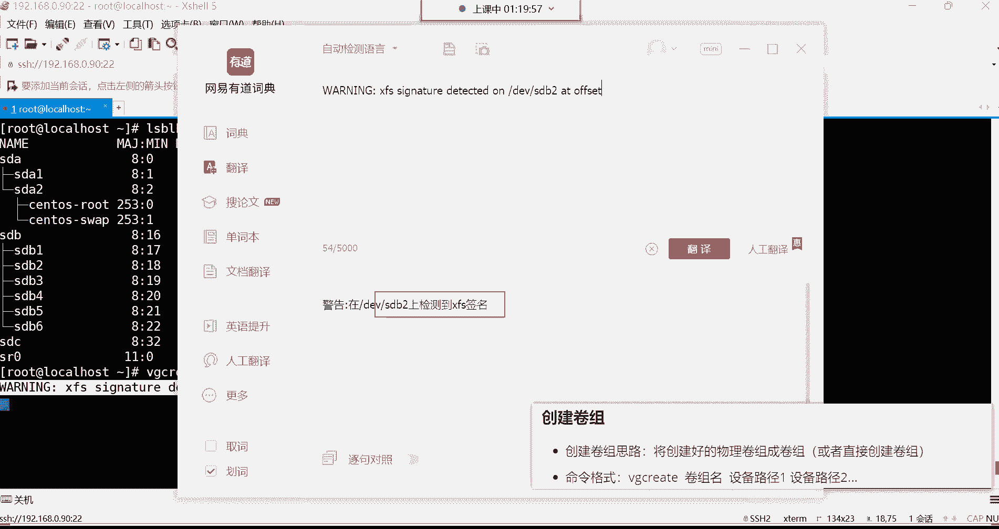

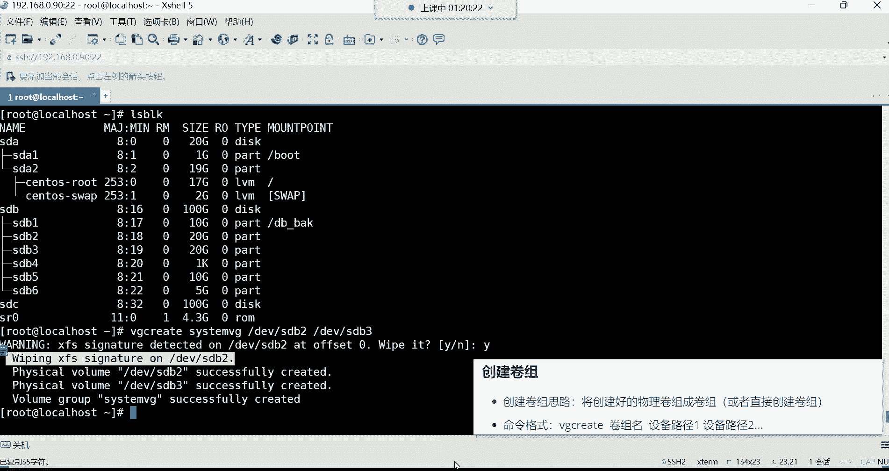

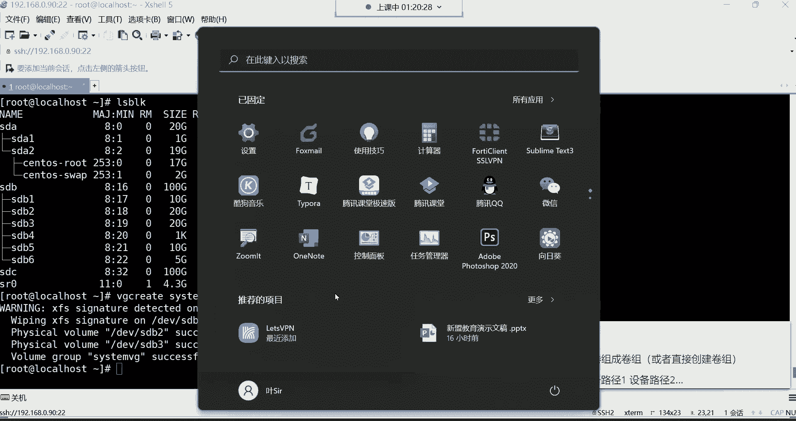

*   **显示命令**：
    *   `vgs` / `lvs`：简要查看卷组/逻辑卷信息（**常用**）。
    *   `vgdisplay` / `lvdisplay`：详细查看卷组/逻辑卷信息。

*   **扩展命令**：
    *   `vgextend`：扩展卷组（VG）容量（添加新的PV）。
    *   `lvextend`：扩展逻辑卷（LV）容量。

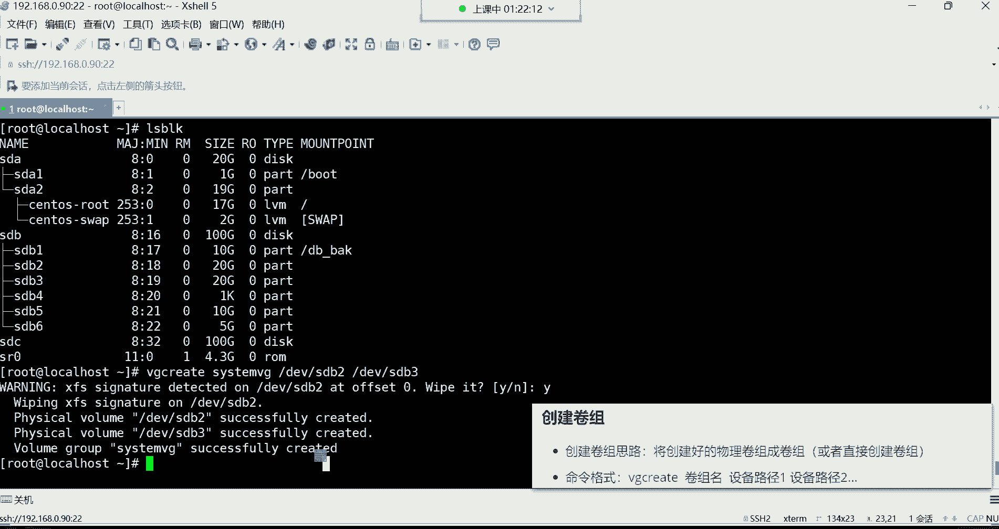

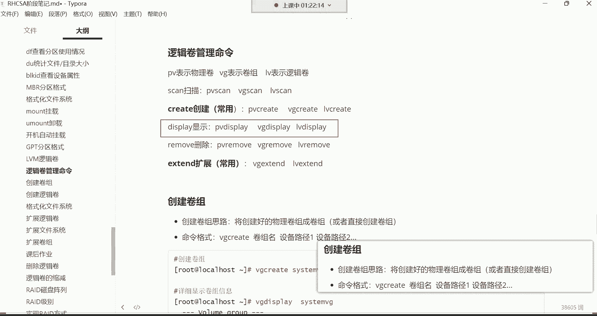

**命令规律**：所有命令都以操作对象开头（`vg`代表卷组，`lv`代表逻辑卷），后跟操作动作（`create`创建，`display`显示，`extend`扩展）。

## 实战：创建并挂载逻辑卷

现在，我们通过一个完整的例子，将两个各20GB的分区（`/dev/sdb2`, `/dev/sdb3`）组成一个卷组，并从中创建一个20GB的逻辑卷供系统使用。

### 第一步：创建卷组（VG）
首先，我们将两个物理分区组合成一个名为`system_vg`的卷组。
```bash
vgcreate system_vg /dev/sdb2 /dev/sdb3
```
执行此命令时，系统可能会提示检测到分区上原有的文件系统签名（如xfs），并询问是否擦除。输入`y`确认即可，因为后续我们会为逻辑卷单独格式化。

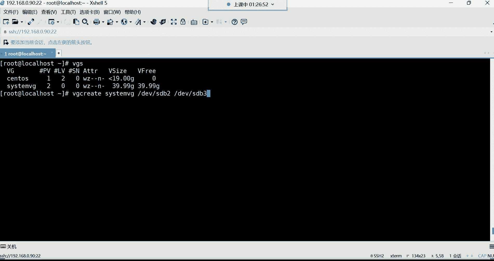

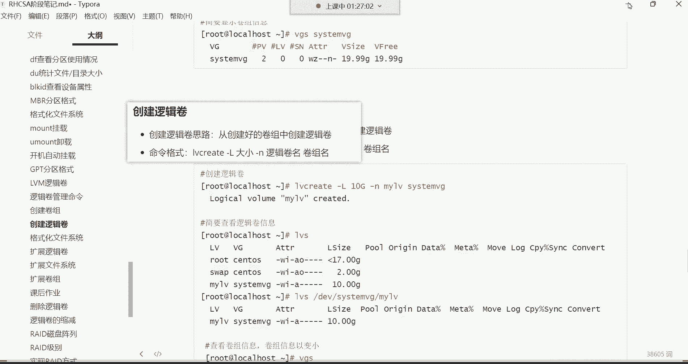

命令成功后，可以使用`vgs`命令简要查看卷组信息，确认其总容量约为40GB。
```bash
vgs
```

### 第二步：创建逻辑卷（LV）
接着，我们从刚创建的`system_vg`卷组中，划分一个20GB的逻辑卷，并命名为`my_lv`。
```bash
lvcreate -L 20G -n my_lv system_vg
```
*   `-L 20G`：指定逻辑卷大小为20GB。
*   `-n my_lv`：指定逻辑卷的名称为`my_lv`。
*   `system_vg`：指定空间来源的卷组。

创建后，使用`lvs`命令查看逻辑卷信息。
```bash
lvs
```
此时，逻辑卷的设备路径为`/dev/system_vg/my_lv`。

### 第三步：格式化并挂载逻辑卷
逻辑卷创建后，就像一个普通的分区一样，需要格式化为文件系统（如xfs）才能存储数据。
```bash
mkfs.xfs /dev/system_vg/my_lv
```
然后，将其挂载到一个目录，例如`/web_back`。
```bash
mount /dev/system_vg/my_lv /web_back
```
使用`df -h`命令可以查看挂载情况，确认`/web_back`目录已使用我们新建的逻辑卷。

### 第四步：配置开机自动挂载
为了让挂载在系统重启后依然生效，需要编辑`/etc/fstab`文件。
```bash
vim /etc/fstab
```
在文件末尾添加如下一行：
```
/dev/system_vg/my_lv /web_back xfs defaults 0 0
```
保存退出后，执行`mount -a`测试配置是否正确（无报错即表示成功）。

## 逻辑卷的扩展与卷组的扩容

上一节我们完成了逻辑卷的创建和基本使用。本节中我们来看看LVM的核心功能——空间扩展。

假设未来`/web_back`目录空间不足，我们需要将`my_lv`逻辑卷从20GB扩展到30GB。

**1. 扩展逻辑卷（LV）大小：**
```bash
lvextend -L +10G /dev/system_vg/my_lv
```
*   `-L +10G`：表示在原有基础上增加10GB空间。
*   也可以使用`-L 30G`直接指定扩展后的总大小为30GB。

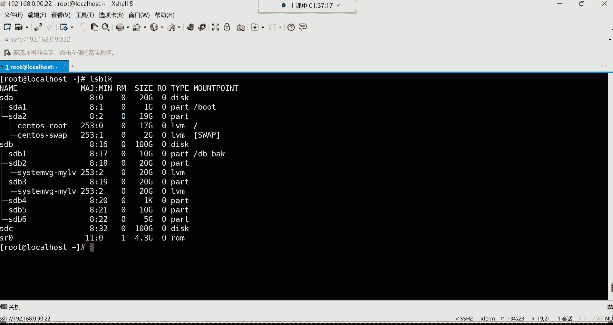

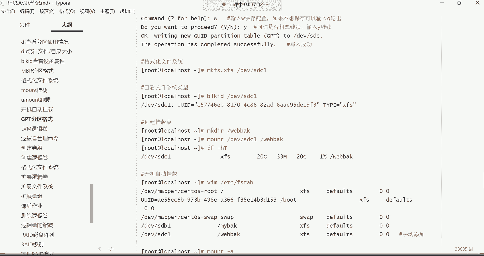

**2. 扩展文件系统：**
仅扩展逻辑卷的“容器”大小还不够，其中的文件系统也需要同步扩大才能使用新增空间。
对于xfs文件系统，使用以下命令：
```bash
xfs_growfs /web_back
```
对于ext4文件系统，则使用：
```bash
resize2fs /dev/system_vg/my_lv
```
扩展后，再次使用`df -h`查看，会发现`/web_back`的容量已变为30GB。

**3. 扩展卷组（VG）容量：**
如果卷组`system_vg`的剩余空间也不够了，我们可以向其中添加新的物理硬盘或分区。
首先，将一块新硬盘（如`/dev/sdc`）创建为物理卷（PV）（此步在RHEL7+可省略，但显式执行更清晰）：
```bash
pvcreate /dev/sdc
```
然后，将此物理卷加入到现有的`system_vg`卷组中：
```bash
vgextend system_vg /dev/sdc
```
执行`vgs`命令，可以看到`system_vg`的总容量已经增加。之后，你就可以从这个更大的“池子”里继续为逻辑卷扩容了。

## 总结
本节课中我们一起学习了Linux逻辑卷管理（LVM）技术。我们首先理解了LVM通过**物理卷（PV）、卷组（VG）、逻辑卷（LV）**三层抽象来实现存储空间灵活管理的原理。接着，我们掌握了创建卷组（`vgcreate`）和逻辑卷（`lvcreate`）的命令，并完成了格式化、挂载及配置开机启动的全流程。最后，我们深入探讨了LVM的核心价值——**在线动态扩展**，学会了如何扩展逻辑卷（`lvextend`）以及如何通过添加新硬盘来扩容卷组（`vgextend`）。

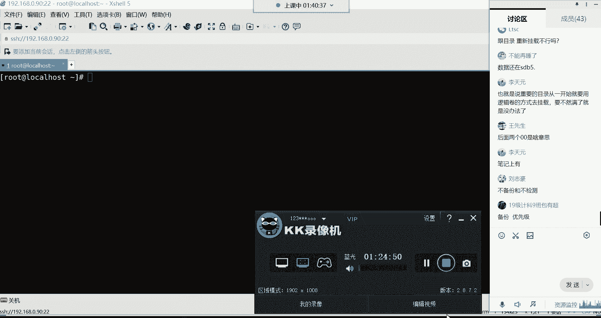

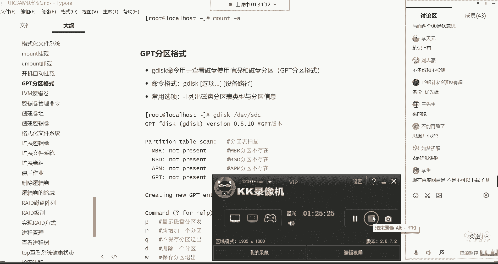

LVM是企业级Linux存储管理的基石，它使得存储空间能够像云资源一样按需分配和扩展，极大地提升了系统的可维护性和可靠性。请务必熟练掌握其基本操作流程。