# Linux最全RHCSA+RHCE培训教程合集，小白入门必备！：P28：红帽RHCSA-28.逻辑卷扩容、RAID磁盘阵列 📚💾

在本节课中，我们将要学习RAID磁盘阵列的核心概念、不同级别的特性以及实现方式。RAID技术通过组合多个磁盘，旨在提升数据存储的性能、可靠性和容量。

---

## RAID 0：条带化阵列 🚀

上一节我们介绍了逻辑卷管理，本节中我们来看看如何通过磁盘阵列技术进一步提升存储性能。RAID 0是最基础的阵列级别。

RAID 0至少需要两块磁盘组成一个阵列。数据存储时，一份文件会被等量拆分，并行写入到不同的磁盘中。这个过程称为**并行写入**。

其核心特点是：**同一份文档等量存放在不同的磁盘，并行写入以提高读写速度**。

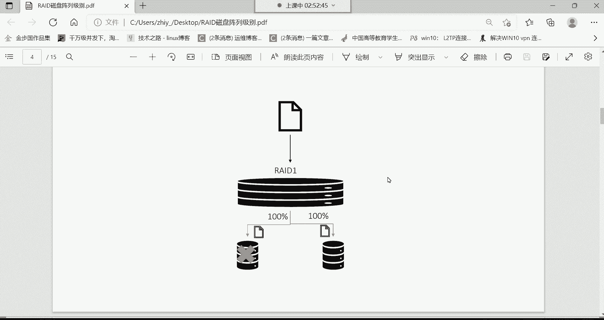

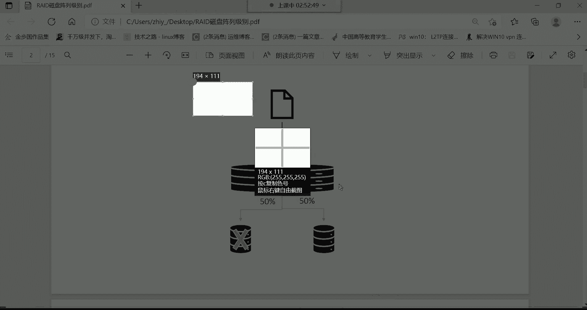

例如，一个10GB的文件，如果存入单块硬盘需要4分钟。在RAID 0中，文件被分成两半（各5GB），同时写入两块硬盘。由于是并行操作，理论上存储时间会缩短一半，仅需2分钟。

**公式**：`总写入时间 ≈ 单盘写入时间 / 磁盘数量`

以下是RAID 0的特点总结：
*   **优点**：读写速度显著提升。
*   **缺点**：**没有冗余备份功能**。如果其中一块磁盘故障，数据将丢失，因为文件是不完整的。

因此，RAID 0适合存储对速度要求高、但重要性不高的数据，例如缓存或临时文件。

---

## RAID 1：镜像阵列 🛡️

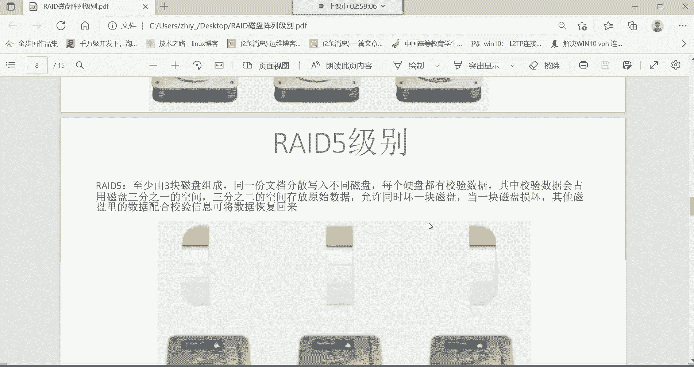

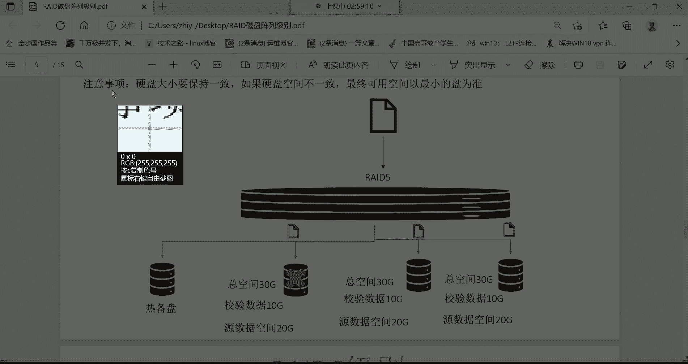

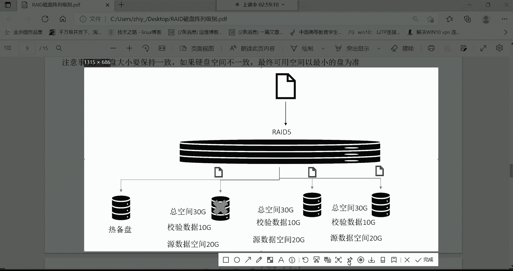

了解了追求速度的RAID 0后，我们来看看追求极致安全的RAID 1。

RAID 1也至少需要两块磁盘。其核心机制是**完全备份**（镜像）。同一份文件会被完整地复制多份，存储到每一块成员磁盘中。

例如，一个10GB的文件存入RAID 1阵列，两块磁盘都会完整地存储这个10GB的文件。这实现了数据的完全冗余。

以下是RAID 1的特点总结：
*   **优点**：**安全性极高**。任何一块磁盘损坏，数据都不会丢失，因为另一块磁盘上有完整的副本。
*   **缺点**：
    1.  **读写速度没有提升，反而可能下降**。因为数据需要写入所有磁盘，总写入时间可能等于`单盘写入时间 × 磁盘数量`。
    2.  **磁盘空间利用率低**。总存储空间等于单块磁盘的容量，另一半空间用于备份。例如，两块1TB硬盘组成的RAID 1，可用空间只有1TB。

RAID 1非常适合存储极其重要的数据。

---

## RAID 5：平衡性能与安全的常用方案 ⚖️

RAID 0速度快但不安全，RAID 1安全但速度慢且空间利用率低。那么，有没有兼顾速度与安全的方案呢？这就是RAID 5。

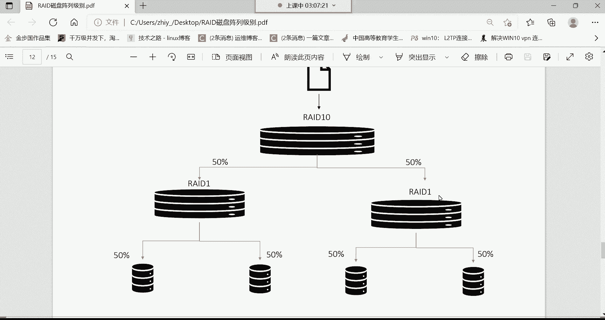

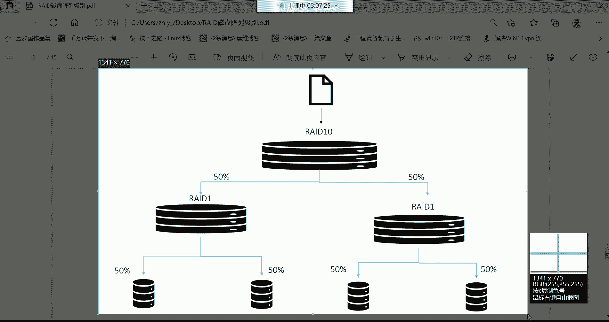

RAID 5至少需要三块磁盘。数据存储方式结合了RAID 0的条带化和独特的校验机制。

**工作流程**：
1.  一份文件被分割成数据块，条带化分布存储在多个磁盘上。
2.  同时，RAID 5会通过算法计算出这些数据块的**校验信息**（Parity），并将校验信息轮流存储在不同的磁盘上。

**核心概念**：校验信息占用一块磁盘的空间（N块盘阵列中，校验信息占1/N空间）。当任意一块磁盘损坏时，可以利用其余磁盘上的数据和校验信息，通过算法**重建**出损坏磁盘上的数据。

以下是RAID 5的特点总结：
*   **优点**：
    1.  **兼顾速度与安全**：并行读写提升了速度；允许损坏一块磁盘而不丢失数据。
    2.  **空间利用率较高**：可用空间为`(N-1) × 单盘容量`（N为磁盘总数）。
*   **缺点**：写入数据时需要计算校验信息，会带来一定的性能开销。

在企业中，常为RAID 5配置一块**热备盘**。当阵列中某块磁盘故障被自动踢出后，热备盘会立即加入并开始重建数据，保证阵列始终处于安全状态。

RAID 5是性价比较高、在企业中非常常用的RAID级别。

---

## 其他RAID级别简介

除了上述三种，还有其他RAID级别，它们各有特点，但应用相对较少。

*   **RAID 2/3/4**：采用复杂的校验算法，硬件开销大，性能不佳，现已很少使用。
*   **RAID 6**：类似于RAID 5，但采用**双校验算法**。至少需要四块磁盘，允许同时损坏两块磁盘而不丢数据。安全性更高，但校验信息占用更多空间（2/N），写性能开销更大。
*   **RAID 10 (RAID 1+0)**：先两两组成RAID 1（镜像），再将两个RAID 1组合成RAID 0（条带化）。它至少需要四块磁盘。
    *   **优点**：既拥有RAID 0的高速度，又拥有RAID 1的高可靠性。
    *   **缺点**：成本高，空间利用率只有50%（一半磁盘用于镜像）。
*   **RAID 50/60等**：是更复杂的嵌套RAID，用于超大规模存储，一般企业较少使用。

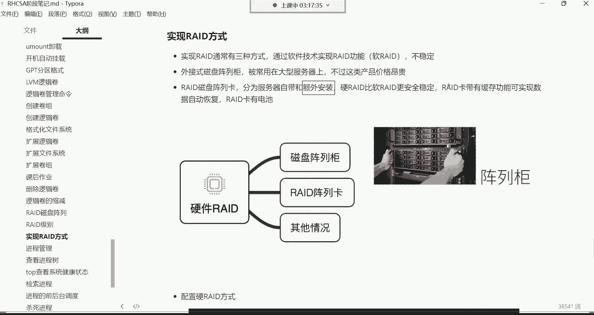

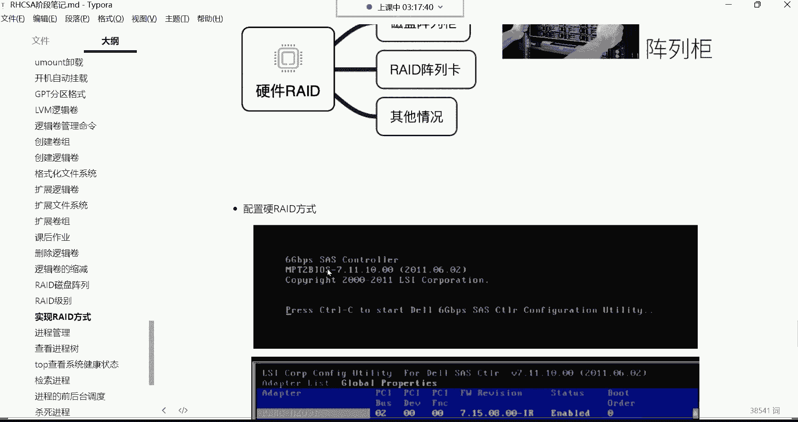

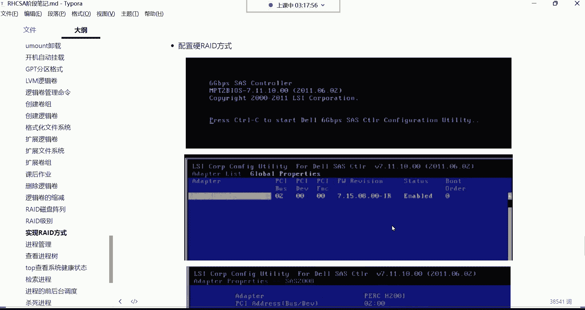

---

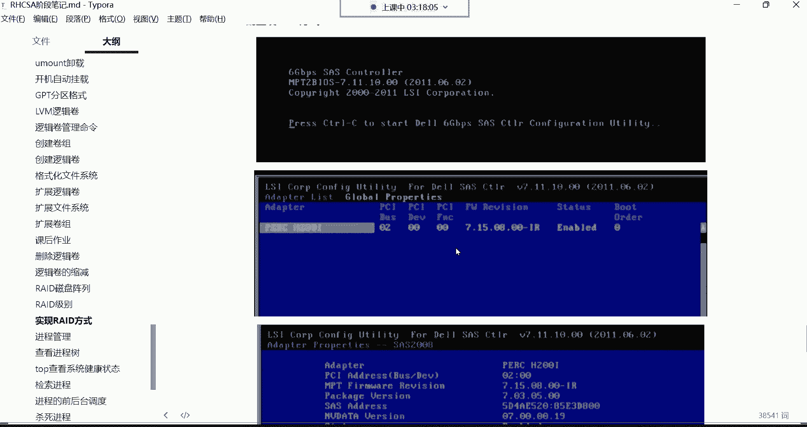

## RAID的实现方式 🛠️

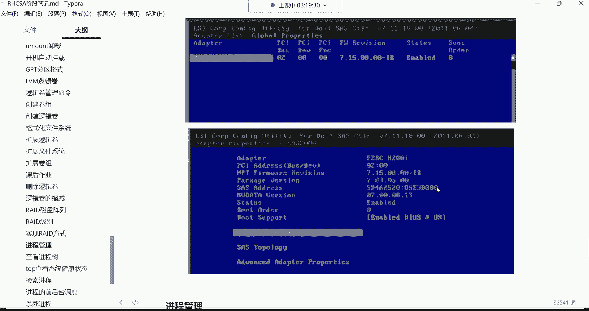

了解了各级别的原理，我们来看看如何实现RAID。主要有三种方式：

1.  **软件RAID**：通过操作系统层面的软件实现。成本低，但性能较差，且依赖于操作系统稳定性，服务器宕机可能导致阵列失效。
2.  **硬件RAID（阵列卡）**：通过专用的RAID控制卡实现。这是最主流的方式。
    *   **优点**：性能好，稳定，不占用主机资源。许多阵列卡带有**缓存和电池**，即使服务器意外断电，也能保护缓存中的数据并完成写入，防止数据丢失。
    *   **使用**：服务器开机时按特定快捷键（如`Ctrl+R`）进入RAID卡配置界面，根据说明书创建所需级别的阵列。
3.  **外置磁盘阵列柜**：独立的存储设备，通过线缆与服务器连接。性能强大，扩展性好，但价格非常昂贵，常用于大型数据中心。

对于大多数企业，购买带有或额外安装**硬件RAID卡**的服务器是性价比最高的选择。

---

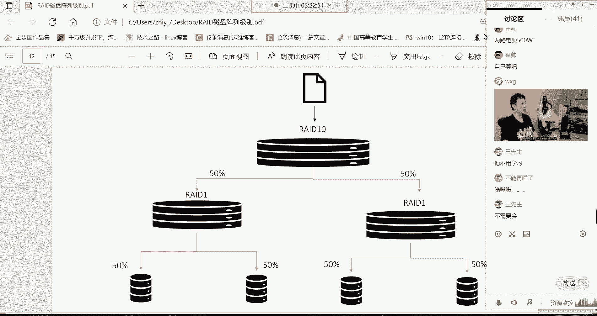

## 课程总结与作业 📝

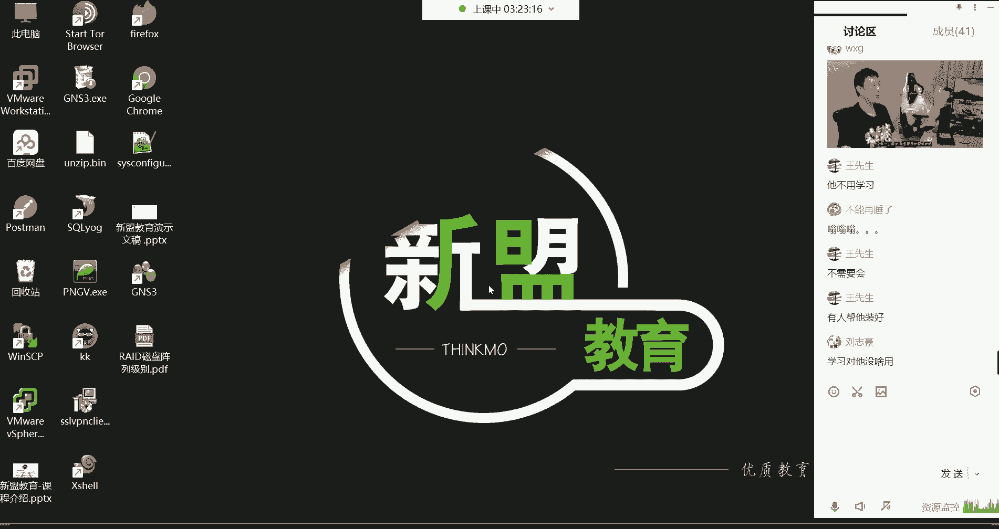

本节课中我们一起学习了磁盘阵列（RAID）技术。我们重点探讨了：
*   **RAID 0**：条带化，提升速度，无冗余。
*   **RAID 1**：镜像，完全冗余，提升安全性。
*   **RAID 5**：条带化加分布式校验，平衡速度与安全，是企业常用方案。
*   RAID的实现方式，特别是**硬件RAID卡**的优势。

**课后实践**：
请回顾之前学习的逻辑卷管理（LVM）知识，尝试完成以下任务：为你Linux系统中的根分区（它是一个逻辑卷）扩容40GB空间。这需要你综合运用创建物理卷、扩展卷组、扩展逻辑卷以及扩展文件系统等一系列命令。

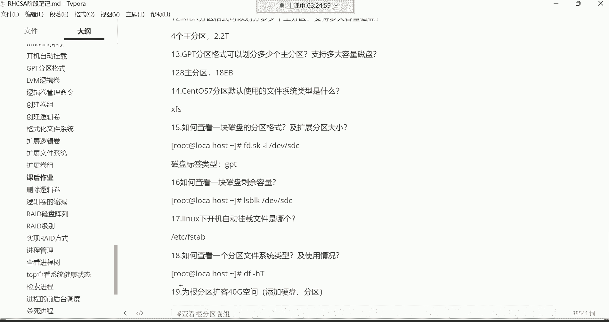

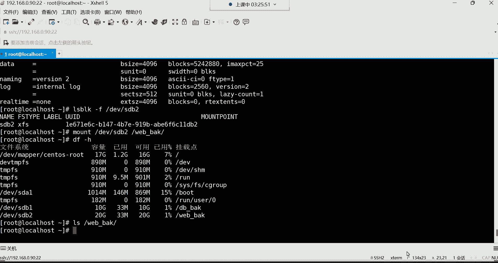

通过本课的学习，你应该对如何通过RAID和LVM来构建灵活、高效、可靠的存储系统有了清晰的认识。