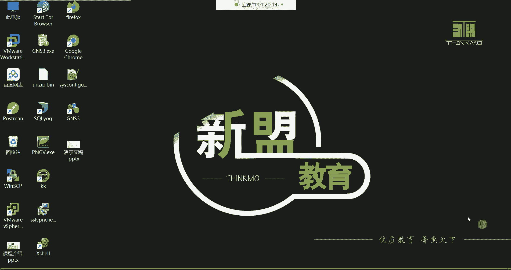
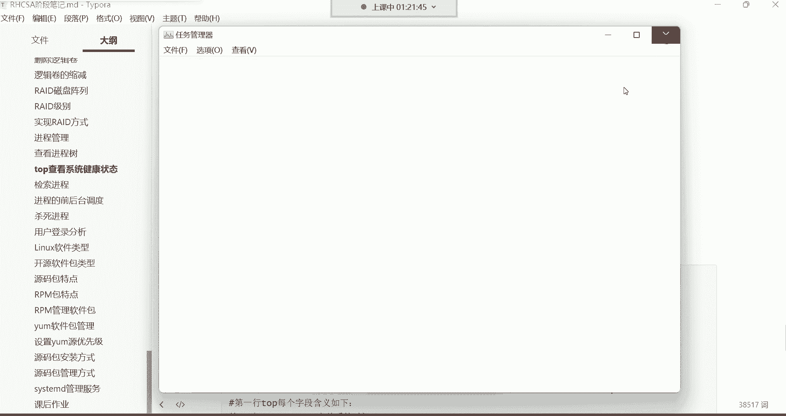
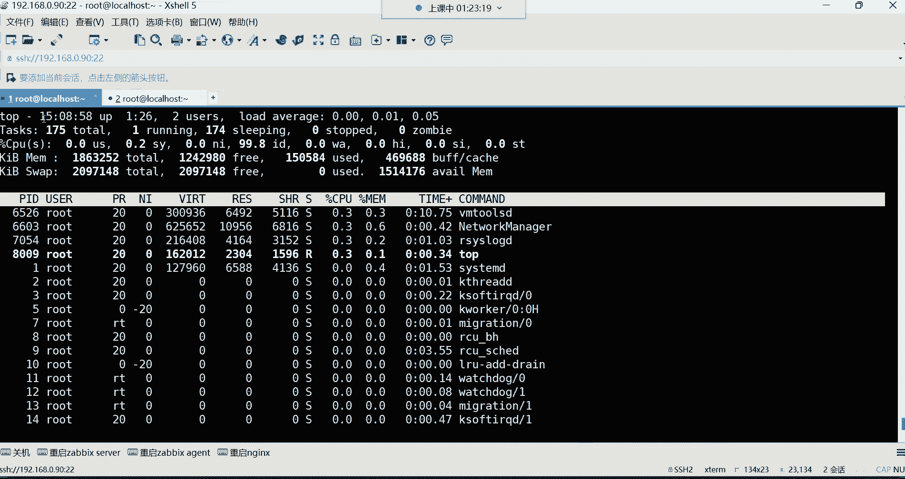
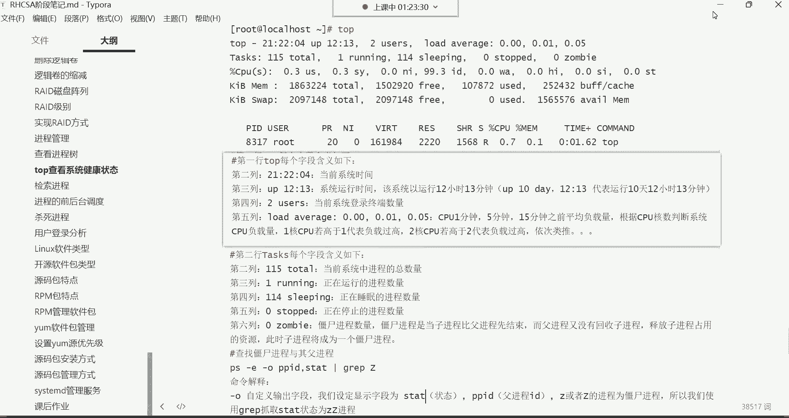
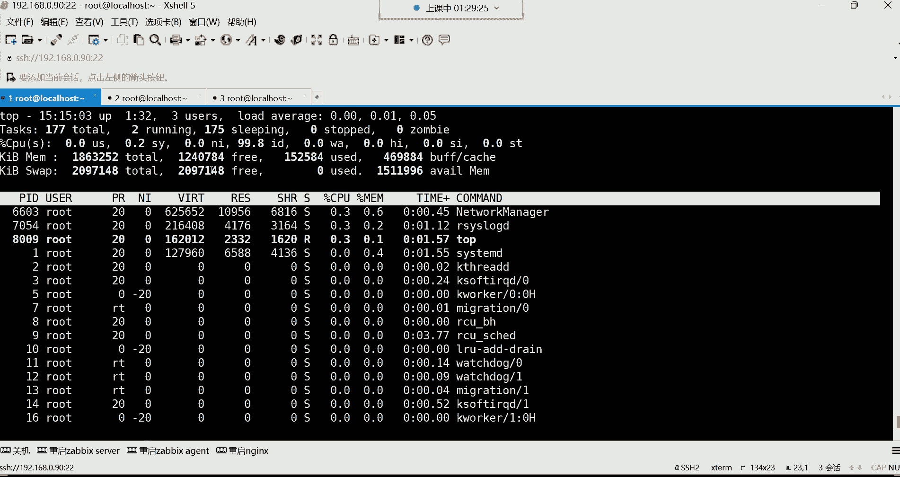
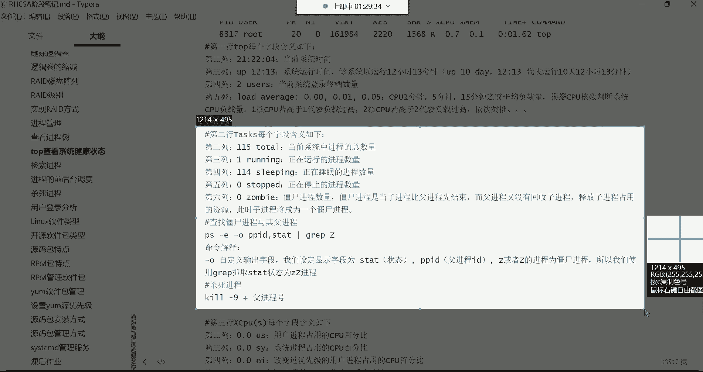
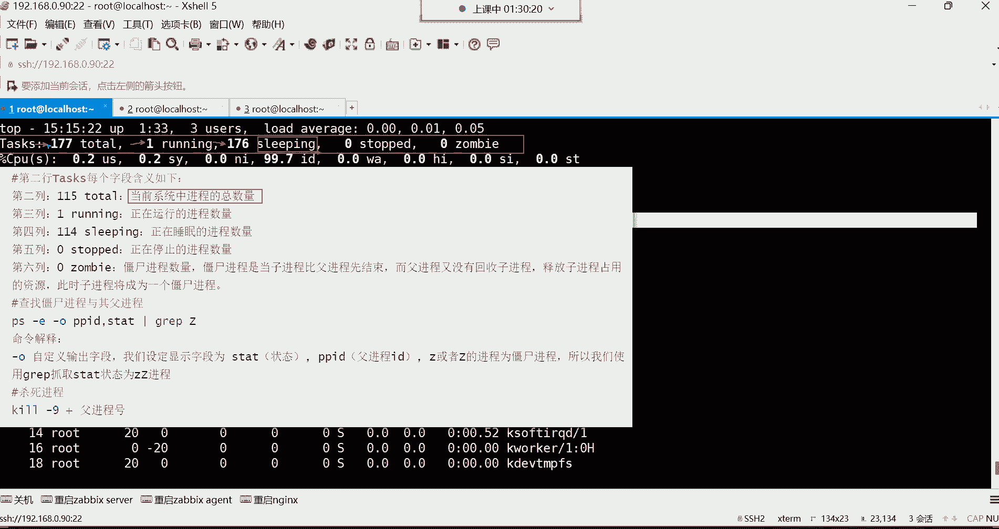
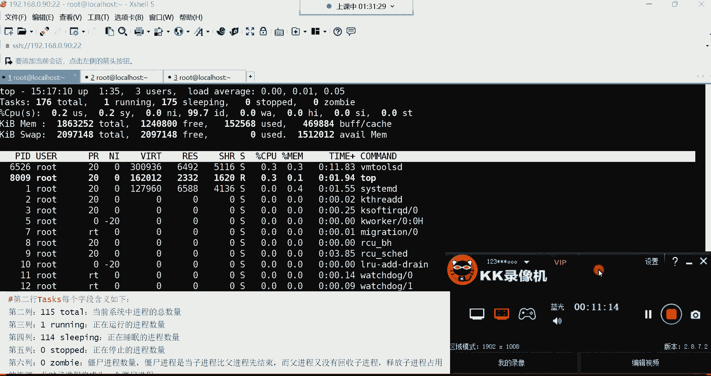

# Linux最全RHCSA+RHCE培训教程合集，小白入门必备！ - P29：红帽RHCSA-29.top系统健康检查

在本节课中，我们将要学习 `top` 命令。`top` 命令的主要功能是动态查看系统性能和运行状态。

它类似于 Windows 系统中的任务管理器。在 Windows 中，我们可以通过任务管理器查看系统资源。`ps` 命令是静态的，而 `top` 命令是动态的。

此外，`ps` 命令无法显示很多信息。`top` 命令就像一个资源管理器，可以分析系统当前的性能。这些性能信息包括内存、CPU、磁盘和网络等。

这些信息都可以在 `top` 命令中查看。`top` 命令的功能与任务管理器相同。

它比 `ps` 命令更强大。`ps` 命令无法分析网络等信息。`top` 命令通常也不用于分析网络，但它是动态的。

它可以实时观察当前的 CPU、内存以及其他进程信息。直接输入命令即可查看。

输入 `top` 并按回车键，会显示如下界面。这个界面是动态的。当前界面已被 `top` 命令占用。可以看到界面一直在动态更新。

而 `ps` 命令则不同。我们再打开一个终端。`top` 命令不需要额外安装，系统自带。这就像 Windows 的任务管理器，不需要额外安装。

输入 `ps aux`。它与 `top` 命令不同。`ps aux` 主要查看系统中的进程信息。它可以列出每个进程占用的 CPU 和内存。

但很多信息它无法列出。在 `top` 命令的界面中，从上到下共有六行。第六行才是 `ps aux` 命令列出的信息。

输入 `ps aux` 命令。它会列出每个进程的 PID、用户、进程状态、CPU 占用百分比和内存占用百分比等信息。

第六行数据才是 `ps aux` 命令列出的信息。但上面的第一行到第五行，`ps` 命令无法显示。第一行到第五行代表什么意思呢？

每一行都包含非常多的信息。我们先从第一行开始讲解。

第一行是 `top` 命令的摘要信息。第一列代表当前系统时间。当前系统时间是 15:04。

后面的 `up` 代表系统已经运行了多久。这是系统的运行时间。如果显示 `1:27`，代表运行了 1 小时 27 分钟。

在生产环境的企业服务器中，运行时间通常更长。企业服务器一般用天数来表示运行时间。例如，服务器运行了一年，会显示为 `365d`。

后面再跟上具体的小时和分钟，例如 `4:20`。因此，很多人喜欢在网络上炫耀自己服务器的运行时间。

例如，服务器运行了 1000 多天。这代表服务器维护得很好，没有重启过。这是一个炫耀的点。

`2 users` 代表当前登录系统的终端数量。这是终端数量，不是用户数量。如果同一个用户再打开一个终端，这个数字会增加。

现在打开三个终端，这个数字会变成 `3`。它显示当前有多少个终端登录系统。

右边的 `load average` 是 CPU 的平均负载量。从左到右分别是一分钟、五分钟和十五分钟的平均负载。

这些负载量是衡量服务器繁忙程度的重要数据。如何判断服务器是否繁忙？不能通过风扇转速来判断。

需要查看 CPU 负载。通过这三个值来判断。最近一分钟内 CPU 的负载程度。最近五分钟内 CPU 的负载程度。

最近十五分钟内 CPU 的负载程度。这些数值永远是最近的时间。如何计算这些数值呢？

需要根据 CPU 的核心数来判断系统的 CPU 负载量。例如，CPU 是四核心。如果负载值达到 `1.0`，代表一个核心的负载达到 100%。

如果负载值变成 `2.0`，代表两个核心的负载达到 100%。如果电脑是四核心，负载值达到 `4.0`，代表 CPU 严重超负荷。

如果负载值是 `2.0`，则没有问题，还有两个核心可用。CPU 在使用时，是一个核心一个核心地使用。

例如，一个核心用完了，再用第二个核心，以此类推。如果负载值是 `2.0`，说明还有很多核心可用。这是具体的时间。

它永远是最近一分钟、最近五分钟和最近十五分钟的平均负载。这是 CPU 的平均负载量。第一行讲解完毕。

第二行代表什么意思呢？

第二行是 `Tasks`。

第二行代表进程信息。从左到右讲解每一列。第一列 `177 total` 代表当前系统中的进程总数量。

当前系统中有 177 个进程。有多少个进程在运行？只有一个进程在运行。

也就是说，有 176 个进程处于休眠状态。它们在后台休眠。

现在只有一个进程在运行。是哪个进程？可以通过下面查看。是手机的问题吗？我把手机拿开。现在还有电流声吗？我把手机放远一点。电流声还有吗？怎么会有这种电流声？我们现在不能乱动。

它是不是一阵一阵的？如果是一阵一阵的，我们需要坚持一下。等下课以后，我把麦克风重新插一遍。现在不能动，一动这节课的录屏就没声音了。又来了吗？我看一下。

还有是吧。

---

本节课中我们一起学习了 `top` 命令的基本功能及其界面的前两行信息。`top` 命令是动态监控系统性能的重要工具，第一行显示了系统时间、运行时间、登录终端数和 CPU 平均负载，第二行则展示了进程的总数、运行状态等概要信息。理解这些信息是进行系统健康检查的基础。