# Linux最全RHCSA+RHCE培训教程合集，小白入门必备！：P2：红帽RHCSA-2.VMware安装CentOS系统

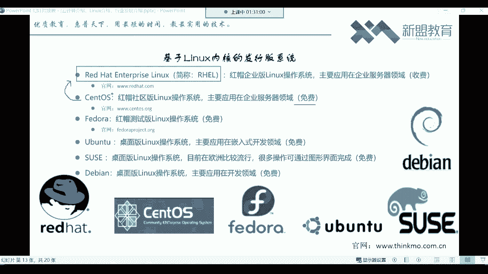

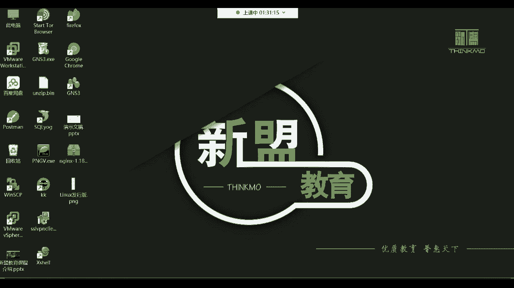

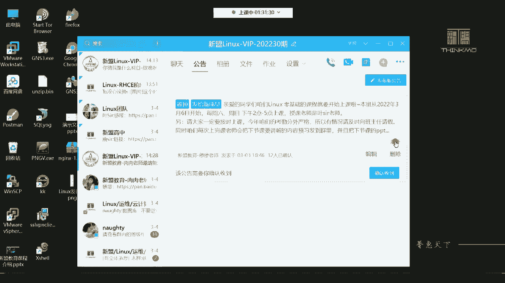

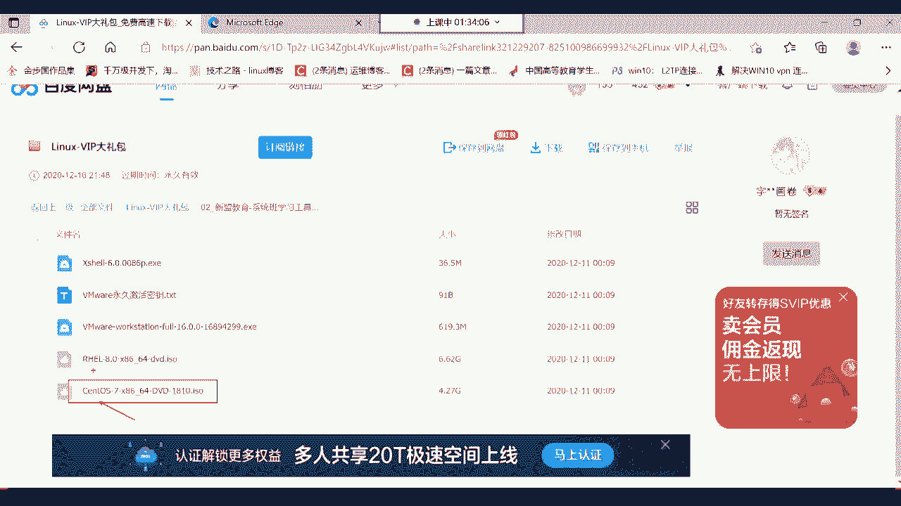

在本节课中，我们将学习如何在VMware虚拟机软件中安装CentOS操作系统。这是学习Linux的第一步，我们将从下载必要的软件和镜像开始，一步步完成虚拟机的创建和系统的安装。

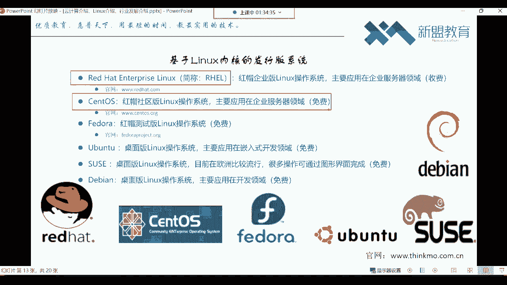

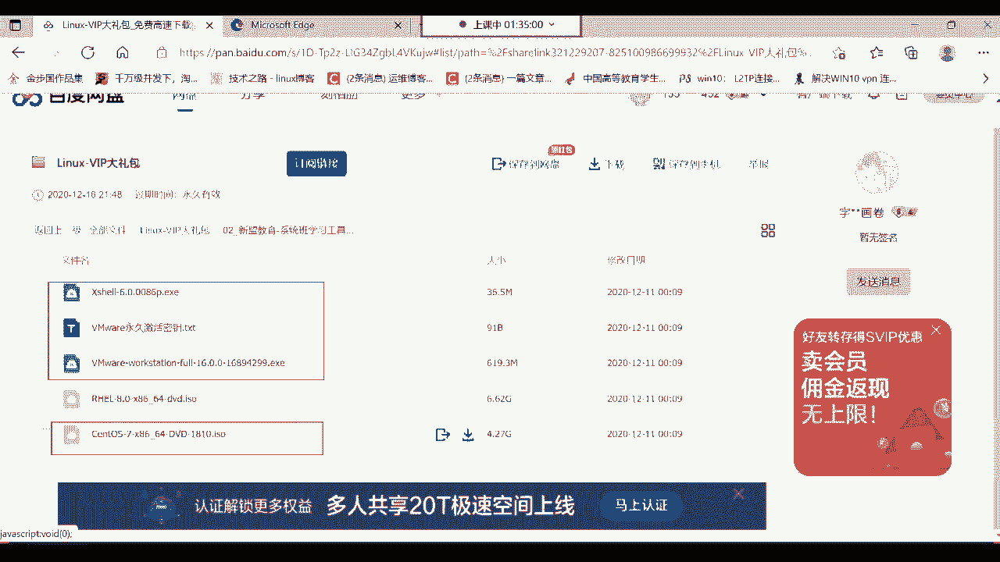

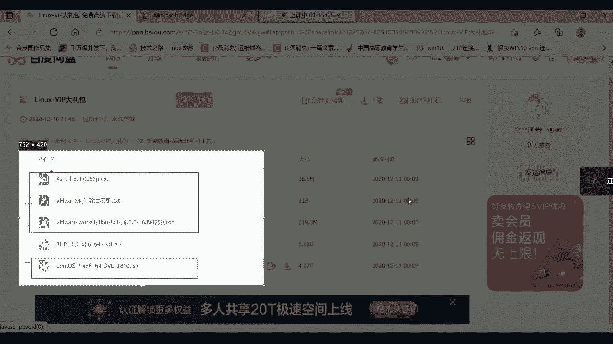

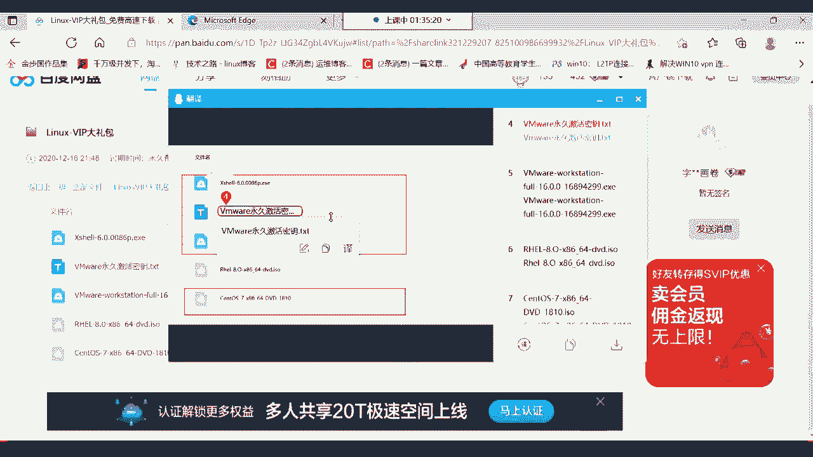

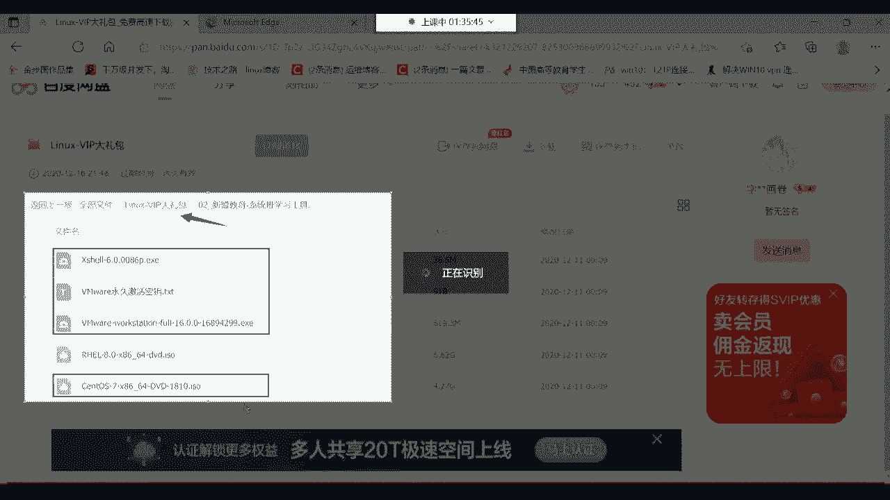

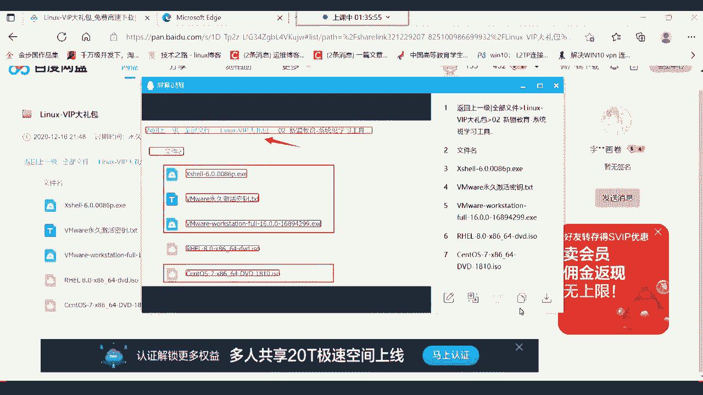

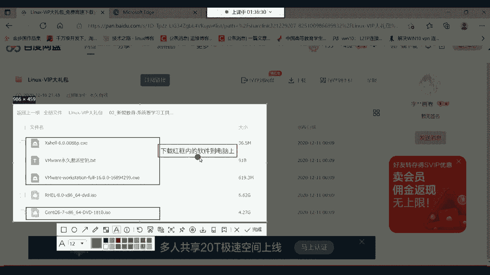

## 概述与准备工作

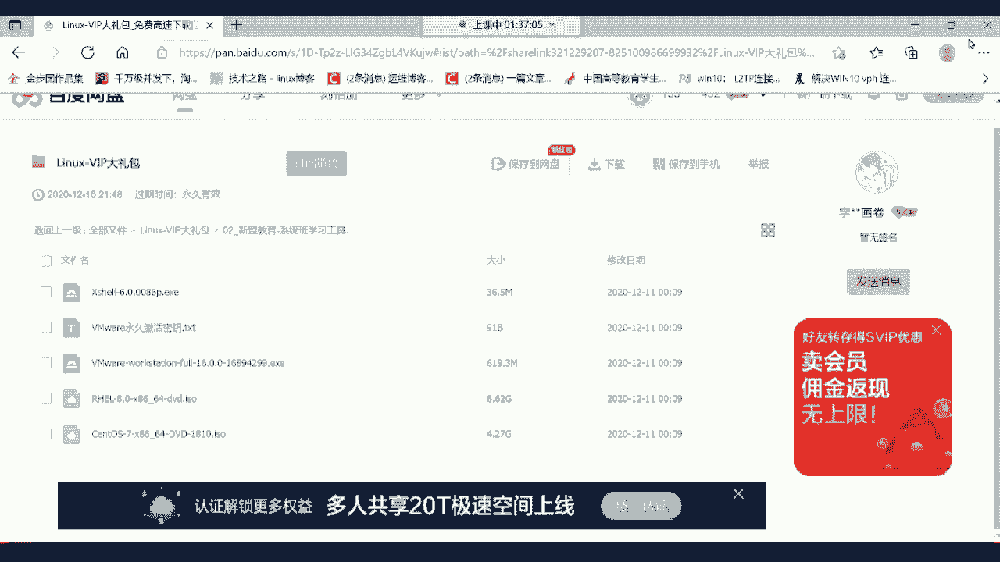

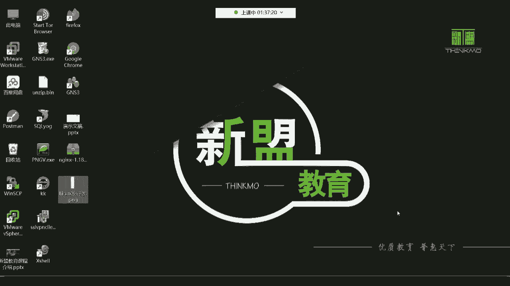

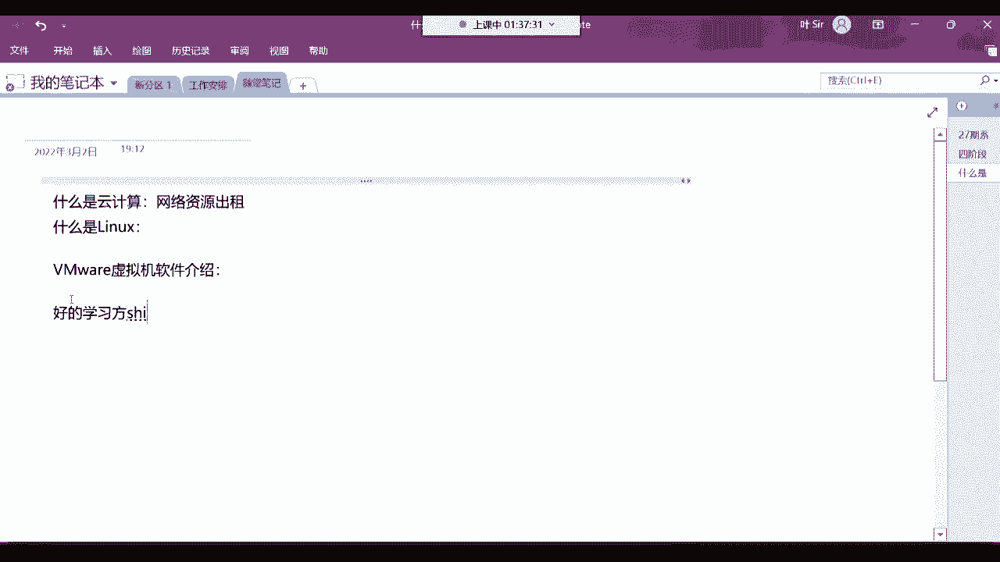

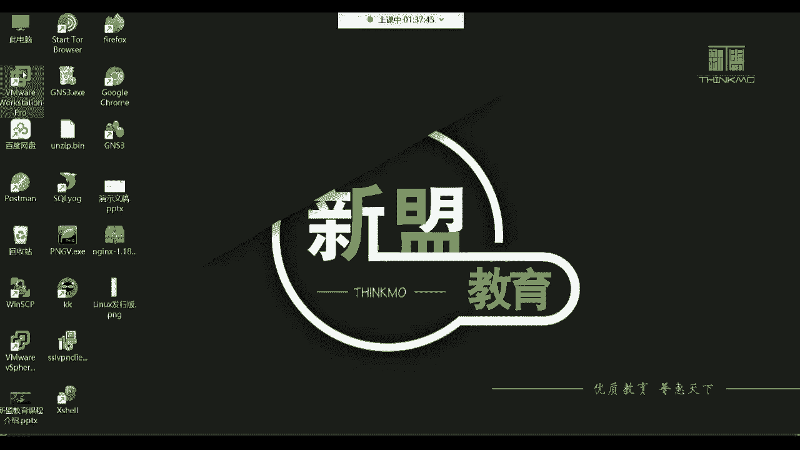

上一节我们介绍了Linux的基本概念，本节中我们来看看如何搭建一个用于学习的Linux环境。我们将使用VMware虚拟机软件来安装CentOS系统。

CentOS和Red Hat Enterprise Linux（RHEL）关系密切。你可以这样理解：CentOS是从RHEL克隆而来的操作系统。两者在命令和操作使用方面完全一样。我们选择学习CentOS，主要因为它是免费的，并且在企业服务器领域应用广泛。

以下是安装前需要下载的软件和文件列表：
*   VMware Workstation虚拟机软件及其激活密钥。
*   CentOS 7的系统镜像文件。
*   Xshell远程连接工具（可选，如果你已有其他连接工具，可以使用自己的）。

请将上述文件从提供的VIP大礼包中下载到你的电脑上。我们建议使用CentOS 7版本，因为CentOS 8已停止维护。

## 创建新的虚拟机

接下来，我们开始创建虚拟机。双击打开VMware Workstation软件。

如果你是首次打开，左侧列表会是空的。我们需要点击“创建新的虚拟机”。

1.  在新建虚拟机向导中，选择“典型”配置，然后点击“下一步”。
2.  在安装客户机操作系统界面，选择“稍后安装操作系统”，然后点击“下一步”。这样我们可以更自由地自定义虚拟机设置。
3.  在选择客户机操作系统界面，选择“Linux”，版本选择“CentOS 7 64位”，然后点击“下一步”。
4.  在命名虚拟机界面，为虚拟机起一个名字（例如：`CentOS7-学习机`），并选择一个安装位置（建议放在空间充足的磁盘，如固态硬盘），然后点击“下一步”。
5.  在指定磁盘容量界面，默认20GB即可。这个空间是虚拟机最多可使用的磁盘大小，并不会立即从你的电脑中划走全部空间。选择“将虚拟磁盘存储为单个文件”，然后点击“下一步”。
6.  在准备创建虚拟机界面，先不要点击完成，点击“自定义硬件”。

## 自定义虚拟机硬件

虚拟机软件的本质是虚拟出一套完整的硬件平台（如CPU、内存、硬盘、网卡），以便在其上安装操作系统。我们需要对这些虚拟硬件进行配置。

在“自定义硬件”窗口中，进行以下设置：

*   **内存**：建议分配2048 MB（即2GB）。这能保证系统安装和运行的流畅性。虚拟机的内存只有在开机时才会占用你电脑的物理内存。
*   **处理器**：根据你电脑的CPU核心数，为虚拟机分配适当的处理器数量。例如，可以分配“1个处理器”，“每个处理器的核心数量”为2。
*   **新CD/DVD**：这是安装系统的关键。选择“使用ISO映像文件”，然后点击“浏览”，找到你之前下载的CentOS 7镜像文件（.iso格式）。
*   **网络适配器**：选择网络连接模式。这里有三种模式：
    *   **桥接模式**：虚拟机网卡与真机网卡直接绑定，虚拟机需要配置与真机在同一网段的IP地址才能通信和上网。适合网络环境固定的台式机。
    *   **NAT模式**：虚拟机通过真机共享IP地址上网。虚拟机和真机的IP可以不在同一网段，它们通过VMware虚拟的`VMnet8`网卡进行通信。这是最常用且方便的模式，特别适合笔记本电脑。
    *   **仅主机模式**：虚拟机只能与真机通信，无法访问外网。
    我们推荐选择 **NAT模式**。
*   **USB控制器、声卡、打印机**：这些硬件在学习中通常用不到，可以选中后点击“移除”以节省资源。

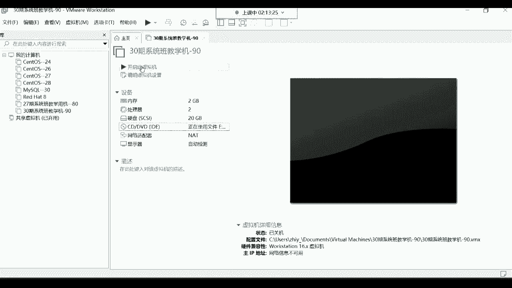

配置完成后，点击“关闭”，然后点击“完成”。至此，一台空白虚拟机就创建好了。

## 安装CentOS操作系统

现在，我们开始在这台虚拟机上安装系统。

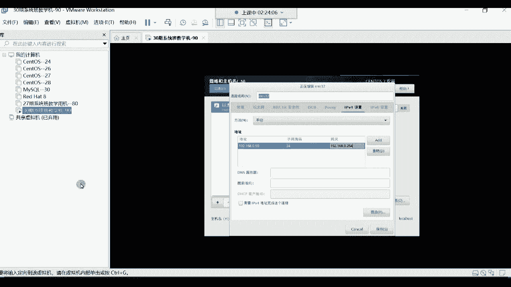

1.  选中刚创建的虚拟机，点击“开启此虚拟机”。
2.  虚拟机启动后会进入安装菜单。使用键盘上下键选择第一项“Install CentOS 7”，然后按回车键。
    > **提示**：鼠标点击虚拟机界面内部后，会被虚拟机捕获。按 `Ctrl + Alt` 组合键可以将鼠标释放回真机。
3.  在语言选择界面，可以选择“中文 - 简体中文”，然后点击“继续”。
4.  在安装信息摘要界面，需要进行以下关键设置：
    *   **软件选择**：点击进入。对于学习和企业环境，建议选择“最小安装”，它只包含最基本的功能。我们后续会手动安装所需软件。点击“完成”。
    *   **安装位置**：点击进入。这里是对虚拟机硬盘进行分区。我们使用默认的自动分区即可，直接点击“完成”。
    *   **网络和主机名**：点击进入。
        *   可以修改主机名，暂时保持默认`localhost`即可。
        *   点击“配置”来设置网络。在“IPv4设置”中，将方法改为“手动”。
        *   点击“添加”按钮，输入IP地址（例如：`192.168.0.90`）、子网掩码（`255.255.255.0` 或 `24`）、网关（例如：`192.168.0.254`）和DNS服务器（例如：`223.5.5.5`）。
        *   配置完成后，将右上角的网络开关打开，然后点击“完成”。
    *   **ROOT密码**：点击进入。为系统的超级管理员`root`账户设置一个密码。密码需要输入两次。完成后点击“完成”。
    *   **创建用户**：可以点击进入创建一个普通用户（可选），设置用户名和密码。

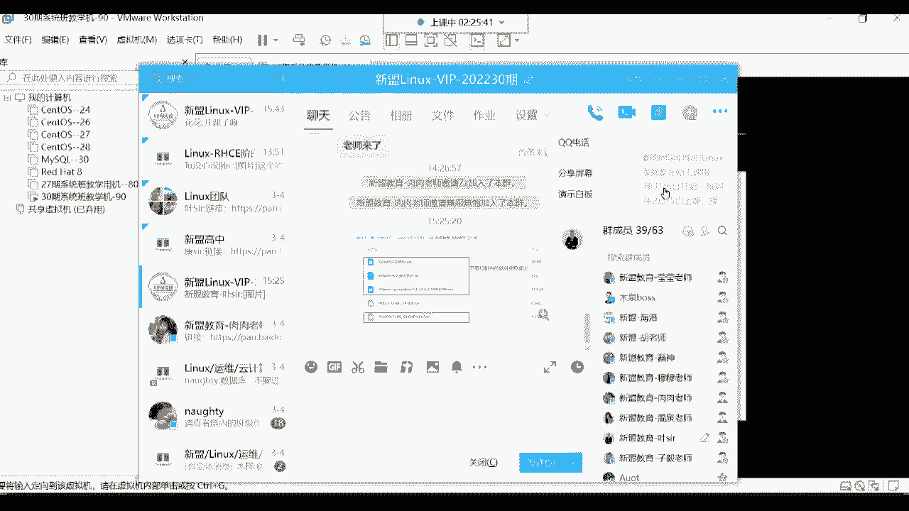

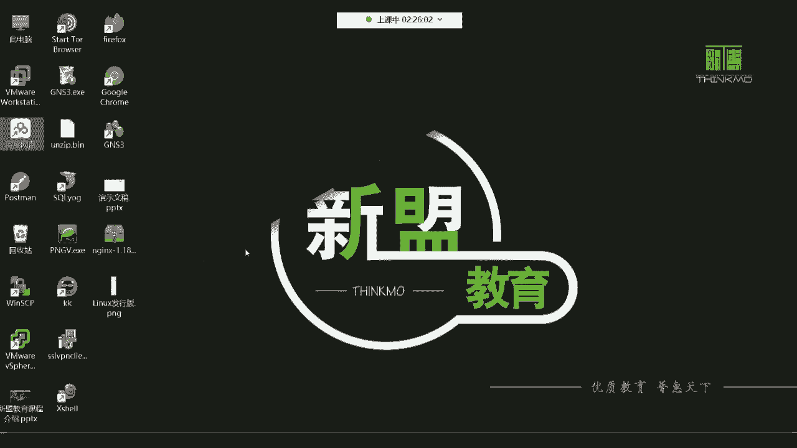

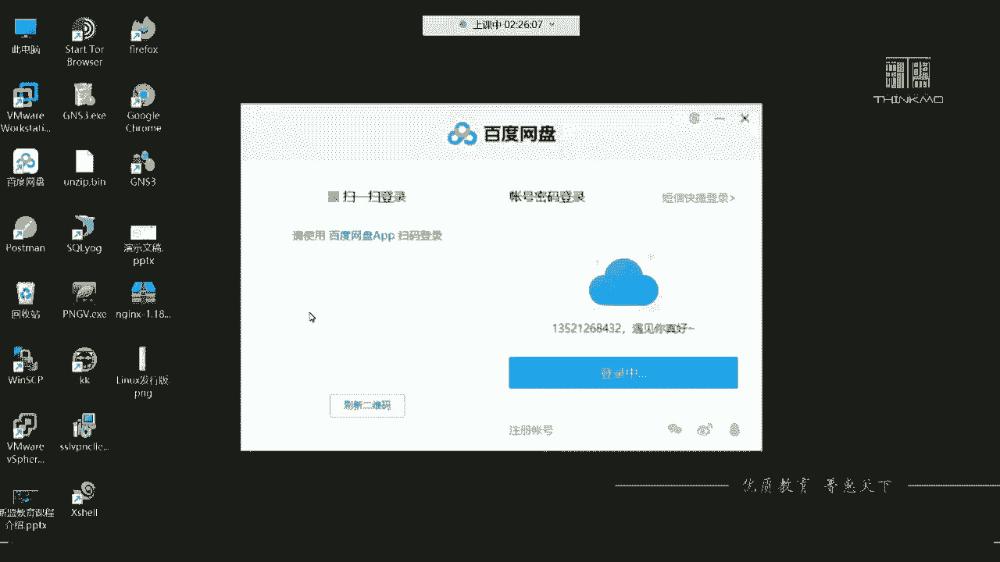

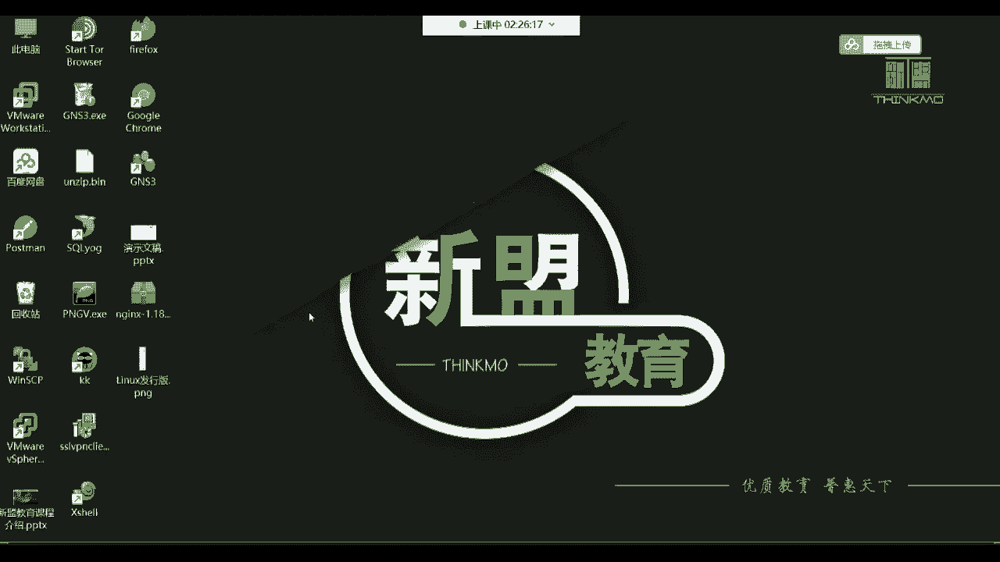

5.  所有配置完成后，点击右下角的“开始安装”。系统将开始安装过程，此过程需要一些时间。
6.  安装完成后，点击“重启”按钮。重启后，系统会提示你接受许可证，勾选“我同意许可协议”，点击“完成配置”。
7.  最后，系统会进入登录界面。输入用户名`root`和你之前设置的密码，即可登录到CentOS 7系统。

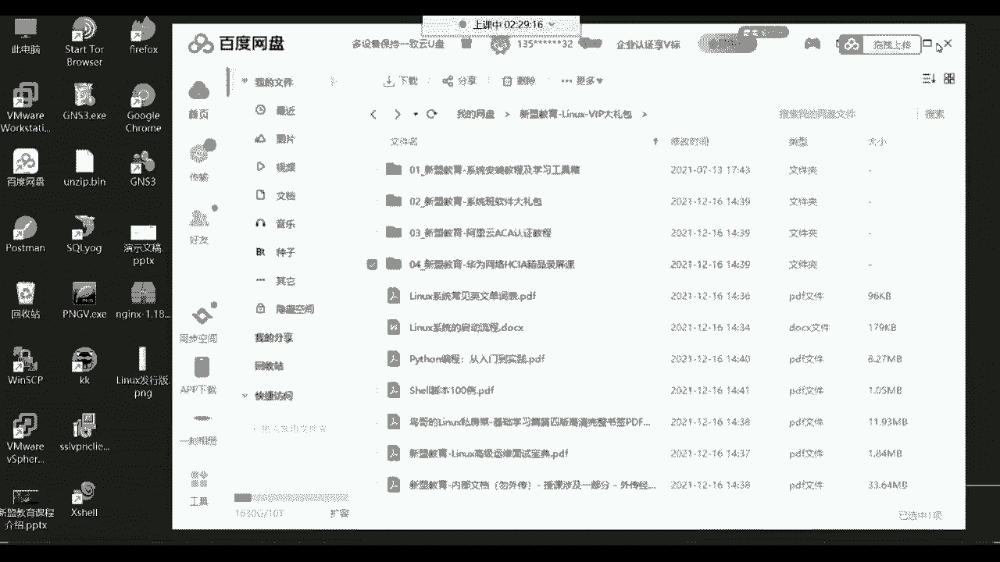

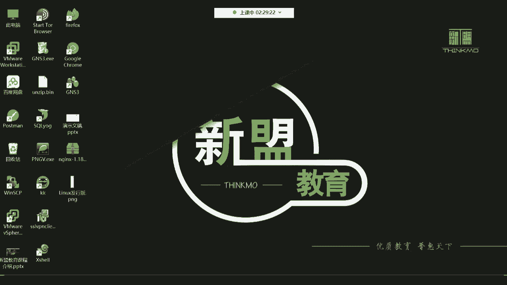

## 总结

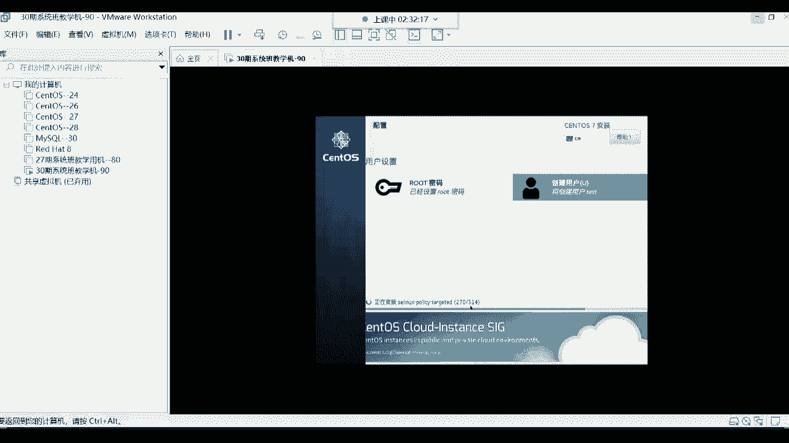

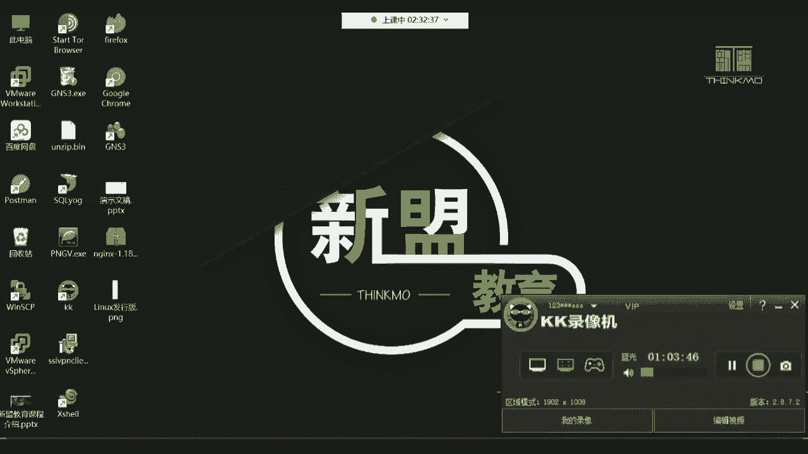

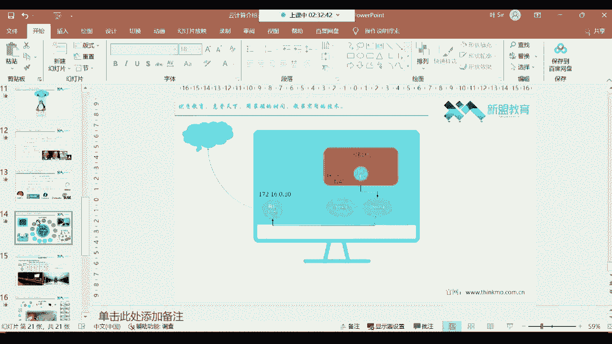

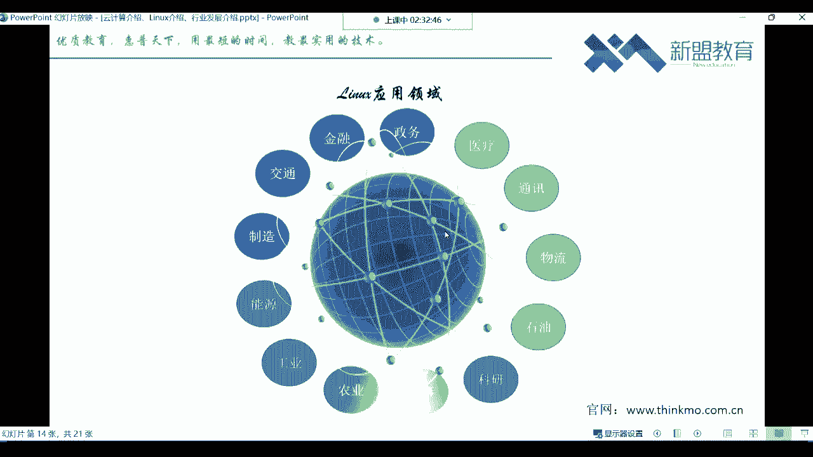

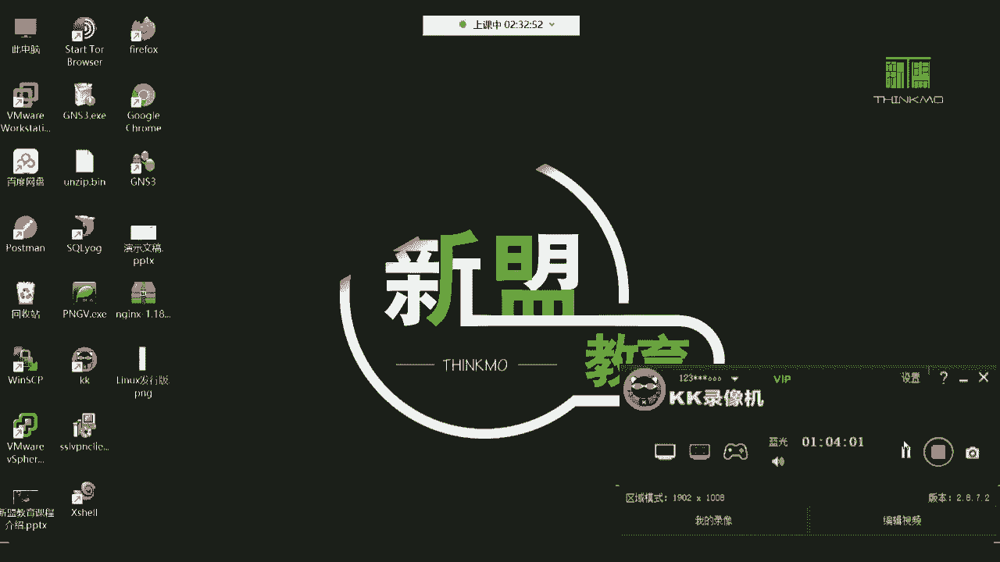

本节课中我们一起学习了如何在VMware中安装CentOS系统。我们首先准备了必要的软件和镜像，然后逐步创建并配置了虚拟机，包括设置内存、CPU、指定安装镜像和网络模式（推荐NAT模式）。最后，我们完成了CentOS系统的安装和初始配置，包括软件选择、磁盘分区、网络IP设置以及root密码的创建。现在，你已经拥有了一个可以开始Linux学习的实验环境。