# Linux软件包管理：P33：RPM软件包管理、YUM本地软件仓库搭建、YUM常用命令学习 📦


在本节课中，我们将要学习Linux系统中两种重要的软件包管理工具：RPM和YUM。我们将从RPM的卸载、升级等高级操作开始，然后重点讲解如何搭建本地YUM软件仓库，并学习YUM的常用命令。通过本课，你将掌握在无网络环境下高效管理软件包的方法。

## RPM软件包管理进阶

上一节我们介绍了RPM软件包的查询和基本安装功能，本节中我们来看看RPM的升级和卸载操作，并理解其中的注意事项。

### 软件包升级与备份

升级软件包时，使用 `-U` 选项。但升级操作会**用新版本的所有文件完全覆盖旧版本**，包括配置文件。

**核心概念：**
*   **升级命令：** `rpm -Uvh [软件包全名]`
*   **覆盖风险：** 旧版本的配置文件会被新版本的同名文件替换。

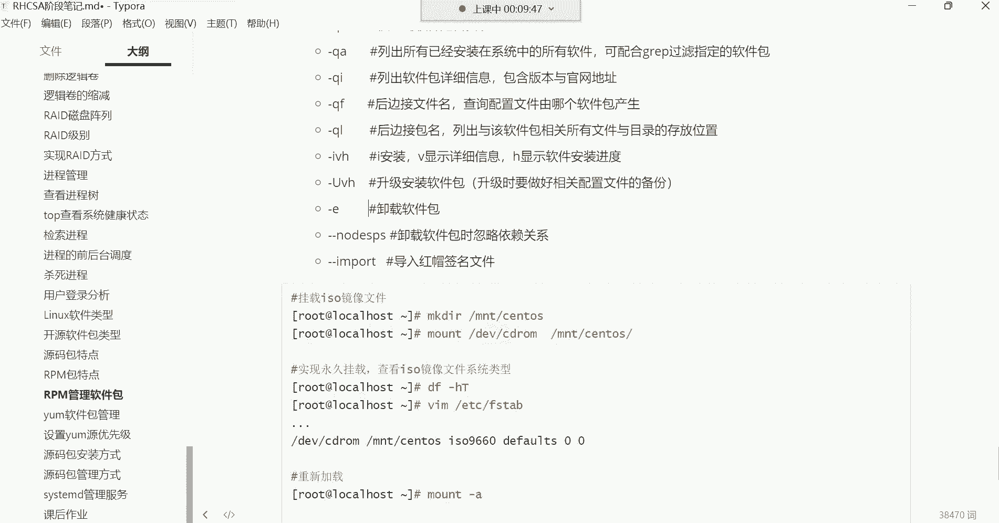

因此，在升级前，**必须对重要的配置文件进行备份**。通常，需要备份的是你手动修改过的服务配置文件。

**操作流程如下：**
1.  备份重要配置文件：`cp -p /etc/软件名/配置文件 /opt/`
2.  执行升级命令：`rpm -Uvh 软件包新版本.rpm`
3.  恢复配置文件：`cp -p /opt/配置文件 /etc/软件名/`

> **注意：** 如果软件版本跨度很大（例如跨多个主版本），旧配置文件可能与新软件不兼容，此时可能需要根据新版本手册重新配置。

### 软件包卸载

卸载软件包使用 `-e` 选项。

**核心概念：**
*   **卸载命令：** `rpm -e [软件包名]`

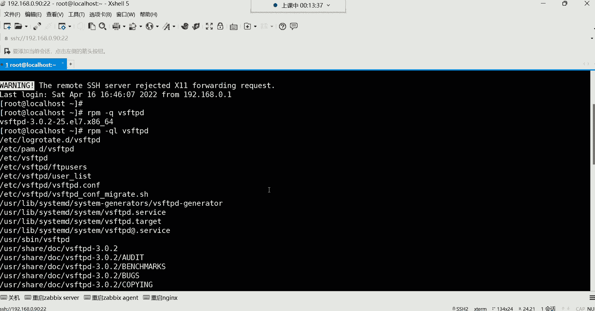

**操作示例：**
```
rpm -e vsftpd
rpm -q vsftpd # 查询确认是否已卸载
```

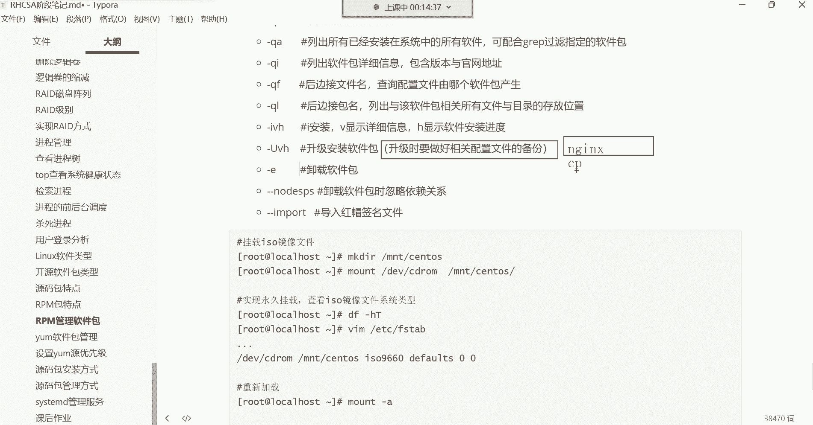

在企业服务器中，通常不会轻易卸载已安装的软件，只需停止相关服务即可。卸载操作需谨慎。

### 处理卸载时的依赖关系

某些软件包在卸载时，可能会提示需要连同其依赖包一起卸载。如果这些依赖包还被其他软件所使用，强制卸载会导致其他软件异常。

**核心概念：**
*   **忽略依赖卸载：** `rpm -e --nodeps [软件包名]`
*   **使用场景：** 仅卸载指定包，保留其依赖包。此选项需慎用。

### RPM签名验证

RPM包可以包含数字签名（GPG密钥），用于验证软件包的来源和完整性。如果系统未导入相应的公钥，安装时会出现警告（但不影响安装）。

**核心概念：**
*   **导入签名密钥：** `rpm --import /mnt/cdrom/RPM-GPG-KEY-redhat-release`
*   **密钥文件位置：** 通常位于 `/etc/pki/rpm-gpg/` 目录下。

**操作流程：**
1.  从系统安装镜像或软件仓库找到 `.gpg` 密钥文件。
2.  使用 `rpm --import` 命令将其导入系统。
3.  之后安装来自该源的软件包时将不再出现警告。

## 从RPM到YUM：解决依赖困境

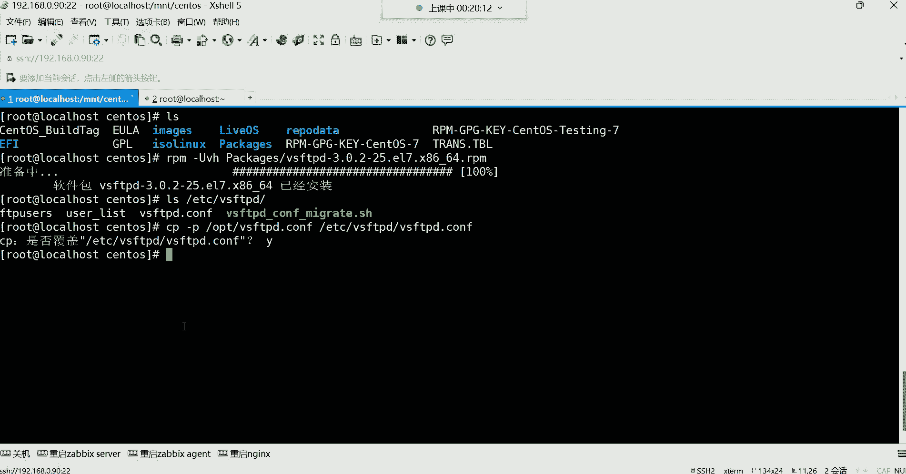

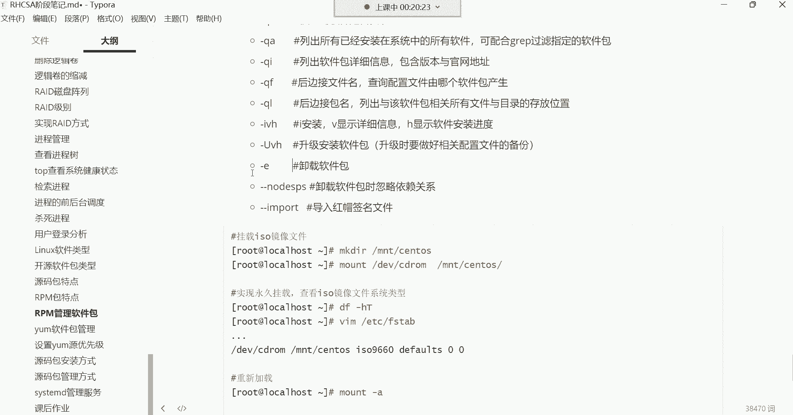

我们之前已经使用过RPM安装软件，但直接使用RPM安装的最大痛点在于**依赖关系**。

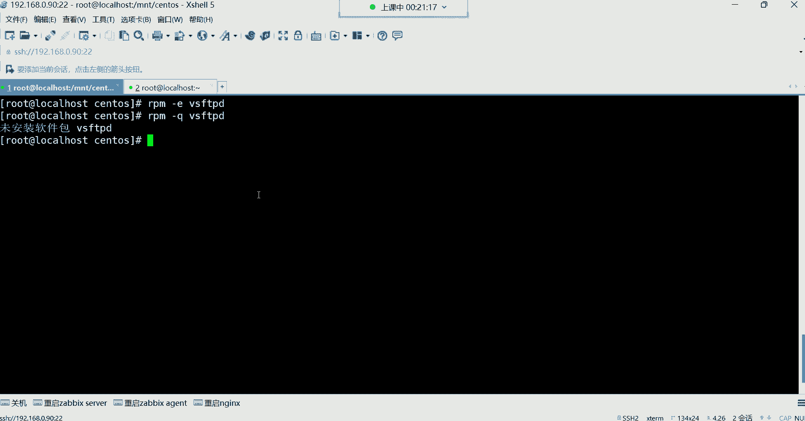

**核心问题演示：**
尝试安装 `httpd` 或 `vim` 等软件包时，会提示“依赖检测失败”。
```
rpm -ivh httpd-2.4.6-97.el7.x86_64.rpm
错误：依赖检测失败：
    /etc/mime.types 被 httpd-2.4.6-97.el7.x86_64 需要
    httpd-tools = 2.4.6-97.el7 被 httpd-2.4.6-97.el7.x86_64 需要
    libapr-1.so.0()(64bit) 被 httpd-2.4.6-97.el7.x86_64 需要
    libaprutil-1.so.0()(64bit) 被 httpd-2.4.6-97.el7.x86_64 需要
```
手动逐个解决这些依赖极其繁琐，尤其是遇到复杂的循环依赖时。

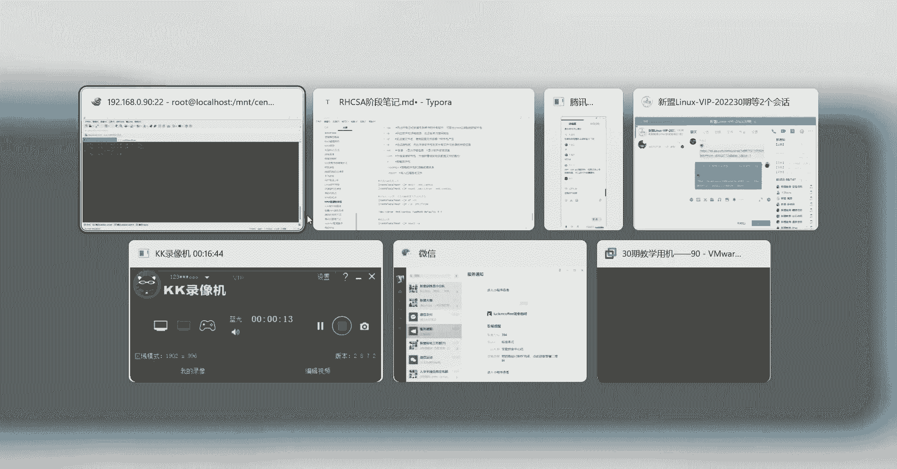

因此，我们需要一个能**自动解决依赖关系**的工具——这就是YUM。

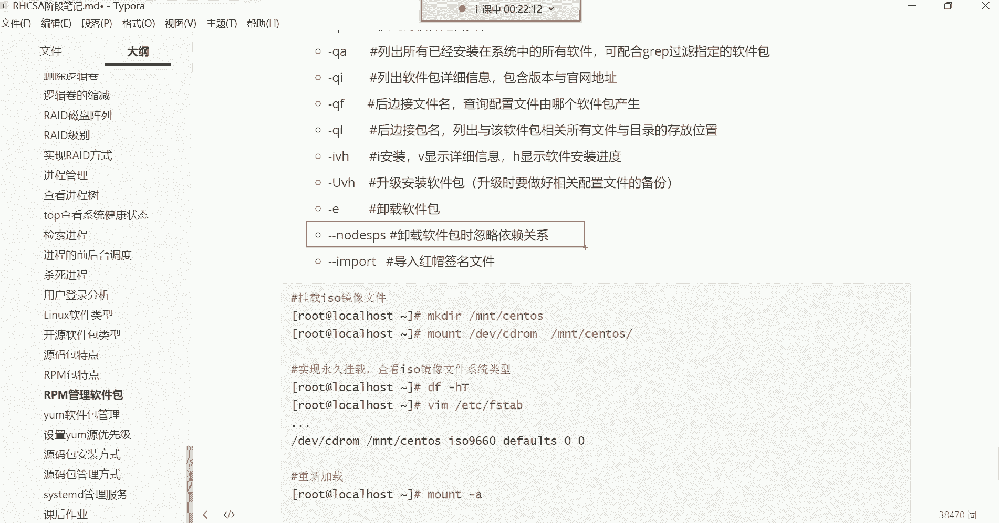

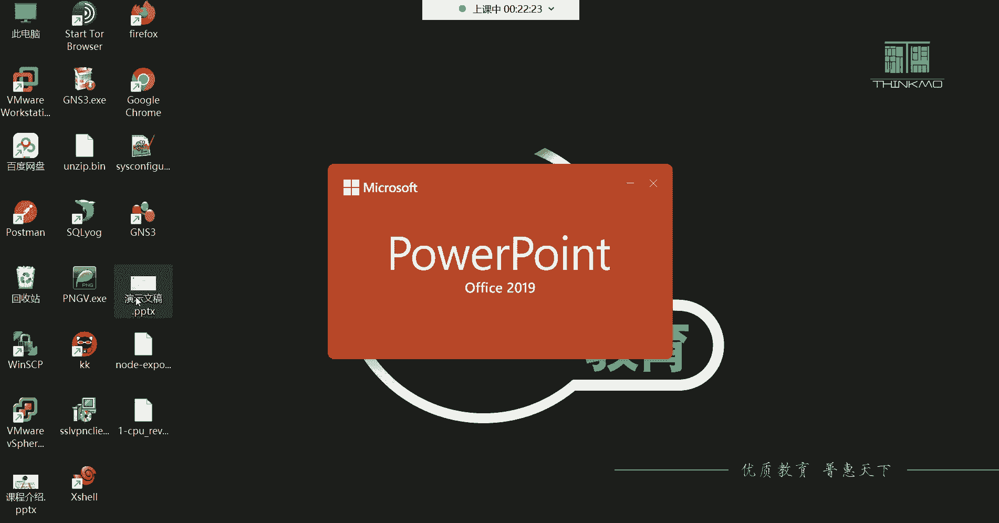

## YUM软件包管理器

YUM（Yellowdog Updater Modified）是一个基于RPM的Shell前端软件包管理器。它从**软件仓库**中自动下载RPM包并安装，可以自动处理依赖关系。

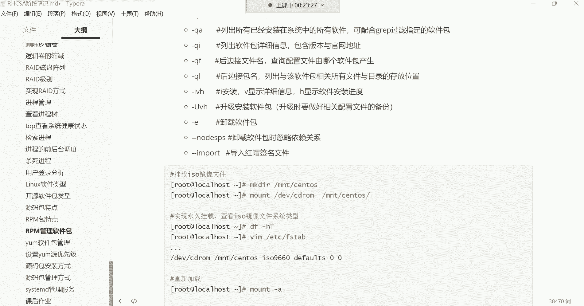

**软件仓库类型：**
1.  **本地仓库：** 软件包存放在本地（如系统安装光盘）。无需网络，但需要自行配置。
2.  **网络仓库：** 软件包存放在互联网服务器上（如阿里云、清华大学镜像站）。需要网络连接，但通常无需复杂配置。

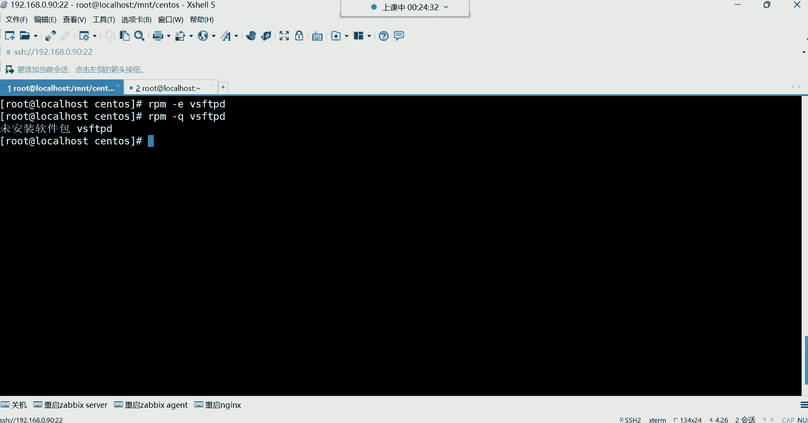

接下来，我们将学习如何搭建一个本地YUM仓库，这在无网络的内网环境中非常实用。

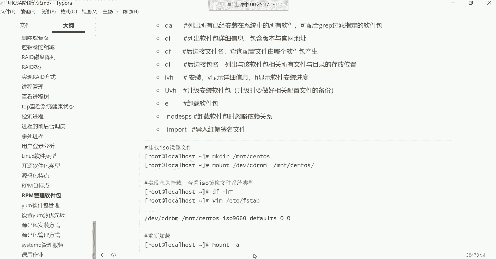

## 搭建本地YUM仓库 🛠️

上一节我们了解了YUM的优势和仓库概念，本节中我们动手搭建一个本地YUM仓库。

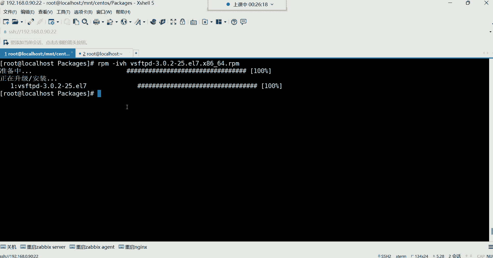

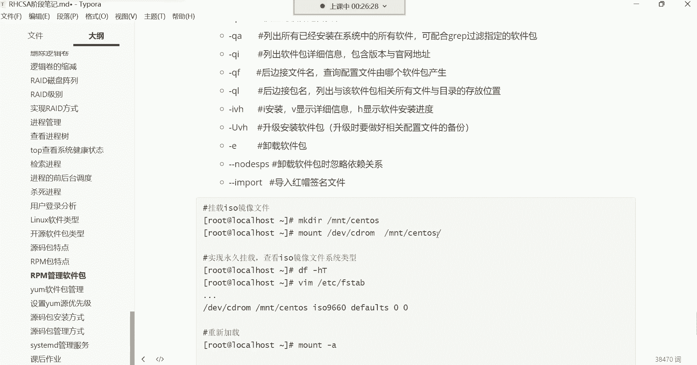

### 准备工作

本地仓库的软件包来源通常是系统安装镜像。首先，需要将镜像文件挂载到系统目录。

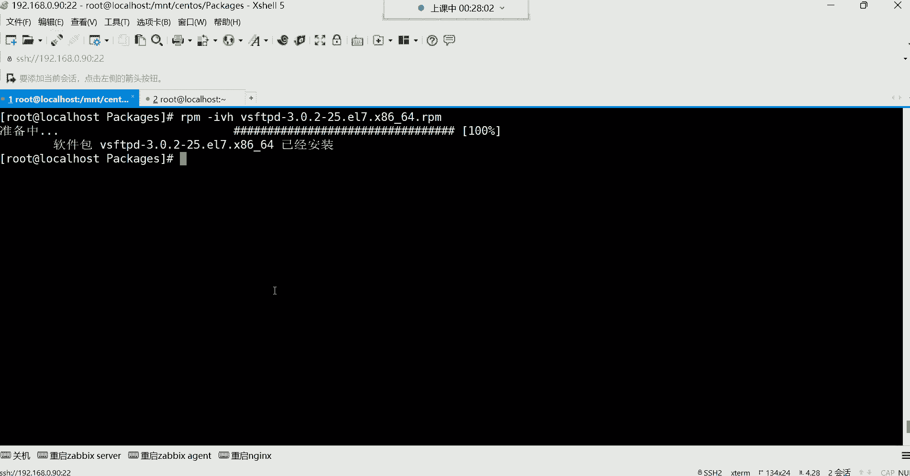

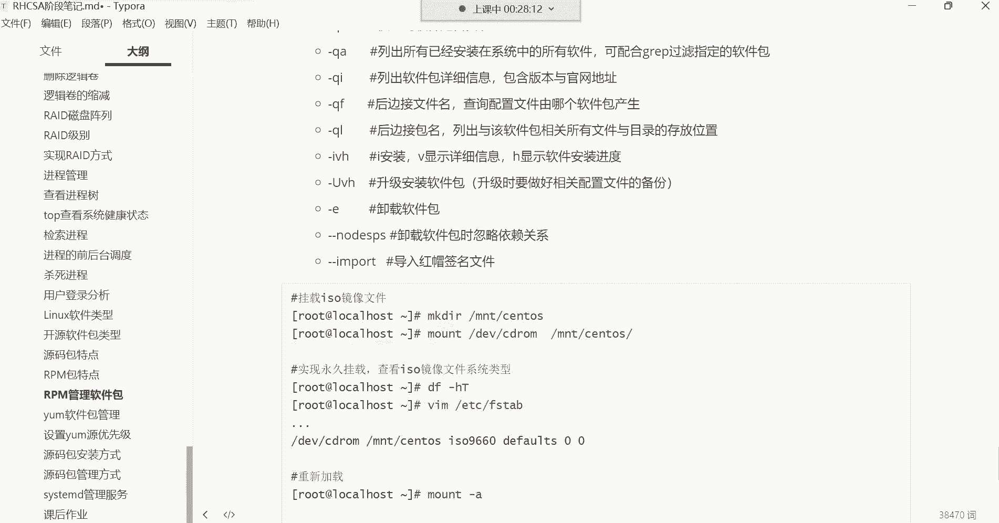

**以下是操作步骤：**

1.  **创建挂载点目录：**
    ```
    mkdir /mnt/cdrom
    ```

2.  **临时挂载光盘镜像：**
    ```
    mount /dev/cdrom /mnt/cdrom
    # 或指定ISO文件
    # mount -o loop /path/to/CentOS-7-x86_64-DVD-2009.iso /mnt/cdrom
    ```

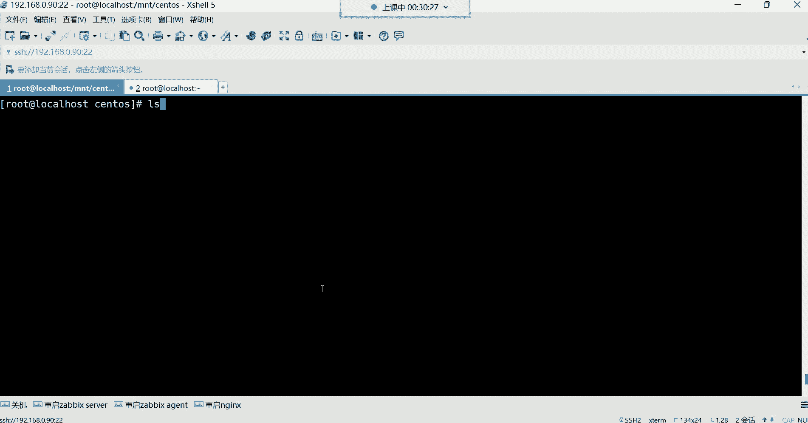

3.  **实现永久挂载：**
    编辑 `/etc/fstab` 文件，在末尾添加一行，实现开机自动挂载。
    ```
    vim /etc/fstab
    ```
    添加以下内容（文件系统类型可通过 `df -hT` 查看光驱类型，通常是 `iso9660`）：
    ```
    /dev/cdrom  /mnt/cdrom  iso9660  defaults  0 0
    ```
    保存退出后，执行 `mount -a` 加载所有配置，或重启系统。

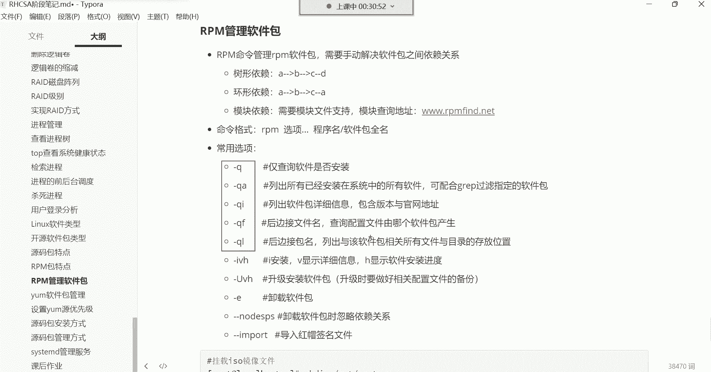

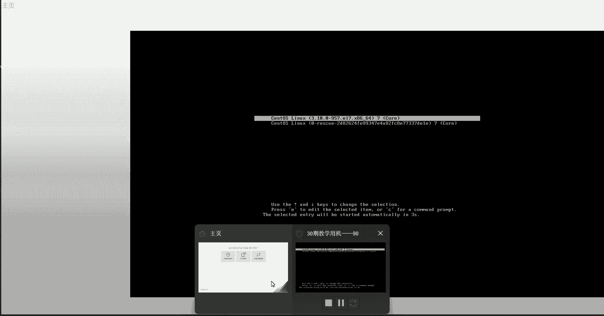

### 配置本地YUM仓库文件

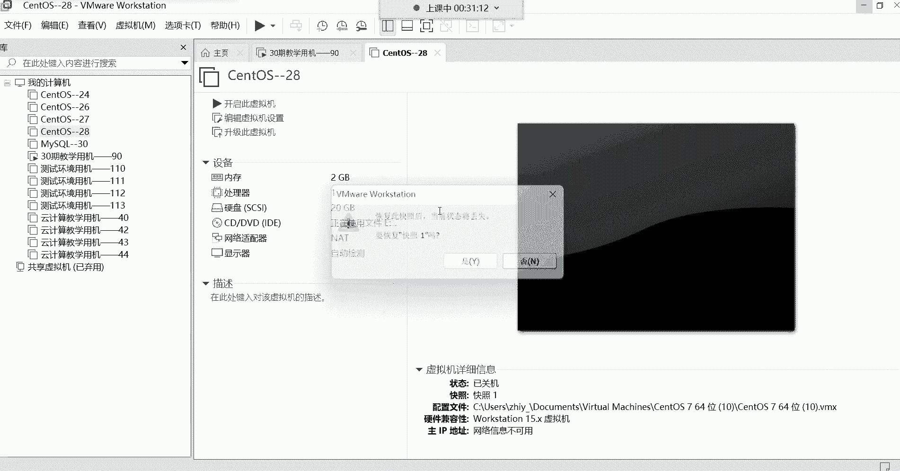

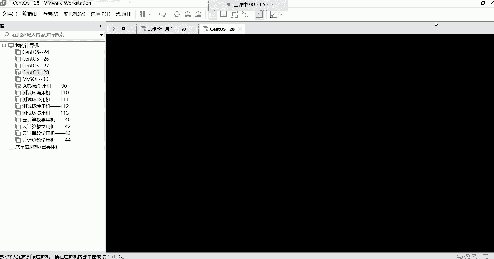

YUM仓库配置文件位于 `/etc/yum.repos.d/` 目录，后缀为 `.repo`。

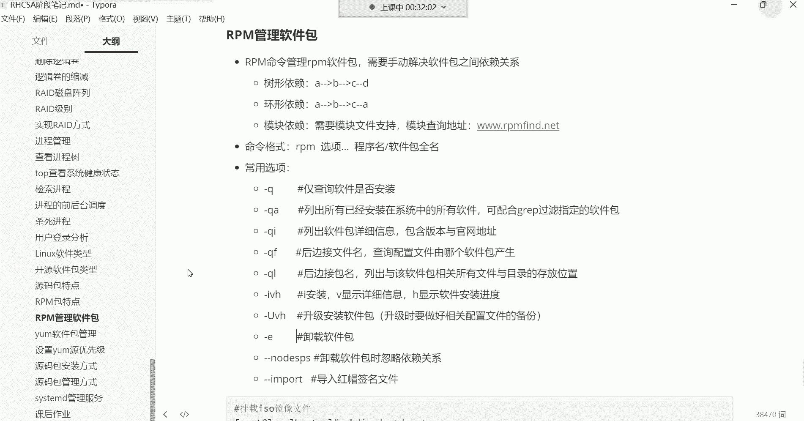

**以下是操作步骤：**

1.  **备份或移走原有的网络仓库配置文件（避免干扰）：**
    ```
    cd /etc/yum.repos.d/
    mkdir bak
    mv *.repo bak/
    ```

2.  **创建新的本地仓库配置文件：**
    ```
    vim /etc/yum.repos.d/local.repo
    ```

3.  **编写仓库配置内容：**
    将以下配置写入 `local.repo` 文件。
    ```
    [Local-Base]          # 仓库ID，唯一即可
    name=Local Repository # 仓库名称描述
    baseurl=file:///mnt/cdrom  # 仓库路径，file://表示本地文件协议
    enabled=1             # 启用此仓库
    gpgcheck=0            # 不检查GPG签名（如果检查，需配置gpgkey）
    # gpgkey=file:///mnt/cdrom/RPM-GPG-KEY-CentOS-7 # 如果gpgcheck=1，需指定密钥
    ```
    > **关键参数解释：**
    > *   `[Local-Base]`：仓库的唯一标识符。
    > *   `name`：仓库的描述信息。
    > *   `baseurl`：仓库的基准URL。本地路径使用 `file://` 开头。
    > *   `enabled`：是否启用此仓库（1启用，0禁用）。
    > *   `gpgcheck`：是否进行GPG签名校验（1检查，0不检查）。本地环境可设为0以简化操作。
    > *   `gpgkey`：GPG密钥文件的位置。

4.  **清除YUM缓存并测试：**
    ```
    yum clean all        # 清理旧缓存
    yum makecache        # 创建新缓存
    yum repolist all     # 列出所有已配置的仓库，查看local仓库是否成功启用
    ```

## YUM常用命令学习 🚀

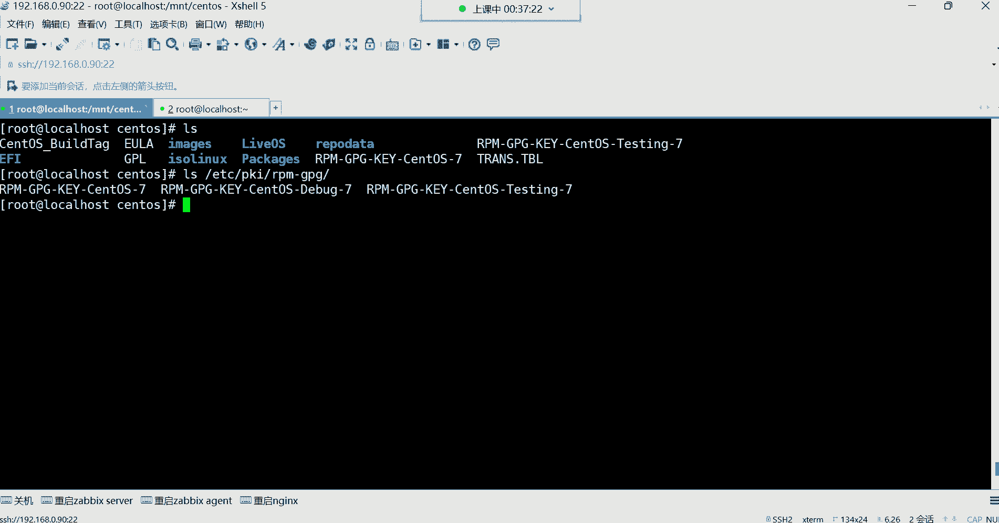

成功配置仓库后，我们就可以使用YUM命令来轻松管理软件了。以下是YUM最核心和常用的命令。

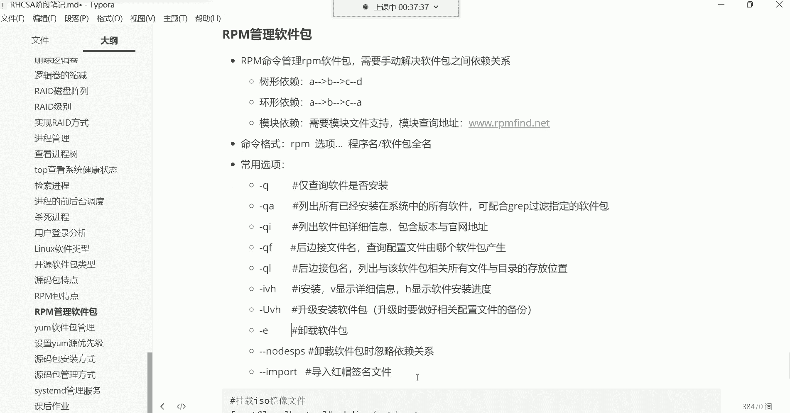

**以下是YUM常用命令列表：**

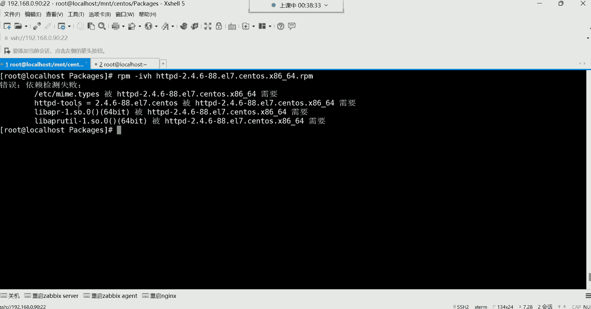

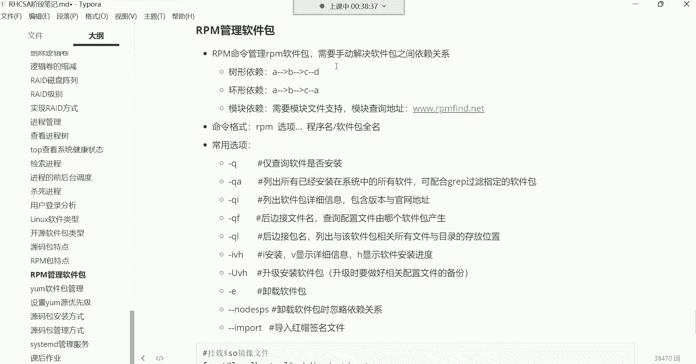

*   **搜索软件包：** `yum search [关键词]`
    *   示例：`yum search httpd` 搜索包含”httpd”的包。


*   **查看软件包信息：** `yum info [软件包名]`
    *   示例：`yum info httpd` 查看httpd包的详细信息。

*   **安装软件包：** `yum install [-y] [软件包名]`
    *   示例：`yum install -y httpd vim` 安装httpd和vim，`-y` 参数表示自动确认。
    *   **这是最常用的安装命令，YUM会自动解决所有依赖。**

*   **重新安装软件包：** `yum reinstall [软件包名]`
    *   示例：`yum reinstall httpd` 在配置文件损坏时非常有用。

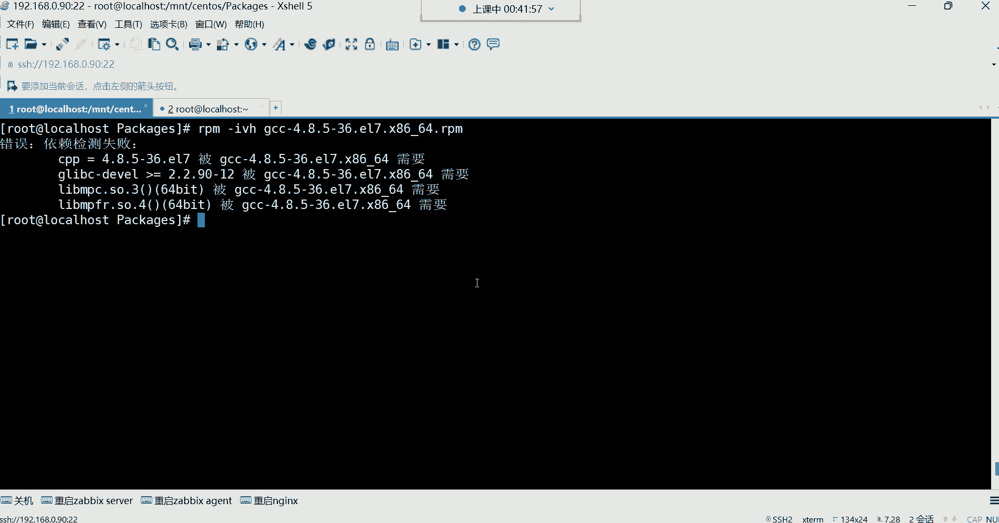

*   **检查可更新的软件包：** `yum check-update`

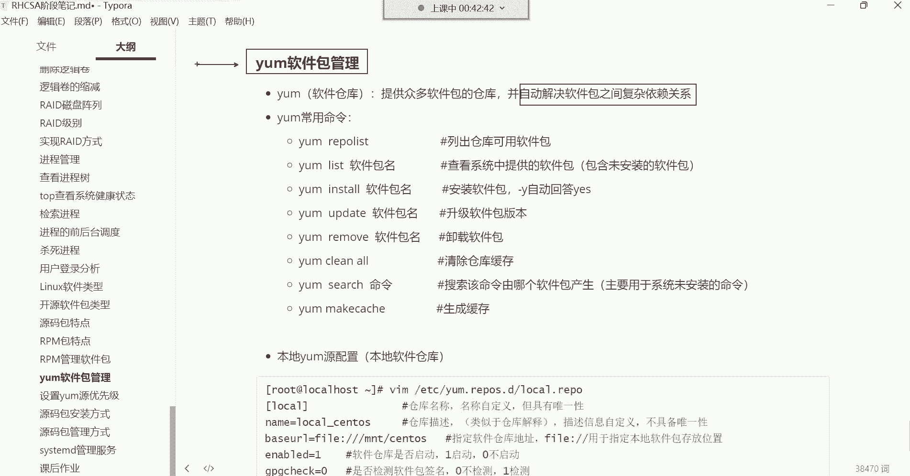

*   **更新指定软件包：** `yum update [软件包名]`
    *   示例：`yum update httpd` 更新httpd到仓库中的最新版本。

*   **更新所有软件包（系统升级）：** `yum update` **（生产环境慎用）**

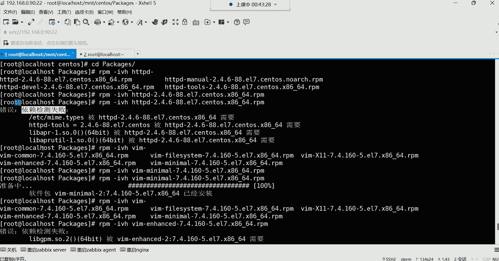

*   **卸载软件包：** `yum remove [软件包名]`
    *   示例：`yum remove httpd` 卸载httpd，**同样会自动处理依赖**。

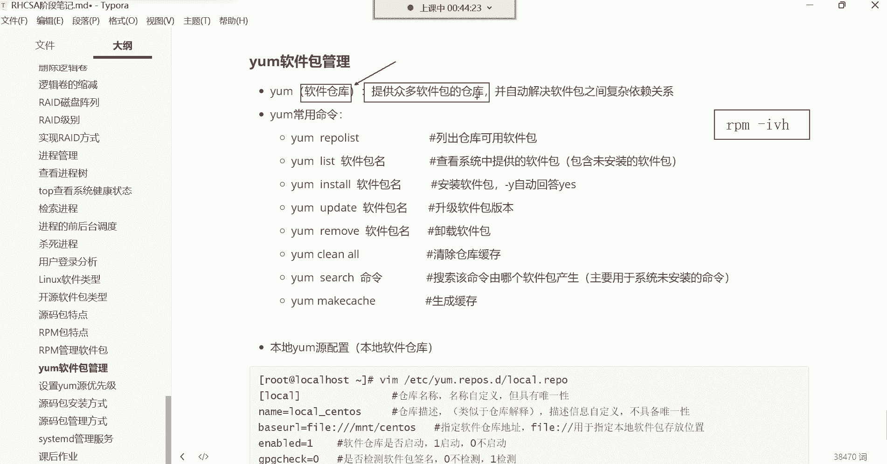

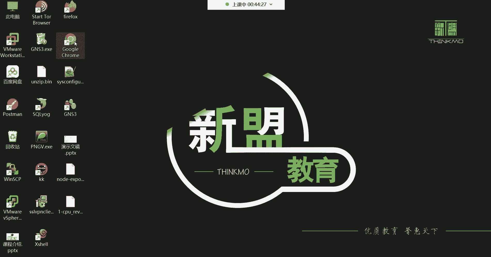

*   **查看已安装的软件包：** `yum list installed | grep [关键词]`


*   **查看某个文件由哪个软件包提供：** `yum provides [文件路径]`
    *   示例：`yum provides /etc/passwd` 查找提供 `/etc/passwd` 文件的包。

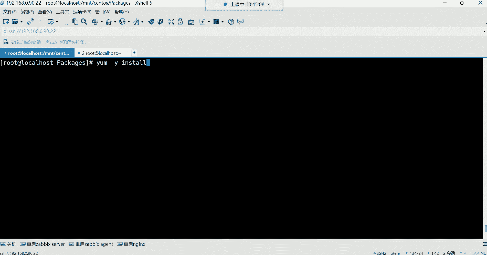

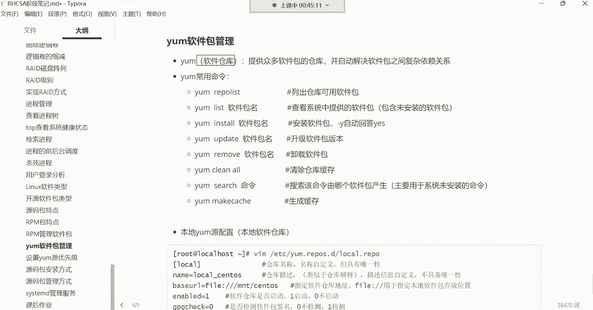

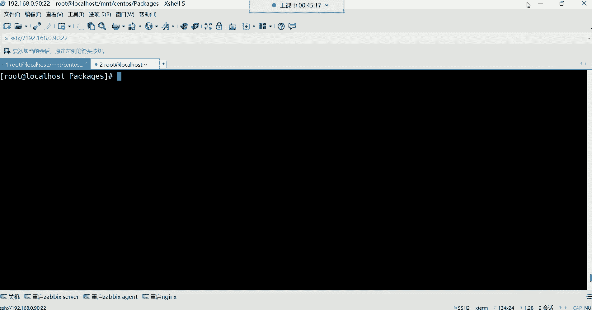

*   **查看仓库列表：** `yum repolist [all|enabled|disabled]`

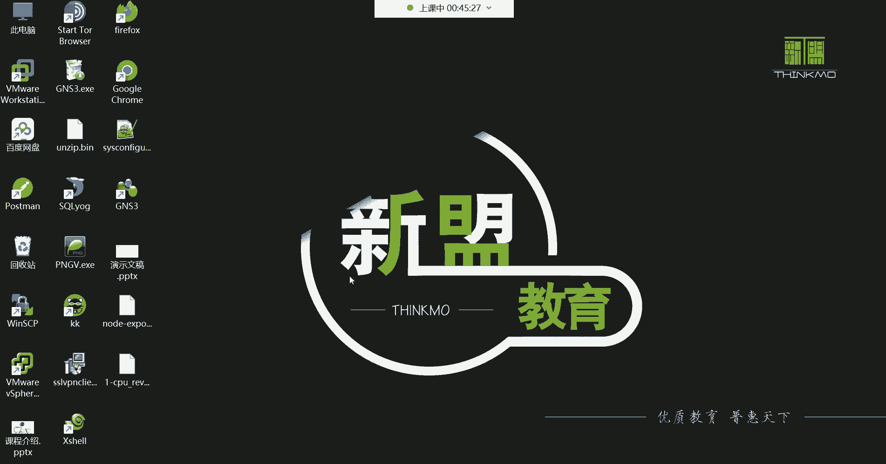

*   **清除缓存：** `yum clean [all|packages|metadata|...]`

---

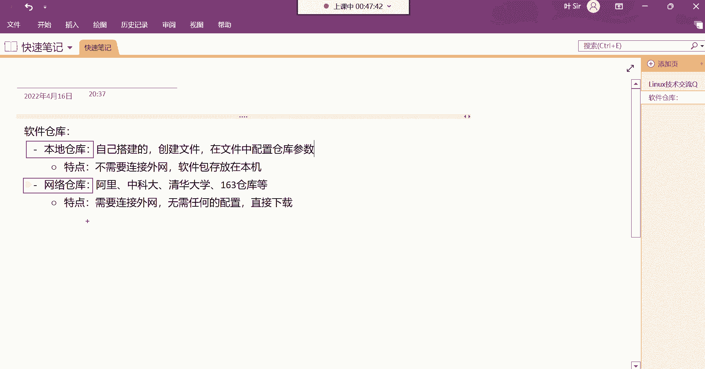

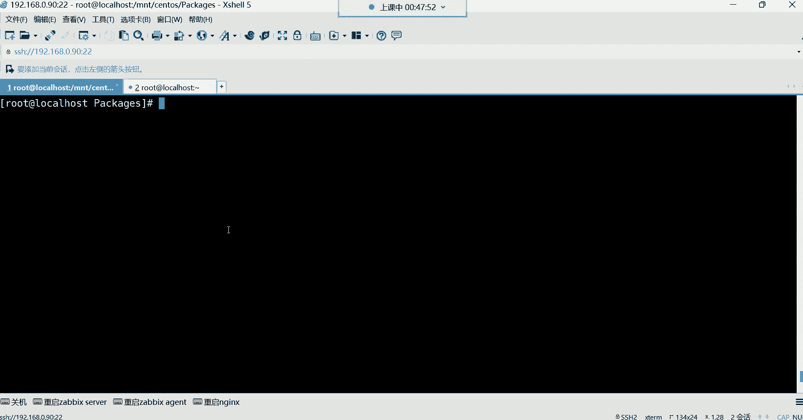

本节课中我们一起学习了RPM软件包的升级、卸载及签名验证，深刻理解了手动处理依赖关系的复杂性。随后，我们重点掌握了如何搭建本地YUM软件仓库，并学习了YUM的一系列常用命令。现在，你已能够在有网或无网环境下，高效、便捷地管理Linux系统中的软件包。记住，`yum install -y` 是你未来最亲密的伙伴之一。