# Linux最全RHCSA+RHCE培训教程合集：P38：编写脚本、脚本执行方式


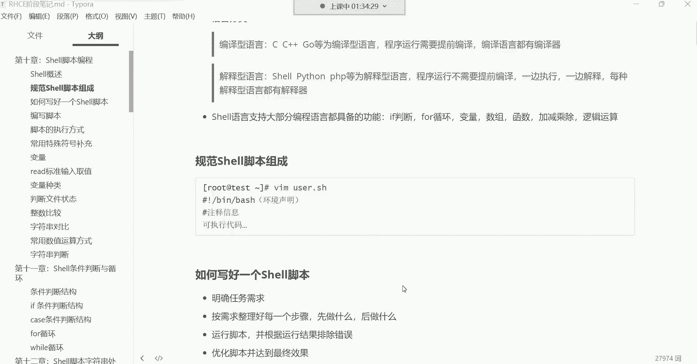

在本节课中，我们将要学习如何编写和执行Shell脚本。我们将从一个简单的“Hello World”脚本开始，逐步了解编写脚本的核心思想、注意事项以及如何避免常见问题。

---

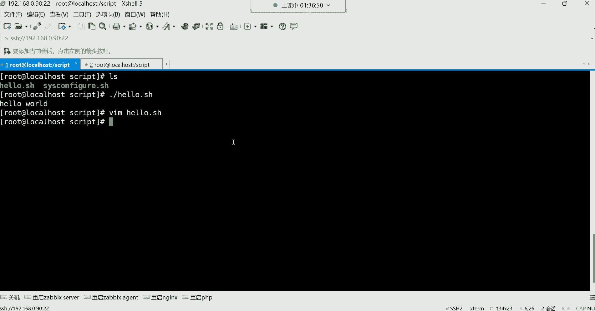

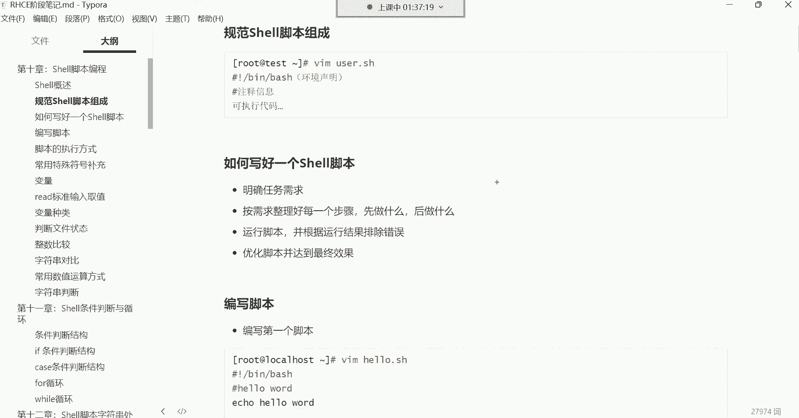

## 脚本编写入门：从“Hello World”开始

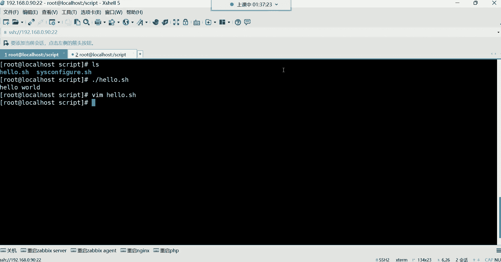


上一节我们介绍了脚本的基本概念。本节中，我们来看看如何编写一个最简单的脚本。

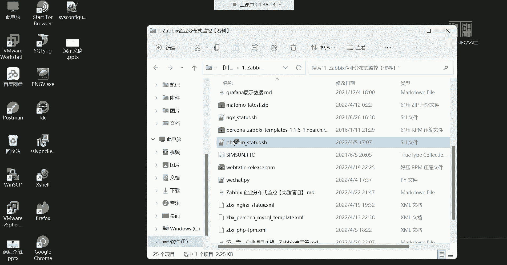

编程始于“Hello World”。无论是学习C语言、Python、Java还是Shell，第一个程序通常都是输出“Hello World”。这是一种传统，也是一种仪式。

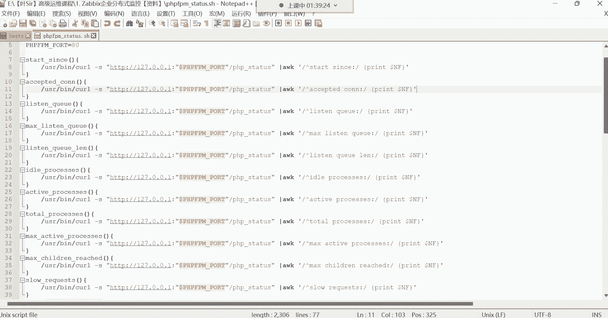

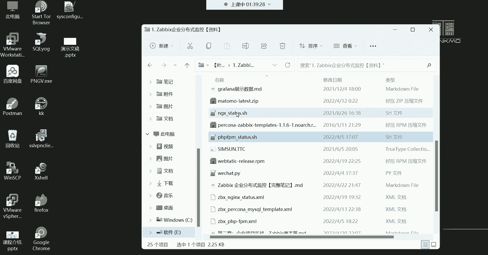

以下是一个最简单的Shell脚本示例：

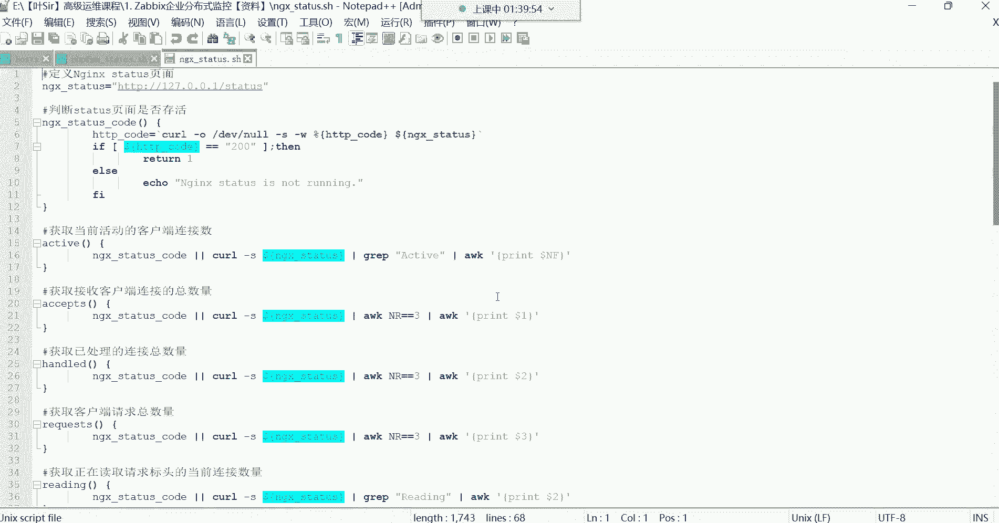

```bash
#!/bin/bash
echo "Hello World"
```

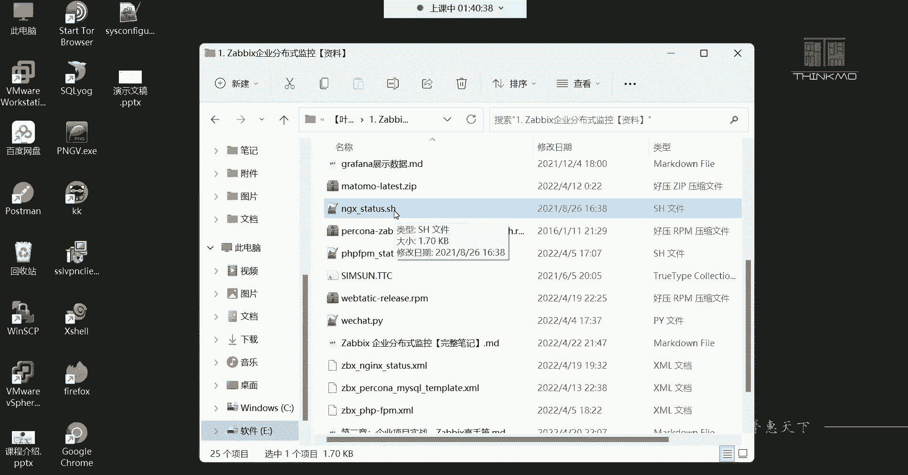

这个脚本的功能非常简单：使用`echo`命令输出“Hello World”。编写脚本的基本流程是：将命令写入文件，然后给文件添加执行权限，最后运行它。

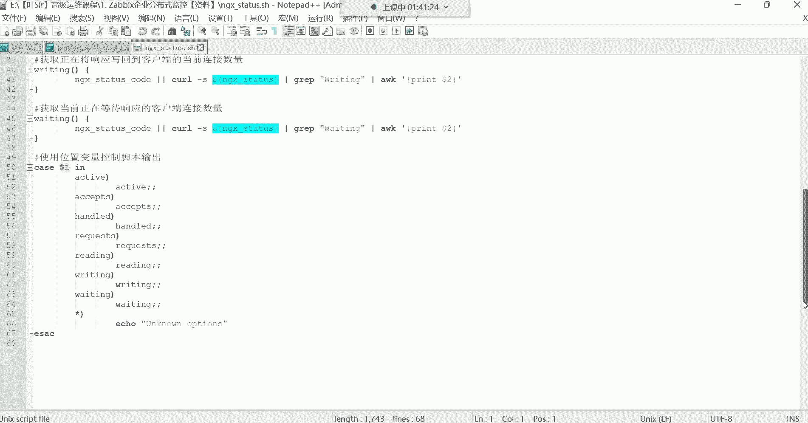

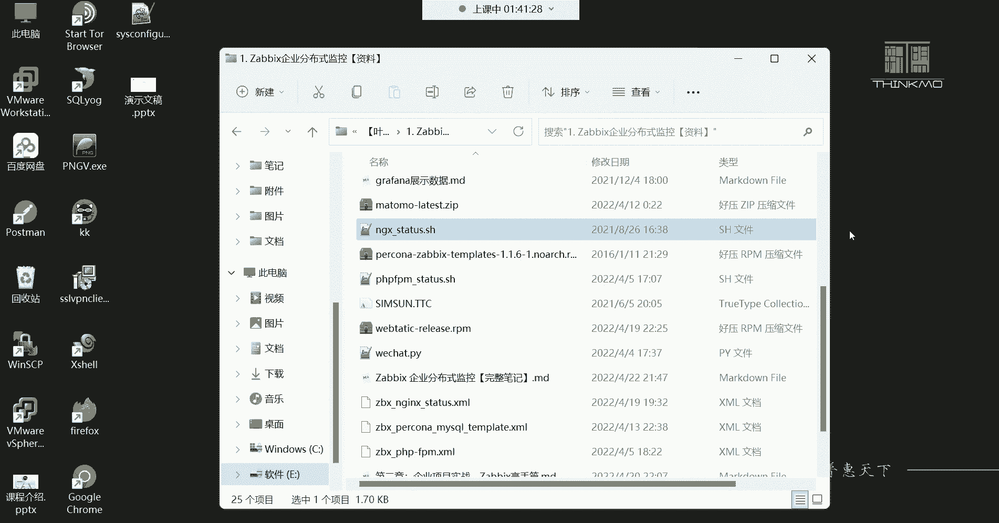

---

## 编写复杂脚本的思维逻辑

我们刚刚编写的脚本非常简单。但在实际工作中，脚本可能会非常复杂，包含上百行代码和复杂的逻辑。

以下是编写一个有效脚本的通用思维逻辑：

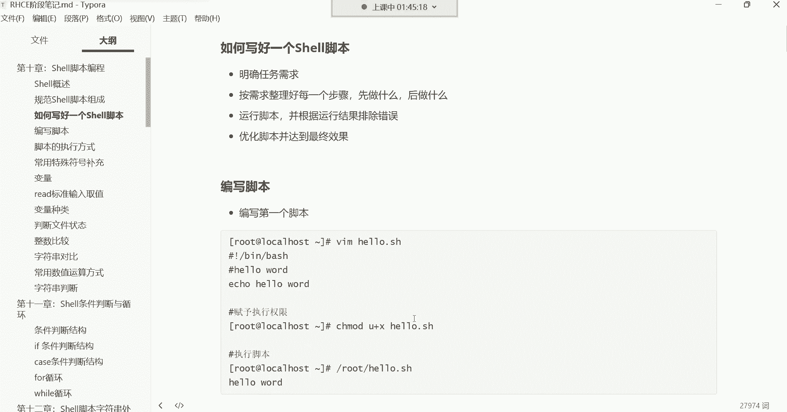

1.  **明确任务需求**：首先，你需要清楚脚本最终要实现什么目标。例如，搭建一个LAMP网站平台。
2.  **整理实现步骤**：将大目标分解为具体、可执行的步骤。先做什么，再做什么，每一步使用什么命令。
3.  **编写与测试**：将步骤转化为脚本命令，然后运行脚本进行测试。
4.  **调试与优化**：根据测试结果修改脚本中的错误，并优化其逻辑和性能，直到达成最终效果。

这个逻辑与解决生活中的问题相似。例如，追求心仪对象时，你需要先明确目标（建立关系），然后规划步骤（获取联系方式、增进了解、约会等），最后执行并调整策略。

---

## 脚本编写实践与注意事项

接下来，我们通过实践来深入理解脚本编写。我们将尝试编写一个创建系统用户并设置密码的脚本。

在命令行中，我们使用`useradd`创建用户，使用`passwd`设置密码。但在脚本中，直接使用`passwd`命令会遇到问题。

**交互式命令的问题**：
`passwd`命令是交互式的，执行时会等待用户输入密码。如果脚本中包含这样的命令，执行到此处就会“卡住”，直到手动输入密码，这违背了脚本自动执行的初衷。

以下是一个有问题的脚本示例：
```bash
#!/bin/bash
useradd us2
passwd us2
```
执行此脚本时，会在`passwd us2`处停止，等待输入。

**解决方案：使用非交互式方式设置密码**：
我们可以使用`echo`命令和管道`|`来非交互地提供密码。
```bash
#!/bin/bash
useradd us4
echo “1234” | passwd --stdin us4
```
这样，脚本就能独立、自动地完成用户创建和密码设置。

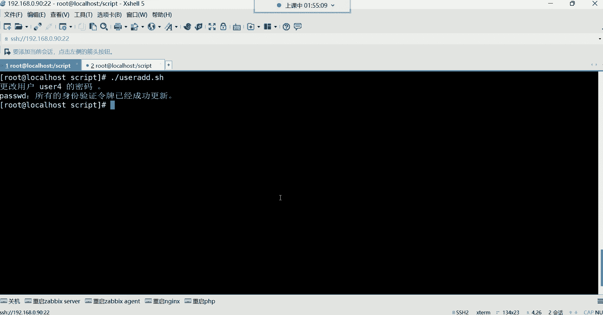

**核心思想**：脚本中应尽量避免使用交互式命令，确保脚本能够独立、无人值守地运行。其他常见的交互式命令还包括`vim`。


---

## 编写系统信息查看脚本

让我们编写一个更实用的脚本，用于查看多项系统信息。

在命令行中，我们使用一系列命令查看信息：
- 系统版本：`cat /etc/centos-release`
- 内核版本：`uname -rs`
- 磁盘使用：`df -h /`
- 网卡信息：`ifconfig ens32`
- 主机名：`hostnamectl`

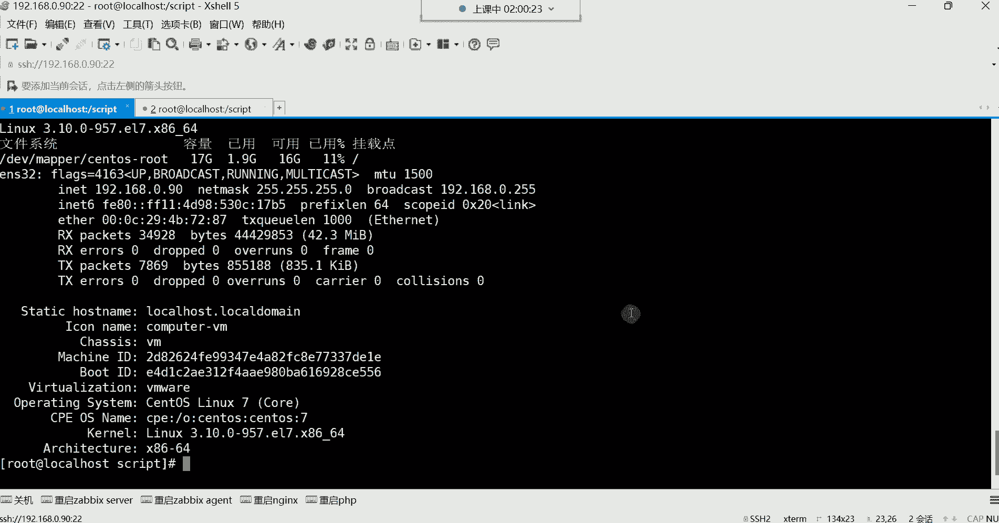

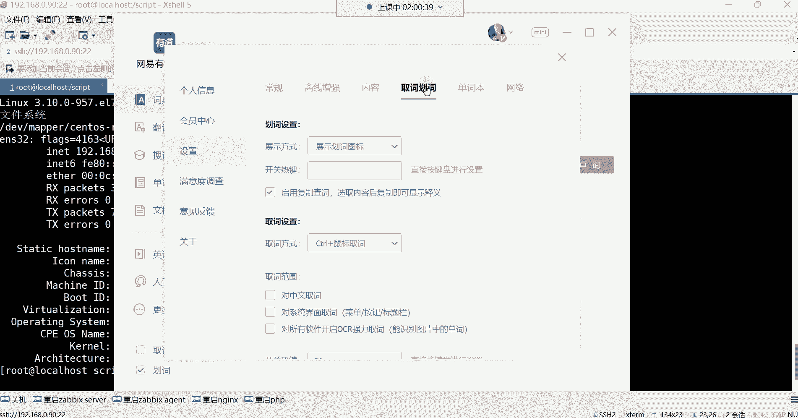

将这些命令整合到一个脚本中：
```bash
#!/bin/bash
cat /etc/centos-release
uname -rs
df -h /
ifconfig ens32
hostnamectl
```
给脚本添加执行权限并运行，它会依次执行所有命令并输出结果。脚本的本质就是命令的有序堆积。

为了提升脚本的可读性和用户体验，我们可以添加一些提示信息和停顿：
```bash
#!/bin/bash
echo “第一步：查看系统版本信息”
cat /etc/centos-release
sleep 3

echo “第二步：查看内核信息”
uname -rs
sleep 3

echo “第三步：查看根分区使用情况”
df -h /
sleep 3
```
`echo`用于输出提示，`sleep 3`让脚本暂停3秒，使输出更清晰。

---

## 脚本的存放与共享

脚本写好后，存放位置也有讲究。
*   **个人使用**：可以放在自己的家目录（如`/root`或`/home/用户名`）。
*   **与他人共享**：如果需要让其他用户也能使用你的脚本，就不能放在权限受限的个人目录。通常可以在根目录下创建一个公共目录（如`/scripts`），设置合适的权限，并将脚本放在那里。

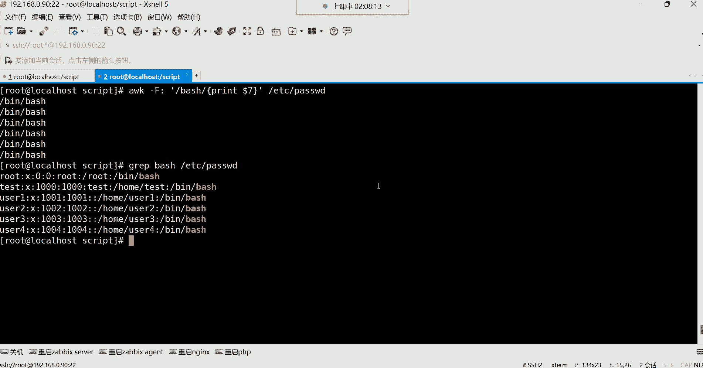

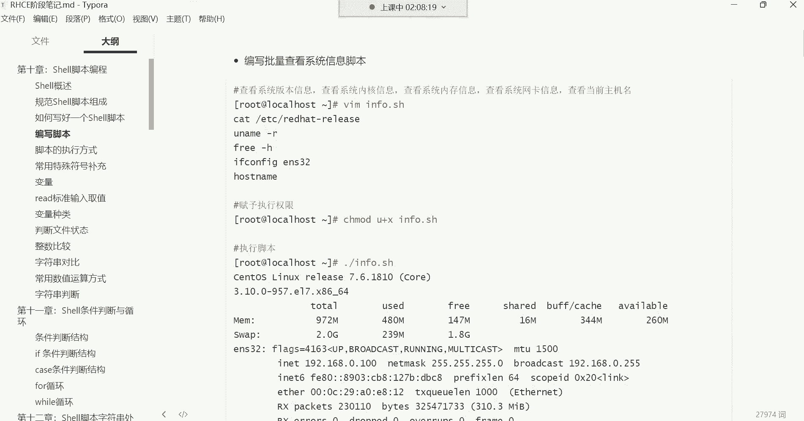

---

## 总结

本节课中我们一起学习了Shell脚本的编写与执行。
1.  我们从一个简单的“Hello World”脚本开始，理解了脚本的基本结构。
2.  我们探讨了编写复杂脚本所需的思维逻辑：明确需求、分解步骤、测试优化。
3.  我们实践了脚本编写，并**重点学习了必须避免在脚本中使用交互式命令（如`passwd`、`vim`）**，掌握了使用非交互方式（如`echo “密码” | passwd --stdin 用户名`）解决问题的方法。
4.  我们编写了一个查看系统信息的实用脚本，并学会了使用`echo`和`sleep`命令来改善脚本的输出效果和用户体验。
5.  最后，我们了解了脚本存放位置的选择依据。

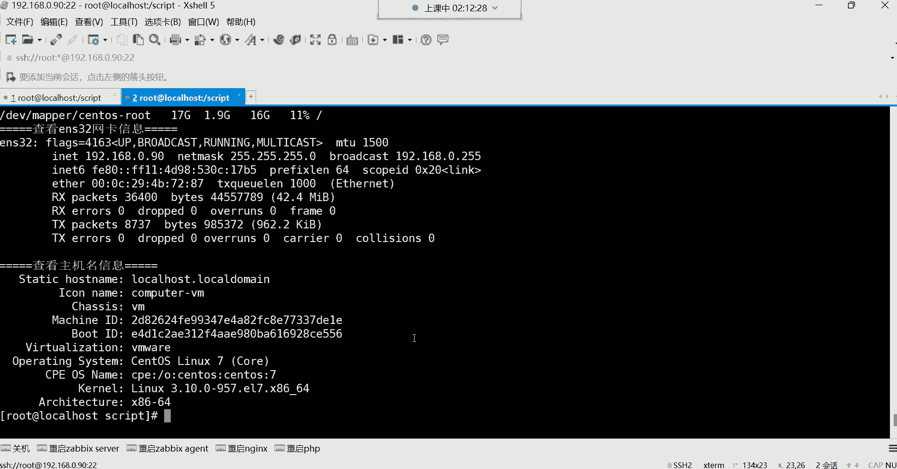

记住，脚本的核心目标是自动化。一个好的脚本应该能够清晰、独立、无误地完成预定任务。随着后续学习更多命令和Shell工具（如sed、awk），你将能编写出更强大、更智能的脚本。