# Linux最全RHCSA+RHCE培训教程合集：P39：编写脚本、脚本执行方式 🚀

在本节课中，我们将学习如何编写一个实用的Shell脚本，并探索如何优化脚本，使其执行过程更清晰、输出更友好。我们将通过一个“搭建本地YUM仓库”的实例，来掌握脚本编写的基本流程和常用技巧。

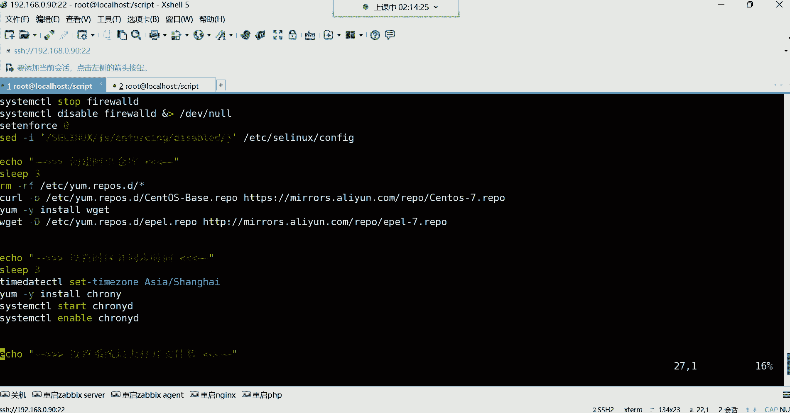


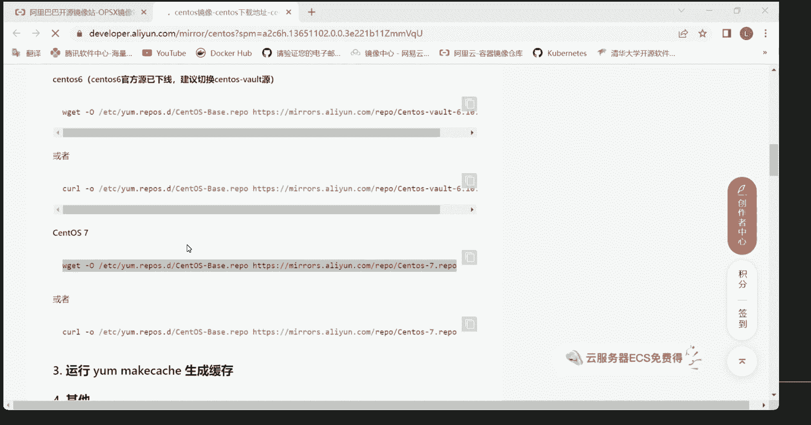

---

## 脚本编写基础与执行控制

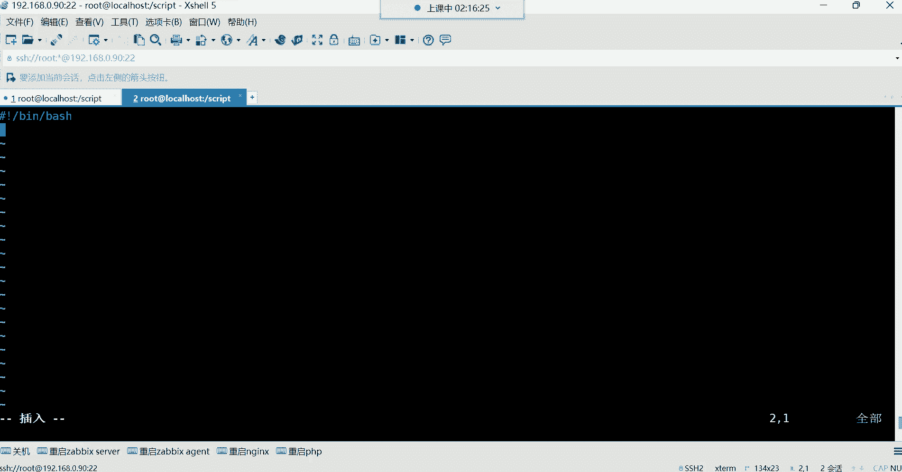

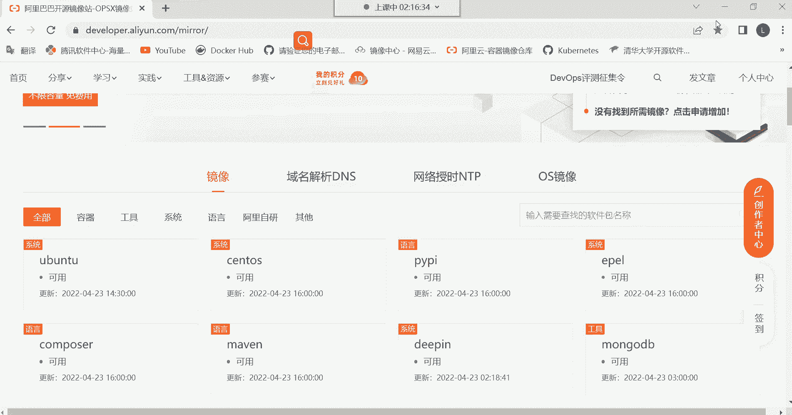

上一节我们介绍了脚本的基本概念。本节中，我们来看看如何控制脚本的执行节奏，并理解脚本中注释的用法。

如果命令执行过快，输出信息会一闪而过，用户难以看清执行步骤。为了让用户能看清每一步的输出，可以在脚本中使用 `sleep` 命令。

`sleep` 命令的功能是让系统“休眠”指定的秒数，其基本语法是：
```bash
sleep <秒数>
```
例如，`sleep 3` 表示暂停执行3秒钟。它并非让命令执行变慢，而是在执行完当前语句后，等待一段时间，再执行下一条语句。这样可以为用户提供清晰的停顿，便于观察脚本每一步在做什么。

关于脚本中的注释，需要说明的是：
*   注释以 `#` 开头。
*   注释内容不区分英文或中文，两者皆可。

---

## 分析现有脚本与命令提取

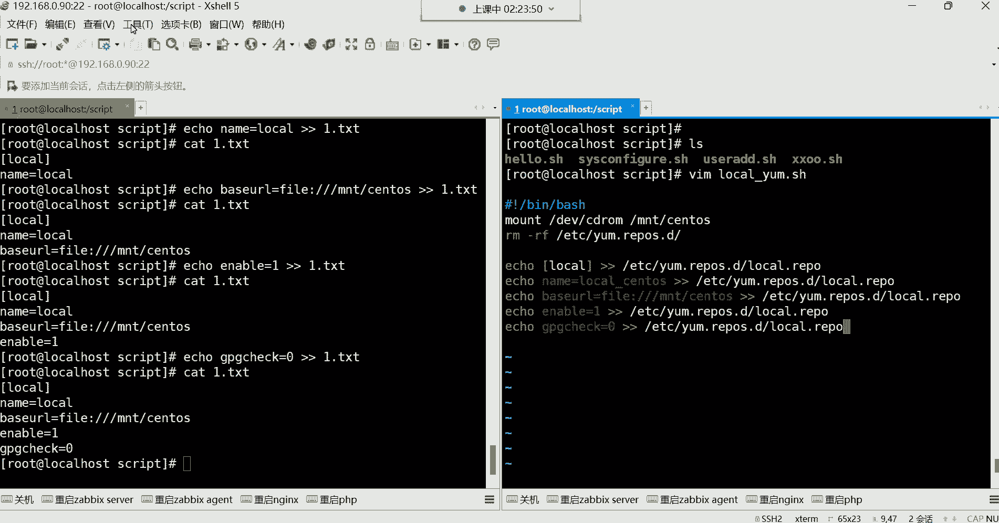

以下是分析现有复杂脚本的方法。面对一个包含许多未学命令的脚本时，不必慌张。

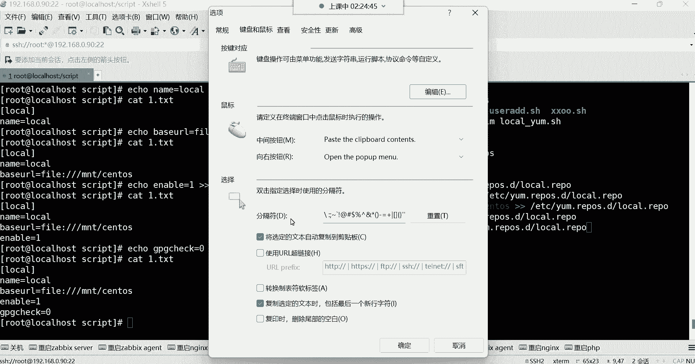

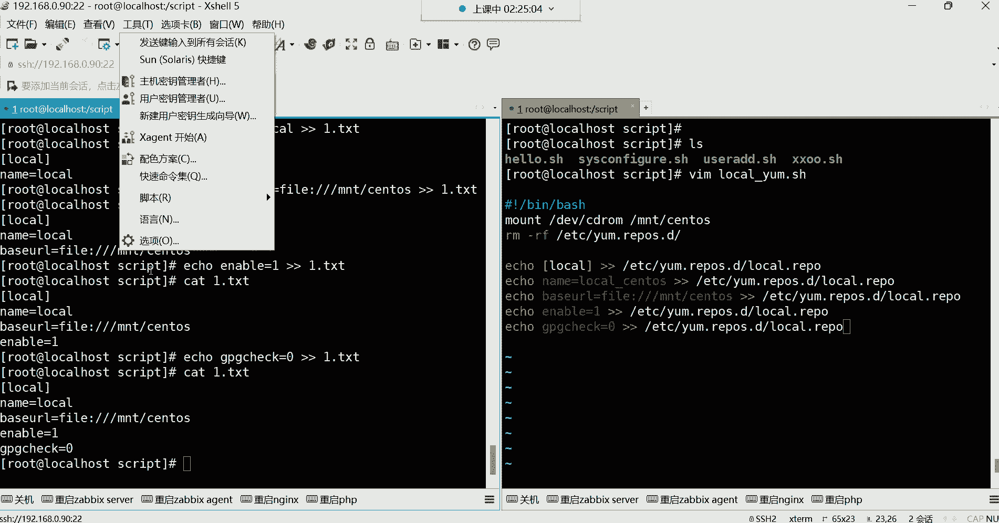

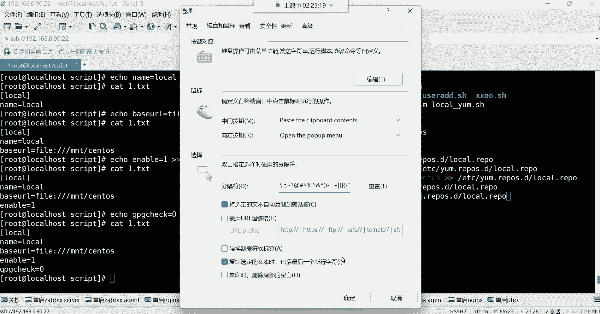

很多命令（例如防火墙相关的命令）可能尚未学习，这没有关系。我们的方法是：**挑能看懂的部分理解**。

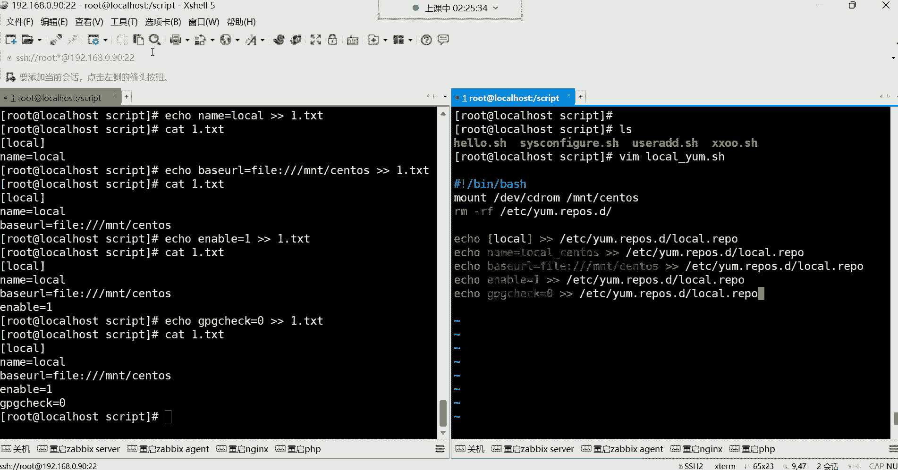


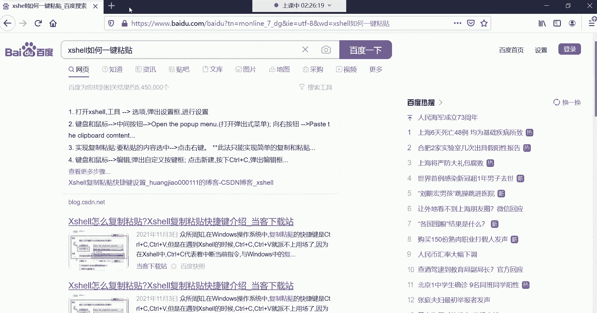

例如，在一个搭建网络仓库的脚本中，可以看到以下关键步骤：
1.  使用 `rm -rf` 清空YUM仓库配置目录。
2.  使用 `wget` 或 `curl` 命令下载阿里云仓库的配置文件。
3.  这些命令通常是从官方文档复制粘贴而来，不需要自己从头编写。


这种方法的本质是：将一系列手动执行的命令，按顺序保存到一个脚本文件中。

---

## 实战：编写本地YUM仓库搭建脚本

现在，让我们动手编写一个自己的脚本，用于搭建本地YUM仓库。

首先创建脚本文件并指定解释器：
```bash
vim local_yum.sh
```
在文件第一行写入：
```bash
#!/bin/bash
```
`#!/bin/bash` 是一个固定的格式，称为“Shebang”，它告诉系统使用哪个解释器来执行此脚本。

脚本的第一步是挂载光盘镜像。如果之前已经挂载，需要先卸载以保证环境干净：
```bash
umount /mnt/centos
mount /dev/cdrom /mnt/centos
```

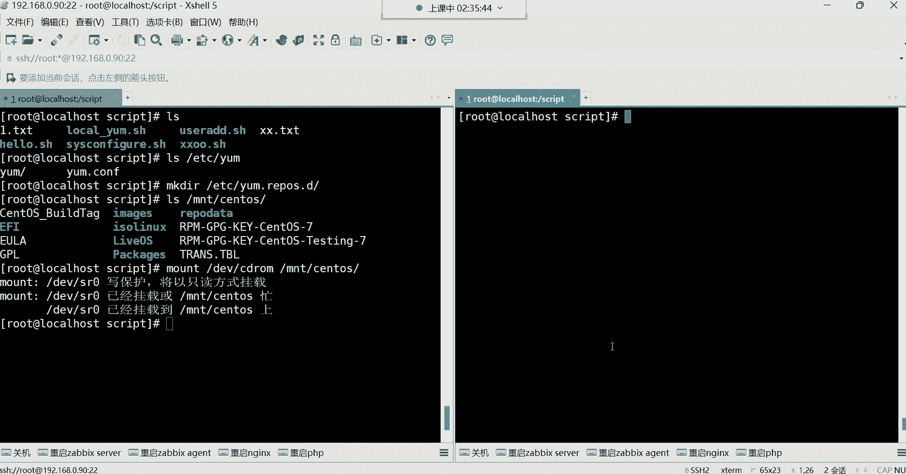

接下来，清空YUM仓库配置目录下的所有现有文件（注意：是删除目录下的文件，而非目录本身）：
```bash
rm -rf /etc/yum.repos.d/*
```

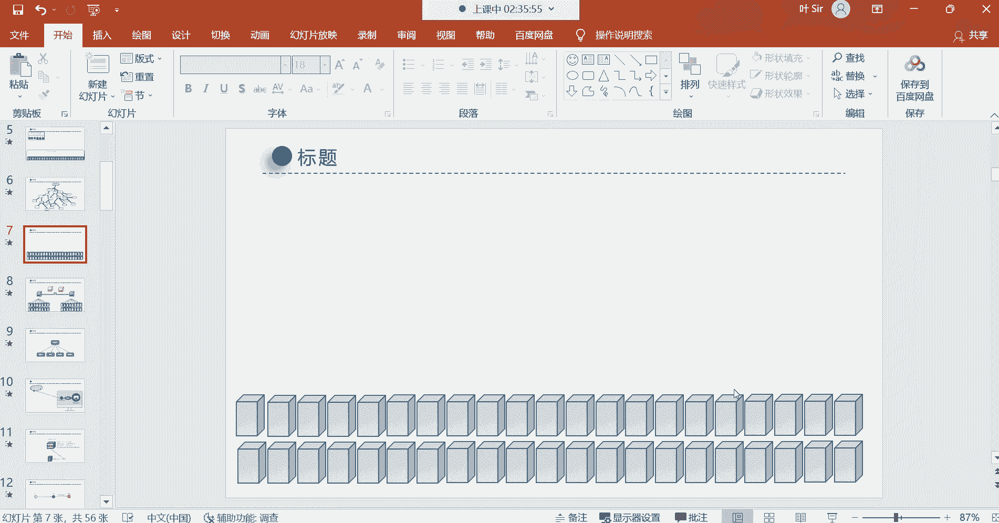

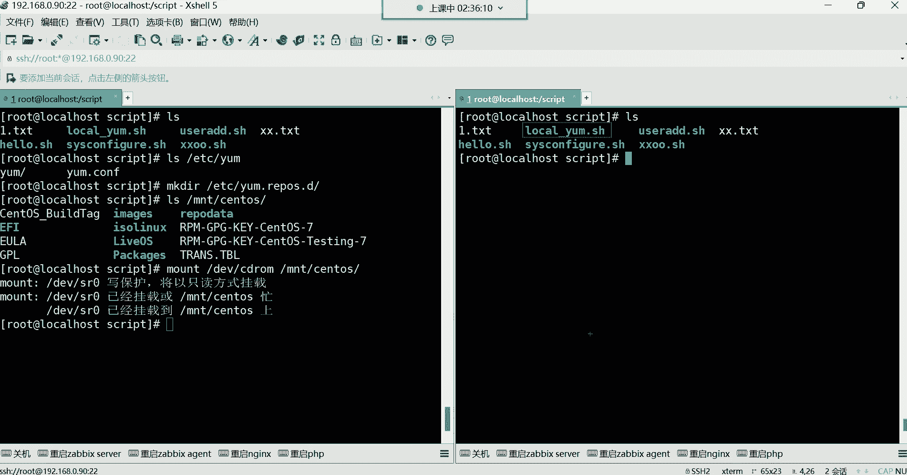

---

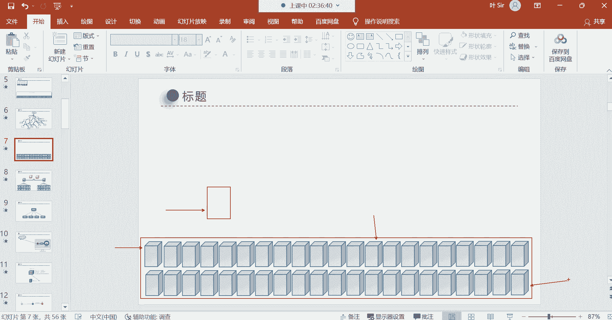

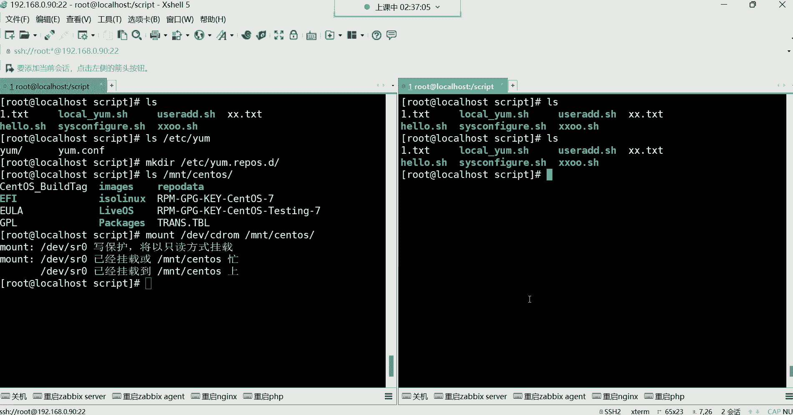

## 向文件写入内容：`echo` 与 `cat` 方法对比

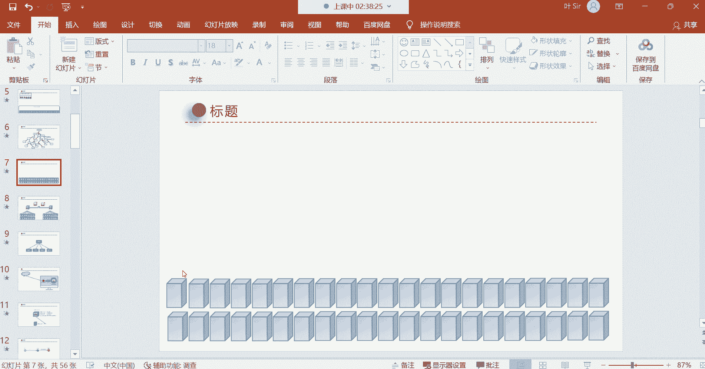

我们需要创建仓库配置文件并向其中写入内容。在交互式环境中可以用 `vim`，但在脚本中需要使用非交互式方法。

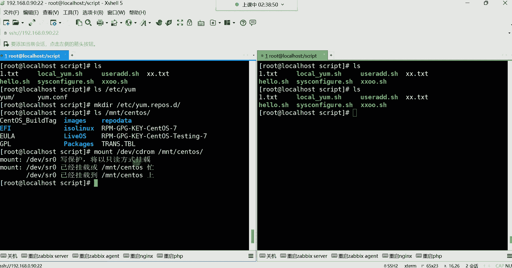

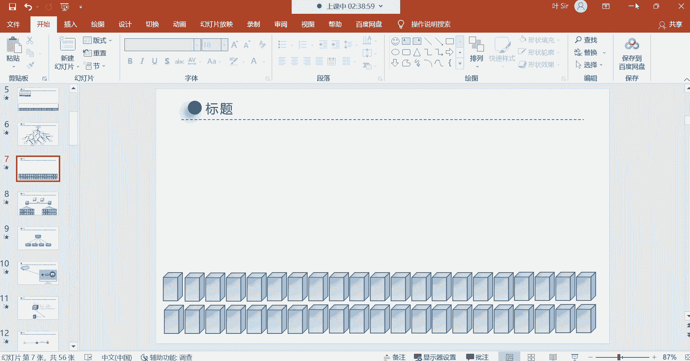


**方法一：使用 `echo` 命令（不推荐用于多行内容）**
`echo` 命令可以将文本输出到屏幕或文件。结合重定向符号 `>`（覆盖）和 `>>`（追加），可以写入文件。
```bash
echo “[local]” > /etc/yum.repos.d/local.repo
echo “name=local” >> /etc/yum.repos.d/local.repo
```
此方法需要为每一行内容重复执行 `echo` 和重定向，代码冗长，缺乏效率。

**方法二：使用 `cat` 命令配合“Here Document”（推荐）**
这是一种更优雅的方式，可以一次性写入多行内容。
```bash
cat > /etc/yum.repos.d/local.repo << EOF
[local]
name=local
baseurl=file:///mnt/centos
enabled=1
gpgcheck=0
EOF
```
*   `cat > file`：将后续输入重定向到 `file`。
*   `<< EOF`：开始“Here Document”，直到遇到独立的 `EOF` 为止，中间的所有内容都会作为输入。
*   `EOF`：结束标记。`EOF` 是一个约定俗成的标记，可以替换成其他任意字符串（如 `END`），但需前后一致。

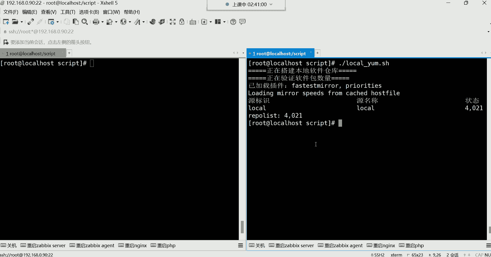

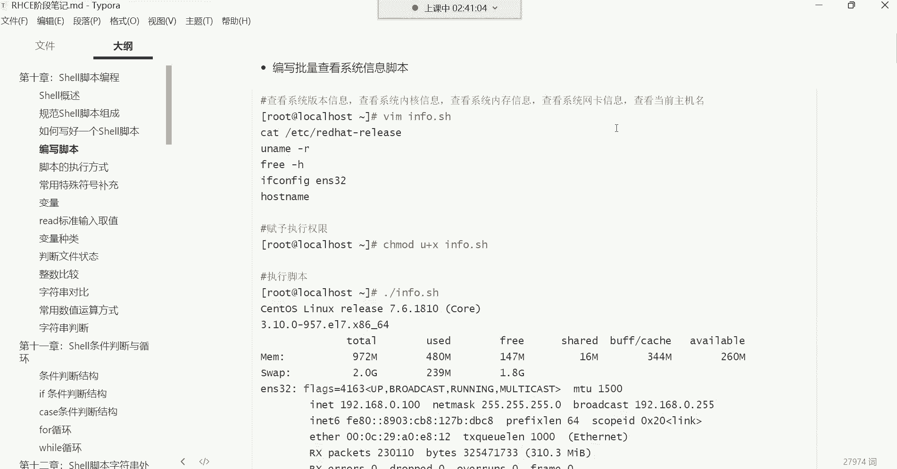

此方法用一条命令就完成了多行内容的写入，是脚本中的常用技巧。

---

## 脚本的验证、执行与优化思路

脚本主体编写完成后，可以添加命令来验证仓库是否配置成功。
```bash
yum repolist
```
保存并退出脚本文件后，需要为其添加执行权限：
```bash
chmod +x local_yum.sh
```
然后执行脚本：
```bash
./local_yum.sh
```

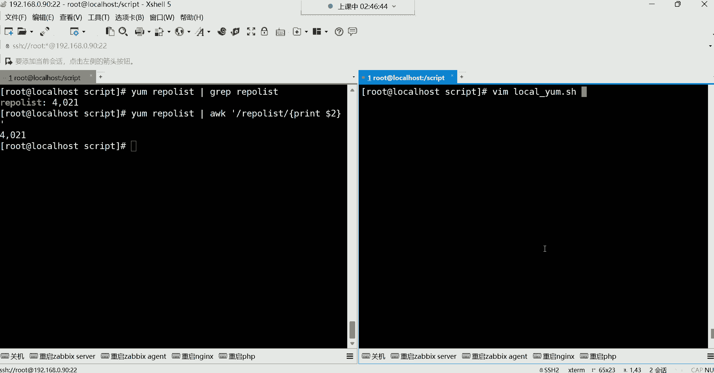

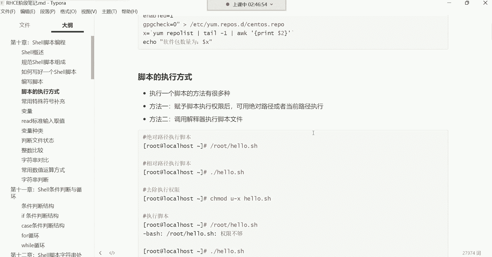

执行后，使用 `yum repolist` 命令可以看到仓库中的软件包数量，即表示成功。

为了让脚本更友好，我们可以进行优化：
1.  **添加提示信息**：使用 `echo` 在关键步骤前输出说明。
2.  **控制输出**：默认的 `yum repolist` 输出信息较多。可以使用管道 `|` 和 `grep` 命令过滤出关键行。
    ```bash
    yum repolist | grep repolist
    ```
3.  **进一步提取**：如果只想显示数字，可以结合 `awk` 命令（后续课程会详细讲解）。
    ```bash
    yum repolist | awk ‘/repolist/{print $2}’
    ```
4.  **使用变量增强可读性**：将命令结果存入变量，然后用清晰的语句输出。
    ```bash
    package_count=$(yum repolist | awk ‘/repolist/{print $2}’)
    echo “本地仓库软件包总数量为：$package_count 个”
    ```
5.  **增加“体验感”**：例如，可以添加一个简单的进度条动画（使用循环和 `sleep` 实现），虽然不反映真实进度，但能提升交互感。这是一个固定的代码片段，需要时可直接使用。

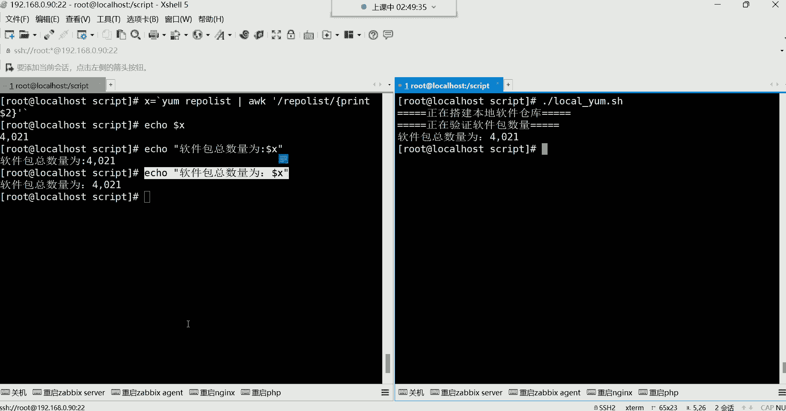

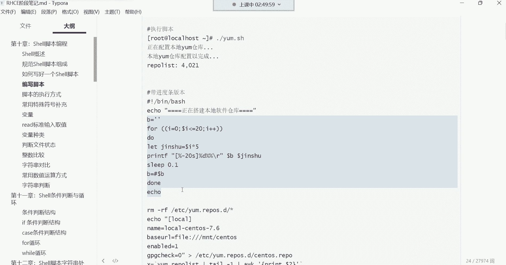

---

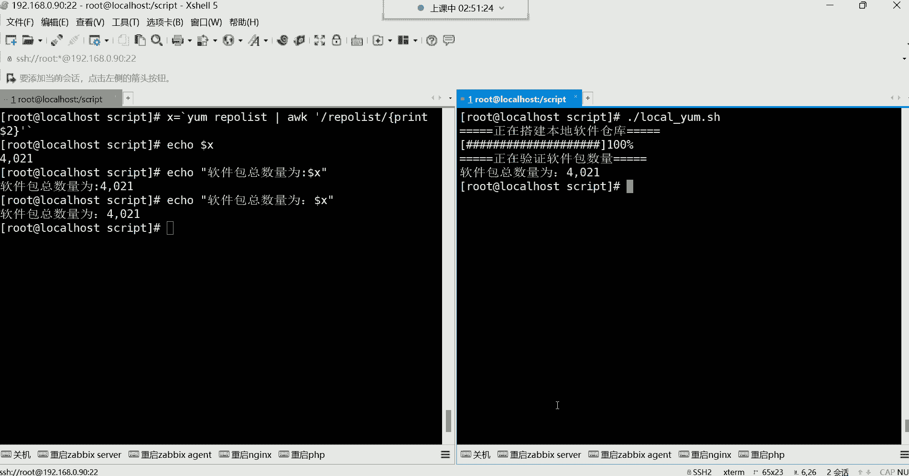

## 总结与脚本的价值

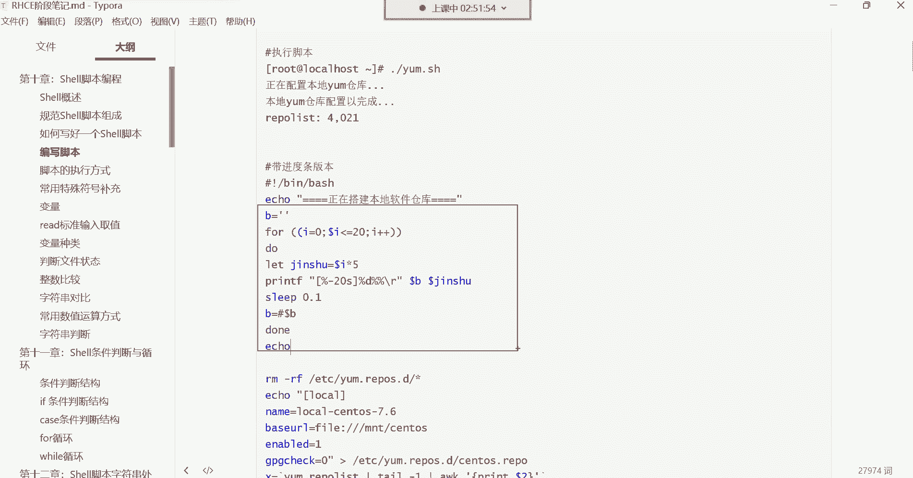

本节课中我们一起学习了如何编写一个完整的Shell脚本。

我们从控制脚本执行节奏开始，分析了理解复杂脚本的方法。然后，我们动手实践，编写了一个用于搭建本地YUM仓库的脚本，并对比了向文件写入内容的两种方法。最后，我们探讨了多种优化脚本的思路，包括添加提示、过滤输出、使用变量以及增加视觉效果。

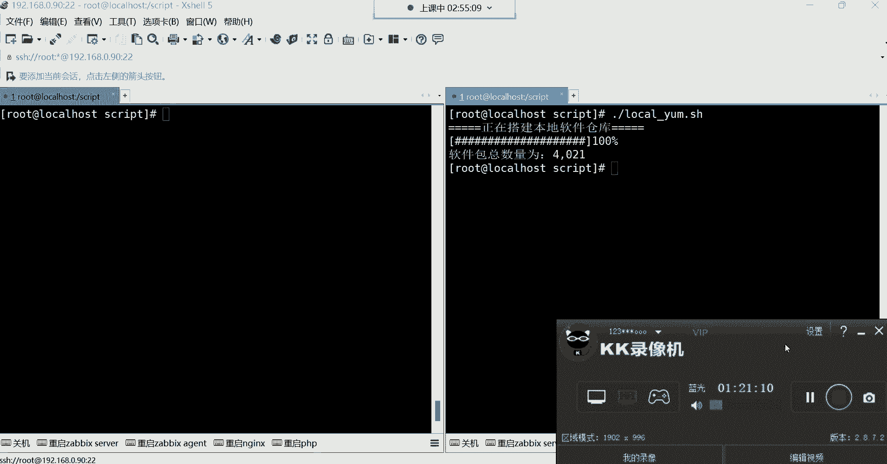

脚本的核心价值在于**将重复、繁琐的操作自动化**。一旦写好一个脚本，就可以在任意多台服务器上重复使用，极大地提升了工作效率。随着后续学习更高级的工具（如Ansible），甚至可以实现在一个控制点上批量管理成百上千台服务器，这正是自动化运维的魅力所在。