# Linux最全RHCSA+RHCE培训教程合集：P3：虚拟机网络配置、远程连接与Linux岗位介绍

在本节课中，我们将学习如何配置虚拟机的网络环境，以便使用远程连接工具进行管理。同时，我们也将了解Linux系统的应用领域以及相关的职业岗位，帮助你明确未来的学习和发展方向。

## 系统登录与初始界面

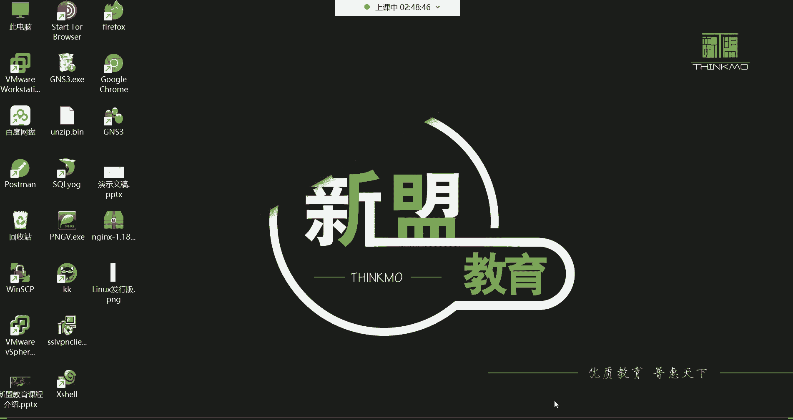

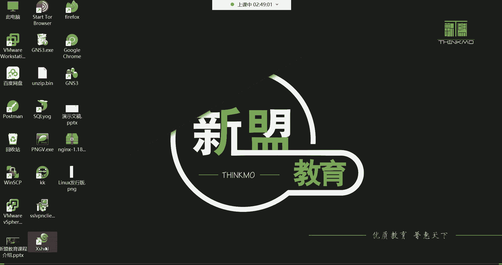

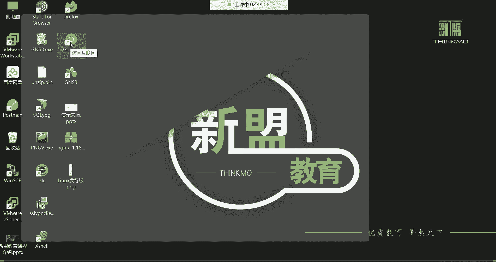

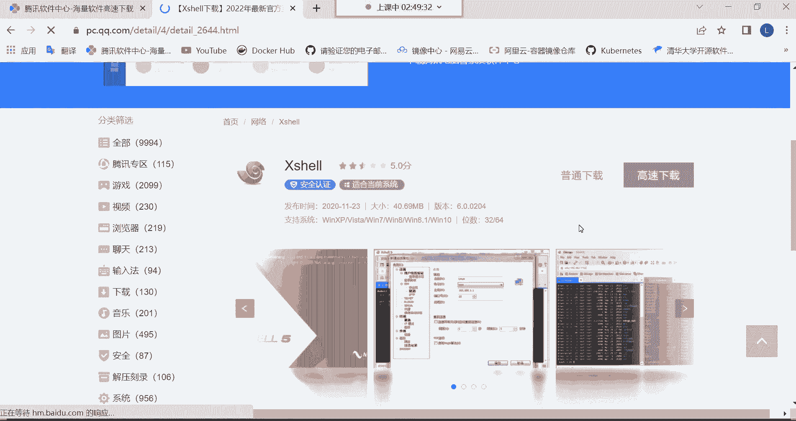

上一节我们完成了系统的安装。系统安装好后，需要重启。重启后，我们会看到一个命令行登录界面，提示 `localhost login:`。

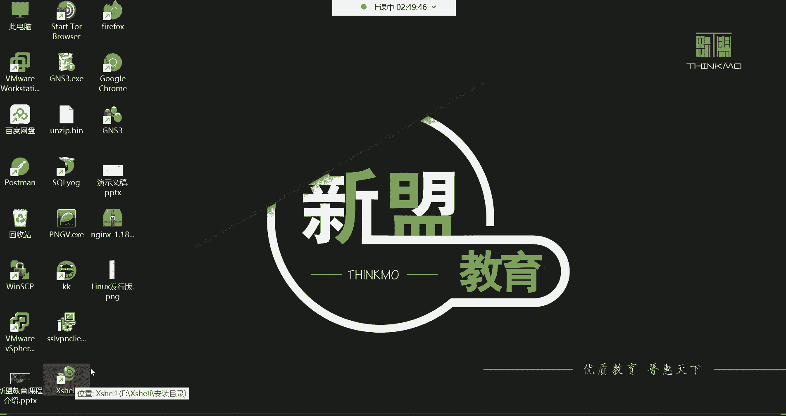

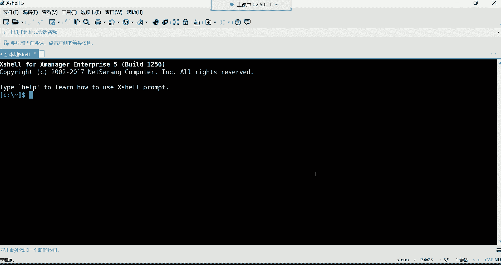

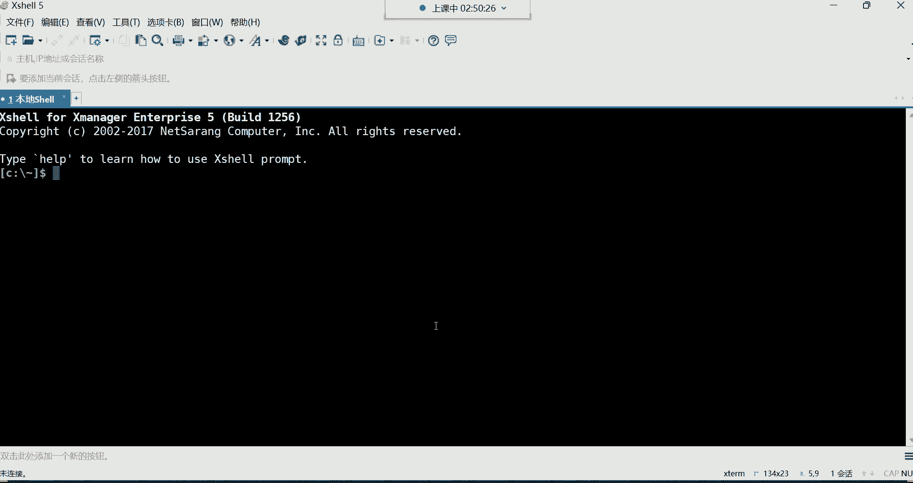

在这个界面，我们需要使用 `root` 用户登录。输入 `root` 后按回车，然后输入安装时设置的密码（输入时不会显示），再次按回车即可登录成功。登录后，命令行提示符会发生变化，表示我们已经进入系统。

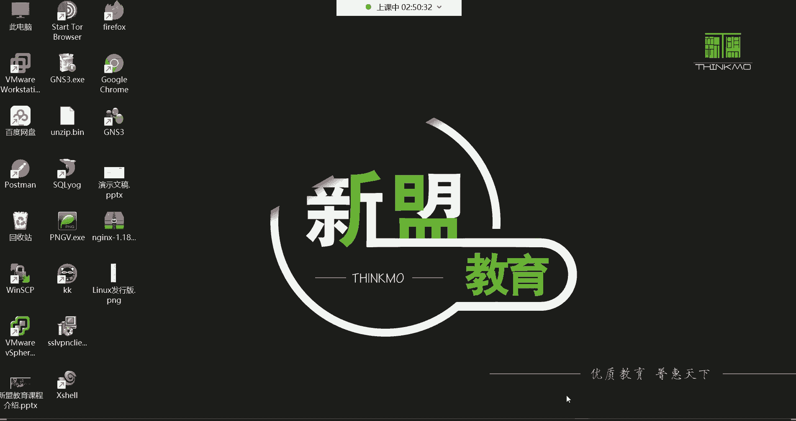

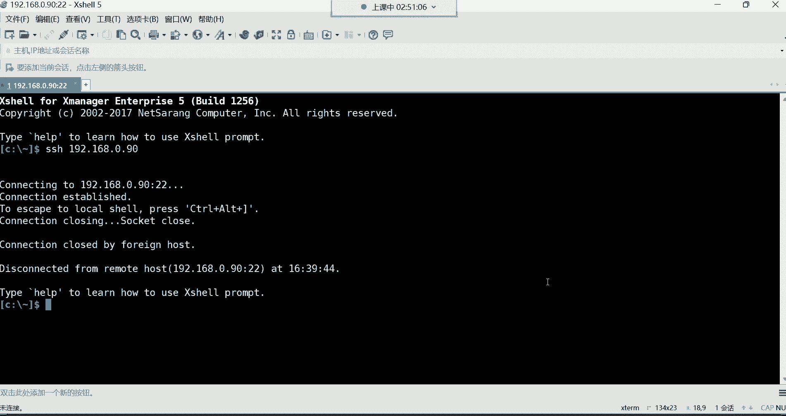

## 配置虚拟机网络

登录系统后，我们发现由于DNS配置可能存在问题，导致网络连接不畅。对于初学者，直接修改系统配置文件可能比较困难。因此，我们需要先在虚拟机软件层面完成正确的网络配置，确保能够远程连接。

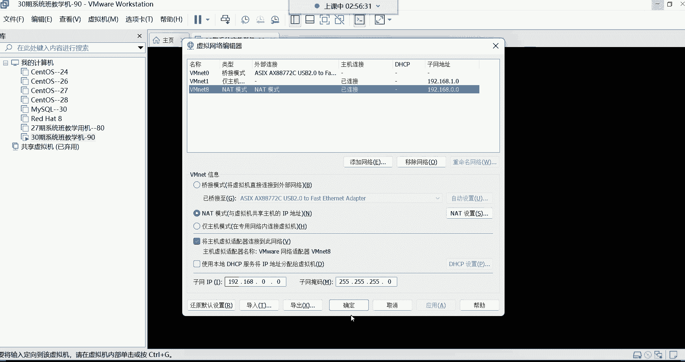

以下是配置虚拟机网络的关键步骤，请确保每一步都设置正确：

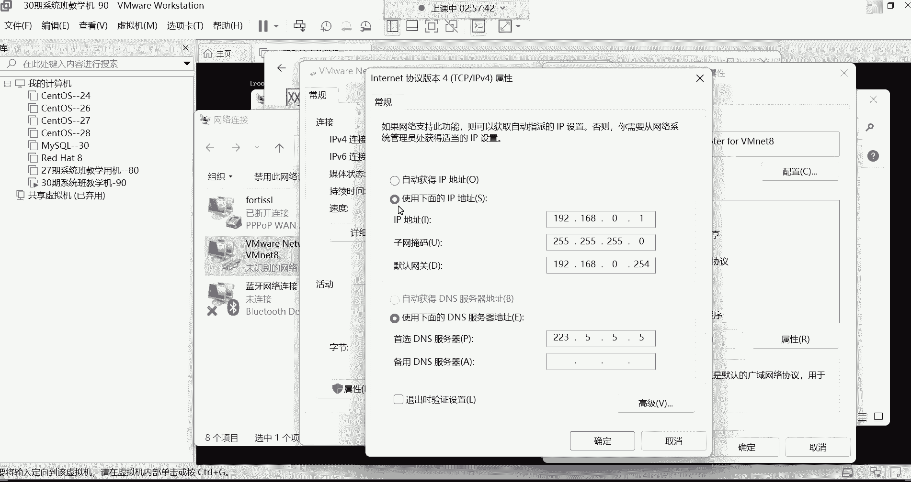

1.  **打开虚拟网络编辑器**：在VMware Workstation中，点击菜单栏的“编辑”，选择“虚拟网络编辑器”。
2.  **选择并配置NAT模式**：
    *   在列表中选择 `VMnet8 (NAT模式)`。
    *   取消勾选“使用本地DHCP服务将IP地址分配给虚拟机”。这一步非常重要，可以防止IP地址自动变化，导致我们无法用固定IP连接。
    *   设置子网IP为 `192.168.0.0`。
    *   设置子网掩码为 `255.255.255.0`。
3.  **设置网关**：点击“NAT设置”按钮，将网关IP设置为 `192.168.0.254`。完成后点击“确定”。
4.  **应用配置**：在虚拟网络编辑器主界面点击“应用”，然后“确定”。

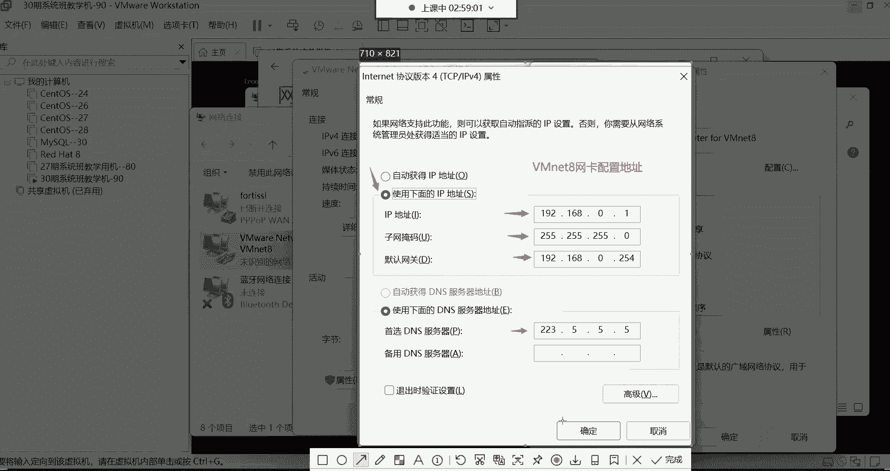

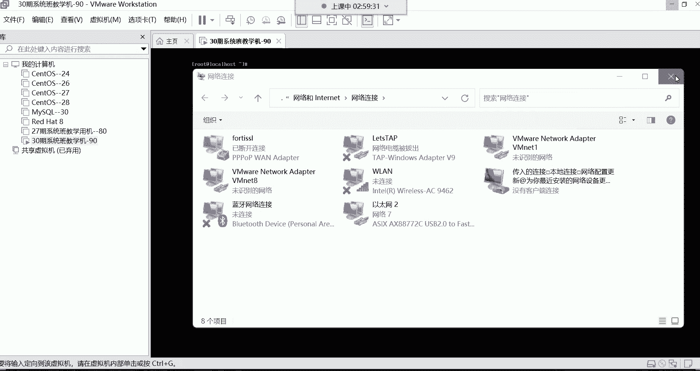

接下来，我们还需要配置宿主机的 `VMnet8` 虚拟网卡，使其与虚拟机在同一网段。

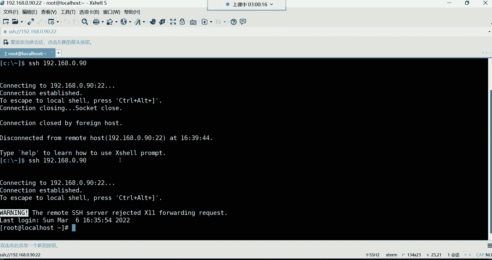

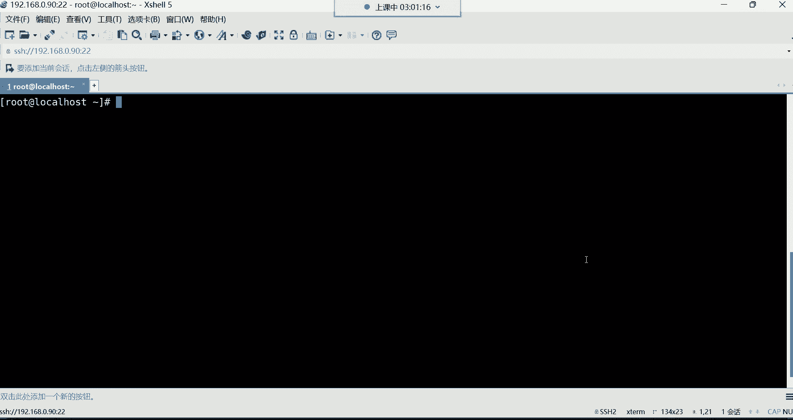

1.  **打开网络连接设置**：在Windows系统中，打开“控制面板” -> “网络和 Internet” -> “网络和共享中心”，点击左侧的“更改适配器设置”。
2.  **配置VMnet8属性**：找到名为 `VMware Network Adapter VMnet8` 的网卡，右键选择“属性”。
3.  **设置IP地址**：双击“Internet 协议版本 4 (TCP/IPv4)”。
    *   选择“使用下面的IP地址”。
    *   IP地址：`192.168.0.1`
    *   子网掩码：`255.255.255.0`
    *   默认网关：`192.168.0.254`
    *   首选DNS服务器：`223.5.5.5` (或 `114.114.114.114`)
    *   点击“确定”保存。

完成以上两步后，虚拟机的网络环境就配置好了。此时，虚拟机（IP: `192.168.0.90`）和宿主机（通过VMnet8网卡，IP: `192.168.0.1`）就在同一个局域网内，并且网关一致，可以互相通信。

## 使用远程连接工具

在真实的企业环境中，服务器通常不在本地，我们需要通过远程连接工具进行管理。下面我们介绍如何使用 Xshell 连接虚拟机。

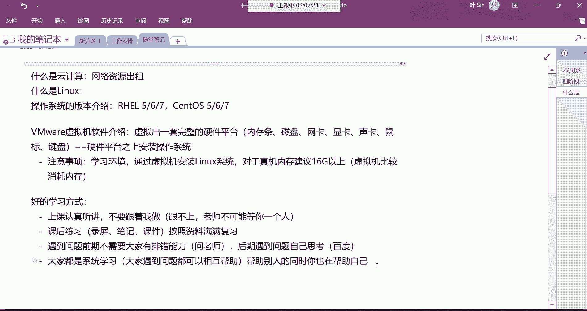

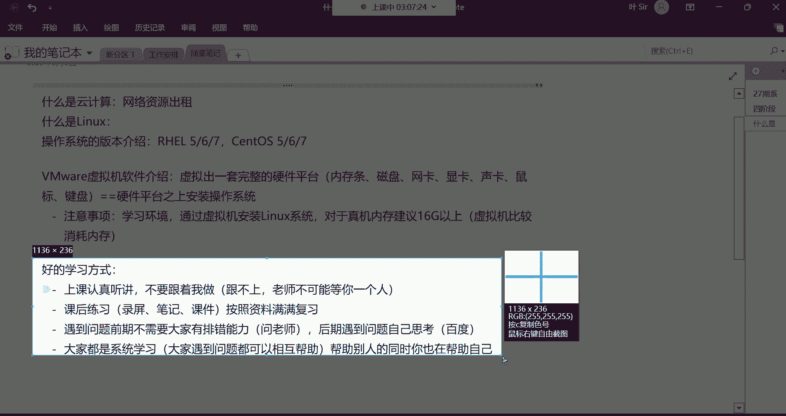

1.  **获取工具**：Xshell 可以在其官网或腾讯软件中心下载安装。
2.  **创建连接**：打开Xshell，点击“新建会话”。在“主机”栏输入虚拟机的IP地址：`192.168.0.90`。
3.  **首次连接**：点击“连接”，首次连接时会弹出SSH安全警告，选择“接受并保存”即可。
4.  **身份验证**：在登录界面输入用户名 `root` 和密码，即可成功连接到虚拟机命令行界面。

连接成功后，所有的操作都可以在这个远程终端里进行。例如，可以使用快捷键 **`Ctrl + L`** 来清屏，让界面更整洁。今后的学习都将在这个命令行界面中通过输入命令来完成。

## Linux应用领域与岗位介绍

系统安装和网络配置是学习的基础。接下来，我们了解一下Linux系统的广泛应用以及学成后可以从事的相关岗位，这有助于建立学习的目标感。

### Linux的广泛应用

Linux系统已经渗透到我们生活和生产的方方面面：
*   **基础服务**：金融、政务、通信、医疗等行业的后台服务器大量运行着Linux。
*   **互联网与云计算**：几乎所有大型互联网公司（如Google、Facebook、阿里巴巴、腾讯）的服务器都基于Linux。云计算平台（如AWS、阿里云）的核心也是Linux。
*   **超级计算**：全球500强超级计算机中，绝大多数都运行Linux系统，例如中国的“神威·太湖之光”和“天河二号”。
*   **日常生活**：我们使用的手机（Android系统基于Linux内核）、订外卖、打车、网购、社交、充值缴费等应用，其后台服务几乎都运行在Linux服务器上。
*   **新兴技术**：大数据、人工智能、物联网等前沿领域也离不开Linux的支撑。

### 运维相关岗位介绍

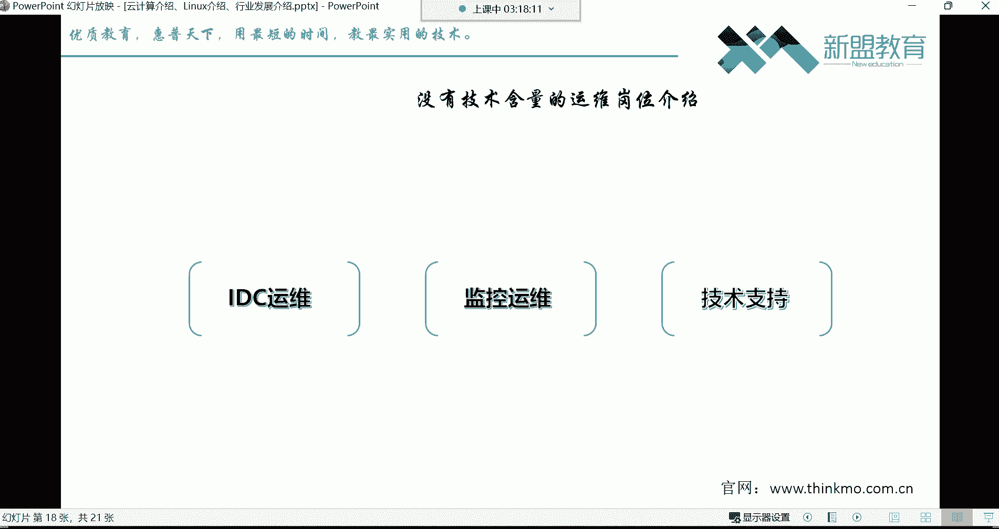

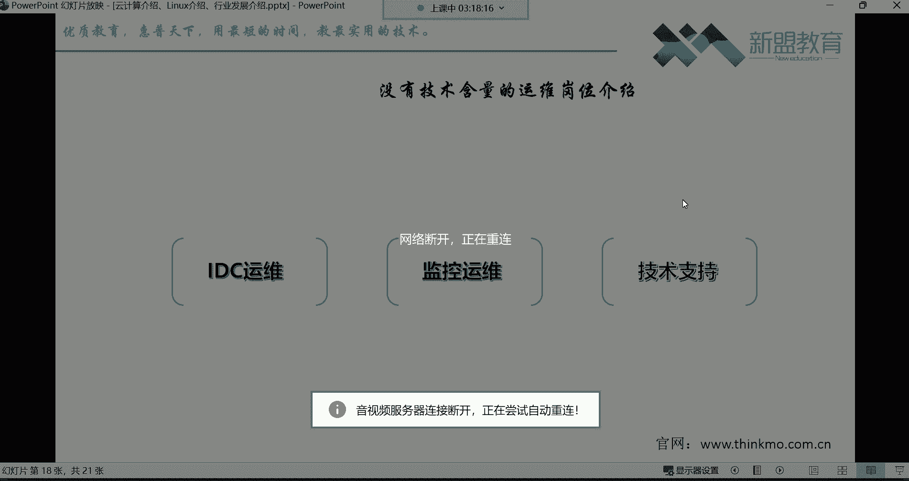

学习Linux后，你可以向以下几个技术岗位发展：

**有发展前景的技术岗位：**
*   **系统运维工程师**：入门首选岗位，负责服务器系统的安装、配置、监控和维护。
*   **云计算运维工程师**：专注于公有云/私有云平台（如OpenStack, Kubernetes）的搭建和维护。
*   **容器运维工程师**：负责基于Docker、K8s等容器化技术的环境管理和应用部署。
*   **数据库管理员(DBA)**：负责数据库（如MySQL, Oracle）的安装、备份、优化和安全管理。
*   **运维开发工程师/DevOps工程师**：通过编写脚本或工具，实现运维工作的自动化。

**建议谨慎选择的岗位：**
*   **IDC运维**：主要在机房进行硬件巡检、收发设备，技术含量低，多为外包岗位。
*   **监控运维**：负责盯着监控系统，发送告警信息，技术提升空间有限。
*   **技术支持**：类似客服，处理用户初级问题和技术工单，技术深度不够。

### 行业对比：开发、测试与运维

为了帮助你更全面地了解IT行业，这里简单对比几个主要岗位：
*   **开发岗位**：薪资高，但门槛也高（通常要求本科及以上学历、计算机专业），需要较强的逻辑思维和创新能力，工作压力大，职业生命周期相对较短。
*   **测试岗位**：需要一定的编程和数据库基础（相当于半个开发），技术含量不低。但通常只有大公司才设有专门岗位，且招聘门槛较高。
*   **运维岗位**：适合零基础入门，对学历要求相对宽松（大专即可），职业生命周期长，市场需求量大。关键在于坚持学习和积累经验。

## 学习建议与课程安排

最后，我们强调一下有效的学习方法和后续安排。

**给初学者的学习建议：**
1.  **听课与练习分离**：上课时以理解和听懂为主，不要急于同步操作，以免跟不上节奏。课后利用录屏、笔记和课件反复练习。
2.  **合理解决问题**：学习前期遇到问题，可以及时询问答疑老师。后期应养成先自己思考、查阅资料（如利用搜索引擎）的习惯，培养独立解决问题的能力。
3.  **保持学习状态**：既然选择了系统学习，就请认真对待。保持规律的学习节奏，避免“三天打鱼，两天晒网”。
4.  **互助共赢**：在学习群中积极交流、互相帮助。在解答他人问题的过程中，也能加深自己对知识的理解。

**课程安排预告：**
*   后续课程将在下周的周六、日继续，上课时间仍为下午两点。
*   课程的前两个阶段安排在周末，以便大家有充足的时间复习和练习。
*   详细的课程大纲会分享在群文件中，供大家查阅和预习。

## 总结

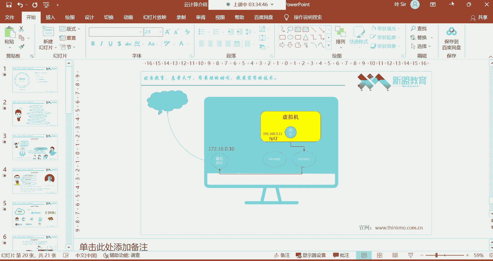

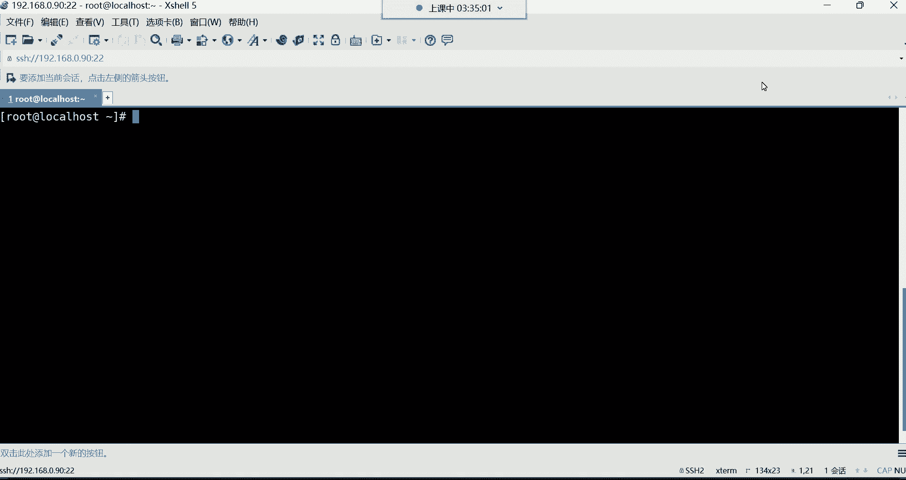

本节课中我们一起学习了三个核心内容：
1.  **虚拟机网络配置**：通过配置VMware的虚拟网络编辑器和宿主机的VMnet8网卡，为虚拟机搭建了稳定的网络环境。
2.  **远程连接管理**：使用Xshell工具通过SSH协议远程登录和管理Linux服务器，这是运维工作的日常方式。
3.  **Linux行业认知**：了解了Linux系统的广泛应用领域，认识了运维相关的职业发展路径，并对开发、测试、运维岗位进行了对比分析，帮助你明确了学习目标和方向。

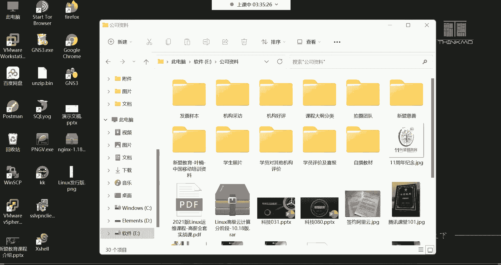

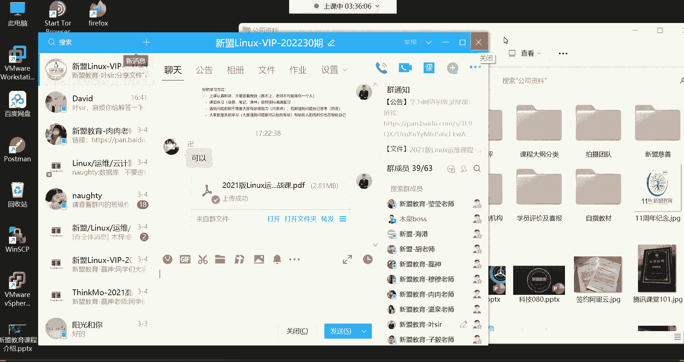

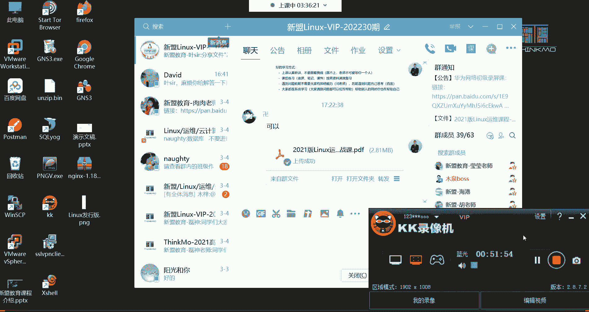

千里之行，始于足下。掌握好这些基础，就为后续深入的学习打开了大门。坚持练习，保持热情，你一定能在Linux运维的道路上稳步前行。