# Linux最全RHCSA+RHCE培训教程合集：P40：常用特殊符号补充

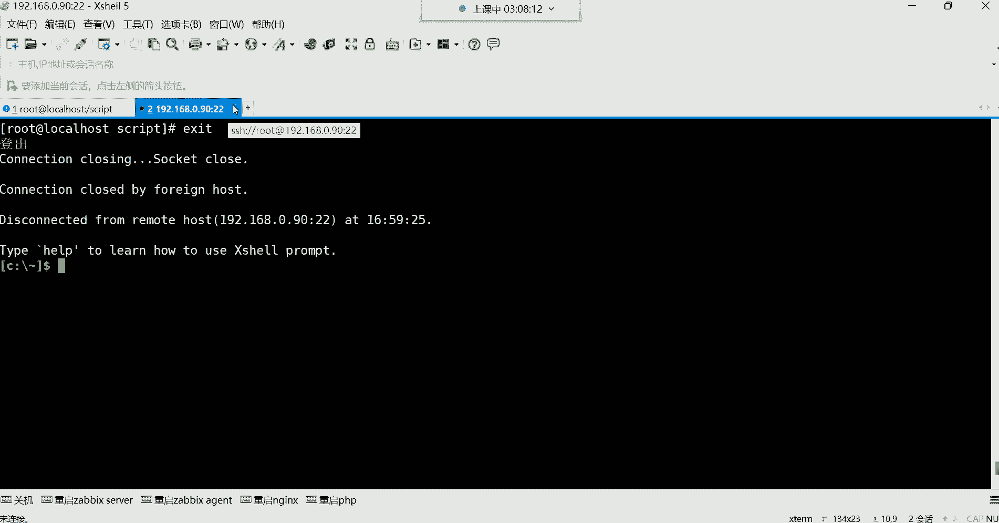

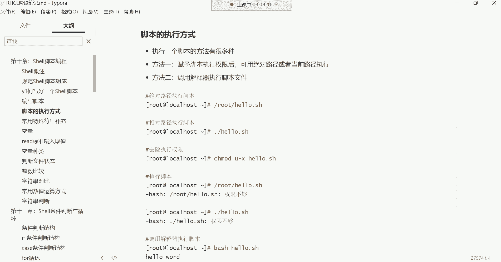

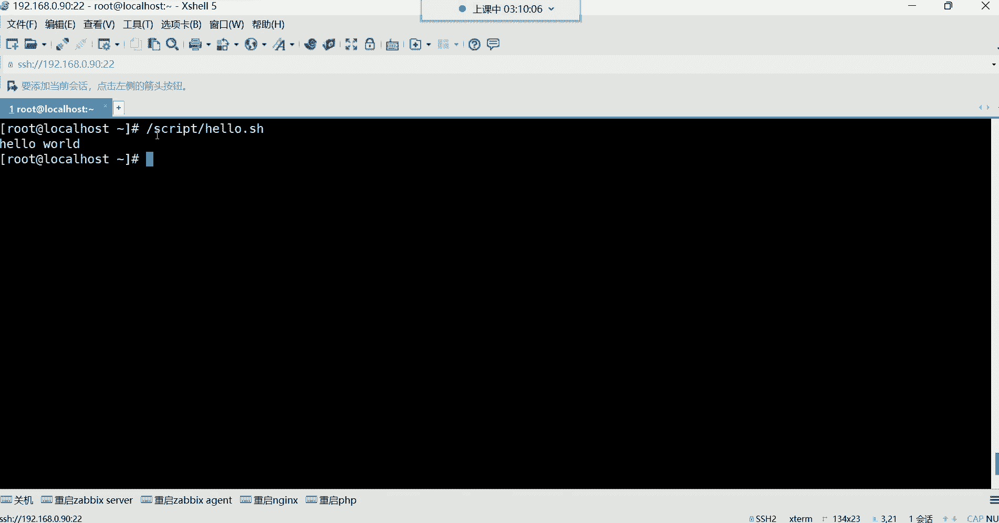

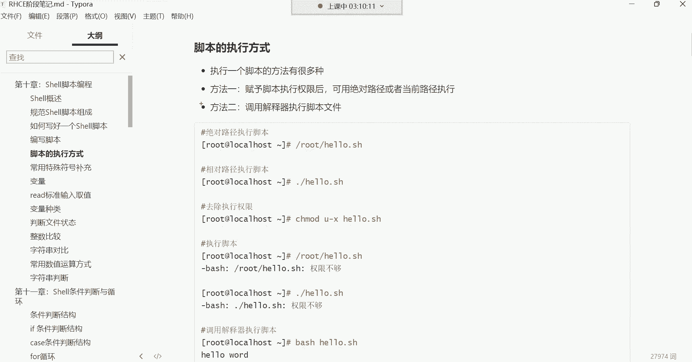

在本节课中，我们将要学习Shell脚本中几种常用的特殊符号及其功能。这些符号对于编写高效、灵活的脚本至关重要。我们将重点讲解脚本的执行方式、引号（单引号与双引号）的区别、四则运算以及如何将命令的输出结果作为参数使用。

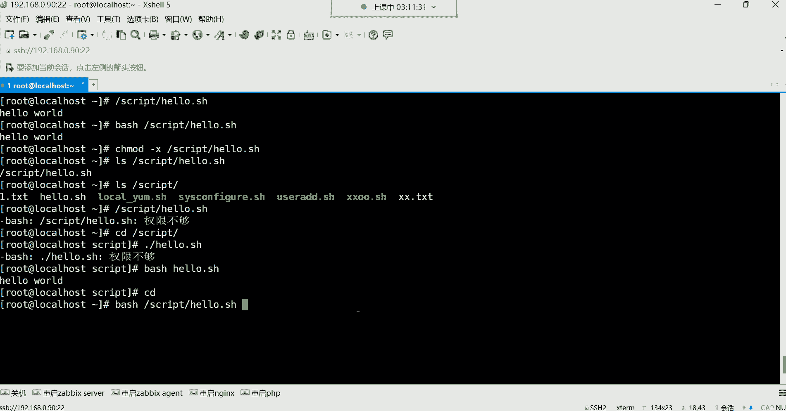

## 脚本的执行方式

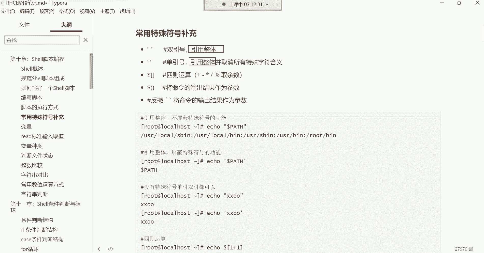

上一节我们介绍了如何编写Shell脚本，本节中我们来看看如何执行一个脚本。脚本的执行主要有两种方式。

以下是两种主要的执行方法：

1.  **赋予脚本执行权限后执行**
    这是最常用的方法。首先使用 `chmod` 命令为脚本文件添加执行权限，然后通过绝对路径或相对路径来执行它。
    *   **相对路径执行**：需要在脚本名前加上 `./`，以告诉系统在当前目录下寻找该文件。例如：`./hello.sh`
    *   **绝对路径执行**：直接指定脚本文件的完整路径。例如：`/script/hello.sh`

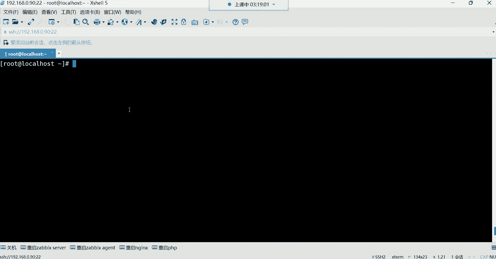

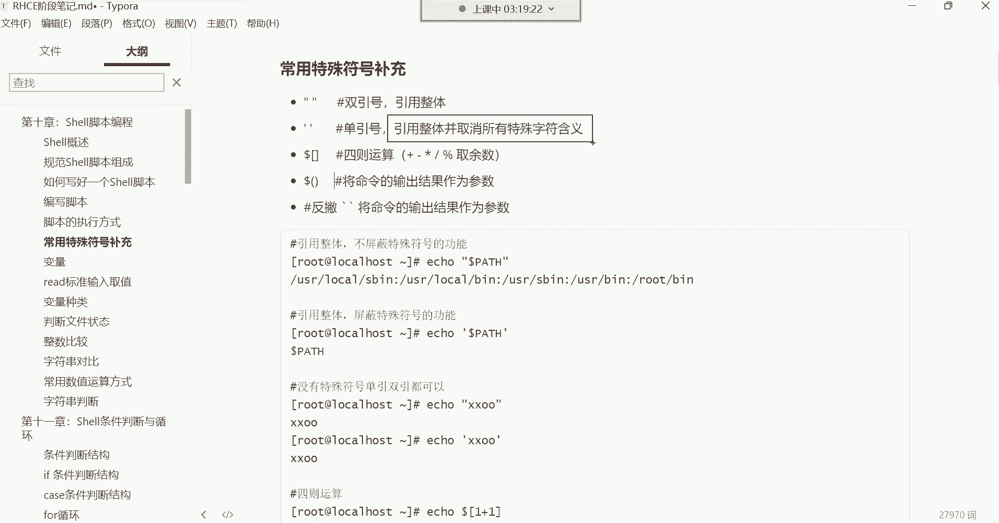

2.  **调用解释器执行**
    这种方法无需为脚本赋予执行权限。直接使用 `bash` 解释器来执行脚本文件。
    *   命令格式为：`bash /path/to/script.sh` 或 `bash ./script.sh`

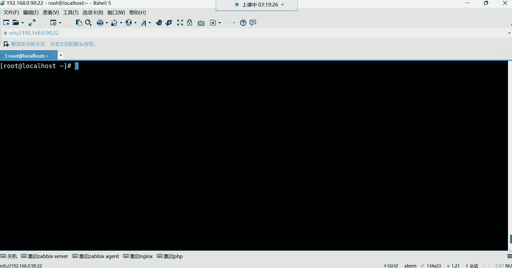

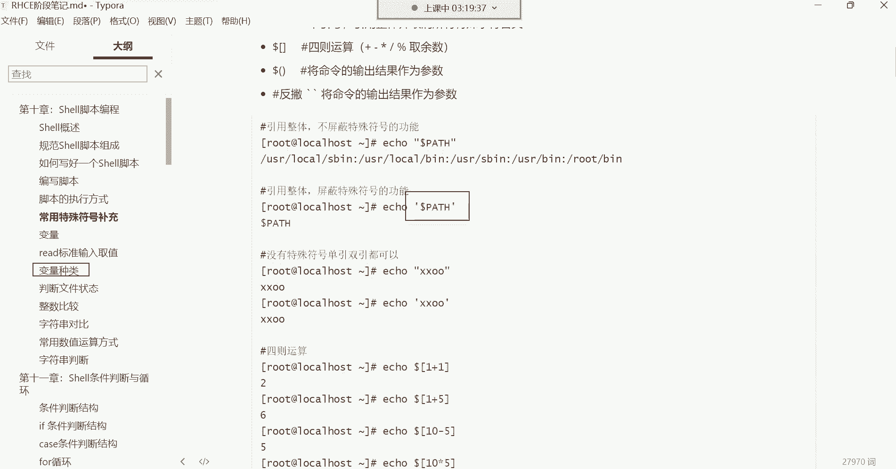

## 引号：引用整体

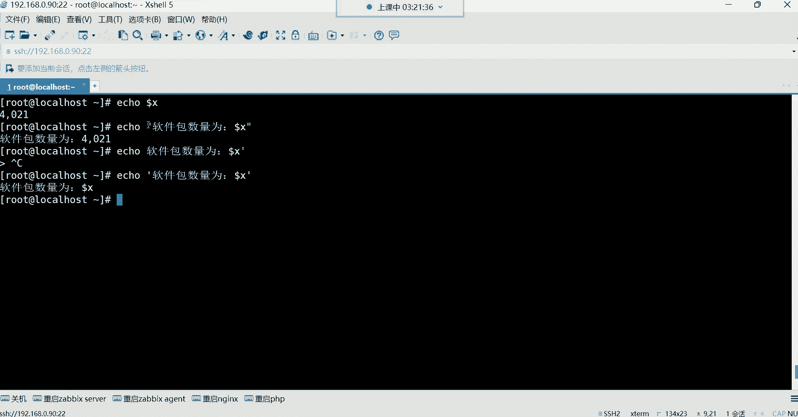

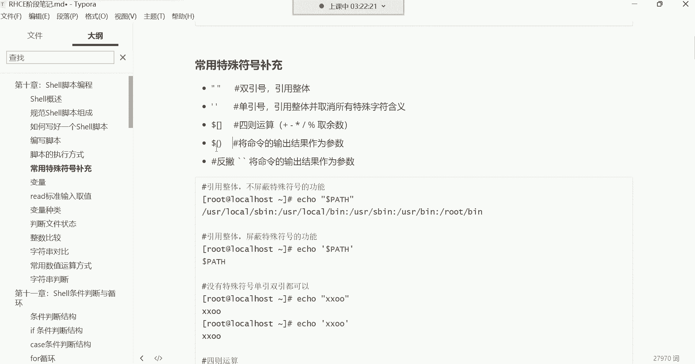

接下来，我们学习引号的作用。无论是单引号还是双引号，它们的基本功能都是“引用整体”，即将引号内的所有内容（包括空格等特殊字符）视为一个不可分割的整体。

例如，创建一个包含空格的文件名：
```bash
touch "a b.txt"
```
这条命令会创建一个名为 `a b.txt` 的文件，而不是两个独立的文件 `a` 和 `b.txt`。如果不加引号，`touch a b.txt` 则会创建两个文件。

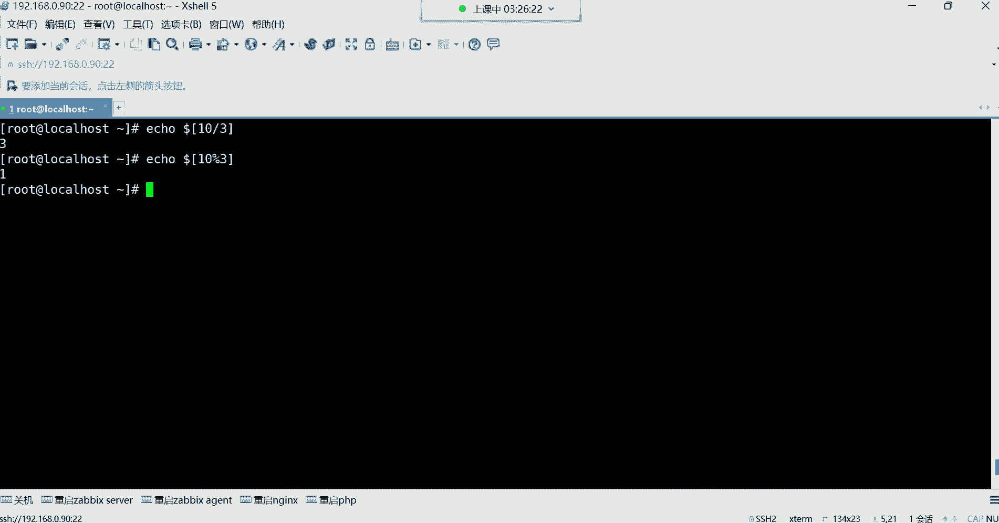

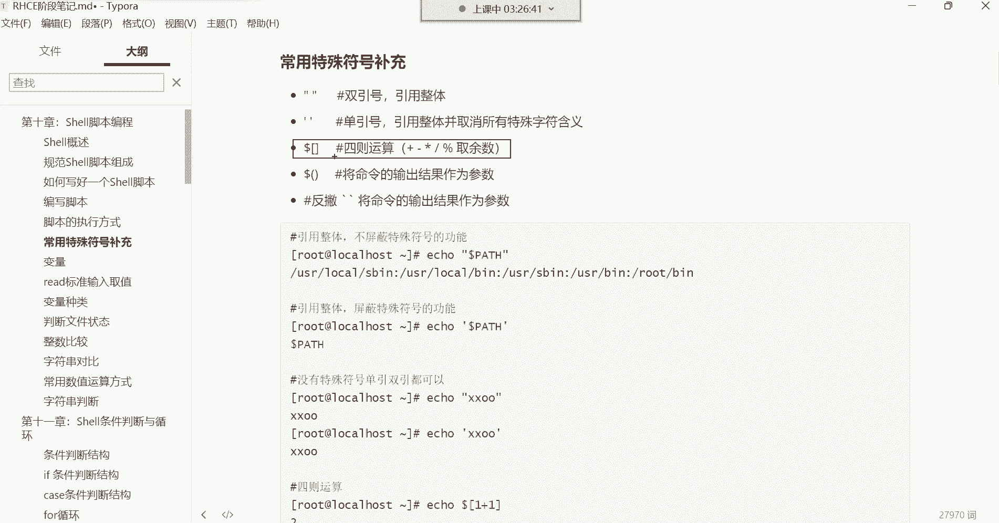

**单引号与双引号的核心区别**在于对特殊符号（如变量符号 `$`）的处理：
*   **双引号**：会解析引号内的特殊符号，使其发挥原有功能。
*   **单引号**：会取消所有特殊符号的特殊含义，将其视为普通字符。

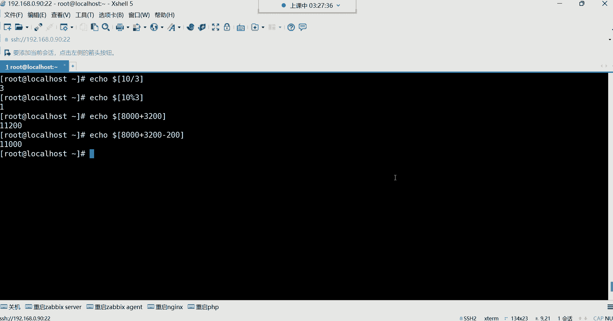

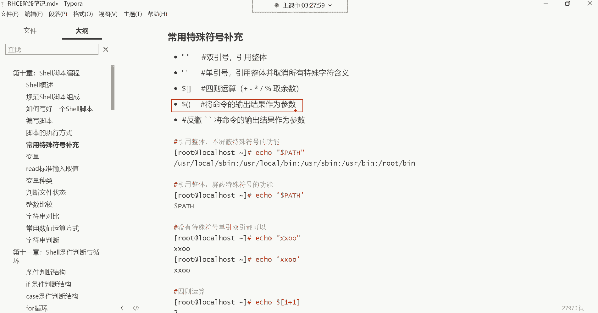

例如，定义一个变量 `x=10`：
```bash
echo “软件包数量为：$x” # 输出：软件包数量为：10
echo ‘软件包数量为：$x’ # 输出：软件包数量为：$x
```
可以看到，双引号内的 `$x` 被解析为变量的值，而单引号内的 `$x` 则被原样输出。

## 四则运算

在Shell脚本中，我们经常需要进行数学计算。使用 `$[ ]` 结构可以方便地进行四则运算。

以下是基本的运算示例：
*   **加法**：`echo $[1 + 1]` 输出 `2`
*   **减法**：`echo $[2 - 1]` 输出 `1`
*   **乘法**：`echo $[2 * 2]` 输出 `4` （注意乘号是 `*`）
*   **除法**：`echo $[10 / 3]` 输出 `3` （注意除号是 `/`，结果为整数商）
*   **取余**：`echo $[10 % 3]` 输出 `1` （`%` 符号用于计算除法后的余数）

## 反引号与$()：命令替换

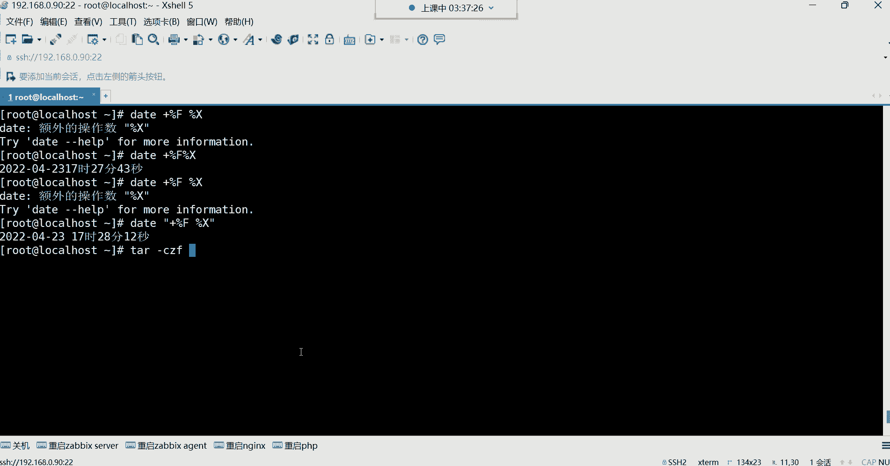

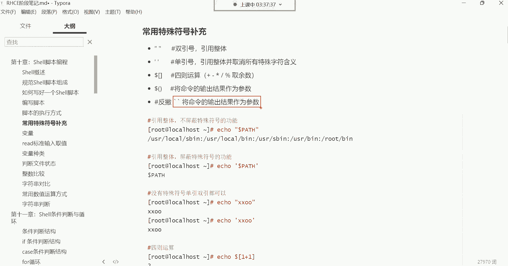

最后，我们学习一个非常强大的功能：命令替换。它的作用是将一个命令的输出结果，作为另一个命令的参数。这可以通过反引号 ``` ` ``` 或 `$()` 来实现。

例如，我们想在创建文件或备份数据时，将当前系统时间作为文件名的一部分：
```bash
# 创建一个以当前日期时间为名称的文件
touch “backup_`date +%F_%T`.tar.gz”
# 或者使用 $()
touch “backup_$(date +%F_%T).tar.gz”
```
执行后，会生成一个类似 `backup_2023-10-27_14:30:25.tar.gz` 的文件。这样，每次备份都会生成一个独一无二的文件名，避免了文件被意外覆盖。

**命令替换的典型应用场景**：在自动化脚本中为日志文件、备份文件生成带时间戳的名称，确保每次执行都不会产生冲突。

---

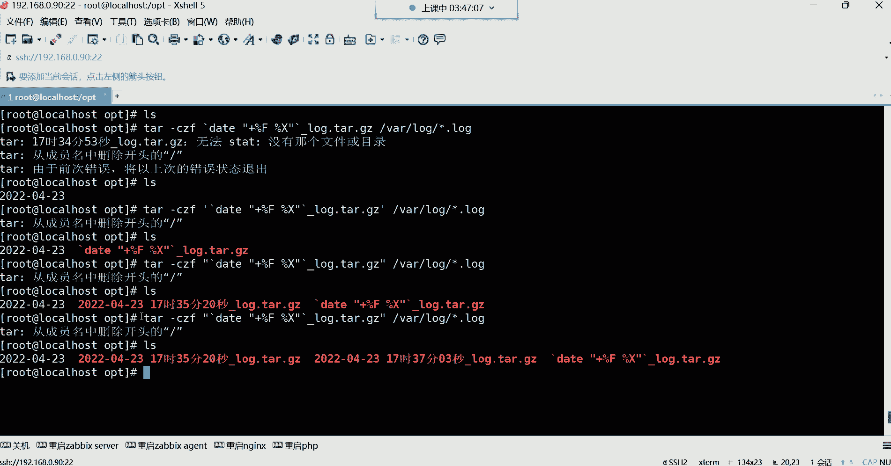

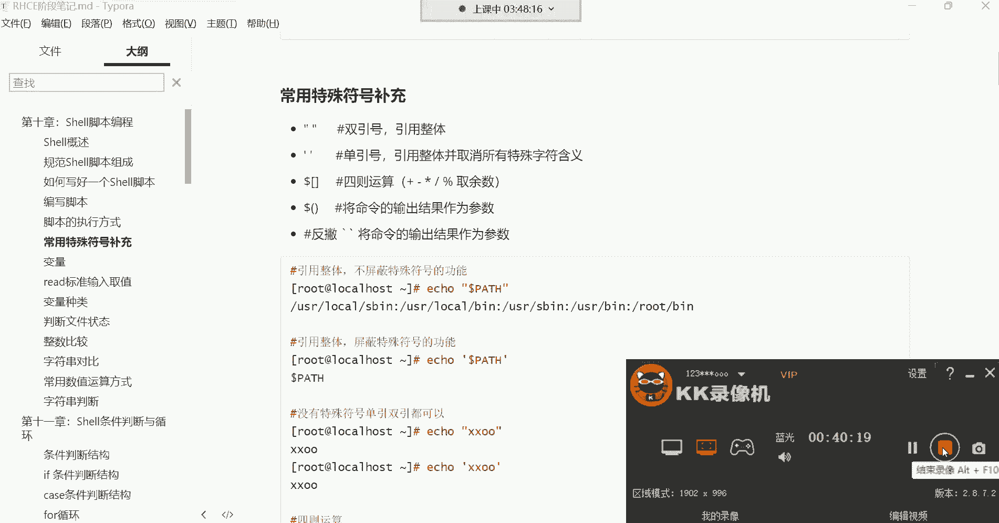

本节课中我们一起学习了Shell脚本的几种核心特殊符号。我们掌握了脚本的两种执行方式，理解了单引号和双引号在“引用整体”时的细微差别，学会了使用 `$[ ]` 进行简单的数学运算，并重点掌握了使用反引号或 `$()` 进行命令替换的方法，这能极大地增强脚本的灵活性和自动化能力。理解并熟练运用这些符号，是编写高效Shell脚本的重要基础。