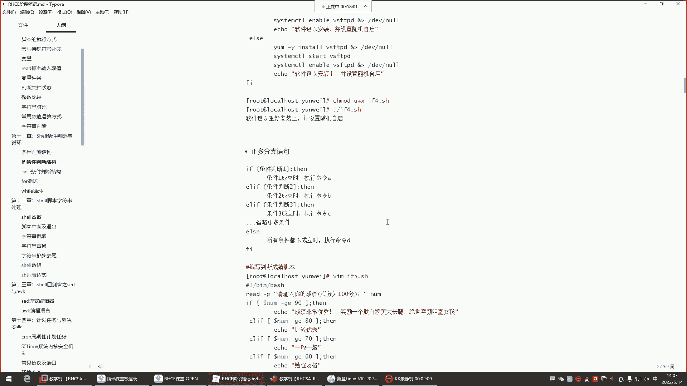
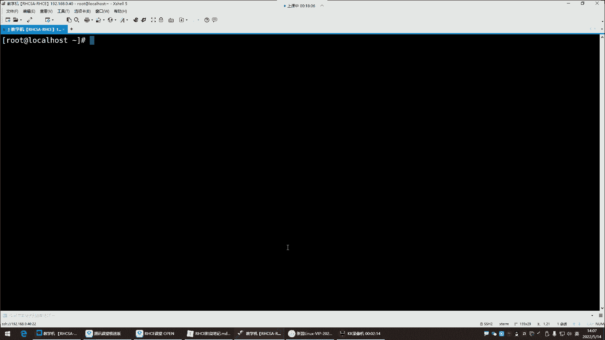
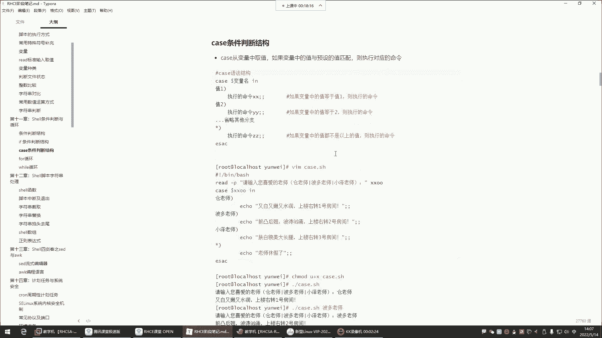
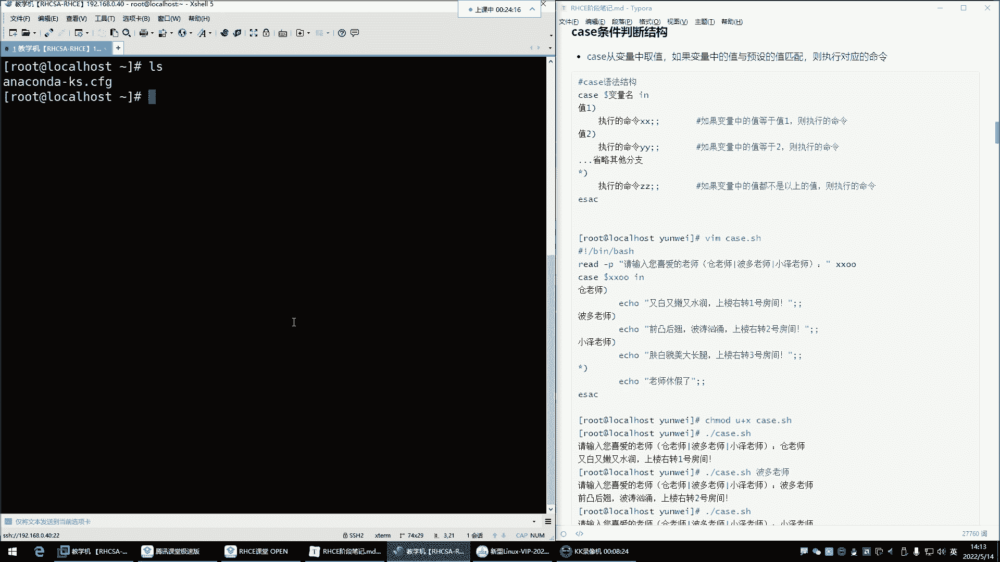
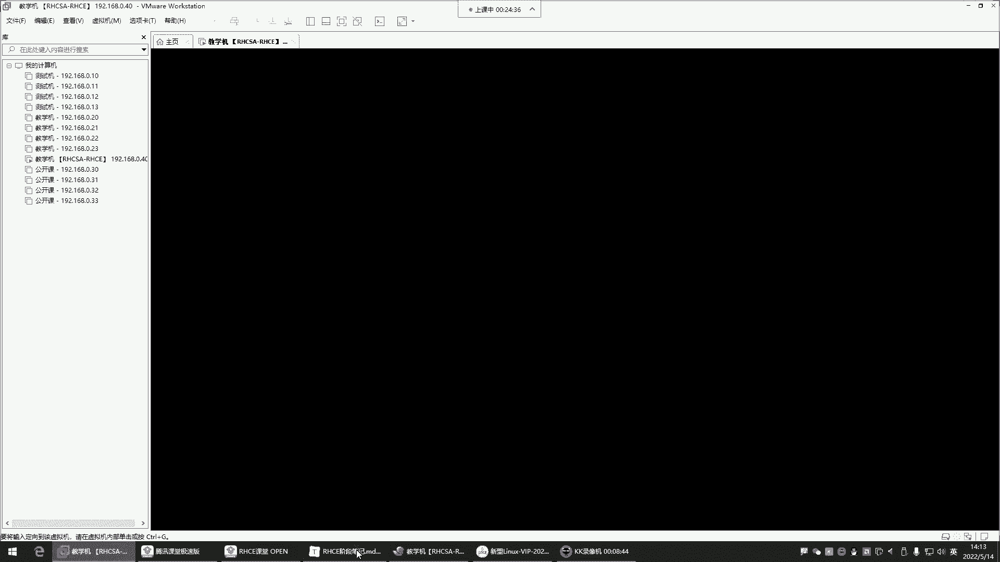
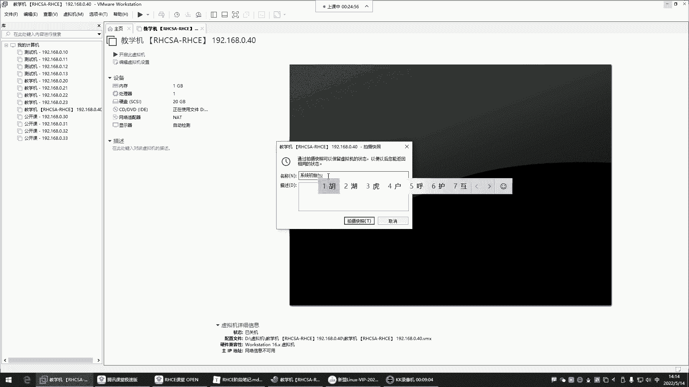
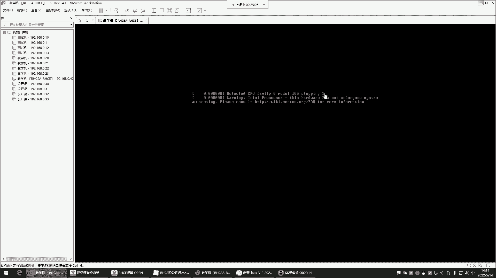
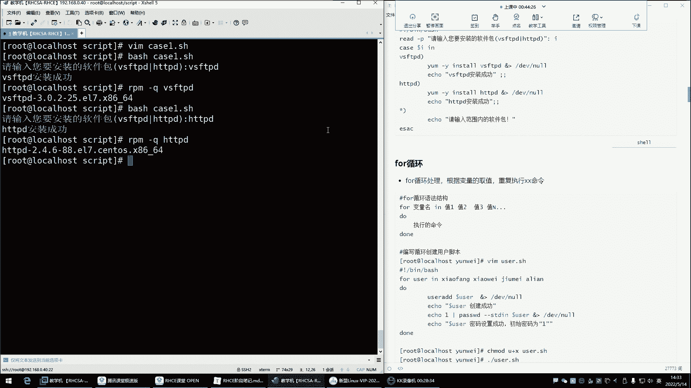
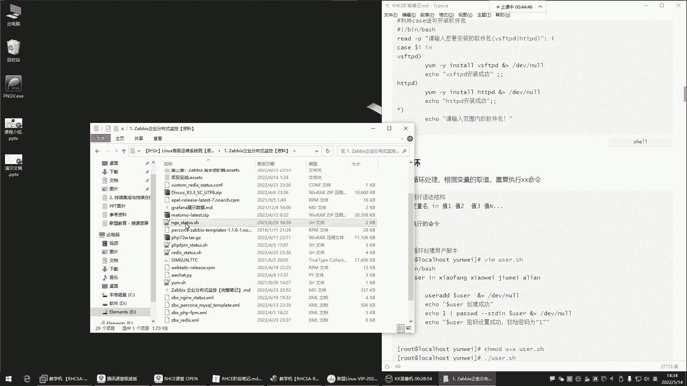
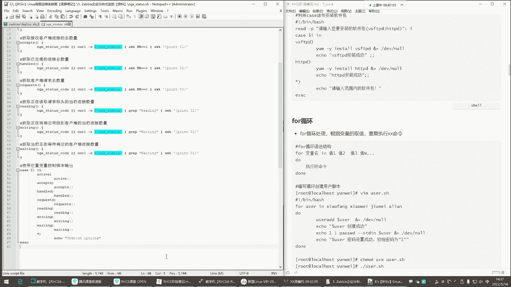

# Linux最全RHCSA+RHCE培训教程合集：P43：红帽RHCE-7.case条件判断、for循环 📚







在本节课中，我们将要学习Shell脚本编程中的`case`条件判断语句和`for`循环。上一节我们介绍了`if`多分支判断，本节中我们来看看另一种更简洁的条件判断方式——`case`语句。

## case条件判断语句 🧐

`case`语句与`if`语句功能类似，都是根据条件执行不同的命令。但`case`语句的语法更简洁，适用于对单一变量进行多种固定值匹配的场景。它的核心逻辑是：从变量中取值，如果该值与预设的模式匹配，则执行对应的命令块。

其基本语法结构如下：
```bash
case 变量名 in
模式1)
    命令序列1
    ;;
模式2)
    命令序列2
    ;;
*)
    默认命令序列
    ;;
esac
```
*   `case` 语句以 `case` 开头，以 `esac` 结尾。
*   `变量名` 是需要判断的变量。
*   每个 `模式)` 后面跟着匹配成功后要执行的命令序列。
*   命令序列以两个分号 `;;` 结束，表示该模式匹配结束。
*   `*)` 是默认模式，可以匹配任何值，类似于 `if-else` 中的 `else`。



以下是`case`语句的一个简单应用示例，模拟一个选择场景：
```bash
#!/bin/bash
read -p "请输入你喜欢的老师名字：" teacher
case $teacher in
"苍老师")
    echo "苍老师特点：又白又嫩又水润。上楼右转一号房间。"
    ;;
"波多老师")
    echo "波多老师特点：前凸后翘，波涛汹涌。上楼右转二号房间。"
    ;;
"小泽老师")
    echo "小泽老师特点：肤白貌美大长腿。上楼右转三号房间。"
    ;;
*)
    echo "$teacher 老师今天休假。"
    ;;
esac
```
执行此脚本时，会根据输入的名字输出不同的描述。如果输入未在预设模式中，则会执行默认的 `*)` 分支。







`case`语句的特点是“匹配即停止”。系统会从上到下依次匹配，一旦某个模式匹配成功，就会执行对应的命令序列，然后直接跳出整个`case`语句，后续的模式不再检查。

## for循环语句 🔄

在掌握了条件判断后，我们常常需要让某些操作重复执行多次，这时就需要用到循环。`for`循环是Shell脚本中最常用的循环结构之一，它特别适合用于遍历一个列表中的每个项目。

`for`循环的基本语法如下：
```bash
for 变量名 in 项目列表
do
    命令序列
done
```
*   `for`、`in`、`do`、`done` 是关键字。
*   `变量名` 会依次获取 `项目列表` 中的每一个值。
*   `项目列表` 可以是一组字符串，也可以是命令执行的结果，或者使用通配符匹配的文件名集合。

以下是`for`循环的几个典型应用场景：

**1. 遍历固定列表：**
```bash
#!/bin/bash
for person in 张三 李四 王五
do
    echo "$person，你好！"
done
```
这个脚本会依次输出对列表中每个人的问候。

**2. 遍历命令执行结果：**
我们经常需要处理命令的输出。例如，列出当前目录下所有的`.txt`文件：
```bash
#!/bin/bash
for file in $(ls *.txt)
do
    echo "找到文本文件：$file"
done
```
这里，`$(ls *.txt)` 命令的执行结果（即所有.txt文件名列表）会成为`for`循环遍历的项目。

**3. 使用通配符：**
Shell的通配符（如`*`）可以直接用在`in`后面：
```bash
#!/bin/bash
for script in /etc/init.d/*
do
    echo "系统服务脚本：$script"
done
```
这个循环会列出`/etc/init.d/`目录下的所有文件。

**4. C语言风格的for循环：**
Bash也支持类似C语言的`for`循环语法，常用于按数字序列循环：
```bash
#!/bin/bash
for ((i=1; i<=5; i++))
do
    echo "这是第 $i 次循环。"
done
```
这种格式更便于进行计数器控制循环。

**5. 遍历脚本参数：**
`for`循环也可以用来处理执行脚本时传入的所有参数：
```bash
#!/bin/bash
for arg in "$@"
do
    echo "接收到参数：$arg"
done
```
`$@` 代表了所有的位置参数。当你运行 `./script.sh arg1 arg2 arg3` 时，循环会依次处理每个参数。





## 总结 📝

本节课中我们一起学习了Shell脚本中两个非常重要的结构：`case`条件判断和`for`循环。
*   **`case`语句** 提供了一种清晰、简洁的多分支选择方法，特别适合对单一变量进行离散值匹配的场景，其结构以 `case` 开始，以 `esac` 结束。
*   **`for`循环** 则使我们能够轻松地对一个列表中的每个元素重复执行操作，是自动化批量任务的基础。无论是遍历文件、处理命令输出还是迭代数字序列，`for`循环都是得力工具。



理解并掌握这两种结构，将极大增强你编写高效、自动化Shell脚本的能力。在接下来的课程中，我们将继续学习其他循环和控制结构。