# Linux脚本编程：P44：case条件判断与for循环 🔄

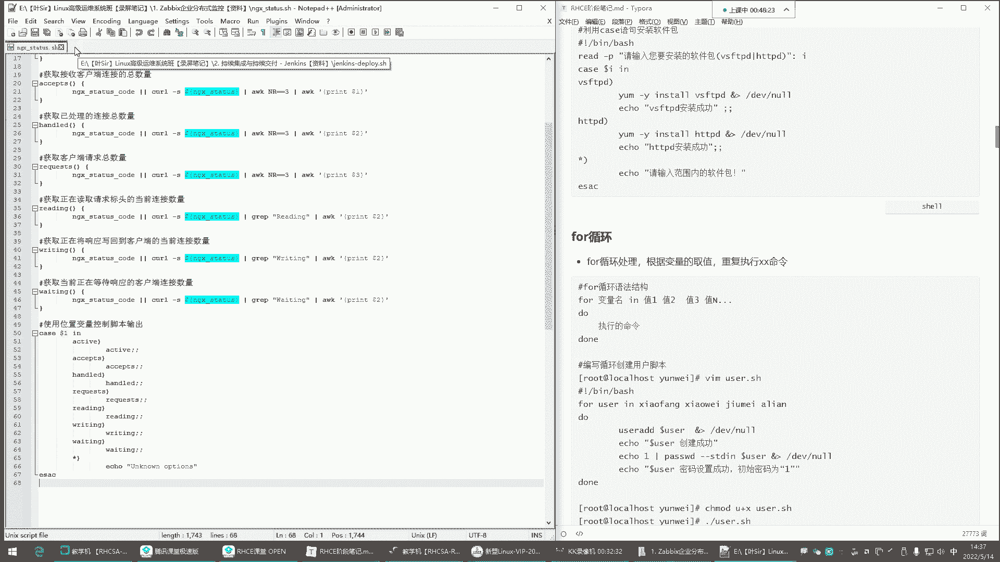


在本节课中，我们将要学习Shell脚本编程中的两个重要结构：`case`条件判断和`for`循环。通过学习，你将能够理解如何使用它们进行条件分支和重复执行任务。

## 概述

上一节我们介绍了脚本的基本概念，本节中我们来看看两种控制脚本流程的结构。`case`语句用于多条件分支判断，而`for`循环则用于重复执行一系列命令。

---

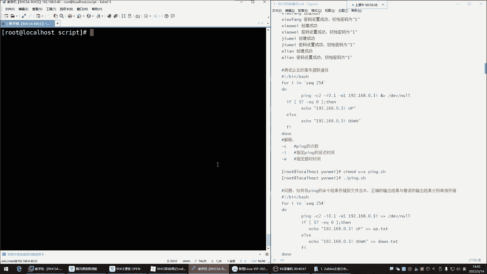

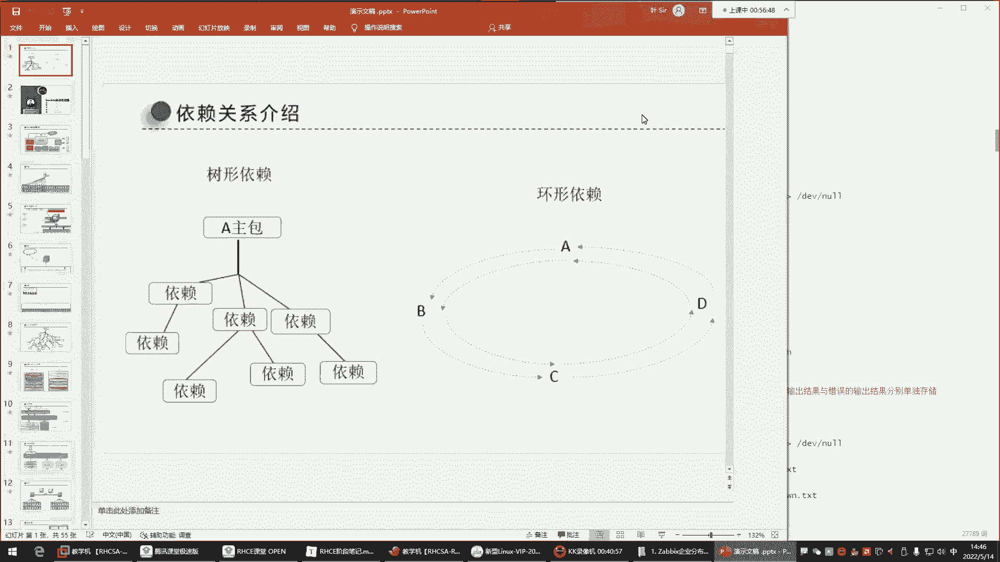


## case条件判断

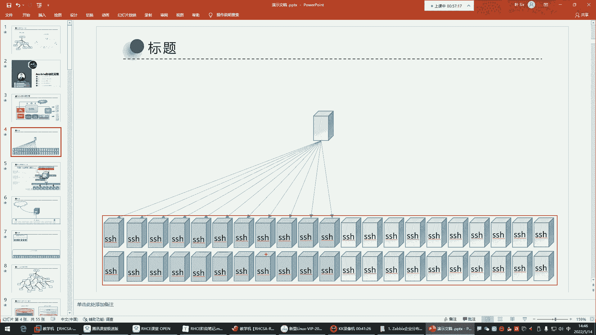

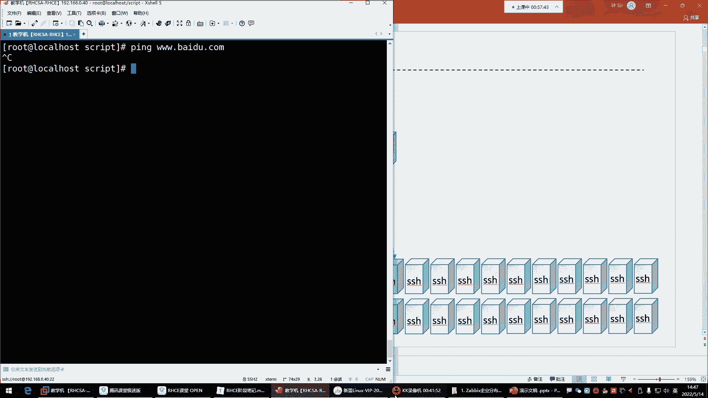

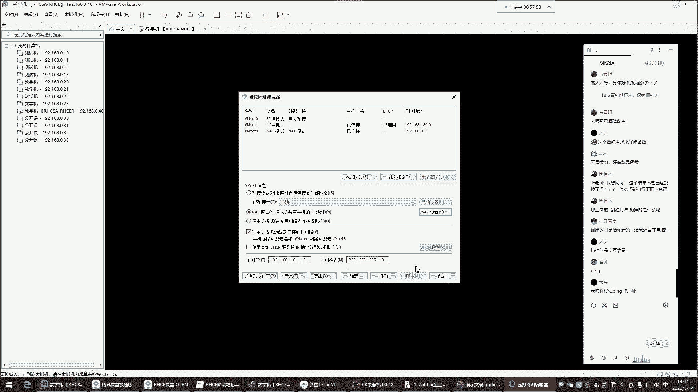

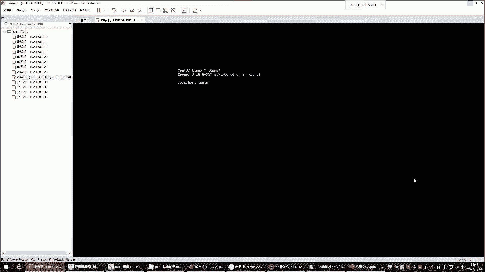

`case`语句是一种多分支的条件判断结构。它根据一个变量的值，匹配不同的模式，并执行对应的命令块。

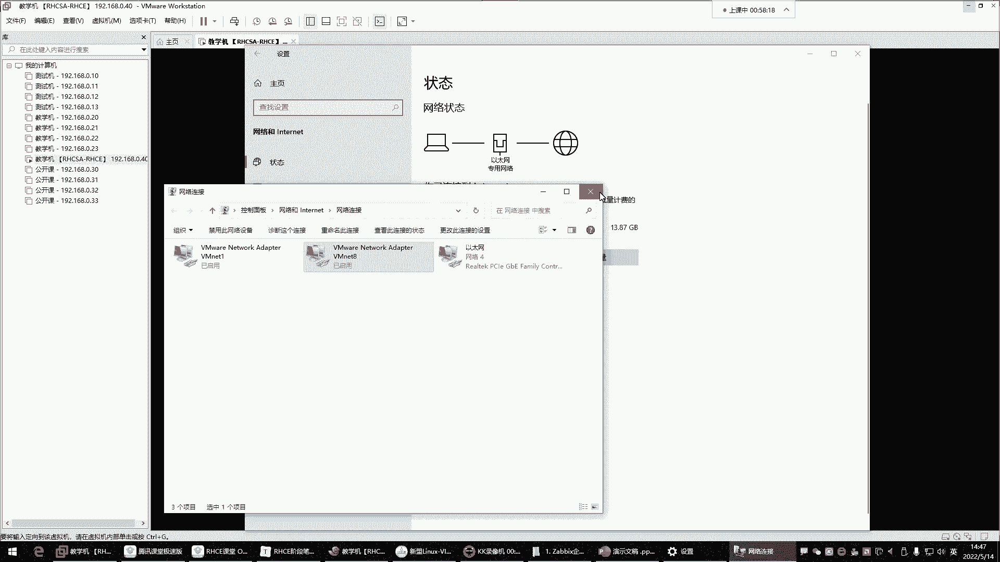

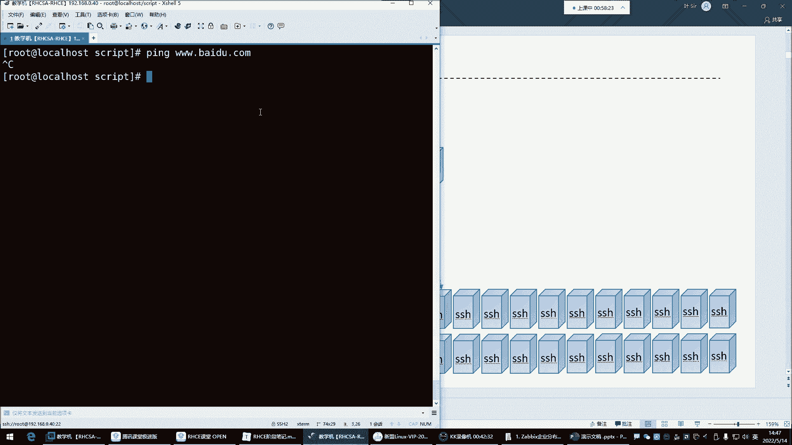

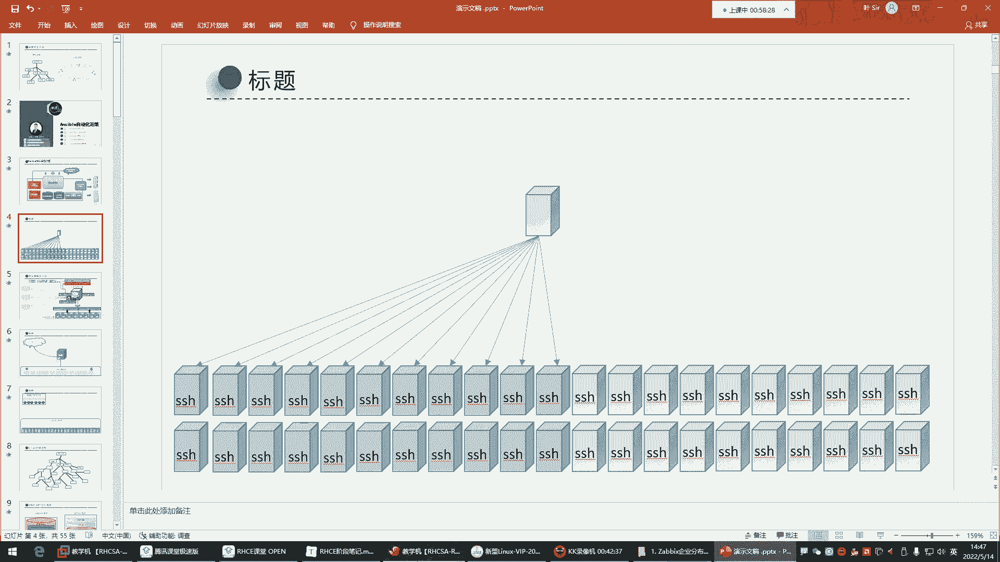

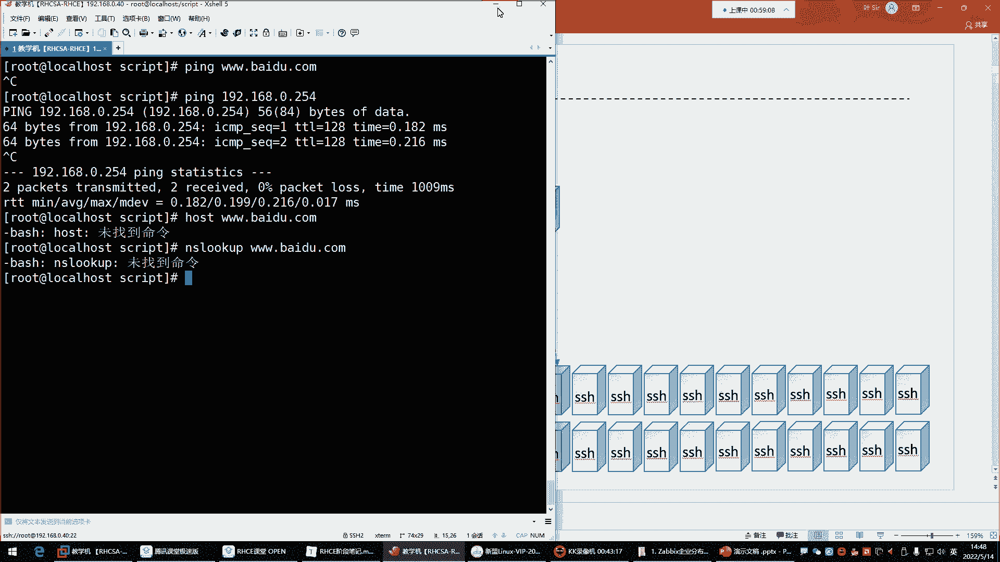

**语法格式**如下：
```bash
case $变量名 in
  模式1)
    命令序列1
    ;;
  模式2)
    命令序列2
    ;;
  *)
    默认命令序列
    ;;
esac
```
在执行脚本时，需要给这个变量传递一个值。`case`语句会根据这个值去匹配不同的模式。如果匹配成功，就执行对应的命令；如果所有模式都不匹配，则执行默认（`*`）的命令块。


---

## for循环

`for`循环用于循环处理，即根据变量取值重复执行某些命令。

### 循环的基本概念

`for`循环的核心是：只要变量中有值，就会执行`do`和`done`之间的语句。值的列表定义在`in`关键字后面。

**语法格式**：
```bash
for 变量名 in 值列表
do
  要重复执行的命令
done
```
循环过程是：第一次循环，将列表中的第一个值赋给变量，然后执行循环体内的命令。本次循环结束后，会回到`in`后面查看是否还有下一个值。如果有，则将下一个值赋给变量，再次执行循环体，如此重复，直到列表中的所有值都被处理完毕，整个循环结束。

### 创建用户的for循环示例

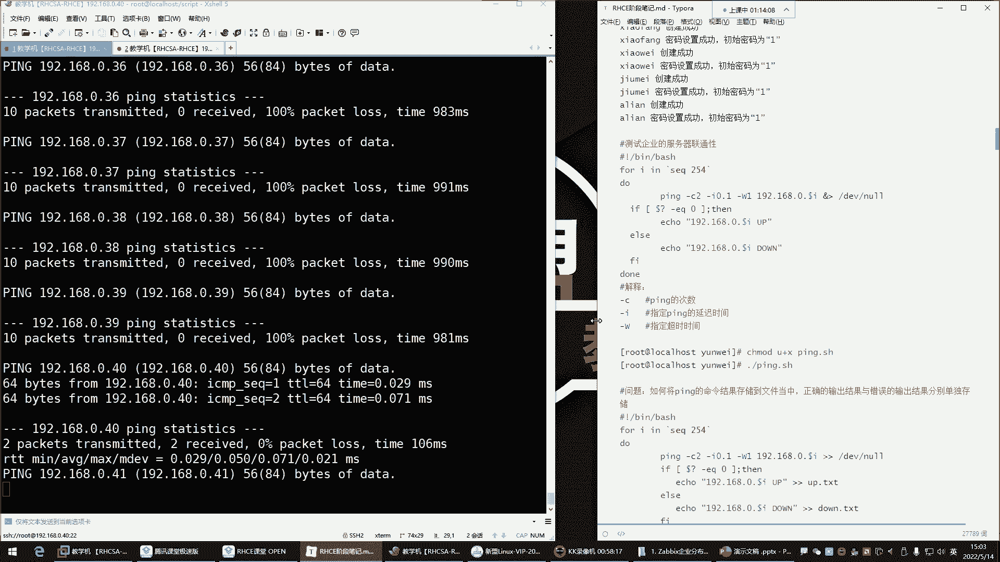

以下是使用`for`循环批量创建用户的脚本示例：
```bash
#!/bin/bash
for user in 小方 小V 九妹 阿联
do
  useradd $user &> /dev/null
  echo “$user 创建成功”
  echo “1” | passwd --stdin $user &> /dev/null
  echo “$user 密码设置成功，密码是1”
done
```
**脚本解释**：
*   `for user in 小方 小V 九妹 阿联`：定义循环变量`user`，其值依次为“小方”、“小V”、“九妹”、“阿联”。
*   `useradd $user &> /dev/null`：使用`useradd`命令创建用户。`$user`表示变量值。`&> /dev/null`将命令的输出（无论成功或失败信息）重定向到“黑洞”设备，即不显示在屏幕上。
*   `echo “1” | passwd --stdin $user`：通过管道将密码“1”传递给`passwd`命令，为对应用户设置密码。

### 测试服务器连通性的for循环示例

在企业中，可能需要检查多台服务器的网络状态。手动逐一测试效率低下，使用`for`循环可以自动化这个过程。

以下是测试192.168.0.1到192.168.0.254网段主机连通性的脚本改进版：
```bash
#!/bin/bash
for ip in 192.168.0.{1..254}
do
  ping -c 2 -i 0.1 -W 1 $ip &> /dev/null
  if [ $? -eq 0 ]; then
    echo “$ip is up” >> /opt/net_up.txt
  else
    echo “$ip is down” >> /opt/net_down.txt
  fi
done
```
**脚本解释与优化**：
1.  **循环定义**：`for ip in 192.168.0.{1..254}`。这里使用了**大括号扩展** `{1..254}` 来生成数字序列，等同于 `1 2 3 ... 254`。另一种方式是使用 `seq` 命令：`for ip in $(seq 1 254)`。
2.  **ping命令参数**：
    *   `-c 2`：指定发送2个数据包后停止。避免默认无限ping下去。
    *   `-i 0.1`：设置发送数据包的时间间隔为0.1秒，加快速度。
    *   `-W 1`：设置等待响应的超时时间为1秒。
    *   `&> /dev/null`：丢弃`ping`命令的所有输出，保持屏幕整洁。
3.  **条件判断**：`if [ $? -eq 0 ]; then`。`$?` 是一个特殊变量，代表**上一条命令**（即`ping`）的退出状态码。`0`通常表示成功（主机通），非`0`表示失败（主机不通）。`-eq`是用于**整数比较**的运算符，表示“等于”。
4.  **结果输出**：将结果追加（`>>`）到不同的文件中，便于后续查看。活跃主机IP记录到`/opt/net_up.txt`，关机主机IP记录到`/opt/net_down.txt`。
5.  **后台执行**：运行脚本时，在命令末尾加上 `&`，可以让脚本在后台运行，不占用当前终端。

---

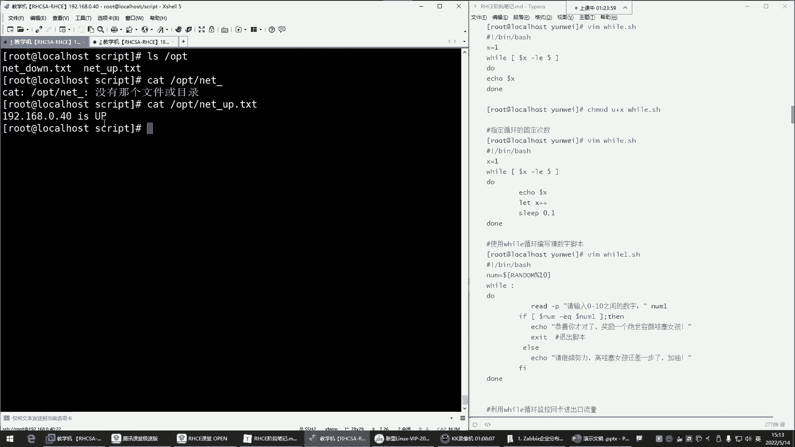


## 总结

本节课中我们一起学习了Shell脚本中两个强大的流程控制工具。
*   **`case`条件判断**：适用于多分支模式匹配的场景，结构清晰。
*   **`for`循环**：用于对一组值进行重复操作，是自动化批量任务的核心。我们通过创建用户和测试网络连通性两个例子，深入理解了其语法、执行流程以及如何结合命令参数和条件判断编写实用的脚本。

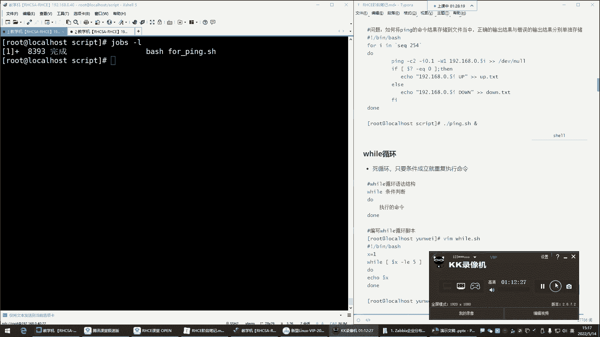

掌握这些结构，你将能编写出更高效、智能的脚本程序来处理日常系统管理任务。