# Linux脚本编程：10：shell函数、脚本中断及退出、字符串处理

## 概述
在本节课中，我们将学习Shell脚本编程中的几个核心概念：如何使用`while`循环进行持续监控、如何定义和使用函数来简化脚本、如何控制脚本的中断与退出，以及如何进行基础的字符串处理操作。这些知识将帮助你编写更高效、更易读的脚本。

---

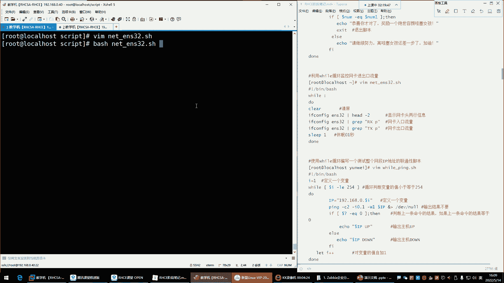

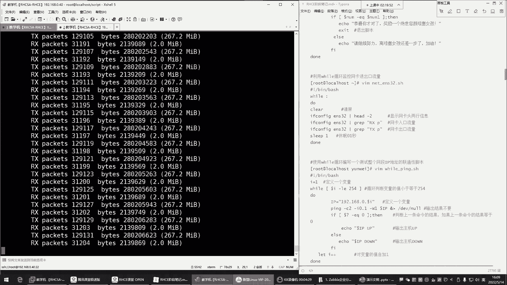

## 利用`while`循环进行持续监控

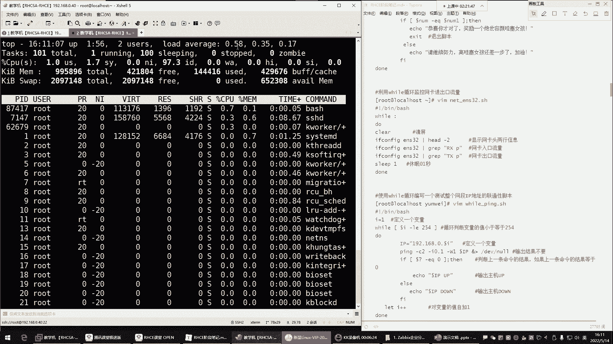

上一节我们介绍了循环结构，本节中我们来看看如何利用`while`循环执行需要持续进行的任务。

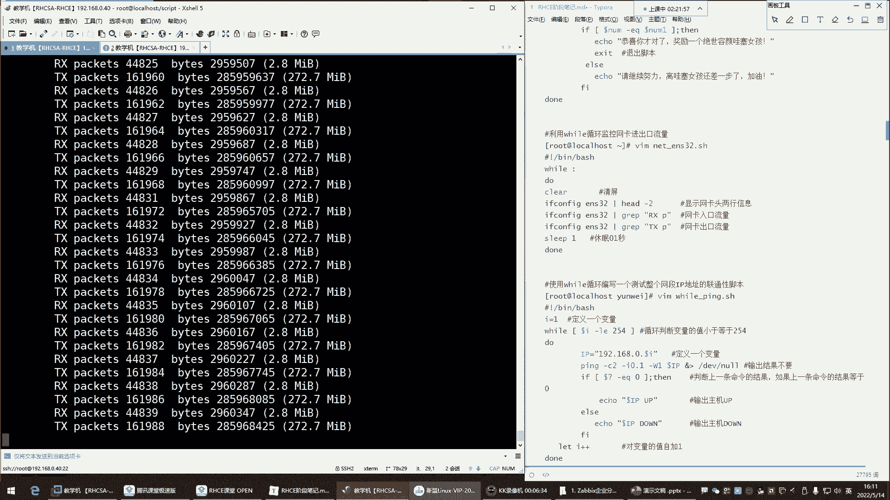

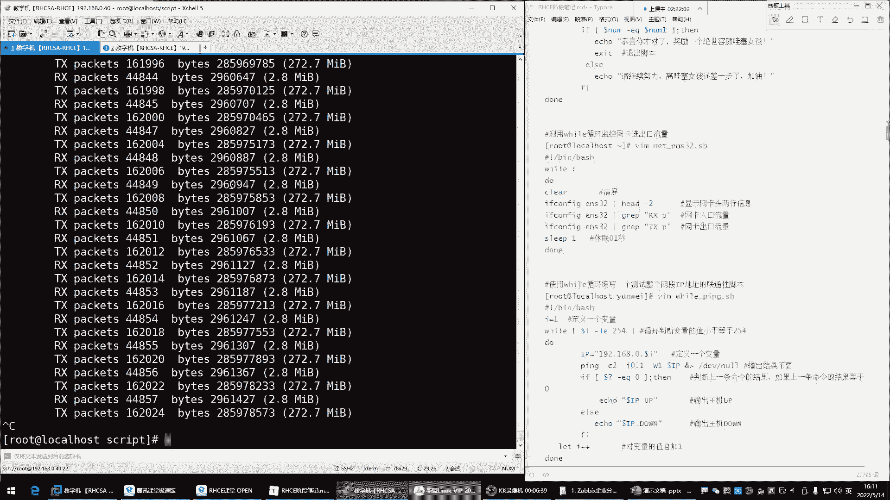

很多情况下，我们需要使用`while`循环来持续执行某些操作，例如监控网卡流量、内存或CPU使用率。这种循环通常没有明确的结束条件，因此被称为“死循环”。

其基本语法如下：
```bash
#!/bin/bash
while :
do
    # 要执行的命令
done
```
或者使用 `while true`，效果相同。

例如，我们想持续监控网卡`ens32`的入口和出口流量，可以使用以下脚本：
```bash
#!/bin/bash
while :
do
    # 获取入口流量
    ifconfig ens32 | grep "RX packets"
    # 获取出口流量
    ifconfig ens32 | grep "TX packets"
    # 暂停0.2秒，避免过度消耗CPU
    sleep 0.2
done
```
直接运行上述脚本会导致CPU使用率飙升，因为循环执行速度过快。因此，我们通常在循环内使用`sleep`命令来暂停一段时间。

为了让输出更清晰，可以在每次循环前清屏：
```bash
#!/bin/bash
while :
do
    clear
    ifconfig ens32 | grep "RX packets"
    ifconfig ens32 | grep "TX packets"
    sleep 0.2
done
```
这样，屏幕上每次只显示当前最新的流量信息。

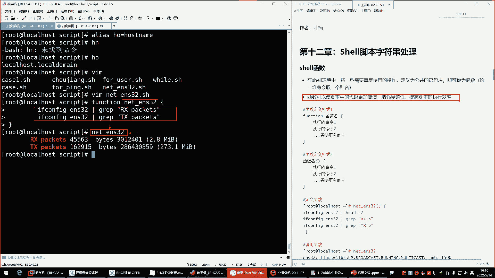

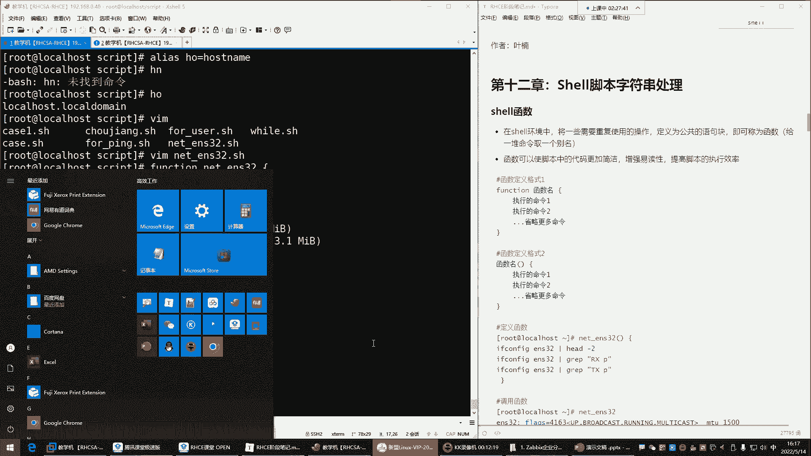

---

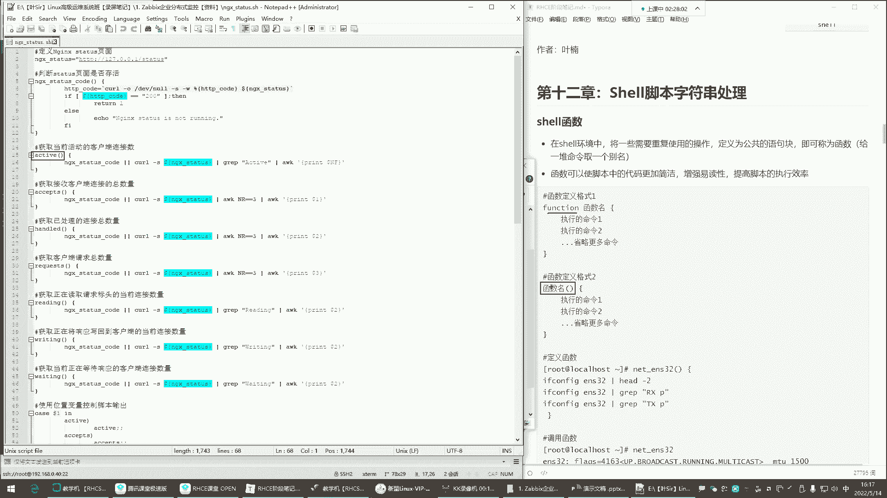

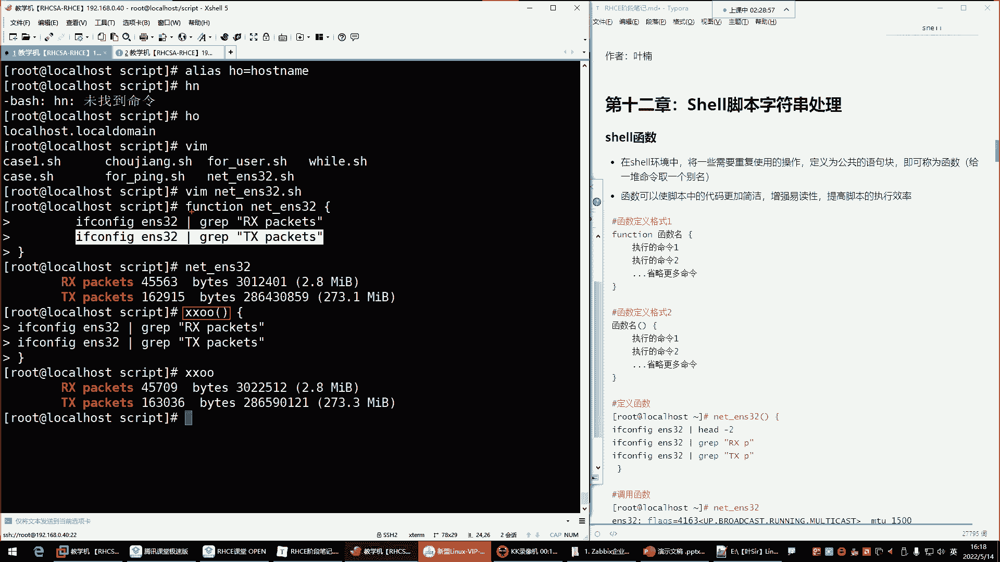

## Shell脚本中的函数

函数可以将一系列需要重复使用的命令组合成一个公共的语句块，并为其命名。这类似于给单个命令起别名（`alias`），但函数可以包含多条命令。

函数有两种定义格式。

**第一种格式**：使用 `function` 关键字。
```bash
function 函数名 {
    命令1
    命令2
    ...
}
```

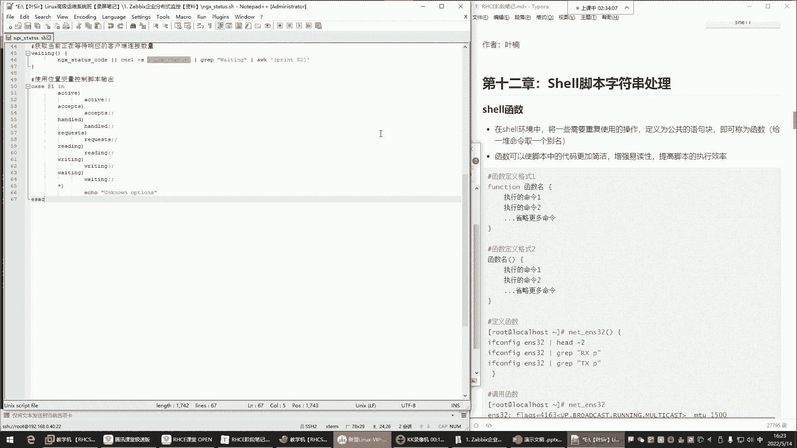

**第二种格式**（更常用）：直接使用函数名和小括号。
```bash
函数名() {
    命令1
    命令2
    ...
}
```
定义函数后，在脚本中通过函数名即可调用其中包含的所有命令。

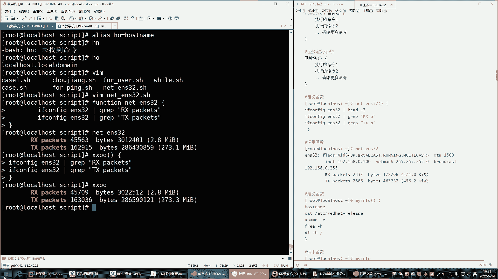

以下是一个简单的函数示例，用于查看系统信息：
```bash
sys_info() {
    hostname
    cat /etc/redhat-release
    free -h
    df -h /
}
```
调用时只需输入 `sys_info`。

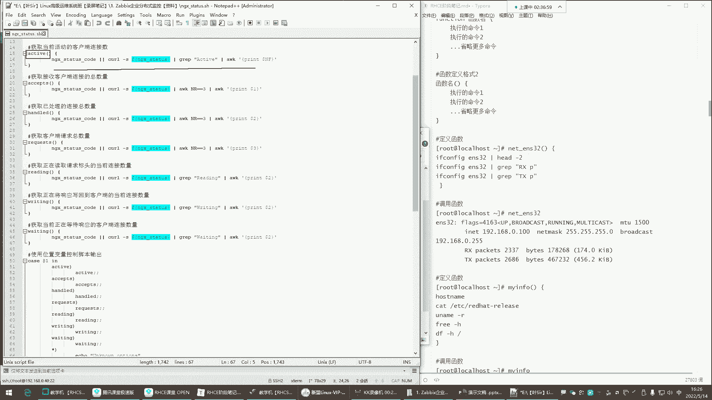

函数的主要作用是使脚本代码更加简洁，增强可读性，并提高脚本的执行效率。在复杂的脚本中，函数可以被多次调用，甚至在一个函数内部调用另一个函数。

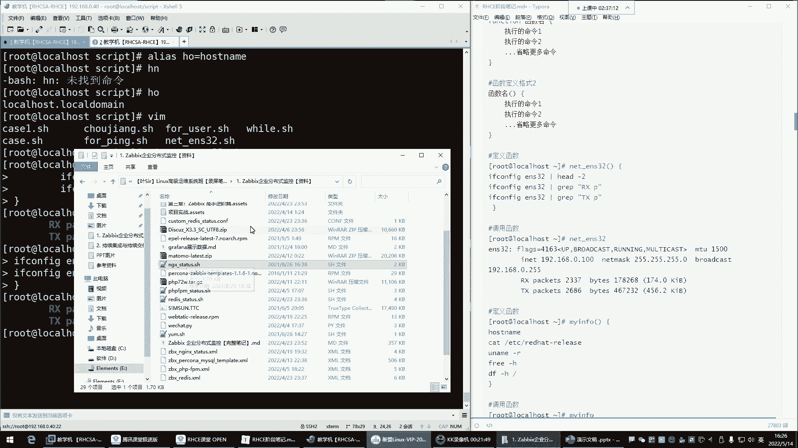

---

## 脚本的中断与退出

在脚本执行过程中，有时我们需要根据条件提前结束循环或整个脚本。Shell提供了几个控制命令：`continue`、`break` 和 `exit`。

*   **`continue`**：结束**本次**循环，跳过剩余命令，直接进入下一次循环。
*   **`break`**：结束**整个**循环，执行循环体之后的命令。
*   **`exit`**：退出**整个脚本**，后续所有命令都不再执行。

我们通过一个`for`循环的例子来演示它们的区别。假设我们有一个脚本，循环处理几个IP地址：

```bash
#!/bin/bash
for ip in 192.168.0.1 192.168.0.2 192.168.0.3 192.168.0.4 192.168.0.5
do
    # 如果IP是192.168.0.3，则跳过本次循环（不执行ping）
    if [ $ip == "192.168.0.3" ]; then
        continue
    fi
    echo "正在ping $ip"
    ping -c 1 $ip &> /dev/null
done
echo "循环结束"
```
*   使用 `continue` 时，脚本会跳过对 `192.168.0.3` 的ping操作，但会继续处理后面的IP。
*   将 `continue` 替换为 `break`，则脚本在处理到 `192.168.0.3` 时会直接跳出整个`for`循环，只执行循环前的IP，然后执行最后的 `echo "循环结束"`。
*   将 `continue` 替换为 `exit`，则脚本在处理到 `192.168.0.3` 时会立即终止，后续的IP处理和最后的 `echo` 命令都不会执行。

---

## 字符串处理

在脚本中处理命令输出或进行条件判断时，经常需要截取或处理字符串。Shell提供了一些基本的字符串操作。

首先，定义一个字符串变量：
```bash
phone="13800138000"
```

**1. 获取字符串长度**
使用 `${#变量名}` 的格式。
```bash
echo ${#phone}  # 输出：11
```

**2. 截取子字符串**
使用 `${变量名:起始位置:长度}` 的格式。**起始位置从0开始计数**。
```bash
echo ${phone:0:3}   # 从第0位开始，截取3位，输出：138
echo ${phone:3:4}   # 从第3位开始，截取4位，输出：0013
```
这些字符串操作在需要对命令输出进行精细过滤和提取时非常有用。

---

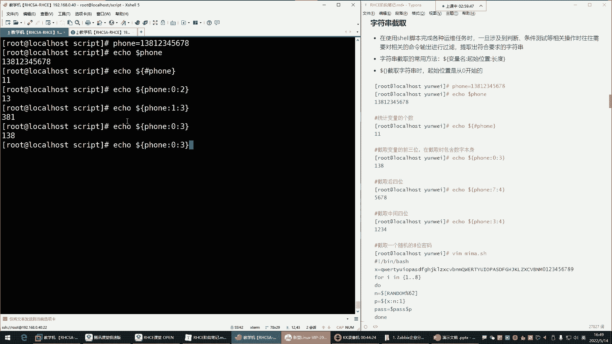

## 总结
本节课我们一起学习了Shell脚本编程的几个重要部分。我们了解了如何使用`while`循环构建持续监控任务；掌握了函数的定义与调用，它能让脚本结构更清晰；学习了`continue`、`break`和`exit`命令来控制脚本流程；最后，简单介绍了字符串长度获取和截取的基础操作。结合这些知识，你可以开始编写功能更强、逻辑更清晰的Shell脚本了。