# Linux运维教程：P47：Shell字符串处理与脚本实践

在本节课中，我们将学习Shell脚本中的字符串处理技巧，包括截取、替换和掐头去尾等操作。同时，我们也将探讨一个重要的学习理念：在运维工作中，学会借鉴和修改现有脚本往往比从零开始编写更为高效。

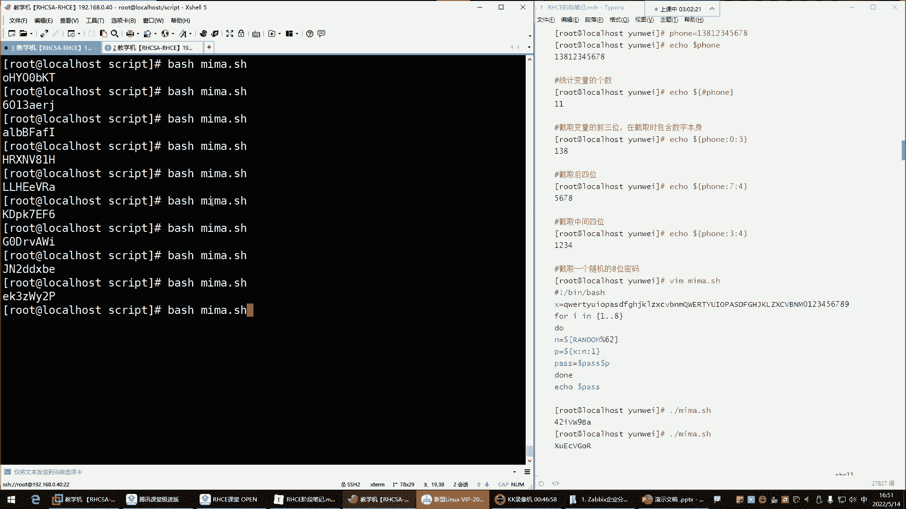

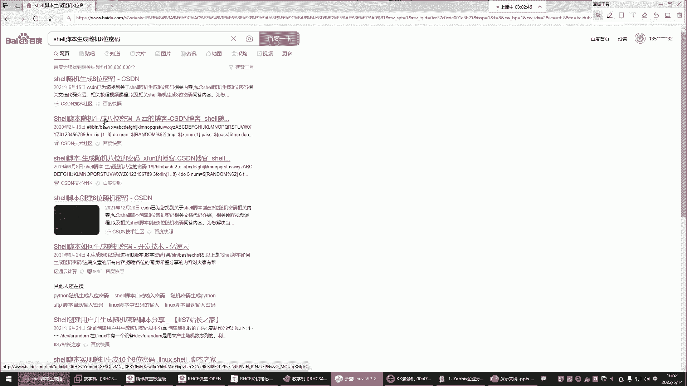

## 概述：字符串处理的应用场景

字符串处理功能常用于数据分析等场景，例如从数据中截取或过滤特定部分。Shell作为一门脚本语言，支持变量、循环、判断、数组和函数等编程特性，字符串处理是其中一项基础功能。

## 字符串截取

字符串截取的语法格式为：`${变量名:起始位置:长度}`。起始位置从0开始计数。

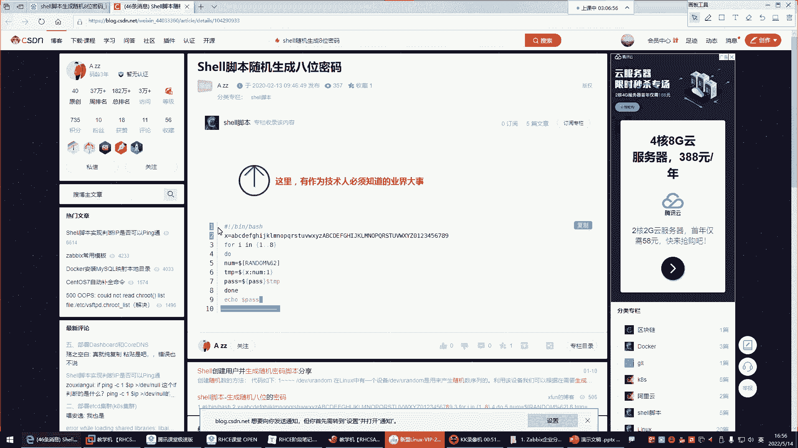

例如，我们有一个变量 `phone="13812345678"`，若想截取后四位（即"5678"），需要先计算起始位置。

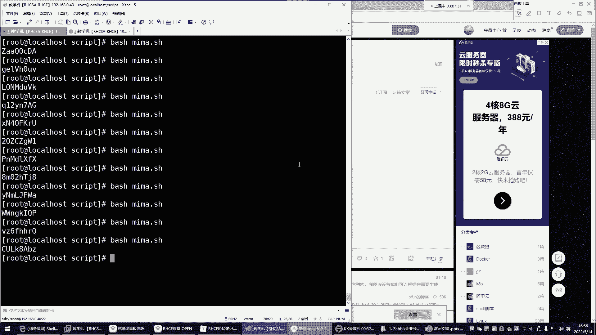

```
phone="13812345678"
echo ${phone:7:4}
```

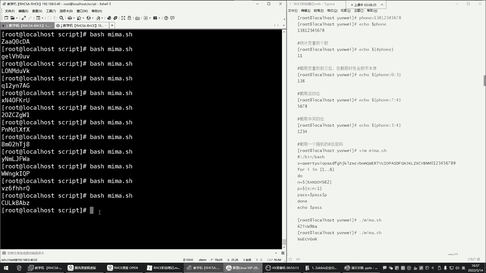

执行上述命令，输出结果为 `5678`。这表示从第7个字符（0开始计数）开始，截取4位长度。

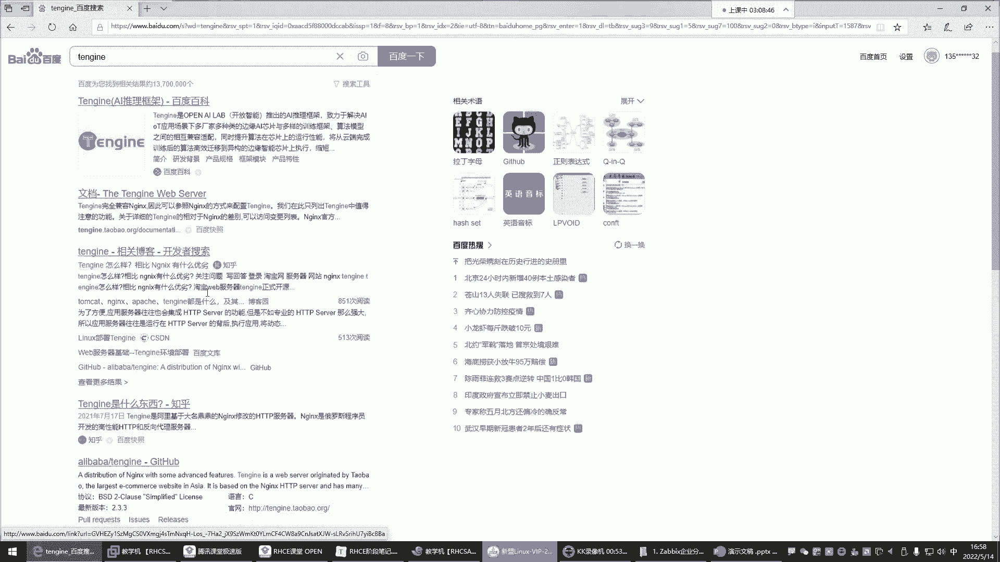

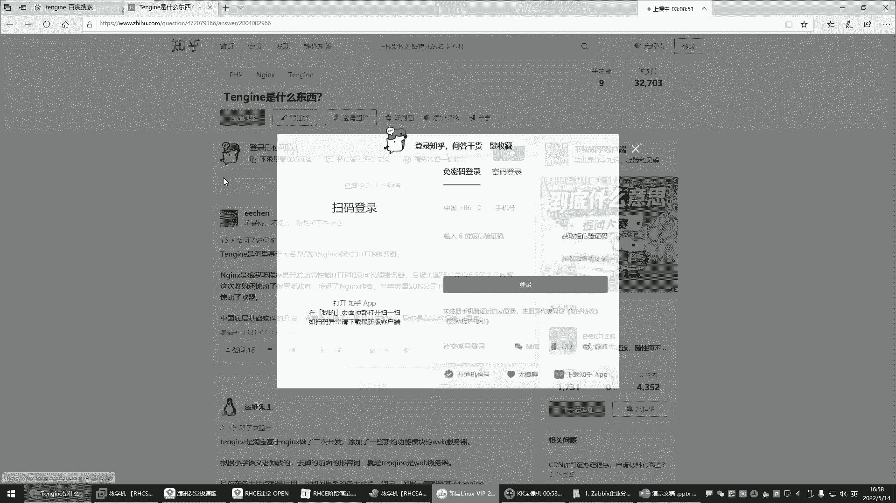

字符串截取不仅限于数字，也可以用于截取文件内容等文本信息。

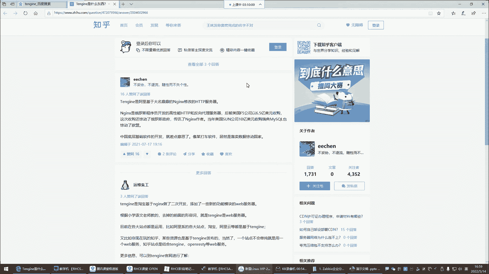

## 生成随机密码示例

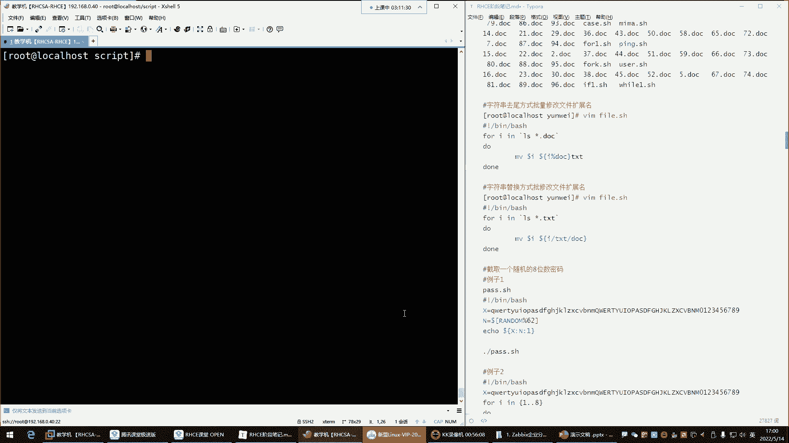

上一节我们介绍了字符串截取，本节中我们来看看一个实用的例子：生成随机密码。这个功能在工作中有实际需求，例如为用户随机分配密码。

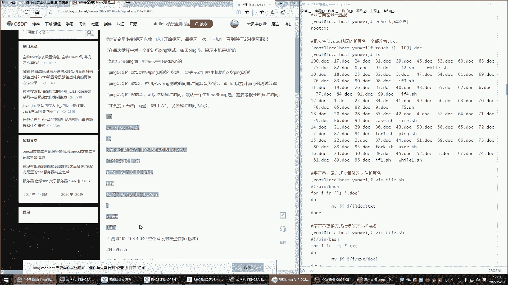

以下是一个生成随机八位密码的脚本示例：

```bash
#!/bin/bash
# 定义包含大小写字母和数字的字符串
str="abcdefghijklmnopqrstuvwxyzABCDEFGHIJKLMNOPQRSTUVWXYZ0123456789"
pass=""
# 循环8次，每次随机选取一个字符
for i in {1..8}
do
    num=$[RANDOM%62]
    tmp=${str:num:1}
    pass=$pass$tmp
done
echo $pass
```

**脚本逻辑解析：**
1.  变量 `str` 存储了62位可能的字符（26小写字母+26大写字母+10数字）。
2.  `for` 循环执行8次。
3.  每次循环，`$[RANDOM%62]` 生成一个0到61的随机数，作为截取 `str` 的起始位置。
4.  `${str:num:1}` 从 `str` 中截取1位字符。
5.  将每次截取的字符拼接至 `pass` 变量，最终形成8位随机密码。

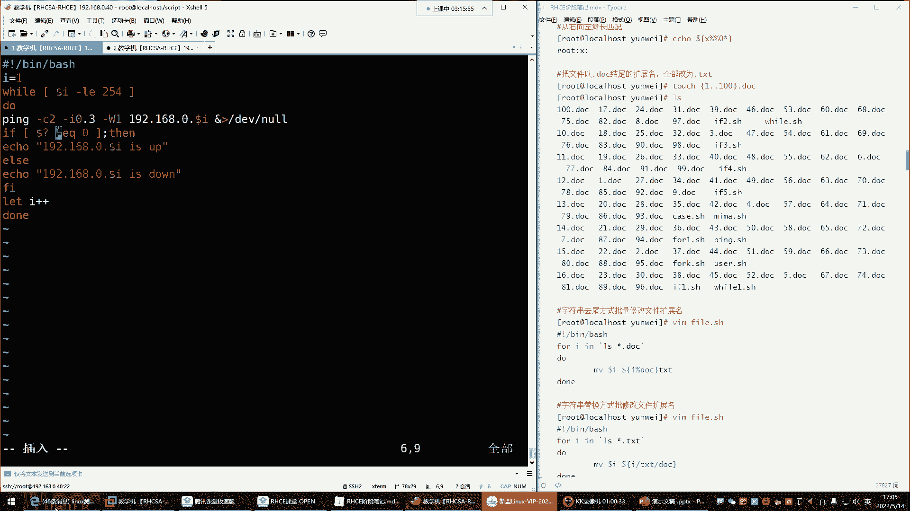

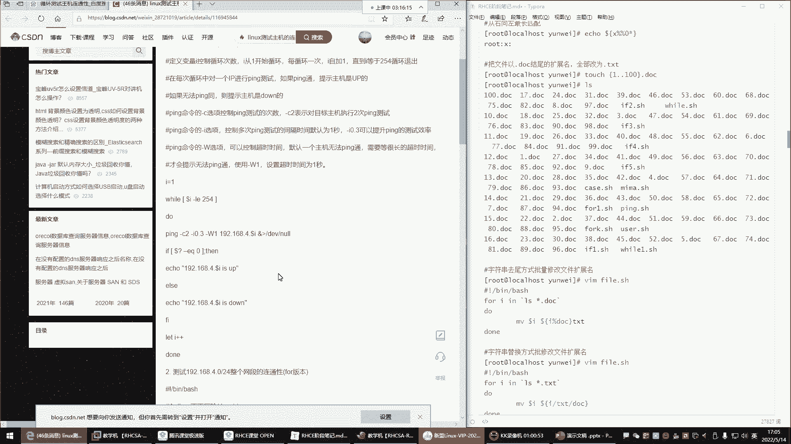

对于这类通用功能，通常不需要自己从头编写，可以在网上搜索“Shell生成随机密码”等关键词，找到现成脚本并根据需要修改使用。在技术领域，善于利用现有资源是高效解决问题的重要能力。

## 字符串替换

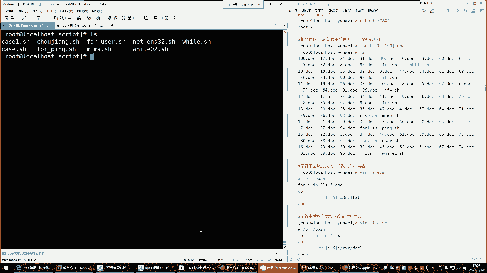

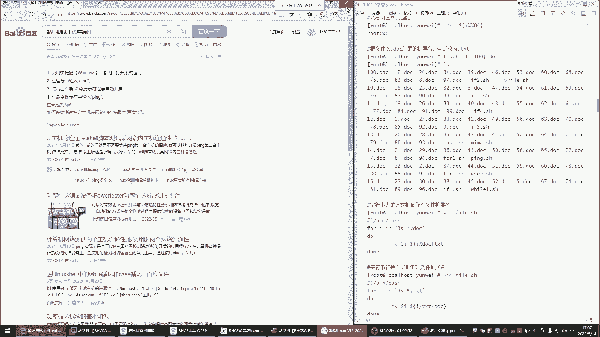

字符串替换的语法格式为：`${变量名/旧字符串/新字符串}`。用单斜线`/`替换首次匹配，用双斜线`//`替换所有匹配。

例如，我们有一个变量 `file="test1234.txt"`，想将中间的 `1234` 替换为 `****`。

```
file="test1234.txt"
echo ${file/1234/****}
```

执行命令，输出结果为 `test****.txt`。

**替换全部匹配项：**
如果变量 `num="313333"`，想将所有 `3` 替换为 `*`，需要使用双斜线语法。

```
num="313333"
echo ${num//3/*}
```

执行命令，输出结果为 `*1****`。

## 字符串掐头去尾

“掐头”指删除从左侧开始的匹配部分，“去尾”指删除从右侧开始的匹配部分。
*   **掐头语法**：`${变量名#匹配规则}` 为最短匹配，`${变量名##匹配规则}` 为最长匹配。
*   **去尾语法**：`${变量名%匹配规则}` 为最短匹配，`${变量名%%匹配规则}` 为最长匹配。

其中，`*` 是通配符，代表任意字符。

**示例：**
假设变量 `path="/usr/local/bin/app"`。

```
path="/usr/local/bin/app"
echo ${path#*/}    # 掐头（最短匹配）：删除第一个`/`及之前的部分，输出 `usr/local/bin/app`
echo ${path##*/}   # 掐头（最长匹配）：删除最后一个`/`及之前的部分，输出 `app`
echo ${path%/*}    # 去尾（最短匹配）：删除最后一个`/`及之后的部分，输出 `/usr/local/bin`
echo ${path%%/*}   # 去尾（最长匹配）：删除第一个`/`及之后的部分，输出 `（空）`
```

## 实践：批量修改文件扩展名

字符串处理的一个典型应用是批量修改文件扩展名。以下是使用“去尾”和“替换”两种方法实现的脚本。

**方法一：使用去尾（%）语法**

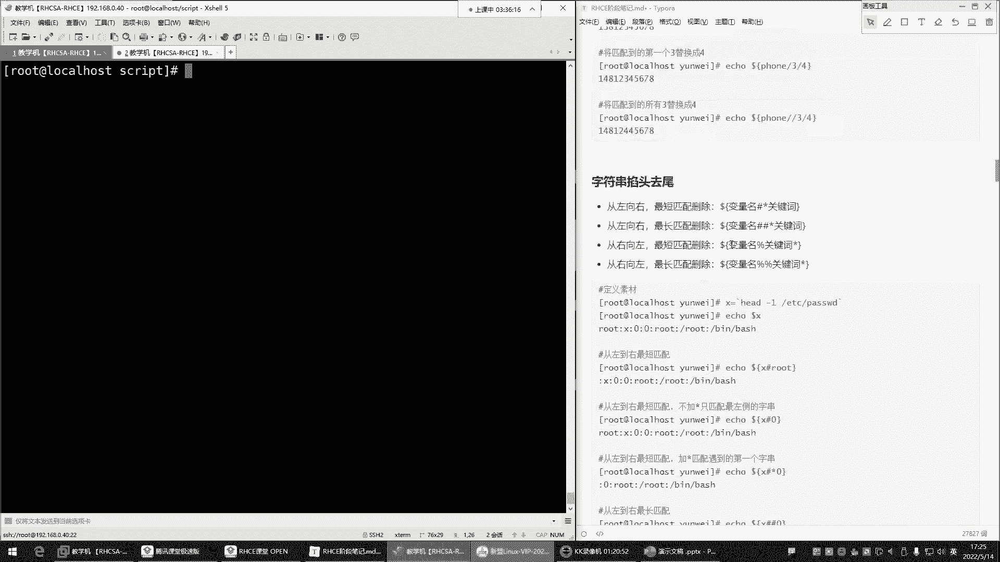

```bash
#!/bin/bash
for i in $(ls *.txt)
do
    mv $i ${i%.txt}.doc
done
```

**方法二：使用替换（/）语法**

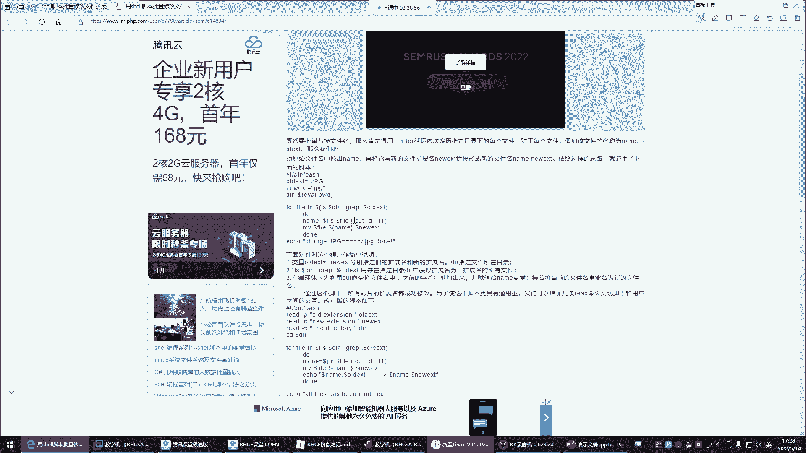

```bash
#!/bin/bash
for i in $(ls *.doc)
do
    mv $i ${i/.doc/.txt}
done
```

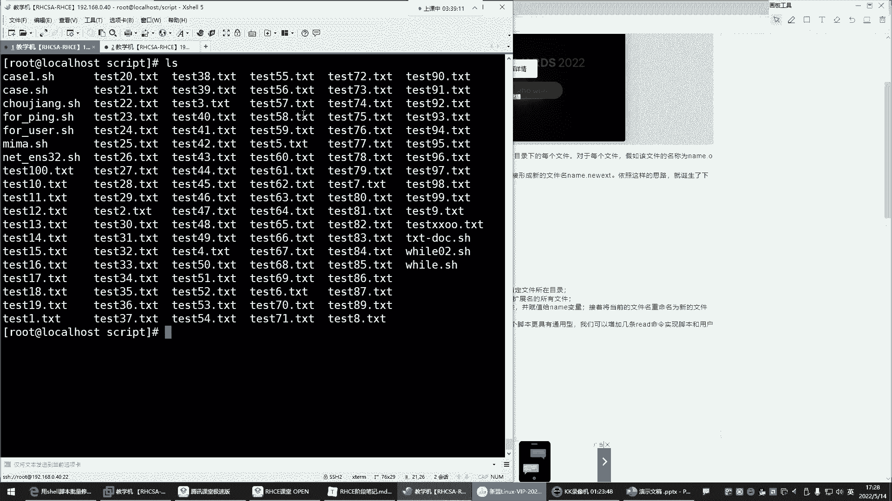

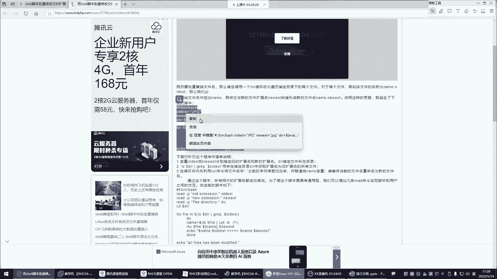

**脚本逻辑解析：**
1.  `$(ls *.txt)` 列出当前目录下所有 `.txt` 文件。
2.  `for` 循环遍历每个文件名。
3.  `mv` 命令进行重命名。
    *   方法一：`${i%.txt}` 去掉变量 `i`（文件名）末尾的 `.txt`，然后拼接上 `.doc`。
    *   方法二：`${i/.doc/.txt}` 将变量 `i`（文件名）中的 `.doc` 替换为 `.txt`。

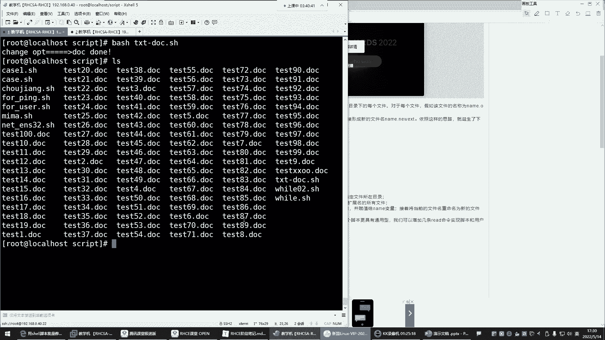


当遇到此类批量操作需求时，可以搜索“Shell批量修改扩展名”参考现有脚本。关键在于能读懂脚本逻辑，并根据自己的实际环境（如文件路径、扩展名）进行修改。掌握基础语法是为了能够理解和调整脚本，而非必须记忆所有细节。

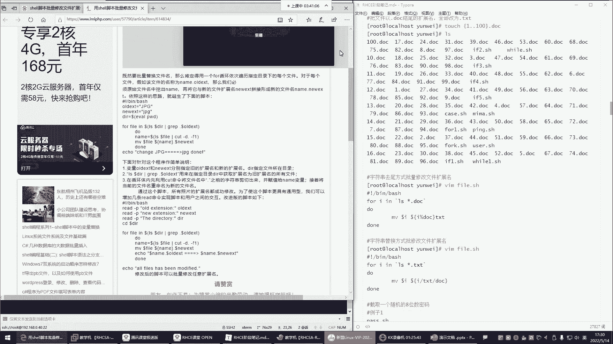

## 总结与学习理念

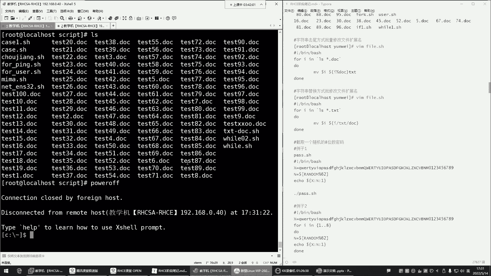

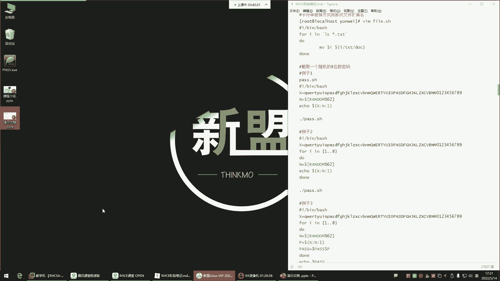

本节课中我们一起学习了Shell字符串的截取、替换和掐头去尾操作，并通过生成随机密码、批量修改文件名等案例看到了它们的实际应用。

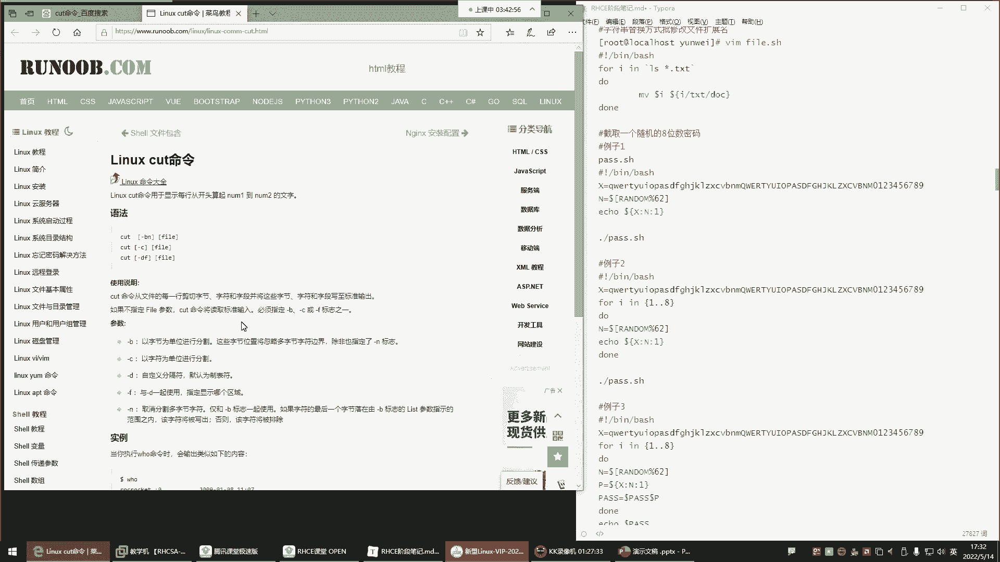

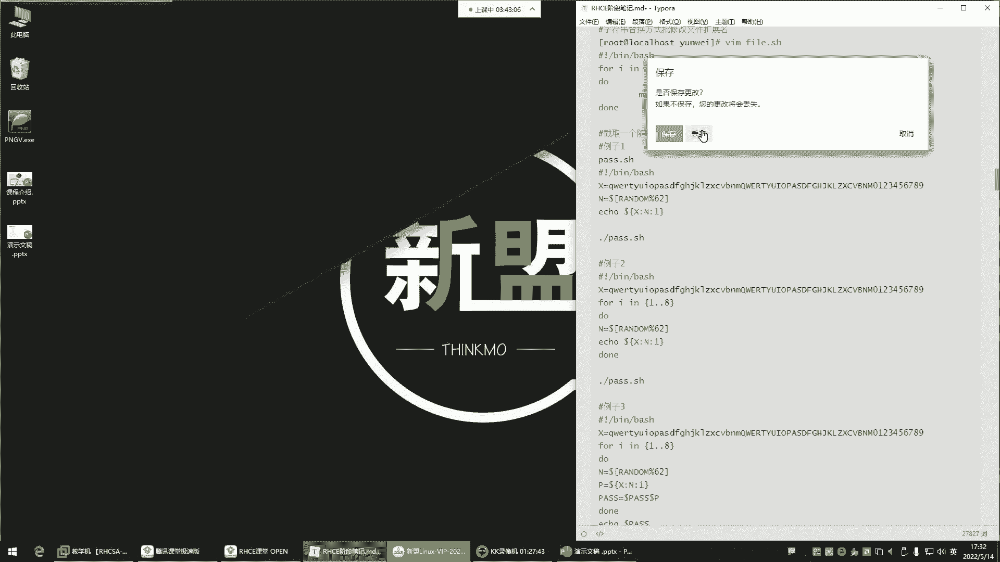


更重要的是，我们探讨了运维脚本学习的有效方法：**理解基础，善于借鉴**。在互联网时代，大多数通用脚本需求都有现成解决方案。工程师的核心能力之一，是能够快速找到、理解并修改这些脚本，使其适应自己的生产环境，而不是凡事都从零造轮子。这需要你具备扎实的基础知识以看懂脚本，同时拥有灵活运用资源解决问题的思维。记住，“会改”是一种强大的能力。