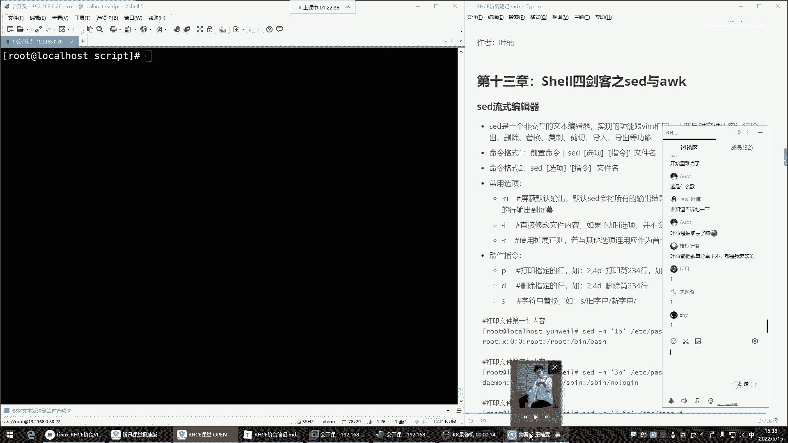
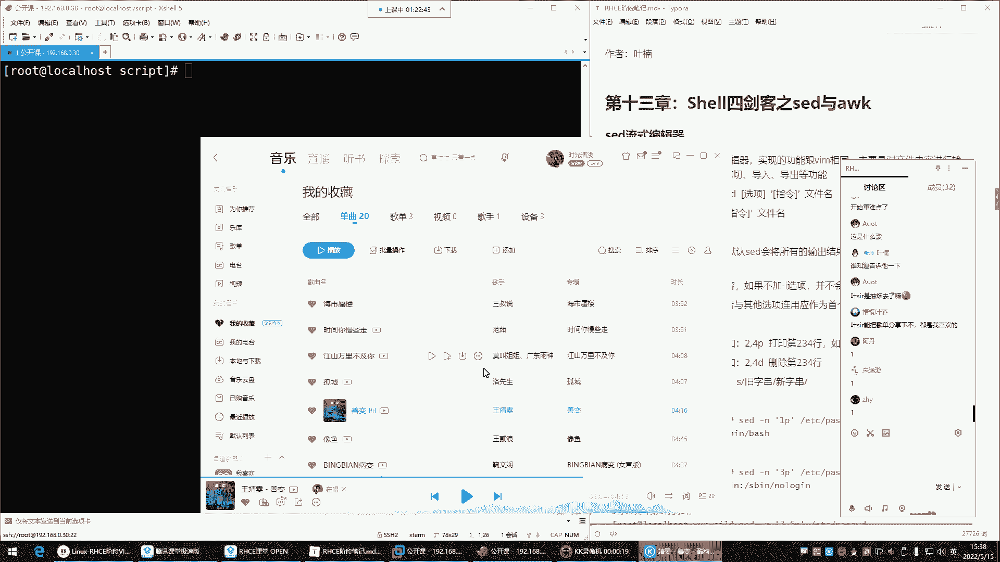
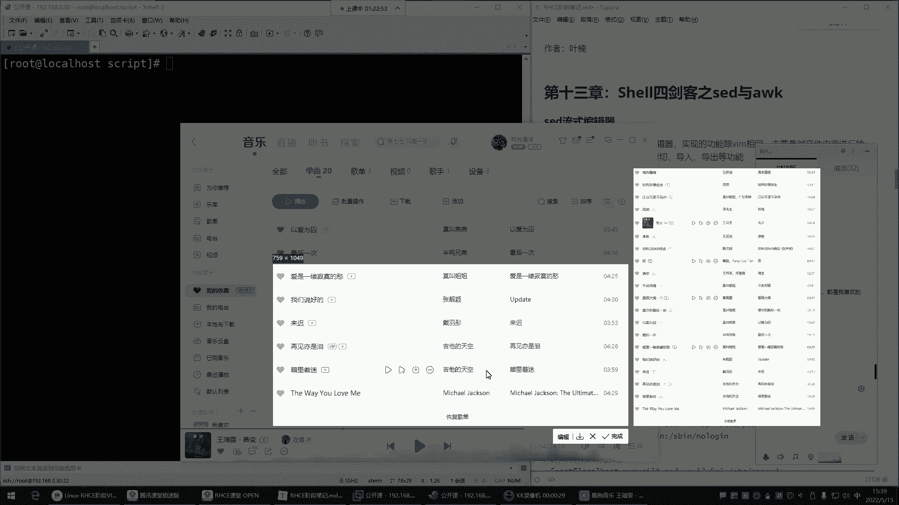
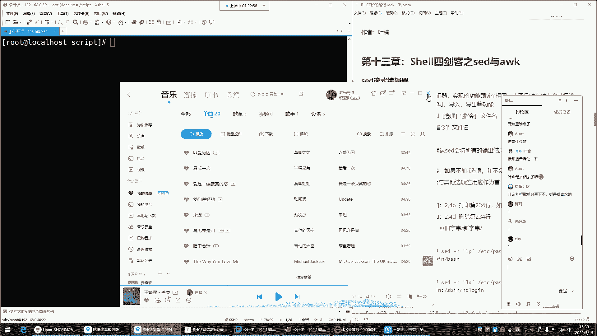
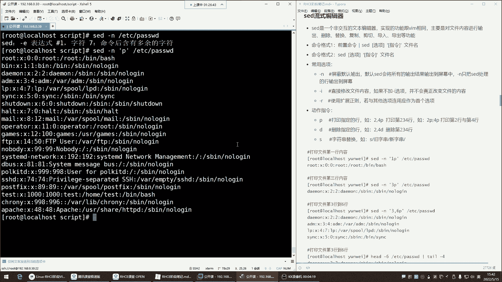
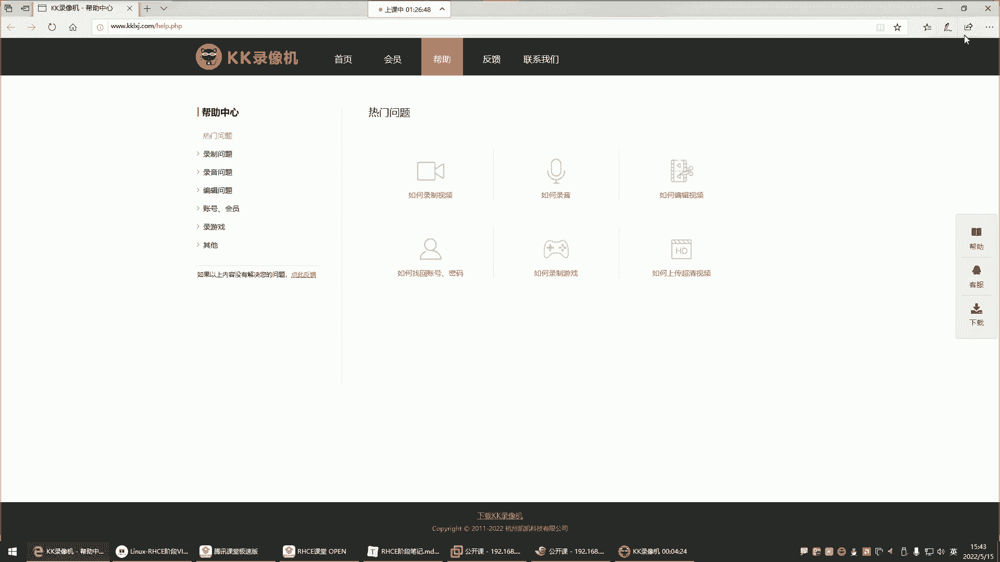
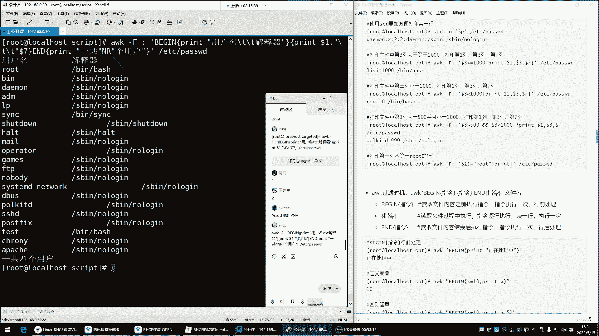
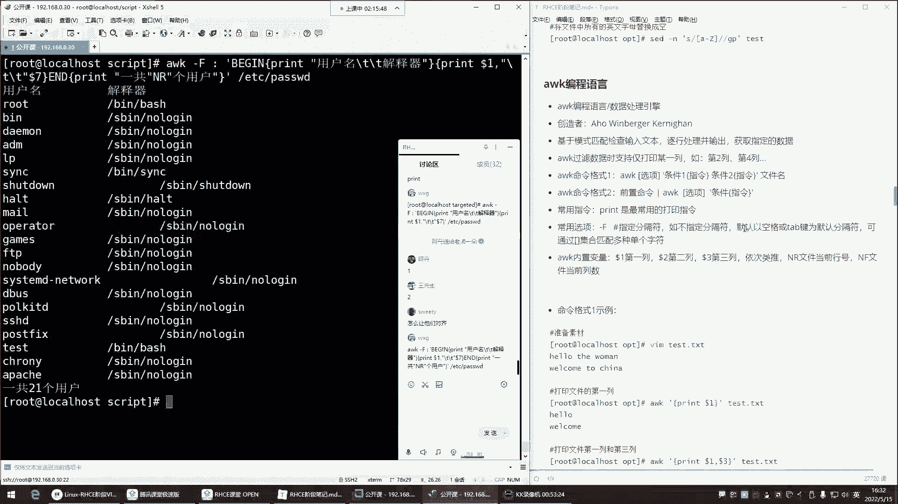
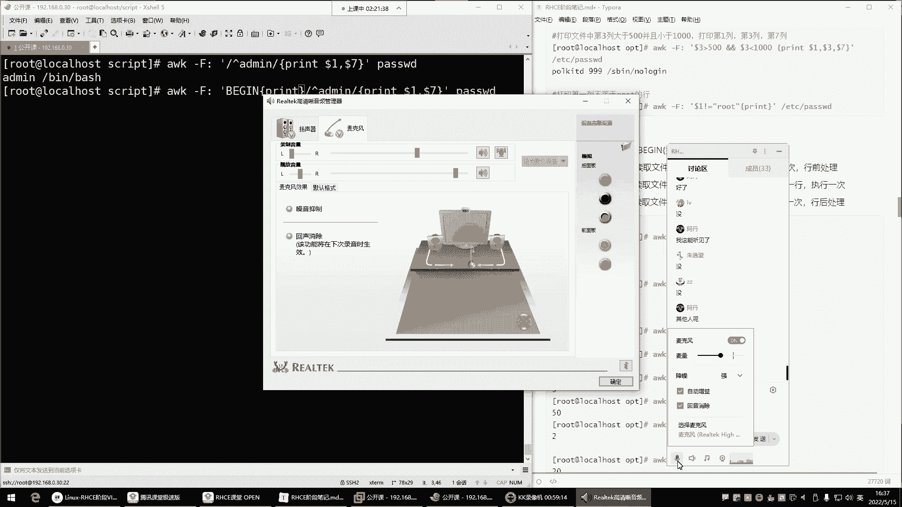
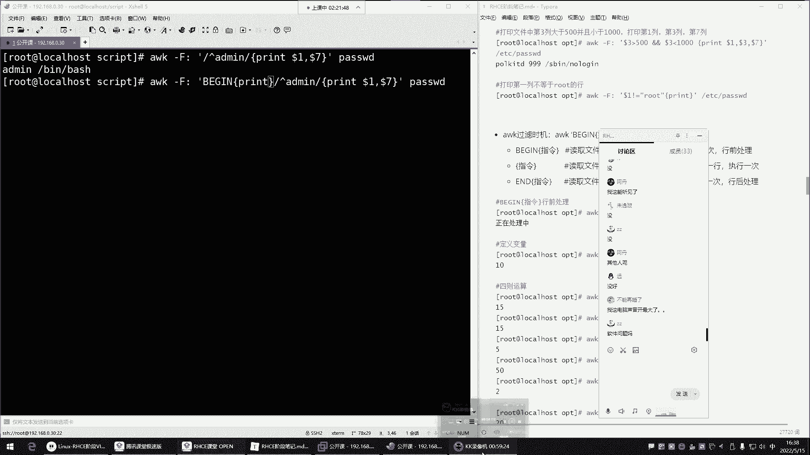

# Linux运维：P49：Shell四剑客之Sed与Awk









在本节课中，我们将学习Shell文本处理中的两个强大工具：Sed流式编辑器和Awk编程语言。它们能够以非交互的方式高效地处理文本文件，实现查找、替换、删除和格式化输出等功能，是脚本编写和日常运维的得力助手。

上一节我们介绍了文本处理的基础概念，本节中我们来看看Sed和Awk的具体应用。





## Sed流式编辑器

Sed（Stream Editor）是一个非交互式的流式文本编辑器。你可以将其理解为命令行版本的Vim，但它专为脚本设计，能够通过命令直接对文件内容进行增、删、改、查，而无需打开文件。

Sed的基本命令格式有两种：
1.  **前置命令 | sed [选项] ‘指令’**
2.  **sed [选项] ‘指令’ 文件名**

常用的选项包括：
*   **-n**：屏蔽默认输出，只显示处理过的行。
*   **-i**：直接修改源文件（慎用，建议先测试）。
*   **-r**：使用扩展正则表达式。

指令则用于指定操作，如打印（p）、删除（d）、替换（s）等。

### 打印文本内容

以下是使用Sed打印文件内容的几种方法。

*   **打印整个文件**：`sed -n ‘p’ 文件名`
*   **打印指定行**：`sed -n ‘3p’ 文件名` （打印第3行）
*   **打印连续行范围**：`sed -n ‘2,4p’ 文件名` （打印第2到第4行）
*   **打印不连续行**：`sed -n ‘6p;10p’ 文件名` （打印第6行和第10行）

**注意**：使用 `-n` 选项是为了屏蔽Sed的默认输出（即原样输出整个文件），只显示我们通过 `p` 指令明确要求打印的行。

### 删除文本行

以下是使用Sed删除文件内容的方法。

*   **删除指定行**：`sed -i ‘5d’ 文件名` （删除第5行）
*   **删除连续行范围**：`sed -i ‘2,4d’ 文件名` （删除第2到第4行）

**重要提示**：`-i` 选项会直接修改源文件。在实际操作前，强烈建议先使用不带 `-i` 的命令预览效果，例如 `sed -n ‘2,4p’ 文件名`，确认无误后再执行删除操作。

### 替换文本内容

Sed的替换功能非常强大，语法与Vim类似。

基本替换格式为：`sed ‘s/旧内容/新内容/标志’ 文件名`

*   **普通替换**：`sed -n ‘s/root/admin/p’ 文件名` （将每行第一个”root”替换为”admin”并打印）
*   **全局替换**：`sed -n ‘s/root/admin/gp’ 文件名` （将行内所有”root”替换为”admin”并打印）
*   **直接修改文件**：`sed -i ‘s/root/admin/g’ 文件名` （全局替换并直接保存到文件）

### 结合正则表达式

Sed可以配合正则表达式进行更灵活的匹配和操作。

*   **匹配包含特定字符串的行**：`sed -n ‘/demo/p’ 文件名`
*   **替换匹配正则的内容**：`sed -n ‘s/^demo.*$/replacement/gp’ 文件名` （将以”demo”开头的行整体替换）

Sed的功能就先介绍到这里，它擅长对文本行进行直接的编辑操作。接下来，我们看看另一个专注于数据提取和报告生成的工具——Awk。

## Awk文本分析工具

Awk不仅仅是一个命令，它是一门功能完整的编程语言，常用于对文本和数据进行扫描、过滤、统计并生成报告。它特别擅长处理结构化文本（如表格数据）。

Awk的基本命令格式为：**awk [选项] ‘模式 {动作}’ 文件名**

最常用的选项是 **-F**，用于指定输入字段的分隔符，默认为空格或制表符。

### 基础打印与过滤

以下是Awk的基础用法。

*   **打印整个文件**：`awk ‘{print}’ 文件名`
*   **过滤包含特定字符串的行**：`awk ‘/admin/ {print}’ 文件名`
*   **打印指定字段**：`awk -F ‘:’ ‘{print $1}’ /etc/passwd` （以冒号分隔，打印第一列用户名）

在Awk中，`$1`、`$2`…`$n` 代表第1、2…n个字段。

### 内置变量

Awk提供了有用的内置变量。

*   **NR**：当前处理的行号（Number of Records）。
*   **NF**：当前行的字段数量（Number of Fields）。
*   **FS**：输入字段分隔符（Field Separator），等同于 `-F` 选项。
*   **OFS**：输出字段分隔符（Output Field Separator）。

示例：`awk -F ‘:’ ‘{print NR, $1}’ /etc/passwd` （打印行号和用户名）

### BEGIN与END模式

BEGIN和END是特殊的模式，分别在所有行处理之前和之后执行一次。





以下是使用BEGIN和END模式的综合示例。

```bash
awk -F ‘:’ ‘BEGIN {print “用户名\t\t解释器”} /^admin/ {print $1, “\t\t”, $7} END {print “总计用户:”, NR}’ /etc/passwd
```

这个命令会：
1.  在开始前（BEGIN）打印表头。
2.  处理每一行时，如果以”admin”开头，则打印用户名（$1）和解释器（$7）。
3.  在所有行处理后（END）打印总用户数。





本节课中我们一起学习了Sed编辑器和Awk编程语言的基础用法。Sed擅长对文本进行流式编辑（增删改查），而Awk则精于基于字段的文本分析和数据提取。它们组合起来，能够解决Shell环境中绝大多数复杂的文本处理任务。请务必通过实践练习来巩固这些命令的使用。