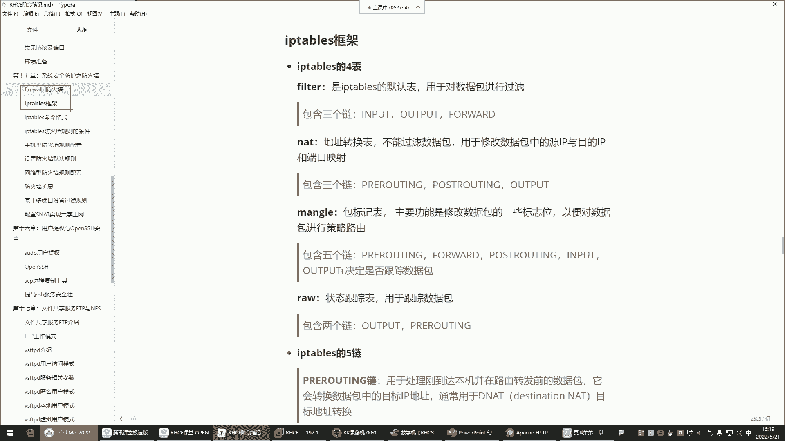
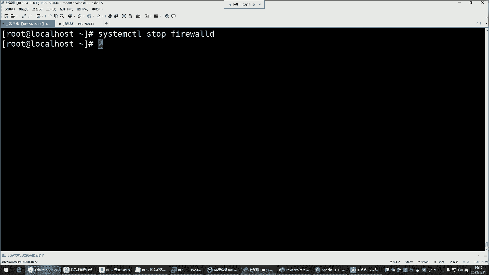
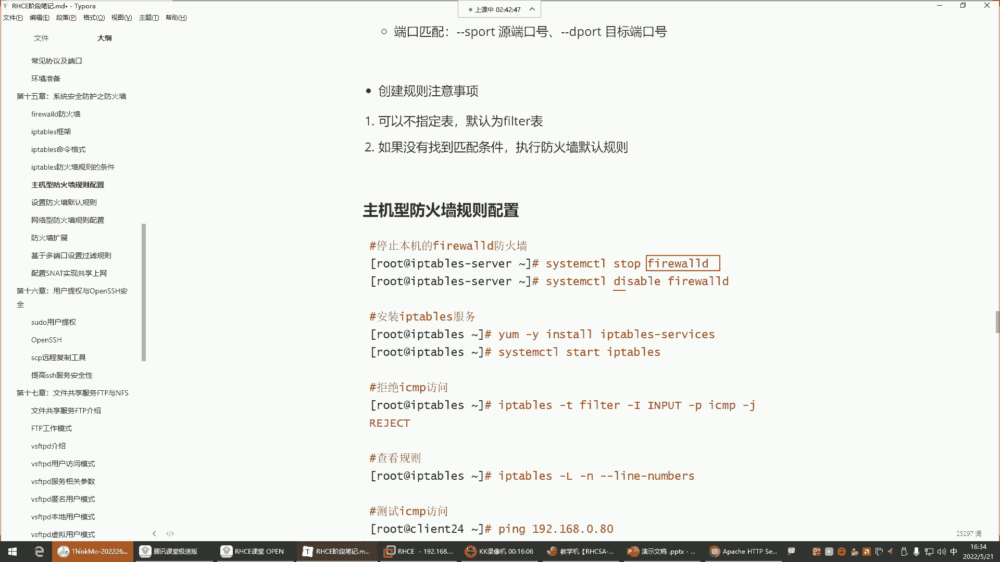
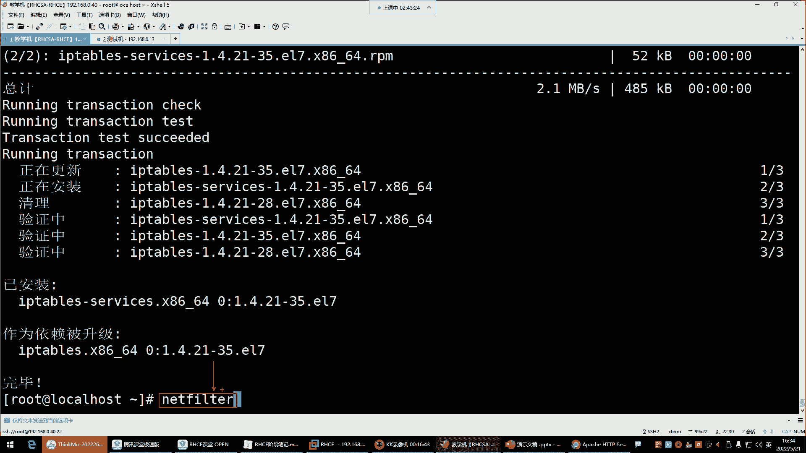
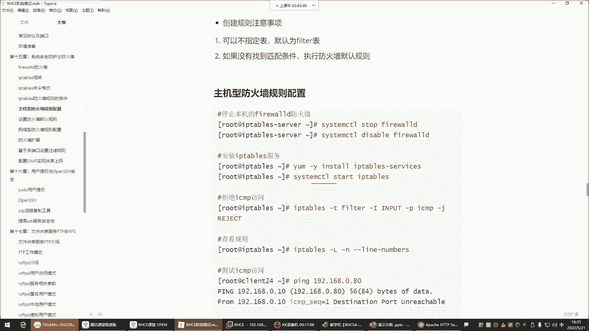
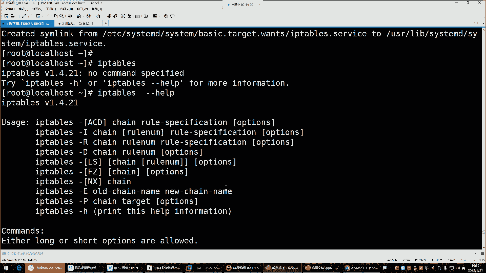
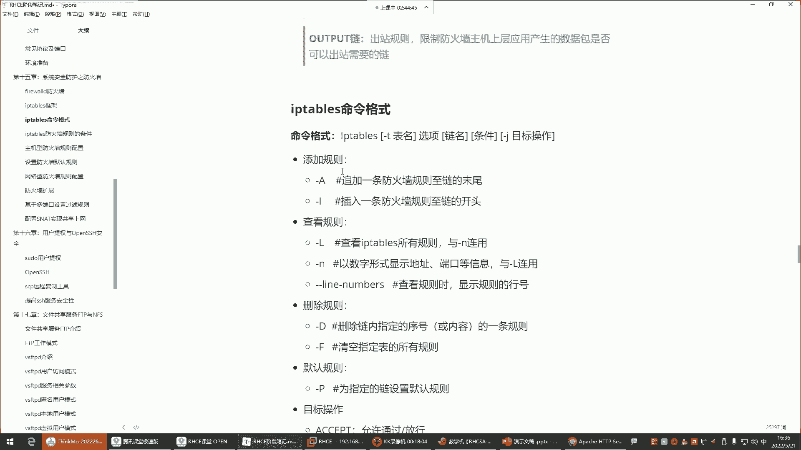
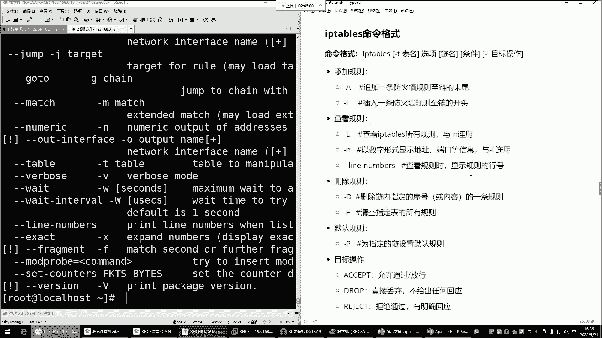

# Linux防火墙管理：P53：iptables四表五链详解

## 概述
在本节课中，我们将学习iptables防火墙的核心概念——四表五链。我们将了解每个表和链的功能、它们之间的关系，以及在实际应用中如何选择和使用它们来构建防火墙规则。理解这些概念是掌握iptables配置的基础。



## 四表与五链的关系
上一节我们提到了iptables与firewalld都是管理netfilter内核模块的工具。本节中，我们来看看iptables独特的组织架构。



iptables通过“表”和“链”来组织防火墙规则。**表**是规则的容器，每个表有特定的功能。**链**则存在于表中，是规则的实际挂载点，数据包会按照预定顺序流经这些链并被其中的规则处理。

简单来说：**表**决定功能（如过滤或地址转换），**表**中包含**链**，而我们在**链**中配置具体的**规则**。

## 详解四张表
以下是iptables中的四张主要表及其功能：

1.  **filter表**
    *   **功能**：iptables的默认表，用于对数据包进行**过滤**。它就像地铁站的安检口，决定哪些数据包可以进入、离开或穿越主机。
    *   **核心概念**：所有用于数据包允许/拒绝的规则，主要都配置在此表相关的链中。

2.  **nat表**
    *   **功能**：用于网络**地址转换**，修改数据包中的源IP、目的IP或端口。
    *   **核心概念**：实现诸如SNAT（源地址转换，内网访问外网）和DNAT（目的地址转换，外网访问内网服务）等功能。

3.  **mangle表**
    *   **功能**：用于修改数据包的**标记位**，以实现策略路由等高级功能。
    *   **核心概念**：例如，可以根据规则决定数据包从哪块网卡进出。此表功能复杂，日常应用较少。

4.  **raw表**
    *   **功能**：用于**状态跟踪**，决定数据包是否被连接跟踪机制处理。
    *   **核心概念**：全程跟踪连接状态消耗资源较多，在企业防火墙中通常不启用此功能。

**重点**：对于初学者和大多数应用场景，我们主要学习和使用 **`filter`表**（数据过滤）和 **`nat`表**（地址转换）。`mangle`和`raw`表使用频率很低。

## 详解五条链
数据包在流经网络栈时，会在特定位置被“钩子”（hook）拦截，并送入对应的链进行处理。以下是五条核心链：

1.  **INPUT链**
    *   **作用**：处理**进入本机**的数据包。
    *   **应用场景**：配置**主机型防火墙**规则。例如，允许或拒绝他人访问本机的SSH服务或Web服务。
    *   **核心概念**：保护防火墙主机自身的应用和服务。

2.  **OUTPUT链**
    *   **作用**：处理**从本机发出**的数据包。
    *   **应用场景**：控制本机应用程序对外部的访问。通常配置较少，因为重点是管控“进入”的流量。

3.  **FORWARD链**
    *   **作用**：处理**经过本机转发**的数据包（本机充当路由器或网关时）。
    *   **应用场景**：配置**网络型防火墙**规则。例如，保护内部网络中的其他服务器，过滤经过防火墙转发的流量。

4.  **PREROUTING链**
    *   **作用**：在数据包进入**路由决策之前**进行处理。
    *   **应用场景**：主要用于`nat`表的**DNAT**（目的地址转换）。例如，将访问防火墙公网IP:80端口的流量，转发到内网服务器的192.168.1.100:80。

5.  **POSTROUTING链**
    *   **作用**：在数据包离开**路由决策之后**进行处理。
    *   **应用场景**：主要用于`nat`表的**SNAT**（源地址转换）。例如，让内网所有主机共享一个公网IP访问互联网。

## 表与链的对应关系
并非每个链都存在于所有表中。下表展示了常用的对应关系：

| 链名 (Chain) | 主要所属表 (Table) | 常见用途 |
| :--- | :--- | :--- |
| **INPUT** | **filter** | 过滤进入本机的数据包 |
| **OUTPUT** | **filter**, nat, mangle | 过滤本机发出的数据包 |
| **FORWARD** | **filter** | 过滤转发的数据包 |
| **PREROUTING** | **nat**, mangle, raw | 修改目的地址(DNAT) |
| **POSTROUTING** | **nat**, mangle | 修改源地址(SNAT) |

**关键理解**：
*   想实现**过滤**功能（允许/拒绝），就在 **`filter`表**的 **`INPUT`、`FORWARD`、`OUTPUT`链** 中写规则。
*   想实现**地址转换**，就在 **`nat`表**的 **`PREROUTING`（DNAT）或`POSTROUTING`（SNAT）链** 中写规则。

## 工作流程与数据包流向
为了更直观地理解，我们可以简化数据包的流向图：

```
流入的数据包
     |
     v
[PREROUTING链] (nat: DNAT, mangle)
     |
     v
路由判断 (这个包是发给我的？还是需要转发的？)
     |
     |---> 目标是本机 ---> [INPUT链] (filter: 过滤) ---> 本地进程
     |
     v
目标是其他机器
     |
     v
[FORWARD链] (filter: 过滤) ---> [POSTROUTING链] (nat: SNAT, mangle)
     |
     v
流出的数据包
     |
     v
[OUTPUT链] (filter, nat, mangle) ---> [POSTROUTING链] (nat: SNAT, mangle)
     |
     v
离开主机
```

## 基础命令与准备工作
在开始配置规则前，需要确保iptables服务已安装并启用，同时停用可能冲突的firewalld。

以下是准备步骤：

1.  停止并禁用firewalld（两者管理同一内核模块，会冲突）：
    ```bash
    systemctl stop firewalld
    systemctl disable firewalld
    ```

2.  安装iptables-services软件包（某些系统已预装）：
    ```bash
    yum install -y iptables-services
    ```



3.  启动iptables服务并设置开机自启：
    ```bash
    systemctl start iptables
    systemctl enable iptables
    ```



4.  查看iptables帮助，了解命令格式：
    ```bash
    iptables --help
    ```



## 总结
本节课我们一起学习了iptables防火墙的核心架构。



*   **四张表**：`filter`（过滤，最常用）、`nat`（地址转换）、`mangle`（修改标记）、`raw`（状态跟踪）。我们重点关注`filter`和`nat`表。
*   **五条链**：`INPUT`（入站）、`OUTPUT`（出站）、`FORWARD`（转发）、`PREROUTING`（路由前）、`POSTROUTING`（路由后）。它们分布在不同的表中，承担特定阶段的处理任务。
*   **核心应用**：
    *   保护本机服务：在 **`filter`表的`INPUT`链** 设置规则。
    *   保护内部网络：在 **`filter`表的`FORWARD`链** 设置规则。
    *   做端口映射/DNAT：在 **`nat`表的`PREROUTING`链** 设置规则。
    *   做共享上网/SNAT：在 **`nat`表的`POSTROUTING`链** 设置规则。





理解“表”的功能和“链”的路径，是后续灵活、准确配置iptables规则的关键。下一节，我们将开始学习具体的iptables规则配置命令。