Linux 红帽认证：P57：FTP 服务排错与权限配置详解 🔧

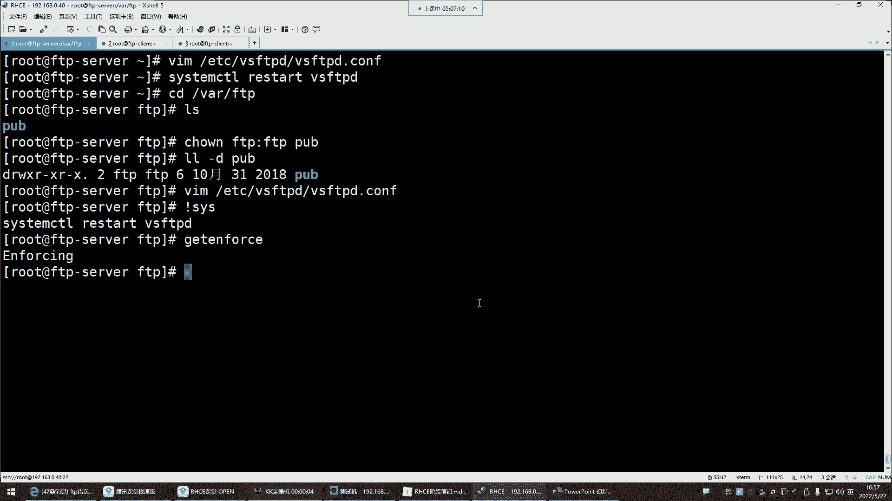

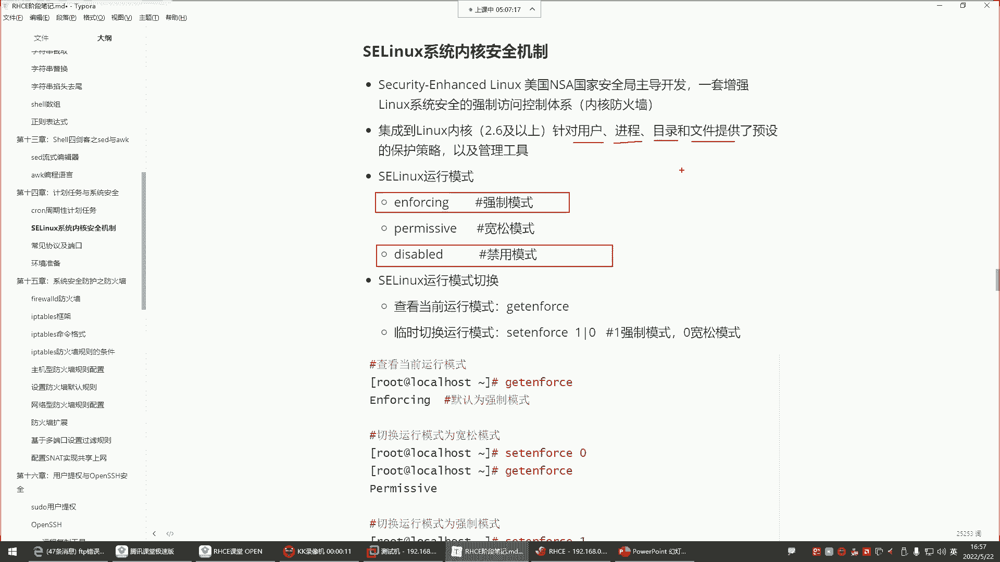

在本节课中，我们将学习 FTP 服务在实际使用中可能遇到的典型问题及其解决方法，特别是关于 SELinux 和 FTP 配置文件权限的排错。我们将通过具体操作，理解如何正确配置 FTP 服务的匿名访问权限。

---

### **SELinux 强制模式的影响**

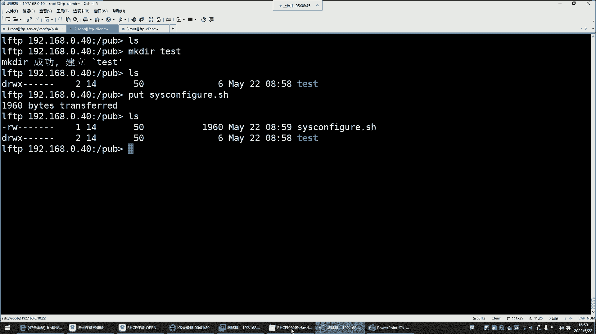

上一节我们介绍了 FTP 服务的基本配置，本节中我们来看看一个常见的排错点：SELinux。

SELinux 在强制模式下会严格管控所有系统资源，包括用户、进程、目录和文件。这可能导致即使文件系统权限设置正确，操作也会失败。

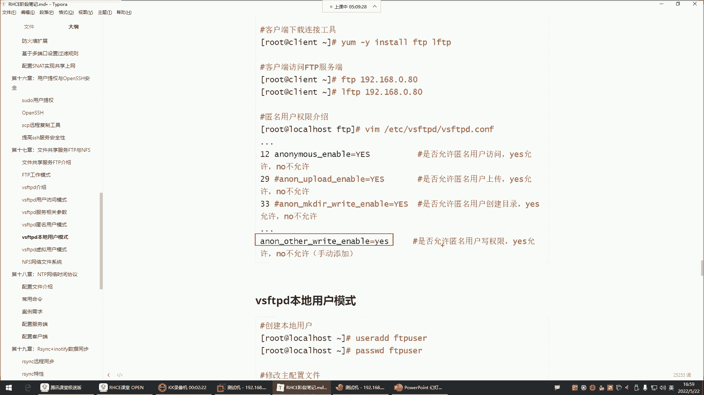

当前 SELinux 的模式是 **enforcing**（强制模式）。在此模式下，即使用户对目录拥有完全的读写权限，也可能无法创建文件。这是因为 SELinux 策略禁止了该操作。

解决方法是将 SELinux 模式改为宽容模式或禁用。可以通过修改配置文件或临时设置来实现：

**临时关闭 SELinux（重启后失效）：**
```bash
setenforce 0
```

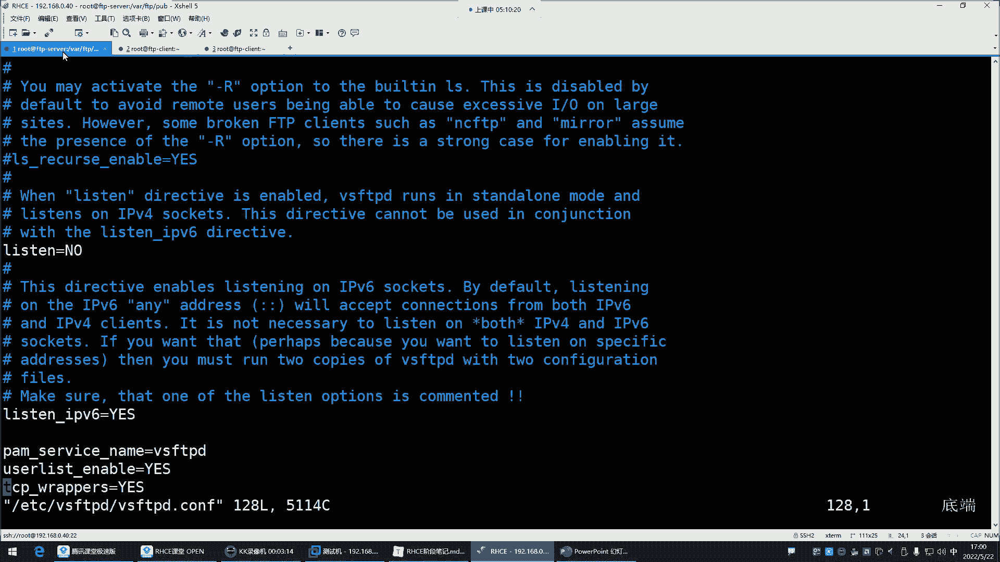

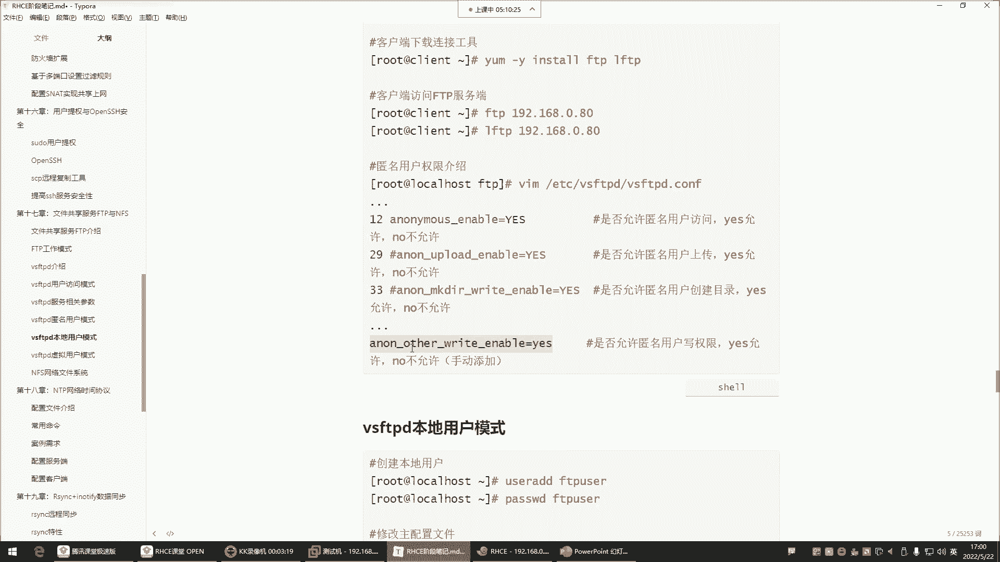

**永久修改 SELinux 配置：**
编辑 `/etc/selinux/config` 文件，将 `SELINUX=enforcing` 改为 `SELINUX=disabled`，然后重启系统。

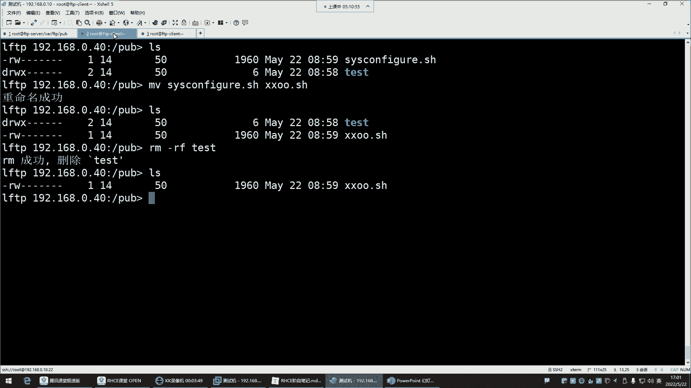

关闭 SELinux 后，之前失败的文件创建操作通常就能成功执行。这个问题非常隐蔽，在排错时需要特别注意检查 SELinux 的状态。

---

### **FTP 匿名用户的权限配置**

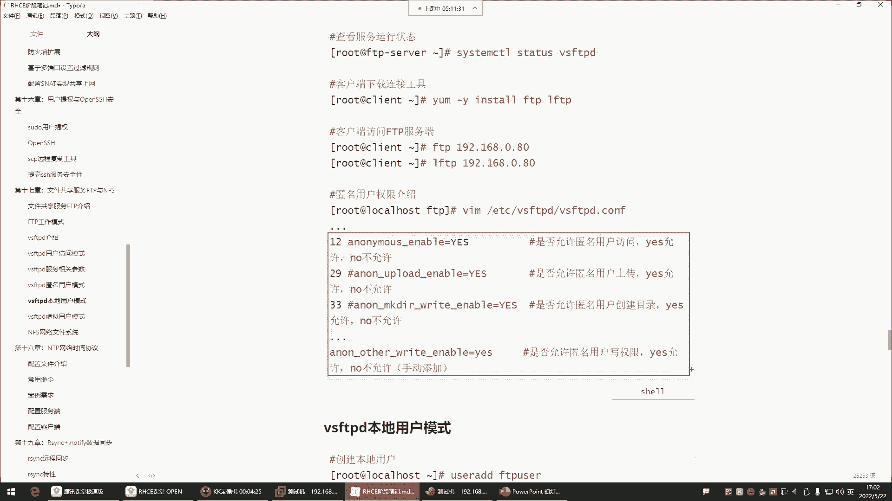

解决了 SELinux 问题后，我们来看看 FTP 服务本身的权限配置。FTP 默认启用匿名用户访问，其权限需要精确控制。

以下是 FTP 配置文件中用于控制匿名用户权限的关键参数及其作用：

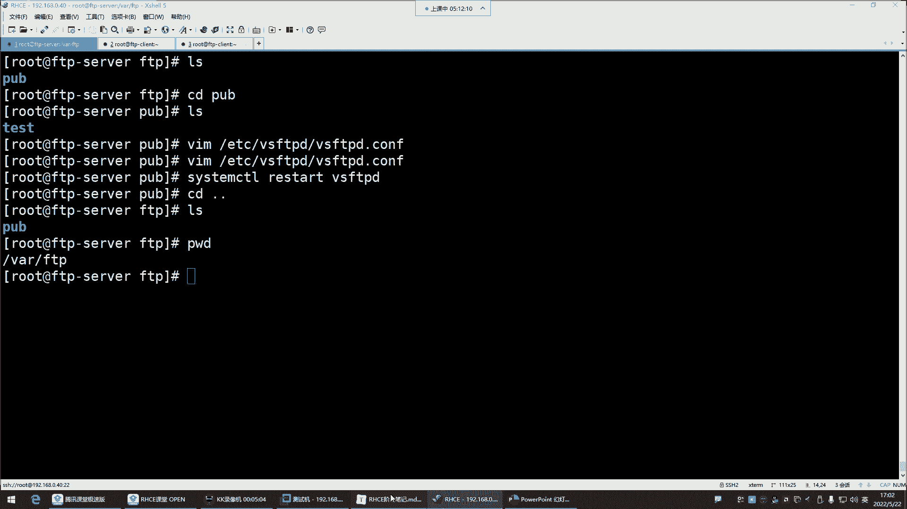

*   **`anon_upload_enable=YES`**：允许匿名用户上传文件。
*   **`anon_mkdir_write_enable=YES`**：允许匿名用户创建目录。
*   **`anon_other_write_enable=YES`**：允许匿名用户执行**重命名**和**删除**操作。

默认情况下，匿名用户只有查看和下载的权限。如果需要赋予上传、创建或删除等写权限，必须在配置文件 `/etc/vsftpd/vsftpd.conf` 中显式启用上述对应参数。

例如，启用删除和重命名权限，需要在配置文件末尾添加：
```
anon_other_write_enable=YES
```
添加后，保存文件并重启 `vsftpd` 服务使配置生效。

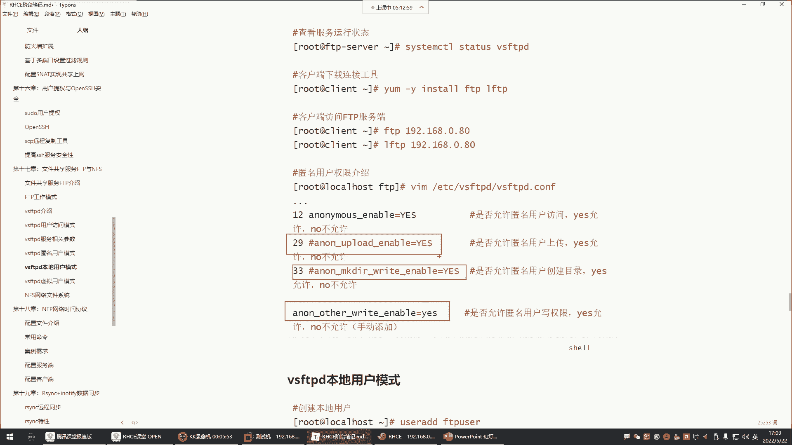

---

### **企业环境下的 FTP 权限管理实践**

然而，在企业生产环境中，出于安全考虑，我们通常不会给匿名用户如此大的权限。

FTP 服务器的典型用途是共享文件供他人下载，就像个人网盘。你希望别人能随意在你的网盘中上传、修改或删除文件吗？显然不希望。

因此，对于匿名用户，最佳实践是**仅保留其默认的查看和下载权限**。所有关于上传 (`anon_upload_enable`)、创建目录 (`anon_mkdir_write_enable`) 和删除/重命名 (`anon_other_write_enable`) 的权限都应被禁用（注释掉或设为 `NO`）。

**配置建议：**
1.  在 `/etc/vsftpd/vsftpd.conf` 中，确保以下参数被注释或设置为 `NO`：
    ```
    #anon_upload_enable=YES
    #anon_mkdir_write_enable=YES
    #anon_other_write_enable=YES
    ```
2.  重启 `vsftpd` 服务。
3.  共享文件的目录权限应设置合理，通常确保“其他用户”有读(`r`)权限即可，无需设置为 `777`。例如，由系统管理员创建并放置到共享目录的文件，匿名用户可以直接下载。

---

### **总结**

本节课中我们一起学习了 FTP 服务的两个核心排错与配置要点：

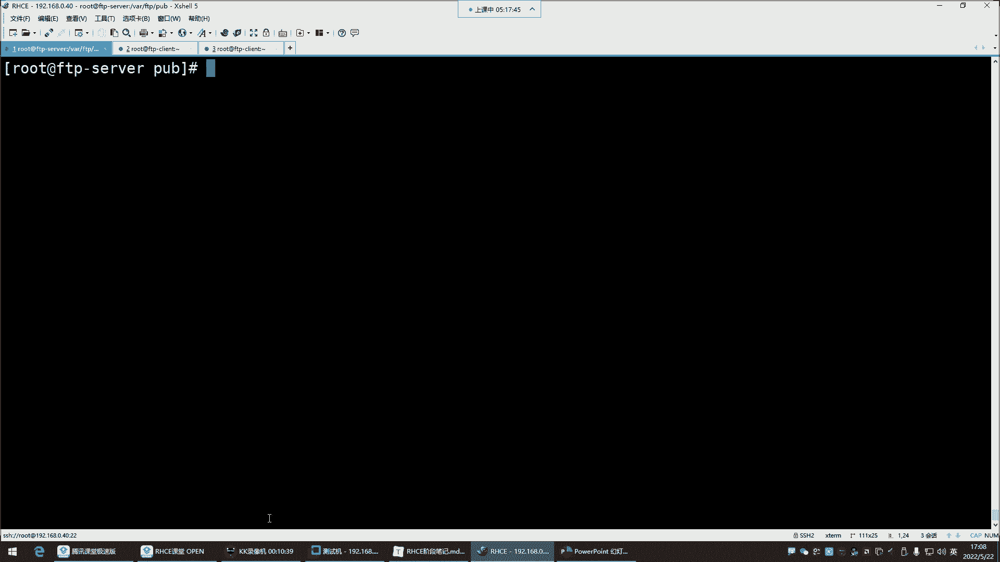

1.  **SELinux 干扰**：在强制模式下，SELinux 可能阻止 FTP 的正常写操作。排错时需检查并适时调整其运行模式。
2.  **权限精细控制**：通过 `vsftpd.conf` 配置文件中的特定参数，可以精确控制匿名用户的上传、创建、删除等权限。在企业环境中，应遵循最小权限原则，通常只开放下载权限，以保障服务器安全。

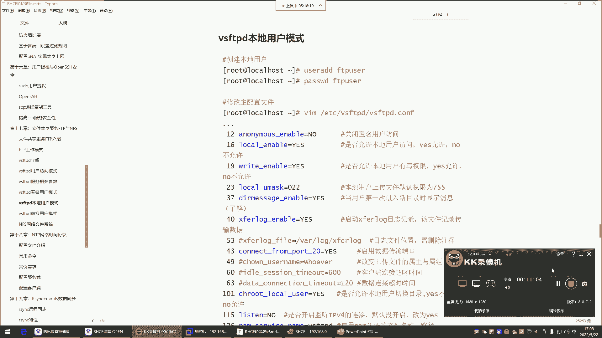

通过理解这些配置，你能够更有效地部署和管理一个安全、符合需求的 FTP 文件共享服务。