# Linux运维：P6：命令行编辑技巧与学习方法

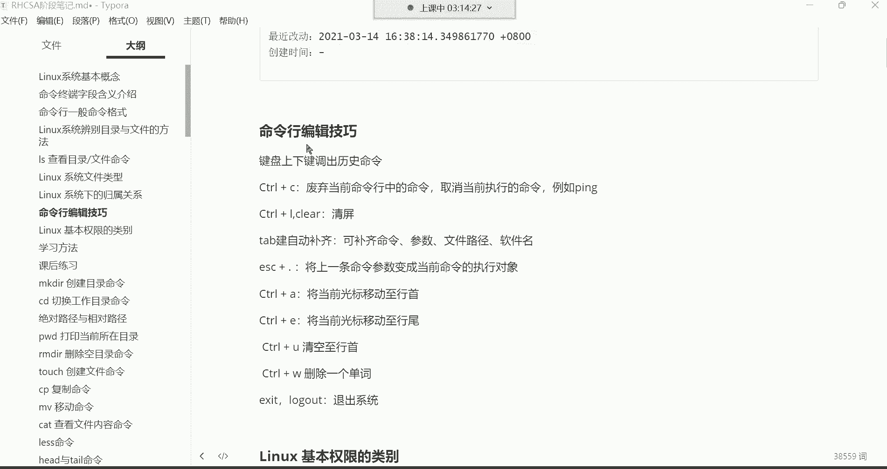

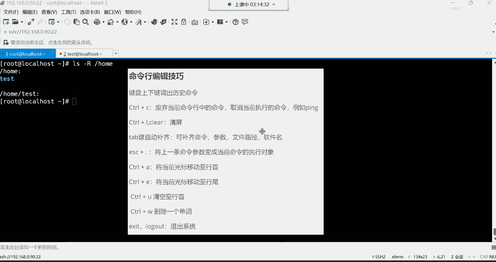

在本节课中，我们将学习Linux命令行中的高效编辑技巧，并探讨一些有效的学习方法，帮助初学者提升操作效率和学习效果。

## 命令行编辑技巧

上一节我们介绍了`ls`命令的基本用法，本节中我们来看看如何更高效地使用命令行。掌握这些技巧可以显著提升操作速度。

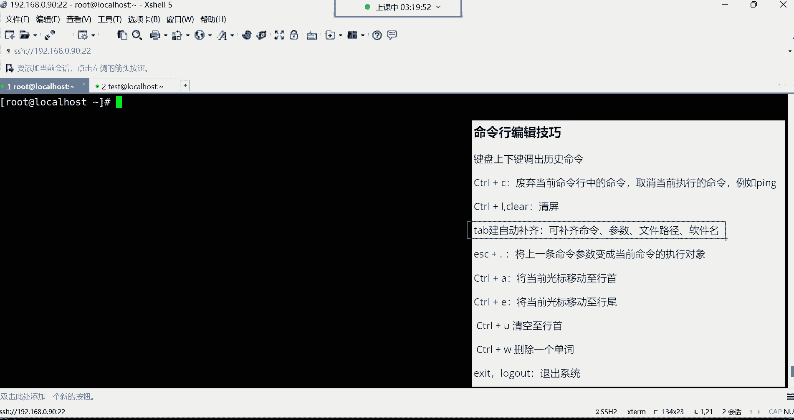

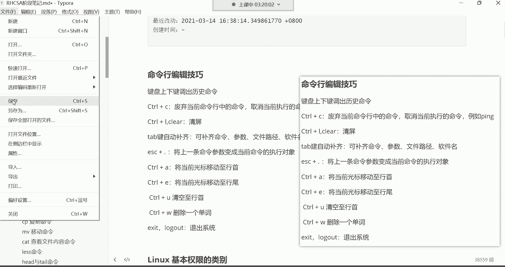

### 历史命令调取

使用键盘的**上下方向键**可以调出之前执行过的命令。系统默认会记录最近1000条命令历史。通常，我们只翻阅最近的两三条命令进行重复执行。如果需要执行更早的命令，直接重新输入可能比一直翻页更高效。

### 命令控制与取消

**Ctrl + C** 组合键有两个主要功能：
1.  废弃当前在命令行中已输入但尚未执行的命令。
2.  强制终止当前正在前台运行的命令。

例如，当执行一个持续运行的命令（如 `ping www.baidu.com`）时，按 **Ctrl + C** 可以立即停止它。

### 清屏操作

**Ctrl + L** 或输入命令 `clear` 可以快速清除当前终端屏幕上的内容，提供一个干净的工作区。

### 自动补全功能

**Tab键** 是命令行中最实用的工具之一，它可以自动补全命令、文件路径和软件包名。

其工作逻辑是：
*   按一次 **Tab**：如果输入的内容有唯一匹配项，则自动补全。
*   按两次 **Tab**：如果输入的内容有多个匹配项，则列出所有可能的选项供用户选择。

例如，想进入路径 `/etc/sysconfig/network-scripts/`，只需输入 `cd /etc/sys` 后按 **Tab** 键，系统会自动补全为 `sysconfig/`，继续输入 `netw` 后按 **Tab**，即可补全为 `network-scripts/`。这极大地减少了长路径的输入错误。

### 快速编辑命令

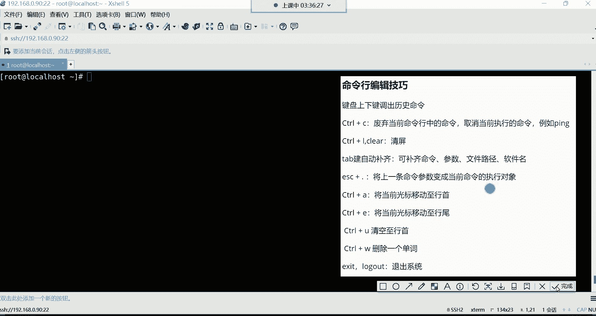

以下是几个常用的命令行内编辑快捷键：

*   **Esc + . (点)**：快速将上一条命令的最后一个参数粘贴到当前光标位置。
*   **Ctrl + A**：将光标快速移动到当前命令行的行首。
*   **Ctrl + E**：将光标快速移动到当前命令行的行尾。
*   **Ctrl + U**：删除从光标位置到行首的所有字符。
*   **Ctrl + W**：删除光标前的一个单词（以空格为分隔）。

### 退出系统

要退出当前登录的会话，可以使用以下任一命令：
*   `exit`
*   `logout`

输入命令后回车，即可返回到登录提示界面。

**核心技巧总结**：对于初学者，必须熟练掌握 **上下键**、**Ctrl+C**、**Ctrl+L**、**Tab键** 和 **Esc+.** 这几个技巧，它们能极大提升日常操作的流畅度。其他快捷键可作为了解，在需要时使用。

## 学习方法与建议

掌握了操作技巧，我们再来看看如何更有效地学习。正确的学习方法能让你的学习之路事半功倍。

### 遇到问题怎么办

在学习初期，遇到问题是常态。以下是解决问题的建议路径：

1.  **初期**：积极提问。课程群内设有专门的答疑老师（如雷神老师），遇到不理解的问题可以直接在群内提问。
2.  **后期**：培养独立解决问题的能力。随着学习的深入，应有意识地锻炼自己：
    *   首先，尝试清晰地描述问题。
    *   然后，利用搜索引擎（如百度、谷歌）寻找解决方案。**“会搜索”本身就是一项重要技能**，关键在于如何用准确的关键词描述问题。
    *   如果经过努力仍无法解决，再向老师或社区求助。

### 学习态度与规划

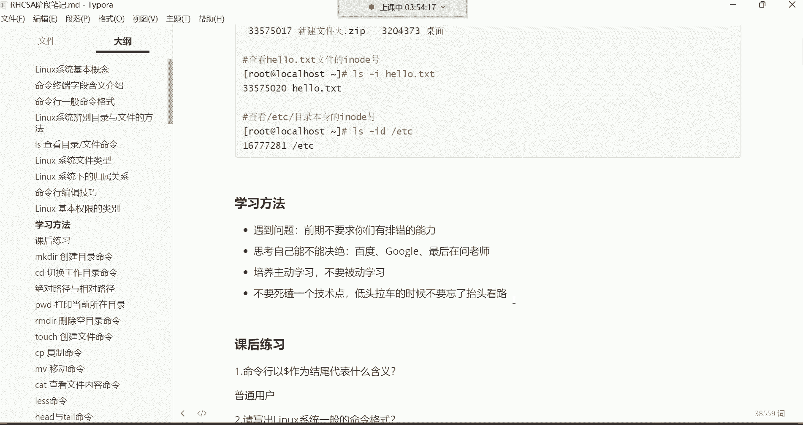

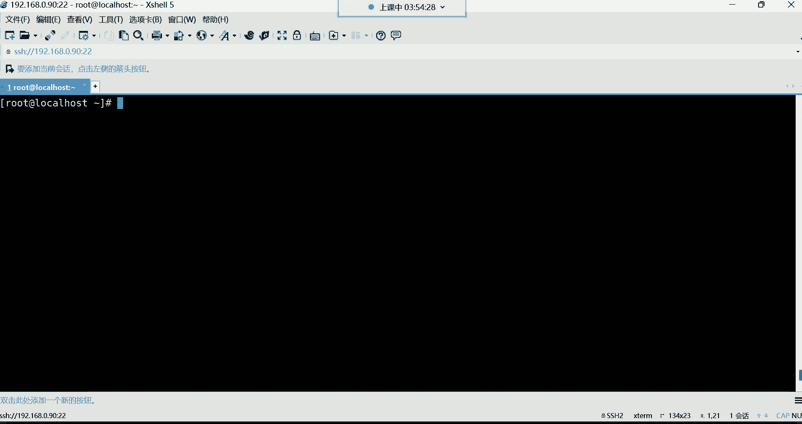

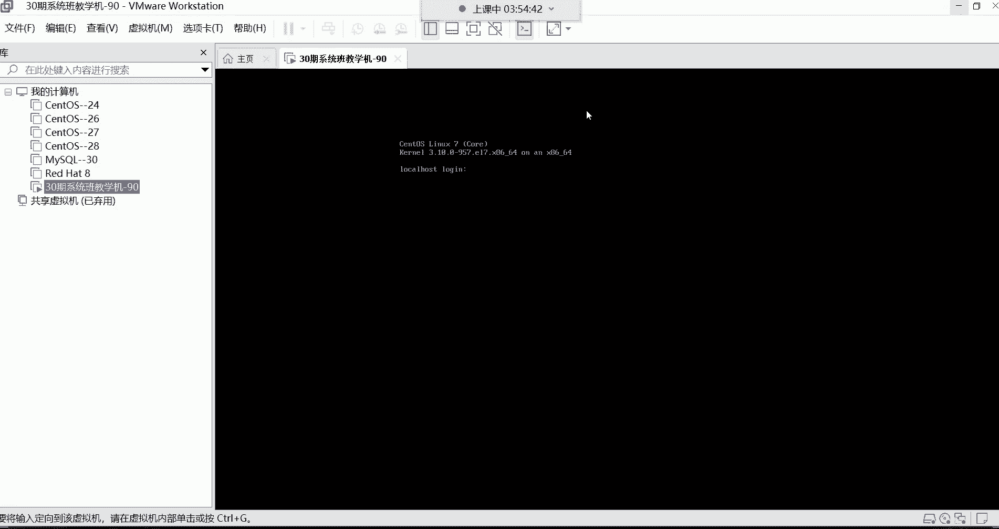

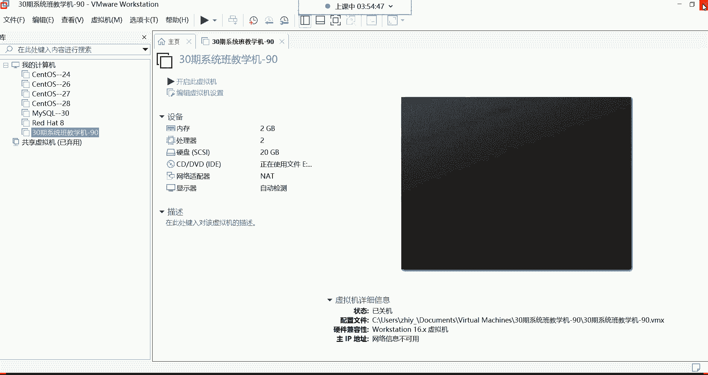

以下是关于学习态度和方法的几点建议：

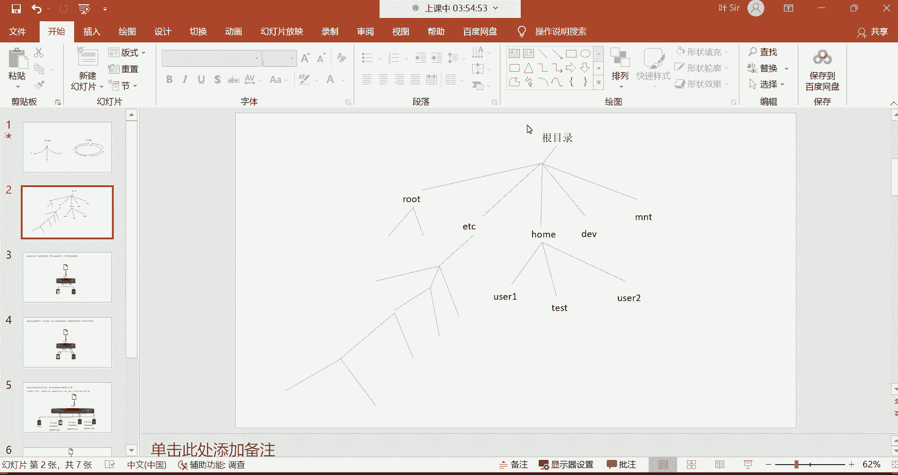

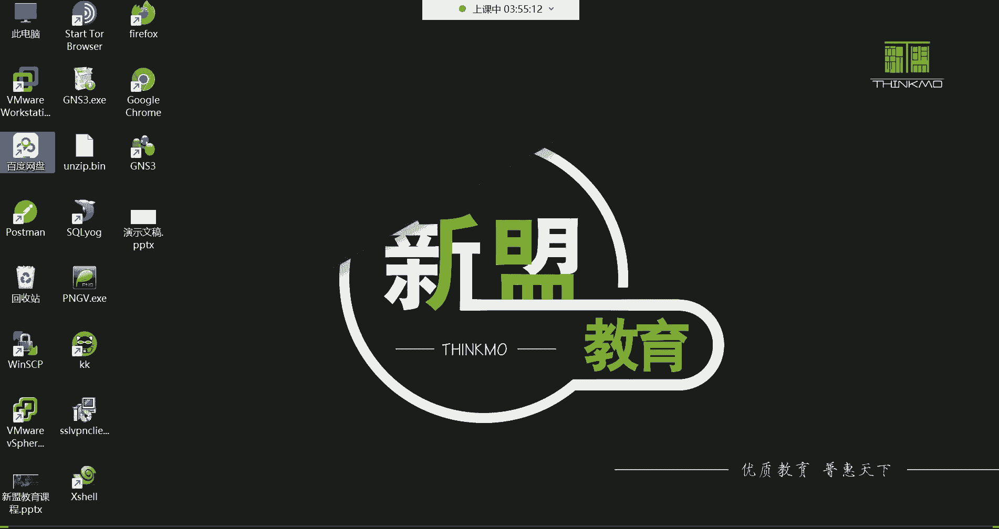

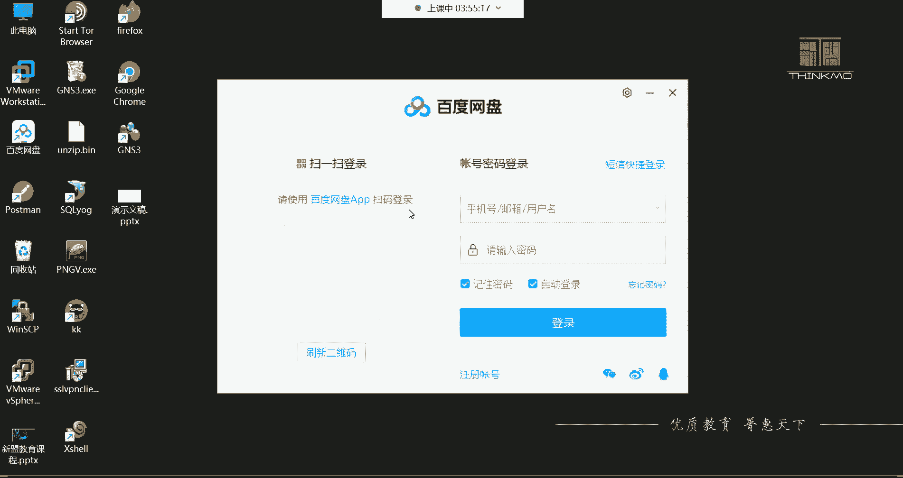

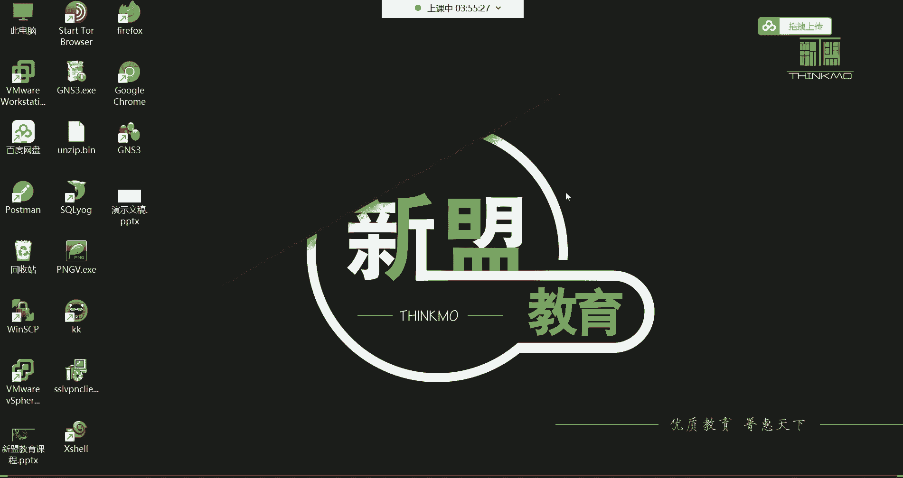

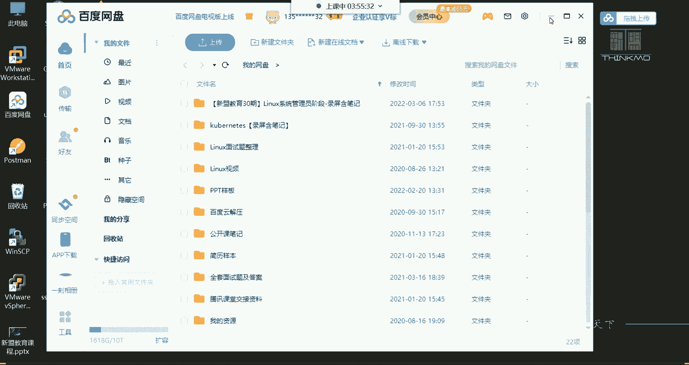

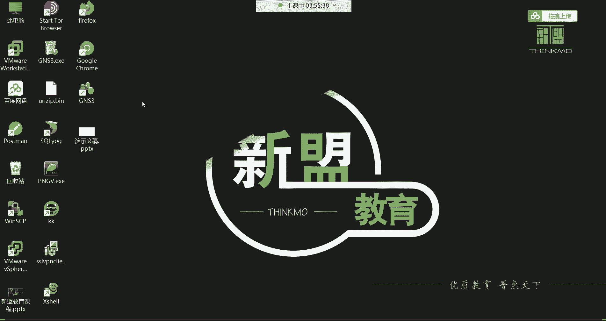

*   **主动学习，而非被动接收**：不要局限于课堂讲授的内容。例如，学完 `ls` 命令后，可以主动查阅资料，了解它的其他选项和高级用法。
*   **专注与坚持**：整个系统学习周期约为五个半月。这段时间需要投入高度专注，暂时减少无效社交和娱乐，将主要精力用于学习。用短期的全力投入，换取长期的职业发展和收入提升。
*   **避免“钻牛角尖”**：如果某个知识点暂时无法理解，不要长时间死磕。可以先做标记，继续向后学习。很多时候，后面的知识会帮助你融会贯通，之前的问题便迎刃而解。这叫做“低头拉车，也要抬头看路”。
*   **善用学习资料**：课程会提供详细的笔记（MD源码和PDF版）和录屏。可以利用碎片时间（如通勤时）通过手机复习PDF笔记。MD格式笔记可以使用 **Typora** 等软件打开和编辑，形成你自己的知识库。

### 课后练习与资源

*   **课后练习**：完成每节课后提供的练习，是巩固知识的最佳途径。
*   **资料获取**：课程笔记、录屏等资料会统一上传至网盘，链接将在课程群公告中发布。需要的软件（如Typora）下载链接也会在群公告中提供。
*   **公开课与系统班**：对于已参加系统班的同学，建议以系统班的体系化课程为主，公开课内容可能跳跃，不适合作为主线学习材料。

---

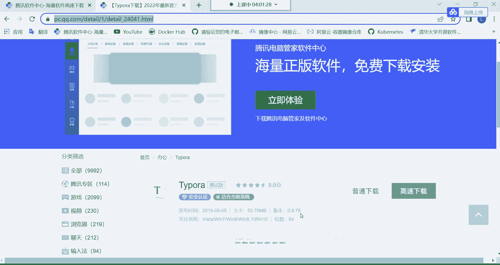

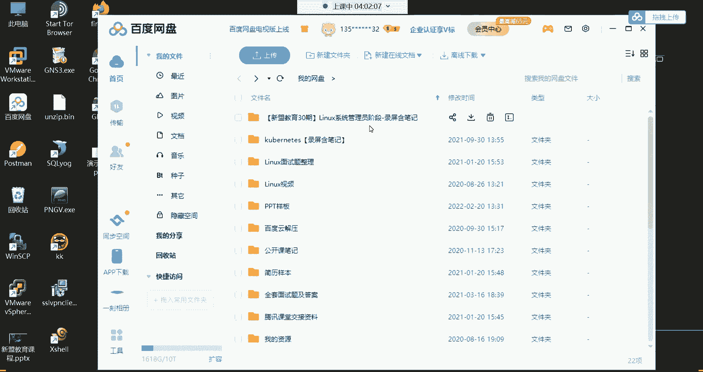

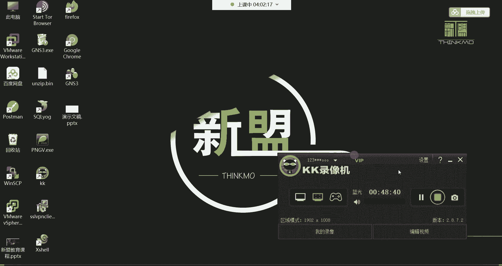

本节课中我们一起学习了Linux命令行的核心编辑技巧，包括历史命令调取、命令控制、自动补全和快速编辑等，这些是高效使用Shell的基础。同时，我们也探讨了主动学习、问题解决和持续坚持的正确学习方法。记住，技巧提升效率，方法决定成败。接下来，我们将开始学习更多的Linux常用命令。