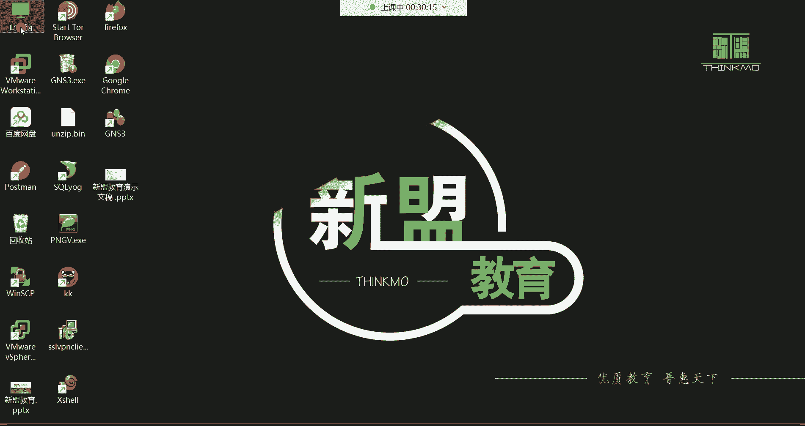
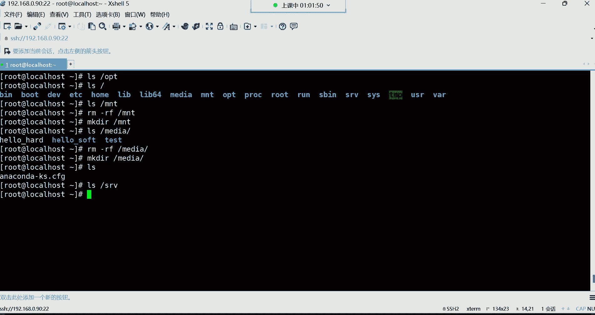

# Linux最全RHCSA+RHCE培训教程合集，小白入门必备！ - P10：红帽RHCSA-10.计算机硬件组成介绍、Linux系统目录介绍 - -Book思议8 - BV1ZV4y1v7c8

喂喂喂，哈喽哈喽，大家能听到我这边的声音吗，啊早啊，我们这个时间过得有点非正常的说话，我们这个在下午的时间段，我们在相互的互问这个早安哈哈，那如果被别人看到，可能会感觉非常的奇怪是吧。

这些这些人到底是干什么事的呢，是吧啊啊但是没有办法是吧，这就是我们的生活嘛，时间好快，我们一一周过去了，我们又见面了是吧，嗯时间过得就是这么快，来也匆匆，去也匆匆的一晃呢，可能说这个一个礼拜就过去了。

再一晃呢，可能说我们这个学习，这个整个阶段就已经过去了，再一晃呢啊就一年过去了，再一晃呢可能说嗯哼时间过得还是飞快的哈，所以说呢有的时候我在前面的阶段的努力啊，你过一段时间以后。

你再回顾它来发现哎其实也就那么回事儿，现在可能说大家在基础阶段觉得哎呀，我挺难的啊，接触这个东西呢，感觉我特别的头疼啊，哈非常非常的痛苦啊，不适合人类去学习是吧，但是等你过了几个月以后。

或者说你再过了一到两年之后，你再回过头来再去回顾一下自己当初那个状态，你发现哎，这当初这东西怎么就学起来那么费劲呢，哈哈就不会有这种想法了，所以说时间呢就是最好的什么呢，最好的一剂良药，嗯好。

那接下来呢我们就开始吧哈，我们这个机器我已经开机了，然后呢我先连到我们的机器上面去。

我们是九零，再晃就没了是吧，没错再晃就没了。

好凉了之后呢，我们来说一下我们上节课讲解的内容，我们呢就把这个课后练习做一做，就能够清楚的把我们前面学过的基本命令，基本上都能够复习个遍了，好来看一下，这里面都有答案，也不难。

请在TMP目录下创建一个student目录，然后并在student目录下面创建T1T2，T3文件，这个考研的是什么呢，不就是make dr这个命令吗是吧，在TMP目录你去建一个student。

然后呢你切换到student目录，我们考研的不就是CD这条命令吗，啊前面是创建目录的命令，接下来呢是切换目录的命令，进来之后呢，让你建T1T2T三文件，那考你的不就是touch这条命令吗。

建三个文件出来，是不是啊啊这非常的简单，然后呢我们你也可以用这种方式，这种方式是什么方式呢，这种方式就是以绝对路径的方式，指定我要创建的这个文件所在位置在哪呢，在TMP目录的student下面建个T1。

然后呢T2T3啊，前面呢是你直接切换到这个路径，然后呢以相对路径的方式，就你你已经在这个目录里边了，咱们就直接去用touch创建就行了，不需要指定前面的路径了，而这个呢是指定了前面的所在路径啊。

这种指的是如果你不在这个当前的路径下边哈，好了，第二道题请在TMP目录下递归创建test1test2，test3目录，其实这考验的是一个目录结构啊，就是你test的一，然后呢呃这个画的有些那个啥了哈。

Test2，然后呢test3啊，考研的是一个目录结构，那这个目录结构的话呢，你就得什么呢，一条命令如果想实现这个功能，那就是make dr加个杠P，杠P呢不是可以帮我们实现递归创建吗是吧。

所以就可以帮我们把T1这个不存在的目录，创建出来之后呢，再在这个目录下面建一个test2，然后再在test2下面去建一个test3啊，这种是递归创建，然后第三题切换到TMP下边的这个test3目录下。

并打印当前所在目录，其实就是考验的就是一个PWD命令，其实我前面这几个题，给大家留的都是考验什么呢，就是你在进行路径切换的时候呃，对于这种绝对路径，还有这种相对路径容不容易犯糊涂啊，你要容易犯糊涂。

你发现你切着切着哎，找不到这个路径了，就直接报错了，说提示你说没有什么损，没有什么这个目录好，那我们看第四题，第四题，请同时在OPT跟media目录下创建upload这个文件，那这一条命令就可以搞定了。

touch OP t下的upload，然后media下的upload哎，这种比较简单，你只需要指定，我要把这个文件建在哪个目录就可以了，因为这条命令可以帮，我们同时在多个目录去创建文件，OK然后第五题。

请在OPT目录下的upload，文件移动至我们前面建的那个test3目录，并改个名叫upload the bike，这个考验的是一个MV命令，因为你看就是将文件移动吗，移动不是考验的就是一个改名吗。

好那就把这个文件给它移动到什么呢，MV把OP t下的upload移动到这个路径下面去，当然你要改名，你后面就得指定移动过去以后，他的新的名字叫什么呢啊，所以这时候呢，就后边路径后边指定新的名字就可以了。

考研是MV命令，然后请将etc下的pass wd的文件，拷贝至OPT目录下，并改名为pass wd点back并保持属性不变好，那这个考验的是一个CP命名，然后呢在结合他的一个杠P选项，CP是做拷贝的。

然后杠P这个选项呢是在拷贝的时候，可以保持这个文件的原属性不变啊，就是这个文件原型的属性是什么，拷贝过去之后呢，这个文件仍然是什么样的属性，然后第七题。

请将etc下的f s table这个文件拷贝至OP t目录，并改个名叫f s table点back啊，这个也是考验的是CP，但是呢这里面并没有指定，说非得要保持属性不变是吧。

所以这个杠P你可以加也可以不加啊，这无所谓了，然后下边呃请将etc cs config network on scrape，if f c f g e n s32这个网卡，这是网卡文件拷贝到OP题目录下。

并改名为叫N32点back，那这个呢也是考研的，是CP命令，然后呢这个主要是考什么呢，考验大家对系统的我们后边会学习的这些文件，你像什么这些文件，都都是我们后期会经常用到的文件。

E向etc下的pass wd，还有etc下的fs table，还有这个网卡的文件，在这个非常长的一个路径，这些就是为了让大家能够什么呢，能够对这个文件的所在位置呢，能够多多的去熟悉它啊。

因为后期呢我们这些文件会详细去讲它，所以到时候你别到时候说这个文件在哪儿，你记不住了，这就有些尴尬了，好第九题，请将ET请删除etc ym的reports，这个目录下所有的内容呃，删除所有的话呢。

我们前面在讲RM这条命令的时候，我们有了一个星号诶，这个星号的话呢，我们只是简单给大家介绍一下，我们说代表的是任意所有，没错吧，所以说呢，你如果说想清除一个目录下所有的时候。

我们可以暂时用这个星号来表示啊，代表示任意所有的意思，但是注意啊，这个位置你不要忘了加一个路径分隔符哈，因为你要删除的是这个目录下边的所有数据，所以一定要加一个木这个路径分隔符，如果你不加路径分隔符。

它是不是就会认为YM点REPORD，后边的任意所有啊啊他认为你可能是要删除，是这个目录的名字叫YM的reporter dor，后边叫什么就无所谓了，主要是什么呢，前面以这个开头的，那就被删除。

那可能说你这个目录就被删了啊，所以这边大家这边写信哈，你一定要注意一下，知道吧，然后第十题请将etc要么点repulse，第一步先创建一个叫local点rap的文件，那就考验的是一个touch这条命令。

然后主要是这个路径呢，大家现在也熟悉一下，这个路径呢，后面也会详细的去讲解，还有第11题，这个请查看网卡文件的末尾五行内容，这考验的不就是我们前面给大家讲解的，叫tail命令吗，叫honor与tail。

那TM令是可以查看一个文件的末尾多少行的，然后后面呢你指定行数就可以了，那你指定多少行，他就给你看末尾的多少行好，OK然后两两种方法，这些杠五或者杠N5都可以，但效果是一样的。

然后呢第12题请查看etc下的pass wd文件，第一行内容啊，就看头一行，那就汉呢杠一或者说杠N1就可以了，那这个考验的也是我们这个汉语，它有这两条命令都是查看文件内容的。

然后下面请查看etc host name这个文件的内容，那考研的是cat这条命令，然后请查看host这个文件内容，考研的也是cat命令，以及这个对于这个文件的现在一个熟悉。

然后下边对于软链接与硬链接的特点呢，这个呢是一些理论性的东西啊，请说出软链接与硬链接的特点，因为有有有的时候大家在，比如说就是你在学面试的时候，有的面试官可能说他技术水平的没有那么高啊。

技术水平没有那么高哈啊，他可能说就是呃懂一些基础的啊，如果真的是问问出了这些比较基础的相关，概念性的东西呢，没有什么实操的内容，有时候你说不出来吧，你感觉哎呀这基础不牢是吧，所以对于这种软链接与硬链接。

一般也是容易被问到，那可能说别人会问这个在LINUX这个系统下边，软链接的特点是什么呀，硬链接的特点又是什么呀，啊他可能这么问你，所以这时候呢你要是说不出来吧，人家就会认为你这个人的对你这个基础太差了。

基础太差了哈，所以你基础都这么差，他也不会认为你这个人对于这个，比如说那些高大上的技术有多么的厉害，所以有的时候这个基础性的东西呢，还是非常非常重要的，OK所以有一句话叫什么叫基础不牢，地动山摇。

什么意思呢，就是说你基础如果打不好，后期学什么东西都稀里糊涂的，哎这玩意就跟盖房子一样，然后盖房子就跟你地基打不牢，你发现这房子啊他不抗风不抗雨的是吧，摇摇晃晃的也盖不了多高，其实是同一个意思。

那软链接和硬链接，你只需要就是把我在课上，在课件上给大家写的这些特点给他记下来，就几乎就没有任何问题嗯，对基础好，面试还有机会嗯，软链接呢可以跨分区啊，然后呢可以对目录进行链接，原文件删除以后。

链接文件不可用，这个具体的含义呢都给大家讲过了，所以就不啰嗦了哈，你负基础是吧，没关系啊，负基础你现在不就是在打基础吗，然后硬链接不可以跨分区，不可以对目录进行链接，原文件删除以后。

链接文件就仍然可用啊，它是一个以文件的副本形式存在的，只不过它跟那种拷贝的区别，就在于说它可以实现一个数据的相互同步啊。

分区是什么意思呢，分区的话是不是上，是不是没有听上节课的内容啊。

啊没有听上节课内容哈，这个分区呢就是你拿windows来讲，就是你的C盘跟你的D盘，这是不同的分区，然后跨分区呢，就是我想把C盘里的一个文件干嘛，给它创建一个快捷方式，给它快创建到这个E盘里面。

其实就这意思，那就跨分区了，OK好。

然后我们再来看这个第16题啊，这里面有新学员是吧，新学员就看看什么呢，看看前面讲过的内容，这些都讲过哈，好但是LINUX里面怎么分区呢，还没讲到分区的时候呢，所以先不要急，我们现在还没到那个阶段好。

第17题，请在OPT目录下创建一个hello，点heart文件，然后并创建硬链接啊，并创建硬链接到TP目录，然后查看文件的详细属性，这就是什么呢，就建个文件，然后用LN创建一个硬链接。

但是呢注意在硬链接，甭管是软链接还是硬链接的时候，一定要注意一下，要指定它的绝对路径哈，OK然后第18题，如何获取IOS的命令的帮助，这考验的就是怎么说呢。

这个help命令帮助或者说man命令帮助的方法啊，这种东西呢还是那句话，能百度呢尽量先百度，因为毕竟你去慢这个命令的帮助，他给你的反馈大多数你也是看不懂的，所以你还不如直接去百度。

对于我们中国人来讲是吧，还是比较符合我们的一个情况的，OK最起码你能看得懂好，那第19题，请说出LINUX系统的运行级别，这个运行级别呢总共是七个，然后从0~6啊，总共是七个级别。

这七个级别呢零就是关机的级别，一就是单用户级别，二呢就是多用户级别，三是我是一个正常的标准运行级别，然后四呢现在还没有被用上，第五呢也是一个标准运行级别，但是带图形，第六呢就是处于重启的一个级别。

好然后第20题如何重启LINUX系统，常用的命令就是reboot啊，这是我们上节课讲的是关机与重启，那你看我们花了将近14分钟的时间啊，零还算级别，你你系统关机就处于零级别了。

安康我们花了14分钟的时间，就把我们上节课给大家讲解的内容，是通过这些，就是我给大家准备的这些练习题的方式，基本上都给复习了一遍了，是不是啊，所以说这些东西就考验你前面那个东西呢。

能不能够熟练的去掌握啊，所以说就是敲敲这种练习题，就可以对这个多练练就好了，基础命令没有什么太多呃这个什么呢，太多的这种所谓的学习方法，只能多敲多练，这种东西就跟那个什么呢，就就跟老话说得好。

叫熟能生巧嗯，熟能生巧，你敲一遍的时候，你发现这种东西特别不好记，你敲十遍，你看你感觉就不一样了，你敲它100遍，你发现这种东西你闭着眼睛都能敲出来了啊，都已经形成肌肉记忆了，是不是，所以什么东西呢。

你得多多的去实践它啊，这样才可以啊，是然后下边呢我们来给大家讲讲，这个叫计算机的硬件组成，我们这个硬件组成，主要是考虑到很多基础比较弱的同学啊，这个基础比弱，就是他没有计算机基础的同学。

我们呢给大家来讲讲，对于这个我们个人计算机，以及在企业里面的这个服务器，它的这个具体的硬件啊组成部分都有哪些啊，计算机硬件组成呢，就是你从外边买回来一台电脑，注意哈，你从外边买回一台电脑。

那你这个电脑里面都有什么东西呢，你这个电脑里面就是一堆的硬件啊，这个硬件它大体呢是分为，就是叫做输入设备的硬件，还有叫主机设备的硬件，还有输出设备的硬件，还有一些外部的存储硬件好啊，包括这个CPU好。

那我们说说这个输入设备，在计算机里面都有哪些呢，鼠标键盘啊，包括现在有的电脑都可以触屏了，是不是啊，哎这些都属于叫做输入设备啊，就是我们通过鼠标键盘，把我们的操作呢传递到计算机，OK这是输入。

那主机设备呢就是在你的机箱里边，你这个机箱里边都有什么东西啊，有主板是吧，这个主板连接的什么，连接的计算机的整个硬件在这一个大主板里边，然后呢这里边有你的CPU，然后呢这个CPU呢我们叫中央处理器。

叫中央处理器，然后主机存储器呢其实就是一个内存条啊，我们说的就是那个内存条啊，跟CPU挨着，那网卡的话呢也是一个条啊，网卡嘛，然后声卡呢也是一个条，显卡也是一个条，能理解吧。

就是这就是计算机的硬件组成嗯，你从外边买回一台电脑，你那个机箱里边就这些东西，还有什么风扇，还有什么风扇，还有什么那个什么这个管那个管的等等等等哈，就是你如果去干嘛呢，你如果去花钱去配一台计算机的话。

其实这些硬件组成不用我说，那其实你们心里就应该都有数了，一台计算机呃，由硬件组成部分，其实也就是那么几个，啊我我给你们找一找哈，我曾经配过一台主机，然后这个我配的这台主机我是自己定义的硬件。

我找找那个人哈，找找那个人，嗯啊这个，嗯这个聊天记录好像被我给删了，等一下哈，这些东西都不难，我给你们搜一搜哈，搜一搜，这个，时间有些长了，就是可能，跑哪儿去了行，等我啊，等我下去再找吧。

找到我再给你们看吧，OK吧，因为确实是这个，确实是已经很长时间了哈，对不搜了哈，你们没事可以自己去自己去网上去百度百度，如果对于计算机基础知识较弱的，自己去百度百度，其实这些东西都非常简单，一堆硬件啊。

在服务器里面也是这一堆硬件啊，然后那像输出设备都有哪些啊，输出设备，那就像耳机，耳机也是属于一个输出设备，屏幕也是输出设备，会把所有的结果返回给我们，像打印机，投影仪这些都属于输出设备。

一个计算机的组成部分，好像这个外部存储，外部存储呢就一些比如说我们的硬盘啊，硬盘光盘，软盘U盘啊，还有像这种光驱啊，都属于叫做外部的存储设备啊，这些其实组成了就是一个什么呢，一个计算机，然后呢。

我们是在这一堆硬件之上去安装操作系统，然后在操作系统之上去安装各种各样的软件，然后你就可以去什么呢，该干嘛干嘛了，比如说听歌看电影，打游戏是吧，聊天等等等等，这就是一个计算机的组成部分。

由一众多的硬件组成的一个计算机O，然后呢对于CPU来讲呢，我们然后这个位置像什么CPU缓存呢，简单给大家说说为什么会有CPU缓存哈，就在计算机里面，对于硬件来讲呃，它是什么呢。

就是处理速度最快的时候就是CPU了，然后其次就是内存，然后最慢的就是硬盘，然后你怎么去理解这三者之间的关系呢，呃你可以把CPU给他理解成它的速度，就像火箭一样，那像火箭一样。

这个内存的速度呢就像飞机一样，然后这个最后那个硬盘啊，硬盘的速度呢就像绿皮火车一样啊，所以说你可以让可以这样去理解，他们三者之间的一个什么呢，一个速度，因为这三个东西都是用来干嘛。

都是用来帮我们用户去进行对数据去处理的，比如说CPU做什么事情啊，CPU啊，他是帮我们去计算数据的，计算哪些数据，比如说我们在系统里边，我们做一些操作的时候，或者说你想运行一个软件，你想运行一个软件。

在这个软件的所有的数据得需要计算，谁去计算呢，CPU帮你去计算啊，但是这个软件的运行呢又需要内存啊，这个内存是能够什么，支撑软件运行的一个非常重要的资源，没有内存，软件也无法运行。

所以说这个内存到时候呢会干嘛，会让这个软件运行起来，最后呢数据往哪存呢，往这个硬盘里面存，所以为什么CPU有缓存呢，CPU缓存这个东西就是用来可以什么，提高用户对数据的一个处理速度。

处理速度啊会速度会非常的快，比如说像一些电商平台啊，或者说呃像一些这个什么呢游戏的软件啊，他们会把就是呃一些经常被用户访问的数据，给它放到内存里边，甚至放到CPU缓存里边，这样用户经常去访问这些数据。

然后呢，这些数据返回给用户的速度，也是非常非常非常的快啊，提高了我们这个怎么说呢，一个速度，然后对于CPU呢，我们不需要去深入研究它，因为CPU这种硬件设备大家改不了啊，你只能是作为了解这种东西。

你只要花钱去买就可以了，然后你想要一个好点的CPU，你就花更多的钱就行了，如果你觉得我没有必要去要那么好的CPU，那你就没有必要去花那么贵，去什么的去买去买去买这种东西哈。

然后对CPU厂商呢现在只有两家，在全球只有两家，一个是AMD，一个是英特尔这两家公司，所以我们现在在市面上见到的大部分CPU，要么就是AMD他们家产的，要么就是英特尔公司产的。

但大多数可能是很多同学都是了解英特尔，是不是因为英特尔它主要是应用在哪里呢，应用在我们个人的这个PC机啊，就是我们个人的家用电脑上面，英特尔呢多一些，因为你去在外面去买电脑的时候。

你发现诶这个还是以英特尔为主，是不是啊，没错啊啊这个也可以理解，毕竟英特尔人家是CPU的一个鼻祖，那一个鼻祖呃，这个世界上第一颗CPU，就是英特尔公司研发出来的，就是英特尔公司研发出来的哈。

然后对于CPU来讲呢，呃它有自己的架构，这个架构呢给大家讲讲，避免后期我们谈到CPU说什么32位，64位，大家听不懂呃，CPU的架构呢最早期呢叫X86的架构，什么叫架构，其实就是CPU的一个称号而已。

CPU称号啊，这种东西是什么东西，研究出来，他得给这个东西取个名字，能理解吗，得取个名字啊，所以这个什么X86的这些，你就可以把它理解成是什么，它的一个称号而已啊，然后呢最早叫X86，后来呢叫8086。

后来呢叫什么80286，80386，最后呢就统称为叫X86的架构了啊，叫差不多架构其实就是一个称号而已，然后呢对CPU来讲呢，它有位数，这个CPU位数呢现在几乎都是64位的，但最早期有八位的，16位的。

32位的，那这种是什么意思呢，这种就是说呃CPU它一次可以处理的数据量，而是通过位数来决定的，那如果是32位的CPU呢，一次可以从内存中读取，大约3。2G左右的数据。

因为内存里的数据得通通过CPU去计算，然后再给它从内存里面给它取出来，这样才可以，然后64位CPU呢，一次可以从内存中大约读取，128G左右的数据量啊，这个数据怎么说呢，你就有个概念就行哈。

因为现在CPU，你甭管是我们个人电脑还是企业的服务器，都是64位的啊，都是X86614位的CPU啊，所以这个大家知道一下就好，然后CP呢还有核心，这个CPU核心呢我们再给大家说说什么叫核心。

这个核心就是它的计算单元啊，就是计算单元哈，这个单核心呢啊就是一个单核心，就只有一个计算单元，怎么去理解呢，你看比如说这是一个CPU，这个CPU呢它这里边呃，你可以把这一个单元理解成是一个什么呢。

是一个一个真正干活的，然后呢这个两个核呢就是两个两个干活的，三个核呢就是三个干活的，其实这个所谓的干活就是帮你去计算数据的，然后四个核呢就是四个干活的叫单元，然后我们说的单核心。

现在几乎没有单核心的CPU，没有单核心的了哈，那早期有现在几乎起步都得是四个核的CPU了吧，如果是四个核CPU，就是在这一颗CPU里边是有四个计算单元，反正你计算单元越多，它帮你计算的效率就越高。

速度就越快，对现在起步就四个核，然后动不动就八核，是不是啊，没错啊没错啊，反正呢这个核心其实指的，就是它的一个计算单元，但是都是在这同一个CPU里面，计算单元越多，处理速度越快啊。

这对于硬件的一些简单的介绍，大家知道一下就好，没有必要去深入去去研究它啊，但是我主要是给大家讲的是对于CPU来讲，你们以后听别人说什么X86的64位的，你们一定要明白是什么意思，以及如果对硬件不了解的。

还有什么CPU核心，这个一一定要清楚什么叫CPU核心，OK啊这些搞懂就行了啊，麒麒麒麟9000是吧，呃这个麒麟的CPU确实是非常非常不错的，好那下边呢还有一些理论性的东西。

这个理论性的东西呢，就是我们前面再给大家讲，LINUX这个系统结构的时候，不知道大家还记不记得啊，我说LINUX这个系统的结构是一个树形的结构啊，就像一个大树的分叉一样，那这个大树的分叉的话呢。

它是它这个树的分叉吧，它这个数的分叉呢到底有多少个分叉呀，或者说我们前面所看到的这些分叉，那它到底代表是，就是都是用来存储哪些数据的啊，这个呢给大家讲一讲树形结构是吧，我们只说这个树形结构了。

但是这个树形结构，每一层目录到底是存储哪些数据的，所以接下来咱们给大家介绍一下，好介绍一下，就像我们所看到的什么etc目录，在跟下边看看，打开根目录所看到的什么，etc目录是存储什么数据的。

或者说OPT目录存储数是什么数据的，以及这些目录都是用来存储什么数据的啊，这个呢我们就得给他来，今天哈就揭开你们的这些疑惑。

我们先给大家说这个根目录，根目录是LINUX这个系统所有数据存放的一个目录，所有的数据都在跟下边是吧，你看最顶层的这个就叫做根目录，而是一个倒挂的树形结构啊，根在上边啊，下面是它的一个一个小分叉，好。

那这个下边的每一个目录呢，到底是存储什么类型的数据啊，啊那这个时候我们就来看in这个目录。

bin这个目录呢我们把这几个都拿过来哈。

我先说这个bin这个目录，我们ALEX打开更新的bin啊，bin这个目录呢首先它是一个链接文件啊，因为你看颜色是吧，是一个浅蓝色的，是个链接文件，然后你可以这样阿拉斯杠LD后面再跟上BEIN。

你看它真正指向的这个什么呢，原文件是谁呀，是user下的bin，哪个user就是这个user usr下的，还有一个bin目录，所以说这个bin里面的所有数据，都是从这个USR下的bin同步过来的啊。

因为它是链接嘛，你看你看USR下的bin是不是也都是，你看像NM是吧，然后你再打开，你看是不是一模一样的，没错吧，我刚刚打开的是变目录啊，他们这两个目录的数据一模一样哈，那存储什么的呢。

唉存放用户和管理员必备的，可执行的二进制程序文件，注意哈啊，我先给大家讲讲这个什么叫必备的，可执行的二进制程序文件，就是说我们敲的命令，注意哈，就是程序文件给我们提供的，因为这个系统的概念叫一切皆文件。

那包括我们敲的这些命令，也都是由文件来提供的，我敲一个阿拉斯，我敲一个IOS，我告诉你，IOS最终它也是有一个真正的程序文件，给我们提供这个真正的功能的，不是说单独就敲两个字母的，这个功能就能实现啊。

真正实现功能的最后都会有一个文件的，所以说我们敲到大部分的命令，都是这些二进制程序文件啊，包括MV，看到了吗，看到MV了吗，前面给大家讲过MV吧，还记得吗，那还记得这条命令呢，给我刷个一，啊还记得是吧。

对那这个命令就在这个目录下面存着呢，就在这个目录下面存着呢哈对移动改名的命令，还有像我们敲的LOS，我给你们找找看能不能找到LS哈，因为这里面的命令非常的多，L啊，那不说LS了，RM啊。

这呢阿拉斯科了吗，看到了吗，哎是不是都在这个目录下边呢，所以这个目录嗯，所以可以可以啊，所以这个目录存放的，就是我们平时用的那些命令，但是那命令最终都得对应一个文件，所以我一敲S。

其实真正给我们实现功能的是这个文件啊，这是一个文件，但是呢它都是二进制的形式，什么叫二进制啊，就是这种010101的二进制数，因为最终我们说计算机这个东西，计算机只认识什么呀。

计算机计算机只认识计算机语言，所以你想跟计算机打交道，你得说计算机能听得懂的语言，那这个语言就是二进制语言，这个二进制就是零跟一，注意啊，就是零跟一，你跟计算机说一个二计算机都不认识。

所以这些文件呢都是别人用各种编程语言啊，大多数都是C语言开发出来的，这些什么呢，这些应用程序，然后到时候我们就直接用就可以了啊，我们我们是拿过来直接用的，然后我一用呢啊我就可以实现功能了啊。

只不过人家提前帮我们把这个程序给它，转换成了计算机认识的二进制了，好，然后boot目录我们来说说，boot目录是存放LINUX系统内核以及引导程序，所需的文件，那这时候啊是C语言，果然牛逼。

这对大部分的程序都是C语言开发出来的，然后看一下更新的这个boot目录，不同目录的其中在里面看到了吗，嗯VM开头的就是我们的系统内核，这个哈就是我们的系统的内核，以及内核的版本，3。10。0的版本。

然后就在这个根线的bot目录存放着，看系统内核以及银，就是系统在启动的时候，它会有一些这个什么呢，各种各样的引导，比如说我应该先启动哪个程序，再启动哪个程序，我们叫引导菜单啊，都在这个里边放着的。

包括GRP，GRP这个程序，有多少同学了解group就是一个系统的引导程序啊，它就是干嘛呢，就是决定计算机的硬件，哪个硬件先运行，哪个硬件后运行，这就是所谓的graph啊，叫系统的引导程序。

都在这个boot里面放着，但是对于我们来讲，你不需要去做任何的改动哈，不需要做任何改动，你只需要了解就可以啊，因为这些东西呢呃我都是带领大家先认识一遍，那后期呢我们再说哪些是常用的。

不可能说所有东西都给他记下来吧，是不是啊，还有这个DV这个目录，DV是存放硬件设备的目录，比如像一些键盘啊，硬盘CPU光盘等等，都在这个目录，我们打开这个DV，那DV这个有很多的黄色的。

我们翻上来把命令是吧，黄色的文件，然后这个呢你得记住哈，这个目录因为后期什么呢，因为后期我们会比如说，比如说我们后期学这个磁盘分区的时候，我们会给大家讲解这个DV这个目录，因为硬盘你看就这个硬盘。

它也是以文件的形式存在于我们这个系统的，这个DV目录下边，呃然后后期我们在想，比如我对硬盘进行分区等等等等，我们都得去找到这个目录啊，对做挂载的时候，都会给大家去讲这个目录下面的某些文件。

所以这个目录呢大家记住哈，第一位目录也是经常会用到的一个目录啊，etc这个也必须得记住，etc这个目录存放服务的配置文件，以及这个用户的信息文件，这个也得记住etc目录的数据。

非常的多看etc这个目录啊，etc的话呢我们打开之后，你看当然我们现在只是打开了etc这一层目录，而且etc它下面还有很多的子目录，是不是，那每个子目录里面还有可能有什么呢。

有很多的数据呢也有可能有子子目录的，然后我们大多数非常重要的文件，都在etc这个目录下边，所以这个目录呢，像后期我们会给大家讲解这个用户管理的时候，包括用户的信息，还有一我们后期在学习软件包管理的时候。

像服务的配置文件，都会去从这个目录里面去照他，啊黄色文件是设备文件啊，硬件设备文件，然后下面呢我们再来说这个root目录，超级管理员的加啊，这个在跟下边这个root目录，root目录呢，root目录。

嗯啊这儿呢这儿呢root目录，root目录呢是超级管理员的加，也就是root这个超级管理员，他的家呢就是在这个位置，然后呢home这是普通用户的加，那这两个一必须得记住啊，你加目录你得记住。

你得能够记住，然后这个普通用户，普通用户的家目录呢是在home下边，在这个位置，在根下有个叫home目录，后期我们在学用户管理的时候，我们会什么呢，在深入去给大家讲解这个home目录啊。

现在先有个概念啊，对他先混个眼熟就行，然后呢我们再来说下边这几个。

嗯一直是从这儿开始吧。

好那我们再说这个lab啊，lab呢在这呢哈它也是一个快捷方式啊，一般没有什么我们需要所改的哈，lab这里面存放的都是叫系统中的程序，运行所需的共享的库以及内核模块啊，就是系统在运行的时候。

你要知道一台计算机啊，他想要运行必须呢啊，得需要众多众多的什么各种各样的库，什么Python库，java的内裤，C语言的库等等等等，那这个时候呢，你说我这个计算机里边有的程序呢，就是可能说有很多个程序。

比如我这个程序啊也需要一个什么呢，一个java的一个库，这个库干什么用的，你先先不用管啊，这个成语，比如说我很多程序都需要同一个库，那这时候呢这个库就可以共享了，怎么共享呢。

啊就是这个程序本身就不要去自带这个库了，我计算机里面呢给你提供一个现成的这个库，然后呢每个程序在运行的时候都可以什么呢，唉来共享就直接来调用就可以了，这样可以什么呢，可以节约这个程序的一个重量。

在程序里边不自带这个什么呢，不自带这个功能，其实这个所谓的库就是功能功能，程序里边呢我不自带这个功能，但是我需要的时候怎么办呢，哎系统里边有提供这个功能，咱们就直接去共享它啊，调用它就可以了。

所以这就是所谓的叫做一些共享的东西啊，大家都可以共享这玩意儿就像公交车一样啊，OK了解一下就行哈啊，都有很多程序都可以共享这同一个功能，然后呢像这些东西呢，一般都在这个lab这个目录下边。

以及这个lab64啊，lab64也一样，存放一些都是一个共享的库函数，都是功能，你记住啊，我所说的什么各种各样的库，什么内核模块都是功能，但是具体哪些功能，这非常多了哈，对一个系统里面，你想想它的功能。

那可以说是你的数都数不过来，所以这个你没有必要去深入研究它啊，包括这个啊这个lib64也一样，我们打开这个根下的lib64，你看这里边这基本上都是内核模块了，你看以这种点ISO结尾的。

看到了吗啊这是它的快捷方式，点so结尾的这个内核模块呃，可以就是对内内核的进行内核的功能啊，后期可以进行一个调整啊，因为毕竟有的功能可能说，满足不了我们平时的一个需求，我们对它的功能进行调整一下啊。

到时候呢就需要调整它的模块，而且这些模块也都是某些程序运行的时候，它会自动自动跑到这个lib64下面去，什么去调用的一些模块，好这是这两个目录，好给大家介绍一下，当然这两个目录不需要去。

不需要你去记住的，你只需要了解就行，了解什么叫做共享的库，以及什么叫做模块，甭管是酷还是模块，都是帮我们实现功能的，OK而且系统会自动调用，你不需要去管它，然后不要删，然后OPT目录。

OP t呢我们前面经常拿它去练习是吧，我们来打开OPT根下的OPT，OPT呢，我们前边在用这个目录的时候，这个目录是个空的，没错啊，这个目录不是什么重要的目录，这个目录是叫额外安装的可选应用程序。

软件包的存放位置，后期也比如说我们往系统里面安装一些软件包，那我们在安装这些软件包的时候，可以自定义，我要把这个软件安装在OP t下面，因为这个目录呢就是系统给我们单独准备。

用来放一些我们自己安装的软件包的位置，能理解吧，所以这个目录就不是什么重要的目录，如果有一天你说我不小心把这个目录给删了，没关系啊，你比如说不小心把这个OPT给删了，没了吧是吧。

你看跟是不是没有OP了啊，没有OPT，你自己再创建一个就可以了，创建一个OPT啊，因为他就压根儿就不是什么重要的目录，能理解吧啊，还有哪个呢，还有这个mt media，这些都不是什么重要的目录。

看根NT我们前面也拿他经常做练习是吧，你看mt空的，所以说像这种东西呢，你说我不小心都给他删了啊，没关系啊，你自己创建出来一个就可以了，再跟像创建一个mt，还有这个media也一样。

media目录呢也不是什么重要的目录，如果你也是不小心给他删掉的话呢，你也是直接再给他创建出来就可以了，嗯能理了吧，home别删哈啊，我给你们讲的这些啊，是你就是当然我说可以删，但是你们没事儿。

别拿它去做练习哈，别去做练习哈，我是给你们演示一下，如果真的不小心，有人可能说在练习的时候呢，比如说手抖啊，或者说这个一些误操作啊，或者这个命令没练明白，真的给删了的话呢，没关系，你可以再给他创建出来。

因为这不是什么重要的目录，不是什么重要的目录啊，因为我们现在还没有用的，但是后期如果你真的是往这里面，存储一些数据了，那你就别说删就删了，知道吧，嗯一三好，那你像mt和media这两个目录。

这两个目录呢干什么用的呢，叫光盘和镜像等预设的挂载点啊，这个后期在学习这个什么呢，软件包管理的时候，到时候我们会涉及到一个叫挂载的操作，到时候我们会给大家讲mt和media这两个目录啊，叫做挂载点。

好先有个大概的印象，OPD呢是可以我们把软件安装在这个目录，然后嗯SRV这个目录嗯，SRV在哪了啊，这哈SRV，打开SRV这个不需要记了，叫服务启动之后需要访问的一些数据目录。

这个目录呢默认啊现在也没有什么数据，没有什么数据，后期比如我们在学习一些服务的时候，你可以把一些这个数据啊，给它存放在这个SRV这个目录里面，但是这种东西都是不是什么必须要做的事情啊，只需要了解就行。

SVTMP这个来看一下，这个没有截全是吧。

TMP这个目录。

这两个目录，你看像TP呢叫一般用户正在执行的程序，临时存放文件的目录，任何人都可以访问重要数据，不要放在此目录下，打开TMPS，打开TMP这个目录下边呢，你发现呃什么威威尔是吧。

这好像是虚拟机相关的文件吧，没错注意哈啊，如果是企业的物理服务器，这个目录下面默认是没有东西的，如果是物理服务器啊，这个目录下面默认没有东西，然后一般呢我们后期比如说某些程序是。

比如说我们后期往这个系统里面，安装了一个软件，这个软件在运行的时候，它会产生一些叫做什么呢，叫临时的文件唉，临时的文件就不是什么重要的文件，那这也不是重要的文件呢，到时候呢它会自动生成在TMP这个目录。

啊，然后这个目录的话就不是什么重要的目录了哈，啊一般不去存放一些重要的数据啊，这个指导写，因为这个目录在工作当中，有的时候可能会被被别人给定时的去清理，能理解吧，啊好然后下边还有这个旺旺这个目录呢。

大家得记住得记住哈啊，设备重启，有的文件在有的文件不在，有有有的文件在内存里边，他就不在了，有的文件呢它会给你保存到硬盘里边啊，他就在，好然后我们再来说说这个VR这个目录，那对于腕这个目录呢。

大家可以先读一遍哈，叫存放系统执行过程中经常变化的文件啊，那如随时都在变化的日志文件，看什么文件会经常变化呢，就是日志日志会经常的变化，这就像我们平时写日记一样啊，你每天写你这个日记呢每天都在变化。

所以说系统呢他也会自己去写这个日记，然后这个日记呢就放在这个VR这个下边，但是在V下面有非常多的什么呢，有非常多的内容，你看在这个腕目录下边打开一下哈，打开根下的VR那个目录。

你看这里面有非常多的目录是吧，然后在这里边哪个目录是存放日志的呢，叫log log，这个目录看VLOG下就是存放日志文件的，所以你再在后面补一个log，打开以后你发现这个logo下面的文件呢。

很多都是以这种点log作为结尾的是吧，那这个点log作为结尾，就告诉你是系统在告诉你，这个文件是我的日志文件，特点就是以点log作为结尾啊，叫日志文件，那你说这些日志文件分别是哪些日志文件呢。

呃这个呢大家先不要去关心他，那后期我们用到哪呢，我们在讲到哪，OK吧，其实这些日志文件大多数都是像训机，你看前面都是VIVR开头的，是不是啊，虚拟机的日志文件，然后还有像这个跟邮件相关的mail啊。

这种日志文件啊，这个last这种呢是后期给大家讲，叫做用户登录的啊，去看看哪些用户登录过我的系统，哪些用户登录失败了啊，这些呢我们后边会给大家讲，这些系统都会记录，就对这个系统你知道它机制。

这是非常详细的，比如我们这个系统安装好了之后，我们比如说用哪些用户登录过这个系统，我们比如说打开这个last这个last的log这个文件，看一下我们这个last，log下的last log啊。

当然这个你如果这样看的话，它会出现这种怎么说呢，乱格式就乱了哈，一般不会去这样看，就直接敲last啊，这种的话呢它会记录，就是我们看用哪些账号登录过系统啊，这个呢后期我们会讲终端啊。

然后呢从哪个终端登录的，然后是远端的IP地址是多少，然后再是起始时间啊，这是起始时间哈，什么时间登录的啊，19号14。03分，然后结束时间就是在这个系统当中停留了多久，现在还没有结。

现在一直在登录着呢啊这是你看这些东西，我们所有的登录信息，在这个系统当中都有这个日志文件去记录，但是得通过命令去看有的日志文件啊，你不能去什么呢，通过那个cat去看，你看如果我现在通过这种cat看。

你发现诶不行对啊，有专门的命令后面会讲啊，像这些啊，你看或者说这种什么mail log叫日志log，邮件log啊，还有这个message，这是系统的一些什么呢，就是在启动的过程中，如果说产生一些错误。

也可以看这个message这个文件啊，那你先对这个while下的logo，这个目录现在有个大概的印象吧好吧，因为毕竟现在不是讲日志的时候，好那我们再来什么呢，再来给大家说说别的目录。

我们说到哪了，说到这个VR是吧，然后mt media也讲过了，然后PLC啊没有卡哈，没有卡，Pc。

这几个呢来给大家说一说PROC啊。

来看一下哈，我们PLC这个目录看一下哈，我这个POC呢是一个怎么PLC，这个目录是一个怎么说呢，对于我们这个管理员来讲哈，呃它比较特殊，打开跟一下这个PLCPLC这个目录，这个POC叫做伪文件系统啊。

什么叫伪呢，就是假的啊，其实它不是假的，在这个目录下的数据都是在内存里面的，注意我们内存里的文件存在于系统的PLC目录嗯，它是不占用磁盘空间的，因为它占用的是内存空间。

但是这个文件呢是有的时候系统一开机，那系统就会自动把这些内内存里的文件，给它调取出来了啊，就让它运行，所以这些文件呢大家现在也不要去什么呢，没有必要去管它，后期呢有些文件比如像一些CPU信息啊。

我们会带领大家去，也了解一下这里面的一些相关的文件啊，还有一些这个相关的密钥文件等等等等，OK啊这是还有一个哈，除了这个以外呢，还有一个cs啊，cs呢也是叫做虚拟文件系统，也是它这个里面的数据。

也是在内存里面来跟一下，是不是还有一个size啊啊它跟PLC的性质是一样的，这里的数据呢都是存放在内存里面跟一下的sex，但是你不用去管它哈，不用去管它，不需要你去做任何的改动好。

然后这个run叫程序或服务启动以后的存放，PAD文件，再跟下看一下这个run这个目录，这呢run这个目录呢你打开跟下的run在这里边呢，就是有一些一点pad结尾的文件，看到了吗，点pad结尾。

那这个文件呢就是进程的那个id号啊，它不是任务管理器，不是任务管理器啊，是什么呢，就是有的时候我们系统的一些进程，在运行的时候，它会产生id号是吧，然后有的号就会自动放到这个run，这个目录里面啊。

但并不是全部哈，并不是全部啊，这个也不需要你去做任何的改动，只需要知道就好，知道就好哈好了，然后USR叫操作系统软件资源所放的目录，操作系统软件资源呃。

USR这个目录呢，这个下边其实呃。

他这个层级结构跟我们前面讲过的，就大致类似了。

USR这个目录来说一下哈，这个目录下边你发现有哪些呢，这个我们打开哈，先打开它，打开USR这个目录，这里边你发现有etc有病看了吗，哼哼还有什么，还有live，还有lib64，这前面都介绍了。

是不是啊啊还有这个SRCTOP，你说哎，这好像怎么跟前面根目录下边的好像一样呢，你看一下哈，你看根目录是不是好像也有很多相似的，有这个bin，是不是啊，有这个etc，还有什么，还有lib lib64。

但我告诉你哈，呃什么bin呢，Lib lib64，都是从USR创建的那种链接文件那练到的，根目，练到根目录下面去的，能理解吧，嗯所以说USR呢是一个我们这个系统里边的，大多数的资源的存放的目录。

包括所有的命令其实都在USR这个目录下边，唉这是他真正的什么呢，源文件的所在位置，这样吧，OK然后啊不是硬链接软链接，这不是颜色是软链接吗，颜色是软链接哈，然后嗯还有这个TMP啊，当然不是啦。

这像什么TMP就不是了哈，因为大部分这个USR，你知道我们后期可以干嘛呢，对对这个US2这个目录，我们后期可以，比如说我自己在呃安装一些软件的时候，在管理一些服务的时候。

比如什么网站服务或者说数据库服务，我们可以自己手动指定把软件安装在USR下面，安装在USR下边，那USR下边，你发现它好像又类似于一个什么小的，一个世外桃源，什么叫世外桃源呢。

就是它跟根目录下边的这些层级结构，好像差不多，是不是没错，这就是我们所说的一个小的世外桃源哈，然后在这里面你如果说有一些额外的安装程序，你可以给他放在1232下面，比如像相关的配置文件。

你给它放在USR下的etc目录，因为etc在根目录下面，不就放了一些什么服务的配置文件吗是吧，所以这个USR下边你可以自己去干嘛呢，去把你的服务的相关配置文件给它，放到这个USR的ETC下边。

还有像什么，那这个在这个里面是什么SRC，这些你可以放一些软件的源代码，在这个USR下的SRC，你看这里面默认是，当然这里面有这个内核的源代码哈，但是你先不用去管它嗯，像这种东西呢。

后期比如说你当然仅仅针对于了解哈，仅针对于了解啊，因为源代码这东西你不是学开发，对于你来讲一点用都没有，啊然后先知道一下就行哈，然后后期我们会给大家着重讲哪个目录呢。

user local这个目录user local在这里边是需要大家记住的，你看这里面这么多目录，这里面只写一个记住，看到吗，只写了一个记录哈，就要额外安装的软件存放目录，就是我们后期安装一些软件包。

我可以手动指定把这个软件包安装在user local，这个目录，local不是本地的意思吗，啊所以说那我们再打开user local这个目录，你发现这user local下边怎么还有什么BEETC。

这些东西啊，你发现这些层级结构，怎么跟这个层级结构好像是类似的呢，没错吧，是不是没错哈，就是这样子的，这个系统的层级结构，回过头来我们还是那句话，他为什么要叫什么呢，要做要叫做倒挂的树形结构啊。

现在能够理解这句话了吗，那所谓的倒挂使用结构，你永远都不知道他的这个分支有多少，你可能说一个小的分支上面还有非常多的小，还有非常多的小分支呢，能理解吧啊所以这就叫做树形结构。

那这个分支你发现都是一层一层的是吧啊，一层一层，所以这个大家知道一下就好了，但是常用的呢可能是给大家会什么呢，会给大家讲清楚的啊，你们讲清楚，所以在这个USR下面，我们最常用的。

按照我们平时运维的一个工作习惯，最常用的就是user local，我们后期可以把一些软件包给它，安装在user logo下面，而别的目录呢，也基本上没有什么太多可介绍的了，大家后期可以自己去了解了解啊。

了解了解哈，没有什么太重要的了，好，那以上呢就给大家介绍的，这个我们系统的这个目录的，一个存放的一些数据的类型啊，然后这里面记住呢，我后面都给大家标记上哪些是需要你记住的。

你发现也没有太多需要我们去记住的是吧啊，而需要我们记住的都是什么呢，都是一些常用的东西，都是常用的，所以你们记，所以你们在学习的时候，就记这些常用的就可以了，你毕竟一个操作系统。

你换做windows来讲，即便就是换成windows。

你想一个windows的层级结构，那也是非常复杂的，windows的C盘，在windows的文件夹里面，这个层级结构我告诉你，这是非常非常复杂的，看到了吗，一个非常复杂的一个层级结构，这都不算什么哈。

呃在这里边，如果你再去找什么program files那个，这个哈X86的这个你点开以后，你发现这里边也是一个什么呢，也是一个非常复杂的层级结构，是不是非常复杂吧。

然后你再看那个上面那个啊program files，没有X86614的，你看这也是一个非常复杂的一个层级结构，没错吧哈哈，所以说对于一个系统来讲，层级结构非常的复杂，但是这么复杂的层层级结构。

你需要把每个层级结构都给它，必须得给研究透了吗，不需要吧，是不是啊，有些东西跟你无关。

那有些东西跟你是没有任何关系的，所以我们对于任何一个学习呢。

也就是说学就学能我们能够用得着的啊，所以LINUX呢也一样啊，只不过LINUX我们接触的多一些，比windows要熟悉一些哈，当然我说的是我啊，没有说大家可能有的同学一直接触windows。

接触LINUX的比较少一些，所以看到这些层级结构，我觉得哎呀非常的复杂，非常的不记，我跟你讲，它比windows清晰多了，比windows层级结构清晰多了哈啊行了，然后休息一下啊，休息一下。

我们一会儿回来给大家开始讲讲，查看系统的一些资源的命令，有这个比喻就明白了，是不是哈哈哈哈。

