# Linux最全RHCSA+RHCE培训教程合集，小白入门必备！ - P12：红帽RHCSA-12.vim文本编辑器 - -Book思议8 - BV1ZV4y1v7c8

把录屏打开，看一下这个录屏O喂喂喂好，那接下来呢咱们讲讲这个vi，还有VM文本编辑器啊，我先给大家讲讲什么叫文本编辑器吧，哈这个对于很多小白来讲呢。

可能说对于这些专业词汇啊，可能是第一次接触不了解是吧。

在windows里边我想建一个文件啊，新建一个文本文档好，这是一个普通的文本文档，是不是啊，然后呢我想打开这个文档。

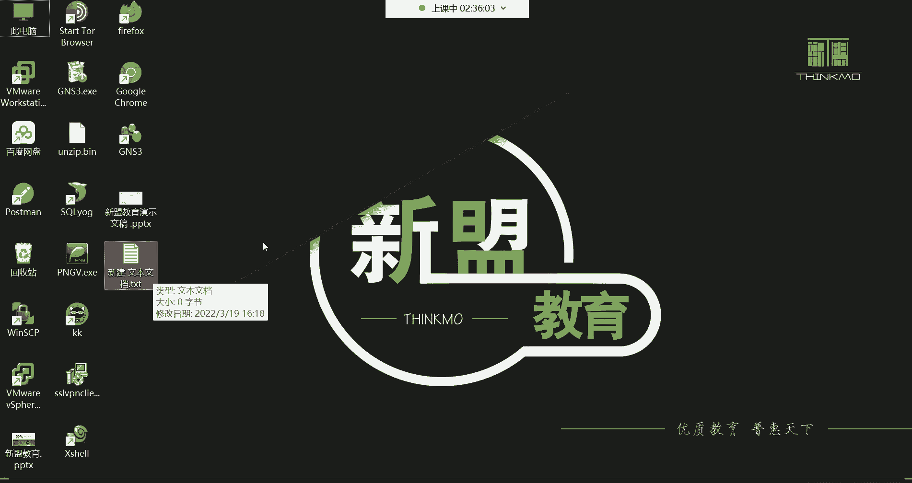

我想往里边写点东西，比如说你你好美女是吧，处对象吗，对对，写完以后呢保存一下好。

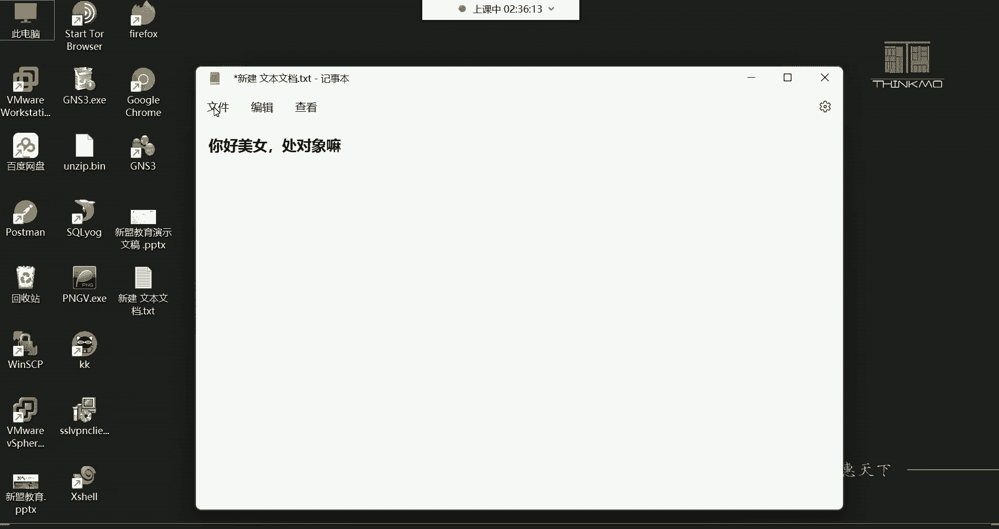

保存之后呢，那大家有没有想过，就这个文件是用什么时候是用什么创建出来的，或者说我打开这个文件，我往里面写东西的时候，又是通过哪种工具去打开的呢，有没有想过呢，唉其实你右击属性的时候，你都能看得到啊。

这里面有个叫什么呢，有个叫打开方式，看到了吧，这打开方式叫做记事本，是不是，也就是说这记事本啊，其实就是windows里的一个什么呢，叫做这个文本编辑器，可以具备创建文件的功能，是不是啊，然后呢。

我们可以通过这记事本呢，对文件的内容进行一个增删改查，都没有任何问题，这不就叫做文本编辑器嘛，啊让我们去编辑文件的，但是在这个LINUX里面呢，它不是记事本哈。

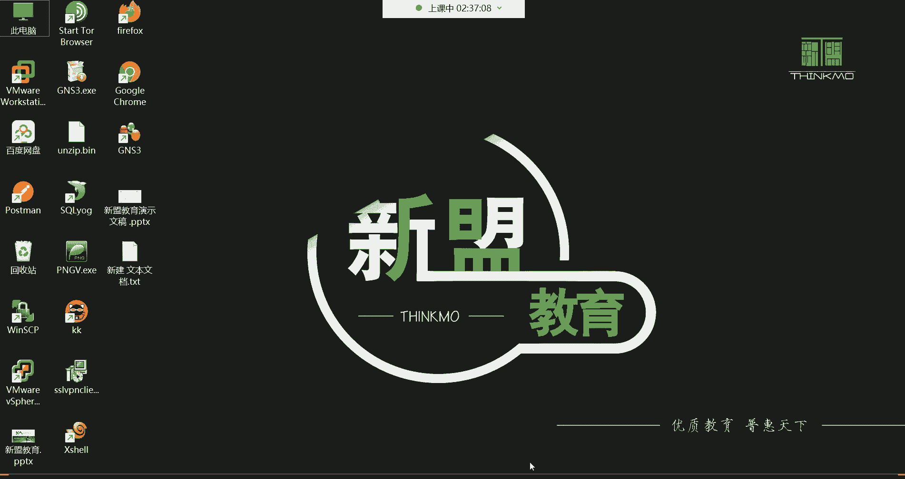

它叫什么呢，它叫做vi啊，又或者是VIM，那为什么说这两个名字呢，因为啊这个vim是从vi发展过来的，一个文本编辑器，最早它叫vi，没有后面那个M区别呢就不太一样了，像这个VIM啊。

它具备有叫编程的能力，什么叫编程呢，就后期我们学习一个叫做show脚本的东西啊，叫事务脚本编程，那VM呢，他可以主动的以字体的颜色，帮我们去辨别我们的这个语法是否正确啊，就如果语法错误的话呢。

它会有颜色提示啊，就这么回事，这就是这一个区别，而VI的话呢它本身没有颜色，对于VI这个文本编辑器本身是没有颜色的哈，所以说这是他们的一个具体的区别了，VI呢一般不适合去编程，VM的适合编程啊。

但如果说我们要修改一些配置文件的话啊，那就用vi都无所谓了，到底是vi还是VM这个关系都并不是很大了，好，那接下来呢咱们嗯哈哈来演示一下，这东西怎么用啊，这东西呢非常简单，我们说这个命令格式。

这哈命令格式非常的简单，看看vi后面跟上文件名就可以了，然后呢它下面有两个特点哈，看若文若文件不存在啊，这样吧我们不加目标了哈，不加目标了，如果文件不存在，则创建则新创建文件，并对它进行编辑。

那如果文件存在呢，那就直接打开文件，然后呢再去编辑它，那这个也比较好理解，你看哈。

我们把这个拿过来来给他说清楚。

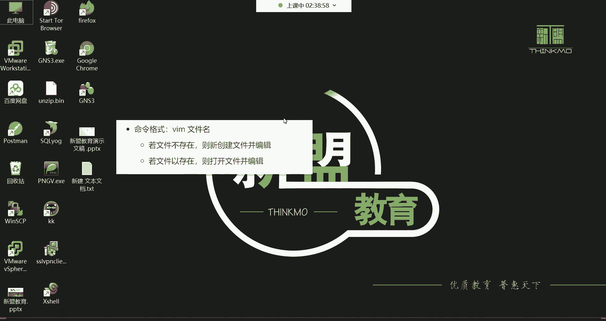

我现在干嘛呢，我现在想去改一下我的主机名啊，我现在想改个主机名哈，那我的主机名的文件是不是在etc，host name这个文件呢，是不是啊啊这个文件放的是主机名的文件，那我现在想改主机名。

那你可以通过vi直接打开这个文件，打开看到了吗，这里面放看这里面存在，比如我们当前的主机名字叫test啊，那你看这个文件它是不是已经存在了呀，是不是啊，压根就存在，压根存在呢，咱就直接打开。

就直接对它进行编辑，能理解吧，那如果不存在呢，啊我们退出啊，我们先退出啊，我们再编辑一个不存在的文件，那我们在vi，比如说你看啊，我现在呢在OPT目录，我们看OPT目录，我们CD到OPT啊，进来以后呢。

我用vi我编辑一个不存在的文件，比如叉叉叉叉点TT，打开那个文件压根是不存在的，那文件不存在的，没关系，他会把这个文件先给你创建出来，然后呢你再对这个文件进行一个编辑，就这意思啊。

就是也就是说它是具备创建文件的功能的，好，那把这个事情说清楚之后，我们就得给大家讲讲这种东西怎么用。

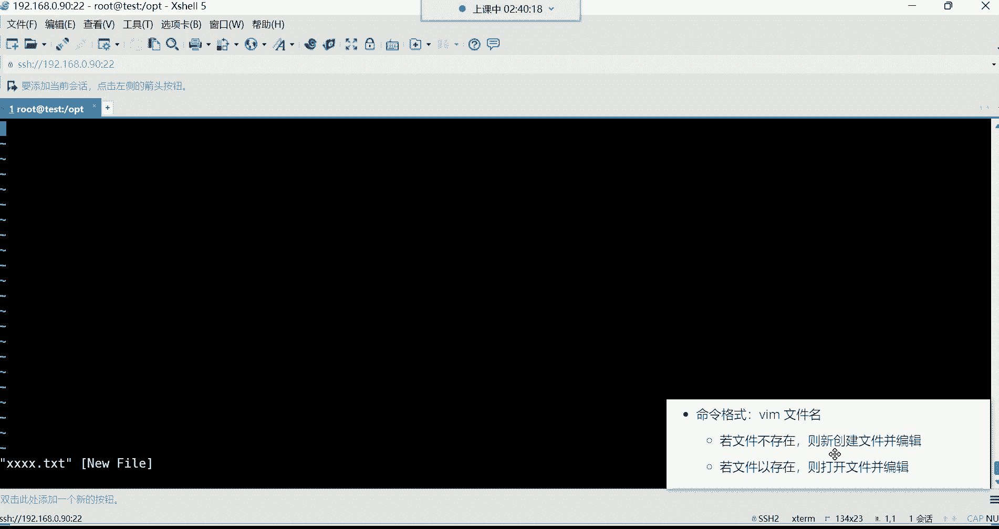

这个非常复杂哈，它可不像我们在这个用什么呢。

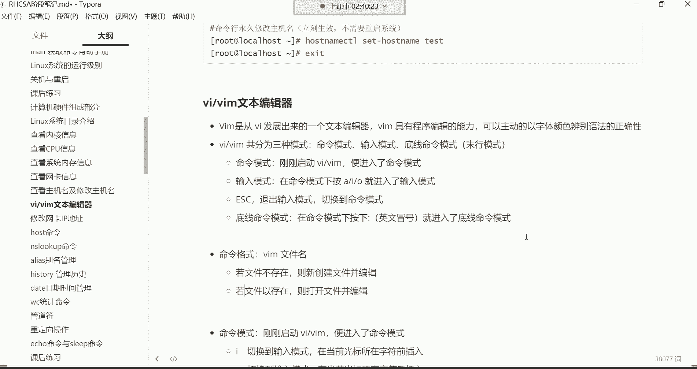

在用那个，记事本一样。

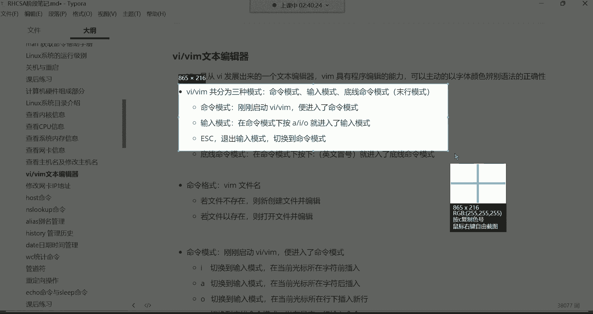

你右击损你这个右击一点，新建这个文件就给你创建出来了，这可没有那么简单哈，你看这个东西呢，刚开始学习的时候呢还是蛮复杂的，因为你看它分为三种模式啊，不管是vi还是VM都是三种模式呃，第一种呢叫命令模式。

第二种叫输入模式，第三种叫底线，命令模式，也叫末行模式，那么这三种模式什么叫命令模式呢，就是我们刚刚启动了vi，我们便进入了命令模式，就现在这个模式就叫做命令模式，就是我用它打开一个文件，看到了。

我用它直接打开了一个文件，那我们现在就在命令模式下边的，那这个所谓的命令模式，就是我们现在所有的操作都会被它识别，为什么呢，他的命令这个命令都有哪些呢，哎这个命令。

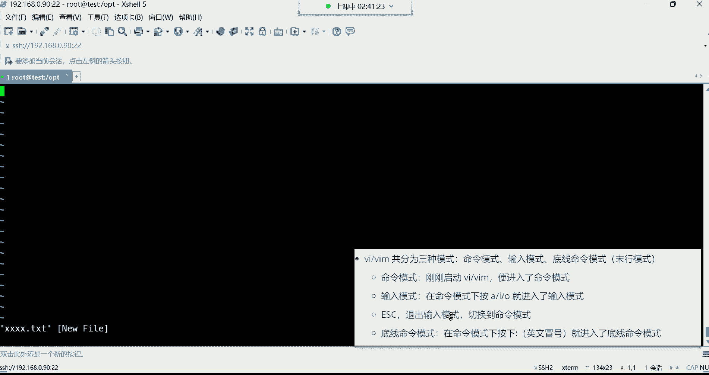

在这哈在命令模式下，大家可能已经一看这一大堆已经头皮发麻了啊，这些都是他的指令，这一堆哈，就是在命令模式下，我们可以使用的指令呢有这么多啊，看到了吗啊，这些都是都是常用的哈。

没常用的我都没有给大家拿出来，因为针对于VIM有有专门的一本书啊，就写这个VM文本编辑器的哈，一本书就写这一个VM，所以你想想这一本书跟我给你呃，怎么说呢，准备的这些常用的这些操作。

这简直就是不值一提了，是不是，那只不过我们这些是就是经常会用到的哈，但是它也不少了也不少了啊。

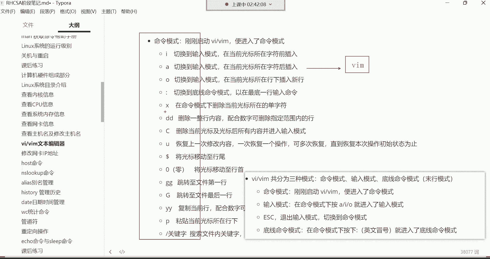

那下面呢咱们一个一个说啊，就是在命令在命令模式下，我们可以按AIO都可以进入下一个模式，叫做输入模式，在这里哈输入模式，那我们来看看啊，AIO按哪个都行，我们习惯用II哈，NI的话，你看insert。

insert就是插入的意思，插入什么呀，那这时候你想往这个文件里面写什么东西，你比如说写个hello啊，你好美女啊，想想什么都行，想换行呢就拍个回车，然后这个写哈随便写哈，ABCD之类的。

想写什么就写什么，这都无所谓了哈，然后这个在里面呢光标可以左右移动，然后如果还想换行，就拍回车，看到吧，就拍回车就换行，看到了吗，哎上下键呢就可以上下行器进行一个移动，左右键就是什么呢。

就是左右进行一个移动嗯，就这样看到了吗，这是什么呢，这就叫做输入模式，也就是说也就是说啊，你想往那个文件里面写东西，唉你得先进入到这个输入模式才可以啊，你不在输入模式，你在命令模式。

你所有的动作人家都会认为你是在，请在使用我的命令，能理解吧，所以这个命令呢就给你提供了，进入输入模式的这三个三种命令，呃那接下来呢咱们就继续来说一说我们这个，这种东西你想写什么就没有人能拦得住你了啊。

你就比如说发挥一下你的才华，在里边写首情书啥的，这都无所谓啊，你比如说12345678等等等等哈，叉叉叉叉啊，哦叉叉插入，想想怎么写就怎么写，这是命令模式跟输入模式，那接下来我写完以后。

我想保存怎么办呢，嗯井号代表注释啊，井号代表注释，让我们说一下，就是我想保存啊，我想保存，想保存的话呢，注意哈，你现在是在这个输入模式的，在输入模式现在是没有办法进行保存的，所以你得什么呢。

得先退出你的输入模式，切换到刚刚的那个命令模式，那怎么退出输入模式呢，ESC按你键盘的ESC可以退出输入模式，你看我一按键盘的ESC，你看下面这个insert就没了，是不是好。

insert没了就没就证明我们现在是在一个什么呢，载一个命令模式，载一个命令模式，那在命令模式我们还得干嘛，还得去输入各种各样的命令，没错吧，那你看在命令模式下，按英文的冒号。

就可以进入那个最后那个叫底线的命令模式，底线命令模式，所以这时候呢你按一下英文的冒号，那下面呢就出来一个英文的冒号，看了吗，那这个时候你说我想保存了。

哎，那这个你就得输入底线命令模式的命令了，那在底线命令模式下可以使用的命令呢，啊在这儿呢这些都是底线命令模式，上边是命令模式，你它不一样哈，他们是不一样的，所以你发现这里面这记的东西还是蛮多的是吧。

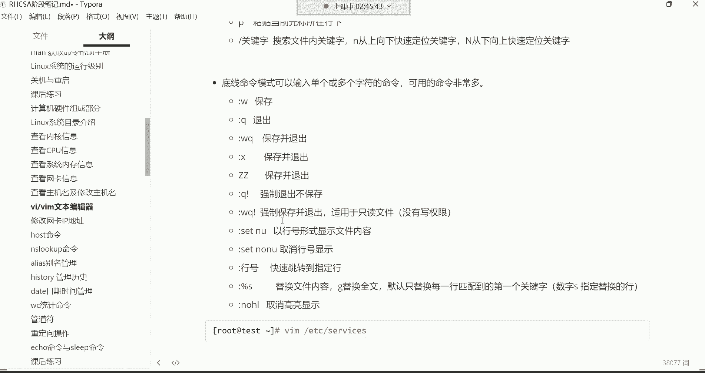

那想保存呢就这些操作这操作哈。

咱们先把先把保存给大家说清楚。

OK啊，然后英文的冒号输入WW就保存，你呢拍个回车就可以了，回车好，好那我们这几行呢总共是1234566行啊，就全都被你给保存了，但保存不行，我想退出去啊，我想退出，退回到我，我的。

我我退出到我的这个命令行终端这个位置了呀，那怎么办呢，你得按Q哎，咱Q哈，所以英文的冒号再按Q就退出了，先保存，然后再退出，能理解这意思吧啊然后现在你就可以再继续去，该干嘛干嘛去了，在这个位置啊。

那我们现在再来熟悉一遍vi啊，指定这个文件打开的，那首次打开是在命令模式好，那在命令模式的话下呢，大多数它会给你显示这个文件的名字啊，告诉你这个文件叫什么名字，然后呢我现在想编辑的话。

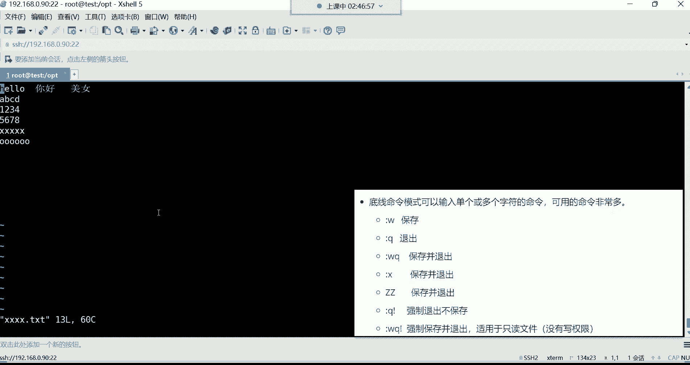

那这个时候你看AIO，我们前面讲过AIO到底差别在于哪里呢。

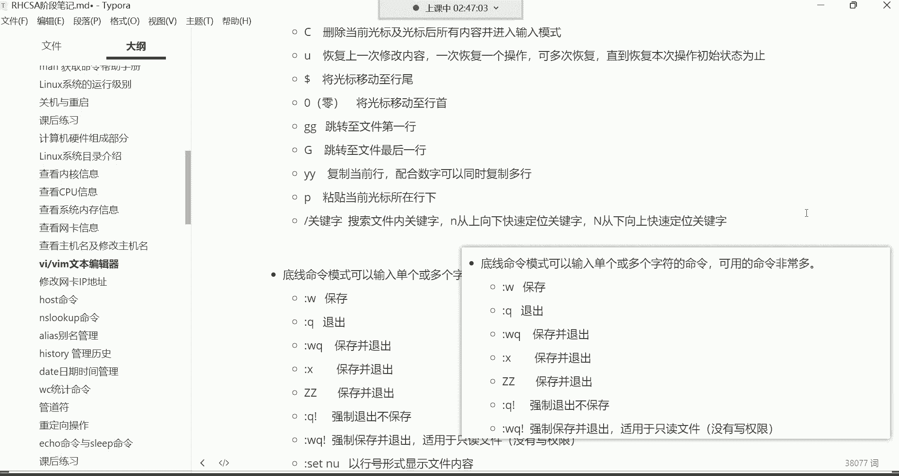

也没有太大差别，大家记一个就行，这三个AIO。

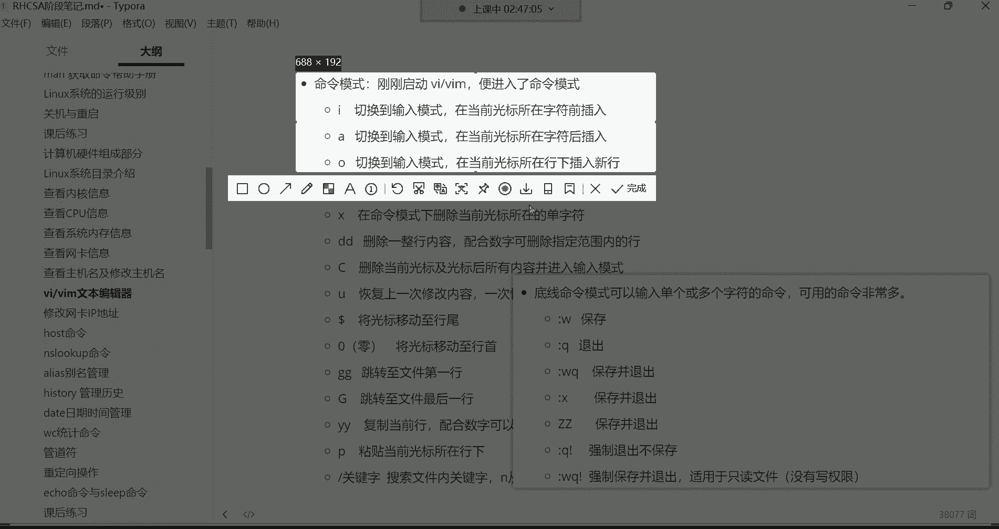

你看我们就先拿这个什么呢，我们先拿这个I来说，它首先是可以帮我们切换到这个输入模式的，但是他切换的时候是在当前光标所在的字符前，进行一个切入，保存完要是再编辑，可以可以可以哈，你看我们现在这样呃。

什么叫在当前光标所在字符前呢，比如我现在我现在我想载什么呢，我现在想在你好后边在写点东西，那这时候呢我的光标放到了好的后边，是不是啊，那我再按个I注意哈，I然后我现在是不是insert在插入模式呢。

那这时候我再怎么说他写，比如说你好帅哥帅锅，帅锅，那你看有没有注意，刚刚我的，我在我所有写的东西都在我的光标前面呢，是不是没错吧，唉所以它叫什么呢，在光标前进行一个插入A呢不太一样。

我们再按ESC注意哈，我们再按键盘的ESC先退回到命令模式，我们来验证这个A它也是切换到输入模式，但是它是在当前光标所在字符后进行一个插入，什么意思呢，你看比如我现在我想在美后边。

注意我现在每字后边写个东西，那你按A的话，你看你的光标它会移动一个位置，AA啊，A你看光标移动到到哪儿去了呢，光标移动到美到后面去了，那你现在在写东西，也是写在你的光标前面的，是不是没错吧。

那O呢O不太一样，我们在NESC哈，再退回到命令模式，那再ESC，比如我现在想干嘛呢，我现在想到5678这一行的下边，另起一个新行，那我按键盘的下键可以往下往下移啊，把光标放到5678这一行。

放到哪儿都行，你按O回车，你发现诶，我这个光标，现在跑到这个5678这行的下边来了，那这时候我可以在下边可以继续写啊，肤白貌美，OK大长腿是吧，是不是，所以这O它的区别就是什么呢。

是在当前光标所在的行下插入信号，所以这AI跟A你用哪个都行，它的区别并不是很大，无非就是说白了你移动的光标的事，没错吧，你也比如说我就想在这个什么呢，这个女的后边写入数据的话，你按A。

他会把你的光标直接移动到这个女的后边，看你按A是吧，光标跑后面去了，那我们再按再按ESC是不是，那这时候你说我还是想在女女字后边再写数据，那就是你按I也无所谓呗，那你发现你光标移过自己。

光标移一下不就行了吗，是不是你把你光标往后面移，是不是这不就按个右键的事儿吗，是不是不就这意思嘛，所以说对于这种东西呢，大家记哪个都行，你觉得哪个好记就记哪个没有太大的差别，I跟A哈啊。

这是总之都可以让我们进入什么呢，这个输入模式啊，或者说插入插入模式，但就是这个OTA不太一样啊，O会什么呢，帮你另起一个新行好，那这是插入模式，然后接下来呢我们再来说这个保存啊，保存的话呢。

比如我们在里面又写了一点数据是吧，那写完以后呢，我想保存了，那这个时候呢正常来讲不是W保存Q退出吗，你可以连用，可以这样哈，直接WQ他就帮我们同时做保存并退出，你看我们英。

我们先按ESC退回到这个命令模式，然后英文的冒号来到底线的命令模式，好在这个位置在下边就输入命令了，它叫底线命令模式吗，在最底下输入命令，那这时候我就WQ啊，回车效果也一样，只不过呢就一气呵成了啊。

先保存，然后再退出，就这意思好，然后还有一些快捷操作，比如X也一样，也是保存并的时候，我们再打开这个文件，然后呢我们再怎么说呢，我在这个负YM尾下面我再写一个写个什么呢，比如说那个腰细腿长好腰细腿长。

OK写完以后呢，我们再按键盘的ESC键，然后这时候呢在英文的冒号，英文的冒号啊，然后这时我们再输入一个XX呢，再拍个回车啊，也是保存退出，看到了吧，就你想保持这种有很多种方式。

然后你说那还有一种方式ZZ啊，大写的ZZ这种呢你比如说我在这里边，我又在腰膝腿上下面又增加了一个，增加一行是吧，增加谁呢，嗯那个再写点是不是啊，唉叫比如波涛汹涌，OK那我现在想把这句话也给它保存上。

那接下来呢ESC先回到命令模式，注意啊，这时候你看ZZ，这时候你可以这样大写的ZZ哈，大写的Z，这时候你就ZZ啊，你看是不是大写的ZZ哈，然后回车是不是就保存下来了，保存退出了吧，啊啊以已经默认是吧啊。

大写CZ哈，OK可以没有任何问题吧，所以你想保存退出，你看这些操作呢就看你自己了，看你自己哈，然后我们再打开这个文件啊，叉叉叉叉点TT好，那打开以后呢，我想什么，我想这个比如说我改了一些东西啊。

这几个保存推出啥区别没啥区别没啥区别哈，功能都是一样的，只不过呢呃这个比较方便一些，而这个呢是更加方便一些，知道吧，这个是更加方便一些，能理解吧，然后嗯出书是吧，哈哈然后别的话那也就没有什么了哈。

别的就没有什么了，然后还有一个下面叫什么呢，叫强制退出不保存，那这是什么意思呢，强制退出保存，就是比如说我在对这个文件进行了修改了啊，比如我写了非常多的东西啊，啊比如我们在另起一行，在这写随便写哈。

比如这个一，然后二啊，然后三唉，写完了，这写完之后呢，我就不想保存了，怎么办呢，那你还不想删啊，你不想一个一个回删，感觉比较麻烦啊，那你可以这样哈，你可以这样嗯，先回到命令模式ESC，先回来。

回来之后呢，你可以英文的冒号啊，再来到底线的命令模式，然后呢Q叹号看Q叹号叫强制退出啊，就是强制退出，你所有的修改它都不会帮你保存的回车，那这时候你再看这个文件，你再打开。

你看是不是我刚刚写的什么123，并没有保存到这个文件里面啊，所以这叫强制退出不保存，就是你改了以后呢，你又不想，你又不想保存了，所以就可以这样，那还有一个这种叫WQ叹号，叫强制保存并退出。

那这种呢只适用于一些只读文件，比如你没有写权限，哪些文件呢啊我先给你退出哈，我们先退出这个文件啊，我们就假设哪个文件会出现这种情况呢，我们看一下这个。

拿那个alex gl e t c shadow这件来说吧，哈这个文件呢是任何人都没有任何的权限，然后呢我现在用vi打开这个文件，打开这个文件之后呢，你看啊，比如我想改这个文件里面的某一行，改谁呢。

比如说我想把这个test这一行啊，我光标往后移啊，移到最右边，我我要给谁呢，我把这个啊冒号里边什么都没有，是不是啊，我先插进去啊，I啊insert插入，然后呢我这里边我给他补个零，注意啊。

你看我给他补一个零，补了个零之后呢，这时候呢我再按ESC键，然后呢我在英文的冒号，我在输入WQ的时候，WQ不是保存并退出吗，是不是，这时候我再回车，你发现他就告诉你了，说read only。

Read only，就是只读文件好吧，那你得需要嗯ADD添加叹号才可以啊，用叹号进行强制保存好，那就是你就得只能用这种方法了，叫WQ他好强制保存并退出，为什么呢，因为这个文件是只读的，你没有写的权限。

你没有写权限，你想保存它不让你保存没有写的权限，加改文件里的内容，他不允许，所以但是对于root这个超级管理员来讲，没关系啊，它就可以使用这种WQ叹号，也是这个操作，也只有root才可以使用，注意哈。

只有root才可以使用一个叫强制的这种操作，但强制退出不保存呢，这普通用户可以用，因为这种操作是对文件是进行叫做强制修改的，而这种呢是不会造成任何的修改的哈，所以大家搞清楚，那这时候我就只能这样看。

WQ叹号叫强制保存并退出回车，诶你看保存成功了是吧啊，这没有任何问题，所以上呢我们想保存退出，这或者说不保存退出，这底线命令模式就常用的就这些啊，最快捷的操作就这个ZZ，你按住shift键。

按你键盘的shift键，按两下Z就可以了。

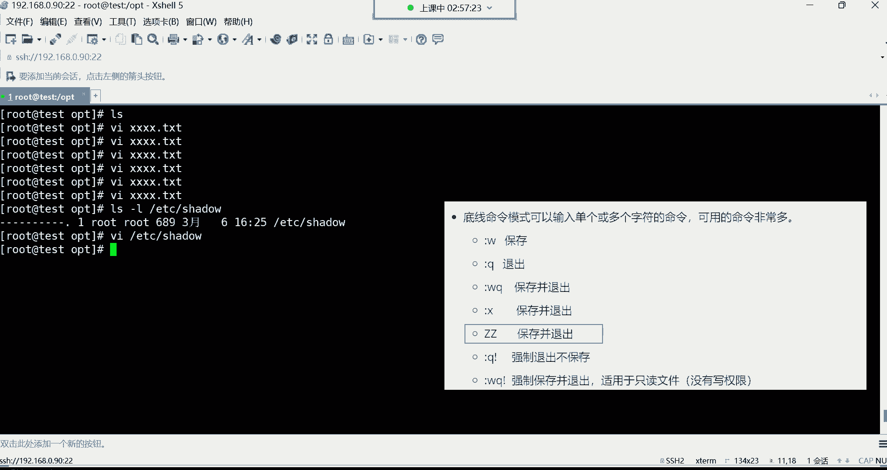

就直接保存退出了，然后呢我们再来讲这个命令模式啊，因为命令模式下面操作还是蛮多的哈，那前面IAO我们都已经说清楚了是吧，然后英文的冒号切换到底线命令模式啊，然后已在最底一行说明这个也说清楚了是吧。

为啥搞这么多保存是吧，就是每个人的操作他不太一样，对效果都一样，你挑一个G就行，你不需要全记哈，你挑一个G就行，你说哎呀，我就觉得X挺方便的，那你就记X能理解吧，就记X你说我觉得ZZ挺方便的。

你就记这个，你说我觉得WQ也不错啊，你就记这个是不是啊，嗯对反正看自己的情况吧，好那接下来呢我们再来说一说这个这个X啊。

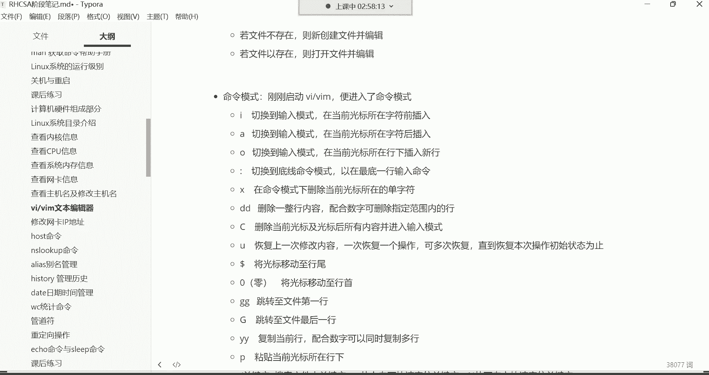

这个X呢下面这几个呢我给大家来讲一讲哈。

这个X是在命令模式下删除当前光标所在的图，我们打开我们打开谁呢，打开这个文件叉叉叉叉点TT啊，比如我现在想干嘛呢，我现在想删除谁呢，想删除这个帅锅啊，帅锅这俩字怎么删呢，把光标注意哈。

把光标放到你想删的这个字的上边啊，就是你按X就可以了，按一下键盘的X哈，好看帅子没了，那现在我的光标在锅，这时候你再按X好，锅也没了，看到了吗，锅也没了哈，嗯所以这就是在命令，注意他是在命令模式下。

并没有进入到那个输入模式，没有，还是在命令模式下就直接删，你想删谁，把你的光标放到那个字符的上边，它是一次删一个字符，一次删一个字符啊，单个字符OK啊，那如果说我想把一行都删掉，我想把这个ABCD。

还有1234567给它删掉，那注意哈DD你滴滴呢是删除一整行内容，然后这时候你按DD看我的光标放到ABCD，放到哪儿都行哈，因为它是论行去删了，这时候你删哪儿都行啊，你的光标放哪都行，按DD好。

你看没了是吧，这ABCD这行呢就被我给删了好，那如果说我连下边，比如说我连这个下面这两行我都想给他删掉，怎么办呢，那你可以dd dd同时按四个dd，但是呢如果说你删的比较多。

比如我这个文件哈内容我们再另起一行啊，在这我们先输入模式，再输入一啊，二，六好比如我现在想删的内容比较多，我想从从哪儿呢，从这儿开始，下边全都删掉，注意哈，然后先退回到命令模式，ESC退回去。

那这个时候呢，你看我们把光标放到你想删的这一行上边是吧，1234这一行，那这时候呢你往下数一数你的光标这一行，以及下边这些总共是多少行，那到时候你数一数就可以了啊，多少行呢，我给你们数一下啊。

一下23456789十是啊，应该是13行，13行，那比如说我就想我不想全删啊，或者说我这样删第几行呢，我想删这几行，你看我想删四行啊，从光标以及下面的三行总共四行啊，当前光标也算一行。

然后再加上下面的三行，总共四行，那这时候你就按你键盘的死，这时候你是配合你的数字键哈啊，你按四，然后再按DD好，四行没了，看到了吗，它是配合数字键可以删除指定范围内的行。

那如果现在我想把把下面这几行哪几行呢，把这个这两行给它删掉，这两行删掉，那你的光标定位到你想删的这一行，我总会想删两行，是不是好，那数字就是二，你按二，然后按dd好，两行没了啊。

那如果我想从这儿开始往下全删，你多输入点数字没关系，你说一百一百dd，那其实就是从你光标以及下边的99行，全都被删了，但是没有那么多没关系，没有那么多，就有多少算多少，能理解吧。

所以有的时候我们是怎么回事呢，比如说啊我先这个进入输入模式吧，比如说这个文件内容非常的多，非常多哈，然后呢你想干嘛，你想把这个文件里面，比如说从你光标往下所有东西都给它清掉，我们一般怎么玩呢。

啊你数你数字数大点没关系，你都不需要去挨个去数，你比如你可以这样先回到这种命令模式，你1000dd你先输入个1000，但是它不显示哈，1000dd从光标往下九九百九十九行全都删了。

但你说这个文件没有那么多行啊，啊没那么多行，有多少删多少，但是总之啊我的光标往下全都删除，我也部署了，总之有个几百行我也不要了啊，多输点输出也没关系哈，好这是dd哈，可以配合数字键啊去做一个删除啊。

然后再来给大家讲讲这个dd还没说完哈，对于dd这个操作呢，其实呃他是删除的操作吗，其实它不是删除的操作，我再给你们来一个哈，我们再往里边儿写呃，那个，那叫最近比较有名的老师啊，叫深田优美。

是不是啊啊叫深深，深田由美，深田，这是什么老师吧哈优美三深田优美是吧，这个不用说是吧，身边有美，下面然后写诶那腰细腿长的，腰细腿长的是吧，然后呢波涛汹涌的波涛汹涌的，哈哈哈啊，深田优美。

后面补个老师是深田优美老师，下边这样哈，我们这样三啊哈，C语言老师是吧，哈哈对啊，C语言老师教C语言的嗯，然后呢，咱们那个比如我现在从这往下都给它删掉，删三行，那咱就啊删两行吧，好吧啊，就删三行吧。

那咱就3dd啊，三然后dd好被杀了是吧，那这个时候我跟你讲，他你说他他是真删除吗，它不是不是这时候你再按键盘的P，你再按P就可以了，你按一下P，你发现这个回来了，想上他的课是吧。

呃你发现他又回来了是吧啊，他又回来的话，这怎么回事呢啊所以你看这这有人就说了，说这弟弟啊，其实他它不叫做删除，它叫剪切啊，叫剪切哈。

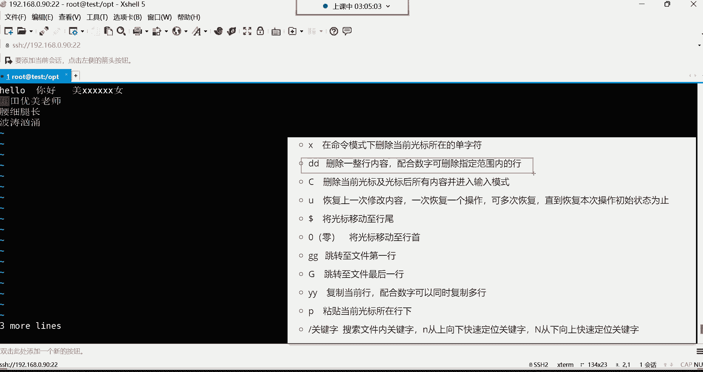

所以什么叫剪切，剪切就是像在windows里边，比如我们这样说，右击我来一个剪切是吧，剪切是吧，但是在windows里，在windows里面，如果你剪切的话，你得把这个东西给它粘贴到一个位置。

这个原文件才消失，能理解吧，如果你不粘贴，你看它不消失，能理解吧，它不消失哈，刷新一下，你看它还在，它不消失，但是在LINUX里面的这个dd其实它是这个剪切功能。

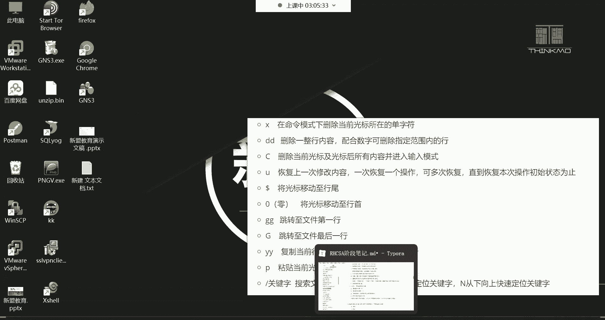

剪切的话就是。

啊如果拿文件内容来说吧，拿文件内容应该能看出效果来哈，那不如这样剪切，注意右击，剪切没了，看到了吗，是不是没了没了吧，剪切没了，但你说我如果剪切的话，我不粘贴，只把它剪切了，不粘贴，然后呢我直接保存。

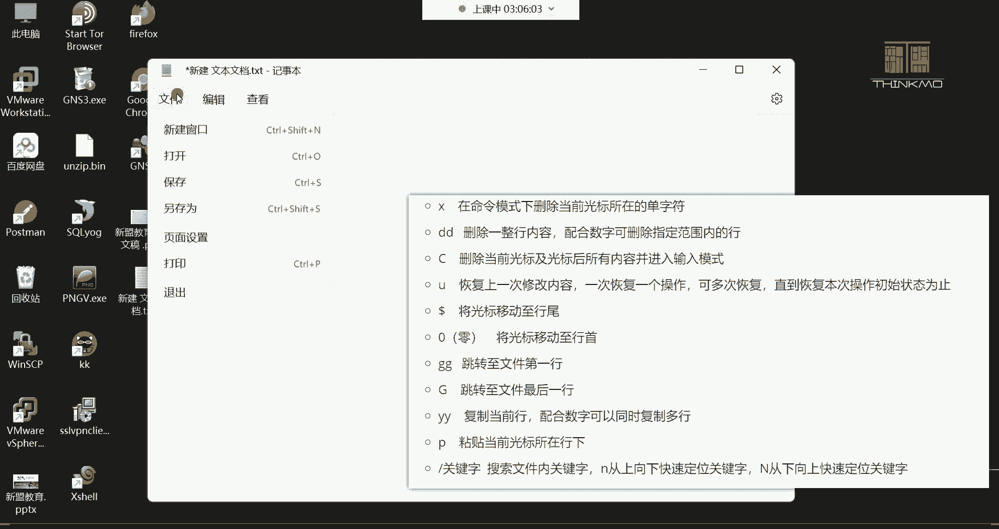

那我问你这内容是不是就没了呀，这跟删除没什么区别吧，啊所以这是剪切，它也具备删除的功能哈，所以这你搞清楚，所以这个dd呢其实准确的。

它叫剪切，不是删除能理解吧，但他可如果你不粘贴，这不就删了吗，其实就这个意思，但如果你不想删，你说将剪切到某个位置，你比如说下边，那我们再另起一行，比如1223，比如我现在想干嘛呢。

我现在想把这个这三行啊，我们先退回到命令模式3dd，这并不是删，我想给它粘贴，你把光标定位到你想粘贴的这个行就可以了，然后你再按个P，你看他就给你粘贴到你当前光标下啊，粘贴当前光标所在的行下啊。

你光标在这儿，他给你粘到你这行的下边，是这意思啊，所以叫剪切哈，OK那下面再来这个C，这C呢叫删除当前光标及光标后所有内容，并进入输入模式，比如我现在想这样，我我现在想把这个美字后边全删掉啊，这行啊。

你看我们这样N个A进入到输入模式，然后呢我在在里面随便写哈，写什么东西无所谓，非常长是吧，随便写啊，这时候呢我想干嘛呢，我想把这个美字后边的东西都给它删掉，那怎么办呢，我们先退回到命令模式，退了之后呢。

你把你的光标放到美字上边，然后你按大写的C，大写的C看效果哈，好没了，看了吗，首先呢它是删除了我当前光标以及光标后，所有的内容了吧，是不是，但是呢我们也进入到了这个输入模式啊，这是大写的C哈。

然后你说然后让我们再退回到命令模式，我想把它，我想把这个哎比如说前面就留两个一，然后呢从这开始往后都删掉大写的C啊，没了OK没了哈，那二也一样，比如我想留四个二，那后边全都删掉，那就大写的C3也一样。

按照相留一个三，后面全都删掉，退回到命令模式，然后呢光标放到这儿，然后大型C没了啊，这是删除哈，然后还有这个U这个U呢给大家说一下，U呢是恢复上一次修改内容，什么意思呢，就是我前面刚说的操作。

我现在后悔了，注意啊，我后悔了，我所有的修改呢，我又什么呢，我用这个就是都不想去什么呢，做任何的改动了，我想恢复恢复什么呢，也不能说所有吧哈，就是我想把这个删除的这个二跟三，给它恢复回来。

那这时候呢你回到你的命令模式，然后你按U唉，你发现看诶你刚刚删的那个回来了是吧，你占一个U好，你删的这个二也回来了啊，你再按一个U呢啊，你删的一也回来了，所以这一这个U呢叫做什么呢。

恢复你上一次修改的内容，但是他一次恢复一个操作，那最多可以恢复多少次啊，就重新打开这个文件，对从你打开这个文件，对这个文件进行所有的修改，都能帮你进行回复，如果按UUUUU，你看啊，我在这。

我呦呦呦呦呦呦呦呦呦，看了吗，一直可以帮我们再进行回复，看到了吗，是不是一直在恢复啊，啊他可以一直恢复到本次操作的初始状态，什么什么叫本次操作的初始状态呢，就是对啊，就是说从你打开这个文件的时候。

就是你的最初始的状态，你没有做任何修改的时候，就是最初最初始的状态能列吧，最初始的状态，所以它可以帮你一直恢复，啊是这么回事，但只要你别保存，注意哈，这位置一定要注意一下，你说你想恢复。

你比如说我们改了一套是吧，改了一通的话呢，你比如说我们把这个把前面这都能删掉哈，DDDDDD啊，下面这两个一个的删删DDDD啊，下面的补一个，我在这另起一行补一个啊，那叫波多老师，波多老师波多老师啊。

然后这时候呢我再退回到命令模式，那这个时候你比如说我现在怎么说呢，保存退出，你看我们英英文的冒号，先来到底线命令模式在这哈啊，英文冒号，然后我这样我保存退出X回车，保存退出哈，那接下来呢我后悔了。

我后悔了哈，哎呦这后悔了以后怎么办呢，我能不能给他恢复一下，我就打开文件，然后我能不能按U啊，没用没用哈，你现在NU一点用没有，看到了吗，为什么呀，因为你你现在就是你的初始状态，知道吗。

现在就是你的初始状态对，所以你现在没有办法去恢复，你曾经保存过的内容了，所以在没有保存之前，你想怎么回复，这都没有任何问题啊，这有，哈哈然后还有这个美刀啊，美刀呢是叫将光标移动至行尾啊，移动至行为。

比如我我的光标呢在这儿呢是吧，我想干嘛呢，我想对于这一行的，最后我想继续去编写，那这时候呢你按每刀就可以了，没到啊，你看光标就跑到什么呢，这个这一行的行为了是吧，行为也属于快速跳转哈。

然后想跳转的行首呢零啊，零就是将光标移动至行首，你按个零就可以了，又回来了，每刀又过去了，零又回来了，看到了吗，OK然后下面小写的GG就跳转到文件的第一行，我们现在已经在第一行了是吧。

你就不用跳大写的G跳转至文件最后一行，你按一下大写的G，你看我的光标现在跑到文件最后一行了，你说老师这怎么是最后一行呢，我跟你讲这些是空格，空格也算一行的，空格也算一横好，OK这是那个跳转哈。

就是可以进行这个行之间的跳转啊，就是行首和行尾之间跳转也可以进行什么呢，第一行跟最后一行之间的一个跳转快速跳转，然后YY啊，YY这个YY是纯粹的复制的复制，比如我现在想干嘛呢。

我现在想想把这个比如下面又写了一些啊，说这个我们先插入进去啊，插入进去123，好那这样诶，比如我现在这样哈，我把这个前几行呢，比如说前两行，前两行我要给它复制到哪呢，复制到这个这行的下边。

那这时候你就注意哈，你摁一个YY，注意连着按啊，按两下歪歪，然后呢，你把你的光标放到你想复制的这个行的，这个位置就可以了，然后输入个P啊，P不粘贴，所以YY呢它是复制复制当前行。

但是你发现这我一次YY只能复制一行，是不是没错哈，它一次只能复制一行，那如果说你如果你说我想多复制几行呢，那这时候你把你的光标放到你想复制的，这个行的上面，然后呢你跟上数字就可以了。

它也可以配合数字键哈，你比如说我想复制我当前光标，以及下面的这一行，总共两行吧，那你就2YY，然后想粘贴的时候，把你的光标你想粘贴到哪一行的，下面就把你的光标放到哪一行，然后你输入个P好，这是复制粘贴。

看到了吗，你比如说我现在想要不，我现在想把1234这四行同时复制，那你就4YY看了吧，然后呢我想粘贴到这个三的下边，那你就把你的光标放到三，这行放到哪都行，然后输入个P啊，你看看到了吗。

这就是叫做复制跟粘贴啊，这是复制粘贴，然后前面这个dd是剪切，删除也可以OK哈，删除也可以好，然后还有一个叫关键字搜索，那这个关键字搜索的话呢，我们不拿这个文件来说了哈，我们退出保存退出，拿哪个文件呢。

我们用vi打开etc service，这个文件打开之后呢，这个文件内容非常多，是不是啊，然后我们可以拿这个文件来练习哈，你看这个文件我们这样哈，我们给他拷贝一份，我们先这样哈，我们先保存退出。

我把这个etc下的SRS文件拷贝到我的当前，回车啊，莱斯看一下service，这个点应该还记得吧，代表当前路径是吧，你当前在哪儿，这点就表示是哪个路径，所以呢我们就直接把这个文件拷贝到哪啊。

唉我当前的OPT目录的，那拷贝拷贝过来之后呢，咱们直接拿这个文件来练习哈，service的文件，接下来呢咱们我想跑到文件的最后，那是不是就大写的G啊啊大写的G好，跳转到文件最后了。

好让我想跳转到文件的第一行，那就小写的GGG又跳转上来了第一行，然后接下来呢我们进行光标的移动的话呢，那在里边啊，就是随便来回移哈，那你比如说我把我的光标放到哪呢，放到这个这一行。

我要把我的光标移动到这个行为，那你就没刀是吧，移过去了行首，那就零又回来了，是不是啊，我想删除，我想把这行给它删掉，那就dd是吧，反正你不粘贴就删了啊，如果是我，我想删除什么第几行的。

我想把这两行删掉啊，这两行，啊又卡了一下是吧，没关系啊，都不影响不影响不影响，OK卡了一下，你比如说我我现在想把这两行给它删掉，是不是，那时候咱们光标放到你想删的这一行上面，然后2DD2DD好。

那这两行就没了，然后别的呢别的也没什么了，那然后YY复制粘贴是吧，这个我就不多说了，然后我们主要给大家讲这个关键字搜索，比如我想在这个文件里面搜索一些关键词，那这时候呢你在命令模式啊，输入这个右斜线。

其实就根目录的那个斜线，看那下面是不是就变成一个右斜线了呀，没错吧，那接下来你在这位置干嘛呀，你就随便跟一个关键字，你想搜索什么，比如说我想我，我现在想搜索一个，啊搜索一个什么搜索一个PORT啊。

叫pot回车，有些慢哈，啊等一下哈，搜索pot搜索。

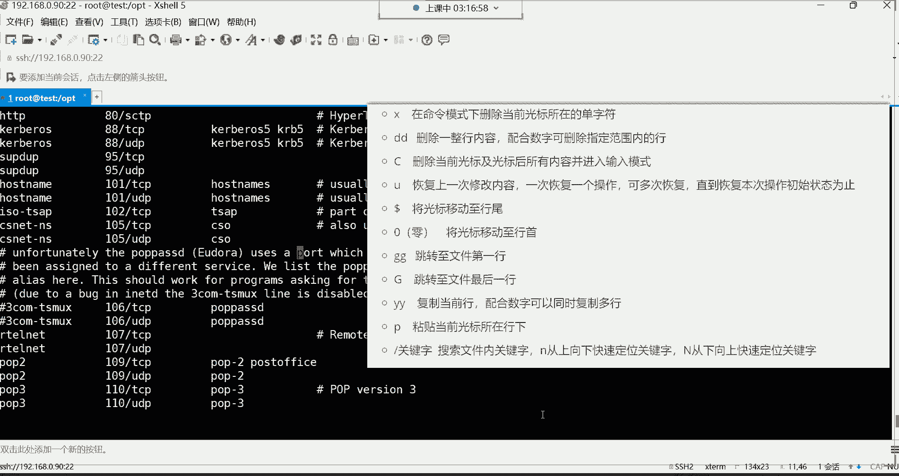

看看我一搜索，你发现我这个光标跑哪来的，跑跑这个炮塔上来啊，跑跑这里我要搜索这个关键字上面来了，是不是啊，在这啊，pp o RT好，那这时候呢我们可以这样N从上向下快速定位，那按你键盘小写的N。

你看当然这也是这个，等一下我怎么觉得他有点问题呢，哈PORT，嗯我定位一下看看啊，P p p r t p，P r t，啊确实没有错，确实没有错哈，但是他这个呢跟我们想象的有些不太一样，怎么不太一样呢。

就是它并没有给我们加一个背景颜色，正常来讲它是有一个背景颜色的，哎呀没有背景颜色是因为vi这个工具有问题，是vi的问题哈，是这个VI这个工具的问题，如果我们用VNM呢，它是完全不会出现这种情况的。

来哈换个工具退出退出啊，我们这样咱们不是改了吗，一通改是不是这样，我们Q叹号不保存退出不保存退出，就是你前面所有的改我都不保存了是吧，退出退出啊，也是这个文件，我们没有做任何的修改。

U只能恢复上一次修改内容，那你不小心按多了几下，不想修改，那怎么Q叹号退出啊，Q叹号退出就是你所有的修改，它都不会帮你保存，那接下来呢咱们这样用ym guy in all，这条命令呢，我们后面会写。

你先这样，后面跟个VIM回车，搜索完按哪个，你拍回车，你拍个回车，他就回到命令模式了，不用按拍个回车，好哈哈，安装完了哈，安装完了之后呢，我们这样换做VMVM后面跟上这个文件，跟上44的文件打开。

你发现有颜色了，看到了吗，唉你发现有颜色了，是不是vi没有颜色，是不是啊啊没错啊，有颜色了，而这时候我们再演上这个搜索，右斜线搜索搜PORT回车，你看效果不一样吧，怎么不一样呢。

你发现他把你要搜索的这个关键词，都给你查出来之后呢，而且都给我们附带一个叫做背景颜色，那这样你就知道啊，我要搜索的关键词在这儿呢，没错吧，是不是，哎你发现这个就是说为什么我们前面讲。

这vi跟vi m他们还是有所差别的呢，就是vi现在用的比较少一些，大多数人都比较喜欢用VM，但是VM的话，如果我们这个系统是最小化安装的话，他没有VM，你得自己去安能列吧，是这么回事，啊这是搜索关键词。

那基本上你看我们在命令模式，我们该讲的也都讲了吧，是不是，然后咱们，到时候得多练哈，这种东西就得多练命令模式，然后呢底线命令模式呢，我们这个再来给大家讲讲底线命令模式，还有哪些没有讲呢，行号。

以及高亮显示哈哈。

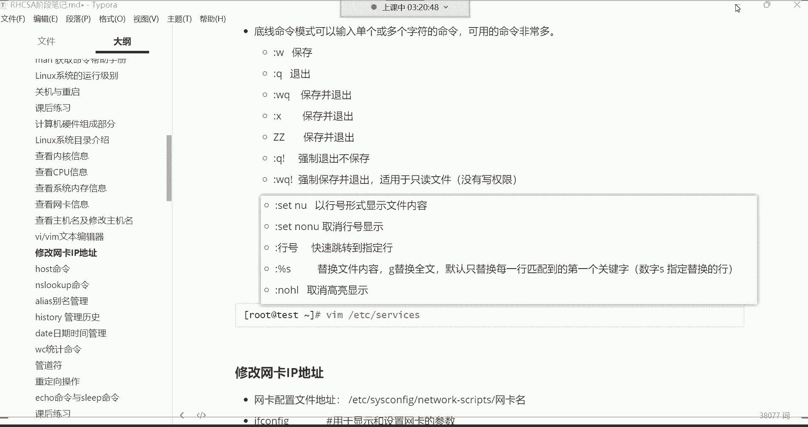

你看比如我对于这个文件来讲，这个文件内容非常多，是不是啊，嗯这个文件内容非常多，但是呢我想看看我当前修，比如我想看看，我当前光标在这个文件的哪一行啊，这怎么办呢，注意啊。

在底线命令模式叫set none，英文的冒号底线命令模式，然后set空格none回车，这时候呢，他就帮你把这个文件的行号给你显示出来了，能列了吧，行号给你显示出来了哈啊，不是这个江澄这问题怎么复制的。

那个古清扬的问题吗，是吗，你们两个问题怎么怎么是一模一样的，还是说你们两个有相同问题呀，有相同问题是吧，U只能恢复上一次修改内容，你嗯那你不小心多按了几下，啊哈哈哈啊对，那你就那你就再什么呢。

你就再重新再来一遍吧，是不是，那没有办法，好那在这个位置呢看看显示了这个行号，看到了吗，嗯在每一行前面给你加了一个行号，这还是比较不错的，是不是啊，OK啊，接下来呢我们再说啊，再说什么呢，再说这个。

这个行号有了以后，我想给它取消掉怎么办啊，我们先不说取消哈啊，比如我想快速定位到哪一行，快速定位哈，比如说我想快速定位到这个文件的1000行，这样英文的冒号后边跟上一个什么呢，英文的冒号哈。

1000回车，那你看我们当前就光标就在这1000这一行了，看了吗，就在这一行了哈，这是快速定位到某一行，你说我想快速定位到了2000行，那就个十百千，回撤2000，你一回车，我们现在就在mini模式了。

然后呢下面还有一个这个叫替换啊，百分号S叫替换文件内容，这个替换文件内容的话呢，比如说我现在对于这个文件来讲啊，我想把这个文件里面的什么呢，我们先这样哈，我们先跑到文件的行，首GG跑到第一行和第一行。

我现在想把这个文件里的所有的part给它替换成，比如说叉叉OO可以吧，怎么替换呢，来看哈英文的冒号，然后呢百分号S小S，然后这时候呢替换的内容这里边注意啊，要有替换符。

替换符呢你可以用斜线来表示三个替换符，注意啊，三个替换符，然后呢在前两个替换符中间先写这个什么，先写你要替换的文件内容，你要替换谁呢，我要替换这个文件里的PORT，那叫port，这叫旧内容，注意啊。

这叫旧内容，然后呢后面呢再写新内容，写叉叉OO啊，再写叉叉OO哈，然后这个时候我们拍回车回车，这时候你看哈，他说这个一共是做了594次的替换，共替换了594行，啊594行啊，那也就是说在这个文件里边哈。

你看一下哈，就是我们前边的，把文件里面所有的那个PRT，都给他替换成叉叉O了，做了一个替换，网上我们跑到这个文件的行首吧，你发现诶是没有pot了吗，好像看不到了，是不是确实看不到了吧。

我们再搜一下右斜线炮回车，诶好像也有pot，然后再N往下快速定位一下哈，诶怎么还有pose呢，你看还有看了吗，还有哈，还有你看诶好像并没有完全替换呢，并不并没有完全替换吧，它这个替换是量子的哈。

就是默认只替换每一行匹配到的第一个关键字，什么意思呢，只替换匹配到的第一个关键字，比如这一行里面有几个pod，你看有三个吧，这一行里面有三个，那他替换怎么替换呢，只替换匹配到的第一个，后面两个就不算了。

啊后面两个就不算了哈，也不能说啊，对你他从左往右匹配，只要匹配到了是第一个就给你替换，后边再有就不管了，所以这种东西呢你要干嘛呀，如果说我想实现所有的替换，你要加一个什么呢，加一个GG叫替换全文。

所以默认只替换每一行匹配到的第一个，那如果这行里面你看有三个，那就没用，第一个给你替换了，替换成叉叉O了，看到了吗，叉叉O后边就没有，并没有给你替换掉，啊而这个S呢是它的一个指定要替换的，这个什么呢。

一个关键字关键字哈，所以这时候我们如果想全文替换，可以这样，这里面可以什么呢，往上翻哈，你按右斜线的时候，你可以往上翻看到吗，往上翻翻翻翻啊，翻不上去了啊啊不是啊，这个英文的冒号哈。

因为这样哈英文的冒号往回翻看吗，补个G补个G哈，补个G的话，那这时候我们属于叫全文替换了，所谓的全文替换，就是这一行里边不管有几个，我想替换的这个关键词，你全都给我替换掉，所以这时候我们再回车好了啊。

87次替换，然后呢共79行，这时候你再在这个文件里面，比如在右斜线，我在搜pose的时候，你发现你搜不到了啊，找不到了，为什么，因为所有的pod全都被我们给替换成叉叉O了。

那如果你这时候你再搜叉叉O回车，那就多了去了，是不是，所以这叫替换，然后你们刚刚说什么CTRLR是吧，嗯CTRLR比如我们那个往回挽回这个复原是吧，以位于追求改变。

然后你所说的CTRL就是我再回到我刚刚的那个，前一次改变，这意思吧是吧，再CTRL又回到刚刚的前一次改变了，后悔了吗是吧，就是退多了吗，是不是退多了，CTRLR再往回反一次，是不是，行。

然后下边呢还有一个叫，NOHL叫取消高亮显示啊，这个高亮显示呢是这个意思哈，就是现在它不是有一个高亮吗，啊背景颜色有个高亮哈，你如果说你不希望看到这个高亮颜色了，你可以这样用我的冒号啊。

这个高亮就被取消了，看到吗，这取消高亮显示，那如果你说我这个行号我都不想显示，怎么办呢，取消行号啊，就set，英文的冒号，Set no none，回车行号也没了，这VM的一些在底线命令模式哈这些操作。

然后。

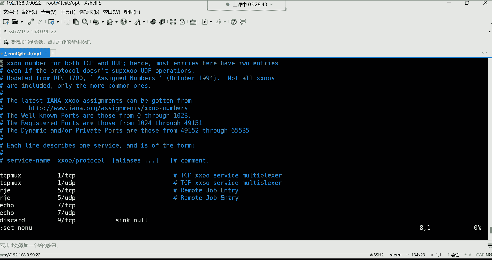

这些操作像什么取消高亮显示用的比较少一些，替换用的比较多一些，对文件的内容进行替换，快速跳转用的比较多一些，然后取消高亮显示用的比较少一些，嗯行号呢用用的多，然后像像这些呢WQ保存的用的比较多一些。

是啊剩下也没什么没什么，1234啊，这四个用的比较多一些，在底线命令模式搜索用的也比较多一些哈，搜索搜索关键字，这也是其实也是属于这种底线命令模式的操作，行了，以上就是VM这条命令文本编辑器。

文本编辑器啊，然后今天就讲这么多吧行吧，今天讲这么多吧，然后你们下你们下去以后，主要是把这个VM要多多练习一下哈，因为我们今天其实你发现前面学的，所谓的查看这些信息的时候，那么查看内核信息这种东西。

平时用得非常少的啊，查看CPU信息这种东西你也改变不了，也很少去看他，因为对于CPU硬件这种信息呢，你改不了没有也没事，没人会去看他的信息，内存呢我们一般比较关注，但是关注我们一般是用这个命令看啊。

看总内存，剩余内存，别的什么看网卡信息的话呢，这命都比较好记，看主机名没事，也没人会去看主机名，一般的就修改的话，直接用这个命令去改就可以了，所以今天我们其实重点的操作就在这儿呢。

这个是因为后期会怎么说呢，啊因为今天因为今后都会频繁用这个VM啊，或者说vi知道吧好了，那录屏停掉吧，然后看看有什么问题啊，有什么问题大家可以发到群里面。

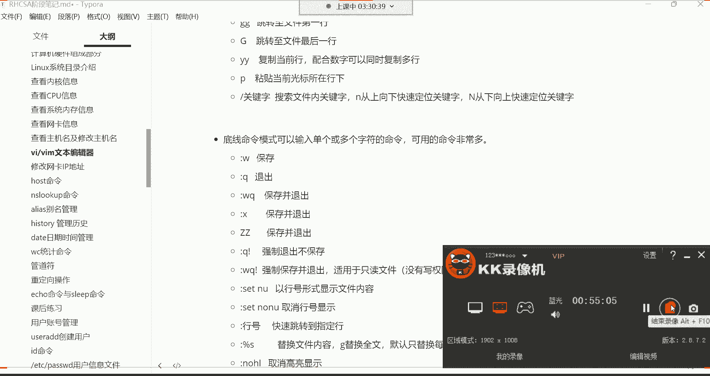