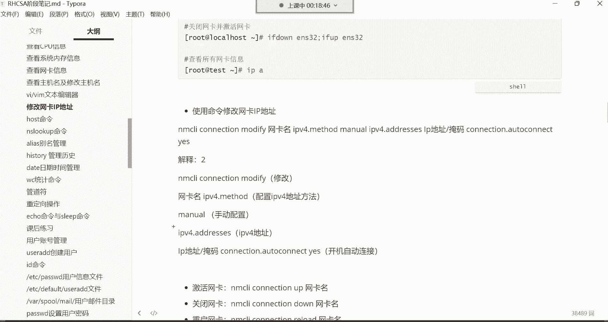
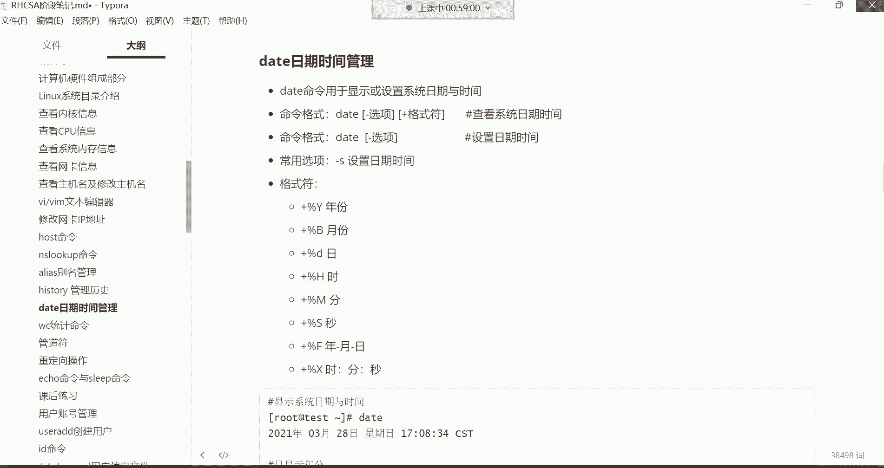

# Linux最全RHCSA+RHCE培训教程合集，小白入门必备！ - P13：红帽RHCSA-13.修改网卡地址、host、nslookup命令、alias命令别名、history管理命令历史、date日期时间管理 - -Book思议8 - BV1ZV4y1v7c8

哈喽哈喽，兄弟们能听到我这边的声音吗，这声音怎么这么小呢，喂喂喂OK吗，呃来听到声音的刷波一，我们开始上课少了一些人是吧，这个一到周末呢啊特别是到这个礼拜天的时候，这人就不知道干嘛去了，陪女朋友去了啊。

反正是不闲的是吧啊，我们今天呢争取给大家再多讲点哈，因为我们今天确实是这个，又是我们这周的这个最后一节课，所以你们接下来的一周的复习的时间啊，要什么呢，要要给大家就是准备的这个知识点呢要充足哈。

所以我们今天要加足马力，是没有女朋友对，没有女朋友就对了，没有女朋友就听课就学习，需要女朋友嘛，不需要女朋友，我们男人以男人的感觉一上来就是靠什么呢，这个靠双手是吧，靠技术，再看看国外那些可爱的老师啊。

什么苍老师，波多老师啊，小泽老师啊是吧，什么这个美奈子老师啊，那个老师的分分钟不就解决了吗，还需要女朋友吗，呵呵啊啊，简单来啊，这个VM没有办法简单给大家回顾了哈，这个VM呢你们只能去干嘛呢。

去看我昨天给你们讲解的这个录屏就行了啊，因为这东西确实没有办法给你们回顾，对不需要女朋友，女女朋友只会影响我们男人拔刀的速度，哼好了。

看一下修改网卡的IP哈，就是我们前面已经学过VM了，我们学过VNM以后啊，那我们接下来的课程这就好办了，比如说前面咱们修改主机名，修改主机名我们是用命令是吧，Host name control。

然后set g host name去改的名字，比如我给它改成ABCD没错吧啊命令错了哈，是不是啊，但是有的时候呢，我们说这个我想直接改配置文件可以吗，可以啊，你直接改配置文件。

V m e t c host name，直接打开配置文件，看到了吗，然后在配置文件里面，是不是我们就直接插进去，然后在里面改就行了，比如给它改成local host，这样是不是就可以了。

唉然后保存退出啊，当然我用的是快捷键哈，ZZ保存退出的，这是不是就可以了，有了VM以后啊，对这是永久改名哈，永久改名，那有了啊，有了VM以后，那我们以后学习想打开配置文件，就用VM打就可以了，能理解吧。

啊以后修改这些配置文件的时候都是通过VM。

包括我现在我想改我的网卡的IP。

我想改网卡的IP地址，怎么说，这个if config命令可以查看我们当前的网卡，是不是啊，可以看到我们当前的网卡啊，我们当前正在使用的是ENS32这款网卡，然后IP地址是192。168。0。80。

这是我的IP好，那接下来我想改一下这个IP地址可以改吗，可以改啊，是可以改的哈，你直接打开它的配置文件，我们说网卡的配置文件在哪。

是不是在这个etc sense config network script，这个路径下边有一个叫if cf g e n s32，这个没错吧，那我现在想改他的地址VIM啊，把这个ESA加点。

把上面的这个路径给他拿，拿过来跟上EFCFGES32，然后打开这个文件，打开文件以后。

哪一段是网卡的IP了，是不是IPADDR这一行是网卡的IP地址，那我们现在想改IP地址。

那你就找到IPADDR这一行，是不是啊，找到以后呢，你嗯把光标往下移啊，I p a d d r，然后我们可以干嘛呢，直接把这里面的东西给它删掉，插进去，然后呢把这个IP给它删掉，当然我们那改的话呢。

只改什么呢，只改这个还是零网段的地址哈，然后给它改成九零啊，让它的地址是192。168。0。90，原先不是八零吗啊，现在让它变成九零啊，其他其他的东西不用改，然后如果你需要改的话。

你比如说我想改网关是吧啊，或者说改我的DNS都一样哈，对但是我们现在不需要改好，我们只需要改一个IP就行了，然后接下来ESC退回到这个命令模式，然后英文的冒号来到底线命令模式，WQ叹号保存退出。

OK改完了，改完以后呢，这时候这个网卡还没有生效哈，If if config，或者我们这些IP as吧，好吧，这样IP in s32，你看这个IP地址现在还没有变化，因为还是八零。

改完以后你要干嘛呢，你要重启一下网络啊，重启下网络哈，因为IP地址发生改变啊，等一会儿啊，重启网络，重启网络命令，用这个哈要size control raise a network。

这是重network是网络的意思，raise他是重启的意思，然后system control，是控制我们系统的一些程序的一个命令啊。

所以我们通过这个system control raise a network。

把网络重新启动一下，raise a network啊，回车，那我们重启网络以后呢。

我当前的我们我们当前这个终端就掉了哈，为什么呢，因为IP地址发生改变了。

因为我们当前这个终端，你要知道我们连的是哪个地址，192。168。0。80，没错吧，但现在你IP地址一旦发生改变了，它变成九零了，变成九零以后，你就得再开一个终端去连九零去，知道吧啊那就换成九零回车好。

那这个时候啊，你看是不是是不是能够连上来的呀，啊第一次连接吗，我们接受并保存啊，输入用户名root密码一好，又连上来了，哈哈是不是又连上来了啊，这主机名称怎么变成ABCD了呢，我看一下啊，核磁的。

name哈啊，Local host，报告后面，呃，哇好奇怪呀，好改回来哈，看看配置文件，啊回来了行呃，来看一下这个网络重启以后呢，看他的IP就行了啊，Ip，E n s32。

你看现在他的IP地址就变成多少呢，192。168。0。90了是吧，你的snows没有，奈特沃克服，我是啊，是networker manager哈，你的没有吗，不应该要，啊怎么可能没有那个服务呢。

如果没有的话，你这样哈，如果你没有那个如果没，那没有那个服务。

你可以这样哈，一会儿我们讲这个命令的时候，我跟你讲哈，你可以通过这个命令啊，通过这个NMCI这个命令，如果你是八的话，它确实没有那个network哈，好那这个呢是就是我们修改IP地址啊，修改IP地址。

然后你可以试这个if当注意哈，看到了吗，把这个命令发给你哈，你设置这个命令，if done网卡名，然后再if up网卡名就关闭，又重新开启一下，这样也可以好，然后最后呢看IP是不是就发生改变了啊。

那这就是修改网卡的一种方式，怎么改，是不是直接改它的配置文件呢，啊这种就是比较简单一些哈，那还有其他方法吗。

有下面这个方法呢，如果你不考红包认证啊，ENS30是网卡名，这个哈这是网卡的名字，就是我们改的。

这个不是这个ES32这块网卡吗，然后到时候我想把这个网卡给它关掉，然后用启动一下，你怎么知道你的网卡是多少，if config命令啊啊这个命令哈，昨儿昨儿是没来听课吗，啊昨儿来听课来了吗，没来是吧。

嗯嗯行，呃这个命令哈一敲出来呢，就把你当前的网卡啊，今天第一天是吧啊，那可那可以理解哈，可以理解，那这个先把前面的给他复习一下哈，毕竟我们说这个需要这个前面都是基础嘛啊。

所以这个先先那个先把技术给他补一补哈，没事那今天也可以跟着听啊，你也可以直接去复习前面的内容都行都行哈，反正我们到时候你有一周时间去复习的，也可以跟着今天的客厅，那反正反正我们今天是直播吗。

好那这是网卡给他列出来是吧，那接下来我们再说另外一种方式。

修改网卡的IP地址，这个我们也可以使用这个命令呢，去改我们的网卡IP地址，那使用这个命令改网卡IP地址的话，我给大家讲一下哈，这个命令呢它非常非常的不适合人类去记忆，它，因为什么呢。

因为这个命令太他妈长了，你们看一下吧，看到了吗，这个命令哈哈哈哈，这是一条命令哈，你改个网卡IP地址的，然后这个命令什么时候会用得到呢，我告诉你哈，这个命令是你如果考红帽认证。

我说考包考红帽那个IHCE认证的时候，那里面他会让你通过这条命令去改你的网卡的，但如果你说我压根我也不想考红包认证，那这个命令你就不要记了，因为对我们很少会通过这个命令去改。

那这个命令呢我们也得给大家讲一讲是吧，NMCLI这条命令在CENTOS8里边，是专门用于去控制你的网络的一条命令，但是在七里面我们可以用它去改P地址，你看NMCLI。

然后connection connect呢就是我这都写了哈，N m c r connect motify，这就是我要修改我的网络啊，修改网络哈。

对他自己补齐哈，他会补齐的，你看这哈，在这NMC你tab键，然后c o n tab键看到吗。

是不是可以补齐了，对已经补齐了哈，那补齐以后呢看看，然后你敲mod five，mod派它也可以完成补齐，我的five也补齐了，然后接下来在这你要修改哪块网卡，你跟上你的网卡名字，在这哈，网卡名。

那网卡名的话呢，呃考啊补齐补齐啊，考试的时候可以补齐的，你放心，所以这个你的不会补齐是啥原因，那我都能补齐，为啥你的不能补齐呢，哼，不可能不能补齐的哈，除非你用的这个不不可能出现这种情况的哈，看这哈。

后边呢跟上修改mod派，就是MODEFY是修改的意思哈，connection就是连接的意思，能理解吧，然后那你修改网卡，你得跟上，你要修改哪块网卡吧，好我们要修改这个ENS32这块网卡。

然后后边这个那这块网卡，它又分为IPV4和IPV6是吧，你得指定啊，I p v4，然后menu看到吗，嗯等会儿啊，这个你也得指定，我要这个修改IPV4的地址。

后边IPV4点，这是修改IPP4的方法，那方法是什么呢，方法是手动在这哈啊，我要手动去配置它，所以在这menu手动的意思要手动改这个IP的地址。

然后那接下来呢接下来你后边就得跟上IP。

有的dress，那IP地址是多少，你可以tab键哈，在这IPV4点，然后ADD，手动IPV4点ADD啊，我我我看看啊啊这都可以听不见哈，都可以听不见，然后IPV4点AD d address。

然后后边跟上IP地址是192。16，8。0。80，我再给他改回来，可以吧，可以后边斜杠24跟上的是他的掩码在这哈。

后面跟上掩码，看IP地址跟源码，然后最后呢connection就是要不要对，auto就是自动的意思啊，自动连接看了吗，就是你这块网卡开机以后，要其实就是要不要启动的意思，然后呢你跟上一个yes就行了。

Connect，connection啊，凹凸，How to connection，然后yes，其实我告诉你啊，在这个在这一堆命令里边，这个呢，你要根据你当前的网卡名字去指定这个地址。

你要根据你当前要改的地址去指定，其他的东西全都是固定的，注意哈，其他的东西都是这个固定的哈，只就只有这两个地方是你可以指定的，能理解吧，回车那网卡就改好了，改好以后改好了以后呢。

这个时候得需要重启了吧，那重启的话，我们也可以通过NMCI这个命令哈，你可以这样就是NMCNMCLI，然后connect up网卡名啊，就是我要重新激活一下这块网卡。

可以tab键哈，NM你如果不知道，如果你记不住这个命令，NMC多按一下来啊，按tab键哈，看到了吗，看到了吗，你端两下tab键，你如果记不住后边的，你就按tab键，这时候你就知道啊。

后面可以跟connection，看到了吧，所以这时候你就跟CONK键，那connect后面可以可以干什么呢，tab键connect后面可以跟什么up，是不是还有down啊，那我们要跟up。

那后边然后再跟什么呢，跟网卡名ENS32，我激活这块网卡啊，那网卡一激活，我这个终端又掉了，为什么呢，因为我的地址又发生改变了吗，没错吧，还记得吧，重啊重启会不会失效。

不会啊，它也是永久修改，也是永久修改哈，这个好像有点像思科了是吧啊。

是就是它可以让你推波线，把可以让你列出来，就是这条命令后边你可以接哪些参数啊，这样其实还是很方便，是不是啊行，那这时候我们在干嘛，再连八零，因为IP址我们又改回到八零了，我们这种方式也是永久修改哈。

然后再说你再看IP as in s32这块网卡，那IP地址又回来了，192。168。0。80。

就这两种方式都可以改你的网卡IP啊，改完以后呢，不要忘了激活一下，那这条命令，如果你不考红包认证，你没有必要去记他，如果你考核方认证呢，那这个命令你就必须给他记下，你就必须给他记住，知道吧。

因为红包认证里面有有这道题好，那接下来再给大家讲一个作为了解的命令，叫host的命令后，st命令用于将一个域名解析到一个IP地址。

怎么玩host加一个域名，比如说我想看看百度的IP3W点，百度点com回车，这就告诉你了，你看百度的域名啊，百度点com域名啊，当然它它这个域名是别名哈，你这百度啊意思audience别名别名是多少呢。

A啊，这是后边哈，百度的别名就是它域名的别名就跟外号一样，知道吗，外号一样啊，但是呢它的地址呢就是这两个地址，就是百度的地址，这两个地址就是百度地址哈，这个host呢大家作为了解即可哈。

我们一般用的很少一些，很少就是将一个域名给你解决到一个IP，你说想看看京东啊，京东的地址是多少，京东你看现在大多数的域名都是用别名，这就是京东的域名的别名哈，然后那它的名字呢。

他的就是他这个IP地址是这个啊，是京东的IP，我想看看阿里，我想看看淘宝的3W点，淘宝点com好，那淘宝的名字比较多了啊，这是淘宝的IP地址哈，233232行。

那接下来呢我们再来给大家讲另外一条名叫，N s look up，这条命令用于查询域名解析是否正常，域名解析是否正常啊，其实就是看看我的这个机器啊。

比如说啊有的时候发现如果你的机你拼，你就拼3W点，百度点com的时候，如果拼不通的话，如果拼不通的话，那就可能是你的什么呢，DNS出现问题了啊，DNSS哈。

所以如果你想验证一下你的D，就是帮你帮你做域名解析的，那个DS地址是否正常的话，你可以用这个n s look up。

后面的跟上一个域名来试验一下，怎么实验呢，就这样哈，n s look up后面跟上，比如3W点百度点com回车，这时候这条命令他会干嘛呢，告诉你帮你做这个什么呢，做这个域名解析的是哪台服务器啊。

是一个服务器，就是这是域名解析的那个服务器的地址哈，如果你能够看到这个地址，然后也能够看到他帮你解析到的，这个百度的IP的话，那就证明你当前的DS是正常的，如果不正常会出现什么情况呢。

比如说给你们改改哈，你看我把这个DNS地址，我给你们改成5。5。7啊，压根这个地址就不存在了哈，然后保存退出，然后重启一下网络，重启网络了吧，好重启网络以后呢，我这时候我在拼3W点百度点com。

我靠还真有那个地址啊，那就我换个233哈，这个地址应该是没有的，再重启一下网络，好然后再拼3W点百度点com啊，这是拼不通的吧，嗯你是不是拼不通的吧，就D地址不对哈。

那这时候你再n s look up的时候，比如3W点百度点com的时候，你看帮你没有办法做解析了，这说白了就是一般这种情况，你的机器反映不了外网，百百度的IP哈，百度的IP百。

那百度一个域名对应好几个IP是很正常的，呃，这就是这就是反馈无法连接那个cloud服务器，连连接超时了哈，连接超时了，所以一般情况下就是你的DS出现问题了，那怎么办，那一般就是还是要。

看看你自己的DNS地址是不是指错了，所以这时候你要干嘛呢，呃你要改一改哈，改一改，223。5。5。7啊，这个地址也能用，然后再看一下ns look up，3W点，百度点com，那这种就可以。

那百度他人家这一个域名对应多个IP，是很正常的啊，基本上你像京东什么的，他们都是一个域名对应好几个IP的，然后通过DNS给你做轮询，淘淘宝也一样，淘宝也是好几个IP地址，淘宝点啊，淘宝也。

淘宝也是两个地址哈，这两个地址它是干嘛的，他得做D轮询的。

好那就是这两条命令哈，主要用于在你无法访问外网的时候，诊断一下你的网络，好那下面还有还有一个阿列斯叫别名管理，这个大家注意了解即可，因为这个其实用的真不是很多，呃这个阿利斯它可以干嘛呢。

让我们给命令设置一个别名，什么叫别名，这别名就是外号的意思，你们知道吗，叫外号呃，你就比如说这个我们在生活当中哈，你比如说有的人的名字比较长，嗯嗯像我们中国那个有些这个少数民族的人啊。

特别是内蒙古那边的人啊，什么这个名字啊，那滴里嘟噜一大堆，是不是还有一些这个像那个咱们这个中国，那个一些少数民族那些女明星，那个叫热巴是吧，那热巴呢你看很多人呢就管它叫热巴，但是他的名字。

他的全名可不叫热巴，他的名字叫迪丽热巴，迪丽木拉提，你们知道吗，这名字老长了，迪丽热巴，迪丽莫拉提呵，去百度搜一搜，这但这名字你发现他不方便人啊，这不方便人们记忆啊，嗯不不方便不方便人们记忆怎么办。

简化一下啊，就叫热巴吧，感觉还挺好听的是吧，叫起来也比较方便，哼那命令也一样，有的命令特别长，有的命令特别长，我们就可以干嘛了，给命令给他取取个外号是吧，那用户呢就我们就可以使用这个ALICE。

给命令来取个外号，简化它的一个复杂度，这就是ALEX编名哈，然后怎么用呢，命令格式ALEX别名名称啊，后边的跟命令在这哈，就先写你要你取的那个别名叫什么，然后再指定你要给哪个命令取别名。

然后你在定义别名的时候呢，这有个注意事项，就是你这个等号之间左右两边不能有空格，有空格不让你定义，然后呢现在我们来演示一下怎么定义啊。

或者我们先看一下吧，阿里阿里阿斯啊，回车啊，你直接敲这条命令是可以查看我们当前系统，它自己定义的命令，别名都有哪些，都有哪些呢，呃其实你发现这CP看到了吗，啊这CP它其实就是一个别名CP，知道吗。

兄弟们，CP拷贝的是不是呃，看OPT啊，比如说我现在做一个拷贝CP拷贝什么文件呢，Hello，点T啊，你看我现在CP我要把我自己加目录的，Hello，点TT拷贝到OPT目录回车。

你发现他这有个提示问你是否要覆盖，为什么能重名了，因为在OPT下面，你看在OP t下面是不是有一个文件叫hello的TT，是不是啊，然后呢，在我的家目录呢，我要把这个文件再给他拷贝过去的话。

这就是重名了，所以他问我，你是否要覆盖掉opt下的这个hello，点TT这个文件啊，这是第一个啊，我再来说别的哪个呢，比如说这个IOS其实它也是个别名，那一会儿一会儿再说哈，我们再说这个MVMV。

你发现其实它也是一个别名，比如说我现在MV啊，我把hello点TT给它移动到OPT目录会正诶，你看他又问我了，是否要覆盖，为什么呢，也是重名了，是不是啊，就是这两个路径下的文件名都一样啊。

我们再来看哪个呢，RM删除啊，Rm 3hello，点TT回车，你看他问我是否要删除普通文件，你你们知道这提示是怎么来的吗，啊为什么说他都会有这种警告呢，或者一些提示呢，就是因为啊你在用这个命令的时候。

其实就等于是你执行了一个什么呢，杠A选项啊，你后边就等于加了一个杠杆选项的，只不过对于你来讲，你不需要因为别名别名嘛，是不是这是它的全名，你呢只需要去执行它的别名就行了。

这是不是就简化了我们用户的操作了呀，哼哎我一直行MV，其实就等于执行MV后面加个选项，杠杠I这个选项嗯，能理解吧，所以这是系统自己配的啊，不是这是系统自己定义的哈，我系统自带的系统自带的。

你把系统安装好以后啊，咱们这个就可以直接用，看到了吧，然后那个还有这个LLS也一样，你看我们敲LS的时候，其实后面还有一个选项呢叫杠杠，color等于凹凸，你知道这个选项，其实它可以帮你实现什么功能吗。

就是颜色为什么我敲阿拉斯的时候，你看我们可以感受到啊，这个颜色为什么呢，是不是啊，为什么会有这种颜色呢，其实就是因为它有这个选项的存在，就是就是因为有这个选项哈，所以呢它才会有颜色的，我告诉你一个方法。

左斜线你敲阿拉斯回车，你发现颜色没了，这次我左斜线它是属于什么叫转移的意思，转移就是取消它的一些别名的功能啊，取消别名，这就是IOS本身本身其实是没有颜色的哈，所以有颜色就是因为它后面有个选项能力吧。

但对于我们来讲，你你肯定是我希望它有颜色呀，是不是啊，所以就知道一下就行了好，那接下来你看系统它都会用到很多别名的，那这时候我们想自己定义个别名可以吗，可以哪个呢，就比如说啊我们前面有一条命令啊。

修改主机名字吧，当然我们现在没有太长的命令哈，没有太长的命令啊，或者说这个IOS这个命令我想再给他机，依据我们自己的使用习惯定一个别名，比如我想把IOS这个杠，比如说什么LH。

还有这个呢再加一个什么选项呢，LH吧，我想把这两个选项给它再定义一个命令的别名，可以吗，可以啊，可以哈，那这时候你就这样定义啊，阿里斯，然后先写别名的名字叫什么，就让他叫LH等于，然后定义别名的时候。

如果你加选项的话，一定要放到引号里边哈，代表是一个整体好，LH等于IOS空格杠LH好，这样就定义好了以后，你再敲LH的时候，就等于是执行了什么呢，就等于执行了IOS杠LH，能力能力我说的意思了吧。

看到了吧，是他这是不是，首先你一敲LH他就干嘛呢，他就帮你把我把我当前路径下的，这个文件的详细信息给我列出来了，而且还是以人性化的方式显示了文件的大小，是不是K招G的方式去显示的。

你看这不就一个命令别名的的定义吗，比较简单吧，这比较简单哈，然后你再看你看一下，其实我们在敲LS的时候，有，有的时候我们只需要加一个杠L，这个选项没错吧，其实你加杠杆的选项，你就直接敲LL就可以了。

LL就等于就等于是IOS杠L了，这就标省事，然后以后一敲LH就等于说L杠，LH这些比较常用的东西，你可以定一个别名，比较常用的哈，依据你自己的使用习惯，没有任何问题，你看系统它自己定义的，是不是啊。

可以哈。

可以啊，这是定义别名，然后定义别名的话呢，有一些注意事项，你不要干嘛呢，你不要，我记得这个注意事项，我啊没有写啊，我没有写到这儿哈。

就是你定义别名，别跟系统命令发生冲突，你就比如说咱们定一个别名LH，是不是你得你别到时候你说啊，我拿一个系统命令去定一个命令的别名吧，你们觉得这合适吗，它不合适哈，所以你在定义笔本的时候。

一定要注意一下，是没有被系统占用的一些命令啊，就压根不存在的东西，你什么叉叉，你看这些不是什么命令OO也不是命令，是叉叉O都行，呵呵同理吧啊这些你都可以定义，但是你像命令，你说CD这是命令。

你不能说我定一个别名，然后用CD当我的命令别名，那CD命令就失效了，能列吧，而是定义别名的一些注意事项啊，知道才行，我觉得这个你稍微有点正常人的思维，你也不会拿系统的命令去定义别的命令，别名没错吧。

嗯还可还可以带颜色是吧，想加颜色就加颜色，然后这个这个重启之后还有吗，重启之后没了，我们这种方式叫临时定义，那如果你想实现永久定义的话。

它有一个文件啊，要点BHRC。

这个文件里面就是存放我们一个命令别名的，你看还有一个L点，你看到了吧，这个L点知道这点是什么意思吗，你看他这LS杠D点星，首先呢是有一个杠D选项，杠D是不是看目录本身呢，没错吧，点星代表什么，点星代表。

隐藏文件啊啊一点开头的任意所有能理解吧，所以你L点的时候其实就等于干嘛呢，LS杠A啊，但是他不是你杠A的话呢，他是把不是隐藏的也给你列出来了，但如果你直接L点，它只看隐藏的L点回车。

那不是隐藏的是没有的哈，所以这种是只看隐藏的文件，你发现比较好玩，是不是啊，然后在隐藏文件里面有个叫BRC这个文件，我们看一下这个文件，或者直接打开这个文件，点BRC。

你看这个文件里面其实就是命令的别名啊，这就是命令的别名啊，如果你希望我们前面自己定义的一个别名，生效的话，永久生效就按照这个格式往里面写，LH等于IOS杠LH然后呢保存退出，写进去就可以了哈。

写呃用VM打开的写，写进去以后呢，它就变成永久生效了，永久生效啊，VM打开哈，VM好，Ok，看到了，说是不是这个比较简单的。

所以这个别名的话呢没没有什么难度啊，就看你后期的需求，如果你觉得某些命令你每天都在敲，然后你觉得比较烦的话，那你就可以干嘛呢，你就可以给他定一个别名，但是这别名呢大家尽量刚开始在学习的阶段。

你不要去干嘛呢，你不要去频繁的去使用这个别名，知道吧，因为你频繁使用别名的话，慢慢你容易把它这个本身的命令给忘了，能理解吧，好那这就是别名，然后下面还有一个这个输入和保存，退出是什么键来着。

自己回去看笔记去，我们再来说这个黑丝啊，history这叫管理历史命令的，就是我们前面呢。

给大家讲过，就是你可以通过你键盘的上下键去翻什么呢，翻我们曾经执行过的这些历史命令，没错吧啊这上下键往往往回翻，没错吧，那这些历史命令其实是系是系统的。

他帮你把这东西给它保存下来了，而history呢，这条命令呢，就是用于显示你历史执行过的命令的。

直接敲哈黑字锤，看到了吧，这就是我们曾经历史执行过的命令，都在这个里边呢，都在这边都在这边哈，我们从安装系统到现在，注意啊，我们从安装系统，我们敲的第一条命令就是IOS，没事吧，然后一直到现在。

我们敲了敲过的所有的命令，都得这里面记录着呢，呵那我们总共敲过多少条命令呢，我们总共好像也就敲过300多条，没错吧啊总共执行过300多条命令。

啊这就是黑字锤，你直接敲呢，就把你显示你曾经执行执行过的命令了，然后对于这个历史命令管理的话呢，我们说一下，就是他这个东西是怎么给你记录的呢，是这样的哈，就当我们登录系统的时候，登录系统，登录系统时。

然后呢，黑字吹，这个历史文件。

你看一下，在这里边还是点回车，有一个文件叫做batch黑丝锤，看到了吗，这个文件其实就是帮你记录了，我们曾经执行过的历史命令，打开的点BH黑色story看了吗，然后你也可以把行号显示出来。

set nu显示行号，然后大写的G跑到最后一行啊，这都是我们曾经执行过的历史命令吧，都在这个文件里面记录了呢哈，然后呢就是当我们登录系统的时候，系统就会自动读这个文件，独立文件，独立文件干嘛呢。

他读完以后，把这个文件里面的，你曾经执行过的那些命令给你放到哪呢，放到你的内存当中，放到系统的内存当中，放到系统内存当中以后，你在干嘛呢，你在叫黑字去的时候，这时候呢。

其实你看到的这些东西就是在内存里面的啊，这些命令现在都在内存里面放着呢。

哈啊方便你调用呢，好然后当你退出的时候呢。

那你在这个当前终端里边，你曾经执行过的历史命令，比如我现在敲个IOS，我敲个CD，我敲个啊，敲个host，你看我们当前在这个终端执行的命令，是已经到了360条了吧，但是如果你要看那个文件的话。

那我们就直接tail，太有看点，Batch history，这样看不出来是不是啊，我们，开他吧，嗯开的也不行啊，行cat杠N杠N，看那个文件，你看这个文件，他才帮我们进入了323条。

而我们前面你直接敲黑字锤，这已经记到363条了，为什么说这文件里面少了好几十条命令呢，少了好几十条命令，是因为你登录这个系统以后，注意哈，你敲的命令，它不会马上给你同步到这个文件里面去的。

不会马上同步的，当你什么时候它才会同步呢，当你退出这个终端的时候退出，就你登出的时候就退出吧，当退出时，它会自动帮你把你执行过这些操作。

再给你放到那个文件里面，那我现在再退出哈，X等退出，然后退出再登录，在登录的时候，这时候你再看那个文件cat杠N点BH黑色垂，那你看这是不是就379条，379条了吧，唉对就是反正我现在已经登录的话。

我现在再敲到命令，他，他也不会马上记录到文件里面去，知道吧，不会马上记录哈，退出才会把这个命令给你记录进去，然后这个历史命令我们呃，你们如果说老师，我好像还没搞清这个历史命令到底干什么用的。

就是算是一个记录系统，会记录你在这个系统当中执行过的操作啊，干什么用呢啊，方便你回忆啊，如果你真的做一些，比如说嗯什么危险的操作呀是吧，或者把系统的买哪些东西给它删了呀，你可是我现在我执行一个操作啊。

我不是说我们现在执行吗，就是我们曾经删除过的，所有的东西都在这里面记录着呢，我们记着我们前面在学习RM的时候，你们应该还记得吧，Rm，哦那那个我们恢复过快照是不是没有了哈，没有了。

你看我现在给你们删删除一些东西啊，就是RM杠FOPT下的星啊，这我退出，然后又登录，你曾经做过哪些的操作，这里边是不是清清楚楚的，你自己能够看得到啊，啊你记性不好，没关系，你可以翻这个叫做命令历史。

呵呵所以这东西在企业当中啊，企业对于这个历史命令的管理的话，那是其实是非常重要的啊，就怕你做一些什么危险操作，到时候呢人家抓不着你的证据啊，这时候可以调取你的命令历史啊，人家是可以看得到的，能理解吧。

那你说这不行啊，这调取历史命令，如果我们真的是做做一些什么误删的话，我们又不想被公司发现，那怎么办呢，我们可以销毁，是不是啊啊销毁怎么销毁呢，你可以删，注意你可以删。

比如杠D就删除历史命运中的指定的命令。

比如我们曾经是不是执行过这么一个RM杠IF，啊啊我现在不想让别人看得到，那你可以删的，看黑色腿杠D后面跟上这个前面的编号，383回车，那就把这个命令给他删掉了啊，然后你再看的话，没了看到了吧。

是不是没了，但是你把那条命令给它删掉以后，你这条命令又记录在里面了，到时候别人也可以清楚地看到啊，你曾经删除过383条命，那他虽然说不知道这383条命令，到底是执行了哪些操作。

但是他肯定是知道你这是破坏现场了，是不是你破坏了你的曾经犯罪的那个证据，这还还是不行，是不是啊，其实这没事，我告诉你。

有一个操作叫杠C叫清空历史命令列表，你直接杠C啊。

再把这个383删除是吧，直接，杠C哈，没了这所有的历史命令都被你清空了啊，已经清空了，那这时候他是不是就抓不到证据了呀，没错抓不到证据了哈，但是你这样的清空，我告诉你。

这只是把内存里的这些历史记录给他清空了，那文件里的你还没清空呢，点bh history，你看在这个文件里的命令仍然还在哈，你曾经做过哪些事儿，呃，你现在如果退出的话哈，你再登录你干过的所有事。

又被你同步到那个文件里，又被系统同步到那个文件里面去了，cat点不爱吃黑子吹，那你曾经干的事情，人家在里面仍然记录着呢，能理解吧，让人记录着呢哈，所以你发现这种还是怎么销毁不了呢是吧，这个想销毁太难了。

那怎么办，没关系，你可以直接把这文件给他干掉，把文件给它删掉是吧哈，你直接RM杠RF点BH黑色try文件干掉，文件没了，文件没了，那是不是就数据就全都被我给销毁了呀，没错哈，确实被你给销毁了。

那你说这文件删除以后，会不会对我们的系统运行有什么影响啊，没影响哈，这这东西你退出，你再登录的话，你放心，他自己又出来了啊，又出来了，看到了吧，这by是黑子群又出来了，然后你看这个文件里的内容的时候。

反正里边的东西可能是没了没了哈，但是呢他又记录了，你曾经原来删除过这个文件哈，你发现这这个基本上总会留下一些蛛丝马迹的，反正不可能让你把这个消息清除的干干净净哈，所以这系统你发现还是有点意思哈。

你怎么删我走，总会给你留一些痕迹好。

这就是历史命令，然后还有一个杠A，杠A叫追加本次新执行的命令到文件当中。

就是我们不是说你想让我们执行过的，这个操作哦，马上同步到文件里面，得需要退出以后再重新登录吗，也不用，比如我现在IOS你阿拉斯的时候，其实这个命令，他现在并没有记录到那个文件里面。

他现在是在这个内存当中的，那这时候你看文件里面是肯定没有那个命令哈，BH黑词缀没有，是不是啊，那这时候你可以这样，黑色腿杠A这马上给你同步了啊，这时候呢你再看那个文件的时候，半夜是黑色腿，看到了吗。

这是你执行过这个操作，包括黑色水杠A它都给你记录进去了，看到了吗，前面的cat命令都记录进去了哈。

所以这个杠N呢可以让你马上将你的操作，同步到那个文件里面去，然后这个呢还有一些快捷操作啊，这个历史命令呢我们给大家讲讲快捷操作吧，这个还是频繁会用得到的，频繁用得到哈啊可以加时间吗，不可以加时间。

看一下哈，这个叹号后面跟上一个编号的话。

可以调用历史命令中的第N条，其实有有有的时候这个操作是频繁会用到，比如我现在想改网卡信息，Etc sconfigure，Network bounce cript，if c f g e s32啊。

改了一些网卡的信息是吧，嗯或者说改了一些配置文件吧，啊当然我只是给你们演示一下，我并不真改啊，并不真改，然后保存退出，然后后来呢我又执行了一些操作啊，比如说我又看了一些文件呢。

etc下的host name，然后我现在突然间又想干嘛呢，又想这个回过头来又想改一改这个配置文件啊，又需要改这个配置文件了，怎么办，你可以这样叹号，叹号的话呢，你可以直接跟上那个命令编号。

你看前面那个VM打开这个文件，前面这是命令的编号第13条呗，是不是啊，你可以直接这样就直接叹号13，打回车你直接叹号13的话，它就是帮你干嘛呢，帮你执行历史命令中的第13条，但是这种的话你得先。

你得先把历史命令给它调出来，你得看到前面的编号才行，是不是这样比较麻烦，这样确实比较麻烦哈，但它比它，但是它的准确率比较高啊，是不是，如果说你前面还有很多VM呢，最起码你知道啊，我要执行的这个VM命令。

它的前面的编号是13啊。

那还有一种方法，哪种方法呢，就是你别跟数字了，直接跟字符串啊，直接跟字符串叫调用历史命中，以某个字符串开头的命令。

那这时候你比如说还是我要执行这个vim，编辑这个网卡的文件，你直接叫叹号VIM嗯，叹号VM回车也一样，是不是啊，这不就是快捷操作吗。

这不就快捷操作吗，让我们干嘛呢，可以方便快捷的去调用，我曾经执行过的那条命令，的那条命令，啊那这时候问题来了。

那如果有多个VIM呢是吧，这时候我再来VMVMETC的host name，是不是我又打开了这个文件呢，那这时候是不是历历史命令里面有两条VM了，好两条VM，我现在如果我在直接这样叹号VM的时候啊。

你们觉得我应该是执行的是第16个命令，还是第17个命令，17个是吧，嗯没错呃，如果说当你这个历史命令当中，有多个以这个字符串开头的命令的话，那他以什么呢，以你最近执行过的这个命令为准啊。

最近执行过的为准哈，所以这时候在叹号VM的时候，打开的就是你最近的那个VM，这条命令上面那个他不会给你打开，OK但是有的时候这种需求我们会频繁用到的啊，我今后也会频繁用到这个叹号的OK哈。

所以这时候我以后在调用的时候，你们可千万别问我说，老师这叹号什么意思啊是吧，所以这时候你们一定要记住哈，这种快捷操作能够帮我们提升我们的工作效率，可以啊，叹号V也可以一样。

那前面它就是一个字符串，这就是一个字符串哈。

这字符串只要是有就可以啊，开头的开头有就可以了，看录播去是吧对啊，这种东西呢我确实是反复强调的东西呢，你们到时候如果再再问我啊。

其实我就觉得你们是不学能理解吧，好了，那这就是叹号啊，可以跟数字，也可以跟字符串，然后我们再来说这个叹号，叹号，这个叫重复执行上一条命令，这个重复执行三条命令一般用的比较少一些。

你比如我现在ALEX了，然后这时候你叹号叹号叹号叹号叹号叹号，其实你发现这东西，我还不如直接用键盘的上下键，我直接调用一下不就完事了是吧，没错吧，所以这叹号叹号用的并不是很多了。

主要就是这个一个叹号后面跟一些字符串啊，或者关键字，这个呢用的比较多一些。

对，好那这就是历史命令哈啊，反正呢总之可以让我们方便的去调用，我们曾经执行执行过的命令，然后我再来给大家说一下这个历史命令，其实啊默认，最多帮你存储1000条，然后这个你说我怎么知道存储音频。

或或者说这个东西我可以改吗，可以改好，有一个文件etc，有个叫profile这个文件，这个文件可以让你去改它的历史命令的条数。

V i m e t c，profile文件打开，打开文件以后呃，往下找，这个文件里面总共也没有多少，没有总共也没有多少东西哈，这呢啊这个叫黑色size，这个his size。

这个位置就是帮你让你设置你的历史命令的，你比如我让他记住100条，那就删一个零，X删个零，那以后你的历史命令最多只会记录100条啊，保存退出，这就可以了，因为在企业当中，我们根本就不会记录太多的命令哈。

在企业当中怎么可能让你记录1000条，企业当中一般50条左右嗯，完美的犯罪50条左右哈，记录太多没有用，所以给它改成100条也可以，改成50条也行，改成十条也行啊，改成十也行，改成零，改成零也行。

改成零就不记了，好但一般得会一般得改，一般别改成零啊，因为最起码你得自己，有的时候你还还得翻个键盘的上下键，去看看你曾经执行过的这个命令吧，是不是有的时候你还自己方便。

叹号是在调用我曾经执行过的那个VM呢，所以别改成零哈，改成零就不方便了，好这是历史命令的管理。

然后我们再来给大家讲讲这个时间啊，时间日期时间管理命令啊，日期时间管理的话呢，这个首先date命令可以帮我们查看。

我当前系统里的这个日期与时间，直接敲就行了，这个命令date回车，那么当前这个系统的时间是一个标准时间啊，就是当前的时间啊，星期天14：53：44，然后后面那个cs t是一个时区。

cs t是我们中国的标准时区啊，也叫东八区吧，应该是中国标准时区哈，这是时区，前面的是年月日时分秒，然后就是看时间是吧。

通过data命令，那么也可以设置时间，你如果说想呃，当然你看时间的时候，他这个有两个命令格式，第一个命令格式是让我们查看系统，日期与时间的，你查看的时候选项呢几乎用不到哈，然后后面又可以跟一些格式符。

这个格式符就是下面这一堆格式符，比如说我在看的时候，我不想看这么多的信息。

我想看什么呢，我只想看年月日可以吗。

年月日可以啊，你就比如说我们这样哈。

我们把这个东西给它缩小一下，缩小一下。

好看一下，比如说现在我只想看年啊，那你这时候你可以这样直接date，空格是加号百分号Y这样它就只显示年，你说我想我想我，我只想看月份呢，那你就BB就只显示月份，看到了吧，就这样的哈，只给你显示月份。

那如果说我只想看天数呢，那就D啊，小D这是天数啊，就是几号吗，26号，然后如果说这样看小时呢，那就HH就是小时，就只显示你当前的小时14时，我要这样看分钟呢，那叫M啊，这是分钟，那我如果说只想看秒呢。

那就S当然是小S哈，那是大S哈，秒然后这就是可以让你干嘛呢，通过这种格式符去单独查看，比如说年月日时分秒都可以，那如果说我就想看年月日呢，好你可以这样直接大F大F就是年月日。

或者说你也直接像像我前面这样，就YBD给它放到一起呢也一样，这样哈，加号百分号是Y，然后在什么呢，百分号B在百分号D这样也一样啊，年月日，但是没有上面这种看起来规整一些，是不是啊。

所以一般的我们这种如果你用年月日，就这种比较方便一些，直接加号，直接直接百分号大F就可以了，好啊，如果说我只想看小时分钟秒呢，那就直接大X或者说你也可以像我前面这样，比如说HMS这种也可以。

但是你发现这种没有下面这种方便，是不是我就怎么方便怎么用啊，所以就直接什么呢，X大X这是小时分钟秒，如果你直接敲data，那就是年月日时分秒加时区都给你显示出来，那这是查看。

那我如果说我想设置呢设置又低，就用第二个命令格式，第二个命令格式，通过杠S这个选项，可以帮我们设置你当前的系统的日期与时间，那这个比较简单，你看data杠S嗯，咱们当前的系统时间是2021年，是不是啊。

我想给它改成多少呢，我想给它改成2022年，那就2022，但这个格式注意哈，他这个格式你在改的时候是用这个，行那就这样吧，嗯他这个格式你如果要是改的话，在这儿哈，我给你们找找那格式啊，如果你要改的话。

你看在这个位置，你要中间要用横杠来表示，因为如果你这样敲，你根本就感受不到，你看他这年月日中间是空格，是不是，所以你在改的时候，你说我年月日你不能加空格，你得用横杠来表示，比如你然后现在9月份。

12月份是啊，比如说这个11月份日，比如今天25随便改哈，这样不行，他抱你语法错，所以你在改的时候，中间这位置一定是横杠，那么横杠啊，这样就可以了，那就变成2022年了是吧。

11月25号我们瞎改的瞎改的啊，这是改年月日，然后再给他改回来，data杠S当前2021年，现在又改回来了，看到了吧，然后这个小时分钟秒可以改吗，小时分钟秒也可以改呀，你想改的话其实都一样。

data杠S，那小时分钟秒的格式是用这个英文的冒号，来作为分隔的啊，你用英文冒号一分隔他就知道了啊，你原来要改的是小时分钟秒，因为你前面这种年月日，它这个格式就是四位数的年，两位数的月。

两位数的日期的啊，一定要遵循这种格式哈，那四位数的年，那两位数的月，两位数的日，那小时分钟秒呢，那这个格式就是两位数的小时，两位两位数的分钟，两位数的秒啊，然后中间用英文的冒号作风格。

那这时我就给他改成，比如说多少呢，呃15点，然后30分，然后零零秒，OK那这样小时分钟秒就被我给改了，看到了吧，这是如何修改啊，是永久改变，是哈是永久改变，然后我这样给他改回来啊，date杠S。

那现在是十四十，然后59分00秒啊，现在又改回来了，看到了吧，这年月日小时分钟秒怎么改，就是这么改，不会被NTP啊，我我们我我们现在还没配NTP呢，所以他现在不会覆盖，如果你配的话，可能会被覆盖的。

那接下来呢呃我们来说一下，如果我希望同时修改年月日小时分钟秒date，然后杠S这时候你要加引号了哈，要用引号，这个引号呢我们后面会详细给大家讲啊，单眼跟双眼，单眼呢单眼跟双眼都是引入整体。

那它们的区别就是，单引号会屏蔽特殊符号的功能，因为在这个系统里面，我给大家讲过，你像什么星号啊是吧，还有什么美刀啊，这些都是具备一些特殊功能的，所以呢，这个单引号是可以帮你，屏蔽一些特殊符号的功能。

就让它就是一个普通符号啊，没有特殊功能，而双引呢也是引入整体啊，但是它不会屏蔽特殊photo功能，什么叫引入整体，就在我这一个引号里边，不管是有没有什么空格，这就是一个整体。

比如我现在要改年月日时分秒啊，2022年啊，杠12月杠23，那这时候你改前面是年月日，后边儿小时分钟秒，你这得留一个空格作为分隔，你不留空格，报你语法错好，那留空格的话呢，正常来讲对于系统来讲。

他不认为这是一个整体，所以你给他放到引号里面，系统就知道啊，这是一个整体，所以后面呢我们来写10分钟秒，你再改，比如现在是这个十五十啊，零一分啊，零零秒，你看这样改就可以了，看到了吧，如果你不加引号。

在这你瞎搞的话，你看我把引号给你删掉哈，我给你改回来，2021年是吧，看报错了，是不是因为没有引号，它它根本就没有办法知道，这是一个整体，因为你中间有空格了，知道吧，有空格在系统里面，这是一个分隔符。

所以系统也不知道你这个data杠S，前面要改这个东西到底是啥，后面这个东西到底是啥，所以这时候你加引号就可以啊，不管是双引号，单引都行，因为你这里面没有特殊符号，其实没什么区别。

但也算也都无所谓好这就是引用整体，我们后面会详细讲哈，所以你现在先知道一下。

OK这是如何修改系统时间，是不是也比较简单的啊，比较简单哈，然后接下来再给大家讲讲什么呢。

LINUX系统下面的这个时钟，这个时钟的话呢，我们这个分为，其实在这个系统里面有系统时间跟硬件时间，呃有人知道吗，呃就是我们这个电脑分为系统时间，系统时间就是你安装那个系统，它有自己的时间。

而硬件呢它有自己的硬件时间，所以这叫两种时钟哈，那你说我怎么看呢，啊如果你想看硬件时钟叫clock。

LCK看的是硬件时间啊，硬件时间是显示BIOS的对哎就那个是硬件时间啊，这我们当前系统的硬件时间哈，而系统时间data这是系统时间，所以你发现诶啊你看一下啊，这硬件时间其实告诉你了。

这系统时间跟硬件时间差了这么零点多少，多少秒啊，就差那么一丢丢啊，所以这两个时间它不是，它根本就不是同一个时间，那正常来讲你说那我们到底是以系统时间为准，还是以硬件时间为准呢。

因为你这一个系统你搞两个时间，感觉他会不会有一些冲突是吧，我到底依据哪个时间啊。

啊你可以做一个同步，你可以这样，就是我们可以通过这个叫HWLCK这个命令，这个命令呢可以帮我们去设置系统的啊，同步系统的时间的啊，他有两个选项，杠S是可以把系统时间给他设置成，与硬件时间相同的。

也就是说我想让我的系统时间，我想让我的系统时间啊，去依照我的硬件时间为准的话，你可以用杠S啊，或者说我想让我当前的系统，那硬件时间与你与我的系统时间为准的话，你可以用杠W啊。

把硬件时间给它设置成与系统之间相同，所以这就看你想用哪个时间了，你说我就要用系统时间，以系统时间为准，那就用杠W啊，我想以硬件时间为准，那就杠S就这意思哈，所以你就hw clock。

hw clock杠W好同步一下，同步以后就好了，同步以后的话。

我当前这个时间就是我的硬件时间啊，它就是跟我的系统时间是一样的，知道吧，那其实你说这些东西设置它到底真的有意义吗，其实我跟你讲还没啥意义，没啥意义哈。

那工程上怎么用呢，工程上其实我们都是干嘛的，都是用一个叫NTP时间服务器。

嗯就是在企业当中啊。

我们这个服务器里的时间其实是不准确的，你就是改的再准，我告诉你，他也不准，是因为我们我们不可能去手动去改它的时间的，你知道吗，所以在企业当中，你说这是你企业的服务器，这是你企业的服务器哈。

那这些服务器你想想你这个时间，你不可能把每个服务器的时间，都设置的一模一样吧，没错吧，那在企业里面如果是集群环境的话，就是一群机器如果同时工作的话，你要让他们的时间要干嘛呢，要保持一致哈。

要让让他们时间要必须是一模一样的，不然他们没有办法工作，你不能说这个机器活在2018年，这个机器呢活在2019年，这个机器活在2020年，这个机器活在2021年，这个机器它时间不同步。

他们没有办法同时工作的，他们会掐架，知道吗，会掐架就就不干活了，反正就说哎你的时间不对，我的时间也不对啊，咱谁的时间都不对，咱C也别干活了，就这个意思哈，那怎么办，那你不能用手动去设置。

你手动设置其实也不准，一般在工作当中我们要干嘛呢，叫同步人家什么呢，互联网当中的那个叫做NTP时间复习，NTP这个服务器叫NTP干嘛呢，NTP服务器它给你提供一个标准的时间，注意啊，叫标准的时间。

这个标准的时间标准到什么地步呢，据说他这个时间标准到好几百年，都不会差一秒钟的，所以你到时候让你企业的服务器干嘛呢，来找这个NTP服务器同步它的时间，你所有的服务器都同步它的时间。

那是不是就能够保证你所有的服务器的时间，都是一模一样的了呀，也不会出现掐架的情况了吧，也不需要你去手动去设置了吧，没错吧啊，所以后期呢我们都是做NTP时间同步的，所以在这儿呢我们说这个data命令。

你也不要去研究它，哎我这个一定要记住它怎么修改系统时间，你不用记，因为记也没用，我们不会去手动去设置的，OK吧啊都得去同步别人的时间，是这么个含义，它能够给你提供一个标准时间就可以了。

然后下面我们再来说呃，同步的对它它同步的是系统时间哈，是系统时间啊，所以这个你也不不需要做什么，到底是把我的硬件时间同步的，跟我系统时间一样啊，还是系统时间跟婴儿时间一样。

不用到时候你的系统就会同步别人的时间了，以系统时间为准好，接下来我们再来说一条了解的命令叫靠靠，这靠这命令呢。

它是它是显示日历的哈，日历的C靠，你直接敲哈哈，我们当前就是一个日历哈，2021年12月看到了吗，啊这个这个月总共有多少天看到吗，这个哈嗯日历哈，然后你还可以看指定的年份，比如我要看2022年啊。

这就是2022年的12月啊，都给你显示出来了，好了吧，就是日历哈，日历以后你发现哎呀，这学这个系统连日历也不用买了吗，不用买了哈。

它里面给你带日历了，好行了，那这就是我们你看这节课这一啊，我们这一个小时讲的命令啊，其实修改网卡地址的这个方式一定要记住哈，修改网卡的host的命令呢是用的不是很多，rs6哈佛呢用的也不是很多。

然后阿里斯呢修改命令，别名的命令呢其实用的也不是很多啊，黑死讯的历史命令呢，这个呢我们虽然说用的不多，但是你得知道啊，我们后期会频繁调用历史命令的data呢，这个用的其实很少的哈很少。

所以这一个小时你发现讲的对于你们来讲啊，你不知道还不行，但知道以后呢用的还很少，很少行了，就跟啊就跟我们说，哎呀这个东西好像讲了又好像没讲一样，因为讲了以后呢用不着是吧，不讲的话，那你又不知道啊。

