# Linux最全RHCSA+RHCE培训教程合集，小白入门必备！ - P14：红帽RHCSA-14.wc统计命令、管道符、重定向操作、echo与sleep命令 - -Book思议8 - BV1ZV4y1v7c8

喂好都回来了吗，呃设置NTP以后，clock时间也一起同步了吗，啊对你设置NTP以后，你放心，你的硬件时间跟你的系统时间，全都是NTP的时间，所以这个你就不用自己手动去配了好了。

下面给大家讲一个非常常用的一个命令，WC统计命令哈，那这条命令呢，是我们今后非常非常常用的一条命令，而且它的功能也非常非常的好用，干什么用的呢，帮你统计文件呢，比如说里面的字结束行数。

或者说这个关键词等等，都能给你统计出来啊，我们先说它这个演示一下怎么用哈。

Wc，然后呢跟上一个文件，比如我不知道这个文件里面总共有多少行，e t c pass w d不错，那这时候呢它会帮你显示这文件里面的什么呢，行数单词数，还有字节数哈哈这个行数应该比较好理解吧，是不是啊。

那这个单词是什么意思呢。

这里面我给大家写了哈，行数单词字节，这个单词就是你比如说这是一个单词，空格隔开啊，BCD啊，BCD这也是一个单词，或者说这个叉叉O这也是一个单词，能理解吧啊单词吗，那这个呢对于我们来讲。

我们不是很关心哈，其实我们最主要是关于什么呢，这个文件里面总共有多少行啊，这WC最常用的就是统一行数，所以你可以直接这样用杠这个选项。

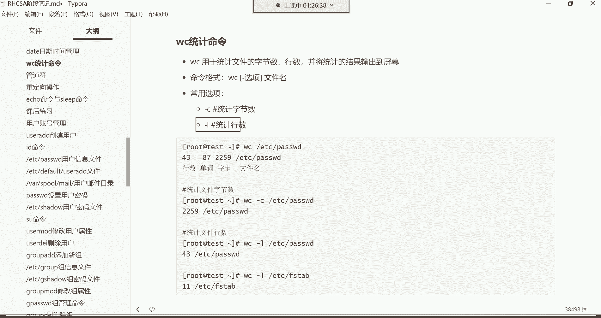

直接把行号啊，行数给他统计出来，就是我想就想看这文件里面总共多少行，那就WC，然后直接杠L跟上etc的pass wd，是不是告诉你这文件总共有43行，是比较好用啊啊非常非常的好用哈。

然后其他的功能也没什么了。

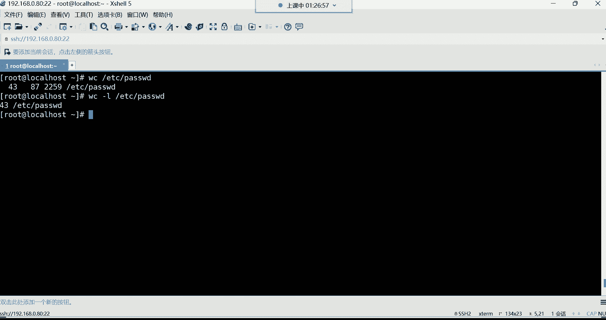

主要就是统计行数的用法的话也非常简单，WC杠杠C的话，统计字节数，这个字结束啊，几乎很少用哈，那字节一个文件里边，你想想谁会闲得无聊去统计他的字节啊，是不是啊，所以知道一下就行哈。

主要还是杠L用的比较多，然后下边再来给大家讲讲这个管道符，管道符这个功能非常强大，强大到什么地步呢，你看它是就一根竖线哈，管道符是一根是一根竖线，所以你可以先找一找，在你键盘上竖线在哪个位置。

哈哈找一找哈，然后或者说怎么怎么怎么把书院给它打出来，自己练一练，功能是将命令的输出结果交给另一条命令。

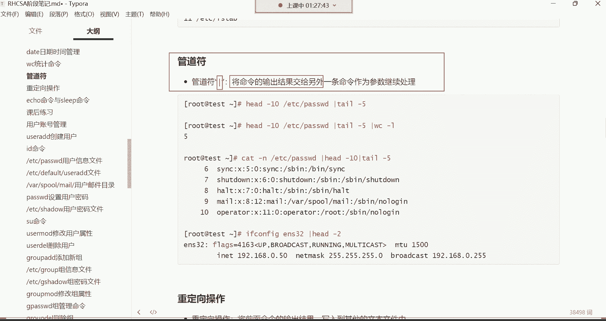

作为参数去处理哇，那这个功能就很强大，比如说啊来看看这里面的例子哈。

我想看一个文件的内容啊，我想看这个pass wd这个文件。

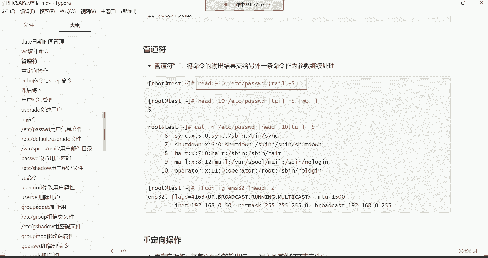

我们可以用这个hand看这个文件，hand啊，我想看就杠十啊，直接看文件的前十行etc的pass wd，但是我现在想干嘛呢，我想看这个文件的前十行的为五行，这总共是文件的前十行吧。

看哈总共前十行我想看为五行，那就从第六行开始，6789十是不是啊，那就其实就是从哪开始呢，1234512345，有时候我想看什么，看这个为五行，这是为五行哈，前边这五行我不想要，那怎么办呢。

那我怎么才能实现这个功能呢，看它前十行的为五行，这功能很难实现，没错吧，因为前面的五行我不想要啊，我不想让它给我显示，那我告诉你管道符这样玩哈，这样玩后面呢来一个管道管道符。

它可以帮你把前边命令的输出结果，你看我们前面命令的输出结果，是不是这个文件的投十行，没错吧，啊是我的输出结果干嘛呢，我再交给管道后边的命令去处理一遍，后边的命令是什么命令都行。

管道它是可以连接不同的命令的，让两个毫无关系的命令发挥出什么呢，不一样的功能，那我现在就可以干嘛，通过ti，然后呢杠五他要杠五不是显示为五行吗，那显示谁的为五行啊，啊是显示前边命令的输出结果的为五行。

那就说他会帮你把前面命令的输出结果，总共不是十行吗，唉它会把十行的末尾的五行给你显示出来，那就说这为五行会给你显示出来，回车看效果哈，回车如果这样看的话，你看是不是就直接内为五行了呀。

前面那五行是不是就没有了啊，所以说这是管道符，那很多人说只能链接两个命令吗，不我还如果你还需要管道的话，在管道给谁的标，我再给管道给WC可以吗，WC杠L回车统计一下是不是五行是五行吗。

哈哈是不是是五行哈啊是五行没什么问题吧，那你说还可以再管道吗，当然可以了呀，如果你有需求的话，你可以继续管道，可以继续管道哈，但是几乎现在没有什么需求了，呵呵没有什么需求了哈啊。

这个管道符呢它可以让你无限管道下去，就只要你有这种需求，可以让你无限管道的，比如cat杠N啊，看etc的pass w d，这是总共把这个文件的内容都给列出来了，是不是啊，而且还给你附带一个行号。

那现在我还需要干嘛呢，管道我要把这个文件的头十行给它显示出来ha，那就杠十，你看那这是不是，就是我已经链接了一个管道了呀，因为最主要前面他有个行号嘛，是不是有个行号告诉你这十行好，那就是我现在要干嘛。

要取十行的为五行，就是6789十，那这时候我说继续管道管道太阳杠五哎，那你看是不是就6789十了呀，好那我现在想统计个数，管道给WC杠L回车五哼，你发现这玩意儿功能是很功能是忒强大了。

是不是它可以让你无限的管道下去，很好玩是吧，你比如说这个if这个if config这个命令明白吧，咱们看es32这块网卡，我想看什么呢，我想看这个网卡的头几行，一二头两行管道给那个汉的杠二。

那这就是什么呢，网卡名是吧，还有网卡IP地址给他，这两行给他显示出来了，其他东西呢就没有了，因为其他东西我现在不想看，是不是可以啊，唉可以很强大哈。

很强大，甘道夫后边我会频繁用到哈，所以现在呢大家先对它有一个概念啊，知知道这个东西怎么用啊，知道它的功能就可以了，然后下面再给大家讲讲这个重定向，这个重定向也是一个非常给力的一个操作，什么叫重定向呢。

就可以帮你将前边的命令的输出结果，给它重定向到一个文件里面去啊，或者说写入到一个文件里面去，这就叫做重定向，啊这个重定向呢是通过一堆符号哈，一堆大于号小于号来帮我们实现这个功能的啊。

来看一下这个一个大于号，它代表叫重定向输出输出，就是把命令的结果给它输出到一个文件里面去，好啊，两个大于号呢也叫做重定向输出，但是呢它具体的区别在后边啊，一个是叫覆盖重定向。

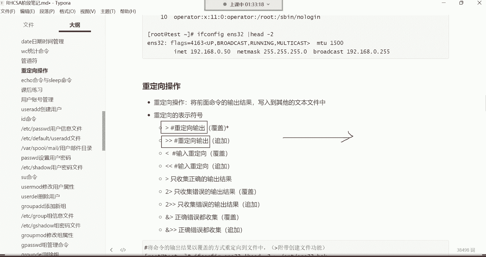

一个叫追加重定向，怎么用这东西来看一下哈，比如说我现在看if configure，我看这个网卡名是不是，然后呢过滤它的头两行，我现在想把这个结果给它保存起来，保存起来怎么办，你可以把这个输出结果给它。

通过这个大于号给它重定向到一个文件里面去，重定到哪个文件呢，比如说随便来一个文件哈，比如这个net，N32，给它重新放到这个文件里面去回车，那你发现我的这个命令的结果，就没有被输出到屏幕，没错吧。

跑哪儿去了呢，跑到文件里面去了，看那个文件里的内容哈，是不是我的这个结果是被我保存到这个，net e n s32这个文件里面去了，啊这net一般就是我们形容是网络的意思哈，网络的意思，看到了吧。

所以这就是重定向，或者说你看我们前面那个操作，你们还记得我们前面只用过一个操作吗，就是那个cat，嗯cat杠N哈，开杠N，啊哪个操作来着，往上翻一翻，翻一翻这个哈，是不是。

我想把这个结果给它保存到一个文件里面去，那这时候你也一样重定向啊，比如说叉叉点TT，回头你发现那这个结果，你就可以从这个文件里面直接看cut叉叉点TT，是不是啊，给你保留下来了。

然后这时候有人就纳了闷了，说哎这文件哪来的呀，这文件压根儿就有吗，没有我告诉你，这文件压根儿他是没有的，所以说这个重定向这种符号，它也具备创建文件的功能，它是可以帮你把一个不存在的文件，给你创建出来。

然后再把这个前面的命令结果呀，给你写入到这个文件里面去，那你说如果文件已经有的话呢，如果已经有的话，他就直接往里面写，知道吧啊那这时候我们说这个一个大于号，它是覆盖，是不是啊，这覆盖是什么意思呢。

覆盖就是如果你再来一遍的话，你看我们现在cat叉叉点了，TT这文件里面现在是有6789十啊，这五行内容吧，我现在比如我free杠H这是看内存的是不是好，我想把我的内存的这个信息给它。

保留到这个叉叉点TT文件里面去，但是原先这个文件里面它是不是有内容啊，有五行内容吧，好了现在我如果再执行这么一个操作，把内存的输出结果给它，再重定向到这个文件里面去，我们看看会有什么效果哈。

TT叉叉点TT，你发现这个文件里面原先的内容没了，原先的原先的内容没了吧，哪儿去了呢，被覆盖了被覆盖了哈，但有的时候我不想覆盖这个文件里的，原有的内容，那怎么办呢。

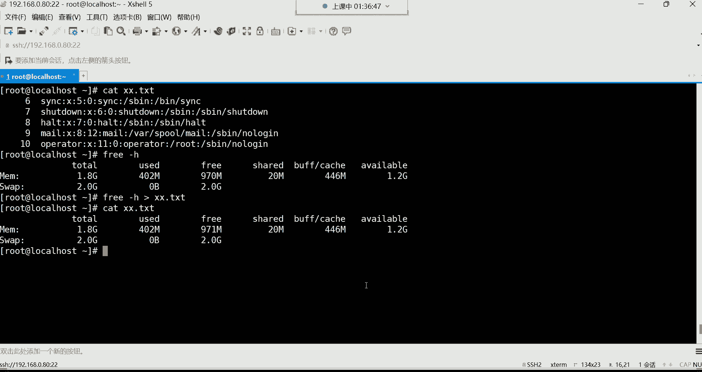

那你就追加两个大于号，这两个大于号它叫追加重定向。

它不会覆盖的，追加是什么意思呢，追加就是把内容给你追加到文件的，现有的内容的行的下边，比如我现在这文，我现在这个文件里面总共有三行内容吧，那我现在在干嘛呢，再这样把这个命令翻过来。

看看这个命令我如果再执行一遍的话，如果但是这边我得加一个，再加一个单号，两个大号，这就是追加，那追加的话你再看这个文件，你看这个文件里面原先的那些数据仍然还在，没错吧，然后下边呢这个6789十。

是不是我们刚刚执行的那个操作呀，是不是后追加进去的吧，哎所以这两个大于号叫追加重定向，它不会把原有的内容给它干嘛呢，给它覆盖掉，OK啊这种叫做重定向输出啊。

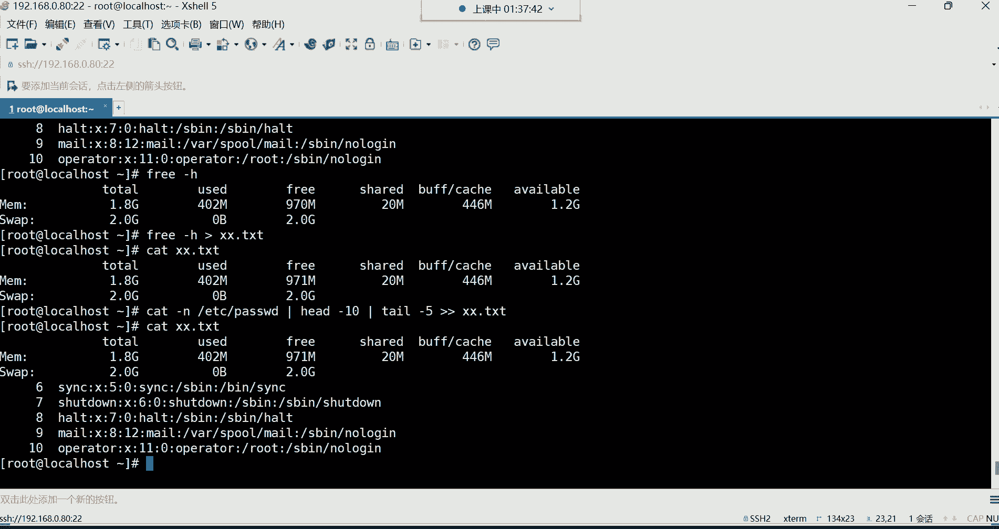

还有这个叫重定向输入啊，重定输入的话，我们现在没有太好的例子给大家讲嗯，重定向书，好确实没有太好的例子哈，啊等后边呢我们有好的例子再给大家讲吧，然后我们再来给大家讲讲这个一个大于号，这一个大于号啊。

其实它是不是叫做重定向输出啊，而且是覆盖重定向吧，那我告诉你啊，他在输出的时候，他不是把命令的结果，给你写入到一个文件里面去嘛，但是它写入的是正确的输出，什么叫正确的输出啊。

比如我现在，写一条命令哈，cat etc下的叉叉OO点TT，我的这条命令其实就是错的，就是错的哈，因为etc下面压根没有这个文件，没有这个文件哈，那现在我如果后面跟上一个大于号的话，比如说ABC点TT。

回车你发现这个命令的输出结果呀，他并没有给我写入到这个文件里面去，为什么，因为这个命令他执行失败了，所以你在cat这个AABC点TT的时候，你发现这个文件里面是空的，所以呢这就叫什么呢。

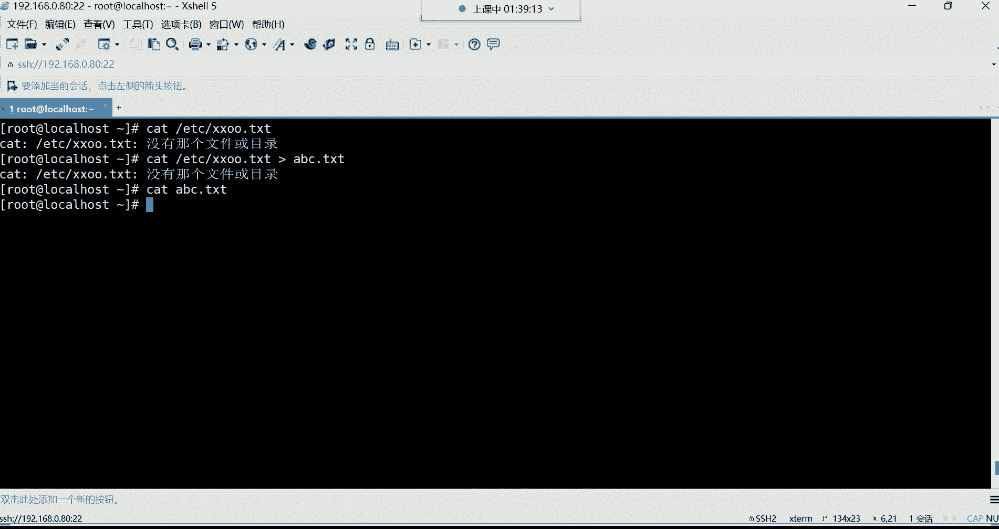

这就叫做只收集正确的输出结果，如果你的命令执行失败了，他不收集。

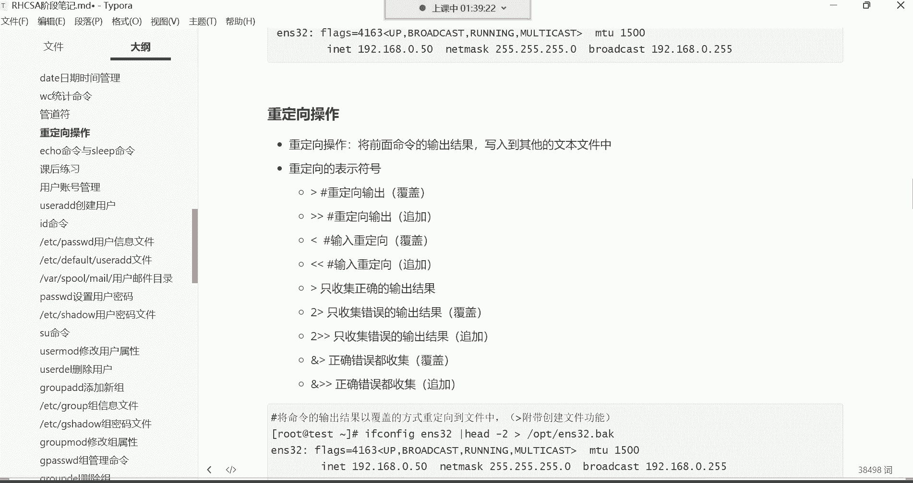

也就是说我们前面执行的这些这些命令，都是执行成功的，所以他能够给你收集起来。

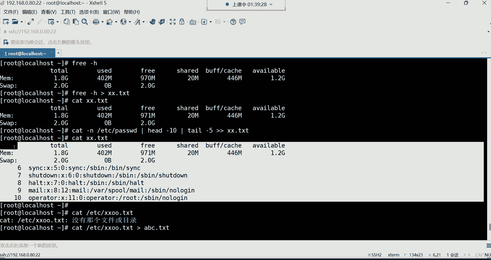

那如果说有你，因为这个命令，有的时候他不一定非得是百分百成功吧，有的命令他就是会执行失败呀，就比如说这个我看这个文件，这个文件压根不存在的话，这命令不执行失败了吗，是不是执行失败的话。

我也想收集它的结果，我想收集它失败的结果怎么办啊，这时候二大于号好，二大于号，这二大于号，你发现这个结果就没有给你输出到屏幕，放到哪儿了呢，给你放到这个文件里面去了，所以你就是看他这个文件，是不是。

这个内容就被我保存到这个文件里面去了，能理解这意思吧，就是二大于号是可以帮我们收集错误的输出的。

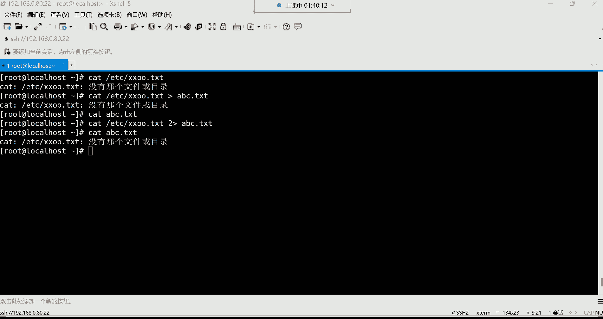

反正都会帮你把这个命令的结果，给它写入到一个文件里面，只不过这一个大于号跟二大于号，他们两个功能还不太一样，所以这个你要搞清搞清楚哈，好那下边呢我们再来给他说这个这二大于号。

它虽然说是可以帮我们收集错误的输出结果，你说这应用场景在哪儿啊。

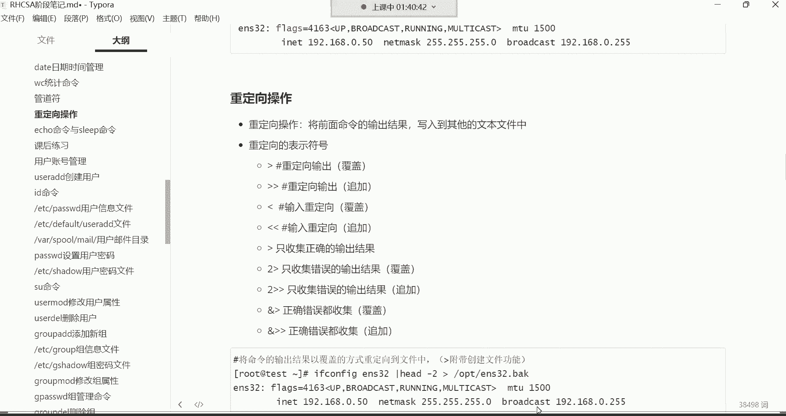

应用场景啊，就比如说我们在后期在学习，这个是有脚本的时候，比如我要测试我的整个集群的网段主机啊。

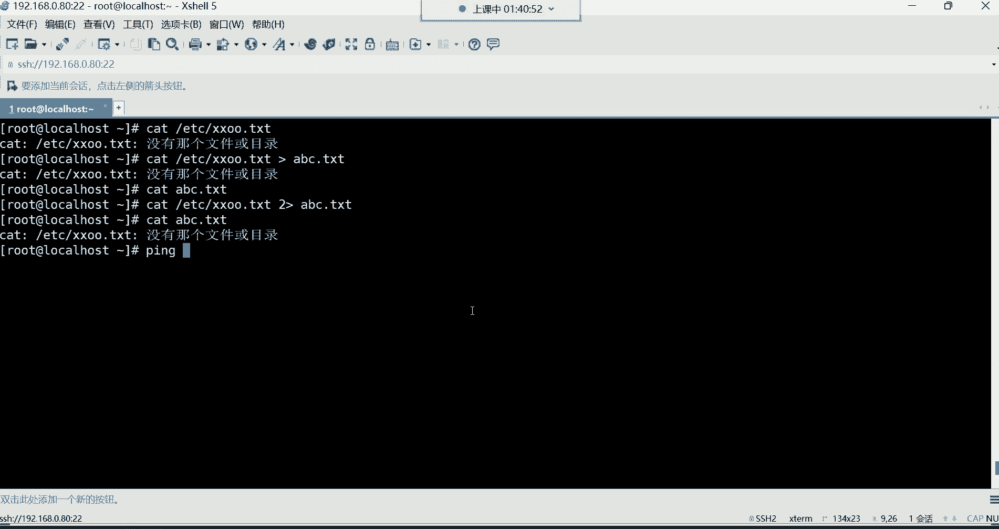

在企业当中，比如说我这个企业的集群集群环境哈，可能会有非常多的机器，那这些机器的话呢，可能说其中某一台机器出现故障了，出现问题了哈，宕机了，某一台，但是由于这个机器太多，我也不知道哪。

我也不知道哪个机器宕机了。

那怎么办，这时候我们得拼啊，这个拼测试啊，测试我们整个网站，看看哪个机器到底是这个开机的状态，哪个机器到底是关机的状态，所以那个时候你在拼一个主机的时候，它会有两个结果拼得通。

比如我拼3W点百度点com的时候，这拼通了，那就我的命令是执行成功的，知道吧，如果拼一个地方它不存在的话，ABC叉叉O点com，你看那这个肯定会失败吧，那失败这个结果是不是就错的，那也就是说在企业当中。

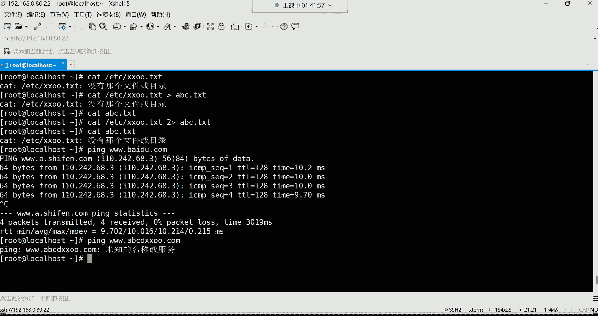

你后期我拼这个主意的时候，如果他拼到这个机器确实是关机状态，那这个结果就是错的，那有的时候，我们是不是就特别希望收集这种错误的输出啊，因为这种错误输出是能够让我们清楚的定位，哪个机器是关机的好。

我希望把这个错误的输出，给我写入到一个文件里面去啊，给我放到一个文件里面去，那这个时候是不是到时候你在拼测的时候，一旦这台机器没拼通，它就会帮你把这个机器的信息给你，写入到这个文件里面去。

那以后你看这个文件不就行了吗，啊你知道啊，这个文件里面记录的就是这个机器的IP地址，他没拼通，它就是关机的状态，它有故障了啊，我说这意思你们能理解吗，啊跟你们讲这个意思，就是说。

你可能说不知道这种收集错误的输出结果的，应用场景在哪，所以我现在给你们描述，就是就这一个应用场景啊，是非常有用的哈，千万不要觉得它没它没有什么用，有的时候我就是要收集错误的输出的能力吧，但这一个大啊。

这二后边跟一个大于号，它是也是属于覆盖，注意啊。

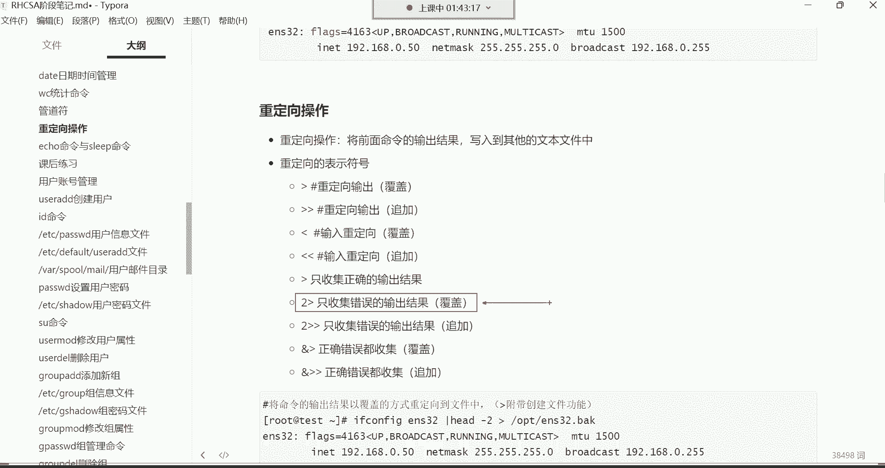

你别看它是收集错误输出，但它也是覆盖，就拿这个结果来说吧，这个结果是不是错误的输出，我再来一遍，二大于号放到那个哪儿，ABC点TT文件里面，你看这个ABC点TT文件里面，原先是有内容的，哪个内容呢。

是这个cat命令的错误输出，是不是啊，这是我再回车，然后你再看这个AABC的TT文件的话，你发现原先这个文件里的内容没了，现在变成拼的错误输出了，是不是啊，那是不是，也就等于把这个文件里的。

原有的数据给覆盖掉了，那我如果我不想覆盖呢，啊俩大于号，再来个大于号，那这时候我们再换一个输出哈，叉叉叉叉叉，啊再看这个文件，那是不是这个LS的这个错误的输出，也被我收集到这个机器里面去了。

所以这个两个大于号前面加一个二，这种叫做什么呢。

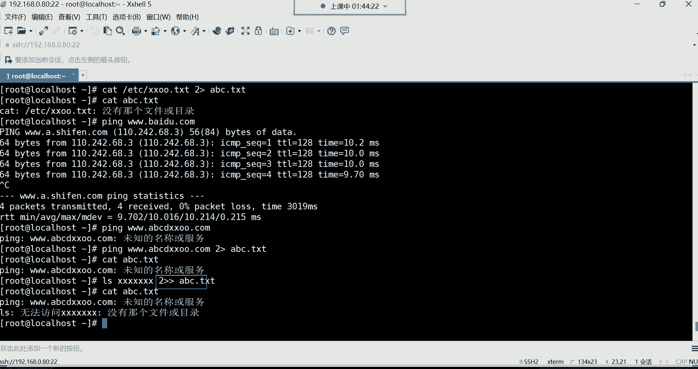

叫追加重定向，但他只收集错误输出，以追加的方式去收集，那如果说我正确的错误都想收益怎么办呢，暗的大于号，暗的大号就是不管你是正确的还是错误的。

我都给你收集，比如我现在这个命令可能会有啊，可能会有这个两个结果啊，比如我看文件吧，cat etc下面比如说看host name这个文件，这条面肯定是对的，是不是啊，那这个CMIN后面可以跟啊。

再来一个不存在的文件，比如ABC一点TT，那你看这条命令肯定是第一个结果是对的，第二个肯定是错的，那如果说我想把正确错误都收集走，那就按的大于号放到哪儿了，放到ABC点TT的文件里面去不掉。

那你看这一条命令是吧，有两个输出结果，一个是正确的，一个是错误的，但是呢我都给他收集走了，看这个文件是不是都给他收集进去了。

但这种方式它也是什么叫覆盖，也是属于覆盖哈，你按到后面跟一个大于号，虽然说是正确错误都收集，但是都是覆盖，会把原先文件里的内容给它覆盖掉，如果说我想追加的话。

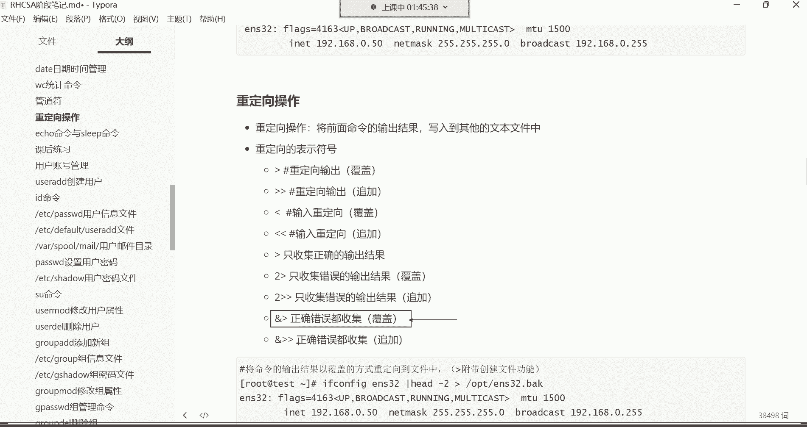

那就还是后面两个大于号，所以这时候你可以比如说现在iOS etc下的pass w d，这肯定是对的，我再来一个阿拉斯，呃EETC加的ABC，这肯定是错的，是不是啊。

所以现在这一条命令a b c pass w d，然后呢我一个两个大于号哈，and两个大于号放到ABC点TT，那这时候你看这个文件它就不会覆盖了哈，原先cat这条命令的输出结果就没有被覆盖。

还在呢是不是就以追加的方式，不管是正确的结果还是错误的结果呢，我都给你追加到这个文件里面去啊。

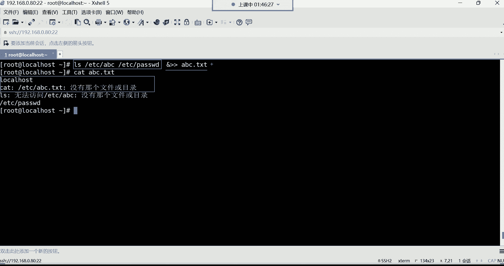

所以它不是覆盖，那这种东西呢我们后边都会用得到哈，啊都会用得到，我给你们讲的这个位置是很重要的，包括前面的管道服，WC统计，管道服务重定向，还有echo与sleep，这个都非常重要的话。

接下来看看echo与sleep啊，echo与sleep这个meaning我告诉你啊，现在是没什么用的哈，我们先说echo用于输出指定的字符串和变量，其实echo呢现在对于我们来讲。

命令格式IO这个呢你后边不要跟什么选项。

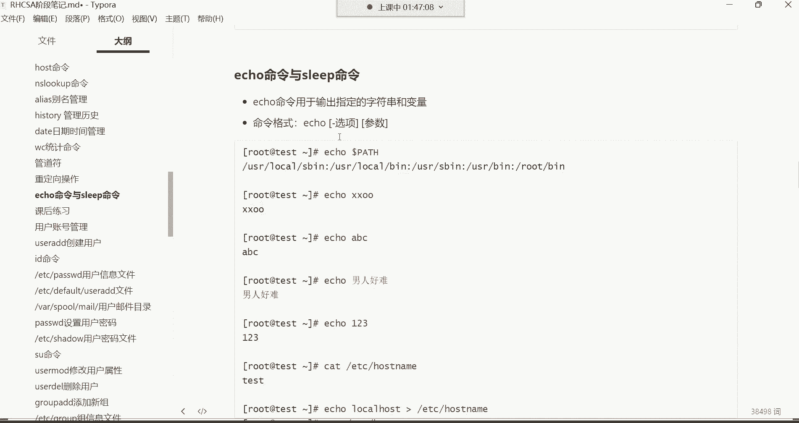

你只需要跟参数就行了，你给我挨过一个什么呢，Hello，echo是输出啊，就你EQ什么他就给你输出什么，看到了吗，你ego hello，他就在屏幕给你输出，Hello。

你说我echo叉叉O他就给你在屏幕输出叉叉O，你echo中文，你说你好，那就给你说出你好，那很多人说了是杜老师，这玩意有什么用啊，你这是不是感觉倍儿无聊啊，你吃饱了撑的吗，这不是。

那现在这种确实是吃饱了撑的哈，大哥，你这个东西后期呢在配合一些符号的时候，比如echo什么的，echo一个hello，然后再结合这个重定向的话，其实就比较好玩了，它可以干嘛呢，你看echo不是输出吗。

你EQ什么，他给你输出什么，但是这个大于号是吧，重定向输出吗，他会帮你把前面的命令结果，给你写入到一个文件里面去，是不是啊，那这时候你后面跟一个文件，比如ABC点TT，我就cat abc点TT。

我发现他就帮我把这个hello，给我输出到这个文件里面去了，所以以后当你需要改一个文件的时候，你比如说哎我希望改个主机名是吧，那我们当前的主机名cat啊。

e t c host name是local host，是不是啊，那这时候你说我想改主页名，其实你都不需要用VM打开这个文件，知道吧，不需要打开，你就直接这样echo主机名，比如说太子的。

然后呢放到哪儿呢，通过一个大于号在这哈，通过一个大于号给他放到主机名，那个文件里面去回车，你再看这个文件，你发现是不是就是你挨过什么，他就把这个信息给你写入到这个文件里面去啊。

啊所以这种方式呢也可以也可以，啊这一个大于号啊，这一个一个大于号还是覆盖啊，啊是清空哈，如果你这样，如果你前面什么都没跟，那就空的吗，是不是你看ABC点TT，看ABC的TT没了，为什么呀。

因为这就等于说你是等于echo空格，你知道吗，你这不是有个空格吗，然后大于号，就等于说，你是把这一个空格给它，输出到一个文件里面去了，嗯有清空的意思哈。

好这是echo，现在没什么用啊，还有一个没用的，meaning的叫sleep，sleep也没什么用，sleep命令是可以用来，将目前的动作延迟一段时间，命令格式sleep后面跟时间就行了。

他这个时间S代表是秒，M代表10分钟，H1小时。

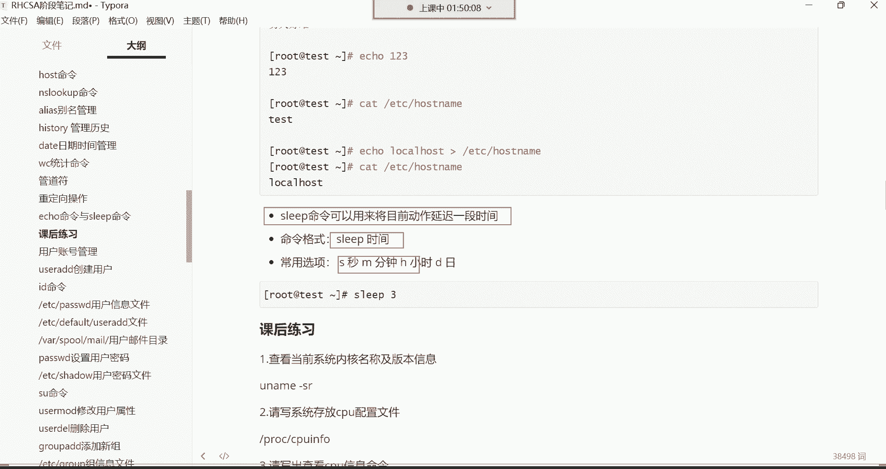

第二天你可以这样玩sleep，比如说五回车，你看我们当前的终端就会休眠五秒钟，你看啊，再来一遍sleep5回车默认就是秒哈，你看我当前终端停留了五秒才出来，是不是啊，干嘛呢，休眠了五秒钟。

如果你这样sleep5M那它会休眠5分钟，我这个中端得等5分钟以后才能出来哈，系统在休眠哈，CTRLC给它取消掉哈，那如果你这样，你说我5H，那我我当前的终端会休眠五个小时，嗯那如果你后面是5D。

那你我当前的终端会修修，会休眠五天，终端才会弹出来，哼那很多人说老师你这玩意啥啥用啊。

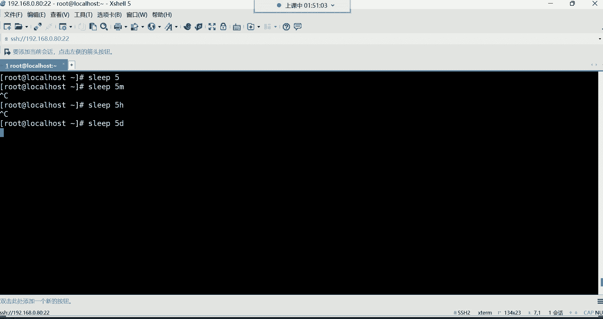

是用在哪儿啊，你这玩意儿啊，完了你现在是现在是没啥用哈。

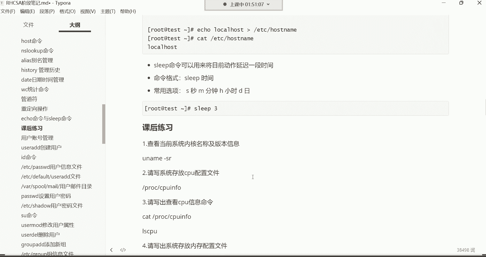

但后期呢在写脚本的时候会用得到哈，我会后期会学习一个叫做shell脚本的东西啊，那个时候我们会用到这个sleep啊，它可以让我们的CPU注意啊，sleep就是主要是让我们的CPU别太忙。

因为CPU处理数据的时候特别特别的快，你知道吗，所以CPU太快的时候CPU会发热，所以你让CPU就可以起呃，让他干嘛休眠一下，你比如我这样sleep，0。1啊，0。1就是休眠0。1秒，这0。

1秒对于CPU来讲，啊是可以说是会起很大的作用的哈，对我们来讲可能没什么用，那后期对CPU来讲是非常有用的，我给你们演示一下哈，你看看我现在是在屏幕用echo一直输出hello，但你看他是一直输出哈。

你看速度非常快，看到吗，速度非常快，已经上去了，看到了吗，非常快哈啊，这时候呢我们可以干嘛呢。

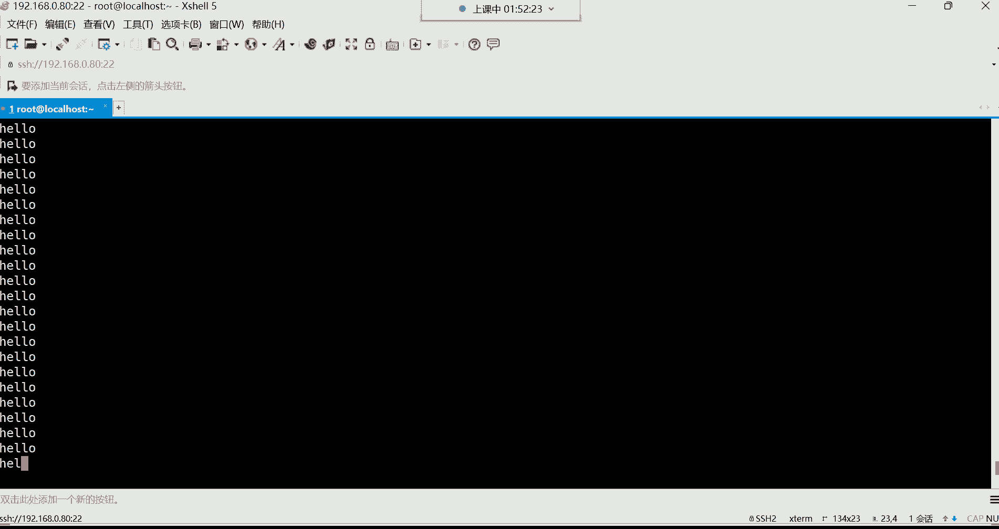

从这边从图形化界面里边进去。

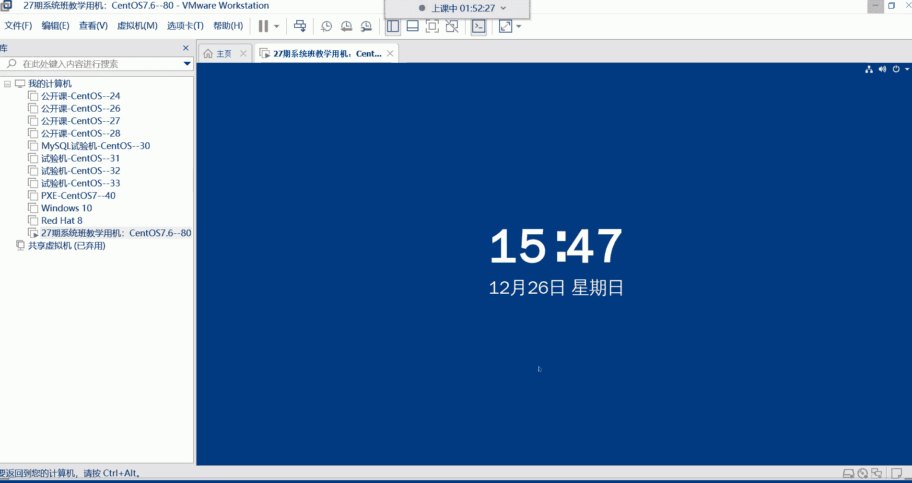

选择这个位列出登录一下哈，位列处，root密码，登录进去以后，我们可以看当前的CPU的一个什么呢，一个负载量，有些慢哈，先慢，哇这也太慢了，哇不是吧。

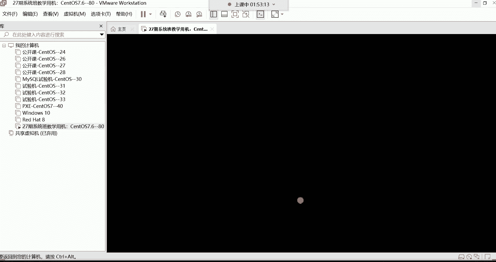

这图形界面都加载不出来，你们看到了吗，CPU太忙了，现在哇都卡成这样了。

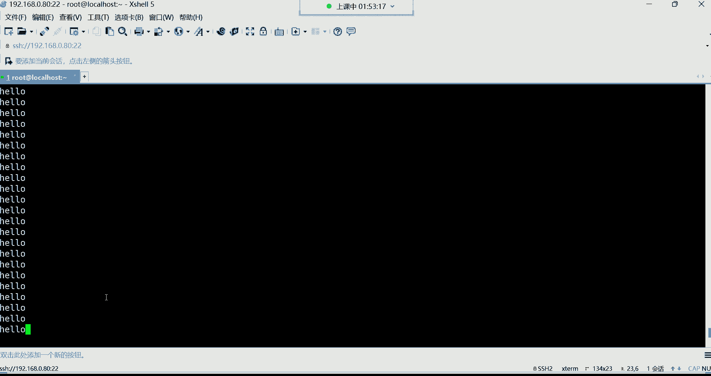

卡成这C，我先取消掉哈，一会儿给你们演示一下，因为这个CCPU太猛了。

处理不过来，然后按你键盘的文件，按文件啊，应用程序，然后这里面有工具，在工具里面有个叫系统监视器，点一下，这其实就是windows的资源管理器，然后看资源好，就是看资源是吧。

我们现在呢在这边我在执行刚刚那个命令啊，一直输出，hello啊。

这边我如果说看资源的话，你看这CPU这个线哈，这CPU看到了吗，CPU现在已经飙到百分百了，你看到了吗，已经飙到百分百了，是不是这线是不是在百分百的位置。

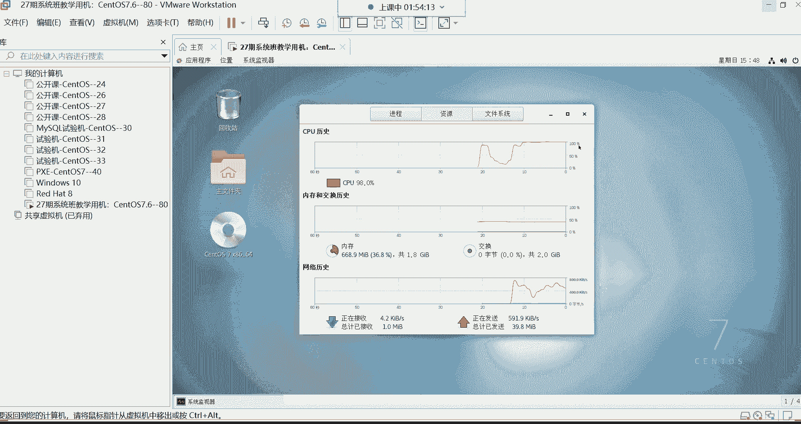

应该应该能看清，是不是在这哈，那CPU你看这太忙了，现在呵呵特别特别忙，而sleep可以帮我做什么事情呢，the sleep可以让你的CPU啊，就是在特别忙的情况下休眠一下啊，在在这sleep0。

1回车，这样不行，你看看这时候速度。

你发现它它明显变慢了，是不是啊，你看是不是明显变慢了哈哈明显变慢了哈。

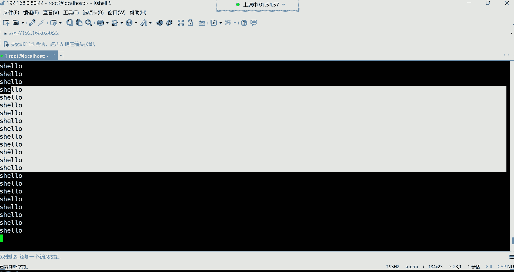

为什么呢，就是因为CPU他会休息0。1秒啊，每次处理这个数据的时候，他都会休息0。1秒，那个0。1秒，你说对我们人来讲可能感觉没什么好，到了你对CPU来讲，一会儿这线就下来了，你看线下来了哈，看到了吗。

哼是不是不是明显能够感受得到啊，Sleep，你发现它能够让CPU啊这么神奇吗，当然这么神奇了，你看下就下来了哈，有点意思是吧，是不是啊，你看线下来了，不忙了，就没有那么忙了，不能说不忙就没有那么忙了。

这就是sleep这个命令，你看这时候速度，你明显都感觉它速度明显都变慢了吗，是不是你看速度哼是不是有点意思。

是吧啊，确实有点意思啊，所以有的时候你发现这种没用的命令，它往往它能够起到一些很神奇的功能，有这么妙吗，确实哈，Ok，行啊，我们要不要休息一下，多长时间了，这才30分钟了，那继续讲哈，呃那我得什么呢。

嗯把这个录屏听一下。