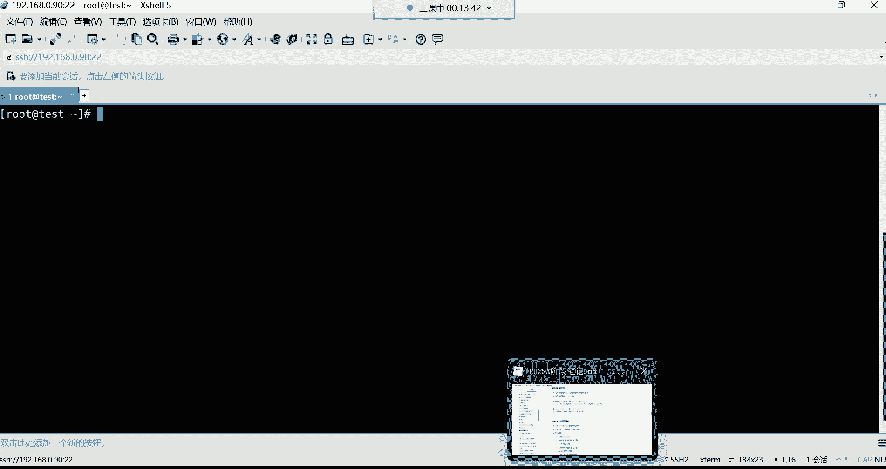
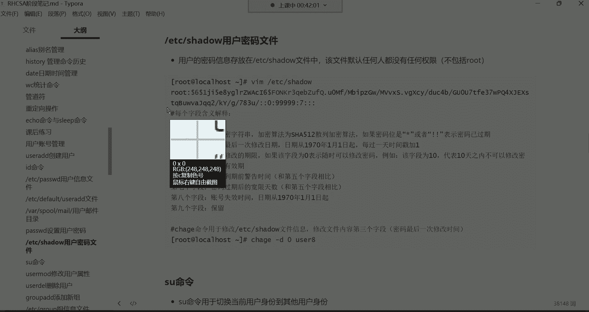
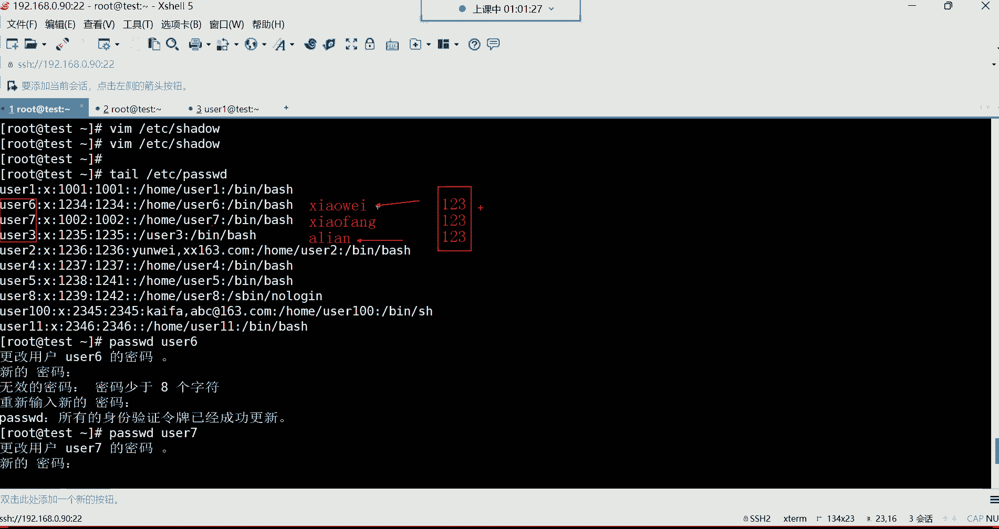

# Linux最全RHCSA+RHCE培训教程合集，小白入门必备！ - P16：红帽RHCSA-16.passwd用户密码设置、密码文件详解 - -Book思议8 - BV1ZV4y1v7c8

啊我们接下来呢还是按照上节课的内容，继续往下讲哈，我们上节课是讲到了哪里呢，我们上节课是讲到了一些，就是我们平时用的不是很多的一些命令，然后呢讲完之后呢，我们就给大家讲解了这个用户的管理呃。

用户管理的话呢。

这里面主要是讲解如何去创建系统里面的用户，没错，然后我们先连到我们这个机器上面哈。

已经连上来了，凉了之后呢，我们上节课我们讲了哪些呢。

我们是不是上节课给大家讲了UI的这条命令了，然后呢又给大家讲了什么呢，又给大家讲了这个他的一些常用的选项，以及这个配置文件啊，是给大家讲的，etc pass wd这个配置文件的详细内容了。

我们都给大家讲了，然后呢哪里没有讲呢，就这个位置没有讲，就是像啊差点忘了上课是吧啊，没关系哈，嗯然后这两个呢给大家说一说哈，就是etc default uzi的这个文件，这是我们上节课并没有讲到的内容。

然后呢咱们就是直接从这儿讲哈，但前面的内容呢都是相对比较简单，创建用户嘛是吧，UZI的DT命令，然后呢如果有一些特殊的需求，大家可以结合它常用的选项去使用就可以了，然后对于这个文件的话呢。

我们简单给大家来复习一遍哈，复一遍这个etc下载，pass wd文件是存放用户基本信息的，这也是我们系统里面非常重要的一个文件，然后我们的用户呢，它的基本信息都在这个文件里面放着。

这个文件呢是每个字段都有一定的含义，如果我们拿这个文件里面的root这个行，来给大家来讲解的话，那就第一个字就代表是用户名字了，就是这个用户叫什么名字叫root，然后第二个字段呢叫做密码占位符。

这个密码占位符没有什么特殊的含义哈，主要就是一个密码标识符而已，永远都是X第三个字段，这个叫用户的UID，这个UID呢就是我们系统当中每一个什么呢，账号的id号就像我们每个人的身份证号一样。

SINA命令跟弯图通用吗，不通用啊，不通用啊，但这个基本命令是通用的，但它会有略微的区别，OKUID就是每个账号的一个什么呢，一个身份证号，然后UID为零呢，是我们系统里面的超级用户。

这个UID呢如果是从1~999的，是系统里的伪用户，主要就是不能登录系统，给我们系统里的程序提供，怎么说呢，运行的一个身份，然后还有UID是1000往上的，都是管理员啊，大多数都是管理员创建的用户啊。

这是UID，然后第四个字段，第四段叫做用户的基本组的id，就是每个用户的初始组，还有个id号也都是在这个什么呢，在UID的右边跟UID啊相同好，然后用户的描述信息，这个呢上面给大家讲的是。

其实就是一个用户的备注而已，没错吧，然后我们可以手动去改它，然后用户的家目录加目录的话呢，就是这个每个账号他属于自己的目录，我们称之为叫加目录，在系统哪个位置都在这个文件里面，给它记录着呢。

还有用户的解释器好，OK这是对于这个文件的每个字段的一个含义，解释，然后下面呢我们来说一说哈，这个USI的default这个文件。

啊出去玩玩有学习快乐吗，玩怎么可能有学习快乐，是不是啊，咱们说说这个etc下边，来说这个文件哈，etc default ui的这个文件，这个文件呢叫做存放用户默认值的一个信息，文件啊，我们前面啊。

你看创建了很多用户，咱们打开etc下的pass drop d的文件，看到了吗，是不是这些用户的信息都在这个里边呢啊，然后呢，如果说我们在创建用户的时候，我们直接这样USI的。

我们指定一个user11什么都没有指，就指定一个用户名了，其他都没纸，是不是好，那这个时候呃跟这个用户相关的什么，比如说我们来再打开那个文件，再打开这个文件，打开以后呢，你看跟这个用户相关的。

比如说他的什么加目录啊，还有它的解释器啊，这些为什么默认会系统给他分配到home下边，或者说解释器，为什么是默认它带着这个解释器呢，就是因为啊，这个文件它决定着这个用户的一些默认值。

就是我们在建用户的时候啊，在最早期的时候，LINUX这个系统啊，它是分为什么呢，分为这个两种模式，第一种叫做公有模式，第二种叫做私有模式啊，但是现在没有了，现在都是属于私有模式啊，在以前的公用模式下边。

这个系统呢就是我们在创建一个账号，比如说我建立一个一一个UC1，那这个U色一啊，它的这个组注意哈，我们来退出，说一下它的这个组哈，我们id u41这个用户，它的组默认是不是，系统给他分配一个同名的组啊。

然后组i id呢跟UID默认也是相同的呀，在早期不是在早期呢，系统会把这个用户的基本组，给它分配成那个id号为100的，作为这个用户的一个初始组，或者说默认组啊，但早期公有模式下，现在都是私有模式了。

所以说这个大家就了解一下就行了，这个配置已经失效了，好然后第二行第二行home等于home，这是用户的家目录，那这个呢就是我们在创建用户的时候，为什么系统会把每个用户的加给他。

分配到根下的home下面呢，那是因为这个文件里面指定了，就是用户的家目录，默认就在跟一下的home下边存放着啊，所以说我这个后门目录，就是给所有的普通用户准备的一个什么呢，存放加目录的地方看到了吗。

都在这个里面哈，用户的加，然后当然这些东西没有需要你去任何，没有需要你做任何改动的话，你只需要了解就行，其实你不了解的话，也不会影响你对这个系统的一个任何使用，所以这种东西只需要了解。

不需要你花精力去背它哈，你只需要知道，那这两行呢是跟密码相关的，那我们现在还没有讲密码，所以咱们先不用去管的哈，我们先做再说，这个shell shell的话呢，大家可以看一下。

等于been下的batch，就是说为什么每个用户的解释器都是并行的，BH那个解释器默认情况下哈，为什么都是BB，那是因为这个文件里面就指定了，每个用户默认使用的解释器。

所以说呢系统才会给它分配这个解释器，还有这个模板目录，etc s k e l啊，这个呢我们就没有什么太多可啰嗦的了哈，这就不说了，然后是否建立邮箱，这个呢我呃我记得我们前面好像讲过呀，在哪儿呢。

嗯是不是讲过呀。

对今天讲用户管理哈，在这个位置在vs sport mail这个目录下边。

在这个目录下边存放的是什么呢，我们来看一下哈，我们打开这个目录，在腕下的sport下边有一个mail，这个目录里面存放的是，每个用户的收邮件的地方，就是每个账号都可以去接收邮件，去发送邮件。

那他的邮件在哪呢啊，你看比如说UC1它的收邮件的文件就在这，就是它的邮件内容就会存放在这个文件里面，到时候UC1想看自己的文件，有一条命令叫mail回车啊，但是没有找没有找到这条命令是吧啊。

可以使用这条命令去查看邮件啊，当然没有人给他发邮件，所以说呢这时他看也看不到，但是也没有这条命令，是不是没关系啊，我前面给大家讲过一条命令叫做em，啊privis private呢。

后面跟上一个什么ml，就是我想使用这条命令，但是没有这条命令，我可以搜索一下，看看这条命令是怎么来的，啊报错了啊，大家可以看到我这个报错了，我这个嗯我看一眼哈，我这个机器好像是无法访问外网了，我看一下。

我拼一下3W点，百度点com啊，能拼通，能拼通的话，Host，嗯渗透S点OORD，啊对NAT模式哈，at模式，好也能拼通，也也能拼通，这些命令这些命令应该都不陌生吧，前面是不是都讲过呀。

还有一些快捷操作是不是都不陌生，我刚刚那个快捷操作是不是CTRLW是不是CTRLW啊，嗯CTRLW哈，就删除一个单词，没网是吧，然后host host干什么用来着，就是解析一个域名的对应IP啊。

这些都讲过哈，OKSTOS那个圣托斯OG是圣托S的官方网站，这个这是一个地址，host面前面上面不是讲过了吗，解析一个域名的IP的，然后呢我现在我再用一下em，我再测试一下哈，因为刚刚显示没有连上啊。

这时候好像可以了，这时候可以了哈，刚刚网络问题，嗯有些慢叹号是干啥的是吧，叹号就是后面跟上一个字符串，可以帮我们去调取历史命令中，我最近执行过的这个亚目命令，哈哈是这个意思哈对。

就是我曾经执行过这个亚目，但是呢我用叹号的话呢，后面跟个亚目这个关键字啊，他就帮我重复去调取了啊，没有哈，没有这个没有收到没有收到，其实就是这包我跟你们讲啊，其实其实就是这个包哈，叫mail后面多个X。

咱们这样虽然说没有学习软件包管理，但是咱们先用一用YM杠y install，把这个包给它安装上，叫mail后面多个X到了吗，回车嗯，dog s翻车了是吧，这么喜欢看我翻车是吧。

好安装好了是吧嗯安装好了之后呢，安装好了之后，我们就直接这样敲mail回车啊，mail多少一个L回车啊，这样就是看我们的邮件哈，看邮件，当然你发现他说这个NO male for root，就是root。

没有邮件，没有邮件哈，要么是不是安装什么都都能安装呃，只要是舱，只要是我们后面讲软件包管理的时候，我再给你们讲这些东西吧，你先你先不用去理会哈，先不用去理会这些东西啊，这查看邮件如何查看自己的邮件内容。

OK就知道一下就行好了。

那下面呢我们开始讲密码啊，就是给用户设置密码，我们前面呢给大家讲用户管理的时候，并没有给大家讲如何去设置用户的密码，而你如果说不设置密码的。

那这些账号他也没有办法登录系统，我们前面创建了非常多的账号是吧，我们用tail，然后呢直接看etc下的pass w d，看那个文件的最后十行尾十行，这都是说我们自己手动建的用户是吧。

从UC一一直这么多啊，都是我们自己建的，但是呢这些用户呢他们无法登录系统，无法登录系统的话，那你把这个账号发给别人，别人说你可以使用UC1这个账号去登录系统，但是它没有密码，没有密码也不行。

所以接下来呢给大家设置密码，那设置密码呢我们用的命令是这个pass wd啊。

全名叫password，那这条命令的话呢是用于设置用户的密码的，命令格式也非常的简单。

咱们来说说他命令格式哈。

它的命令格式啊，呃你们来看一下，非常非常的简单哦，放这吧哈，放这pass，后边呢你看这条命令，你后边可以什么都不加，也不用加选项，也不用加用户名，你可以直接用回车，你看如果直接用的话，它是改谁的密码呢。

如果你要是直接用了，它就是改root自己的密码能列吧，那改自己的密码，那也就是说如果你想修改自己的密码的话呢，那你就对当前用户啊，你用谁登录的就改谁的密码，所以这时候呢你就输入密码就可以了。

比如输入一个多少呢，一回车，然后他说这是一个无效的密码，密码是一个回文，哈哈什么叫回文呢，这其实这个所谓的回文，就是不符合他的一个密码的一个规范，没关系啊，再重新输入一遍新的密码就可以了，一回车。

OK这时候呢他告诉你了，说所有的身份验证令牌已经成功的更新了，看到了吧啊已经成功更新了吧，好那这个对于设置密码来讲呢，啊这是给自己设置密码，就是你用谁登录的，然后呢你就直接敲这条命令就可以了。

那如果说我想给别的用户设置密码呢，比如我们我要给user1设置密码，那我就这样pass wd，然后呢这样哈给UC1，那后面你得跟上用户名了哈，对你得跟上用户名UC1回车，这时候呢就是更改U41的密码了。

那这个时候呢我们给他设置密码，比如说我也给它设置一个比较简单的一回车，然后一回车你看他也是说什么是一个回文，是不是啊啊，然后呢我们又重新输入一遍，没关系哈，这个密码也设置成功了，这是设置密码。

那这时候呢我们在再开一个终端，我们再开一个终端，再用U41登录，还是同一个机器哈九零，然后呢我们输入用户名是user1，这个不就是普通用户了吗，然后我们的输入确定点确定啊，密码一，然后确定在这好。

那大家可以看一下啊，我清个屏，那这时U41是不是就登录到系统上面来了呀，没错哈，有了密码它就可以登录好，那这是我们所说的这个密码的设置比较简单吧，想给自己设置密码呢，就直接敲啊，因为你用谁登录的。

你就是给当前用户设置密码，那右边这个终端，比如UC1，我也想改自己的密码，可不可以啊，可以啊，他也可以改自己的密码，就普通用户也可以使用这条命令，改自己的密码回车，你看这时候呢他就可以改了。

更改自己的密码，但是呢作为一个普通用户啊，他如果想改自己的密码，这时候他在干嘛呢，嗯对他只能改自己的哈，因为普通用户嘛，那他没有权限改别人的密码，然后他得需要知道自己当前的密码。

对知道自己当前的那当前密码是一，然后回车，那这时候呢他才能输入新的密码，比如说新的密码我们改成一个什么呢，比如123456啊，我已经输入完了哈，这密码就是不显示的，注意哈，我们在这个位置输入密码。

它是不显示的，因为它为了什么呢，为了保证你的密码的安全度，所以是不显示的，然后回车，这时候呢他又提示了说你这个密码啊，无效密码少于八个字符，看到了吧，就是密码长度不够哈，嗯不够，那这时候呢我们再来一遍。

可不可以，我们再确认一遍，像root一样，你看root它也提示了说你这是一个无效的密码，什么密码是一个回文，是不是，而让你重新输入一遍，那root重新输入一遍以后。

你发现root就可以就能够把密码给它修改成功，那这些用户呢我们再来一遍，123456，我已经输入完了哈，我再回车回车，诶，你发现怎么说还是不行啊，还是少于八个字符是吧，哎我们再来一遍，123456回车。

好大家看一下，他说什么已超出服务器重视的最多次数了，你看到了吗，是不是发现像这种情况的话，是什么情况呢，就是普通用户啊，它不能像root一样，虽然说你说我改的，我说我设置的密码呢不符合你的规范。

但是呢我只要再确认一遍，你也拦不住，我能列吧，那root牛逼没错，而这个普通用户来讲呢，它是不行的，这个普通用户啊，你要知道哎哟他在改一个密码的时候，你首先他得知道自己当前的密码。

就输入当前密码以后才能去输入新的密码，而且他在改新密码的时候，这对密码规范大家可以看一下，第一呢长度不能少于八个字符，因为我们输的密码是多少呢，我们输的是这个123456，是不符合他的这个规范的。

而复杂度的话呢，大家也可以能够看得到，就是他得要求你这个密码里面有数字，还有字母，而且字母还区分大小写，就是有大写还有小写，而且还要有一些特殊字符在里边，你这个密码才属于它的一个什么密码规范，能理解吧。

那你比如我现在我再设置一个密码，比如说我这个长度如果符合他的条件，你看我回车旧密码一，新密码12345678回车，你看这时候他还是提示说什么无线的密码，他说你这个太简单了，太系统了啊，密码太太简单了哈。

然后再重新来一遍呢，12345678仍然不行，你看到了吗，然后你再来一遍，12345678，这就完了，超过三四看到了吗，就不让你设置了哈，所以说呢我们对于这个普通用户来讲，他想设置自己的密码。

一定要遵循这个密码规范的，所以这时候咱们给他来一个比较复杂的密码，什么密码呢，我们来一个哈，回车旧密码一，新密码123，然后呢ABCD点儿点儿点儿大写的X回车，唉，你看这个时候他就并没有提示。

说什么无效的了吧，让我们再重新输入一遍吧，好再来哈，1234ABCD点儿点儿点儿唉，哟我好像说错了，点点大小X面不匹配是吧，再来一遍哈，1234ABCD点儿点儿点儿大写的X走，你再来一遍哈，1234。

然后ABCD点儿点儿点儿大写的X好了，这密码设置成功了哈，你看我这密码设置的时候非非常复杂呀，很很复杂吧，1234ABCD点儿点儿点儿大写的X，这密码里面就有什么有数字，没错吧，是不是1234是数字啊。

满足他的条件了吧，嗯符合他条件还有什么呀，是不是还有字母啊，那你看我这个字母是不是ABCD就是字母啊，是不是啊，唉ABCD是字母，然后呢还要有特殊字符吧，这特殊字符三个点其实就是特殊字符。

这属于特殊字符哈，然后还有什么呢，还有这个X大写的，X大写S就是在英文字母里面呢，就是既有小写，还有大写，这样就满足他的条件了，哎呦你看这密码复杂度是吧，其实在我们这个学习计算机的时候，就大部分的密码。

它的复杂度其实都是这样一个等级，都是这样一个等级哈，就是有数字，有字母，而且字母里面要大写，还有小写，而且呢还有一些特殊字符，长度不能少于八位，所以大多数都是这个密码规范，包括后期你们学习数据库的时候。

学习数据库的时候，数据库的密码规范也是遵循这个规范能理解吧，OK所以这样他们才能够把这个密码修改成功，还有这个密码规范里边另外一个，那你本次修改的密码不能跟上次的密码太相近。

比如说我咱们上次是1234ABCD是吧，这密码大家可以看一下是不是1234ABCD，点点点大写的X，那如果我现在再改改个密码，我改多少呢，我比如说我改了改成4321，然后呢ABCD点点点大写的X。

这个是不是就把这个1234给它调过来了呀，那咱们看看可不可以哈，咱们再来一遍啊，pass wd旧密码1234，然后呢ABCD点儿点儿点儿大写X，新密码我改成4321，然后呢ABCD点儿点儿点儿大写X。

你们看他怎么提示的，他是不是直接提示说，你的密码与原来的太相似了呀，没错吧，哈哈这个就不让你改了哈，不让你改看到吗，因为太相似了哈，这是第二个密码的规范，所以大家在设置密码的时候呢。

也一定要注意这个密码的规范哈，然后再来给大家说一下，我我看你们刚刚有人说这个密码如果记不住，是不是太复杂，记不住记不住的话呢，怎么说呢，你可以重置一下，但是这个重置得让root重置。

对这个root他在给任何一个用户，包括给自己改密码的时候，你们看一下它的特点哈，回车你看root他就是给自己改密码的时候，他都不需要知道自己的原来的密码是多少，直接就输入新的密码，看到了吗。

这叫新的密码哈，不需要输入旧密码的，而而改别的用户也一样，比如说他要改UC1的密码回车，他也不需要知道UC1的原型的密码是多少，直接给他改就行了，一回车一看到了吧，就改成功了，是不是，所以说啊。

如果说你这个这些用户的密码忘了之后呢，也没有关系啊，root呢直接给你重置就行了啊，给你重置哈，能查历史密码吗，呃这密这密码没有历史，没有密码没有历史哈，嗯哼，好这就是设置密码，这个大家注意一下哈。

而这些普通用户呢，我们拿UC1来说，比如说这个U41，他想给别的用户改密码，比如我想给谁呢，我想给U42改密码，你们看一下哈，UC1他想使用pass wd命令，想给U2改密码回车，这时候就直接提示了。

说什么呢，唉说只有跟用户才能指定用户名，也就是说只有root才能够在这条命令后边，跟上用户名，能理解吧，也就是说这条命令也只有root用户，才可以给别的账号去改密码。

那你这些普通用户在使用这条命令的时候，后边是不能跟任何东西的，如果跟的话不允许啊，也就是说不不能让你去改别人的密码好啊，能查USG的密码可以查查是可以查的啊，查查查可以，但是呢查的话你看不到他的密码的。

因为对于pass wt这个命令有一个杠S选项，杠S杠S可以看，你看到了吗，这有个杠S叫查看密码信息的这个选项，这时候呢我们可以这样。

你这样你杠大S大SUC回车看到了吗，这就是看UC1，这时候你可以看到它的一些密码，告诉你密码已经设置了，看到了吗，然后并且呢什么加密算法，哎呦这个有些复杂了是吧，加密算法以及前面这些东西。

这个用户名设置密码的时间，哎呦这个都代表什么意思啊，这个呢我们得什么呢。

得给大家说说这个密码相关的文件，我们改完密码以后啊，这个密码存放存放在一个文件里面，这个叫etc shadow叫用户密码文件，在这个文件里面呢是用户的密码信息，存放在这个etc shadow文件里面。

这个文件的特点，任何人都没有任何的权限去看。

当然哈，当然比如说右侧一，我想打开这个etc etc shadow这个文件回车，你看权限不够，为什么呢，因为对于这个文件来讲，它的权限大家可以看一下，我们LLOL看etc shadow，你看到了吗。

他这个文件的权限，几乎就是任何人都没有任何权限的，包括root也一样，root也没有任何权限，你想看的话也没有权限，但是没关系啊，root来讲，他想打开这个文件，这是也是允许的啊，没有任何问题哈。

没有什么问题啊，我这个咱们就来说一下这个文件。

这个文件它跟这个etc shadow，这个文件跟etc pass wd这个文件，那一个是叫用户信息文件，一个是用户的密码文件，这两个文件都是息息相关的哈，就是你这个文件里面是存放用户的基本信息的。

这个文件里面是存放每个用户的密码信息的，能理解吧，所以这两个文件都是息息相关的。

好这是etc shadow，然后呢我们打开以后呢，咱们来看一看这个文件里的内容，针对这个文件啊，大家看一眼呢也是感觉这个眼花缭乱的是吧。

呃这个文件也非常的有规律，我们前面在解读etc pass wd这个文件的时候，是不是每个这个文件里面，每一行总共有七个字段啊。

以冒号的最风格吧，好咱们我再复制一个终端哈，右击复制，这样是复制一个什么呢，就是一模一样的终端出来，看到了吗，也是root，也是root哈，就是我现在想用两个终端来什么呢，来管理这个系统也是可以的哈。

然后就像在叉烧里面可以右击复制，就一个一模一样的终端就出来了，好那这时候呢我们在干嘛呢，我们再打开etc下的pass w d文件，这给大家打开，然后呢咱们再回顾一下这个文件，这个文件是不是每一行。

每一行都代表一个用户的信息啊，把行号打开，每一行代表一个用户信息，你想看你文件里面有多少有多少个用户，那是不是就看这个文件里面有多少行就可以了，那我告诉你这个文件里面有，这个文件里面有多少个用户。

那你这个密码文件里面也是有多少个用户，放到最后29看到了吗，是不是29行，这里面也一样是吧，29行，OK然后每一行代表一个用户的信息，没错吧，然后呢这个文件的特点是以冒号作为分隔。

然后呢每一个字段都有自己的含义，这个文件里面总共是七个字段是吧，那这个密码文件呢，它也是每一行都代表一个用户的密码信息，知道吧，那这每一行也是以冒号作为分隔的，注意哈，也是以冒号作为分隔哈。

那这里边可不是七个字段了，这里边是九个字段，这里面总共是九个字段，知道吧，这文件怎么有颜色是吧啊，这是我们VIMVIM哈，它自带颜色的，因为VM是适合编程的一个什么呢，一个编辑器。

所以你用它打开一些文件的时候，他会给你显示一些颜色啊，但如果你换做vi的话，就不会有颜色的哈，这个用vi没有颜色，OK那九个字段，那九个字段我们怎么去解读呢，所以这是我们今天要对这个文件要详细。

这个讲的一个重点嗯，看冒号几个字段比冒号多一个是吧，呃这个里面就是每一行都有九个字段哈，然后每一行是一个用户的密码信息。

所以接下来我来给你们讲讲，这个密码信息文件怎么去解读它。

当然这个呢我们解读的时候啊。

可能说你们不太好理解，但没关系啊。

如果不理解，可以多听两遍哈，多听两遍，来看这哈，我们先咱们就拿这个UC1这个用户来说吧，好吧，UC1这个用户，那U41这个用户呢，他的每一个字段我们怎么去解读来哈，第一个字段叫用户名，就这个用户叫什么。

那这个没有什么太多可解释的了哈，大家可以看一下这个优势一是吧，这就是它的用户了啊，这个颜色啊，换成颜色哈，用户名，OK第二个字段呢，第二个字段叫做密码加密字符串，也就是说这个用户的密码了，看到了吗。

第二个字段在这，但是他这个密码有些长，你看从冒号开始一直到哪，一直到这一直到这哈，看到了吗，这第二个字段就是密码加密字符串了，那你看他这密码我们在设置的时候，U41的密码是多少啊。

U41的密码是一没错吧，但是它有加密啊，它是通过这个叫SHA512的这个加密算法，把这个密码给加密了，加密以后呢，这个密码呢就变得非常的复杂啊，这个可是不可能被人给破解的哈，这个密码因为什么呢。

因为他这个算法就是都是唯一的，只有我们这个系统里面，比如说你别的用户以后，你再给他设置密码也是一的话，你放心，他的这个密码加密，字符串也不可能是一模一样的啊，这是加密算法。

而这个SH52512这种加密算法，你不用去研究它啊，这种就是一种数学家，是数学家，他们研究出来的，针对密码进行加密的一种机制啊，保护密码安全的，所以你这个密码甭管是多简单多复杂，加密以后呢都是这个样子。

别人也破解不了，能列吧，然后你们也不要手欠你说，我用VM打开，我可以改不改啊，我能不能把这个密码改一改，改不了，注意你改的话，你比如说你一旦把某一个字母，你哪怕你哪怕把这个点给它改删掉的话。

我告诉你这个密码都不能用了，知道吧，就这个你哪怕删一个点的密码都不能用了哈，所以这个不要去修改就可以了，然后这个第二个字段呢，我这还有给大家写了，如果你这个密码的这个位置是星或者叹号叹号。

表示密码也过期啊，其实你看我们下边哪些用户呢，像U像除了UC以外，别的用户都没有设置密码吧，你看他们第二个字段就是这个叹号叹号，其实就证明这个用户没有密码，星号呢大多数就是这个密码不能用啊。

一一就是已过期，其实就是这含义就这含义哈，好然后这第二个字段就是密码加密字符串，这个没有需要你去做改动的哈，所以你只需要知道就行，接下来第三个字段在这呢，这第三个字段它代表什么意思呢。

第三个字段代表是叫密码，最后一次的修改日期啊，最后一次的修改日期，然后他这个日期从1970年的1月1号开始，每过一天时间戳加一啊，是什么意思呢，就是，嗯这个密码啊，我们说1970年哈啊考你数学是不是对。

这1970年是什么日期呢，1970年1970年是这个UNIX啊，是UNIX这个系统的一个诞生日期啊，UNIX诞生日期啊，就1970年的1月1号，每过一天时间除了加一，所以你算一算。

1970年到这个用户修改密码，中间过了多少天啊，你还没出来呢，是吧哈哈哈，所以说啊呵呵啊，他这已经告诉你了，他这个数字已经告诉你了，其实就是过了多少天了，就是过了这个1万9077天，你就不用算哈。

就是这个账号就这个账号UC1，他修改密码，从1970年1月1号到改密码那天啊，对其实就是今天咱不就是今天给他改的密码吗，这中间就过了1万9000多天啊，1万9000多天能理解吧。

哈哈这样密码最后一次的修改日期，所以这个呢第三个字段我们怎么说呢，后期这个字段我们后期可以改哈，这个可以改嗯，然后我们稍后再说怎么改，或者说我们再说说改它的用处是什么啊，啊这个字段这是第四个字段了。

在这给大家看一下，第四个字段叫做密码的修改期限，什么意思呢，密码修改期限，但是呢这个字段为零是吧，那如果该字段为零，表示这个账号随时可以修改自己的密码，比如说我想限制一下这个账号啊。

你多长时间不能改自己的密码，可不可以呢，可以如果这个字段你看，例如该字段如果为十的话，就代表这个账号，十天之内是不可以改自己的密码的，所以这时候你把它咱们来演示一下哈，啊我这样我用美刀啊，我跳转到行尾。

美刀诶，跳过来以后呢，你看我在这个位置，我比如我加一个十啊，我我给它改成十哈，改成十以后，这时候这个账号，就十天之内都不能去改自己的密码了，那就限制它多长时间不能改自己密码，但是这个一般我们不会限制哈。

一般限制了它没有意义啊，这个位置不用管，知道一下就行好，然后第五个字段，这叫密码的有效期，这个呢我们会什么呢，会去限制它，什么叫密码有效期啊，其实说白了就是你这个密码可以用多久多久呢。

9万9999什么呀，天注意哈，就是这个密码，它的有效期是9万9999天，9万多天，这人也活，这人也活活不了那么多天呢，是不是啊，你能活到那时候吗，你不可能活到你，你可你可能活到9万多天吗。

是啊100多岁才3万多天，是不是啊，你得对你得活300多岁啊，呵呵呵呵呵对对，活将近300多岁才可以哈，嗯哼哼，你才能活到一个9万多天，所以对于对于这种的密码的话呢，怎么说呢。

你可以用它传宗接代哈哈传宗接代呵呵，但是这种东西怎么说呢，你想想，你说这这一个密码在咱们这一台服务器里边，注意啊，是在我们这一个服务器里边，咱说它可以这个使用这个将近300来年是吧，但是你这一台服务器。

说白了他也不能正常的去使用300多年的，没错吧，因为在企业里边就这一台服务器，你想想它跟我们的个人电脑没什么区别，只不过比我们个人电脑的配置呢会高一些，那什么CPU内存什么比我们的电脑配置要高一些。

整体来讲呢就是跟我们的个人家用电脑，其实也没有太大区别，都是一堆硬件，那你最主要是这服务器它活不了那么多年，这服务器一般在企业里面用个几年就淘汰了呢，用个最多用5年，就像我们的个人电脑一样。

你想想你现在就，即便你现在你花钱去买一个电脑，你这电脑你能用5年吗，你如果能用5年，你这电脑说白了那真的是非常不错的，而且你用5年以后，你发现你这个电脑也不行啊，配置跟不上了是吧。

所以说呢在企业里边也一样，服务器也都是几年一更新，几年一淘汰的哈，所以对于这种东西呢在企业里面可以改，怎么改呢，就是比如说我希望这个账号的密码是多少呢，啊是俩月有效期，就俩月就给它改成60就行了。

哈哈哈啊，就让这个密码呢可以用俩月，用俩月哈，那超过两个月以后呢，嗯啊2012年的是吗，那超过两个月以后，这个密码就过期了，知道吧啊这个密码就不能用了哈，就限制这限制一下这个密码的有效期。

OK那限制药企以后，那你说那两个月以后，两个月以后这密码不能用了，那这个账号是不是就不能登录系统了呀，不是不是哈，他是怎么回事呢，就是他可以再把这个密码改一改，再改一个，再改一个新的密码。

只要这个密码呢再改成一个新的，它就又能再用两个月，知道吧啊，再用两个月，其实是这个意思啊，并不是说这个密码用两个月以后，这个账号就不能登录系统了，不是那么回事，那你再换个新的就行了，因为在企业里边。

企业服务器为了保证这个账号的安全，一般得要求你每个账号隔多长时间要改一次，自己密码，你不能说你这一个密码一直用下去，这不行啊，不行，都得限制你多长时间改一次密码。

多长时间改一次密码嗯对这是按照天数来的哈，按照天数来的，所以像这种东西怎么说呢，啊你就得限制一下，限制一下哈，但是对于用户来讲，你比如说对于UC1这个账号的使用者来讲，他可能不是很清楚的。

知道我这个日期从哪天开始计算吧，是不是啊，他可能不会去记啊，我这个密码总共可以用60天，但是从哪天开始到哪天结束，一般不会记，那怎么办啊，一般呢我们有提示，所以这第几个字，第六个字段。

第六个字段就叫做什么呢，叫做密码到期前的警告时间，它跟第五个字段它们都是有关系啊，就这个第五个第六个，第七个第三个啊，都有关系，什么关系呢，咱们拿第六个字段来说，比如说我限制这个账号的密码可以用俩月好。

那俩月以后它不就过期了吗，那这时候没关系，如果用户你记不住什么时候改密码，我在这儿啊，你看这位置不是七吗是吧，这是个七，这七是什么意思啊，这期就是我密码到期前的警告的一个什么呢，一个天数。

我前七天我通知你一下，你密码还有七天就过期了，所以你也不用记，我会在前七天通知你就行了，这样就跟你没事，你充个会员，你充个会员，你发现你的会员马上到期的时候，他就干嘛，他给你发通知啊。

你这个会员还有多长，多长多长时间就到期了是吧，嗯然后请请您尽快续费之类的，就这意思哈，就这意思，所以就是到期前给你发送一个警告消息啊，这是第六个字段，前七天啊，可以哈，挺合理的，然后呢这第七个字段。

第七个字段叫密码过期后的宽限天数，这个过期后的宽限天数默认是空的，你看了吗，你看这是不是个空的呀，这里面什么都没有啊，呃是这样的哈，就是你可以往里面写，比如我写个几呢，我写一个七，里面加个七哈。

在这啊加个七啊，加了七以后，这个七就是什么呢，密码过期以后，我给你宽限七天，你就假设这个账号的使用者，我限制你这个密码，你可以用60天，然后呢，我前七天呢给你发送一个密码过期的警告。

但是呢这个人呢他就是仍然没有改自己的密码，可能说由于比如说出差了，出差了的话，那没有办法登录服务器去改自己的密码，那怎么办呢，这时候呢你可以告诉管理员啊，我在外地，我现在改不了自己的密码，你你干嘛呢。

给我宽限几天，那你可以把这个位置给它改成七啊，我再给你宽限七天啊，然后比如说在这个七天之内，注意啊，在七天之内，它仍然可以使用这个密码去登录这个系统，但是它登录系统的时候呢。

你每次只要一登录系统就直接让你去改密码，能理解吧，如果你不改，你用你原先的旧密码不让你登录的啊，是这个意思啊，就是过期以后的宽限天数好了，然后呢还有这个第八个字段，第八个字段叫账号的失效时间。

这个账号的失效时间呃，就是我比如说我希望这个账号可以，最多使用多久的话，对只有root可以改哈，只有root可以改，因为这个文件也只有root才能打开，然后我们再来说这个账号失效时间。

你比如说我希望这个账号明天就失效，那咱们今天改的密码，那到明天是不是就是七八呀，没错吧，今天改的密码，因为它这个日期就是从1970年开始算哈，1970年的1月1号开始，比如我希望这个账号明天就失效。

那到明天就是1万9078天，那这个账号明天就不能用了，那你说那我前面怎么搞的，什么密码的宽限天数啊，密码有效期啊，这还有用吗，就没用了，到明天就失效了哈，能理解吧啊但是这个我们一般不不会去设置哈。

不会去设置指导一下就行，然后第九个字第九个字段现在你看到了吧，这最后一个字是第九个字段哈，空的就是现在属于一个保留的状态，保留哈，就是还没，科学家们可能正在努力地研究，我第九个字段应该去放些什么功能呢。

可能现在还没有哈，嗯嗯等下可以看下失效期的提醒，是失效期，账号失效时间是吧，啊哈哈，19078行吧，那么改成19078，然后保存退出啊，等一下啊，你看这时候呢，他说我在保存退出的时候。

当然我是用快捷键哈，我是那个用两个大写的ZZ，我保存退出的时候，大家看到了吗，他说这是一个什么re的，only是一个只读的文件，你得加一个叫叹号，说让你强制保存退出，这样才可以看到了吧。

所以这时候咱们得这样，因为你是只读权限不能改，那咱们就这样叹号啊，当然是WQ叹号，就强制保存退出，然后我们回车，我们改的是UC1的是吧，好那UC1呢退出系统，然后再登录用户名US1啊。

UC1回车，密码回车，嗯这个看一下好像也没有什么提示，是不是啊，这个确实是，没有什么提示啊，这就是一个登录的一个时间，其实嗯last这是登录时间，没有提示。

你发现他这个账号失效时间，确实是没有任何的提示哈，但是呢这个没有任何提示，啊密码到期前的警告有提示啊，啊对失效没有哈啊不是，那你说错了哈，是这个你如果说要是改这个的话呢，它是有提示的。

不是说是改这个不是改这个密码，这个密码那个什么呢，有效期是不是到期前警告，是不是到期前警告，那你这个你比如说我给他改成几天的，两天是吧，两天哈哈，你这密码有效期就两天，然后在前这这不合理啊。

这不合理这不合理啊，这没有这么玩的哈，啊这个这个它是肯定会提示的哈，你们可以自己去尝试一下这个哈，你们自己尝试一下，你比如说啊我就前三天，比如我希望你这个密码有效期是七天，七天啊，你可以给它改成七。

在这位置上，你比如说你可以给它改成七，然后我在前三天警告你啊，这个你们可以去尝试一下哈，尝试一下，到时候呢你再登录系统的时候，你看看这个账号有没有一些提示嗯，OK然后这些的话呢我们一般嗯不会去设置。

我们一般会设置什么呢，这个我们可能会设置啊，就这个密码多长时间，他改一次，俩月改一次密码，这是很正常的，因为我们要保证这个账号，他这个密码的一个安全性，你不能一直使用一个密码，永远不改。

还有一个就是比如说呀还有一种需求哈，什么需求呢，我先保存退出哈，保存退出，你看我们建了那么多的用户，咱们建了这么多用户啊，但是这些用户并没有密码吧，是不是啊，并没有设置密码吧，那我们刨掉谁呢。

我们刨掉这个user8这个用户，因为它的解释器压根就不能登录系统是吧，咱们刨掉这个us8这个用户，别的用户是不是都可以正常登录系统啊，好那我们现在给它设置密码，因为你不设置密码，别人无法登录。

但是我们作为一个root来讲，你说我们给比如user6设置密码是吧，那我们可能给他想一个什么呢。

就是一个非常复杂的密码嘛，我一般不太现实吧，是不是啊，我们可能给每个账号，都想一个非常复杂的密码嘛，就长度也要符合，然后这个复杂度也要符合密码的规范吗，这不太现实。

是不是啊，而我们一般怎么回事呢，我们一般就是给他设置一个初始密码，比如123啊，我已经设好了，123123，是不是，这是右侧几右侧六吧，然后再来右侧七，右侧七呢，我也给他设一个123123是吧。

123也设好了，然后呢U3U43也给他来一个123，123123好了，咱们就拿这三个用户来给大家演示哈，你说这三个用户密码都一样，那你如果把这三个用户优色6U47，U43。

这三个账号下发给你们公司的员工的时候，比如说你把UC6给谁了，你把UC6给了你们公司的这个比如说小张啊，小V吧，小V了，然后你把U47呢给了这个小方了，然后把U43呢给了这个什么这个阿联了啊。

这个我们中国的四大村花是吧啊，女秘书是对，给了这三个人了，那你怎么就敢保证这小薇呀，他会不会使用这个谁呢，这个阿联的这个账号去登录服务器，做一些事情呢，你怎么敢保证呢，为什么呢，因为他们密码都一样啊。

初始密码嘛是吧，123123都哼，这大家心里都清楚，密码都一样，是不是啊，都可以登录，所以这就不行，你把账号发给别人的时候，你告诉别人，这是初始密码，你得改，你不能用初始密码登录系统啊。

这密码你必须得改成你自己的这样才行，是不是啊，但是你怎么就敢保证他们就能够首次登录，他就必须得改自己密码都得改成自己的密码了。

你没办法保证，所以一般怎么办呢，一般啊我们就通过这种这种方式哈，这种方式就是改密码的第三个字段，第三个字段叫做密码，最后一次的修改日期啊，他这个不是从1970年开始算吗，是不是啊。

你把这个位置给它改成零系统，就会认为这个账号，他从来都没有改过自己的密码，那从来没有改过密码的话，那我们来看效果好，我们用这条命令叫称职杠D0，后面跟上用户名就行了，杠D杠D这个选项。

就是改这个文件的第三个字段的。

把那个字给它改成零，正常来讲，那个资料是不是什么，1万九千零七十七七十七天呢，给它改成零，称之杠杠D0，后边指定用户名啊，指定用户给了我们前面是哪些用户来着，是U46，U47，U43是吧，那就U色三。

然后U46，然后U47好，改好了，改好以后呢，咱们打开那个文件，直接看他的第三个字段，你发现你看U46跟U47这两个用户，他的第三个字段变成什么呢，是变成零了呀，第三个字段是不是变成零了呀。

哎而且你看U41呢，它就不是零，是不是人家是是什么呢，就是从1970年到今天为止啊，我今天改的密码，那系统就认为他改过密码了，而这个系统就会认为他没有改过密码，那没有改过密码，那最终的结果是什么呢。

我们来看效果哈，我们在开终端用优色三登录系统，九零好user3回车，输入密码123，初始密码回车诶，你看这时候登录系统啊，这系统就直接干嘛呀，直接让你更改UC3的密码，你看到了吗。

就是你拿着初始密码登录的时候，系统就强制要求你必须把你的密码给他改了，那这个你是不是就可以怎么说呢，给每个账号发一个初始密码以后，你就可以很好的判断，每个用户可能会把密码都改成自己的了，他不改。

你比如说CTRLC结束，那不好意思，你无法登录，你看到了吗，你不改就不能登录哈，你必须得改，你改完以后呢，让我来验证一下哈，US3密码123回车好，这时候改密码改过之后，下一次登录还要改吗。

不用了不用了，那就首次首次登录才会改哈，那这时候呢咱们改一个，比如123q q q sorry哈，得先输什么，得先输入你的当前密码，123回车，说错了，说错了哈，那么user3密码123。

先输入当前密码，123回车再改新密码，那这样我们改123叉叉O，点点点大写的A回车啊，再来一遍哈，123叉叉O点儿点儿点儿大写的A回车，好了改好了改好了，这时候呢咱们在干嘛呢。

咱们再用新密码登录用户名US3，新密码123叉叉OO点儿点儿点儿大写的A，回车好了，U13登录了，看到了吗，用新密码登录了，那以后再退出呢，再登录还是那个密码哈。

U43密码123叉叉OO点点点大写的A啊，没有任何问题，看到吧，然后像什么优色六啊，右侧七啊都一样哈，他要登录系统必须得干嘛呀，必须得首次就要改密码了啊，U46啊，然后密码123，这初始密码吧。

回车你看是不是效果就都一样了呀，啊这不演示了哈，知道一下就行，这就是什么，这就是我们所说的这个为什么要什么呢，要把他的第三个字段，你看现在等会儿啊，你看U43，这时候U43第三个字它可不是零了。

是不是啊，可不是零了哈，嗯这样系统就认为这个账号呢改过密码了，能理解吧，OK是这么回事好了，那这是对这个密码文件我们能改的有哪些呢，就是这个me这个就这个哈，第第几个多少来着，这是第1234。

第五个字段啊，密码幺七，第五个字段哈，跟第三个字段就是第三个字段，跟第五个字段是我们所需要改的，我希我希望这个账号首次登录系统，必须改改自己的密码，然后呢，我希望这个账号隔多长时间就要重新再去修。

改一次自己的密码，这样就可以了好了。

那我们就退出啊退出，OK这密码说清楚了是吧，以及这个文件呢我们也解释清楚了，OK然后下面还有一条命令叫素素，这条命令的话呢是用于切换用户身份的，大家可以看一下这条命令，啊我们一会再说这个速哈。

对于这个pass wd这条命令怎么还没有讲完。

看这个选项还没有给大家讲长的选项。

常用的选项的话呢，咱们来给大家说第一个pass wd杠大S，指定U色一回车，这个呢是查看用户的密码信息的，这时候他会给我们显示哪些信息呢。

啊这个信息的话呢，我们再把这个文件拿过来哈。

好来说一下这条命令呢，首先它会显示这个用户的名字好，然后这PS后面呢，它显示的是这个用户的设置密码的，一个什么的时间，哪天设置的密码，3月26号，2022年3月二十二三月26号啊。

其实这就是一个最后的密码的修改时间啊，什么时候改过密码，然后这个零是对应的第几个字，这个零对应的是这个第四个字段，文件里的第四个字段叫密码的修改期限，如果该字段为零，表示这个账号随时可以改自己的密码啊。

这是零，然后这个60对应的是什么呢，对应的是第五个字段叫密码的有效期，默认情况下有效期不是9万9000，999嘛是吧，然后我们给他改成60了，OK60天这个三是什么呢，啊这三我们自己改的。

就是你这个密码到期前的警告时间，我前三天会警告你密码到期了啊，这个七呢是密码过期后的宽限天数，所以它这几个信息显示的，从这开始就是4567啊，对应这个文件呢是4567这几个字段哈。

这几个字段OK然后告诉你密码已经设置了，然后算法是SHA52的加密算法，P s，P s，就是后边显示的是你这个密码的设置时间啊，密码哪天改的好，这是看看密码，然后这个杠L是锁定密码。

比如说啊我现在想干嘛呢，我现在不是显示的意思哈，就是PS就是告诉你这个账号，他什么时候改过密码嗯，对对对哈，可以这么理解，对密码的设置时间啊，或者说修改时间应该是修改时间。

OK然后呢我们说说这个杠叫锁定用户的密码，这个锁定密码的话呢，就是我不希望这个这个账号的密码怎么说呢，生效啊，我想给它锁上，不让他用，那就可以这样杠L跟上UC1啊，这时候呢就锁定用户密码了。

只要一旦锁定密码，那这时候他首次推出，当然哈他退出以后，它再登录的话，你看输入用户名再输入密码，密码是多少，密码是一吧是吧，一回车无法登录哈，因为密码被锁上了，看到了吗，嗯对。

然后我然后我又希望他可以使用这个密码，怎么办呢，解锁杠优杠U就解锁了，看到了吗，这时候他再登录的话呢，又没有问题了，我们输入用户名user1密码一回车，你看了吗，现在是不是就可以又又可以登录了呀。

又是一哈，这是解锁杠D是删除密码，如果我想把他密码给他删掉，那就杠D杠D清除了，一旦清除，你直接看文件，你看etc shadow，你看UC1，他的第二个字段是不是就没有密码了呀。

是不是哎就把密码给清除了哈，OK这是如何去对它的密码做一些什么呢控制，OK然后下面还有一个这个长选项啊，对于这条命令有个长选项叫杠杠STDN，这种是通过管道方式设置用户密码。

但是呢它叫做非交互的去设置密码，什么意思呢，你看我们前面设置密码的时候是这样子的，pass wb跟上用户名，比如us8回车，是不是这种得需要我们是不是跟他交互啊，就是我他跟我要密码，我给他输入密码。

比如一然后再确认一遍，一是吧，这样子的这种属于交互式的设置密码，但这种测试密码的方式呢，在命令行里面它比较安全，因为你即便输入密码的话，别人也不知道能理解吧，别人说不知道的。

别人就即便是调取你的历史命令，那它调取你的历史命令的话，他只能看到你给U给这个US8设置过密码，但是呢哎但是呢就是他看不到密码是多少，能理解吧，他看不到这个设置的密码是多少啊。

但如果呢你要是通过这种方式呢，他不是交互的，你看我们通过echo命令echo一个密码，比如123让他管道给这条命令pass wd，然后杠杠STDIN跟用户名，比如user6回车。

那你看这是不是就直接把密码给设置成功了呀，没有那什么提示了是吧，也没有什么交互的，但是呢你这种方式呢不安全，在命令行，你知道在命令行别人调取你历史命运的时候，可以清楚的看到。

你这个U46设置的密码是多少，能理解吧啊那你说他这种方式我们学它干嘛呀，这种方式后期写脚本，比如说我们后期学习一个叫石有脚本的东西，那时候呢我们会用到这个叫做非交互的，去设置密码，所以大家先有一个印象。

有一个印象哈，OK那这是在设置密码的时候，一些选项。

好让我们再来给大家讲讲这个素这条命令，速这条命令呢是切换用户身份的。

这个一般用的不多，用的不多哈啊，然后我们说这个怎么切换用户身份，宿命令用于切换当前身份到其他身份，然后呢能停一下，等会儿把速讲完啊，这速很快，憋不住了是吧，你看哈我咱系统里面是不是有很多的账号啊。

嗯etc的pass wd是有很多的账号是吧，比如我现在想随便切换到某一个用户身份上面，哪个呢，比如U5U5哈，那这时候你就可以这样，你就这样素，然后呢后面跟着用户名U45回车，看到了吗。

那现在你的身份就变成什么呢，看这个结尾符你就变成普通用户了，看用户名你就变成US5了，从root直接切换到U45这种切换，注意这个UC5即便没有密码，你也可以直接切换上去的，能理解吧。

root账号想切换别的身份，这个账号即便没有密码，他也能切换，而且他切换别人也是不需要输入密码的，能理解吧，不需要输入密码直接切换上去哈，因为root嘛，OK但是他这种你你发现它的加目录并没有改变。

是不是就是他在切换的时候，虽然说用户身份变成US5了，但是呢他在哪，他在root家里边，那你UC5对root的加肯定没有任何权限，看到了吧，你在里面敲命令都没有任何的意义哈，没有权限能理解哈哈啊。

所以说你得CD一下回到自己的家才可以啊，这种就是说环境并没有真正的切换，然后想退出这个身份怎么办呢，叫X的退出了啊，所以说在切换的时候就速空格杠，注意加个杠就行了，跟上就是U45回车。

唉这才是真正的连环境都切换了，看用户名以及加目录，都直接切换到UC5的这个环境上面来了，嗯这是切换用户身份，然后退出就是X的，又退到了自己的一个身份上面来了。

以上就是切换账号啊，这个没有什么太多可讲的了哈，行歇会儿吧，歇会儿的话呢，我们一会儿再来给大家讲讲这个user mode啊，去怎么去修改用户的一些相关属性，然后咱们本节课是不是给大家讲了。

这个用户的密码啊，行休息一会儿啊。

