# Linux最全RHCSA+RHCE培训教程合集，小白入门必备！ - P17：红帽RHCSA-17.组管理命令、组相关文件详解 - -Book思议8 - BV1ZV4y1v7c8

来给我刷波一啊，回来的话给我刷波一哈，好那咱们继续哈，我们接下来呢讲讲这个修改用户的属性嗯。

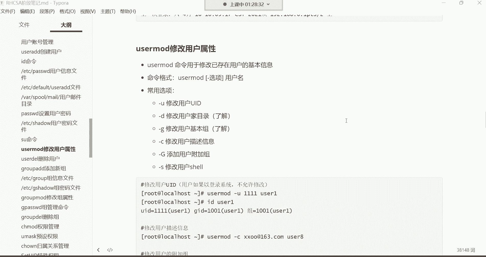

为什么要修改这个用户的属性呢，主要就是考虑到这个用户如果已经存在了的话，那我们来看一看哈，看用户的信息，我们直接就太有看吧，看这个文件，你看如果这个用户已经存在了。

然后我想去把这个用户的一些信息给它改掉，怎么办呢，比如我想改它的一些UID啊，或者说他的家目录，或者说给他加一个描述信息，比如这个用户啊，我在建的时候，我忘给它添加这个描述信息了。

哎呦或者说解释器什么的啊。

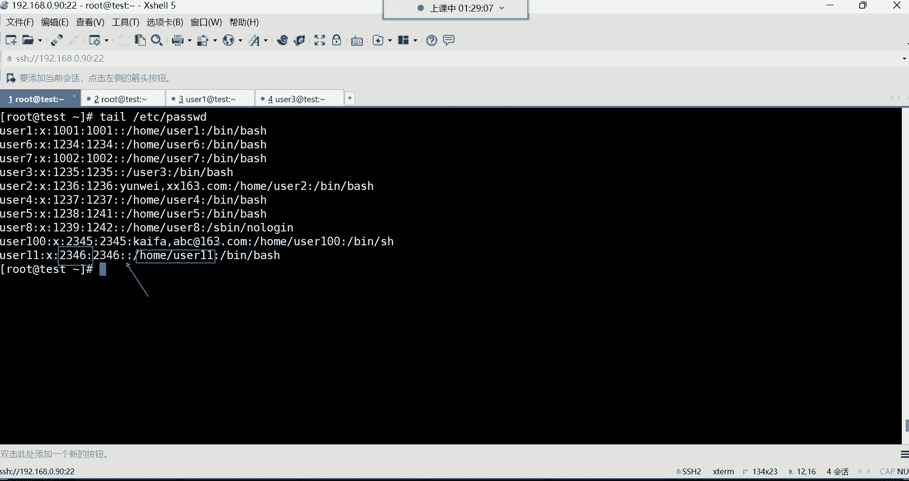

我都想改一改，可不可以呢，可以啊，其实我们后期啊在这个这个里面可以用user mode，叫修改用户的属性的。

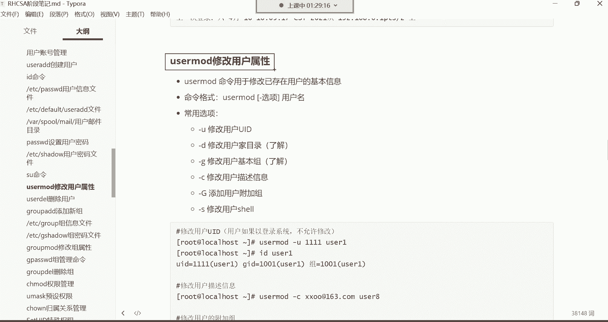

然后呢咱们来把这个命令呢拿过来哈，User mode。

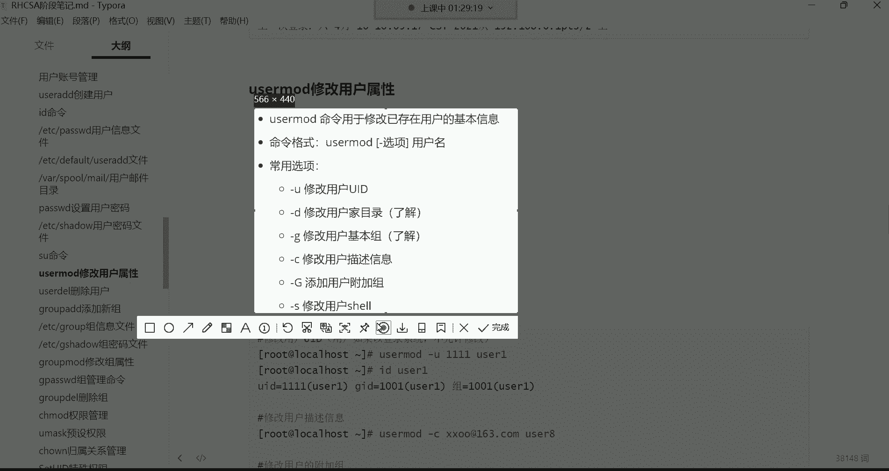

嗯拿过来，一下哈，那use mod这个mod是什么意思呢，就是motify modify哈，也不好理解，mod five啊，这个modify不就是修改的意思吗，然后简写成mod了，然后我们就是用于修改。

已存在的用户的基本信息，注意啊，它是修改已经存在的，那命令格式呢跟USI的用法是一模一样的哈，Usmode，然后呢我们可以通过众多的选项去修改，最后呢再指定要改哪个用户的，比如说我现在想改谁呢。

我现在想改user user uc1啊，咱们拿UC1来说，我现在想改USE的UID，它的UI不是1001吗是吧，咱们来通过这条命令去改use the mode，然后呢杠U注意啊。

这个选项跟我们前面学的都是一模一样的哈，就是换个命令，而已所以大家不要去什么呢，不要去犯这个头疼，说哎呀，我还要去记众多的选项吗，不是啊，这个跟前面那个USI的选项都是一样的，在USI的里边。

你知道我们去指定UID的时候，是不是通过杠U啊，没错吧，指定它的描述信息的时候，通过杠C指定它的附加组等等等等，这选项都一样哈，所以你不需要去再去重复去背这个东西好，那当由我指定他的UID。

比如说多少呢，嗯指定一个66666666，给他改成6666哈UID，然后呢指定用户名是UC1回车啊，我看一下这个666的时候有人用了呀，啊好像是有人用了哈，那换一个吧，换7777，7777回车诶。

有什么的，不是啊不是啊，这个这个用户得退出哈，退出然后才改哈，这样说呢，再改给他改成666回车，这时候就可以了，这时候我们在干嘛，我们在这个看，再看那个直接tail吧。

那现在看UC1它的UID就变成6666了，这是如何去改用户的UID，然后加目录跟用户的基本组呢也可以改啊，但是呢这个咱们就不演示了，因为这种东西我们没有这种需求，所以呢这种东西几乎用不到。

那杠小C修改用户的描述信息，咱们还是拿这个UC1来说，你看这个UC1哈，他没有描述信息是吧，我想给他加个描述信息，那这时候换成杠小C描述信息，写什么写什么都行。

比如这个人的邮箱叉叉at163点com回车，然后这是我们在看他的这个描述信息来看哈，这是我刚刚执行的命令哈，然后看他的描述信息里面是不是有一个邮箱啊，啊这是加了一个描述信息，还有这个指定附加组。

比如我现在想把U41，这个用户给它加到别的组里面，id看一下UC1它有几个组啊，只有一个自己的默认组，我想给它加入到咱们系统里边啊，还有很多个组是吧，嗯啊描述心可以用中午，什么叫中午嗯。

不不能用中文哈啊不能用啊，不能用，这种东西哈哈哈，哈哈我试一下哈，我试一下哈，嗯我觉得是不可以哈，哎哟哎哟你们看哈，哎好像还真行，好像加中文还真真行了，这可能真的不是什么重要的字段哈，嗯无所谓了。

但是一般也没有用中文的哈，嗯哼没有啊不啊，如果用中文，不知道会不会对这个账号有所影响，所以我们一般不会用中文哈，而这种东西一般就是就是写这个人的联系方式，之类的，好然后我们再来说这个附加组。

附加组的话呢，我想给这个UC加入到不同的组里面去啊，那这个时候我们就use the mode，我杠大写的G，比如我要给它加入到运维组，逗号开发组，逗号测试组，当然这都是拼音啊。

然后用户名US1回车在IDU4E的时候，你发现你看UC1，是不是就被我加入到了这么多的组里面去了，没错吧，好这是将用户加入到组里面去，就是用户已存在的，我想给它加入到，我想给它添加到别的组里面。

就通过这种方式就可以了啊，然后杠S修改它的解释器，比如说我希望UC1的解释器是别的解释器，那你就可以这样new mode杠S指定解释器是，比如说bin下的这个SH这个解释器啊，用户名U41啊。

那这时候U41的解释器就是SH，UC在登录系统，它就是SH的解释器的风格，用户名UI密码多少了，是一吧，密码123，密码多少来着，忘了哈，密码给忘了啊，我们重新设置一下吧，U41密码一一。

好好再登录一下U啊，U s e，好U41密码一好商量，Ok，你看那这个风格，就是SH的这个解释器的风格了，看到了吗，那对于这种风格的话呢，怎么说呢，呃我们不是很好用啊，不是很好用，知道一下就行。

怎么去修改用户的信息好，然后下面呢我们再来说说别的这个删除用户。

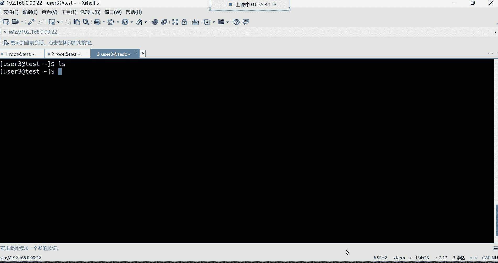

删除永远是最简单的删除哈哈，那怎么删呢，user delete这个注意啊，后边只不过就是后边换成DEL了，这DL就是delete删除的意思啊，user delete用于删除给定的用户以及用户的相关文件。

什么意思呢，就是我想删用户，那跟这个用户相关的所有文件，它也可以帮你删掉，因为你想想用户登录系统以后。

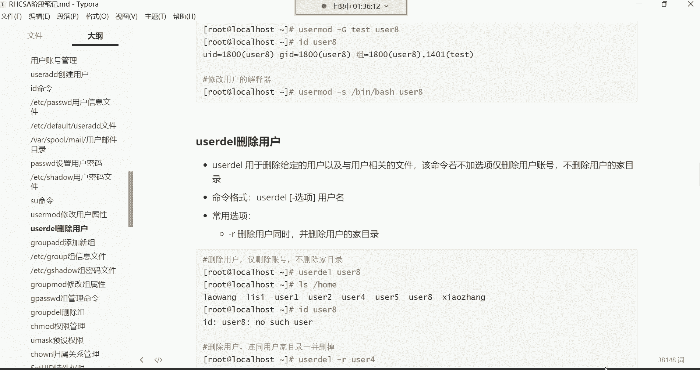

他肯定会比如说生成一些相关的文件吧，这用户什么都不干，他在他的家里面都有一些文件隐藏起来的啊，这是这个user3，看到了吗，这U43哈录屏了哈，录屏了，看到了吗。

那如果说我想把这个US3这个账号给它删掉，然后以及跟优色三相关的这些文件也给他删掉。

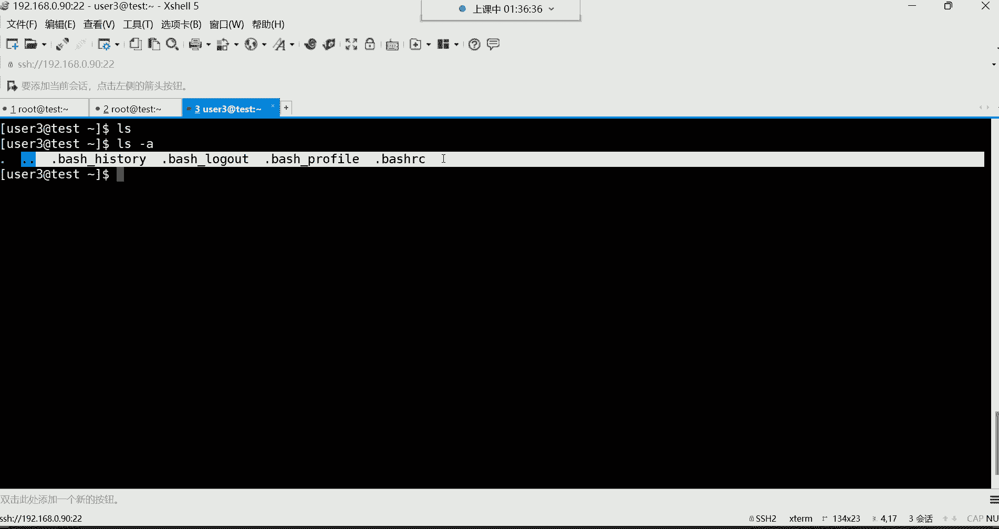

的话呢，那user delete可以帮我们实现，而这个命令呢是这样的哈，USDELETE它有个选项叫杠R，杠R这个选项是删除用户的同时删除用户的加，但该命令如果不加选项，就仅把这个账号给它删掉。

它不会删除用户的加目录里的一些相关文件的，所以我们先来第一演示。

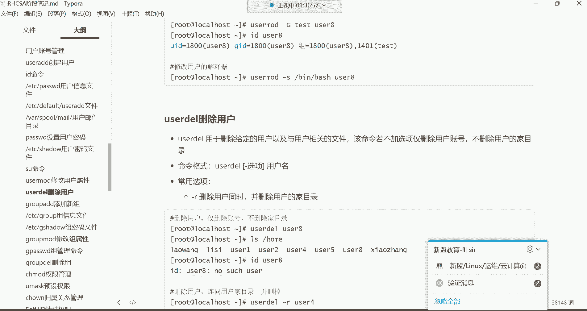

第一个UC1啊，先删UC1，退出一个终端，用不了这么多终端，我们现在X的啊，当然不是左边这个哈，左边这个我们要先删那个UC1，那user delete后边跟上UE回车，那你就说你在IDUC1的时候。

你发现没有了是吧，那没有帮你搜索到UC1，没有帮你搜索到这个用户，那是呢，但是呢你看他的家目录后，下边是不是他的家还在呀，UC1他的家还在哈，那我想删除一个用户，连他的家目录我都想同时给它删掉。

比如UC100，那你就可以这样delete杠R跟上用户名user10啊，UC100回车，这时候你再去看home的时候，你发现那个他的家也没了，是不是UC100的加也没了，这是删除用户的同时。

连他的家也同时给它删掉，那以上就是二可以删可以删哈，RM RM什么都能删啊，但是我说的是目录跟文件哈，后期你比如说我把UCE删了，但是他的家还在，是不是没关系。

你可以用RM给他删掉RM杠2f home下的U41啊，这样也可以哦，啊反了是吧，Home home，OK这样呢，你猜再看home的时候，又那个他的家就没了，OK好，这是怎么去删除用户啊。

以及用户相关的文件，当然啊我再给大家说一下，如果这个用户比如说咱们拿U43来说，比如U43，我进到别的路径，进到哪个路径呢，比如我进到t mp这个目录，我建个文件，TMP这个目录我建了一个文件。

我在这touch一个，比如touch一个，呃HELLU43啊，那这个时候如果说我然后呢，当然你想删他得先退出哈，退退出以后才能删，这是我想把US3也给他删掉，USDELETE后面跟上杠RUS3好。

那他的家肯定也跟着没了，你看他的这个加目录呢也是没了哈，但是他在其他路径建的文件，TMP这个文件可仍然还在哈，能理解吧啊这不会被删的，只会清除他的家O好。

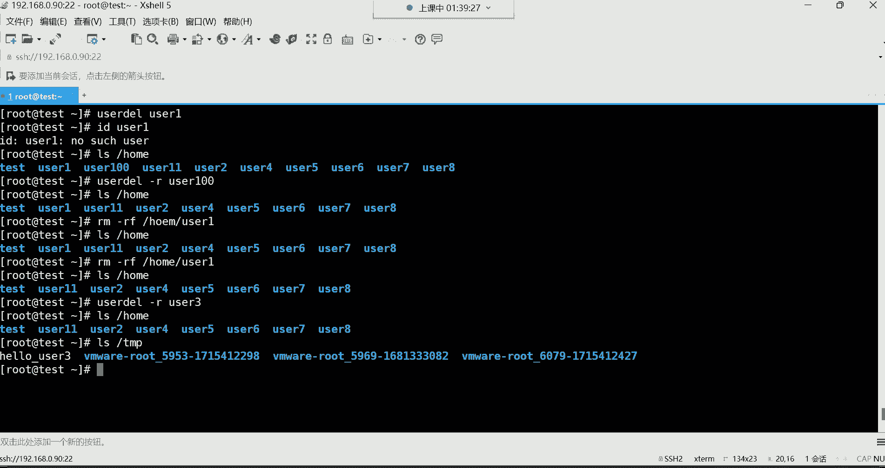

那这是删除，删除永远是最简单的，然后接下来呢咱们讲讲这个组管理啊。

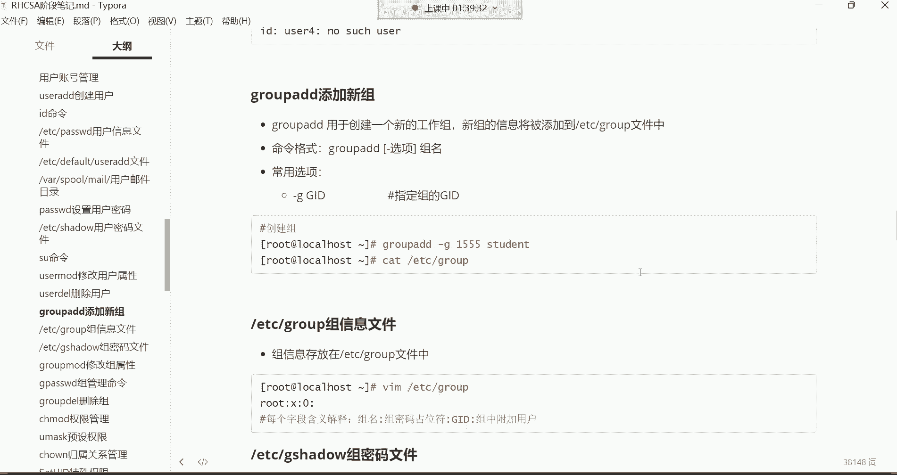

刚刚是用户管理，接下来呢组管理组管理的话呢。

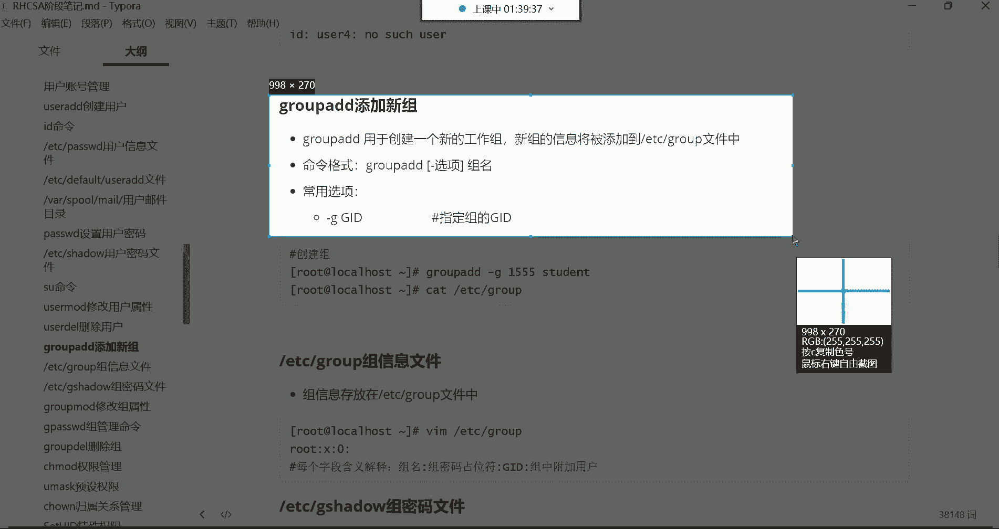

这个组的概念呢我们前面经常提是吧，它的作用我们也经常提，但是怎么创建组呢，group的注意，group AD d group首先就是组的意思，ADD是添加，其实说白了就是用于添加一个新的组。

那新的组织信息将被存到一个组文件里面，是etc group这个文件里面，然后我们先添加这个组吧，group i的后边呢有选项，这个选项是一个杠小写的G指定组id的啊，你在创建组的时候，group i的。

然后你如果不想指定组id，就系统自动分配，比如我建一个组叫什么组呢，叫学习组，S student，那这个组的信息就存放在这个文件里面了啊，etc group这个文件，然后呢，咱们来打开这个文件。

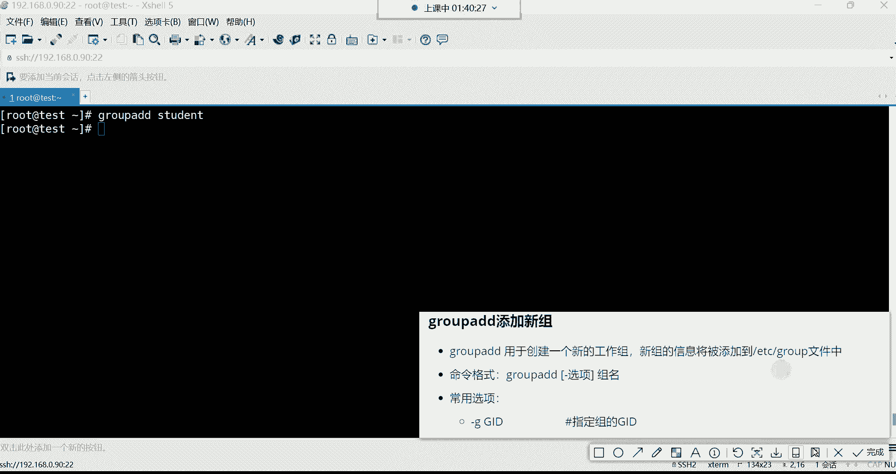

来给大家解释解释组信息文件。

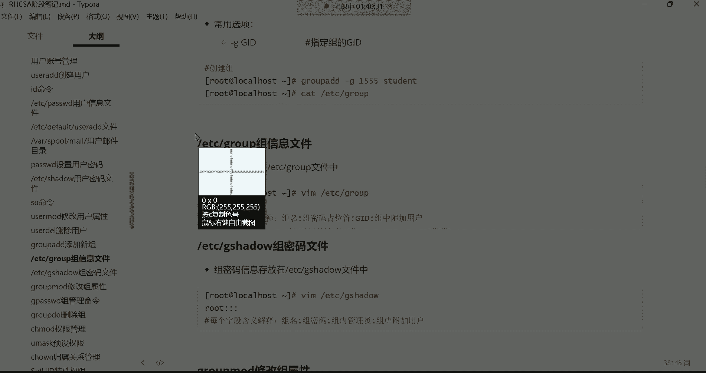

注意啊，你如果想看组信息，你只能看这个组的文件了哈，就看etc group这个文件就可以了啊，我们打开这个啊，不用打开这个文件，没有太多需要改的，我们就说一说嗯，对于这个文件来讲呢。

每一行代表一个组的信息，每一行哈，然后呢我们cat这个文件，我们管道给WC统计一下多少行，多少行，47行，那也就是说在我这个系统里面，是有47个组的信息的啊，47个组每一行都是一个组的信息。

然后呢我们刚刚自己建的那个student那个组，看到了吗，是不是在最后一行啊，但咱们还是打开这个文件吧是吧，总感觉打开的话呢看起来清晰一些，OK然后呢把行号也给他展示一下，47行啊。

是我这个刚刚见到这个死student的组，然后上边的话呢，当然这个组文件是用户的基本组，也在这个里边呢，你看哈你往上翻，这里面是不是有个root呀，没错没错吧，这是root用户的基本组。

然后每个用户都有一个自己的基本组，都在这个文件里面放着呢，好然后还有我们自己建的那些额外的组，像什么运维开发测试，这三个是我们自己建的啊，还有这个ABC这个组也是我们自己建的。

然后咱们解释解释这个文件里面的信息哈，这个文件里边呢也是以冒号作为分隔，注意啊，都是以冒号作为分隔，然后每一个字段代表什么含义呢，这个就内容比较少了，每个字段含义解释，最左侧的叫组名。

这个没有什么太多可以解释的了，就这个组叫什么student啊，就你在建的时候可以取得那个名字，然后呢这个第二个字段叫组的密码占位服务组，密码占位符，你发现也怎么也是个X呢。

跟那个用户的密码占位符好像是一样的呢，还有一个问题，为什么组也有这种密码占位符啊，难道这个组也有密码吗，没错组也有密码啊，用户有密码，组也是有密码的哈，但是这组密码，那么稍后再说好吧。

那我们稍后再说这个组这个密码哈，然后呢咱们先把这个什么，先把这几个字段给他说，说清楚了，我们再来说这个数字，这是什么叫组id，就是GID哈，就是这个组的id号，然后最后这个字段呢是组里面的用户。

那我们如果要看这个就能够看得到了哈，比如说我们拿这个运维组来说，看运维这个组他们组id是1238，这是系统自动分配的哈，然后这个组里面有几个用户呢，有一个UC5这个账号啊。

它就属于这个运维这个组里的一个成员，看到了吗啊这就是每个资料的含义解释，那你说这个我们有需要有需要改的吗，没有需要改的，保存退出就行了，没有你没有需要你改的哈，这是怎么创建组，创建组也比较简单。

那我们创建组为了什么呀，我们创建组是为了把这个用户加到组里面去，注意哈，这是我们创建组的目的，因为组嘛你要这组里边是我们要什么呀，这是一个组，我们要往里面添加成员的，一个一个的成员能理解吧。

来添加一个一个的成员啊。

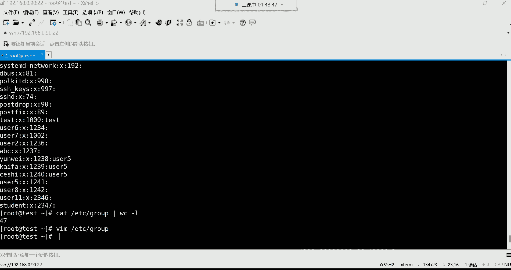

所以这个时候呢，咱们就来说说怎么往组里面添加啊，组属性修改是吧，呃还有组密码啊，那我们先这样吧。

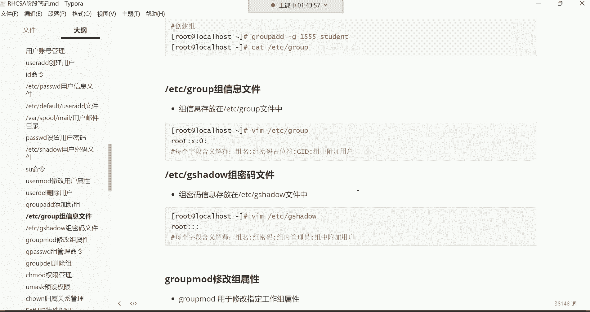

咱们先说这个组相关的密码吧，哈既然刚刚已经提到了，咱们就把这个也给他解释解释。

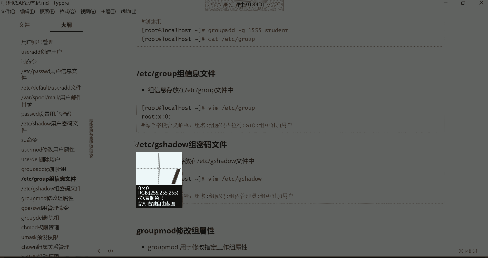

但是这个呢没有大家需要，这是需要了解的了哈，还组的文件也需要你了解。

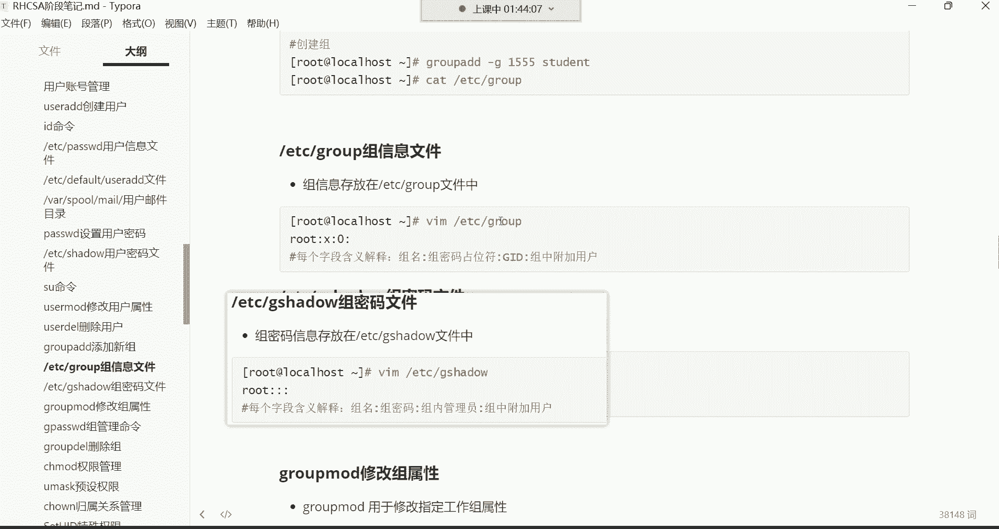

这不需要做任何的改动了，所以就不需要你去花你的这个精力去背它了啊，这个组也有密码，在etc下边有一个叫g shadow啊，就是组的密码g shadow这个文件打开以后，这个文件内容也比较少一些。

看到了吗啊当然这个文件就跟刚刚那个谁呢，那个组文件他们俩是息息相关的了，组的密码信息就存放在这个文件里边，然后对于对于这个文件的每个字段含义解释呢，咱们从最左侧开始说起组名啊，这没有什么太多可说的了哈。

然后呢这是组的密码，当然你发现这个组里面怎么没有密码啊，没错哈，咱们没有设置密码，没有设置密码，它就是叹号，没有密码，在早期呢你可以给主设密码，为什为什么要给主设密码啊，就是这个组啊。

你可以给他分配一个叫做组内的管理员，你可以把你可以把这个组干嘛呢，这是让你们系统里边的一个普通的账号，去管理它啊，就赋予它一个管理员的权限，然后呢再把这个组设置一个密码，那以后这个管理员可以干嘛呀。

管理员可以往组里面比如进行添加用户，删除用户是这么回事儿，但是这种的话呢没有这种需求，现在就是我们比如说想把用户加入到组里面，我们root直接加就行了，而且而且那些普通用户。

他们也没有办法自己主动要加入到某一个组，不能能列吧，所以这个呢就没有这种需求，大家知道一下就行，这些文件呢你也不需要太多去研究它啊。

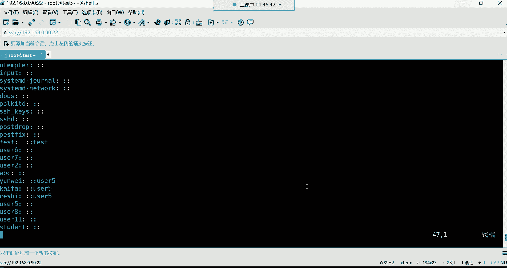

然后还有这个上面这个组的文件哈，你也不需要去深入研究它，你需要看的就是这个组信息啊，比如说组里面有哪些用户，因为我们看组的时候没有别的方法，你只能去干嘛呢，你只能去看组文件啊，这是我们看组的时候。

比如我想看我系统里面有多少个组啊，就跟你想看你系统里面有多少个用户一样，都得看文件，看文件哈好了，然后下边呢这个主属性修改也可以，比如我在这个组已经存在的情况下，我想把他的id号给他改一改。

组名改一改也行。

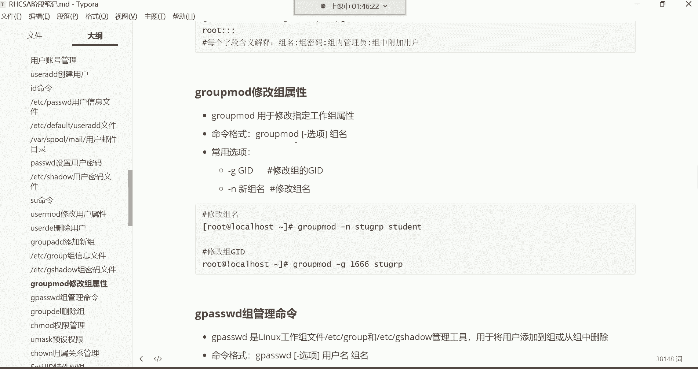

可以改名哈，可以改组名，让我们来看一下用的命令是group mode，哎你看了吗，Group mode，mod是不是mod就是mod pd也修改的意思，然后group就组啊，就修改组的一些信息。

然后呢杠小G是修改组id的，后面你跟一个GID号叫修改组的那个id号，比如说我现在要改student，Student，它的组织2347是吧，好我要改啊，我要把他的信息改成多少呢。

我要给它改成56785678，指定student这个组好，改好之后呢，我们再看这个group这个文件，你看student，它的这个阻碍id，是不是就直接变成5678了呀，OK这怎么去改，然后改名也一样。

改名的话呢，我想把这个student组给他改掉，那就group mode，然后呢杠N先写新组名，比如我要让他叫STUGRP啊，student组，然后后边呢再跟上原先的组名，原先的组名叫什么。

叫student，回车好，这时候我们再看etc group的文件，你发现这个组名就被你给改了是吧，这是如何去修改组的相关的一些信息，OK好了好了，这就是啊SKT，这是组相关的创建修改。

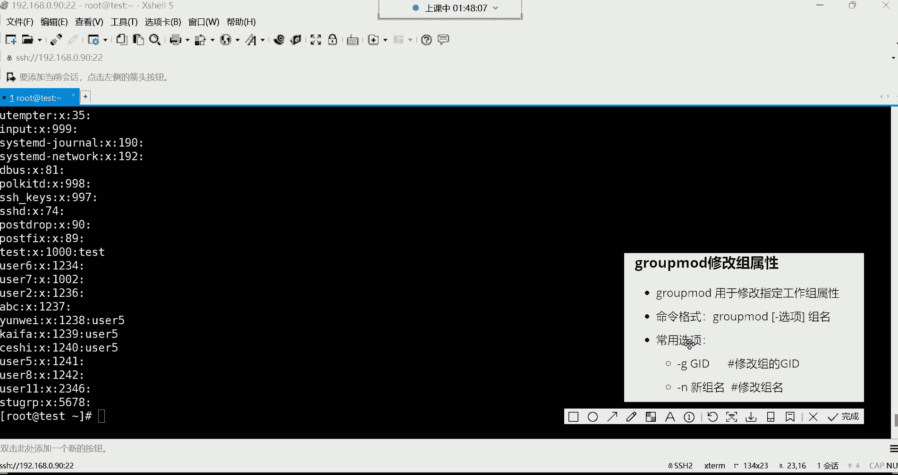

那删除呢可不可以删除也可以哈，删除啊，我看我这里面有没有写删除这哈，删除组这哈group delete就是删除组了，然后呢我们一会再说哈啊，咱咱们先说这个叫组的管理命令。

组的管理命令里面呢就是是g pass wd，是对组的相关文件的内容进行修改的啊，然后呢是针对组文件跟这个什么呢，组的密码文件的一个管理工具，就这条命令可以怎么说呢。

主要就是可以改组的相关信息以及组的密码，因为这条命令可以给组成密码，但是现在没有这种需求了，以及用于以及将用户加入到组里面，或者说从组里面删除，用的都是这条命令。

前边group i的创建组的group mod，修改组的属性的，而即pass w d是将用户加入到组里面去的啊。

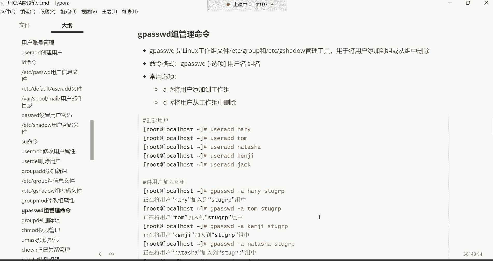

往组里面添加成员的这么这么一条命令，所以这个时候呢，咱们拿这条命令的来说一说它的格式。

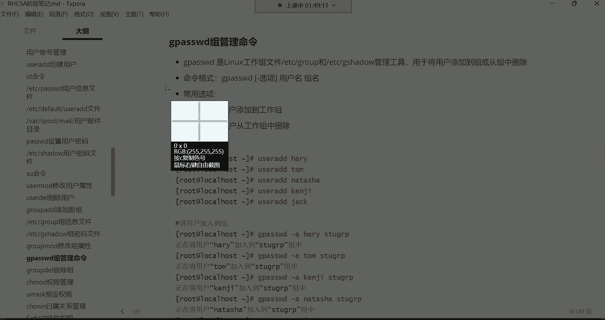

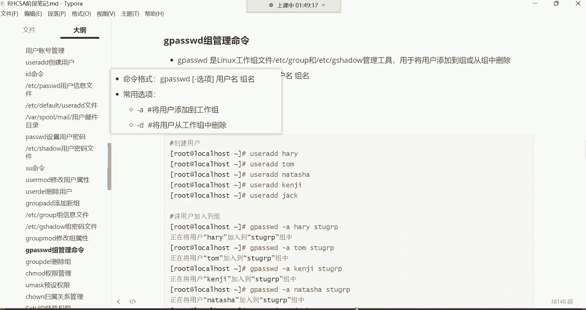

让我们来看一下哈，好我现在系统里面有非常多的用户，咱们看etc tc下的pass wd，这边有非常多用户，是不是好，那现在呢我想干嘛呢，我想把用户加入到组里面去，而且咱们也有很咱们也有很多的组啊。

刚刚建了一个student组是吧，好在这个时候我现在就这样记pass wd，如果说想将用户添加到组里面，就杠A杠A哈，然后就杠A就ADD的意思，其实添加，然后呢后边跟上用户名US6。

我要给它加入到student s t u g r p这个组里，变好看，正在将用户加入到这个student组里面去，这时候咱们看etc group这个文件啊，大家看到了吗，是不是这个组里边。

现在就有一个用户叫US6了呀，好那我还想把谁呢，我还想把前面那个优色七也给它，加入到这个组里边，那就命令拿过来UC6换成U47给它添加进去，就是你再看那个文件好，这里面是不是就是两个用户啊。

UC6U47我再想往里加呢，那就以此类推了哈，以此类推，这是如何往组里面添加用户，那如果说我想把用户从组里面给它删掉呢，就杠D杠D是删除，将用户从组里面给它删掉，那就。

g pass w杠DD就是delete delete的意思啊，简写成GD，后边呢跟上用户名，比如说UC5啊，UC6哈，我要给他从这个student组里面给它删掉，回车，这就是把UC6从组里面给它删掉了。

而这时候你再去看这个文件的时候，你发现是不是UC6就没了呀，啊UC6就没了，OK这是如何将用户添加到组里面，如何将用户从组里面给它删掉，Ok。

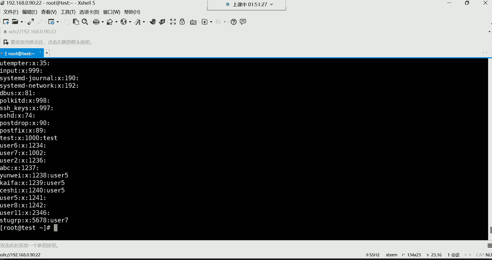

这个你发现这个用户管理的命令这么多吗，还有一个最后删除组。

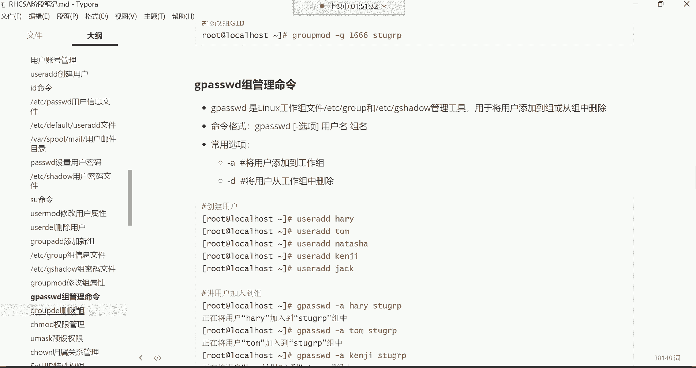

删除组就最简单了，删除永远是最简单的。

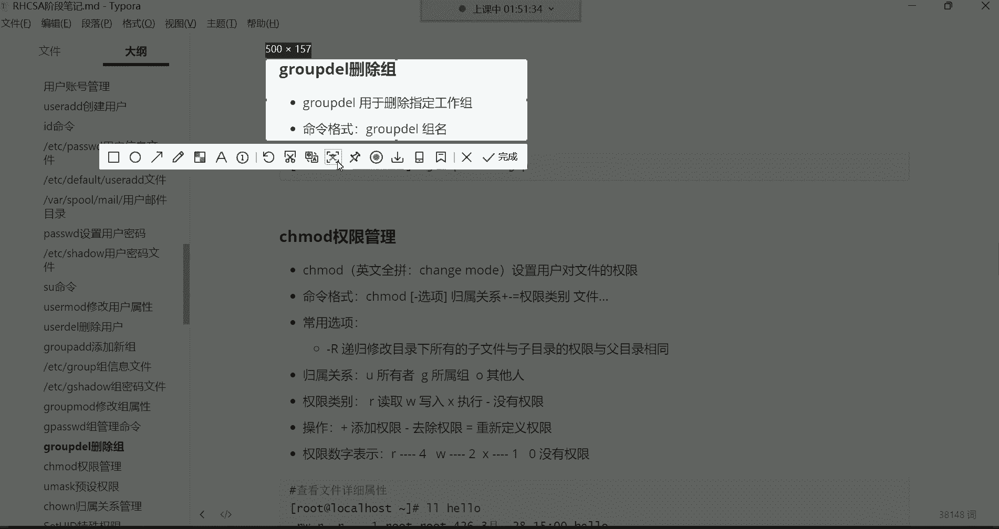

但是你想恢复，你发现它却难如登天，哈哈哈好，哎呀那接下来呢咱们删一下吧，哈咱们有很多的组cat啊，我们看一下那个什么组文件哈，不太懂这个组的作用是吧，你嗯一会儿你就懂了哈，一会儿你就懂了。

很多同学在这边都，现在呢是属于一个朦朦胧胧的状态，说我为什么要搞这个组啊，是不是啊，为什么把用户加入到组里边，哎现在可能说是确实是不是很理解，这不是很理解这波操作哈哈，因为你还没有学权限呢。

学权限你就明白了哈，看看我，我现在想把组删掉，把死student的组，还有这个哪些组呢，什么运维开发测试给它删掉嗯，那这时候就是group delete，后边跟上组名，回车这个组就没了哈。

然后我再删再删谁呢，运维啊，没有没有没删没没这这这这这这这我看一下啊，等一下哈，他怎么没有个提示呢啊删了，嗯我再把这个运维开发测试同时删掉啊，加个逗号吧，我看看哈，是加逗号吗，还是说不让同时删呢。

啊不让同时删，那就一个一个删吧，不让同时删，那没有办法运维，然后开发，然后测试好，这时候你再看那个组文件诶没了，这组全都被我删了，ABC我我也想给他呃，加空格也不行，ABC我也想给他删掉。

那就把组名换成ABC好走，你，啊这时候你发现它有个提示，什么提示呢，就是说不能移除用户US4的主组，因为这个组是属于谁的，是属于U44的，I d u44，看U44它的主组不让删，那组的成员是不是也删了。

不成员解散，你把组删了，成员解散了，成员还在啊，唉这就是怎么去删除这个组，而主组是不允许删的哈，因为每个用户必须要有一个自己的什么呢，初始组，所以这个组不让你删，这个大家知道一下啊，主组不允许删除。

你删的时候呢，如果是主组的话，他就直接告诉你了，它不能移除，但如果是我们自己手动创建的，无所谓啊，这以上就是怎么去删除一个组嗯。

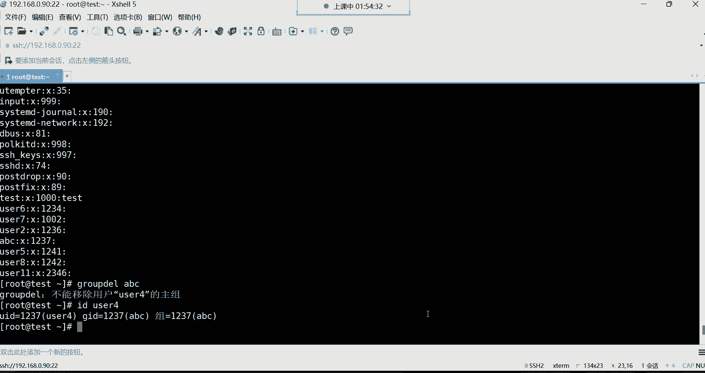

其他的话呢，就是权限了啊。

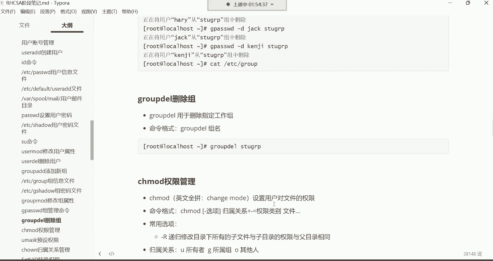

这个权限呢我们把录屏停一下。