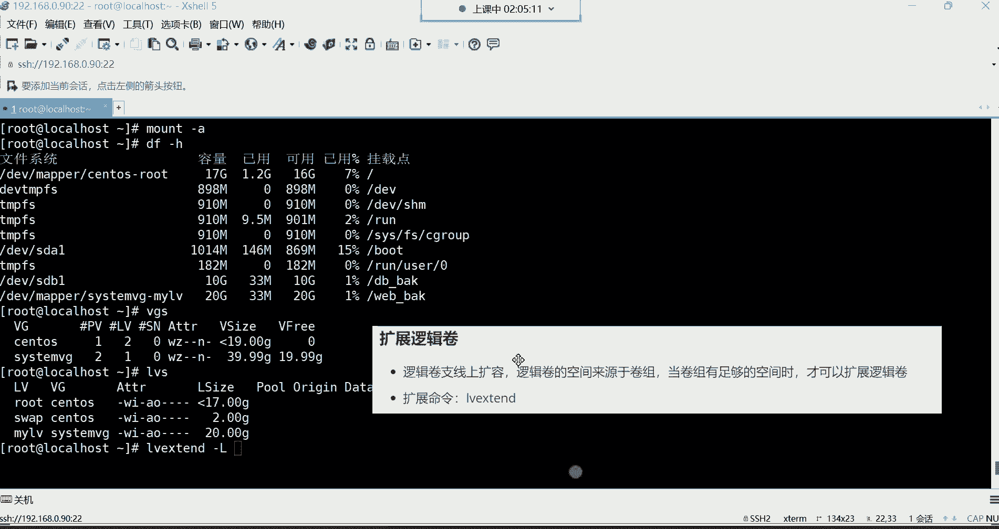
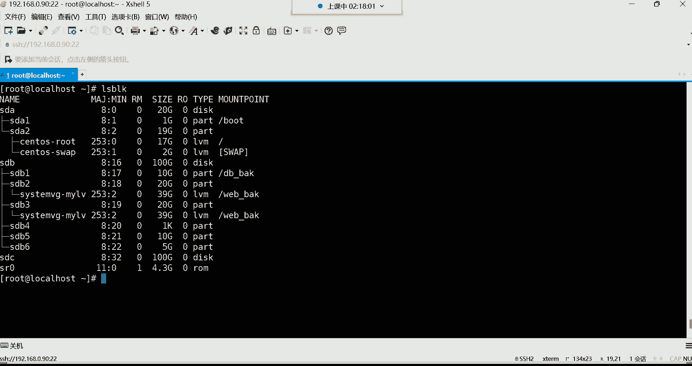

# Linux最全RHCSA+RHCE培训教程合集，小白入门必备！ - P27：红帽RHCSA-27.逻辑卷扩容、RAID磁盘阵列 - -Book思议8 - BV1ZV4y1v7c8

喂喂喂，都回来了吗，回来的话给我刷个一，我们继续，好都回来了是吧，那接下来呢我们要再讲讲，后续的这个逻辑卷的相关内容，前面呢是创建了卷组，创建了逻辑卷，然后命令的话呢也都比较简单是吧。

这个我们创建卷组逻辑卷啊，这位是标记一下叫做逻辑卷的管理命令，管理命令啊，这些呢都不是什么难的技术哈，难的话就是你得把这个东西给他理解了，你说我们为什么会用这个东西，因为像这种事情在企业里边啊。

你说对于一个数据来讲，你当初在划分分区的时候，你敢保证你说你能够预估这个数据的增长量吗，这玩意儿就像咱们拿这个根分区来说，你能够预估你的根分区它多大的空间才够用吗，随着服务器不断的运行。

你根本就预估不了，所以为什么根分区会使用逻辑卷去存储数据呢，就是因为根分区它需要扩容，而你刚开始你也不需要给它分配多大的空间，等不够用的时候呢，咱们就对它扩容不就可以了吗。

所以核心思想就是理解它可以不断的扩容，知道吧，那你说老师，我最终我可以给他扩容多大的空间，这空间要取决于什么呢，你的一个使用量，而这个使用量，最初你说我们当初在这个划分的时候。

当初啊咱们是给他分了一个什么文件系统啊，是不是差FS类型的文件系统啊，我不知道大家还记不记得哈，这个称FS这种类型的文件系统，对单个分区最大允许你支持多少空间呢，XFS类型的文件系统。

最大是不是允许你支持那个是8GB的空间，8GB8GB的空间，所以说咱们说这空间我最大，我可以给它扩容到多大呢，诶只要你有这个需求，这一个逻辑卷允许你扩容这么大的空间，你这根本就是逻辑扩容又有缩减。

然后系统崩了，这个怎么就救不了了，数据丢了，我一会儿给你们讲讲啊，这个为为什么会导致数据丢失啊，你这很少会缩容的，你扩容可以，但是哪有几个会对逻辑线进行缩减的呀，是吧哈哈哈哈哈哈，所以顺序丢了就没了。

因为这个系统它没有回收站，哈哈接下来呢我们再说说这个怎么去扩容，现在是不是该挂载了呀，现在还没有挂载了吧，啊我们这个我写开机自动挂载配置了吗，我看一下哈，cat etc下的f s table啊。

我我得MONT杠一下mt杠A挂载一下，然后DF杠A是看一下，OK那现在是不是已经成功挂彩了呀，好，那我们现在就假设现在这个逻辑卷的空间，20个G，随着不断的使用，它的空间满了，满了以后。

我是不是得对它扩容啊，因为它的核心的功能就是对扩容啊。

好接下来扩容的命令XTXT是用来扩展逻辑卷的，当然这个得看你想扩展什么呀，因为他有卷组的管理跟逻辑卷的管理，你如果说想扩容卷组，你就得VGX分，如果你想扩展逻辑卷，那就得LVXT能理解吧。

所以这个就得看你想扩展什么。

那我们现在就想扩容逻辑卷，那前提是得先VGS，看看这个卷轴有没有空间上的扩容，然后在LVS，你看现在这个逻辑卷的空间是20个G，然后卷组呢现在还剩余19。99个G，就将近20个G吧。

好那我现在如果对它扩容的话，是不是就可以了呀，那就是LVXT。

那具体的命令格式，你在扩容的时候，扩展逻辑卷哈也得需要指定大小。

来看看这格式哈。

扩展的命令。

逻辑卷在扩容的时候，首先它支持这种线上的扩容，这个线上的扩容就是我们所说的，你这个服务器不需要关机，不需要关机啊，其实关机也没有办法扩容是吧，那就是说白了你就直接就对它的空间扩容，就可以。

LVX3的杠大L不要忘了杠大哈，指定它的大小，然后这位置我再给大家补充一下。

LVX等等，还得需要通过杠大L指定加多少空间，比如说段兆啊，dog当然多少K啊，K比较少见一些，就K着G啊，指定大小加大小，然后最后呢再指定具体的这个逻辑卷的名称，具体路径吧。

具体路径，所以我们现在就杠大L，我要给它加上，比如我给它加19个G，注意啊，我们现在是扩容，所以得通过加号来指定要添加空间了，首次创建的时候是没有这个加号啊，首次创建不需要，所以第二次的时候。

扩容的时候就通过加号来指定添加空间啊，加多少加19个G，因为你加的时候，你得要根据你卷组的空间去具体指定，给他加多少空间，你不能瞎加，你如果给他加100个G可以吗，卷组压根儿都没有那么多空间。

所以他就添加不了哈，所以这个得先看卷组还剩余多少，好给他加19记，然后接下来呢再指定你对谁，对DV下的system vg下的买LV进行扩容，注意哈，在空中的时候不需要指定卷组名了，为什么呢。

因为你在扩容的时候，比如我要对这个逻辑卷进行扩容是吧，这个逻辑卷它会自动去干嘛呢，自动去找当初是有哪个卷子给我分配的空间，或者说我当初是从哪个卷子里面创建出来的，他就自动去找这个卷子去要空间了。

他不会去找别的卷子，你比如说我这个逻辑卷是从这个CSMVG，这个圈子里面创建出来的，那他会找这个STOS这个卷子去要空间吗，他不会，那就是跌着跌猫找妈是吧，这谁是谁生的孩子，他就找谁啊。

这孩子就跟谁要奶喝，所以这时候我们就不用指哈，所以这时候大家看一下这大小发生变化了啊，具体的含义就是你的你的这个逻辑卷，它的大小啊，就你这个C4，这个MLV的这个逻辑圈的大小从多少呢，这不是吗。

from从20个G原先是20个G哈，就这个你原先的空间20个G现在变成多少呢，to啊，现在变成了39个G了，也就是说从原先的20个G，我给他加了19个G的空间，他现在就变成20+19，变成39。

20+19，唉，变成39个G的空间了，空间变大了吧，好然后这个告诉你说你的这个卷组啊，已经成功的调整了大小，看到了吗，不是你这个逻辑卷哈，成功调整了，调整了大小，好，那大小变了，我们再这样。

LVS自己看一下是不是变成39个G了呀，空间变成39个G了，能加百分比吗，百分比加不了哈，这也加不了百分比，因为它百分比是他自己计算的，它根据你这个空间计算的哈，好。

那接下来呢39个G的是不是空间变大了呀，有人说我们这个逻辑卷啊，咱们这样哈，咱们按照实际的使用情况哈，我们是最初的时候，咱们这个逻辑卷，是从原先的多少呢，原先的19个G19个G我又给它加了啊。

是从原先的20个G，20个G我又给他加了19个G，然后他现在变成39个G，没错吧啊三十三十六计哈，没有那么大39G，然后我们这个虚拟硬盘有这个卷子的空间，卷组是多少呢，将近40个G，40个G的空间。

那我们现在来想象一下呃，我这个逻辑卷空间变成39个G了，我们在看正在使用中的情况，DF杠H下午好啊，下午好，这怎么这个怎么着，这个突然间给我来一句下午的问候啊，这想这是干嘛呀，呵呵呵好。

我们来看一下哈啊他不是刚来哈，他不是刚来啊，来看一下啊，逻辑圈的大小，就这个，你看LV这个逻辑卷买LV的这个大小，现在是不是39个G啊，但是你发现正在使用中的这个情况，就正在使用中的这个情况哈。

为什么它的容量仍然是20个G啊，仍然是20个G，这为什么呀，这有些奇怪吧，也就是说这空间呢好像没真正的扩容成功，有没有感觉，这空间好像确实没有真正空中成功啊，是不是啊，你看我把这图啊，再给你们来。

这样哈嗯，这个图呢它是这样子的，我给你们分析下这个图的这个情况哈，咱们这个图啊，原先是你们这样看哈，这样看，我们把左边这边空间呢给它理解成，是这个原先的20个G空间，原先的20个G。

然后右边的这个这一部分空间呢，我们给它换个颜色，啊然后这一部分空间呢我们可以把它列成，我们可以把它写成，是我们刚刚增加的那一片空间，19个G的空间，啊这个部分是我们后加的哈，19个G的空间。

那现在这个问题出在哪呢，现在问题就出在好像是没有实质性的变化，就是说这个逻辑院它整体的空间，现在我们看的是39个G，总共是39个G哈，但是呢为什么正在使用中的，还是原先的20个G要重新挂载是吧。

它没有挂载上吗，哎不是我跟你们讲哈，当初咱们这一片空间我们做了哪些事情呢。

我们做了一步，就是我们给他格式化文件系统的差，FS的文件系统没错吧，是不是他说是不是这片空间是有文件系统的呀，那他的这个文件系统啊，它其实有大小，也就是这个文件系统的大小啊。

它其实也是20个G文件系统也有大小，这个差FS的大小也是20个G，然后呢我们后边啊又给他增加了空间了，我们新增加的那片空间呢，它少了什么呢，少了什么呀，咱们说这文件系统啊，它是不是叫文件管理系统啊。

帮我们管理这个分区里的这个文件的，那当初你这个逻辑卷在格式化的时候，它就会给你20个G的文件，系统大小也是20个G能理解吧，然后他就只会管理这20个G的空间的文件。

哎那我们后来又给他增加这19个G的空间，这19个G的空间差在什么呢，这19个G的空间就差在它没有文件系统，没有文件系统，不是不是哈，没有文件系统哈，没有文件系统，那系统根本就识别不到啊，你没有文件系统。

它没有办法帮你去管理啊，所以说差就差在它没有文件系统，你怎么样呢，你得给它格式化文件系统，就是说把这个文件系统再给它格式化一遍，唉把这个19G的空间也给它，增加一个文件系统就可以了。

也就是说现在最后一步哈，最后一步扩容，最重要的一步就是在这儿扩展文件系统，对哈，当逻辑卷变大以后啊，也需要对逻辑对他的文件系统进行扩展，那扩展文件系统容量两条命令，第一条呢叫叉fs growth。

这是用于扩展插FS类型的设备的，然后下面这条命令叫resize to fs，这是扩展EST系列设备的，那这个呢我们也没给他格式化成，EST系列的文件系统，所以是不是就不需要了呀，所以我们就只需要干嘛呀。

使用x fs growth就可以了，这样就差FS下划线grouse，这你在格式化的时候，你可以直接指定它的挂载点的目录，也可以直接指定逻辑卷的目录都行，指定挂载点目录比较省事一些，回车好。

这时候你再直接DF杠H再看的话，它的空间才真正的变大，变成39G了，为什么呢，因为增加的这一片空间也有文件系统了。

所以这时候的空间才算是真正的什么呢，真正的变大了20个G加19个G能理解吧，唉这样才算真正变大哈，其实这样是可以什么，是可以裁剪的，等一下哈，好行理解就行哈，理解就行，应该不难理解吧是吧。

知道为什么说他会出现这种情况了，空间没有时应该变大，就是因为它没有文件系统，现在就等于39个G空间变大了，那以后我再想对它扩容是不是就比较容易了呀。

没有影响之前的问题它是扩容，它是扩容哈，它是扩容，它不是重新赋予，所以我们看这个web，这个web back和目录里面也没有东西，是不是没有没有文件，主要是没有文件，没有这个我们没有在这里面建文件。

我们进去加载文件哈，touch当然了，叉叉叉叉十个文件吧，现在十个文件一点点十，建了十个文件是吧，然后一会我们再扩容哈，再看会不会受到影响，好那这时候我们再来分析一个问题，什么问题呢，看一下哈。

他现在空间是不是变成39个G了，那我们假设这空间又不够用了，随着文件不断的存储啊，这39个G也不够用了，怎么办呢，39个G现在也不够，我使的了，现在文件系统也变成39个G了，那不够用。

我是不是还可以继续对他进行扩容啊，是不是还可以继续扩容，没错吧，好那这时候如果你再扩容的话，我们再分析分析卷组还有空间吗，现在这卷子没空间了，你看到吗，还剩余多少1016照。

你现在最多还能给他控制不到一个G的空间，那这不行啊，这够干嘛的呀，这不够用啊，不够用，所以我们现在要干嘛呢，要开始扩容这个卷组了，这卷组现在主要是他没有他没有空间了，而卷组的扩容我们可以怎么玩呢。

啊啊alex block列出所有的磁盘以及分区，我们现在是不是还有这两个分区加一块硬盘呢。

我现在可不可以，都给它扩容到这个卷组里面去啊，可不可以呢，可以可以，所以这时候咱们就直接，这块硬盘的空间是100个G，然后我还有什么，我还有两个分区，我都给他控制进去，那怎么怎么扩容卷组呢。

命令格式VG，extend扩展卷组的命令哈，VGXT跟创建的时候呢差不多。

我先说一下我们创建的时候是不是这个vg create，然后后边呢给卷组取个名儿，让他叫C4特目VG啊，然后后面再指定设备路径，DV下的SDB1，还有啊SDB2跟这个DV下的SDB3呢，没错吧。

是这样创建的是吧，那我告诉你扩容的时候把V把这个create换成XT，那命令格式也是要指定卷组名，你要对这扩容路径也要指定，你要把哪些分区或者说硬盘给它扩容进去，那是不SD5SDB5跟SDB6啊。

好那SDB5，还有SDB6，还有吗，有还有一个DEV下的SSDC，这是一块硬盘吧，这一块硬盘空间100个G，有时候我现在两个分区，两个分区哈，加起来是15个G，再加一块硬盘，总共是115个G走你啊。

少一个D是吧，少个D，提示什么呀，被过滤器排除的SDC嗯，I s d，那这样吧，我们SDC先不扩容，先把他俩扩容进去，然后这时候我再这样，vg extend指定对system vg这个卷组进行扩容。

把DV叫的SDC放进去，啊这硬盘我看看哈，这硬盘前没分过区，我这样哈嗯，for this4K杠L，我看一下这个硬盘，还有啊，也也不是，这跟分区格式呢没有什么太大关系，嗯那这样吧。

我看看pv create，我把这个DV下的SDC，我觉得这块硬盘好像是不能用了，好像是不能用了哈。

这样吧，我们给它移除掉，再添加一块吧。

把它删掉吧，添加一块新的。

哈不用我们就把它这个SDC，SA的第二块这个哈给它移除掉，然后再添重新添加一块，那硬盘，我前面，然后我给货坏了，应该是那SA的，下一步下一步我们空间变小点吧，让他就让他是20个G吧。

确定，嗯不在公司也没事，你那新硬盘，你那是新，他不是不支持GBT啊。

它支持哈，你那是新硬盘，无所谓的，那星盘说白了你重新热插拔一下不很正常吗，SDD是吧，好SDD20个G哎哈嗯vg create，system vg这个卷组指定把DV下的SDD，嗯啊不是，Create。

sorry哈XT，好走，你是不是可以来呀，是不是空中进去了呀，嗯是不是成功了呀，啊这你的这个物理卷create创建成功了，他把这个东西先给你创建成物理卷的格式，然后再把它给你组合啊。

给你扩容到这个卷子里面，那这时候我们再这样VGS的时候，你看这里面有几个呀，是不是变成五了呀，主要是四个分区，一块硬盘，四个分区，一块硬盘，然后空间现在还剩余35个G，就是说你想拿一块物理硬盘。

直接往卷子里面扩容也是可以的，直接一整块硬盘都不需要去做任何的配置，直接就给它扩容进去啊，那是不是空间变大了，变大以后我还想再对逻辑卷进行扩容，那LYS逻辑卷现在30一个G。

我现在就lv x tent杠大L加多少，给他加30个G，30个G啊，然后再指定对DV下的C4，MVG下的MV进行扩容，好从39个G变成69个G了，是不是又增加了30个G啊。

那当然你这时候你这样看的话不行，正在使用中的容量没有发生改变，所以最后呢不要忘了扩展一下，那就是嗯差fs groups，指定对web back这个目录进行扩展文件系统，这时候在DF杠原车看一下。

好空间变成69个G了，那变成69个G以后，我们看里面的文件有没有受到影响啊，web back目录，你看这里面还是十个文件是吧，从1~10，所以文件呢也并没有消失，也并没有损坏啊，就是它就扩容的话呢。

不会影响原有的文件啊，这就是我们所所说的这个逻辑卷，是不是又加了30个G，20个G加19G又加了30个G，所以最终变成69个G，69个G啊，空间就变大了好，那这就文件系统。

是不是现在也变成69个G的文件系统了啊，这样就可以了哈，所以说逻辑卷你发现它最大的优势，就首先这个东西它就是帮你去存储数据的，只不过呢它在存储数据的时候，跟这些物理分区存储数据的。

唯一的优势就是说它可以扩容，它是可以扩容的，那这时候很多人说老师，那我能不能空间能变大，我能不能给它缩小啊，我让它变小了，可以吗，可以可以缩容，但是大家要想想缩容的话呢，这个危险系数是非常之高的。

缩容得先缩文件系统，比如我想把这个空间再缩小30个G，你得先让文件系统少30个G的文件系统，让文件系统先变成39个G，然后再去收容这个空间，再把这30个G的空间再给它去掉，去掉，能理解吧，这样才可以。

但是这个危险系数啊，这个不不建议大家在企业里面这么去缩容哈，但因为在企业里面一般也不可能去缩容的。

除非数据不想要了，除非除非不想要了哈，如果想缩容的话，那有一条命令缩减的命令，等一下哈，那个逻辑卷的缩减在这哈，如果想缩容的话，用这条命令叫v redo，这条命令可以缩容松茸哈，好嗯没有没有静音哈。

没有静音，你们能听到我的声音吧，如果听不到声音，应该早就啥了，对吧啊，没有经验，刷新一下，这个没有听到声音，那个你你们给他发个消息，让他刷新一下哈，对没声音退出，重进一下，然后再给大家说一下。

如果你想缩减的话，就不允许连接了，什么叫不允许连接呢，得把那个卸掉，你得把这个挂载点给它卸掉。

把挂载点卸掉，然后才能对它的空间进行缩容，但是你在扩容的时候，你发现可以连击，是不是啊啊是这样子的。

那这里面我给大家写了缩减的一些注意事项，但具体的格式并没有写吧，啊这个如果大家需要的话，可以自行百度搜一搜，这都比较简单了，这都非常之简单哈，那下面呢我们这个逻辑卷哈，这个内容呢到此为止就结束了。

然后我上面呢是给大家留了一些作业，而逻辑卷的删除的话呢，这个其实在企业里面也用不到，如果想删除的话，这里面我有一些详细的例子，大家可以去看一看，然后如果想删除逻辑卷，也不允许联机，先卸载再删除。

在删除的时候呢，顺序的话呢，首先删除逻辑卷，然后再删除卷组，最后删除物理卷，物理卷也需要删，也需要删物理卷哈，我给大家演示一下吧，嗯比如我现在逻辑卷我不想用了。

不想用的话，你得先删除你的这个逻辑卷，DF杠H看你得先把这个螺旋给它删掉，但删的时候呢，你得先卸u mt，把这个关键点给它卸掉，web vt目录，而开机自动挂载也给它卸掉，这个哈删掉dd啊。

这个时候呢我们再去删，那就是RM啊，sorry哈，Lv remo，这时候你指定要删谁，我要删DV下的那个C4特目VG下的买LV，这时候呢你在删的时候，他肯定得干嘛呀，他肯定给你确认呢。

他说你真的要删除活动的逻辑卷吗，要不要呢，Y就是yes的意思，你就输入Y，如果你要删就输入Y好，那没了，这时候你在LYS的时候，你发现你自己建的那个逻辑就没了吧，好那逻辑认为了以后。

你说那卷组呢我也想删VGS，我想把我们自己的这个卷子给它删掉，CSM危机制卷组好，那这个命令就是危机芮木，后面跟着卷组名就行了，C4特姆VG回车直接就给你删除了好吧，直接移除成功，卷组已被成功移除好。

那移除以后，我们这时候在阿拉斯block，那它是不是就没有那些逻辑卷的格式了呀，这是不是都回复到自己普通的物理分区了呀，包括这个SDD这块盘是不是也一样的呀，那这盘我先我我们现在可以直接用吗。

你比如我现在给它格式化，它不就普通物理分区嘛，拿SDB2来说哈，我给它格式化啊，MKFS点差FS对DV下的SDB2唉，你看它提示了它提示什么呢，大体的意思就是说你这里面的格式不对，对你看他说。

你这里面似乎包含一个现有的文件系统，什么文件系统的LYM的文件系统呵，所以说你得如果想真的格式化，你可以加一个杠F选项，强制覆盖也行，如果你不想强制覆盖，你就把他的这个给他删掉，那我们看看可不可以啊。

强制覆盖，但我们一般都建议什么的，都建议把他的PV给它删掉，再把物理卷格给它删掉，能理解吧，那你想覆盖也行，那就MKFS点XYS加一个杠F强制执行好，这样也可以，这样也可以，这时候我们再来看。

那我们用alice alice block加一个杠F选项，再看这个SD边啊，那这个就是一个普通的分区了，就可以正常使用了，对它不会自动帮你删除，因为它它那里没有文件系统，它那里面主要是文件系统。

它没有给你删哈哈，没有给你删哈，所以说最终你如果想删的话，就这个步骤先删逻辑卷，再删卷组，最后如果想用的话，它已经恢复到一个普通分区了，你要么就把它这个PV给它删掉，要么就直接强制。

也可以在格式化的时候强制，那这就是一个普通物理分区，那以后再用的话，我就可以mt把DV下的SDB2，挂载到某一个目录，比如web back df杠H好，那它就是一个普通的分区就可以正常使用了。

就是这样子的呃，卖的哪一串后面那个串儿啊，我怎么没有看到那个后面那串，啊这个是吗，不是UUIDUUID哈，这不是Mac地址，就是这个逻辑卷，他自己的那个UUID这些数据还在吗，肯定没了呀，你都删了。

他肯定没了，你看外包外包外壳目录是没有用的，外观百科目录不会帮你去存储任何数据的，因为数据在逻辑卷里面被你删了，你都格式化了，你想想你都已经格式化了。

就等于说你在windows里边，如果你对你的windows那个盘格式化的话。

你的数据还能在吗，你想是不是，如果你对你，如果你对你的windows c盘，你说我想给它格式化一下，你可以这样，你右击哈哈，这里边啊右击，然后更多选项，比如说我如果把我的C盘格式化了。

你觉得他这数据还在吗，这数据还能在吗，是不是哈哈哈哈哈哈哈。

就没了哈啊就没了哈哈哈。

这如果你们不信，你们下去可以自己试一试，哈哈哈啊，OK删除所减就删除，一般也不会删哈，好那接下来咱们给大家讲讲这个什么呢，讲讲这个raid磁盘阵列图片，不要了哈，哎有些卡呀，有些卡。

这笔记的内容啊属实有些多有些多啊，到这个了是吧，没错到这个了，read呢，我们现在就是主要还是以理，还是以这个理论为主，不知道呢还不行，知道的话呢还没有什么实操，嗯每家还不一样，是。

行了就这样吧哈就这样，然后我们讲讲这个read这个到底干嘛用的，行了我客户再整理吧哈，read呢叫做磁盘阵列，然后它的全名叫做独立的磁盘冗余阵列，我们简称叫磁盘阵列，这个东西可以干嘛。

用他磁盘阵列阵列虚拟机能做read能做，但是通过软件做哈，那这个read他嗯，看看我们可以通过一些软件或者硬，这个硬件就是瑞德卡，将多个独立的磁盘整合成一个巨大容量的，一个叫逻辑盘来使用。

好这个我们得学图了哈，得需要图，这个图我就不给你们。

我就不限化了，现化太浪费时间了，我记得我曾经在上一个班。

嗯这个今天要讲完，当然要讲完了。

我记得我在上一个班画过图，所以我就把那个图呢拿过来来直接用啊，给大家讲讲这个re的这个不像画，画起来特别的麻烦。

是27期的时候嗯，磁盘管理的时候read磁盘阵列，哎，这里边我有一个哈，把它下载下来，来看一下这个，好read哈，嗯read呢它是怎么玩的呢，就是说我们说在企业里边呢，我们怎么才能保障这个数据的安全啊。

我们怎么才能保障这个数据的一个安全性，很多人说老师那数据安全，我做备份不就行了吗，做备份没错哈，在企业里面确实是呃比较好的方式，就是对这个数据呢你要定期给它做备份，这做备份。

有的企业就是会有那种单独的服务器啊，这企业里那一个那种单独服务器啊，这服务器呢就可以让你做专门做备份的，把你们企业里边生产环境的，服务器里面产生的一些数据，比如这是你们的企业的生产环境的服务器。

在这它们产生的一些数据，你就可以给它定期的通过一些手段给它备份，到哪儿呢，备份到这个专门的备份服务器上面去啊，这样可以，这这是一种手段哈，但是我们怎么能保证你说我的备份服务器数据，它不会丢失呢。

即便说咱们说这个已经做双重保障了是吧，在这个服务器里面也有，然后在这个备份服务器里面也有，但你怎么敢保证你，比如说我这个备份的服务器数据它也不丢失呢，哎这个我们说这个就可以做一个叫做read read。

这个东西啊，它后期可以结合什么呢，结合这个逻辑卷来一起使用，逻辑卷的功能，不是扩容吗，是不是啊，read呢，他是把磁盘给它整合，就像前面有人问我说老师，那如果我的物理分区坏了以后怎么办呢。

那物理分区坏了，是不是你逻辑卷再扩容也没用啊，因为你最终数据都得需要物理分区的空间呢，物理分区比如说我坏，我坏了两个分区，好数据又没了，数据又丢了，那怎么办呢，唉瑞的这个东西就非常的好，怎么好呢。

他呀比如我现在有几块硬盘，然后我这几个硬盘我想做逻辑卷，但是我又不敢保证我这个逻辑卷，这个如果说你硬盘换了逻辑卷，它也并不是很安全啊，那这个最好的方法是什么呢，就是你让这个硬盘它的安全系数提高一些。

就可以了，提高硬盘的安全系数，硬盘的安全系数怎么样才能提高，比如这是我的这个第一块硬盘，硬盘硬盘一，这是我的第二块硬盘嗯，硬盘硬盘三，我想最终它是可以怎么结合着用呢，比如我这每块硬盘呢多少呢。

呃一个T1个T哈，一个T，这也是一个T，read可以整合锐的，一个整体啊，当然这个我们就叫做raid阵列了，哎给你整合到一起，就就就这技术哼整合一下，你说老师这好像跟逻辑线差不多呢。

他跟罗圈呢他还不太一样，他是先把这硬盘呢给你整合了，整合以后干嘛呀，哎整合以后我们可以注意啊，这就叫这就叫做read了，这叫read了，叫瑞的盘，这叫锐的盘，但是它也是硬盘，这整合的话呢。

它可以把很多个盘呢给你相互整合啊，比如我这左边三块小硬盘，这个好像让它变小点儿哈，然变小点，V的盘，别的盘，别的盘，拿过来算，好那这种方法还能干嘛，还能还能再来一套，知道吗，就是还能再来一套哈。

变小点哈，两块瑞的盘，注意哈，这是不是两块瑞的盘了，那空间多少呢，这个瑞的盘的空间是不是我们叫三个T啊，三个T这个略塔方空间是不是也是三个T啊，啊三个T好，接下来LYM可以把这两块盘给你整合到一起。

组合成一个叫做虚拟硬盘，虚拟硬盘多少呢，六个T6个T哈，这叫虚拟硬盘了，接下来咱们在虚拟硬盘里面干嘛呀，是不是去创建逻辑卷了呀，哎逻辑卷创建创建多少个，看需求，这就是逻辑讲了，逻辑卷。

那这样呢像这种方法它有什么优势呢，这种方法的优势就是它允许你坏掉几块盘，你比如说由于这个硬盘损坏了啊，我现在总共是六块硬盘是吧，底层比如说我现在由于这个硬盘损坏，左边呢这个read坏掉一块盘。

右边read也坏掉一块盘，没关系，数据不丢，坏掉其中任何一块盘，就这三块盘里面坏掉任何一块儿没关系，数据不会丢的啊，然后右边这个瑞的坏掉，任何其中一块他也不会丢，所以这样就可以达到一个数据的安全可靠。

然后再能够实现一个什么叫数据的，叫做空间的无限的扩容，是这么回事，能理解吧，啊主要是一组会，那不行了，一组块两块就不行了哈，但是你没有，你不能那么点背吧，哪有那么点儿背的呀，啊一般不会出现这种情况。

在企业里面好，那下面呢我们就来了解了瑞的功能了，就是它主要是可以提提供一个什么功能呢，提供一个叫这个数据的一个安全可靠的功能啊，数据安全可靠，呵呵所以这有瑞的，而对于瑞德，我咱们呢是没有任何的实操的。

为什么没有实操呢，啊这个听我给你细细的道来哈，因为read这个这项技术啊，那曾经在企业里边呢，是分为我们叫软件技术跟硬件技术，软件跟硬件，总之呢甭管是软件还是硬件，都是将多个独立的磁盘。

整合成一个巨大容量的一个磁盘去使用，优点是什么呢，可以提高数据的读写速度跟数据的冗余功能，那对这个re的来讲，看看我们说它分级别，就是这个怎么提高读写速度跟冗余，这得看不同的级别才可以。

我们就拿这个咱们看这个啊，我们看说这个read0，这个级别read0叫做等量的存储，什么叫等量存储呢，它是由两块盘组成的，一个read叫阵列啊，两块盘组成一个read阵列，这不是两，你看这不是两块盘吗。

这是两块盘，然后它可以组成一个read阵列，我下面这是啊，有一个图哈。

