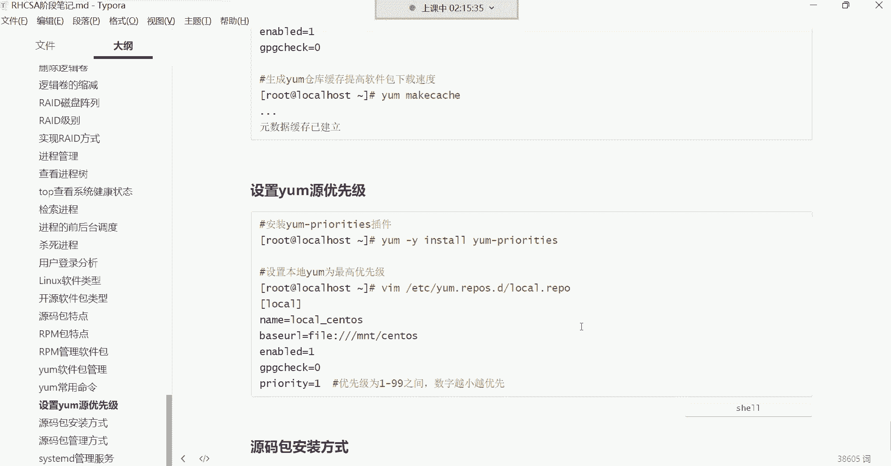
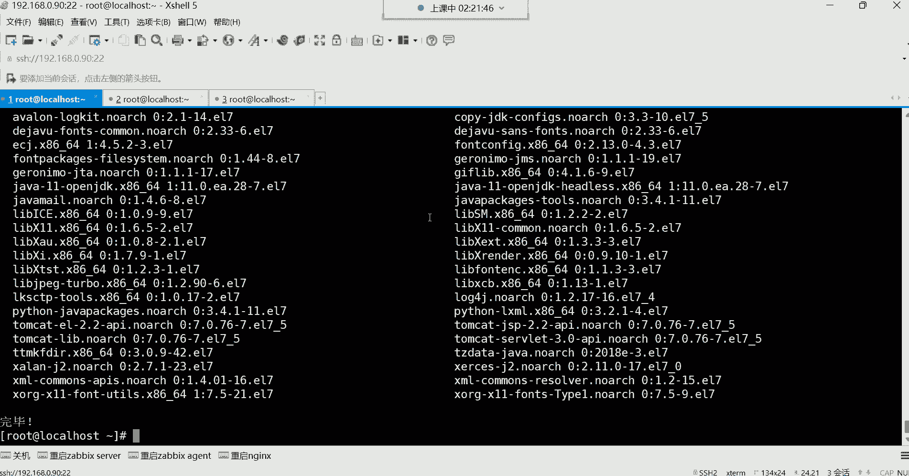

# Linux最全RHCSA+RHCE培训教程合集，小白入门必备！ - P35：红帽RHCSA-34.软件版本升级、网络YUM仓库配置、设置YUM仓库优先级 - -Book思议8 - BV1ZV4y1v7c8

hello hello，都回来了吗？😊，回来的话，我们继续我们把刚刚的那个升级啊，我给大家演示一遍啊，刚刚我那两个选项找到了。那两个选项呢有些长，所以呢我这个就没有放在这个笔记里边哈。😊。

这两个选项啊是非常非常的长啊。第一个选项可以列出仓库该软件包的所有版本。所以你们来看一下啊，这个选项是得是这样子，结合这个list看到吗？然后跟上软件包名。

然后再加上这个长选项就可以列出这个仓库里边所有的版本了。我刚刚是这样用的，你们来看我这个命令格式哈，命格式在上边在这看到吗？啊，list，我呢列出我这个仓库里边所有N相关的版本都有哪些。

然后后面结加上这选项就可以了。😊。

那现在在这个仓库里边，N6相关的版本有有看到了吗？这些都是是吧？好，那我现在要下哪个呢？我现在要下这个1点。啊，这是这个哈呃这1。21。1的，这些都是稳定吧。我下这个1。18。1的版本哈。

因为前面版本太低了哈，前面你看还一还还是单位数呢，版本太低了。现在最新版都是1。20。2的了，所以我下载这个哈，那这时候怎么下呢？就这样。😊，我我下1。18点0一会做个升级哈，y么。😊。

ins套后边注意啊，还要加这个选项的这个选项也比较长，看到了吗？这个选项啊，不是啊，我就是为了给你们眼企业里有的时候也卡的很死哈。为什么呢？因为企对于一个软件的版本来讲，企业需要下载这种稳定版。

那用亚么去指定某一个版本的话，你就得加这个选项。😊。

如果我们用亚么安装一个包，我们虽然说是省事儿，依赖都给你解决了，但是呢。他默认会下载这个仓库里面，这个默认最新的版本知道吧？最新的，但是你企业别说比如说我就喜欢哪个呢？1。16。0的，我觉得1。116。

0的稳定。😡，啊，我就不想用这种新的怎么办？你就得要去通过这种方法哈去指定具体的版本名字。我要下11。18的这个哈，那N这个词。😊，这个名字啊。放到这儿。你得先跟上后边的版本哈，是1。18。0的这个哈。

N这个是。嗯，然后在这补上。1。18。0的。我们就这样哈记不住是吧，咱们这样叫星181。18。0，后边也记不住了。😊，不管了。就这样哈。这样能看懂吗？我看这样好不好用哈哎。

前面我指定我要下载index这个包，然后呢。😊，后边1。1啊包含1。18。0就可以了。嗯，因为默认它这个版本。好，看下。这是啊，它其实是个杠看到吗？后后边其实是有个杠哈。行，我们就这样，1。18点1。

18。0。然后看一下嗯是不是1。18。0的版本呢？好，这是我们想要安装的。没错吧。OK其实我们在安装的时候就可以像我这种比较简洁的方法去安装。因为你。😊，不需要去干嘛呢？你不需要去，哎呦。

把这名字都给他搞上去哈，太麻烦了。而且有的时候你如果说像他这种方式去复制粘贴，你看他这个名字其实还。😊，还不是你想象的那个样子。他安装这个包的名字不是你想象那样子哈，我们先按Y。不要。

现在开始验证这个指纹了哈喂。O。好，这是N那个软件包看到了吧？啊，那软件包现在安装好了1。18。0的。那接下来我改它的配置文件，我先查一下杠QL，看看他往我系统里面安装了哪些文件哈。

然后我先找到它的那个主配置文件。😊，它的主配文件在这儿呢，在ETCN这个词下面有个叫com点D。我呢现在打开ETCN有一叫com点D下边有个文件叫defa点com，这是它的主配文件。好。

那这个文件打开之后呢，比如说我现在要改这里面的一行配置，改成么配置呢，比如我要在里面加。😡，嗯，不加吧。嗯，我看一看好，我改什么。就这样吧，我们为了验证哈，我们就直接。😊。

我看一下哈那个。那官方好像被我给关掉了。

啊，关掉了，那我改什么呢？我往里面加一个参数吧，我手写吧，各位好吧，手写吧，我确实这个如果再找的有些费劲，我们主要就是为了验证一下，就是我们比如说对这个配置文件我做了一些修改啊，就这样哈。😊，嗯。

当改这个是什么含义，你们先你你们不用去管哈，不用管。😊，呃，我是不是加了一个什么呢？加了这个一段配置啊啊，加完以后保存退出。保存退出之后呢。我接来我不不做任何操作，我就升级了。注意啊，我现在就升级。

升级以后，咱们验证这个文件里的原先的那个配置现在还在吗？到时候好吧，那升级我现在无所谓了，我再安装的时候，我用亚马胺。😡，我是否可以指定一这个1。201。20。1的，这样是不也可以啊啊，原先是1。18。

0吧，好，回车。呃，这时嗯等一下啊。No啊 no。我得用升级的那个什么哈。卡住了卡住了。回山怎么删不了了呢？卡住了哈，那就N吧N。😊，然后我现在要升级哈，我用这个选项升级叫ymup。😊。

亚麻不 data。那只需要就把这个in换成up date就可以了，升级吗？现在不是。你么。Ule date。好，来看一下现在版本是不是1。20。1的版本呢？那现在Y。😊，O。啊，现在升级成功了。

升级成功之后呢，我现在在干嘛呢？我再看原先的配置哈，再看原先的配置，看ETC。😊，N这个是。康复点地下的那个。default点这个文件。好，我们打开它。VIM打开哈。嗯。😊，我看下版本哈，N这个4杠V。

嗯，我没有起伏嘛，可能刚刚。咦是吧啊，我刚刚怎么。嗯。没有起伏。一现在是1。20。1的，没关系，把它扶务起来。哦，语法写错了哈，我那个语法错了，语法错没关系，我这个。删掉哈删掉。我加两个注释还不行吗？

或者说我去掉一个注释，我把这个注释给它删掉，把这个井号给它删掉哈，删掉保存退出。我再起伏好，这没有问题了。嗯，扶起来之后呢，我现在在这样。我在升级，我再对他升级哈，我再对它升级。

难道现在新的版本都有这种机制了吗？这新的版本。来好再试一遍哈，我再升级1。20。2的。如果有这种机制，那就太幸福了。如果他真的是只升级版本的话。啊，1。20。2哈，你看它上面是会先帮我们清理1。20。

1的这个版本，你们看到了吗？😊，是不是看到先清理了呀，是不是显示正在更新呢？好，现在变成1。20。2了吧。😡，我看下状态哈，好，也是运行的状态。那这时候我再看配置文件。😊。

如果这时候这个喷审件如果再没有变化的话。那我只能说现在这个版本已经变得非常的智能了。好。还在配置还在。配置确实是没有给我们覆盖掉哈，那这就是。由于可能说这个软件的机制吧。

这个软件的机制它不会覆盖原先的，可能是有一部分配置文件，它没有被，它没有被覆盖。那版本有没有变化呢？

1。20。2的版本也变了啊，那就太好了。那对于你们来讲，那你们也不用担心说，哎呦我这一升级原先的东西都没了怎么办呢？啊，早期那可真的是啊，早期的版本可没有这么智能，早期软件一升级，原先的东西全都消失了。

😡，都变成新的了哈，就跟一个新安装的软件没什么区别。而你看现在呢。

啊，非常好哈，所以现在升级也不用怕了。但是呢我们虽然说不怕归不怕，但是最好也留个后手啊，你别上去真的直接升。万一有的软件它没有这种机制呢，没有这种机制，是不是你就哭都找不着调了呀？😡，嗯。

所以一般也要做备份哈。😊，嗯有字为份。对，这就是把它配文件做个备份就行了。😡，嗯。好，那这是升级升级现在知道怎么升了我说简单呢，这升级说白了你就只需要有高的版本就可以了。😡。

有高的版本就可以了哈那卸载呢，比如说我后期我想给它卸掉，那这包我不想要了，y么木。😊。

跟上软件包名就行了，回车。你们看看。呃，现在卸载的时候现在都很智能，怎么智能呢？就是说我们在安装这个软件包的时候，它是有依赖的。它有很多的依赖哈，但是在卸载的时候，你发现它只卸载了谁呢？

只卸载了这个主包。😊，前面安装的时候可不是说只安装这一个主包哈。在最初的时候安装的时候，你们来看一下哈。呃，在最初安装的时候。这是安装一个吗？这是升级的吧。升级的。我看是不是哈，这是安装的吗？呃。

他所需要的。啊，这安装的时候，他怎么没有需要依赖呢？难道说我这系统里面他所需的依赖，我都已经给他安装安装过了吗？提前。这有依赖哈还是有些依赖的，你们看到吗？有依赖哈。😊，那1。20。

1就需要依赖了这就是。啊，将被更新更新有很多依赖看到了吗？正在处理依赖关系是吧啊，有非常多依赖。哦，你看。需要这么多依赖是吧？😡，这些是安装的包，然后下面是依赖。但是呢你发现我们卸载的时候。

他就非常的好，怎么好呢？他依赖。😊，并不会给我们卸掉，只删除这一个主包。所以这时候呢我就直接输入Y。是否继续？你看它只删除了这个ND这个主播，而别的是不是就没有被受到影响啊？所以现在卸载的话。

你发现y么这种机制也非常非常的人性化了。在早期他会帮你卸的，早期帮你卸啊。嗯，他得先问你啊，这个有一个包作为你的依赖，你要不要也一系给它卸载掉。那时候他有个选项啊，如果你想卸的话，你就得把依赖啊。

他会帮你把依赖也同时卸掉。

但现在也不会了，所以卸载是不是也很省事了，升级卸载都非常省事了。但是一般我们也要留后手，但卸载这种事情一般不会做，我们一般不会去卸载啊，这时候在杠V应该看不到版本了，看到没？

没了，被我给卸了哈。😊。

然后下面还有叫。嗯，这个清除缓存，最后再说清除缓存这个选项我们放到最后。然后下边呢还有这个哈，还有这个ympri，后面跟个命令。这个呢我们前面经常用这个应该有印象吗？这个pri。

比如说我在敲某些命令的时候，这个命令啊，它没有找到我们前边是不是经常遇到这种事情啊。然后接下来呢我们就ym。😊。

privaates是吧，然后跟上那个我的那个命令，我那个哪个命令没有，我们就用哪个命令是吧？比如说。我们系统里面我看有没有AB命令哈AB。有吗？没有是吧？比如说我想用这个AB命令好，没有，那我就y么。

Pvades跟AB。然后他就会帮你去搜索为AB这条命令是由哪个包提供的。看到了吗？是不是帮是不是帮我们搜这个ABV令啊，有哪个包呢？有这个包。有这个哈有这个叫HTTPD杠ts这个包提供的。然。

那个文件名是在系统的这个路径。如果说你想使用这条命，我们是不是得把这个包给它安装上就可以了。所以这时候我们就这样y是吧？然后杠外inall安装谁呀？安装这个HTTPD杠ts。安装它。回车。好。

安装好了之后呢，我就这样可以用AB命令了。就可以用了，没有报错了吧。好。

这个pris。这个非常好用哈，这个得记住。因为很很多命令你最小化安装的时候，你系统里面就是没有的。所以你想知道有哪个包提供，你就得去搜。下边还有啊这两个我们已经讲过了，这就不说了哈。

这个都这个一般用的不多，这两个一般用的不多哈，那常用的都有哪些呢？😊，123。还有。45。这5个呢是非常非常。用啊是非常非常常用的一些命令的。那上面这个清除缓存它怎么就常用了呢？

我一会儿会给你讲一讲哈啊，缓存有错误，到时候呢会影响你进行一个排错。啊，这是亚么长命的，然后看看对这些命令有没有一些疑问。各位呃，没有疑问的，给我刷个一上来。然后我们就继续往下给大家讲讲这个亚么优先级。

没有疑问是吧？OK嗯啊，缓存清楚是清楚哪些啊，一会儿我会给你讲哈，我们接下来呢啊再来给大家说说一个叫网络压么源怎么用网络压么源。有阿里的，有清华大学的。还有如果我们刚开始安装系统的时候。

我们系统的这个ETC点reD这个路径下边其实是有很多sOS官方给我们提供的那些仓库文件的，只不过被我们给删了。

只不过哈是被我们给删了。嗯，删了就删了，没关系哈，因为本来我们也不不太喜欢用s托S官方给我们提供的那些仓库文件，为什么呢？因为s托S服务器在国外。在国外的话呢，你从国外下载软件包，这个就速度会非常的慢。

所以我们一般呢即便说我们需要用到这种网络的仓库的话。

比如我们用网络仓库，阿里的。清华大学的163的中科大的，你都可以用，你不一定非得用s透S官方的，能解吧？这本身还有一个就是渗透S的官方的。有叫红帽的官方啊，当然是sintoS。深台是官方的。

等等等等都可以。啊，所以接下来呢我们讲讲网络仓库怎么用，网络仓库比本地非要要简单的多哈。网络仓库啊，你只需要知道那个仓库的地址就行。比如我想用阿里的仓库。这就是阿里的仓库地址。我们把这地址给他拿过来。

这是阿里的地址，然后我们去访问这个阿里的地址。

就用这个浏览器吧。

嗯，怎么卡住了呢？好，过来了。来大家看一下，这是阿里的仓库哈，看到了吗？呃。😊，他在里边。怎么也没有个介绍呢？这里面有镜像。有什么域名解析的。这有系统镜像的，看到吗？其实是一样哈。

这个镜像就是就是所说的那个系统镜像。你比如说。渗透S它有自己的镜像。那镜像里面有非常多的软件包，这个就是sin透S官方的那个。镜像里边提供的软件包，你点进去。这个里边呢。他给你地址。看了吗？

这是生产是过期的原。这这里面地址啊跟相关仓库地址都在这呢，是吧？然后下边。现在这个哪个过期了呢？剩他是6过期了。如果你说哎我需要下载一些过期的这个不维护的软件包，可以从这个地址去下一下，看看有没有。

如果能找到最好。那我们现在用的是七的那下边呢看它有针对于当前sS8的一些。仓库地址。还有sn头S6的，看到了吗？但是这官方源已经下线了，建建议切换到这个圆。

就如果你希望用一些过这个sin6里面能够使用的软件包，这里面它还给你提供了一个圆，这个圆是什么意思呢？嗯。这个圆嗯我看一下哈。唱嗯。这个圆是什么含义呀？我怎么。翻译我也没翻，我也没有翻译明白呢。保险库。

保险库。没太理解算了吧哈，下边我们找七的哈，我们这是不是七的呀？那七的话我想使用官方的，因为官方的软件包多，注意啊，官方的软件包多。那这时候怎么使用官方的仓库呢？😊，命令呢他已经给你准备好了。

你就拿过来复制粘贴。复制一下，然后呢拿到我们的系统里边。

啊，第三方元是吗？来看一下哈。在这哈。对Wge有个杠O选项，这杠O就是它会帮我们从这个地址去下载这个仓库文件的这你看了不就一个点repo结尾的仓库文件吗？下载到我们的本地放在哪呢？

放在我们的本地的仓库路径改个名叫s透S杠base点repo。这 base其实就是系统的意思啊，就是那个系统的。基本啊我们叫基本的仓库，看到了吗？就一些基本的软件包都在这个贝ase里边啊，这叫贝斯仓库。

里边就是一些基本常用的软件包。回车没有W get啊，这有些尴尬哈，没有W get。那么你就y杠外ins安装一个Wge。好，安装好Wge之后呢，我们再把这个命令翻过来回车。好。

那阿里的仓库文件就被我下载下来了。你看对于网络仓库简单吗？网络仓库配置起来，我告诉你，你只需要知道阿里的仓库地址在哪儿。然后你来到这个仓库以后，你直接去下载它的仓库文件，命令也不需要你自己去备。

直接来复制粘贴。下边这个命令也一样。这两条命令都可以帮你把它这个仓库文件给你下载到你的本机，下载到本机以后干嘛呢？下载到本机之后。

你看一下他不是给你放在这个路径了吗？不是告诉你已经给你保存到系统的这个位置了吗？那接下来我们来看一下ETC点D下边是不是有一个叫s托S杠base的这么一个文件呢？打开这个文件的时候。

你看一下这里面是什么呢？这里边就是一堆的仓库地址。但是它这里边看这是不是仓库的名字啊？😡，这是不是也是仓库的名字啊，就这一个文件里面有很多个仓库地址，你们来看哈很多很多个仓库地址啊，看到了吗？很多个。

因为每个名字是用来区分这个仓库的唯一性的，所以仓库的名字是唯一的，仓库的名字是唯一的。下面up date。😊，什么意思呢？这里面其实非常的见明之义哈。😊，啊，更新的内容，比就说一些更新过的软件。

到时候他会从这个地址帮你去下载。能列吧啊，一些基本的软件呢，它会从下边这个地址帮你去下载，但是它的地址非常多。非常多，我们没有那么多地址，他多，所以他才指定了他才指定了这么多。农里吧。嗯，你看了吗？

三个地址哈。😊，啊，下面还有一些扩展的，看到吗？这是扩展的意思吗？啊，临时的临时的一些软件包放在那里了。然后还有这个s头S。这是什么呢？Plus。外加的啊，这是一些外加的软件包。啊，下面这个呢。啊。

这构建的一些捐献模块啊，也就是说一有有一些模块它会从这个地址去下载。你看他这一个仓库里边，一个仓库文件里边是不是有很多种类型的软件呢？有这种基本的软件包，还有一些用于更新的软件包。

还有一些额这个额外的啊，就叫这个临时的啊。啊，下边这是属于一些这个外加的额外的。然后下面还有一些模块的一些下载地址。这是很多段仓库了哈，那你说我们需要改吗？不需要改，这里面不需要你改哈。😊，这叫优先级。

优先级网络仓库为什么？优先呢是因为网络仓库仓库里面他配着这个优先级了。看到吗？它里面是有优先级的哈。就如果说一旦仓库设置优先级的话。😡，那他会优先从。这个文件里的仓库去下载软件包的。

所以为什么我们本地为什么我们的本地的软件包就是是最后去从本地仓库下载呢？是因为本地仓库我们并没有设置它优先级。啊，那网络仓库需要我们改吗？不需要你改网络仓库，你说白了。

你只需要把这个文件下载下来就可以了。你只需要知道怎么下载它的仓库文件以后下载软件包，我们先列出仓库里的软件包数量。report list看看网络仓库里面有多少个包。啊，我们来看一下啊，它这个里边。

当然啊。标识是不是就是仓库的名字啊？啊，然后名称是不是仓库的描述啊，状态是不是每个仓库里的软件包的数量啊，那这时候你我我们就可以看一下，你看在这个。我们直接就看这个原名称就可以哈。你看这里有贝斯的仓库。

就基本的仓库里边有1万多个包，然后还有一些额外的。这里边呢都是看到有软件包的数量是吧？好，然后有一些更新的都有软件包的数量。当然这是我们自己本地的这是我们自己本地的。

也能看到我们自己建的哈4000多个包，总共加到一起。😊，是18592个包。但是我告诉你。😡，如果我们一旦用网络仓库的话，在下载软件的时候，它是不是优先要先从网络仓库下载呀？那本地的呢怎么办呢？

本地是最后去。如果说网络仓库他找不到的包，他会最后检查我们本地的仓库的。但是呢有的时候你比如说我想安装一个包，这包明明在本地仓库里边它就有。本地就有，那本地下载速度快也不需要联网啊。😡。

所以我希望他优先从本地仓库去检查，可不可以呢？可以，如果这样的话，就可以提高软件的下载速度了。所以我们也可以对我们的本地仓库啊设个优先级，设个优先级哈。但我再给大家说一下，就这个贝斯员。

跟我们本地仓库里的软件包其实都是相同的。注意啊，都是相同的。因为毕竟阿里的我们看到的阿里的那个仓库。

给大家说一下，我们从这个阿里的这个地址去下载软件包的话，它这个仓库里面的软件包都是从s托S官方同步过来的。它从stoS官方同步过来的时候，你想想我们本身用的就是sin托S的官方镜像。

所以我们系统的镜像文件。

就是这个里边的软件包。比就说它这里的软件包就是sinS那个镜像文件里的软件包，只不过它这里面的数量会多一些。这个就是sinS那个镜像文件9个多G的那个系统镜像。森S斯有个经像文件是9个多G。

那9个多G里边的软件包就是1万多个。能列吧，比就说在我们本地找不到的一些基本的软件包，在这个里面也就都有了。好。嗯，行，那这是网络仓库。当然这个其实对于清华大学来讲呢。

你我这里面还给大家准备一个清华大学的仓库啊，其实这两个仓库大家用哪个都行。

就用阿里的就行了哈。用阿里的就可以。然后接下来呢我们来说一说哈，我现在如果想下载软件包的话，我给大家演示一下。比如说我现在y么。😊，杠我现在把那个VSFTPD先给它卸掉哈。😊。

RPM杠EVSFTPD先给它卸掉，然后再看一下杠QVSFTPD好，没有了吧。我现在按杠Yin特VSFTPD回车。好，你们看看。你们看好你们看什么呢？你你们看。这个位置你们看这位置哈。

现在是不是正在安装这个软件呢？大伙这手速有些慢了哈，有些慢了。😊，现在是不是我们要安装这个软件呢？然后。这是软件的相关信息。但是你看这个语是哪个源呢？这个圆是不是？叫upate那个圆呢。啊。

一些更新的软件包的语。在这个里边呢。但是这个软件包明明在我们本地就有啊，我们本地就有这个包啊，他跑到。😡，外网去下载，是不是你这速度跟本地是不一样的？😡，可能这个明显感受不到是吧？因为刚刚我暂停了哈。

它已经下载好了。但是你从这个外边去下载，跟你在本机下载速度能一样吗？肯定不一样。在本机它也没有什么流量的支出啊。😊，你跑到阿里仓库下载，你也是有流量支出的呀。所以我们一般干嘛呢？一般对于这种情况。

我希望从本地下载。

那下边这个优先级啊就变得非常重要了。优先级。优先级就是我们可以。让我们的本地仓库。去它的优烟级最高。怎么才能设置优先级呢？得需要下载一个插件。有一个叫priority这么一个插件。

这个插件可以让让我们去设置亚么的优先级。但这插件默系统是不存在的哈，所以先给它安装上。

这插件我也不记，我一般什么时候用，什么时候看笔记了。先给它安装上这个插件。安装好了之后呢，我们直接编辑我们本地的仓库文件ETCy的reportD下边那个local点repo在下边加一行叫priority。

这把这个加进去哈。

然后给大家说一下。这个priority代表就是优先级的一些。那这个优先级是呃它这个数啊是从1到99这个范围之内，但是呢数字越小越优先，那越小就是一注意啊，一是最小的那就说一的优先级是最高的。能列吧？

如果我希望我的自己本机的这个仓库。它的优先级最高的话，那它下边就改成一就可以了。嗯，没没有那网络仓库油烟机咋好使呢？呃，没有网没有网络仓库就不需要设置了。没有网络仓库，那说白了你就本地直接下载了呀。

没有网络仓库，就没有必要去搞这种东西了。然后保存退出。好，保存退出了吧。保存退出之后呢，我们再把那包给它卸掉VSFTPD卸了以后呢，我们再再下载，再看看它从哪下载哈。y杠YinVSFTPD。😊，哎。

来看了吗？各位注意哈。看到这个圆了吗？有没有发现这是不是从本地的仓库下载了呀？来看到了吗？看到给我刷个衣上来。😡，是是不是这是我们自己配的呀？没错哈。😊，如果网络仓仓库油烟级最高，网络仓库配错了。

那报错还是自动跳到本地仓库啊，跳跳过了。跳过了哈，他就直接跳过去了。O。哎，这就是这样下载速度就快了，而且它也没有什么所谓的流量支出，直接从本地下载。能列了吧啊，这是怎么去设置这种优先级？

但是这种得是在什么呢？你有网络仓库的情况下，才有必要去设置。如果你说如果我就本地仓库，但说我都没有网络仓库，咱就本地的，你有必要去搞这种东西吗？

是不是咱本地说白了软软件包在哪？咱们本地的软件包就是镜像里边的。你没有其他地方有有有这些软件包的。😡，都是镜像里面的，所以我们也没有那么多仓库可配，就一个。所以你就一个的话。

他是不是就直接从这个仓库里面去下了呀？嗯啊如果跳过了，而本地就没有那个软件包，就安装失败了。你比如说我现在给你安一个包，ym杠外inst安装一个叉叉有这包吗？没有吧。那没有这个包，他就。😡，安装失败。

你看是不是就没有这个包。就没有给你做任何的处理。那没有的话，他怎么给你安呢？没有办法哈。😊。

啊，然后上面还有一个呃，还有一个我我我们这个一些选项哈，要么的管理命令里面都有一些选项清除缓存的啊清除缓存的。嗯。嗯。呃，他嗯。不是低址配素，压根儿就没有那个包。😡，嗯，压根就没有那个包哈。

然后下面呢我们来说这个清除缓存这个选项什么时候能够用得到哈，清除缓存跟生成缓存。这两个命令我先说生成缓存，生成缓存这条命令啊，就是我们在用网络仓库的时候。

由于这个网络仓库呢得需要联网，我们想提高下载速度啊，可以生成个缓存，就这样叫ym。嗯，要make擦车，好像是m叉车。make叉车哈。点m叉车代表是生存和缓存。生成缓存是什么意思呢？就是他会帮我们记录。

哪些软件包在哪个仓库？啊，然缓就他会把这信息给给我们放到系统的缓存里边。你看这样原数据缓存已经建立了。把这个一些这个软件包，就是我当前系统有多少个仓库，然后哪些软件包在哪个仓库里边啊。

他会给我放到先记录到缓存里面。那以后我再下载的时候。他就不需要再去挨个仓库去加载了，可以提高下载速度。比为我要下载某些包的时候。然下载哪些包呢？比如说这个。下载什么呢？随便吧哈，下载一个。

想想哈那个叫什么来着？叫n兔子。这往往下滚啊这往下滚。嗯，下一个n杠SNLP吧。SNLRP。下一个yinsstore。当然啊由于我们已经是呃由于我们已经是设置这种这个。啊。

由于我们已经是设置了本地仓库优先了，所以他也现在下也没什么意义，下也没什么意义啊，他也会从本地去帮我们去下载的嗯嗯。感受不到是吧？😡，刚跟嗯。但这种情况下呢，如果是我们先先不下哈。

如果是我们没有搞这种优先级的话呢，我们生成缓存其实有必要。就是如果在本地找不到这个包，它会从网络当中去帮我去下载。那如果从网络当中去下载这个包的话。

你比如说我下载一个t cat ya杠外instore下载一个tca，这tmoca不知道有没有。有啊，还真有。行，下吧。下看到吗？你们看一下一个软件包加48个依赖，这多恐怖啊，多恐怖啊。

这但这包在本地可就。😡，这包在本地好像是没有。对，如果你用网上，你就不用自己搭建了，就不用自己搭建了哈。阿帕奇HTTBD半的是？这么多依赖，我看着头皮都发麻。头皮都麻了。哇塞哇塞。

你你们自己看一下你们自己看一下这这一赖头皮麻不麻。嗯。啊，但是我想看看他从哪个仓库下的啊，都是在我们本机。都是在本地也不是啊，这些包都在本地，你看到吗？都从本地下的。还呦。算了算了算了哈算了哈。

没关系啊，你就知道这个缓存呢可以帮我们去干嘛呢？去记录网络仓库的一些软件包的所在的位置啊，可以加速软件包的一个下载速度。

而这个清除缓存呢，就是有的时候缓存在本地会有一些什么呢？会有一些这个影响。比如说我现在这样，我给你们做波操作，你们就知道了。它这个缓存。

缓存它是不是已经记录了那个我有多少个仓库了呀？然后那仓库里面有多少个包啊，注意啊，这缓存它主要是记录我有多少个仓库以及仓库里边的软件包的数量。那这时候我们本地的软件猫是不是在？😡，在这儿啊。

在local点repo这个仓库文件里面指向的那个是什么呢？是这个MT的s目录啊，我现在这样，我给你们把它的把这个MNTs下边的这些给它卸载掉，我用UmountU。把MNT渗托S目录下面的内容给它卸载掉。

卸了卸了以后，这个目录已经空了。空了之后，我这边来看看，我再这样yre list的时候。你这不样能够看到那个仓库里的软件包的数量呢？你们看啊在我本地的这个local这个仓库里边。有多少个包呢？

4021个包。4021个哈。那你说。😡，这真实吗？这个数据这数据不真实。我如果现在把。把这个。这样哈。我把这个路径下的一些额外的文件给它删掉。比如说信托S，还有N这个，这是外网的仓库文件哈。N这个。

ETC点re thereDN6个词我把这两个文件给它删掉。删掉以后呢，只留一个本地的。好，然后这时候我再这样yre list。你看我本地是不是还有4000多个软件包啊？😡，那你说这里面有包吗？

然后我先把这个卸掉一个，然后我再不，我让我们再安卸了，我再安y杠YintaVSFTVD。诶。你们看哈。你们看。首先他帮我们去下载是吧，但是你看下面那提示呢。😡，错误了。错误下载包。哪儿错误了？哎。

在这儿说了在这儿说了。啊，什么不用再试镜子了，是翻译的什么鬼东西啊，这是。😡，卸载失败了，那这种失败呢，你发现它提示的信息也也好像对我们来讲帮助也不是很大。😡，你们看到了吗？就是你经过翻译。

你发现这些信信息你大多数你也看不懂什么不用在什么镜子之类的，是吧？😡，这总之就是下载失败了，这包肯定是没有下载成功的。😡，没有。没有。但是呢你说哎为什么没有呢？我本地仓库里面有这个包啊，明明有啊。

你看我本地仓库这里面还有软光软件包的数量，4000多个呢。😡，为什么就下载失败呢？这时候你就会开始纳了闷儿了。你说的原因在哪儿呢？😡，是吧。我告诉你。缓存。电话。啊，这个本地原没有这个包。

请我请我再试一次。是这意思吗？来看看。现在我这样哈要么我清空一下。叫clean。哦清空缓存。把我的压么缓存给他清空。清空啊。完了清空之后。我们看这个提示是什么哈。清理最快的哈。

他他他就把我们那个列表给他清空了。😊，清空之后的话呢，我再这样叫y么reple list的时候，你发现哎没了。状态变成零了，为什么呢？因为前边我们看到的这个。都是缓存里的数据。

缓存里的数据它会记录一段时间的，它会记录一段时间的哈。然后呢，在这一段时间内。他不会再去干嘛呢？他不会再去。比如我每次我想下载软件包。😡，我想下载某些包的时候。他先干嘛呀？

他按照缓存里边指定的那个什么呢那个路径，哪个路径啊，就是。那个baseURL指向的那个路径。就这个那个MNT的4S目录去帮我去下载这个包。哎，缓存里面就告诉你了，这个包就在这个路径，你可以去下载。

缓存吗？您前面已经给你缓存了，说这里面有4000多个包，你就可以你可以去下。😡，但是呢当我当这个y姆他真的来到这个目录的时候。他发现这个目录里面什么都没有。就是他发现这目录是空的。看到了吗？因为什么呢？

因为这里面没有数据了。😡，那空的话，你想他怎么帮你下呀，所以前面就会出现这个报错了。😡，就这包醋啊，说什么叫什么。😡，Era， error。说错误的下载。但是错误下载，他并不告诉你说哪里错误了。

他就告诉你没有下载成功。😡，没有下载成功哈。但是这时候你可能就会纳闷闷了，这到底哪哪里的问题呢？😡，缓存的问题。有的时候我们这样随便一个y么re list的时候，我跟你讲。

有的时候我们随便这样y么report list的时候，它都有可能生成缓存。我再给你们挂一下，再给你们演再给你们演示一下。我这样呃，mount他。再给它挂一下，把CD room。挂载到这个路径。好。

挂载完了之后，我再来看一遍哈，我在ym report list。😊，你那这时候他是不是得重新去读那个文件呢？这时候其实他又生成一个缓存了。😡，它已经生成缓存了哈，这是我这边如果我再卸掉的话，you。

我又卸了，这幕录是不是又空了呀？好，那就是我在亚么re的。你看你发现他怎么还是4021呢？为什么呀？有缓存，比如说y么reple list这条命令。他也会帮你缓存。也会帮你缓存的。所以一旦缓存了。

但是呢这个挂载点它掉了，你在下载包的时候。就会出现我刚刚说的这个情况。看不到软件包，下载失败了。是这么回事啊？所以为什么要清除缓存，你是不是现在就明白了亚姆。可能奥你清空清空以后，你再这样看的话，哎。

这个数据就是真实的了。这是真实的。

能列吧？这翻翻译软件上，翻译软件就它就它啊网易有道哈，网易有道哈。但是这个网易有道这个翻译你得配一配配什么呢？😊。

它这里面是这样子的，就是它有个叫华瓷华瓷哈，这华瓷你得勾选上在这个里边。有个滑磁的功能。哎，翻译不精准是吧？我觉得他翻译不精准，我觉得这个网易有点问题。网易的所有产品就跟那个网易云音乐一样。

那个网易云音乐他妈的。😡，就感觉跟别的音乐平台，他就有点他妈的什么呢？叫反常规。😡，但是呢这种东西没有办法，没有更好的翻译工具。

没有杠的翻译工具啊，它功能上还还算是不错的。但你说用百度工具用百度翻译吗？百度也不行啊。😡，百度还没有他啊有。😡，不这不就是网易有道吗？这本身不就是有道吗？😡，这本身就是有道哈。金山糍粑是吗？

没有用过哈。没有用过什么金蟾瓷袜。好，这是对，没有办法啊，网易很多东西让人用起来就感觉不其实不是那么很人性化。

就是他不懂你他不懂你哈，你可以你你可以这么去理解。Hm。这什么呀？发一个什么链接，这是。不是它很多的翻译工具是我们是需要他能够帮我们划磁的。你像对于我们来讲，咱们所需要的翻译工具就是哎带有滑磁功能是吧？

所以你们发的这些得具备华瓷的这种功能才行，而且还要具备这种叫。

很多就是要有那种。翻译什么翻译的是。MK。Blog。啊，谷歌反应是吧？啊，这网页版的呀，网页版的不行哈，网页版不行。

我们我们需要那种什么呢？我们需要那种就是。

得有一个小的应用的话就可以了。比如说谷歌翻译。翻译但谷歌翻译如果你用的话，它服务器在国外。如果服务器在国外的话，这就不行。简易的桌面板。算了，我们先不研究了，这种东西大家自己下去去研究就行哈。

你们自己下去研究哈。😊，OK这我们就不说了哈，这些事情好，我们继续继续往下讲。看这色感觉不咋地是吗？好，亚么优先级对，跑偏了哈。y么优先级我们也说了是吧？然后这个这些是不是所有的内容。

我们是不都给大家讲了一遍了。啊。这个软件包缓存可以理解为本地cookie吗？呃，软件包缓存理解为本地的。可以啊，可以理解为本地那个cookie吧。可以。有一有一定的时间周期。好。

那歇会儿接下着来给大家讲讲原码包吧。OK吧，我们休呃休息一下之后回来给大家讲原码包。休息一下。

