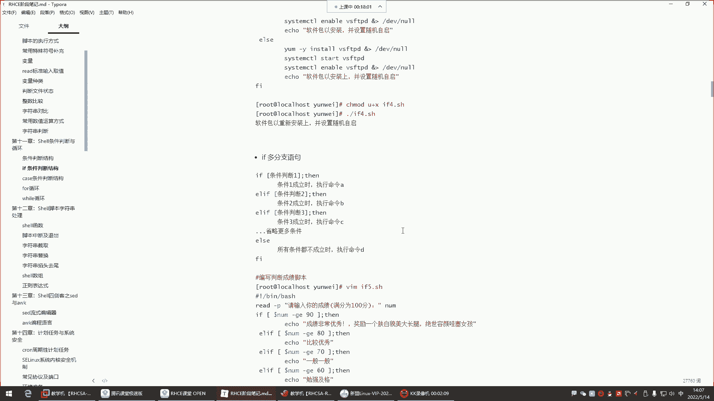
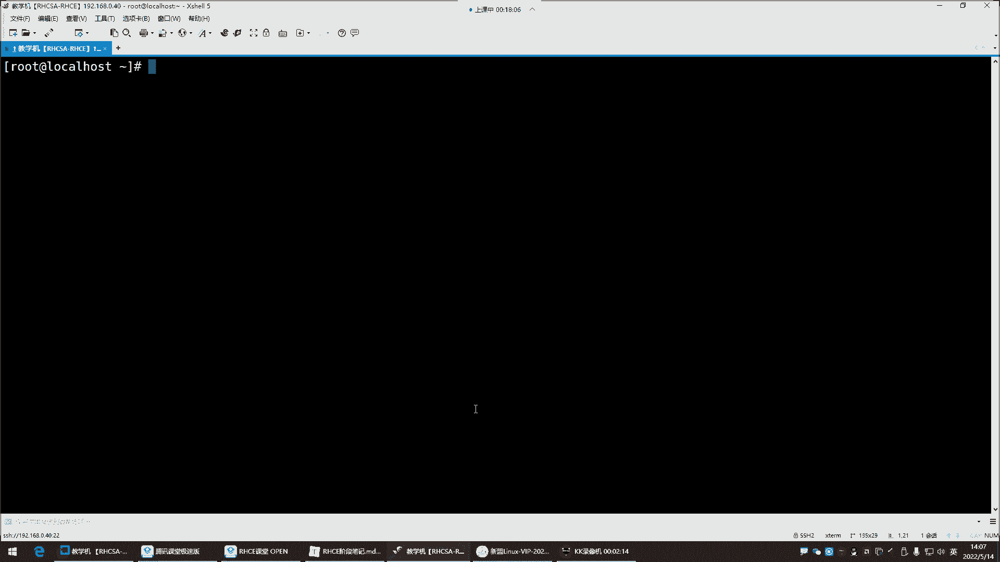
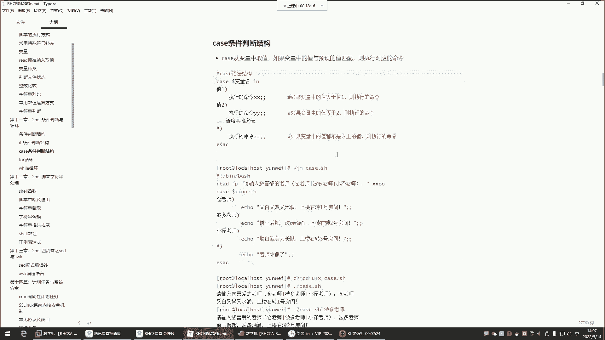
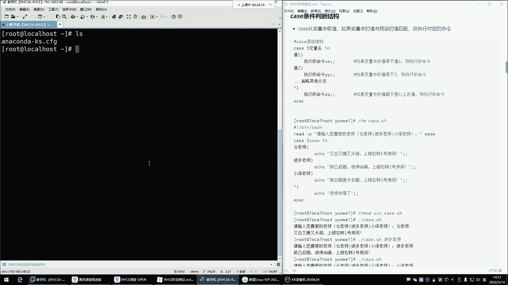
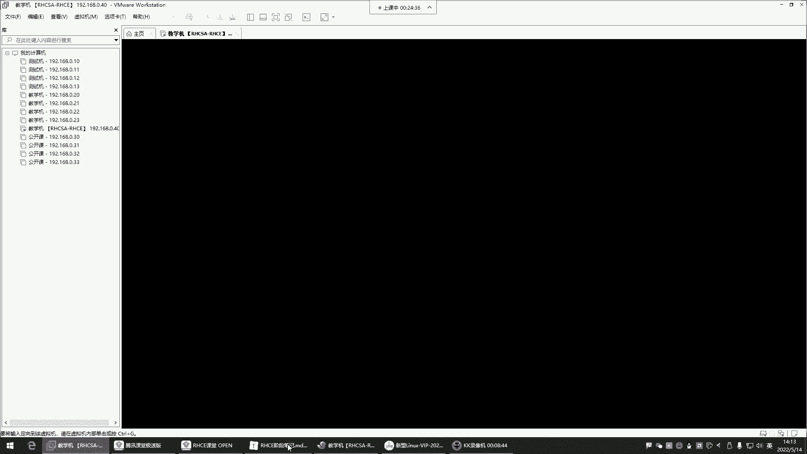
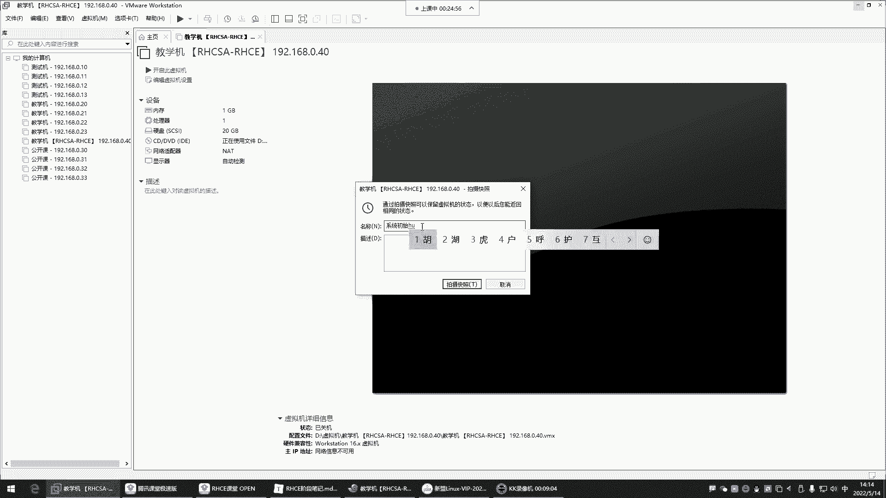
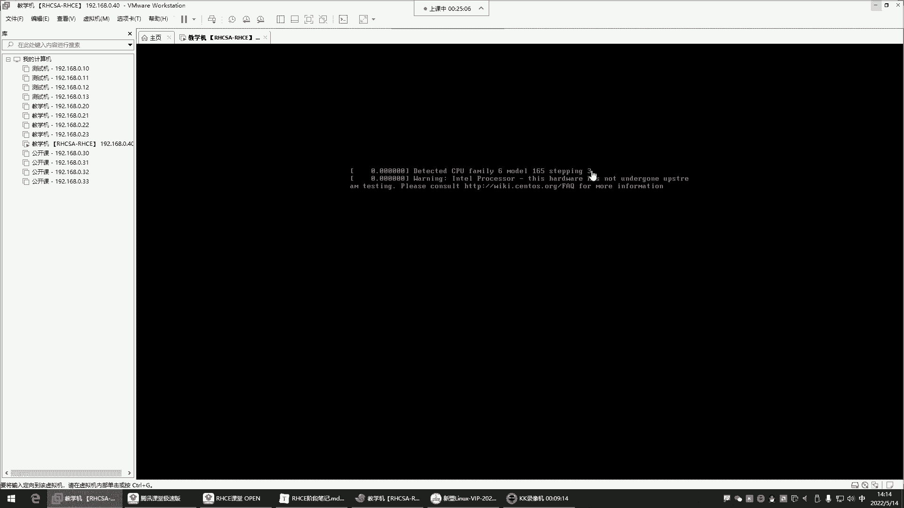
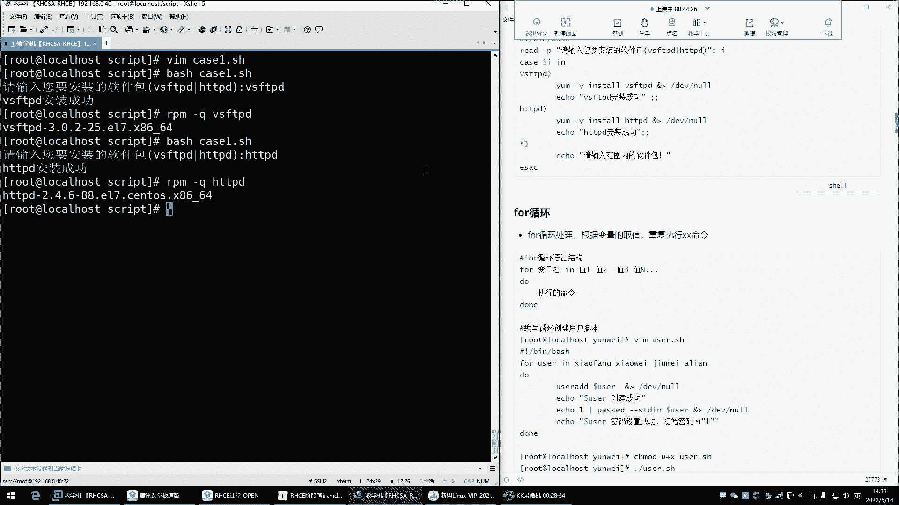
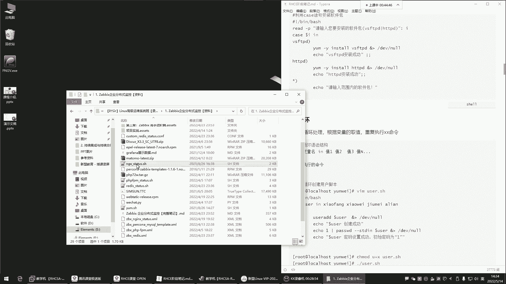
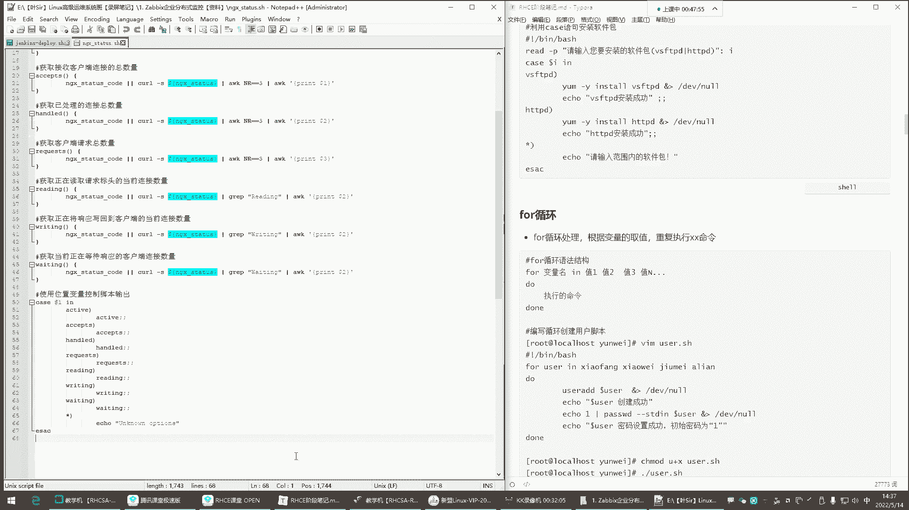

# Linux最全RHCSA+RHCE培训教程合集，小白入门必备！ - P43：红帽RHCE-7.case条件判断、for循环 - -Book思议8 - BV1ZV4y1v7c8

喂喂喂喂喂喂喂喂喂喂喂喂喂喂，好了各位啊，我们这个麦克风也OK了，那接下来呢我们就开始我们今天的课程了，是不是都很清晰啊，嗯来如果清晰没有问题的，再给我刷个一上来，我这边是都调好了啊，为什么呢。

主要是我这个换了个电脑，所以这电脑的话呢我得适应适应，我们别到时候讲课，讲着讲着没有录屏，OK那就话不多说，正式开始了，又赶上这个一个周末过去了是吧，我们又在这个业余时间啊，是大家的休息时间相遇了。

但是没有办法是吧，作为我们正在努力中的一个一些这个人呢，那就是我们没有休息的时间，我们没有休息时间，我们就是呃只有两个季节是吧，你只是努力的时候就是旺季，不努力的时候，你就是淡季啊。

所以现在年轻人呃有句话说得好，什么呢，就是20岁的姑娘风华正茂，是20岁的小伙呢穷困潦倒，但是这姑娘呢她不可能永远风华正茂啊，你呢也不可能永远穷困潦倒，所以我们你现在不努力的话，你以后也是穷困潦倒。

你现在努力，你以后能够永远都遇到20岁的姑娘，是不是啊，我们说没有20岁的姑娘，但是啊没有姑娘永远20岁，但永远都会有20岁的姑娘，所以我们就是为了那个20岁的姑娘，现在也要努力啊，拼了命的呵呵要努力。

今天可以讲完室友嘛，看情况吧，看情况，那接下来呢咱们上节课讲到哪里了，是if的分支是吧，嗯课前毒鸡汤没错，课前毒鸡汤，这样我们能够这个这个塌下心来来学习，你可以18岁，但你不可能永远18岁，没错。

我现在比较穷，但我也不可能永远都是这么穷，是不是，那接下来咱们就这个开始哈。

我们那个讲到哪儿了呢。

是条件判断，多分支我们也讲完了，是不是啊，然后多分支讲完了之后，我们这边开始给大家讲讲这个case条件判断。

那case条件判断，这边我这样哈，我们这样哎，这样看这样看就比较清晰一些，是不是啊，然后这个呢这样调这样调哎，这样大家可以既看笔记，然后又看到我给你们实操是吧，然后我们边操作边给大家讲讲。

这个思路就可以了，嗯好那这个时候我们先来说说这个case条件判断，哎呀这case条件判断跟我们前面讲的if条件判断，他们之间其实呢也是这个干的事是同一个事，都是做条件判断的，条件成立了。

我帮你做什么事情，条件失败了，我再帮你做什么事情，能理解吧啊对那么多老师是吧，那接下来我们呢就给大家说说这个case，它跟if之间的区别到底在哪里呢，case啊它的功能比较简单一些，它比较简洁一些。

没有if功能强大，但是它的应用场景呢啊一般呢怎么说呢，就是没有衣服会多一些，但是呢以后你看到衣服，看到case这种条件判断的语法，你应该要清楚，哎这是它是干什么用的，能理解吧，那他的风格是怎么用的呢。

case是从变量里面取值，如果说变量中的值与预定的匹配的话，则执行对应的命令好，那这个呀我们来看一看它下面的这个语法结构，case开头的是CASE开头，然后呢我们啊要从变量里面取值。

这时候呢你得定义一个变量名了，然后接下来呢in啊，in的话呢，就是如果这个变量里的值，跟我这个定义的这个值如果匹配的话，也就是说那变量中的值与预设的值，一旦匹配成功了。

那这时候呢我就给你执行这里边的命令了，好那如果变量中的值啊等于值一，他我们提前预定好的那个值，则执行命令，那这个命令可以执行多少条，这个呢看你自己的情况能理解吧，好那如果第一个值没有匹配怎么办呢，啊。

也就是说下面那个你看比如说我通过case干嘛呢，写了一个我们大家比较喜爱的一个判断，这个判断就是case我定义了一个变量，那这个变量看看，到时候呢这个变量里的值从哪来呢。

好我们可以从命令行里面去让用户自己去输入，也可以提前干嘛呢，定义好这个值，但是呢比较典型的就是我们可以让用户啊，你看你这个干什么用哈，比如说我们就随便了解这个语法，简单适应，适应这个语法的话。

我们就可以这样来一个re杠P，让用户自己输入这个值，然后我给他存到这个变量里边啊，那这时候对case里边我就得定义这个变量名了，也就是说在语法里边，我们通过变量名去干嘛呢啊，去匹配。

那这时候用户输入的值是不是在瑞的会被read，存到这个叉叉O这个变量里面啊，那这时候case呢就会取这个变量里的值，接下来呢他会拿变量里的值，跟我们提前预设的这个小括号里的值，去进行一个匹配啊。

那如果用户输入的值匹配成功了，比如说用户输入什么呢，输一个苍老师，那我这个里边啊，我这个预设的我预定的这个值也是苍老师，那是不是就匹配上了呀，那匹配上以后呢，我就给你执行这里面的命令了啊。

曹老师特点又白又嫩又水润是吧啊，在哪呢，上楼右转一号房间，那如果这个人他没有输入苍老师呢，那是不是就没有匹配的呀，那这条命令就不执行好，那如果这个人他比如输谁呢，哎他比较喜欢波多老师。

那他输的是波多老师的话，那这时候那我们看啊，再给他来个波多老师，那如果你看他说波多老师跟波多老师也匹配，匹配上了，那我就执行哎这个直隶的指令啊，波多老师的特点是不是啊，然后在那到哪儿啊，你去找他就行了。

那如果说他输入的这个值，也没有跟我们预设的这个波多老师匹配，那怎么办啊，比如他喜欢小泽老师，那人家输入小泽老师了，那这时候我们就让他跟小泽老师去匹配，能理解吧，这时候一匹配上了。

我们就echo这里的指令能理解吧，那如果说这个人呢，他并没有输入我们预设的这个值，怎么办呢，啊他输入一个，比如说那个谁呢啊，比如输入这个莹莹老师，哎他输盈莹老师，那这个时候嗯看看那输入莹莹老师。

这时候怎么办呢，那英老师没有在我这个预设里边，是不是啊，我没有指定英老师啊，哎那这时候这个星这个西装代表任意所有，那也就是说这时候就跟我的相匹配了，他输入什么都跟性匹配。

那这时候我就执行这个行里面的命令，我告诉你哎这老师休息啊，今天没上班哈哈，然后结束怎么办，结束就是ESC，你发现他跟if语法差不多，if是if开头，结尾呢是FI结尾是吧，中间就是我们写指令了。

而这个呢是什么呢，就是CACE开头，然后ESAC结尾，中间就是你要干什么事啊，这个比较有意思是吧，那咱们来啊，杨老师背，make dr建一个script目录，进了这个目录之后干嘛呀，我们来写个脚本啊。

让他叫什么呢，嗯就是这个这个叫case k4点SH啊，啊没有VM，我这个机器是新安装的系统啊，我们先安装系统，先安装系统的话呢，这样先拍个快照吧，先拍个快照啊，这新安装的系统，我先把那个目录也给删掉。

2M杠2F把那个根下的script目录也给他删掉，这是新系统。

啥都没干呢，刚刚安装好，然后呢我给他拍个快照，先给它关机，电源关闭，中间空格或匹配吗，空格不匹配哈，你这这与当然哈。

你这里边你搞空格，它有可能会报你语法一些问题，所以别搞一些空格，拍一个拍照，叫做系统初始环境。

初始环节拍摄啊，再开机，给他一下，让他快点快点开机。

OK然后我再重新连一下，重新连接还没开机呢哈，那我自己先下去啊，你看这样看起来比较清晰是吧，你看我们右边，我们右边就是直接看笔记，左边呢啊大家我在敲的时候，你也能明白是什么意思了啊，不然你有的时候呢。

哎我也不知道这东西你记不记得住，是不是啊，我要不给你说的话，可能你也不知道这个东西到底代表什么意思啊，所以这样啊我们右边看笔记，左边呢我给你们演示进到这个路径，然后呢我得按个包哈。

YM杠y in v i m，我这里边没有VM，没有正常价还是包子还是，然后你们如果有的同学啊，可能是近视眼，你近视眼的话呢，你把眼镜戴上好吧，你别告诉任陈老师，这字太小了，我看不清我这字啊是很大了哈。

所以有近视的同学哈，你把眼镜戴好诶，这怎么失败了，失败了是吧，那我们这个我这里边难道没有软件仓库吗，啊有仓库拼3W点，百度点看过，啊我这网卡好像有问题啊。

Etc c config network conscript，if cf g n s呃，看一下啊，On boot is，0。40241920168。0。2422，3。5。5。5，那没问题啊。

为什么为什么连，有点意思哈，有点意思，感冒是真难受难受，没事啊，DNSS我看是不是DNS问题哈，嗯再来一个1140。1114点，114114，拼，有点看过诶，不是DNS问题，这坏了，下不了班了呢。

嗯没事，自己搭一个吧，是不是我也用不到，他说白了，然后mt把DV的CDROM挂载到mt，把自己搭一个，etc ym点report sd blocal的rapport，就比如说你开发这个评书都学到。

你有很多，那肯定是，好安一个号啊，这个软件哪个年代了，还坐在，不是我，我是NET模式，AT模式哈，没事，这个网络问题我下我下期再搞它吧，我们课上先不管它，接下来呢我们来开始啊，Vm，点SH在里边。

井号叹号杠定下的batch，然后咱们直接把这个来拿过来放进去，然后在这里边大家看一下哈，这语法的话呢比较简单，像这种东西的话呢，你看哈，我们说这个前面瑞的杠P我们都知道怎么用，是不是杠P加些描述。

然后呢定一个变量，然后这个我们一般不是有中文了吗是吧，给它放到引号里边啊，这是我们放一个变量，这个变量里呢就是存的是用户在键盘上输入的，那个直接下来我们这个变量里面有值以后，我case开始判断了。

判断什么呢，哎判断这个变量里的值，如果跟我预定的这个值匹配了，这时候就开始echo这里的命令好，那如果没有匹配，那就开始继续往下匹配，但是也是从上到下去逐条匹配哈，第一条失败了才会去匹配下一条。

第一条成功了，下边的就不匹配了，能理解了吧啊，他是匹配即停止，一旦匹配上了，下边就不会再去匹配了，就停了，就去执行这里的指令，然后整个判断结束啊，他是这样子的啊，只有是前面失败的时候才会继续往下匹配。

一旦哪一条匹配成功了，那也是就停了，比如第二条匹配成功了，好执行第二条指令，接下来下面不会再匹配了，所以这是判断的一些什么特点，叫匹配及停止好，那如果这个谁都没匹配，接下来呢就执行心理的指令了。

OK那咱们来演示一下这个操作好吧，那执行这个脚本我们给不加执行权限了，这时候呢你看我们是不是提前告诉他了呀，哎你喜欢的老师都有哪些什么苍老师，波多老师，小泽老师是吧，那等一下你们还有喜欢的老师吗。

你们如果有的话，来我们也可以往里面加一加，是不是啊，你们有没有你们有没有喜欢的呀，啊可以给我发出来哈，最近有没有这个啊，这我就别往里写了哈哈三胜老师，嘿嘿嘿嘿，三上三上老师三这名字咋这么怪呢。

我我我听这个最近好像有个老师叫申田啊，这个名字我觉得也比较不错，说深田老师啊，说也比较出名啊，三上优雅是吧啊哎呦，三上优雅，那又嗯三上三上优雅老师是吧，三上优雅，深田老师这么多老师的吗。

龙泽还有龙泽老师呢，哎呀龙泽哪个龙啊，三点水的龙是吧，你看日本人的名字一般都带个三点水，是不是，你看你看人家日你看人家日本老师的名字，一般前面都有个三点水是吧，什么波多小泽是吧，还有什么龙泽之类的。

是不是啊，你看这两嘿嘿有点意思是吧，嗯嘿嘿嘿嘿嘿嘿表示什么意思呢，算了呵呵好，那接下来我们是不是那老师增加了啊哈，那是不是就得啥呀啊哈哈，就得继续玩血呀啊，那谁呀，哎深田老师嗯，深田深田深田老师啊。

括号接下来如果有人喜欢深田老师，我echo是不是echo，那深田老师特点是啥呀，嗯这是可能是靠海是吧，对这靠海可能说这个对，靠海都有个三点水那接啊，对这特点是啥呀，这深田老师啥特点呢，我不知道。

我不是很不是很清楚是哪，哪方面比较优秀一些呀，然后那你们先想着哈，然后你们因为我不知道我没看过呀，然后我下面再写一个啊，叫三上优雅啊，老师啊，这特点都是啥，到时候你们给我发过来哈。

不然我不知道啊啊还有谁呢，还有那个这个是龙泽嗯，东子东子老师，然后echo啊，这老师的特点是不是啊，深深田老师，深田老师是吧，功夫就这我觉得这词汇有点太傻了，是不是啊，嗯这这虎狼之词啊，铁杵磨成针。

这虎狼之词是不是铁杵磨成针，这这这行吗，这别给人吓坏了啊，嘿嘿这别人一看这老师是不是这太可怕了，不敢选了，对于雅老师是吧，性格温柔，性格温柔嗯，性格温柔，然后呢这个这个声音甜美，对声音啊。

不是不是这这怎么呻吟了，声音甜美，不是这不是呻吟哈，是声音甜美，打错了声声音甜美啊，然后这个还有什么龙泽是吧，那龙泽啥呀，那龙泽就是这个体贴温啊，这个细心是吧，哎细心嗯，嗯细心，那那什么呃声音甜美啊。

也是嗯声音甜美，然后诶细心细心，然后这个温柔行吗，喜温润啊算了，温柔吧啊这温润这种词我我觉得太傻了，是不是温柔好，OK就这样行吗，嘿嘿打错了还深吟温柔，深吟甜美是吧，这这词儿怎么能出现呢。

接下来我们来演示一下哈，来看一下这个执行脚本了哈，BT然后执行这个kiss回车，他说哎这一看哎呦这这么多老师是吧，那我们感觉瞬间就幸福太多了，嗯啊龙泽老师打错了啊，龙泽让我看一眼哈，龙泽老师错了吗。

啊这个不行，少了三点水，那没有灵魂，那不行哈，那没有灵魂，龙龙三点水，对这个龙哈声音甜美，然后呢这个细心温柔，然后还有什么呢，还水润啊，还水润，还水润是水润，OK这OK对，太幸福了，执行一下case。

点SH回车，那这时候一眼望去，哇塞这么多老师是吧，都不知道选，不知道如何选择了哈哈，那不知道如何选择怎么办呢，啊我看一下吧是吧，我们这个数一数这个哪个呢，这个小泽老师是吧，比如说喜欢小泽老师。

那我就输入是不是那图，那按住CTRL再按回删键，输入中文哈，CTRL回山中文，中文好，Control，回山好，小泽老师好，回车哎呦，他说哎啊，他说什么呢，他说好像什么语法有错误是吧，那我看一眼哈。

这怎么能语法错呢，他的第14行左右看一下第14行啊，他说龙泽老师这好像有点错是吧，那我们看看哪儿错了哈啊，这中括号变成中文的了，看到没中括号啊，别搞错了，这是英文的好，然后嗯其他应该都没啥了哈。

这些三上优雅是吧，英这是英文的啊，这也是英文的，OK保存，然后执行回车啊，这时候再选小泽老师嗯，回车啊，他说语法有错误是吧，他什么三上优雅错了，这为什么呢，错了啊，这里边来注意一个细节哈。

嗯对这时候你们又开始问了，这两个分号干嘛的，哎我告诉你这两个分号代表你的语句结束了啊，所以我们这个位置呢他说语法有错误，是因为我没有这个双3号，没有双份号，他不会认为你的语法是什么呢，是结束了。

唉所以这里边不要忘了双分号，看到了吗，哎你命令结束要双分号，那你说我这里面要有很多条命令呢，很多条命令只有最后一条命令才加双分号，知道吧啊比如我这里边啊好多条命令，好多条命令哈。

你比如上面那个我把这个命令给它拆成两条，可以吗，可以echo，但引号在这啊，OK但是你看了吗，比如说我有很多条命令，那这时候只有最后一条命令才能放这个双份号，代表啊，我这个里的语句结束了，知道吧。

OK然后下边我们没有双分号，所以他说你的语法有问题，这也是大家刚刚在写这个脚本的时候，你们错的还不是逻辑呢，是啥呢，哎是语法啊，你会写着写着你就记不住了，这语法这个它的具体的格式啊。

接下来再来执行回车啊，这时候再选小泽老师哦，这是我们选择深田老师吧，最近新出道的是吧，照顾一下回车啊，深田老师铁杵磨成针，哇塞这太可怕了，算了，还是不要选择这个深田老师了，这太吓人了是吧，换个老师吧。

呵这呵呵，这谁敢选呢，是不是还是小德老师吧，一看这名字就挺不错的是吧，回车啊，小泽老师，你看哎小泽老师的特点是什么呀，肤白貌美，大长腿是吧，上楼右转3号房，那再看看别的了啊。

看看这时候性质突然间上来了是吧，想看看其他老师，波多老师啊，这种回车啊，葡萄老师前凸后翘是吧，波涛汹涌，2号房上楼右转2号房，那对被众多老师蒙蔽了双眼了，现在已经哈。

你看现在已经疯狂选择了三种营养老师啊，回车那性格温柔，声音甜美，是不是啊啊这个还差点没写错了，呻吟甜美，这呻吟不行哈，嘿嘿嘿嘿嘿，然后再选啊，龙泽老师是吧，龙泽老师们看怎么样哈，龙头是会车。

哎哟血是声音甜美，细心温柔还水润啊，这个哈哈这个真的是太幸福了哈，我们觉得那如果我们选择一个其他老师呢，哎有的人比如说喜欢莹莹老师啊，这可能说哎暗恋莹莹老师已久了啊，看看莹莹老师在没在里边是吧，回车哎。

那这时候你发现诶这个怎么输出，一个什么老师休假了是吧，为什么呀，因为啊它跟星匹配了，在这里面哈，他给他以上他发现啊，哎这用户输入的这个值啊，就或者说这个变量里的值，它呀没有载我预定的这个括号里边找到他。

没有找到，没有找到，怎么办呢，哎没有找到，那我就干嘛呢，跟星匹配了，哎星可以匹配所有，那这个里边啊我们就可以随便写，看到了吗，星象休息，老师先休息，那比如说哎呦还有人喜欢谁呢，喜欢木木老师。

木木老师也是那走路带风的那种哈，回车唉，这一木老师今天也休息啊，对没有，没有描述是吧，这嘿嘿算了，别描述了别描述了，哈哈哈哈好，那下边那你说我们除了可以这样玩，还可以怎么玩啊，啊还可以这样。

比如说啊我们想安装软件包，那这时候可以利用case语句，比如说想做你想做的事情，那这时候比如我们case点case，然后这个一点SH接下来干嘛呢，来看一下这里面哈，这里边井号叹号杠并一下的batch。

哎这里边可以玩什么呢，安包看到了吗，安包这个跟前面其实是套路是一样的，注意哈，在这边我们来看一下，上来我先干嘛呢，先让用户请输入你要安装的包，那这个包你得先告诉人家，我可以帮你安装哪些包，看到了吧。

哎我可以帮你安装这些包，嗯啊什么VSFTBTHTTP，我都可以帮你按，那这时候啊用户比如说我想安装vs FTP d，那是不是他就得输入那个VSFTPD啊，是不是啊啊，那这个时候我们呢。

唉把他的这个输入的值存到这个变量里面，接下来我就开始case判断，那case判断干嘛呢，判断这个变量里的值，如果是vs FTP d干嘛呢，我就给你执行这个里的语句了是吧，执行什么样哎YM杠Y。

因此我给你按这个包啊啊按完以后呢，输出结果我也不让你看，我就直接告诉你这个包啊，安装成功了好，然后那如果用户他没有输入vs FTP t呢，啊用户他想安装的这个包HTTPD。

那这个时候哎我们就跟这个预设的值匹配了，这时候我就帮你按这个标，是不是按完以后呢，我也不让你看，结果我就告诉你这个包安装成功了啊，那如果用户输入一个包不存在啊，随便输入一个什么ABCD，那这个时候没有。

是不是啊啊，那我们这时候就干嘛，哎告诉你跟相匹配了，你输入的啊，请输入范围内的软件包，我可以帮你按，那这时候比较有意思来看一下，那现在执行一下啊，这个脚本推车请输入你要安装的软件包。

比如说我要安装vs FTP d好回车，vs FTP t安装成功，真的安装成功了吗，rpm杠Q当q vs FTP t回车，这样能成功的是吧好，那我想安装的不是这个包了，我想安装谁呢。

我想安装HTTPT回车哎，HTTPD安装成功是不是哎，那我看看真的安装成功了吗，杠一杠Q杠QHTTPT哎，真的安装成功了，是不是，哎对有点意思，是不是啊啊这就是case语句，那这个片子语句，这个。

如果后期大家在什么时候，还能看得到他的身影呢，啊我给大家找找这个K4语句的一些脚本哈，啊把这拿走哈，这东西看下事。

工作文件分数根据各个单位的程序来，其他啊，在后期呢在讲扎克斯的时候，大家也会看到他的身影，扎克斯这里边呃有很多的脚本，这里边来给大家看一下。

这个脚本的话呢，是后期呢我们在学习这个监控的时候，我也会发给大家这脚本啊，这个脚本是判断什么呢，判断他的状态页面的判断状态页面，那判断状态页面上边的话呢也是这个位置啊，我们现在还没学。

这是一个什么格式呢，叫数组，叫数组哈，数组是什么呢，后期在讲的时候，就是它就是一个给一堆命令定义一个别名啊，然后这里边可以定义命令，可以定义if判断好，这主要就是访问页面啊，看页面的状态，访完以后呢。

干嘛呢，我就开始去获取访问那个状态页面的一些结果，里的一些指定的关键字啊，这都是数组哈，然后下边啊这叫数组名，看到了吗，这是一个名字是吧，那这个名字后期可以干嘛用呢，你看这个名字里边是一条命令。

是不是啊，那就说哎以后我想要去执行这条命令，我可以直接干嘛呀，直接调用这个名字就可以了，哎我一调用这个名字，他就帮我执行这个名字里面的这个指令了，是不是啊，那下边诶那我这个名字定义好了之后，我怎么用呢。

哎这个名字啊，我可以给它赋到哪呢，哎附到这个case里面去啊，case看了吗，然后每到一哎这每到一是什么呀，位置变量是吧，位置变量，那这个位置变量里面存的，是不是就是我们在执行脚本的时候。

在脚本后面输入的那个值啊，没错吧，我们在我们后边，比如说我这一个脚本这什么叉叉点CH，那这个脚本里边这个每到一，是不是就是我们在脚本后面输入那个值，什么值呢，哎比如说我输入一个A。

那个A是不是就会附到这个每到一里面去，但是我们现在输入不能输这个A了，输入什么呢，哎输入前边的这个数组的这个名字啊，这个名字我一输入，他就帮我执行这里的指令，是不是啊，那这时候没关系。

那case判断他会帮我把我在这个执行脚本的时候，输入的这个值，比如我输入一个阿根廷五，那阿根廷我就跑到变量里面去了，好，那接下来它会通过什么呢，它会通过这个变量里的值，跟小括号里的预定义的值去给我干嘛。

去给我去判断，哎那这个判断如果一旦是真的是匹配了，我输入的也是active，那我这个里面定义的也是active，他就帮我执行这里的语句，Ark tive，那ARTIVE是什么呢。

active就是上边这个数组名，那我一调用数组名，他就帮我执行这里的指令了，唉这玩意儿你看在后期能用得到，能用得到，能用得到哈，就是就是获取从变量的取值做判断啊，判断成功以后，我就帮你执行什么命令啊。

结合后期学的数组可以结合使用，所以这种东西你看到别人的脚本。

