# Linux最全RHCSA+RHCE培训教程合集，小白入门必备！ - P46：红帽RHCE-10.shell函数、脚本中断及退出、字符串处理 - -Book思议8 - BV1ZV4y1v7c8

喂喂喂，OK好，那正式开始了哈，我们来说说这个我们怎么利用这个VIVO循环，就是我们有的时候会需要这种view循环，去持续的去帮我们做一些事情，注意啊，就是我们是就是很多的情况下。

就是用的这种view循环，比如说对于网卡的流量的监控，我的内存CPU的监控，那这些我是要持续监控它的，那持续监控的话是不是就没有头啊，好那这时候是井号叹号，在这里边来井号叹号，井号叹号杠B下的BTCH。

那这个怎么写，我想监控的网卡流量，先把语法写出来，will冒号啊，还有一个叫true true的话，也是while循环的里边的一种语法格式，true也一样，will true也是死循环，然后冒号也一样。

所以冒号比较简单一些，你们以后看到别人什么true的话，你就知道它也是view循环里面的一个死循环的，表示方法好，然后接下来do当里面的语句，我现在想监控的网卡流量，我怎么样才能监控啊。

我是不是得先知道我的网，我是不是得先获取我的网卡流量啊，好那下边这个获取的话呢，来看一眼这个机器好慢呐，我这个机器我觉得他有点问题哈，192等于8。0。40，就是0。40，这个机器一会儿不能用了。

下课以后给它删掉，好来啊，看if config，然后ENS32，看网卡是吧，好没有，命令YM杠y install那个命令，那个包叫什么来着，那个网卡就是if卡费的那条命令，记不住是吧，自己搜一下。

搜谁呢，So if configure，唉，这怎么没搜出来呢，没有搜出来是吧，没有搜出来啊，要么这有点尴尬了是吧，他说没有找到，那ym guy in套那个包叫net gun pos，是不是叫这个名字。

好像是对，就这个哈，然后这个时候呢你看他没有搜到，这很怪异，是不是在敲if config回车，这样就有了，但是我只看ENS三十二六十网卡，那现在就只显示ENS32好。

那接下来这块网卡现在显示出来哪些是入口，男人出口前面讲过，是不是RXP的这个位置代表着入口的流量啊，是不是啊，好然后这个TXP的代表是出口流量，那下面这些呢是什么一些错误的啊，这个呢我们不用管。

我们就看正确的，我的入口流量跟正确的出口流量的数据好，那这时候我现在通过if config可以获取到了，那接下来我怎么把这个数给它取出来啊，是不是啊，好那这时候干嘛管道给给我过滤过滤什么呢。

过滤RX顾虑他啊，诶怎么没有呢，GRP加引号，回车这就可以了哈，哎这是这是入口流量啊，那这个数出来了，是不是啊，你看这入口流量的那出口流量，那是不是也是同样方法呀，那就换成TX回车，这出口流量好。

那两条命令来拿过来，这是入口流量，这是出口流量，出口流量，OK那接下来我是不是就可以干嘛呀，去看一下死循环，他给我执行的效果呀，好BT，回车诶。

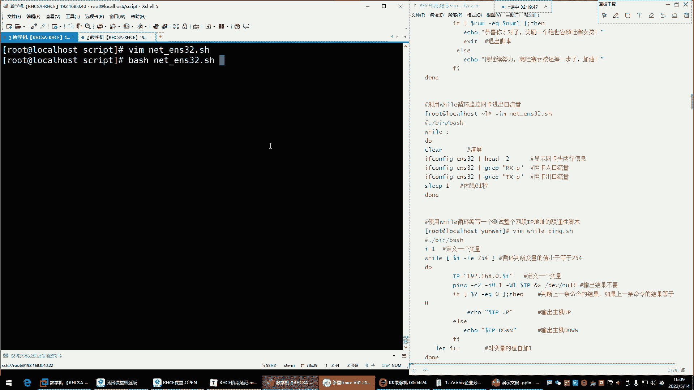

你看一直循环着呢，一直给你输出这个网卡的流量。

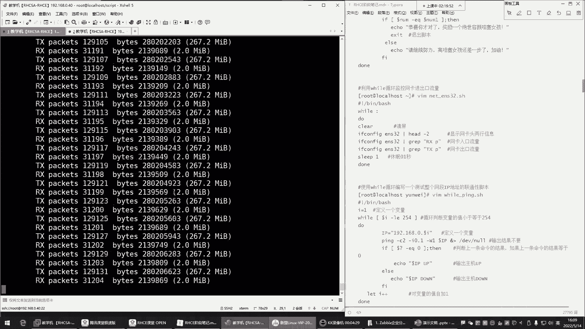

但是我告诉你，这个死循环特别消耗你的CPU，如果他一直循环下去，你top看一下你的CPU，这个值一会就标上去了，他是非常吃CPU的啊，现在0。52了吧，如果前面那个数达到一。

是不是就一个盒子CPU负载就百分百了，好看已经0。8了，看这就看这就行，0。91了，看到了吗，马上了1。0，你的这个CPU就超负荷，是一个核的CPU就超符合了啊，完了啊，出现一个僵尸进程，看到了吗。

诶嘿嘿，刚刚这1。0了是吧，你看一达一达一达到1。0，他说出现一个什么僵尸进城了，因为你的资源不够用了，资源不够用，你的某些进程没有没有CPU资源，那他就变成僵尸进程，CTRLC结束掉。

哎呦结束不了了哈，好了可以了哈，这时候能够明显感受到是不是死循环，特别喜欢你的CPU啊，现在一点点下来了哈，马上下来了，所以说对于死循环的话呢，我们一般让它慢点，别执行，太快了，太快了不行，干嘛呢。

哎在这个循环里边加一个sleep，让他睡一会儿，睡多久呢，睡个0。2秒，睡个0。2秒，可能对于我们来讲跟没睡一样，不就是眨个眼的功夫吗，是不是，但是对CPU来讲，你看这速度就慢了，看到了吧。

这速度就慢了，你这边再通过top观察一点影响，没有一点影响都不会有的，好这就是我们所说的死循环，你看这CPU降下来了吧，一直在往下降。

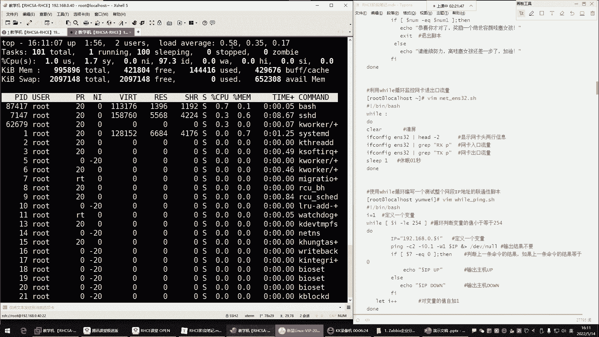

但是这种话也不行啊，搞得屏幕满屏都是，你这说白了我们怎么看呢，是不是这没法看。

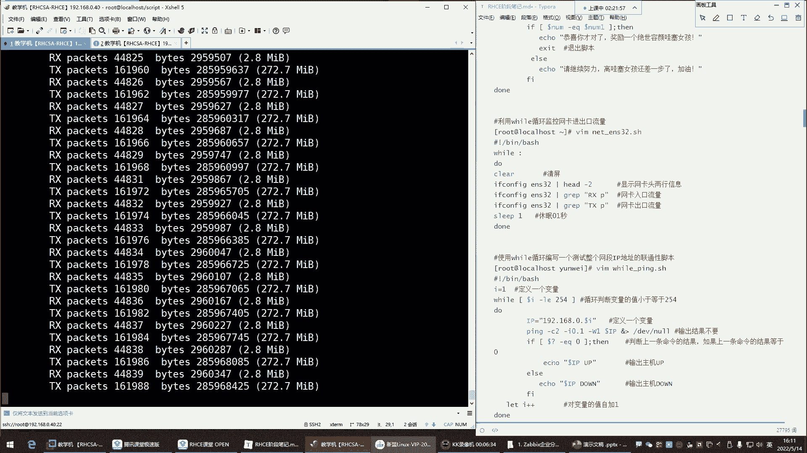

所以这个脚本现在不完善。

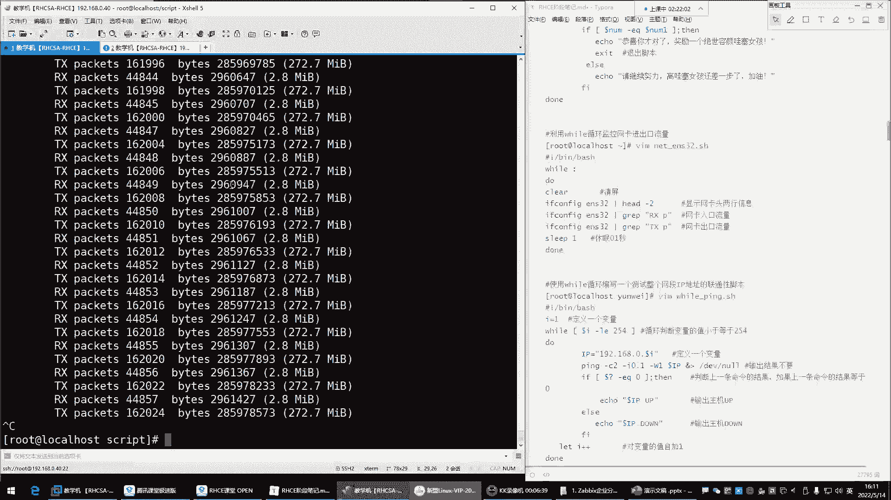

他是我们这个一直在什么呢，在循环输出我这个网卡的入口流量跟出口流量，但是光这样是不行的，光这样不行哈，我们要干嘛呢，嗯我们要就是让他清晰明了地展示给我，这有点难度了哈，这不清晰啊，是不是啊。

你看就像我这种方法，你这样，你这不清晰啊，显示的玩意儿，那怎么玩呢，哎上边清个屏上来，我先干嘛呢，先克里尔clear叫清平，而这时候我们再看BH，这样就可以了，唉他每次只显示什么呢。

哎就是每次循环的时候清个屏，切完屏我再给你去过滤啊，每次过滤之前清平哎，然后显示完以后再清屏，这样我就可以持续的关注啊，我当前的网卡的入口流量跟出口流量，看看到了吧，看后面就行，我的入口流量2。8兆。

出口流量270多兆，是不是啊，这样可以哈，这样可以，OK这是view循环呃，然后接下来的话呢，我们这对VIVO循环后期还完善哈，现在先大概有个了解就行，有些东西你需要持续监控的东西。

可以用VIVO循环来帮实现，VIVO循环一直帮你去什么呢，去循环你这一堆命令啊，你给什么命令，他去你循环什么命令，这样适合一些持续的一些这个工作，那接下来我们再来说说下面的这个view循环。

也可以像for循环一样实现一个什么呢，叫做测试整个网络的IP的连通性，那这时候测试网站灵动性，如果说你用死循环的话，你是一定要告诉他要控制它的数字的，但一般我们对于will循环来讲。

没有必要去什么去用它去实现一个什么呢，就是一个for循环的功能，因为他们两个，你如果真的是想是去这个拼网络的话，咱们就不用VIVO循环了，用for循环，所以这个大家可以作为自己的一个什么呢。

一个参考了解一下，开了录屏，开了哈，好OK啊，这是这个VIVO循环，所以大家简单聊一下就行好，下面呢我们再来这个给大家说说，这个脚本的一些字符串的处理，什么叫字符串处理，这第一个就是脚本里的函数了。

函数在室友环境当中，将一些需要重复使用的操作定位，一个叫公共的语句块，即可称之为函数，所以我给大家一个通俗的解释，就是给一堆命令取一个别名，我们前面学过阿里纳斯是阿里亚斯啊。

阿里斯这条命令呢就是给命令起别名的，H等于host name h诶，阿里14HN等于host name啊，HO哦，ho回车是吧，那以后我敲ho是不是就是看我的主机名了，就等于执行这个命令了呀。

但是ALEX他一次只能给一条命令定义一个别名，而我现在需要很多命令，比如说就拿刚刚那个脚本里的那一堆命令来说，VIM我们刚刚是那个脚本叫什么来着，是net e s32好，我现在想给这几条命令。

就这两条命令定个别名，可不可以拿过来，可以怎么玩呢，哈哈两种定义方法，第一种你要记一个单词叫function啊，单词后边呢加一个名字，这就是函数名，给你的函数取个名，接下来就是你这里面的具体的命令。

这命令你可以写多少条，看你自己的需求，function函数名，比如说net e n s32，然后大括号开头回车，这里边显微镜大号结尾回车定好了，接下来net e n s32回车，诶。

你们现在感受到它的功能了吗，啊你们现在理解这个函数它的具体作用了吗，这就是函数名，我以后我再想看我网卡的入口流量，跟出口流量的时候，我执行谁呢，我执行我的函数名，function定义的那个函数名字。

函数名字里面是什么呢，就是一堆的命令，你这命令是什么，没关系啊，是什么都行，只要你想实现的那个目的，你就写什么命令，那接下来你在需要什么呢，需要调用的时候，哎你就干嘛呀，你就来直接输入函数名。

他就知道了啊，原来你要调用这个函数里的命令了，所以就是什么呢，函数可以使脚本中的代码更加简洁，增强易读性，提高脚本的执行效率。

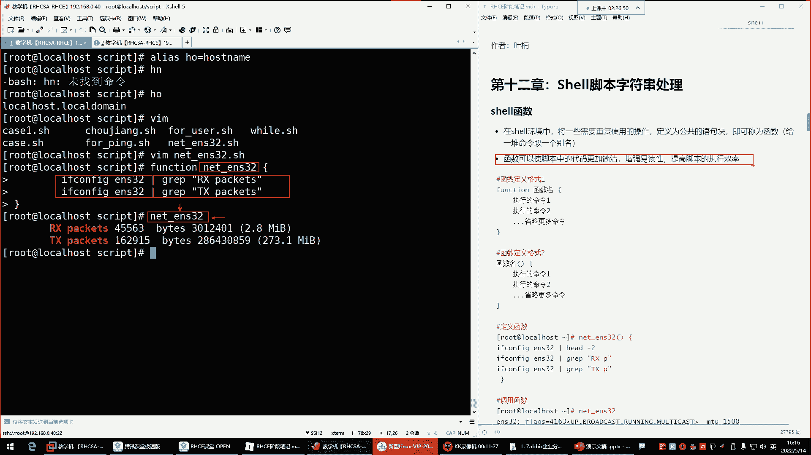

就像我前面给大家看的那个脚本一样，那个脚本不就是什么呢。

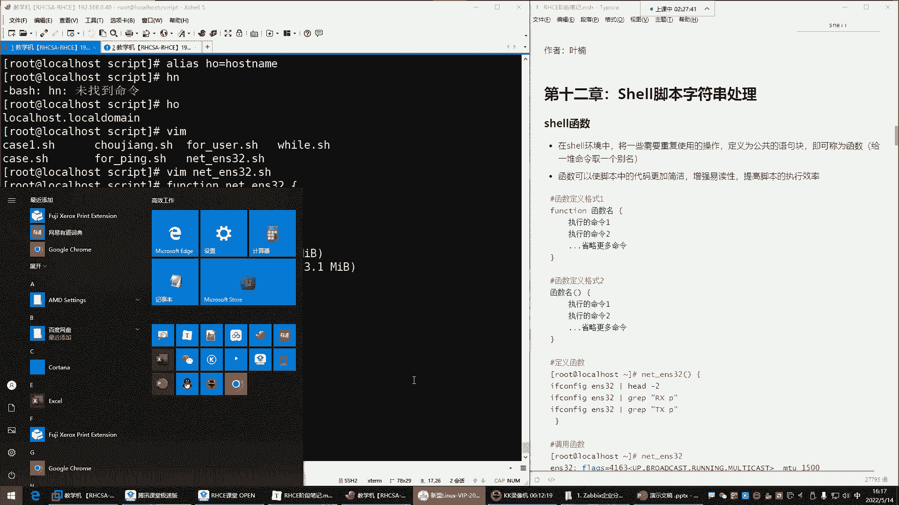

不就是里边用到了函数了吗，这个里边，但是我们现在也没有学习N这个字，所以也没学什么服务，所以这个东西呢我们现在了解一下就行，这里面就一堆函数函数的名字看了吗，函数名字，那么它的函数名字。

怎么跟我们的函数名不一样了，函数名字怎么函数名后面怎么是一个小括号呢，哎这是第二种定义格式，函数名，小括号这种你不用记这个单词了，所以一般呢我们比较喜欢第二种语法格式，函数名。

只要你就知道名字后面来个小号就行了。

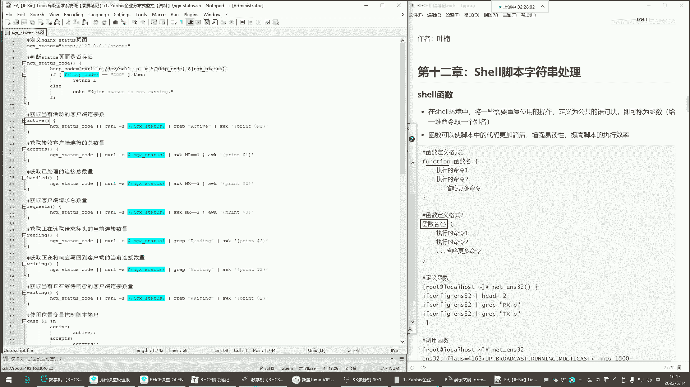

你看像他这种哎函数名，比如叉叉OO这名字哈小括号，然后空格再来个大括号，把MEI往里面写，这是我要执行的两条命令，第一条写进去，第二条写进去是大括号括回，注意啊，你的命令是写在这个大括号里面的。

所以这个括号是成对的，你不能是一个大括号，能理解吧，你大招扩回的时候，你一拍回车，他就知道你要定义函数了，然后你再敲叉叉啊一样，所以哪种更加方便一些呢，肯定是第二种，你不用记这个单词了。

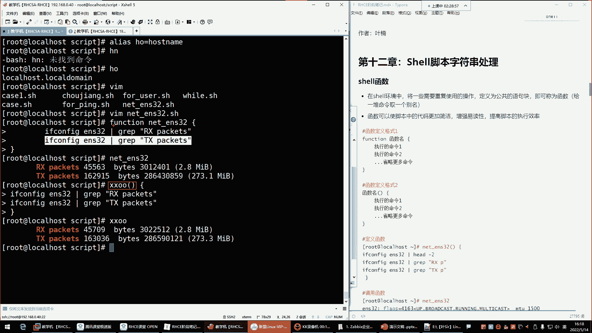

是不是啊，然后下边在这，你看他不就这么玩的吗，它就是什么呢，哎它上边在这个位置哈，那这是一个函数名，函数名里面这一堆命令有一符，判断是不是干嘛呢啊，用这个Q是命令行的浏览器去访问什么呢。

访问他自己的这个变量名里的这个什么呢，这个地址这里面引用了一个一个变量名，叫N这个塔的看了访问这个变量名里的地址，就等于说上面这一堆命令是干嘛的，访问这个地址的，好，访问这个地址。

然后看这个地址它的状态是不是什么呢，是不是这个可以正常访问的啊，如果是，如果是running的话，那下边那就干嘛呢，这也是一堆函数，函数名是函数名，里边是命令，那命令的时候它调用了什么呢。

又调用了函数了，那这个函数里边，你看也就是说他以后再需要去执行，这里边的一堆命令的话，它不需要在每个函数里边都去敲一遍，这么复杂的命令了，干嘛呢，唉我以后通过函数的名字。

就可以直接调用这里边的这一堆命令，所以说它直接啊，在函数里面又调用了函数的名字，那也就等于说，唉调用了我这个函数里的众多的什么呢，命令了，看到了吧，唉我就调这个函数啊，这或者是吧，这不是或者吗。

两根竖线或者啊，也就是说这个命令如果执行失败的话，上边在干嘛呢，唉再去访问这个页面，或者嘛两根竖线或者前面命令执行失败了，后边扣杠S就访问谁呢，访问这个地址，把这个地址，啊这判断页面是否存活。

然后接下来后边过滤啊，从这里面各种过滤啊，但这里面还会涉及到一些AWK哈啊，这你先不用管，你就知道函数你一旦定义好了之后，唉我就干嘛呢，把所有的命令定义到这个函数里边，然后接下来我需要用的时候。

我下边调用就行了，你看它每它每一条命令里边都调用了什么呢，那个函数了，那如果说你不调用函数，你这脚本是不是你需要这一堆命令的时候，你都得去在下面去敲一遍呢，麻烦非常之麻烦，是不是啊。

嗯所以的话呢呃对于这种的话呢，我们一般就是，它可以让你的脚本变得更加简洁啊，这样你看起来哎感觉人家脚本写的挺不错，是吧啊没错，这就是我们说函数，它就是让你的代码更加的简洁了啊，增强了我们的意毒性。

就是你不用看起来感觉乱乱的，提高脚本的执行效率，那在这里边你就知道，然后函数以后呢，定义好了函数之后，想调用函数里的命令，你直接在函数里面也可以调用，然后下边也可以干嘛呢，一旦定义好了以后。

再这个判断里面也可以调用，看case语句里面我也调用了什么呢，哎也调用了这个函数名，在这呢看了吗，函数名一定要用这个函数名，他干嘛，他说给我执行这里的命令啊，那这里的命令其中有这个函数。

是不是他也会去帮我执行这个函数里的，上面的这部分命令啊，没错吧，所以这里边很多东西，函数就是让你的脚本变得更加简洁，就像变量一样，说白了就像变量一样，如果变量你在定义的时候。

你这一个变量里边你只能定义什么呢，定义一个值是不是，那这里边你可以放命令，反撇里边可以写命令是吧，那只能定一个呀，而函数不一样，函数下边你可以定义无限，可只有一种需求，这是我们所说的函数啊。

这种东西你只要以后你看别的东西，你能看懂就行，现在不需要说你自己能够写出这个，就是这样的脚本，因为根本不可能，你只要能够看得懂这里边啊，这是函数函数里面有一堆命令，然后下边这一堆命令它干嘛呢。

哎他下面又定了一个函数，然后这个函数里面又调用了上面的那个函数，一调用它就执行上面这个命令，能列吧，一执行，而执行完以后呢，那这个就执行里面这个语句呗，这里面的一堆语句好。

下边你看这个函数里面又调用了上面的函数，又调用了它，那它里面的命令，就会再在这个函数里面再执行一遍，是这样的，好这是函数，所以大家知道一下哈，哎知道一下哈。

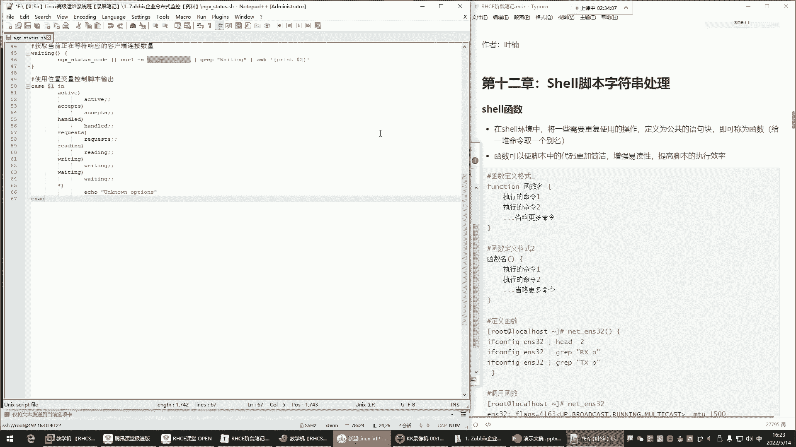

那了解了它的功能了吧，了解了吧，这个现在不需要你自己能够写出来，那么一个怎么说呢，非常规整的一个脚本，能看懂就行啊，那我问你们，你们现在能看懂吗。

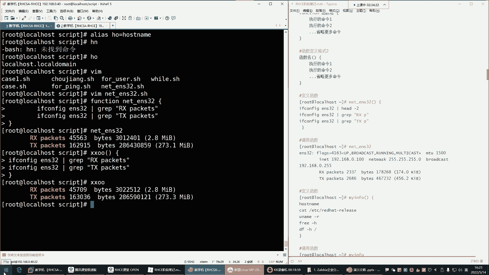

啊就刚刚我跟你们说的这个能看懂吗，就大体这个结构能看懂吗，看懂的给我刷个一，看，不懂的，刷个二上来，你能不能看懂它，这里面比如说每一部分，这是在干嘛，这是在干嘛，这是在干嘛，有的能看懂，有的看不懂是吧。

啊现在我现在也不希望你能够写出来，你就能看懂就行，是不是，没关系哈，没关系，这玩意有啥不好理解的呀，没有啥不好理解的，我们前面学过这些，或者是不是或者或者就只有前面命，只有前面那个命令失败的时候。

才会执行后面命令，那这多好理解啊，就是说你看这个函数里面定义了这个这个函数，这个函数里面干嘛呀，不就是去不就是这个里面的命令吗，这个里面的命令去给你访问这个地址，这个地址是谁啊，就上面的那个这个地址。

然后发完以后呢，那主要是干嘛呢，如果他失败了，注意哈，如果他执行失败的话，下边呢我们自己再去扣杠S，再去直接不通过函数访问了，干嘛呢，我自己去访问这个变量，第二次我自己去访问了，因为怕前面访问失败。

所以说呢这里面来个或者那里吧，来个或者那如果你看他如果他失败的话，后边再去我们自己访问访问的话，那直接后边这个命令给管道吗是吧，过滤这个页面里的一些关键字啊，结合AWK做过滤，是不是啊。

对这里边就是众多的函数啊，对这就重度各种调用哈，各种调用，所以这个需要什么呢，需要你慢慢去研究研究看一看，这里面无非就是各种变量名，函数名是吧，函数名这里边，然后下面case语句，case语句啊。

case语句里边，这不就是我们的自己的定义的值吗，是不是啊，这这里边的值是什么呀，哎如果只匹配成功，就执行函数，一执行函数就等于调用了上面的这个函数，里的命令是这样子下去可以自己多看看哈。

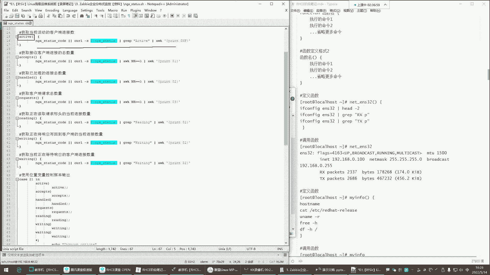

没关系，这脚本到时候发给你们，现在用不到，现在用不到啊，现在用不到，后期用的到。

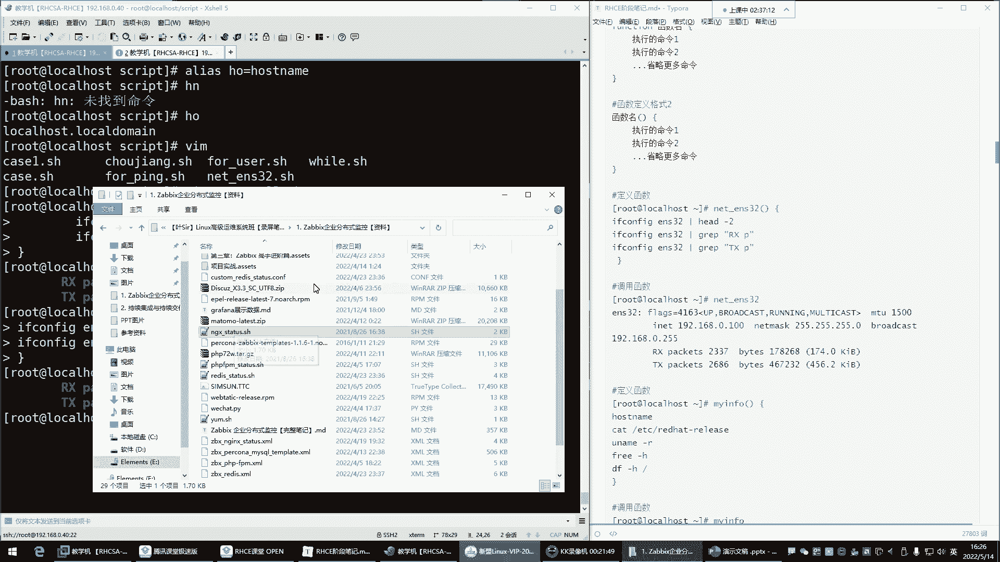

到时候发给你们看一看，好这是函数，那对于我们现在来讲呢，你就知道就是一堆命令的一个什么呢，一个别名给一堆命令取个别名，是放在脚本里的哈，我们一般在命令行里面不定一晚上，这玩意儿不是在命令行里面定义的。

在命令行里面定义没有任何的意义，命令行里面定义有啥用啊，是不是，但是放在脚本里面能够让脚本变得更加简洁的，但是你最主要要理解它就是什么呢，就是可以帮你给一堆命令取个别名，拿脚本里边各种调用就行了。

各种调用，OK然后没啥了，你比如说像这个啊，我想看我的主机名，看系统的版本，这比较简单，就是这个函数名，那么叫什么呢，买inf，然后说系统cs info系统信息，然后小括号是固定的格式哈。

小括号是固定格式，前面这名字随便起，大括号固定格式，大括号里边我想看我的主机名，host name好，这是第一条命令，第二条命令我想看我的内存啊，或者看我的什么呢，看我的这个系统的版本。

etc还可以tab键呢，在这边渗透s release，看我的内存，free杠H看我的根分区，DF杠H根大弯弯扣回啊，我就执行这么多命令，回车定好了，定好以后，我再想看这些信息的时候，那怎么玩啊。

CINFO回车，是不是看主机名了吧，看我的内核了吧是吧，看我的内存了吧，是不是内存信息，看我的根分区了吧，哎这玩意就是给一堆命令取个别名，这样有啥难理解的呀，那阿里斯你都理解了是吧。

阿里斯是给一个命令取一个别名，那函数是给一堆命令取个别名，是那这玩意还有难，有啥难理解的，是不是啊，这个复活炸弹，复复复合炸弹，大家可以下去自己试一试，你干嘛呢，写个脚本，写个脚本哈。

然后呢名字叫啥都行，然后你把这点东西粘进去，粘进去之后你直行脚本，你看看你的电脑会出现啥情况，实在不行就关机啊，如果你发现你的电脑越来越卡了，你就把你的虚拟机关掉，能理解吧。

自己体验一下这玩意儿感受一下哈，自己玩玩，但是工作中工作中不能用啊，这玩意你可以感受一下，你就知道了，为啥为啥工作中不能用好，那接下来呢我们这个对，也就是函数可以设置命令对设置嗯。

设置变量最多只能是曲结果嗯，呵呵试试就去世，不是函数，就是给一堆命令取个别名啊，我觉得解释的还不清晰吗，阿里给一个命令取别名，是不是别名名称HN等于host的内蒙。

以后敲HN就等于说执行了这条命令了是吧，那函数不就是我们前面给一堆命令定个别名吗，以后我一敲那个买info sese info哈，Sese info，不就等于说执行了这个里边，定义的那一堆命令了吗。

这玩意儿还有啥难理解的呀，是吧，嗯取个外号，取个外号还能理解好，那下面我们来看看这个脚本的中段跟退出，什么叫脚本，脚本的中断跟退出，在这里边，我们前面啊有一个脚本，哪个脚本呢。

是这个view循环抽奖抽奖啊，抽奖的这个脚本，这个脚本有个特点，什么特点呢，就是我们前面在这个执行的时候，如果你不加X的，它是什么呢，它是一直你猜对了，他也让你猜，是不是看一眼1234567啊，七是吧。

猜对了猜对了，为什么还猜呀，看了吗，上面已经猜对了呀，是哇塞女孩已经到手了呀，为什么还猜呀，脚本不智能，脚本不智能哈，因为它没有什么呢，他这个不知道，猜对以后应该退出，他不知道哈。

嗯调用调用这种别名叫地址，不需要地址，不需要地址哈，接下来呢我们来看一看哈，就是，我们现在这个脚本拆了以后，它不退出，主要的原因是什么呀，主要原因是你没有告诉他应该在哪退出，所以接下来脚本中更推出。

就是可以告诉我们嗯，可以告诉脚本你应该在什么时候退出，能理解吧，好那接下来我们来不能拿这个实验了，这个实验不出来了，比如说这个什么呢，这个，well02点H，来这个我们用什么呢，用这个。

用哪个循环都行哈，while循环啊，Do down，啊不行，这个我看view循环能掩饰这个东西吗，啊没有循环一，也能演示，那等于一啊不行，VIVO循环无法演示这玩意啊，VIVO循环，1ico，算了。

别搞这么复杂了，我要循环，我怕你们乱复，循环也行，没有循环，还得定义变量，本来简单的简，本来很简单的东西搞得太麻烦了，Sq sq，啊1~5，然后do，开口没到，爱好把在循环外面加条命令哈。

注意精髓是循环外边的这条命令啊，Over，保存退出执行的一执行，你发现他是干嘛呢，给我执行你的命令了是吧，因为那个负循环我是让他循环了五次，做拼也行吧，拼通40以后啊，可以啊，不单的太慢了太慢了。

我们来拼44，我还在等着看哈，我们就我们前前面参加，里面不是已经放了这几个，这个放了一个X的吗，所以我们现在用这个循环来给大家演示一下，这个，如果说我现在希望这个脚本，就是他在循环第几次的时候。

我希望呢就是他给我中断一下或者退出，可不可以呢，可以现在这个里边是会循环五次，然后循环以外呢会执行那个over命令啊，接下来这个脚本我现在想让它循环第几次呢，循环第三次的时候，第一个，结束本次循环。

进入下次循环，先来第一个叫continue，啊咋玩呢，啊就是我希望这个循环呢，别什么呢，别循环完整的五次，你在循环第三次的时候，你不要循环跳过去就跳过本次循环，那这玩意儿放在哪儿啊。

这玩意儿位置非常重要continue，肯定有你放在这，然后回车我们去执行一下，不对劲哈哈哎你看这样他有点意思啊，回车这怎么只输出一个over over，然后你看这个位置很重要，位置为什么重要呢。

因为我把continue放在这了，continue它是表示什么呢，叫做结束本次循环，进入下次循环啊，我循环第一次的时候，埃里的值是一是吧，因为总共是1~5吗，埃里的值是一啊。

那他开始循环执行这里面的语句，但是他一执行语句发现诶这语句是什么呀，continue continue是什么呢，结束本次循环，进入下次循环，有时候跳过本次循环，不要执行，能理解吧。

唉也就是说我这个杜跟当里的语句，你不要执行了啊，结束本次优化，这do跟当里的语句哈，不包含外面的语句，好那结束了本次循环结束了是吧好，那结束以后呢，那是不是第一次循环完事了呀。

啊那第二次循环他还得回过头再干嘛呢，再继续循环，它循环五次啊，因为你数给的是五啊，所以接下来他又循环了第二次循环，第二次循环他又发现诶又是肯定牛，那多跟当里的语句又不执行了，跳过去了，是不是。

那他又回过头哎，哎以此类推，一直到五次的时候，你发现每次循环都跳过，每次循环都跳过，最终给你输出一个over，为什么over输出了呢，因为over没有在循环里边，是在循环外边的命令，他不会跳过的。

对都给跳过了，所以最后他说了一个over，那我现在想控制啊，不是全都跳过，只跳过第三次，只跳过第三次循环，有点意思吧，啊或者说哎我们把前面的那个什么呢，那个有一个拼脚本，我们VM拼脚本改吧改吧啊。

咱们别让他拼254了，一点点511~5是吧，咱短点是吧，就1~5，那现在我们来看一下，外面再加个再加一个哈，嗯我们，这样的话我们不要让它干嘛呢，不要让他给我注意，压到文件里面了，这个我让他给我输出出来。

注意哈，输出出来，循环外边加个命令，echo一个over，12345好over是吧，那这时候比如说唉哟我们公司啊，这个IP地址0。3的IP是什么呢，哎这个这个地址呢是你们公司的一个啊。

是就比如说你不用拼他，你不用拼，他是你本机，假设这是你自己本机，你不用拼，是你本机地址，你拼它干嘛，是不是啊，比如我的本机就是0。3，你不要拼了，跳过去，那这怎么办，好吧嗯。

假设哈我就想让他给我跳过第三次循环，那你上面不能直接上来continue，是不是哎，加个判断没错，哎，加个判断就行了，你加个判断怎么判呢，复杂了，这里边这边有些复杂哈，它得循环是吧，唉这个。

啊第一次是上面那个判断判断什么呀，中括号是吧，做判断，如果说这个，哎呦这不好判断呢，那这个IP是，看一下哈，第三次循环，那这里的值啊，IP100。3的时候，123啊，这这个不好判断，这个不好判断哈。

这个你想想它的输出可是什么呢，可是一个IP地址是，那这个IP唉不好判断了，是不是啊，所以这个你要改一改怎么改呢，就这样，如果说我的美刀IP唉，他等于多少呢，192。168。0。3。

这时候不能用数字判断了，是不是啊，这时候不能用数字啊，数字的话它无法识别这点不能用数字做对比了，就是这样唉，如果IP里的值是192。16，8。0。3的时候做个对比是吧，然后唉加个并且什么呢。

来continue c o n t i n u e啊，Continue，然后你给我跳过，没错吧，那就不要拼了，是不是等于三都不要拼它了，诶来看效果哈，回车125I嘿嘿嘿嘿嘿，可以不是不可以。

那你看这是不是就跳过了那个循环了呀，哎那个循环我不想拼他那个地址我就知道啊，他是我的本机IP，不要拼，跳过去是不是可以啊，可以啊，好来可以这样玩一玩好，那如果说啊就这玩意儿，我想让它结束整个循环呢。

比如我就想判断啊，看看，或者说我就要让他拼到第三次的时候，下边不要再拼了，那是不是就换把这个continue换成什么呀，换成break b r e a k break叫结束整个循环，哎我们看效果哈。

看看它的区别，前边是跳过了三，是不是那12452l over，这时候我们再看效果，回车12a over，哎你发现四分五它没执行是吧，直接一二，然后呢到第三次的时候就over了，为什么呢。

因为结束整个循环了，唉这个就是说你在循环的时候，我就希望当我的这个循环到某一个条件的时候，那这就是我想要的那个条件，那下边我就不想要了，那这时候我就没有必要去看文了，没有必要去再去循环了。

好那就一旦到0。3的时候，它里边再有值，他也不看了啊，这是结束整个循环，那循环Y的命令不影响它循环里面命令不执行，循环外面继续执行啊，那我们再换一个什么XEST来看效果哈。

EST那前面是还给你说出个over是吧，这时候呢一二诶over呢，over没了，欧冠没了，所以有的时候你像我们前面那个猜想，那脚本一样，那猜想那脚本是吧，人家都已经猜对了，你还能结束本次循环吗。

嗯是不是没有，是不是你要么前面的猜想脚本人家猜对了，脚本就不要再往下执行了吧，什么命令都不执行了是吧，你就告诉人家也就什么呢，唉也就去什么呢，去那个你已经中奖了，是不是啊，脚本就退出就行了。

像这种好可以用X猜对以后下边命令都不执行，你可以用X让脚本直接退出这些胶片的终端，及推出，嗯对脚本就结束了哈，嗯这是我们这个脚本脚本的不断退出，然后下面还有一些这个字符串的截取这种东西。

其实我觉得嗯对于我们来讲啊，啊大家简单了解就行了，因为这种东西太啥，怎么说呢，有点，有点那个啥哈，有点不太什么的，不太好，记忆素串截取这种东西嗯，这都是像我们前面在数组里面学的那些，可以干嘛呢。

哎可以做一些字符串处理的操作，那这个字符串截取就是对字符串做截取的，这种东西的话呢，啊一般我们用的比较少一些，在使用脚本完成各项任务的时候，一旦涉及到什么判断测试，往往需要对相关的命令的结果进行过滤。

提取出符合条件的字符串，那这时候你需要截取一下，那这个操作的话，我们来简单演示一下吧，定一个变量名凤啊，或者说就直接那个这不是电话的意思吗是吧，电话号码定一个电话号码好，放到变量里了。

apple一个没刀，哈哈哈好，那这个里边长度多少啊，这就有点啥了，中文井号统计个数，统计谁统统计11位井号哎，这井号他干嘛用的呀，这井号前面讲过啊，可能大家忘了，嗯讲变量的时候，讲过变量变量种类的时候。

这有个井加显示有多少个参数，以数字的形式给你显示出来，所以这个景，就是显示你这个变量里边有多少个参数啊，是11个是一个哈，11个数好，接下来呢我们在这个位置，字符串截取，字符串截取的话呢。

大家简单了解一下就行了，简单了解一下，这个对于你们来讲几乎用不到，不能说几乎吧，反正大部分情况是用不到的，这个来看一看啊，他这玩意儿怎么玩儿，我现在有一个什么呢，有一个这个有一个变量。

我现在想截取它里面的一些数，那这玩意儿你可以用它的语法，他的语法就是每刀，然后里边呢跟上变量名，起始长度啊，起始位置加长度，但是你得什么呢，你得echo啊，不然它帮你输出echo每刀加变量名。

然后指定变量名起始，他这个用什么表示呢，英文的冒号在里面，英文的冒号后边指定起始位置，起始位置它从零开始哈，你在截取的时候，起始位数是从零开始的，那在这边我要截取这个前三位，那一大二啊。

是不是是零从零开始起，解几位解两位回车诶，不是这三位哈，从零开始，012012，我看一下啊，1~3你看它确实是哈从零开始，然后如果你指定一的话，就什么呀，就是第二位了啊，那解几位接三位。

那就是381是吧，包含3381，所以这时候从零开始结，解几位接三位，那从零开二阶一就是什么呢，一就是那个低位是吧，接三位就是138飞车出来了，你说这玩意儿是不是啊，对于我们来讲没啥用没啥用啊。

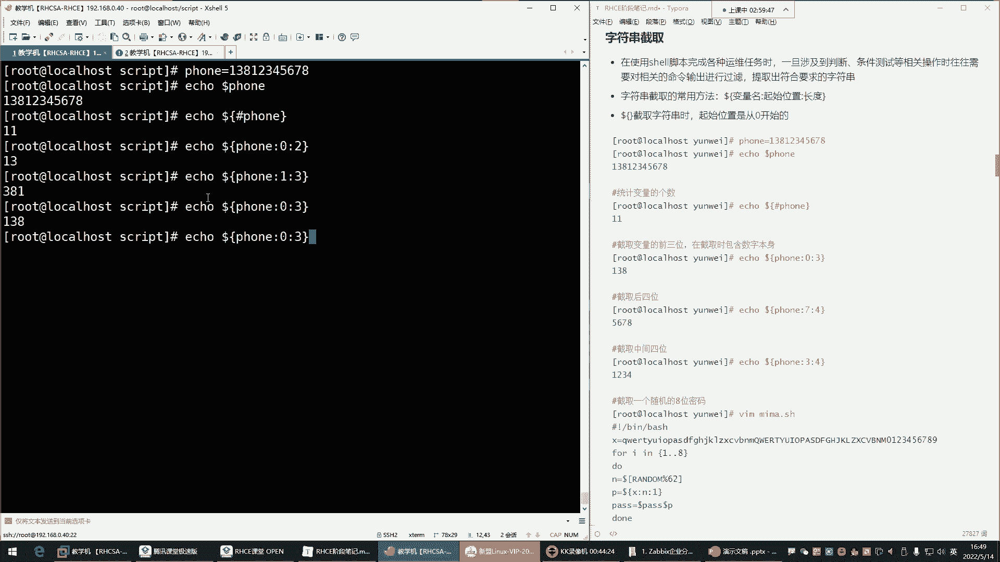