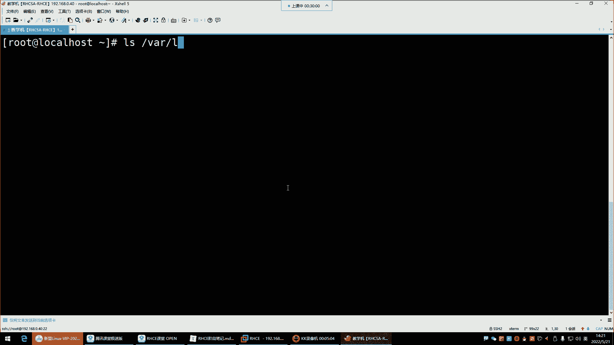
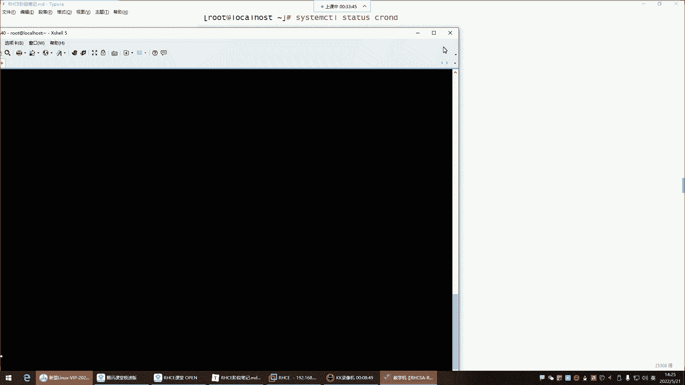
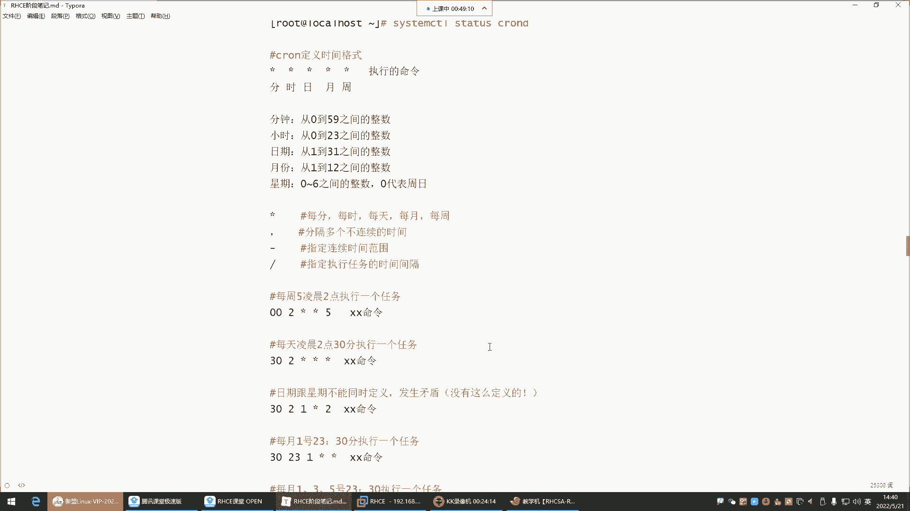
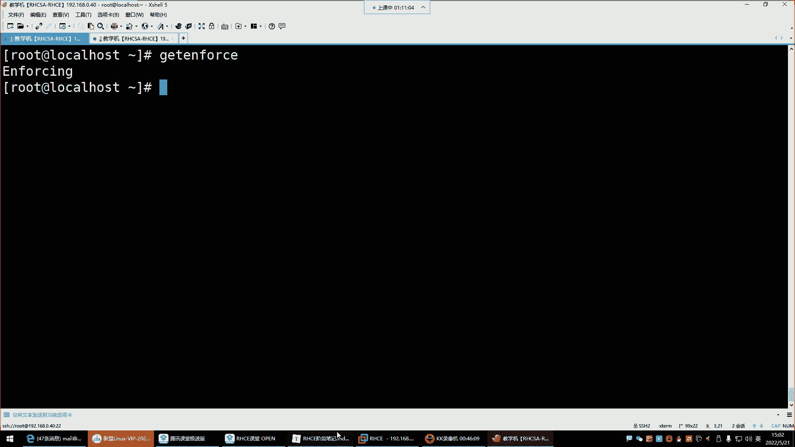

# Linux最全RHCSA+RHCE培训教程合集，小白入门必备！ - P51：红帽RHCE-15. cron计划任务、SELinux内核安全机制 - -Book思议8 - BV1ZV4y1v7c8

喂喂喂好，正式开始哈，正式开始可以了。

呃来看看今天给大家讲解的课程内容，我们上一课呢，是把我们的这个shift脚本给大家讲完了，讲完以后shell脚本的话呢，我们的课程结束了，但是今后大家在工作中，也会经常会接触到这些shell脚本。

稍后的话呢我也会给大家发一些，就是对于大家在工作中，或者是在学习中有帮助的一些脚本。

放到我们的这个网盘里面，这个脚本的话呢也是这个，啊就在这哈，到时候呢，我会把这里边一些常用的脚本在上面哈，这里边呢是有一些100多个脚本，然后下面还有100多个脚本，那个脚本呢这是100多个。

还有100多个109，这哈这个室友脚本100例，109个室友脚本集合，这个的话到时候我会发给大家，到时候你们在今后的学习中可以去参考去修改。

OK吧，好然后那我们今天的内容呢是给大家讲什么呢，我们今天给大家讲这个计划任务，那计划任务对于我们的工作中，是必须会用到的一个技能，那什么叫计划任务呢，来看一下计划任务呢。

CRUNCRUN它是一个什么呢，是一个应用，这个应用呢可以帮我们实现叫做周期性的计划，任务好，那这个东西可以干嘛呢，周期性的计划任务用来定期执行某些程序，然后目前最主要的用途是定期备份，也就是说啊。

这个计划任务他我们通俗点来讲，就像一个闹钟一样，这个闹钟你看比如说你早晨你起不来啊，你们公司早上那个八点上班，你早上起不来，你定个闹钟，定到几点呢，哎定到六点定个闹钟。

然后呢是不是到了六点的闹钟就开始叫你了呀，没错，这个计划任务呢，它就是一个什么计算机里面的一个闹钟，那这个闹钟它就可以帮我们在固定的时间，但这个时间是你去定，你定好以后，他去帮你执行某些操作。

这个操作就是我们所说的那些命令啊，你比如说我们在做数据备份，一般的在企业里边对服务器做备份呢，一般什么时候背呢，就是服务器不忙的时候，那服务器不忙，一般就是在凌晨大家都睡觉了，没有人访问这个服务器了。

然后呢，那这个服务器这个今天产生的一些重要的数据，我们要给它备份，对那这个时候我们用这个计划任务注意哈，他就可以帮我们去定时去执行一些脚本啊，我们前面写的脚本，然后呢结合计划任务就可以实现工作的自动化。

这个就是非常不错的一个功能，或者说它能够让我们运维的工作变得幸福，那么一点点啊，当然只是幸福一点点哈，不是完全的非常幸福，那接下来呢咱们就来说说计划任务软件包，名叫crown AE。

然后呢crown tables是给我们提供命令的一个程序，那我们先连到我们今天的机器。

机器的IP地址，放大点啊，这字体太小了，这字体也不大，好来看一下，你看看这包有没有rpm杠Q，A是AE还是哎呦，我这包一般都有哈，Ie，A1看了吗，这包存在crown tables，看了吗。

这两个包是不需要安装的，是你在安装系统的时候，你不管是最小化安装系统，还是安装了一个在图形界面的，它呀都会自动安装在你的系统里边了，所以这包呢是系统自带的了。

那包系统自带它的服务名叫做crown，后面加个DD就是叫demo守护进程的意思，那你这个也不用去理会，你就知道它的服务名叫crowd，你在起服务的时候，你得去通过这个服务名去启动它。

但是这个服务一般也不用你去手动起。

因为它已经启动了，我们来看一下system m stars crown table d，看了吧，他现在是一个什么状态呢，是一个running的状态，就是已经是一个运行的状态了，好那是不是它是运行的话。

我们都没有动过呀，我们可没有动过的啊，啊就是它默认就随机自启的，默认系统自带这个软件包。

然后呢默认随机自启好，那接下来我们就直接去使用它就行了，那使用的它有一个日志文件。

在VLOG，有个crown s vlog。

然后这是他的日志文件，你看一下文件里面，这个文件里面记录的是什么呢，就是如果说他帮你执行了某些操作的话，他会记录这个时间，比如说我们后期写一个计划任务，让他在凌晨三点帮我们去执行一个操作。

那他会给你记录在凌晨三点的时候，他这个操作有没有帮你去执行，然后呢，这个操作到底是执行成功了还是执行失败了，他都给你记录好，这是计划任务，那接下来看看对于计划任务来讲，什么最重要呢。

就是时间的定义最重要，我跟你讲哈，别的东西像什么这个软件包什么的，你都可以不用记，包括浮名什么的，你都不用记，因为它默认随机自启了，就是时间怎么定义，这是个问题啊，为啥会有两个软件包，这个是提供命令的。

tables给你提供他的管理命令，这个是提供什么呢，提供这个计划任务的一个叫主包，就是今后我们会经常遇到这种情况，就是一个一个应用程序，有很多个包，很多个包，每个包呢给你提供不同的功能。

好那接下来我们就来说说这个时间格式啊，那我们先说怎么去写，写的话呢，我们的对于这个计划任务的命令看了吗，就是敲crown table，然后呢，这个所有的管理命令都是由那个包提供的。

然后crown table用于管理计划任务的，你得安包才能有这个命令，但是那个你也不用管，知道吧，他已经给你安上了，你就直接敲命令就行了，那crown table gue杠E的话呢。

是编写计划任务的意思，然后杠U可以指定以哪一个用户的身份去编写，因为要在这个一台服务器里边，可不是说只有一个root用户，可以去写这种计划任务，普通的用户也可以去编写他的计划任务好。

那这个时候我们如果在写计划任务的时候，默认情况下这个杠U其实是不需要不需要指的，为什么呢，你比如说我现在用root。

我去写一个计划任务，Crown table，然后杠E回车，那现在就等于我们打开了一个文件，是在这个路径下的这个文件看到了吗，那现在我如果要写一个计划任务。

我并没有指定哪个用户名是吧，没有指定哪个用户名，就以当前用户的身份去编写这个计划任务，能理解吧，啊就是你用谁登录的。

那这个计划任务就属于谁，如果我后期用张三登录的系统，我用张三敲这条命令，那这个计划任务就是张三的啊，每个人都可以写自己的计划任务，因为每个人的工作不一样嘛，好那这个时候我们说这个时间格式的定义。

那时间格式定义呢，我们为了更加清晰一些，这样这样看，OK吧，那在这个，好我们这样看，诶跑哪去了呢，这样应该能看清吗，嗯能看清吗，你们OK吗，这样OK的话，给我刷个一哈，如果这样不行。

我们还恢复到刚刚的状态哈，无所谓哈，这样看这样看可以吗啊可以是吧，好OK那咱们说说它的时间格式的定义，你看一下是这样子的，就是你想让他去在什么时间段，帮你去执行这个操作，看看分它是五个星。

五个星代表什么呢，代表分时日月周好，那这个分时日月周不行，我觉得这样不舒服哈哈，这样看起来不舒服哈哈。

那这五个星它如果是代表分时日月周的话。

那我们来说说这个分时日月周啊，首先为什么用星号来表示这个星啊，它默认代表是啊，第一个星代表10分钟，第二个星代表是小时，然后第四个代表是月份，第五个代表是星期几，那这个时候看看星呢，他指的是每天每时啊。

是每分每时，每天每月每周星代表是所有的意思，那这个时候我们如果想去定义一个时间，比如说我需要在凌晨的几点呢啊，这是每每周五的凌晨两点执行一个任务，这个任务比如说我们去自己写一个什么呢。

写一个备份脚本行吧，我们先去编写一个备份脚本，这个应该比较简单吧，备份的脚本啊，备份脚本的话我们放在哪呢，MADR真下script，进来之后，我们我们先说说BF脚本对杠XF对Y下的啊，让它叫什么呢。

叫log点踏点GZ对系统的VLOG下的什么呢，那些所有文件做备份这条命令格式，那前边这个不对是吧，应该是什么呢，应该是Z是吧，ZCZCF对Z是以这种GZIP的格式，GZIP压缩它。

C是不是创建打包的报名啊，F也是F值指定名字，C是我要创建打包，然后接下来对Rush log的所有的文件去打包好，打包到哪儿就打包到，你可以指定打包到根下的啊，或者达不到TMP下边，然后叫这个名字。

把这个路径下的所有文件打包到TOP，然后呢叫这个名字，我们先来执行一遍，好真以后看看TOP有没有叫log点差点积累的，有是不是好，那接下来，但是我们每次这样打包是不行的，为什么呢，这样打包的话，你看啊。

比如说你今天执行了一个打包操作，好，明天又执行这个打包操作，但是你这文件名是不是今天叫这个名字，明天还叫这个名字啊，那怎么办呢，你看人家这都带什么呀，这都带日期，看到了吗，这都带日期哈。

所以我们做备份的时候，你也要加日期，那怎么加日期呢，data命令可以获取日期，然后date加号百分号大F是不是年月日啊，哎那如果说你备份的时间比较频繁的话，年月日还不行，你还要干嘛呢。

你还要去指定呃小时小时，然后如果说这个，你可能说备份的频率比小时还频繁，你还要再指定那些分钟，当然这里面可以加一些什么呢，加一些分隔符，分钟小时，然后杠分钟分钟就是百分号S啊，这样才可以哈。

你看就是到时候呢标记一下，我这个文件是什么时间，备份的小时分钟能理解吧，所以这个呢你如果备份的时候，你一定要附带时间，那这个时间你要明白什么呢，就是你是要把这个时间给它，放到这个备份的文件名上面的。

所以这时候我们前面学过一条，学过一个特殊符号，谁呢，反撇是不是反撇儿，反撇是可以，你这样反撇的话呢，是可以取这个命令的结果的好，那这个取完结果以后，我再这样哎，套杠ZCFGCF打包打包到TP下边。

让它叫log点差点GZ啊，那这个时候在附带什么呢，附带我的系统时间加个下划线，我看看他这个你看是不是前面是名字，后边下划线，然后是时间，那我们也一样，前面是压缩包的名字，然后呢后边是具体打包的时间。

那对谁打包，对啊，哇下的log下的所有回车，我们阿拉斯看TP回车，唉这个文件z cf tar gz，cf tm p叫log点塔点JZ附带时间，d mar下的logo下的所有，没毛病啊，T f p。

文件呢啊这儿呢这儿呢是吧，看到了吧，但是哈哈哈有点问题哈，有点问题，为什么后缀名不太对，后缀名不太对啊，点塔点GZ嗯，那就这样log，然后下划线，或者说前面是时间，前面是时间，后边，前面是时间。

一般会有点问题，我试一下，放到TP前面是时间，然后叫杠下划线，log点差点GZ回车看看TMP啊也行，什么时间备份的是吧，这是几点呢，这是5月521 521 14。14分14点，14：44分14点对。

这只错了哈哈哈哈，不是啊，这是成秒了哈，对M哈，嗯对M回车IOS看TTMP哎这样才可以哈，我说怎么怪怪的呢，哎这是前面是年月日是吧，小10分钟啊，备份文件名，这样是不是可以啊，哎没错。

那如果你们的备份频率真的是，这个比分钟还要什么呢，呃就是分钟都无法满足了，频率太快了，备份的频率，那这时候就得用秒来什么呢，用秒来去这个加上加上那个表哈，在名字上面好，那接下来我们对于这条命令来讲。

是不是放到脚本里就可以了呀，啊然后VIM让它叫什么呢，让他叫，back点SH嗯叫log，然后，back点s h back，备份的意思还没有VMV0安装一个，好让他先安着吧哈，我们这边说来。

比如我现在就让你执行这样得指定解释器哈，那个脚本script写的那个叫log，然后back点SH，这是不是一个备份脚本，哎你看我们脚本有了这个就是一个备份脚本，对我的日志做备份的。

那接下来时间我希望在什么呢，在每周五的凌晨三点做备份，那这个时间怎么写，注意分时日月周这几个哈，你要记得住，这代表是分钟小时日期月份周几啊，那我要在每周五，那我这个位置应该是什么呀。

周五我是不是得先把这个星期几这个位置给它，改成五啊，改成五是不是就是等会儿啊，太多了太多了，嗯这个，那这个位置我是不是用R替换一下R，然后再输入五，那我这个位置是不是给它改成五了呀，那改成五了之后。

那这就是代表星期五的意思。

他这个时间你要注意哈，分钟是从0~59之间的整数，你别整到60去，没有60，还有小时也一样，0~23之间的整数，你别整成24下，然后下边日期也一样，1~31，这一个月没有32天。

所以你别你别写写抄了写抄了，他不认识月份也一样，一到12月，你别搞个13月去星期几，0~60到六之间，这零就代表是星期日，剩下就123456。

那这时候我要在星期五去，给我执行这个备份脚本，好，包按好了，接下来来写脚本，让他叫log，然后back点SH是吧，指定井号叹号杠B下的batch往里一粘，这是我的备份命令，好给个执行权限，称之mod。

加个X给这证权限来执行一下B呃，加上这个脚本，我们先执行一遍试试哈，回车看TP回车，是不是我们刚刚执行的14。35分，现在好一模一样哈，那脚本是不是可以正常执行呢，那接下来计划任务。

你就让他在什么什么时候帮你执行呢，哎让他在凌晨三点周，每周五的凌晨三点，那周五我现在就用五来表示了啊，那周五的凌晨三点怎么代表凌晨三点呢，啊继续数分十，哎小时是吧，凌晨三点嘛。

那就把这个星用R替换乘几啊，三这三就是三点啊，那每周五的看哈，每周五的凌晨三点给我执行这个脚本，诶这个就这么简单，就这么简单哈，就可以了，就定义好了，那我们来想象一下这个真的这么简单。

就定义好了一个计划任务吗，那你们有没有，你们有没有觉得如果我这样定义的话，他会在零，它会在周五的凌晨三点给我执行吗，会吗，啊我告诉你它会它会执行哈，但是对这样写行吗，你们也有一些一丝丝的疑惑，是不是啊。

啊，唉那这时候注意前面这个星，几乎是你在定义任何一个计划任务，我们都要去指定的，这叫什么呢，分钟这叫分钟，这个分钟是从0~59之间的一个整数好，那这时候我们来思考一下分钟。

这位置从0~59之间的一个整数是吧，那我现在我是定义了，每星期五的凌晨三点去给我执行这个命令，那是他会在周五的凌晨三点，却给我执行这条命令了，那没确实没有毛病，但是你要想象一下，那凌晨三点的时候。

他这个一个小时是由60分钟组成的，是不是啊，那你们有没有想过，那凌晨三点他是给你执行这个脚本了，那3。01呢，3。3。01的时候，他要看前面这个分钟，这个分钟是星，就代表是0~59每分钟都去执行。

那也就是说这个脚本，他在凌晨三点整整给你执行了多少次呢，60次从三点整一直到什么呢，到03：59分每分钟都给你执行，所以这个位置一般我们要什么呢，要给它写成零零或者一个连也行，两个零也行，唉就零零。

这样才叫真正的每周五的三点整的时候，能理解吧，嗯这玩意没有秒啊，没有秒，淼淼啊，这就是我们所说的这个前面这个你一定要注意，你甭管是写什么样的计划任务，这个位置我们一般都要加，都要指定好。

那我要说我要在03：30呢，我现在不是凌不是凌晨三点整了，我要在03：30，那如果03：30，你这位置就不能是零零了是吧，哎就30，这30就是唉，每周五的03：30分给我执行力脚本。

那他是不是就只会在03：30的时候执行一次啊。

对如果用星，你想那星的话，它就是它可是代表每分钟的每分钟哈，所以这个时候是不能用星来表示的，那现在了解他的套路了吧，哎你发现哎多多少少明白了哎，基本上分钟这个位置，我们任何一条计划任务都要去明确。

指定在多少分钟，你就是在这个整点的时候，我们也要用零零来表示，能理解吧，你不指定，那这从0~59之间，我跟你讲，他给你执行60次，也没有这么干的，OK好，那下边，那如果让你在每天凌晨02：30分。

执行一个任务，那跟前面就非常类似了，然后下边这个位置日期跟星跟星期一般不同时，定义容易发生矛盾啊，就比如像我这里边，我这里面定义的哈，呃每周二的凌晨02：30看到吧，还有每天的每天每天的凌晨02：30。

那这个一般就我们会觉得我们下面再写一个，再写一个这个计划任务，一个文件里面可以写好多哈，分时日月周，然后后边是命令叉叉叉叉命令哈，那接下来我如果这样定义，比如说就这样，每周五的凌晨啊，03：30。

然后后面再来个一是什么意思呢。

这个一，这个一是代表天，这个天是每月的一号，如果我这个位置我写成了这个一的话，那就是每月的一号，每月的一号哈，那每月的一号。

这个时候你想想他在帮你执行的时候，他怎么去看呢，因为有的时候我们可能会想哎，这每周五的凌晨03：30去执行，是不是啊，好，那如果他每次都是周五的凌晨三点没帮你执行，但是到这个月的一号的时候。

那这个月这个月的一号有可能不是星期五，是不是啊，有可能不是星期五，或者说这个月的一号有可能是星期五，所以这个时候你发现这日期这位置，一般跟星期啊不同时出现，不会同时出现哈，能理解吧。

你如果同时出现他们两个容易发生矛盾，发生矛盾，你的这条计划任务就不执行了，所以有的时候你可能会发现诶，我写的计划任务啊，我也是定义了，你可能觉得啊我定义的非常的人性化什么的，每周五的凌晨三点办。

给我整一次，每个月的一号到凌晨三里面再过一次，但有有可能这个位置他就不执行，所以一般这个我们不同时定义不同时定义哈，如果一旦定义了星期几，那这位置日期那天数那就不定义了，能理解吧。

那如果你一旦定义天数了，你比如说我希望在什么呢，每月的一号凌晨03：30给我执行，那你说那我星期日如果用星来表示，那他会从周一到周日每天都去执行吗，不是他就不会了，在这里边啊，它的规律我告诉你。

你看月份这个位置，我们一般呢不动，月份不动，但是我们一般调整谁呢，要么就是调整星期几，要么就调整这个天数，我一旦定义了天数了，在这儿你看月份是代表每个月每个月哈，是不是好，那这个时候我如果一旦定天数了。

每月的一号凌晨03：30给我执行这个叉叉叉，这个脚本好，那星期几就不生效，不生效啊，他不是说我这个星期几用星来表示了，那这个时候每周从周一到周日，他都去给你执行，不是因为你定义了日期了。

星期这就不执行了，能理解吧啊所以说一般，所以一般我们一旦定了星期了，日期这就不定义了啊，比如每周二到凌晨03：30，那星那日期这你想想他会我用即便用星表示，他会每天都去在凌晨三里面帮你执行吗。

不会为什么呢，因为我定义了哎，每月的是不是每周的周二，每周的周二去过执行，所以这个就失效了，他们两个是这样玩的，是这样子的哈，所以这个大家搞清楚，一般星期和日期不同的定义容易发生冲突。

能理解吧，所以这个位置大家注意一下就行，其他的话那就没啥了，剩下啊我们在定义的时候，这里边还可以通过一些什么逗号啊，还有小横杠啊啊，做一些比较这个额外的一些操作，比如逗号多个可以分隔多个不连续的时间。

比如说我怎么分割呢，我现在希望在每周的135去给我执行这个，执行这个脚本，注意我现在不是每周五了，是135，每周的135，那这时候就一逗号三，逗号五哎，这时候他就是每周的周一给你执行一次。

周三再执行一次，周五再执行一次，能理解吧，好那如果你说我不想定义星期几了，那我用星期这位星期的位置，我用星表示，那我在日期这哎，每月的几号呢，每月的一号3号五号七号九号十号，以此类推，能理解吧。

但是一般呢还是星期这个位置用的比较多一些，还是给大家说清楚哈，因为星期几比较简单呢，是不是啊，我一旦定义了好，每周的135给我执行这个备份脚本，那日期时你就不用管了，你不用管了。

他就在每周135都给你去执行这个命令，是不是比较简单，比较好理解了吧，这个位置，啊这是逗号啊，可以做一些什么。

做一些这个不连续的不连续的时间定义，那横杠呢是连续的时间范围了。

那这个你比如说呃如果是连续的话，比如说我从周一到周五，那就一杠五，一杠五，就是周一到周五每天到凌晨03：30都去过，我去执行这个脚本，那这个是不是也比这个天数的位置比较什么呢。

比较这个让我们更加的好理解一些呀，唉只因为你看他哼一个月四周是每周，周一到周五，他比你指定具体的天数还有什么呢，还要方便一些，这时候就更好理解了呀，那你说我希望每天都备份，每天都备份，那就零杠六零杠六。

周一到周六不是周一，是周日到周六全都为分，所以一般星期用得比较多一些啊，剩下就是小10分钟，大家注意一下就行了，那月份分时日，月月份需要搞吗，月份不需要搞，月份一般不需要去动的哈，好这是横杠啊。

这根斜线可以指定执行任务的时间间隔。

你比如说有的时候你需要备份的时候，哎这个频率可能比这个节奏可能比较频繁一些，那这时候一般频繁在哪里呢，比如我希望每隔两个小时，注意哈，是就是周一到周六，每隔两个小时，你去给我备份一次，那这个位置看看星。

这，零零每隔两个小时，那就这样，先斜杠二，嗯这个星斜杠二，就是每隔两个小时去给我执行，这个后面的备份命令，那还是周一到周六，那具体几点，这个就没有什么具体几点了，就是这一天从什么呢。

从早上到晚上24小时，每隔两个小时都给我执行一次，能理解吧，每个每隔两个小时，但这两个小时的位置，这个分钟不能用星表是吧，是不是也是零零，每隔两个小时整的时候给我去执行后面这脚本。

但这个一般用的比较少一些比较少哈，星杠二啊，没两个小时执行每两个小时，但这位置注意零零哈，0000。

那我要是每隔2分钟呢啊，每隔2分钟，那就在分钟这儿杠2分钟，杠二就是每隔2分钟，周一到周六每隔2分钟，那这每隔2分钟，是不是，这一天下来，这一个小时里边是不是一个小时60分钟好，那每个2分钟直行一次。

就是执行34，一个小时里面给你执行34，正常来讲一个小时不给你执行60次吗，我希望一个小时给我执行30次，哎，那就每隔2分钟执行一次，哎，那这辈子大家能听懂吗，我问一下你们哈，能不能听懂啊。

听懂了给我刷个一，听不懂的，刷个二，这计划任务一般分钟是肯定会干嘛呢，要指定的，然后小时也是要指定的，具体凌晨三点或者凌晨03：30或者凌晨两点整，那周几比如说就每周几呢，嗯一般，周日的时候一般周日哈。

零代表周日哎，周日的凌晨两点，一般人比较少，因为第二天都上班，第二天都赶着周一上班，所以周日呢一般人呢他一般不会玩太晚，所以周日的凌晨两点给我执行备份脚本。

是这样子的，所以这个计划任务就给大家说清楚了好，那说清楚之后，我们验证一下他真的执行吗，我们可以这样，我们自己刚刚啊我们的那个备份脚本是吧。

咱们这样我每隔一分钟让他给我执行一次，这个位置我也用星来表示，那如果全都是星，那这位置小时也是星，我只定一分钟，我如果只定一分钟的话，哎每隔一分钟给我执行一次，其实你如果不写的话。

他是不是也是每隔一分钟啊，啊其实效果一样，备份的时候啊，这一般看你们公司吧，看你们公司哈，周日晚上也不忙，周日的晚上也不忙，看你们公司是干什么业务的，这玩意得，然后呢，这时候我就给大家演示一下斜杠一。

斜杠一每一分钟给我执行四这个脚本，我们看看他会不会给我执行哈，保存退出，保存退出以后，它提示了啊，什么安装crown table，安装了吗，安装了哈，然后咱们说几条它的命令。

crown table回车没有效果是吧，那杠H获得帮助，它里边命令也也，他的命令也比较少，你看这里边没有几条命令，然后它的命令的话呢，杠E就是我要什么呢，嗯it叫做编辑某个用户的任务。

杠L列出用户的任务，看到了列出某个用户的任务，那这时候你就crown table杠L回车，现在就是列出所有的任务，那这时候我们是不是有一个任务啊，那这个任务他会在一分钟执行一次，那我们得等一等啊。

没关系，等一等，然后其他命令的话，那就没有什么太多可介绍的了，删除啊，这有个杠R叫delete，叫删除某个用户的任务，那这个的话呢一般删的话就是这样。

删的话，杠R是清除计划任务啊，指定指定用户名的话，就指定清除某一个用户，但是这个的话我们一般你去，一般我们不管别人的计划任务哈，但是如果想删的话。

其实最简单的方法是什么呢，就是你它就是一个文件，那个文件就是生成在他的T，你当前的TP目录了，看了吗，那个，啊计划任务文件呢啊完了他提示了，他说你这vpl mail root中有一个新邮件，我估计啊。

我看他执行了吗，哈14啊，执行了，你看这不是14。50吗，是不是啊，14：50分的时候，他给我执行了一次，但我估计一会又要给我执行了，但现在有个邮件mail。

看一眼没有命令YM杠y install mail回车啊，包不对，要么，PRIVIS搜索一下mail，是不是啊，前面讲过，前面讲过，比如说我在敲一条命令的时候，系统说未找到命令，我们可以干嘛呢。

我们可以去先搜索一下private，跟上你要执行的那个命令去搜索，能搜到有有，但是有一些部分命令他也搜不到，这具体这种诡异的事情我们也说不清，就比如说刚刚的那条命令，他就说没有找到哈哈。

那叫ym search s e a r c h search色是谁呢，Search mail，Ym list，然后search没有错误的匹配，Search，啊，对search一下search mail。

这怎么啊，使用search all好，Search all，它提示了，你看到吗，他说嗯，你可以使用search all，是回车，那这也太多了，这包啊呵呵，这太多了哈，管道给grape mail。

完了这也搜搜不到啊，呃亚么searchs e a r c h search，杠杠help啊，或获得帮助可以吗，search选项gt忽略完全缓存，运行配置文件路径命令最长等待时间，凑不出回答问题。

求一个更新嗯，请指定名称，Search，嗯亚么previous杠杠top，在亚某指定某一个文件夹保存的软件包，选项命令你看YM，然后呢加一些选项加命令，这里边你看列出列出列表，有点尴尬了哈，要么。

private4我觉得这个是没有没有算了，不搜了，要么杠y install。

叫啥名啊，我也不知道，我是去百度吧，有事问百度吧，我去问问一下这个这个mail命令，没找到没找到，让我们安装这个叫max是吧。

但是他搜不到，加个X没事，有了，然后ml回车，这里边是有一些什么呢，有一些这个一有一些邮件看啊，这是你的邮件来了几封了，六封了，你输入一就看第一封邮件回车，这这封邮件他告诉我了什么呢，什么这个主机。

然后他的一个时间做了什么事情啊，他说他啊退退信回复地址嗯等等等等，啊干了什么事情，算了埃克斯特，在这里面哈是Q退出Q，然后XQ是退出你的查看的邮件的那个什么呢，那个列表，然后X是退出。

那接下来我们就看TMP就行了，有没有成功，TMP回车成了吗，各位是不是有这么多的压这个什么呢，这个压缩文这个压缩包了呀，是不是啊，那14：56分的这些，是不是他通过计划任务去给你执行的，这些操作呀。

它是帮我执行的脚本了，那脚本是一个备份的脚本，那这个位置就可以了，能够看到这个是不是计划任务，现在在自动给你执行啊，我们不是手动执行的。

能理解吧，这位置，所以你看时间的定义是不是是最重要的呀，啊但是脚本也很重要是吧，你写不出来脚本，或者说你没有脚本。

那你光会定义时间也没用，但是脚本是不是也比较简单的，你看像我刚刚写的脚本就非常简单，不就一做备份的吗，备就说白了不就给他们打个压缩包吗，是不是，OK这是计划任务。

计划任务这位置大家有没有什么问题啊，没有问题的，给我刷个一，我们这个计划任务就是比较简单哈，这玩意就是你知道怎么去写备份就行了啊，也可以直接跟命令，但是跟命令有时候会执行失败，跟命令一般有时候不靠谱。

一般都是把命令放到脚本里边。

然后那清除计划任务就是你想给他清除，你就这样，crown table杠R杠二是清除所有的，但是有的时候呢，你这一个计划任务里边可能说有很多个什么呢，有就是有很多条命令，那一般我们不这样玩，我们怎么玩呢。

唉杠一编进去，然后呢dd删就行了，这不就是一文件吗，看到了吧，这就一文件哈，到时候你直接在里面就是一个VM，在里面删删就行了，弟弟删了吧，能理解吧，然后正常WQ保存就行了。

所以这个东西呢删的话一般不这样删不杠杆哈，杠二是清除所有的，OK啊，注释也行对，如果你比如说我不想删掉注释，也可以注释，他也不执行，然后下面再给大家说一个SELINUX，叫系统内核安全机制。

这个呢没有太多可讲的，简单带领大家了解一下什么叫SELINUX，这个内核安全机制啊，它呢你如果去百度搜的话，他说是美国NINASA，一套增强LINUX系统安全机制的一个访问控制体系。

那这个东西我们通俗点来说它是什么呢，唉这个东西是增强，你看数，注意是对LINUX系统安全的强制访问控制体系，叫做访问控制，访问控制谁才能够起到访问控制的作用呢，唉防火墙。

所以说SLINUX它叫内核防火墙，注意内核有自己的防火墙系统，有系统的防火墙，所以说它不一样啊，那这个内核防火墙是增强内核的一些访问，控制的，能理解吧啊，那这个时候所以对于这个内核防火墙。

我们一般不去研究它，因为一旦涉及到内核的相关的技术点，一般呢你是根本就研究不了的，因为这个SLINUX你如果你去看的话，一本书那里面的东西多了去了啊，所以这个东西呢大家只要简单了解一下就行。

你看它是集成到了LINUX2。6以上的内核里面，都有针对什么用户进程目录文件，提供了一些预设的保护策略，那是不是就是防火墙啊啊，那这个东西一般在企业里面，我给大家说说，一般都是给它关掉，为什么关掉呢。

因为这个东西如果你不关，你得去修改它的一些规则，就像平时的防火墙规则一样，这个规则我们称之为叫开关，那个开关那可真是不好改，但是你不改的话，注意你，比如说我往系统里面，这是我一台LINUX服务器。

我安装一个软件包，不好意思，唉这个一些这个怎么说呢，来路不明的软件包，有的时候就是一些这个正规的那些软件包，官方的软件包，你安装在系统里边，你在启动服务的时候，那这个SLINUX他都去控制你。

不让你起服务起来以后也不让用户访问，能理解吧，你得去改它的开关，所以这个东西一般在企业里面就给它干嘛呢，给它关掉啊，企业服务器不起这玩意儿，不然他管的东西太多，能理解吧。

好所以我们对S1LINUX呢我们了解的是什么呢，它的运行模式它有三种运行模式，这三种运行模式我们主要就是在学习，怎么去给它关掉，第一种呢叫强制运行模式啊，这是它的单词啊，要1force。

然后第二种呢叫permissive，叫宽松模式，那这种的话呢应该比较好理解，宽松模式就像我们防火墙一样，你把防火墙是处于一个什么样的状态呢，叫做放行的状态啊，允许任何访问就属于宽松了啊。

这是我的一台防火墙，防火墙里面有我配套规则，什么规则呢叫允许任何访问，这时候非常宽松啊，OK那个宽松模式，就像于就相相当于防火墙里面的那个什么呢，叫做允许任何访问一样。

然后那强制模式呢这个enforcing，enforcing就是类似于它是一个开启状态，而且是针对什么用户进程目录，都提供了一些预设的保护策略了，好那还有一个disable禁用模式，就是给它彻底关掉一样。

那我们在企业里面都会让它处于一个什么呢，这样的模式叫金融模式，好，那我们现在得先学着怎么查看，想查看它的运行模式，用get enforcing infi。

这个读起来有点相似是吧，来get查看，info啊，Inforce inf，这读音读音有点绕舌哈，哎这个哈这是什么模式呢，就是这个看看叫强制模式。

现在是强制模式。

INFORCE好，那强制模式我想更改它的模式，怎么改，叫set，Set enforce。

然后下边你要改他的模式，你得记得住它的这三个模式的单词能理解吧，那记不住怎么办呢，记不住也没关系，其实也很少去记它，它有一个文件，你记文件也行，这个文件记一个文件总比记三个单词强是吧。

那这个文件在ETC有个叫ICELINUX，下面有个叫CONFIG文件。

这个是它的配置文件啊，我记不住单词，你可以每次用的时候这样cat看etc c linux不是哈，是SELINUXCONFIG文件，tab键补齐就行哈，回车这个它文件里边已经告诉你了，你看哈。

什么这个文件控制系统上的S104的状态，唉那怎么控制呢，他告诉你它的格式是这样子的，SCLINUX后边是调整它的状态的，可以取这三个值的之一，哪三个值就这下面这三个值，这三个值第一个告诉你了。

这是一个安全策略，第二个嗯什么打印警告，而不是强制执行，其实说白了就是类似于宽松状态了，这个呢是彻底禁用了啊，没有加载它的策略就彻底禁用掉，所以这个文件里面你可以看这三个单词，我现在干嘛呢。

想调整它的模式，Set enforce，In false，然后给他改成什么状态呢，啊比如给它改成叫permissive，这个叫做呃一个宽松的状态，好回车啊，那改完以后我再get in false。

看回车，现在变成受permissive了，宽松状态了，好，那我能不能set in force给它改成disable的状态呢，叫做禁用状态呢，来试试回车诶，他说了，他说什么呢，他说啊，这条命令看了吗。

这条命令叫做临时关闭的命令，叫临时关闭，临时关闭哈，好，那临时关闭可以支持什么呢，支持enforcing，跟这个就是你可以给它改成什么呢，叫做启用的状态跟宽松的状态。

但是你想给它改成disable禁用的状态不行，那你说在这里边，其实我们在设置它的模式的时候，他也说了，你或者用一跟零来表示就行了，一是谁，一就是他它是什么状态呢，强制强制状态就是属于这个我们所说的。

前面给大家介绍的强制模式下，他什么都管，能理解吧，宽松模式下就是什么都不管了啊，所以这里边你看一是强制，零是宽松，所以我们一般设置的时候不记这个单词，不记这个单词只记什么呢，只记零跟一就行。

你就知道一是强制模式。

零是宽松模式，所以一般我们是这样玩的啊，Set enforcing，然后零回车零就等于给它改成宽松模式了，但是注意disable的状态是秘密行，我们无法去直接给它改成这个DESIMPLE状态的。

因为这条命令叫临时命令，临时命令就是临时修改它的运行模式，给它改成宽松模式，那临时命令你这个机器下次关机又重启的时候，那这个模式又恢复到了他的那个什么呢，就是默认的运行模式，默认的是强制模式。

什么都管啊，那这个强制模式，到时候你还得去临时手动去执行这条规定，能理解吧，但是在命令行无法执行彻底禁用，而彻底禁用的话，就是你下次关机再开机的话，它也不会干嘛呢，它也不会变成强制模式。

就直接给它关掉了，那怎么样才能让它变成强制模式呢，改他的文件，etc s e linux config文件哎，得打开文件了，在文件里边看到吗，ICLX等号后边他不是告诉你了吗，你可以任选其中一个。

这里边任选其中一个模式啊，可以取这三个值的之一哪个呢，我给它改成disable彻底禁用的状态，然后接下来注意光标定位到这个enforcing，这位置大写的C删掉，粘贴disable了，别把等号删掉哈。

好然后下边这个它也有一些解释，这里边啊它也有三种什么target minimal啊等等等等，噼里啪的啊，这个一般啊什么进程保护，看到他的一些保护策略，这里边这是他的一些保护策略。

什么修改策略只选定进程受到的保护，这三种也不用动，你只要给它关掉就行了，关掉它就什么都不管，然后保存退出，保存退出以后，注意这一步得需要精力重启，你改完文件以后重启的话，它才能生效。

但是这一步有必要重启吗，一般呢没有必要重启，为啥呢，你可以在命令行里边临时给它改成宽松状态，就是miss5，宽松状态，他就不会去管理你这个系统的一些什么呢，什么文件的进程之类的了，他就不管了，然后呢。

那这个临时是不是你机器关机，下次重启它又恢复到这个强制模式了呀，那这条命令是不是就失效了呀，没关系，下次重启，由于我们改了它的配置文件了，那配置文件改完以后，它就永久生效了。

配置文件我们改的是disable的状态，那下次再开机放心，它直接变成disc o彻底关闭了啊，所以这个位置就不用去管它了，嗯不用管了哈，OK能理解了吧，好啊，还在医院只能后面听啊。

那就听录屏吧哈这都在医院了，是不是在医院的话，我们还是注意身体嗯，你们应该像这个小王同学学习哈，人家是什么情况呢，就是这个熬夜学习敲命令，敲的这个肠胃炎了啊，然后这个去医院了。

然后去医院呢也不忘了这个什么呢来学习啊，所以呢这个对我们要什么呢，我们也要去呵呵，我们也要去这个向他学习啊。

对就像我今天给大家发的那句话一样啊，这句话我觉得是非常的好哈，哪句话呢，就这个叫做一寸光阴，一寸金，时间啊，其实后面还有一句话叫寸金难买寸光阴，所以时间呢是非常宝贵的，但也是无情的，为什么呢。

因为人生在世，说白了你活到100岁，那才3万多天，你这3万多天你再要去掉什么呢，去掉你前20多年的年少无知，再去掉你60岁以后的那些心有余而力不足好，那你这一辈子你活100岁。

你也就有40年能够让你什么呢折腾的时间，那你这40年啊，你这40年你再刨掉什么呢，刨掉你一天工作八小时，你一天是工作八小时，那你这八小时以外的那个16个小时，你想想你是干嘛呢，你是在你是在睡觉，在玩。

是不是，所以你想想你的努力的时间，你这一辈子能有多久啊，其实没多久没多久，所以我们说这个天才，它是1%的灵感加99%的汗水，换来的啊，那我们不是什么天才，我们连那1%的灵感都没有，那怎么办。

我们就得付出那百分百的汗水啊，这样才可以，呵呵呵呵对，所以你想想对于我们来讲，你这40年的时间里边，40年你换算成天的话就1万多天，你40年你换算成天就等于1万多天，知道吧。

这1万多天再去掉每天的八个小时的工作时间，你的业余时间其实一辈子下来就几千个小时，这几千个小时是非常宝贵的，是不是哈哈哈，所以我们唉每一刻我们都要珍惜好。

利用好啊，别荒废自己的年轻的宝贵时间，包括我现在跟你们说的几句话，我都已经觉得有点浪费我的宝贵时间了，我们要学习啊。

那些我们不能说一些没有用的废话，是不是对，已经荒废太多了，那接下来呢我们还是应该休息一下吧，啊虽然说是时间是宝贵的，但是呢我们也需要休息，是不是我们休息5分钟，往期都是休息10分钟。

那这次我们休息5分钟。

