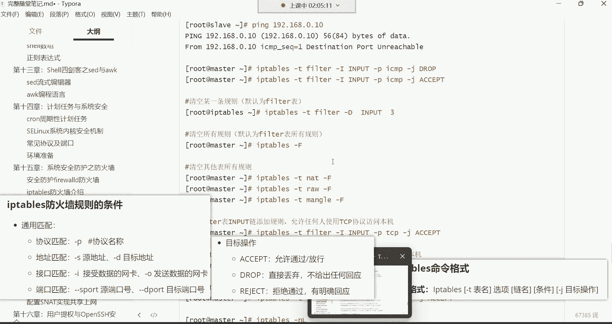
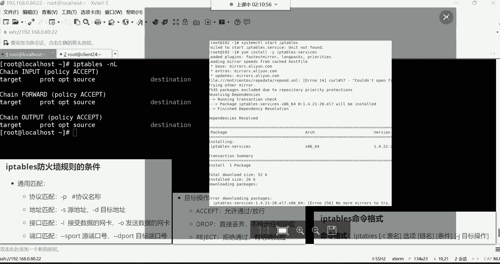
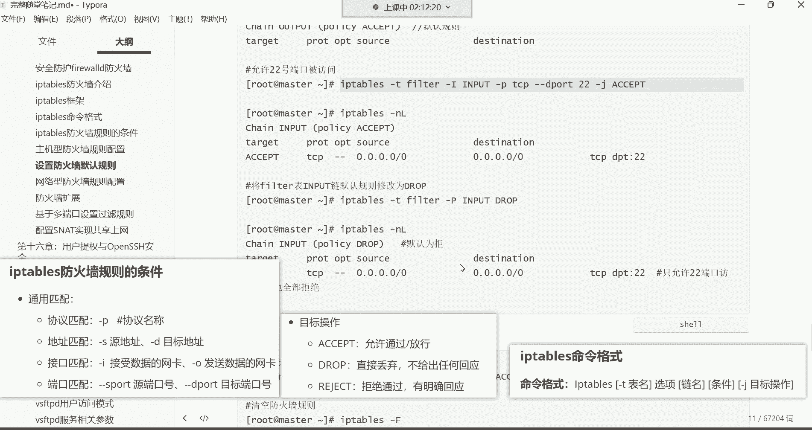
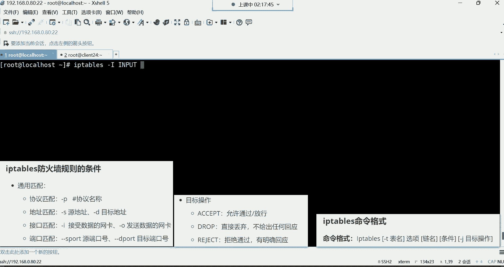
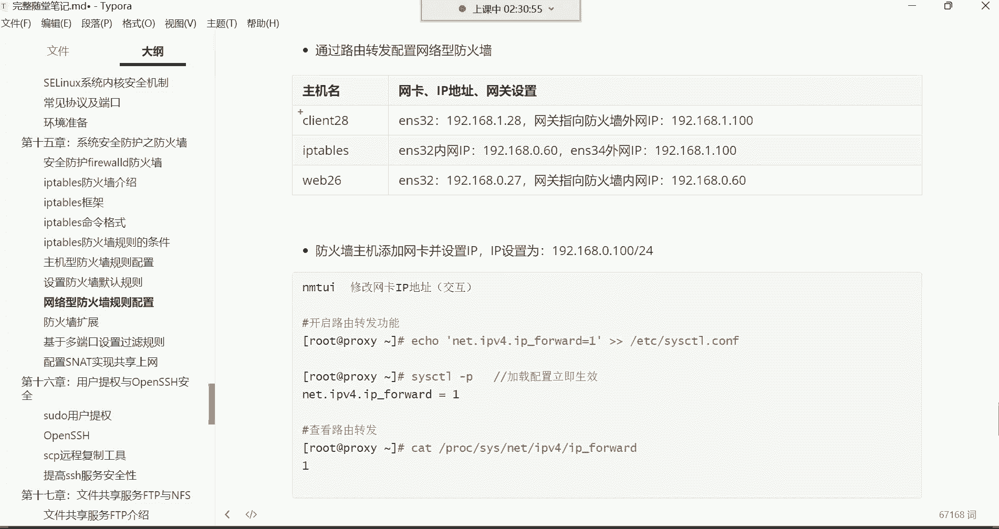
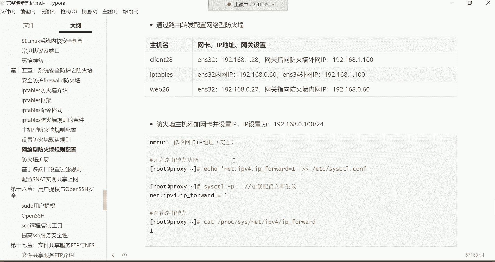
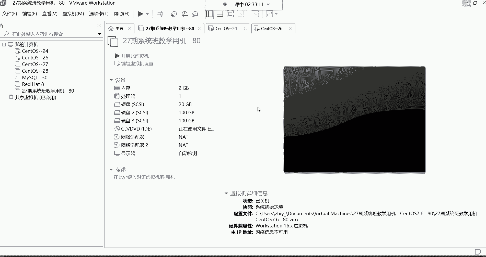

# Linux最全RHCSA+RHCE培训教程合集，小白入门必备！ - P54：红帽RHCE-18.系统安全防护之iptables防火墙 - -Book思议8 - BV1ZV4y1v7c8

都回来了吗，来回来的话给我刷波一哈，然后我们继续听这首歌了吗，啊，啊换电脑应该买个什么配置的哈，配置的话，那如果不打游戏的话，其实笔记本也打不了游戏，配置的话就内存的话更大一点哈。

内存的话达到这个16个G就可以了，这就能够满足我们平时的一个学习需求了哈，然后别买联想的是吧，为什么不买联想呢，我相信你们应该心里都清楚是吧，联想这个被这个谁呢，被那那那那那个我们说的教父是不是对。

被那个教父已经搞得哎对，所以说现在对狗都不买联想，所以别的什么小米啊是吧，什么华为都可以都可以，然后内存大点就行了哈，16个G的8G够不够，8G不够啊，你到后期现在很多电脑都是一体的，你拆不开。

你往里面增加内存，你增不进去，你怎么办呢，后期就麻烦事儿哈，对，就内存搞16G以上的就可以了，CPU的话呢现在都不会太差，但是别买啊，我跟你讲哈，就是别买那个华硕的，华硕的那个啊，不是啊。

是华硕还是好像是华硕的哈，华硕的那个显卡现在有个毛病，就是蓝屏，华硕那个东西哈，没事就蓝屏，所以别买那个华硕的哈，小米就挺不错的嗯，你的鼻子对哈，你像我这个小米的是吧。

叫read me book的就挺不错的哈好了，我们继续开始哈，然后开始学习这个IP tables了哈，对这个IP tables的话呢，我们先来了解一下啊，其实对于防火墙啊。

我现在还有一个概念忘了给大家说了啊，防火墙有一个非常重要的概念啊，这个这个概念放在这儿说，还是一会儿说呢，一会再说吧，好吧一会儿说哈，咱们开始学习它的命令。

命令格式呢，先拿过来好，这是命令格式。

OK然后接下来呢我们就来说说我们对IPTP，下边哈，先让我们先安装一个服务哈，在这先安装一个服务，Ym guy instant ip tables。

Gun service，这是它的一个服务一样，但是安装IP tables之前注意哈，先把firework给它关掉，因为他们两个都是控制一个内核的，所以啊一个内核模块的，所以这个别同时起啊，同时起冲突了。

system stop菲尔沃，然后呢再给它设成随机不自起，戴耳朵不行吗，这样你买个华为的不行吗是吧，我们提倡爱国是吧，那戴尔了，他戴尔了，它也不是中国的呀。

哈哈那呵呵，接下来呢开始安装哈，就是用YM给它安装上去。

Ym guy，因此套啊IP tables杠464，或者说你你买你买你买一个什么呢，买一个小米的也行，像我的这种，你看我电脑就是小米的，我觉得还挺不错的，各个方面的都还行，安装好了，安装好了以后呢。

我们直接把这个服务起来，start IP tables好起来了，然后起来以后呢。

咱们就开始学习他的命令哈，然后在这个命令里边呢，咱们得主要是给大家讲讲这个选项哈，哎IP tab我们先来给大家讲讲呃。

查看规则的一些选项。

就是我们呢可以直接这样去敲命令哈，直接敲这个IP tables，然后呢，gun杠N这个选项是查看IP tables所有的规则，然后呢它是与一个杠N连用的，N是什么呢。

N是以数字的形式显示规则里的什么IP端口啊，你看如果我们不加的话，我这样直接敲哈，直接杠L回车，你看这样敲的话呢，你发现其实这个位置代表是IP地址，这个位置也是IP地址啊，这个呢是原IP啊。

source原IP这个位置是destination，这是目标IP，但是你看啊这都是英文的，是不是啊啊英文的，所以说呢你一般呢在看规则的时候，咱们再加一个加一个N哈N哈。

所以说这两个选项呢通常都是连用的哈，两个选项是连用的，我这里面也写了连用，然后回车回车以后会发现他怎么报了一个错呀，是不是好没关系哈，这个错是因为这个选项有一个顺序，要求这个选项N要放到左边。

L放右边哎，这样就可以了啊，这样的话呢你看它就是什么呢，以这种数字的形式显示地址，IP地址端口信息了，OK了吧啊，这是看规则，然后你在看规则的时候，我们还可以再加一个下边这个选项。

查看规则时显示规则的行号，所以这时候后面再补个选项，好那这时候我再执行一遍哈，你看我们现在在看规则的时候，就是有了一些行号了哈，看到吗，这是什么呢，规则的行号啊，那这时候呢我们再来给大家说一说。

我们现在说的是什么呢，我我我们现在要给大家说的是，就是那个我们现在通过IP tables这个meaning，看的是哪一个表的规则，看的是哪个表呢，注意哈，呃这个表的话呢有一个默认的表看哈。

这里边我们在执行一些操作的时候，我们是可以不指定表的，那默认用的是这个felt表。

那你看我们在查看的时候，在这个位置我并没有指定要看哪个表，是不是那默认看的就是那个felt表，那后期你说我想看别的边怎么办呢，那这时候呢怎么指定表明了杠T，注意哈，杠T是用来指定这个表名的啊。

所以我们现在就这样哈，我们想看别的表，那前面IP tips杠T指定我们现在看哪个标准呢，比如NT表，然后回车，那现在显示的是NAT表里面的规则，那你知道我想看那个mango表。

好那现在显示的就是mango表里的规则，在这呢哈这个命令mango表里的规则，那你说我现在想看那个肉肉表，那你就把这个mango换成那个肉，然后肉表啊，这是看哪一个表，你可以通过杠T去指定表名。

后期配规则也一样，你比如我们配规则的时候，我想给哪个表配规则，也是通过杠T指定这个表名字，如果你不止哪个表啊，不止就是那个filter表啊，你不管是配规则还是看规则，还或者说后期删规则。

你如果都不止的话，就是针对于felt那个数据过滤表啊，去执行的操作能理解了是吧，OK啊那接下来呢我们知道怎么看了是吧，然后接下来我们就再讲讲什么呢。

再讲讲怎么去配置这个规则，那配规则的话呢，看看我们现在来第一个需求，我们先做主机型的防火墙哈，主机型防火墙还是老规矩，干嘛呢，保护我们自己本机里的程序，咱们保护自己本机哈，那主机型防火墙我们用哪个亮了。

是不是input链啊，没错吧，这个限制这个数据包能不能入站的O，那后期做网络型防火墙，我们再用这个forward转发链，然后接下来呢咱们就来说一说我。

我我们现在有需求，什么需求呢啊先放到这儿哈，命令格式，然后这些规则我一会给你们解读哈。

我们先配个规则，配完规则呢你就知道这个规则怎么解读了，我现在想拒绝ICMP访问。

这个ICLP是什么呀，ICLP就是拼啊，这个机器，比如说他拼我拼192。168。0。280，现在你看这个拼走的就是这个ICP，这个协议好，然后可以看到这个能能够拼通是吧，有来了，有来来回回的数据包。

OK拼通了，那现在我不希望别人拼我，那怎么办呢，这时候咱们就配规则，那这规则怎么配。

看这里边在配置规则的时候，上边。

添加规则，用这两个选项。

然后呢那这里边还有一些目标操作，然后呢还有我们在学习防火墙的时候，最重要的一点叫什么呢。

就是这个防火墙的规则条件。

哇刚刚好是吧，你们看这这牌子是不是哈哈刚刚好好了，那接下来呢咱们现在我不想让别人拼，我这个规则应该怎么配呢，首先IP tables，然后呢我们是不是得指定表啊，往哪个表里面配规则，哪个表啊。

是不是那个filter数据过滤表啊，啊因为那个呃入站链是在那个表里面吗，所以这时候我们杠T指定fat表，其实你布置也行，你不止默认就是菲尔特表，所以这如果你就是往那个菲尔特表里面配规则，就不需要纸了哈。

所以这是咱们直接IPTV，然后呢后面干嘛呀，把这个选项给它省掉以后，咱们直接跟后边这个啊选项链名，这个时候我们得说一说哈，这个选项就是在这儿添加规则的选项，那天下规则有两个选项。

第一个是杠大A第二个呢是杠大I这两个选项，这杠大A跟杠大A啊，就是有一些区别，你看大A是追加一条防火墙规则，这链的末尾，而杠大I呢是插入一条防火墙规则，这列的开头，你说这有什么区别吗。

追加跟这个插入文讲有区别，看哈现在啊我们往这个那个film表里边啊，这是input链哈，这是input链，下面是否ward链，我们要往这个input里面配个规则，是不是啊，那这时候你在选用选项的时候。

你就得指到底是把这个规则放到input链里边的，第一条，还是放到最后一条，如果你想给他放到第一条，你就用杠大I，这就这就叫做插入，知道吧，来插入一条规则，到这个开头就把这个规则呢放到哪，放到第一条。

放到这，放到第一条，这target的下边就是规则啊，那如果你用的是杠大A呢，那这个规则就跑到最后了啊，跑到这个链的最后一条，你说这到底有什么关系吗，当然有关系了啊，防火墙有个特点。

这个特点叫啊，防火墙特性叫从上到下匹配即停止，从上到下匹配即停止，是什么意思呢，我跟你们讲哈，比如说现在这个客户端他想干嘛呢，他想访问我这个防火墙设备上面的这个网站，这个服务。

那这时候我防火墙里面咱们在input链，我配了两条规则，第一条规则，第一条规则哈，叫拒绝所有客户端访问本机的网站，第一条是拒绝，第二条呢允许所有客户端访问本机的网站，两条规则。

那这时候你们觉得这个客户端它能访问进来吗，啊兄弟们来觉得可以的，刷个一觉得你说不行的，12，不行是不是啊，唉不行，被拒绝掉了，是不是啊，好，那我再把这个规则呢，我给你们调个个儿，我给你们调个个儿哈。

我给它放到第一条，给它放到第二条，现在啊咱们说第一条规则，我第一条规则是允许好吧，我的第二条规则呢，这是拒绝哈哈哈哈哈，我现在第一条规则是允许，第二条规则是拒绝了，那你们说他能防得到。

你说觉得可以的来刷一，觉得不行的刷二，啊可以是吧嗯，你们这里也还还算是蛮清晰的哈，确实哈确实可以访问进来哈，这就叫做什么呢，从上到下匹配一停止了，什么意思呢，比如这人就要访问网站。

那你看我配的规则里面第一条就是允许是吧，那是不是这个人一来，他这个包就跟我的第一条规则匹配上了呀，一匹配上咱就按第一条规则去处理了，那第二条规则拒绝还看吗，不看了，你下边再有100条规则。

他也不会再看了，为什么匹配上了就停了，对匹配就停止，你下面再有什么规则我都不管了，就按照这个规则去处理了，所以说这防火墙咱们在配规则的时候。

是不是你这规则到底是放在第一条，还是放在最后一条，这就变得尤为重要了呀，没错吧，比如我现在不想让别人拼我，你把这个规则放到最后一条了，但是呢你发现这前面有一条规则叫all all。

叫所有的意思允许所有访问，那你这规则配了不就白配了吗，没错吧，是不是为什么呢，因为他在后边他不生效啊，轮轮不到他这数据包就进来了，能理解吧，所以这时候呢我们如果想配规则啊。

你就得知道这规则到底到底是放在第一条，还是放到后边是吧，那现在呢咱们这个规则就得配到第一条啊，杠大I插入一条防火墙规则到链的开头啊，所以这时候咱们就IP tables杠什么呢，杠大I是不是。

然后呢后边要指定什么，要指定列名啊，选项是杠大I后边的跟上链名，链名呢input入站链，那接下来我们要指定的这个条件了哈，链名指完了，该指条件了，那IP tables这个防火墙规则的条件可以用什么呢。

协议作为我们防火墙的条件，也可以用IP地址作为防火墙的条件，也可以用网卡去做，我们防火墙条件，也可以通过端口作为防火墙的条件，那我们现在就是不想让别人拼，我们可以用什么呢，用协议用协议哈，就是别人拼我。

他走的是ICLP协议，那我说把这个协议拒绝唉，别人是不是就不能拼我了呀，啊一看哎有人通过ICLOP协议访问你，哎那正好我拒绝ICLP，那是不是这个规则不就被我拒绝了吗。

所以这个时候咱们杠P指定CMP协议，然后后面条件指完以后呢，杠J指定目标操作，这个操作的话呢，杠J在这呢目标操作里面有accept叫允许放行，DP叫丢弃，reject叫拒绝，那log叫记录日志。

传给下一条，这个几乎用不到啊，所以这个呢你有没有必要去研究它了。

像这个log的话呢，我你想想这种东西几乎是用不到的，所以这个它删掉哈，好了，那接下来我们这个。

目标操作这三个是不是非常的眼熟啊。

没错吧，那其中呢最起码你现在知道丢弃跟明确拒绝。

他们具体的一个区别了，那这是不是就好配了呀，那我们就直接配个拒绝拒绝通过吧，有明确回应，那杠这就reject，配好了，配好以后呢，这个规则我们再看一下IP tables杠NL啊，再加个行号吧。

那现在看哈在input链里边，我们这个规则就在第一条呢，就这个就是我们刚刚配的这个规则，看到了吗，这个规则咱们怎么解读呢，首先哈这个target这一列代表是你的目标操作，然后呢在这个炮这个位置。

代表的是你这个防火墙的条件，就他条件，然后这个source这个位置代表的是什么呢，代表的是原IP，然后这个DECINATION代表是目标IP，所以这是我们在解读的时候，就是哈哈我们这个规则就是。

四个零代表是所有的原IP，那就所有的UIP，如果通过ICLOP协议，访问我本机的所有地址的时候，我就reject，干嘛要拒绝掉，知道吧，所以这个在解读的时候叫一，然后呢看ICLP的条件二，然后，然后四。

就是所有的原IP，通过ICLP访问本地所有网卡的时候，我就给你拒绝掉，那你看第一条拒绝，第一条规则不就拒绝了吗，那这时候你再访问拼，你看什么说目标端口不可达，是不是，那这是不是就是一个明确回应了。

告诉你啊，我的端口你反而不来啊，反而不来哈，好那收入这个规则就生效了呀，啊那下面咱们再来说一说嗯，这些规则有人问了说老师，那你下面这个规则我们应该怎么解读啊，那就比较好解读了。

第一条规则你知道怎么解读了，第二条规则，所有的原IP，然后呢all代表所有的意思访问所有，而且是我的所有地址，访问我的所有IP，所有服务我都给你，什么叫accept，accept是什么意思。

accept在这里面叫允许放行的意思，那第二条规则其实就是等于这个防火墙放行，所有数据包访问，什么都放行，能裂了吧，那第三条规则呢，第三条规则你现在应该也知道，怎么也应该知道怎么解读了吧。

所有的UIP通过ICLP协议，就是那个拼干嘛呢，访问我所有地址的时候，我就accept允许放行，所以你看我们这个规则，如果你配后边，那是不是这个规则就白配了，因为前面你看这是放行。

所有这是专门针对ISLP协议的放行的，那你看是不是这个包一来一看拼我好放行，那你如果我们这个规则放到后面，是不是就白配了呀，是不是你根本就轮不到他，然后下边这也是看所有的原IP。

然后访问所有并且是所有地址的时候，那么呢放行accept，放行放行都是放行哈，然后下面是针对TCP协议的放行，然后最后一条规则，这你看啊，reject or拒绝所有，拒绝所有哈，这个拒绝所有的话。

你发现他不会生效的，为什么呢，因为我的第二条，正常来讲，你看我这个规则就是放行所有来什么我都放行，那这规则还能轮到他吗，轮不到了吧，是不是就轮不到了哈，那我们这个规则就生效了哈。

配好了，OK我们现在就这个防火墙里边，是不是就实现了这个ICLP，的一个拒绝访问了呀，没错吧，那下边咱们添加规则说清楚了，那接下来我们这个目标操作呢，这些呢也说清楚了，是不是啊。

那接下来咱们再来说删除规则。

删除规则，我们用的这个是它删除哈。

选项是。

删除规则啊，那现在我们想删除什么呢，对啊对啊，你配规则，你得你知道怎么配，那如果让你清空呢，是不是啊，山的话呢，我们有两个选项，一个是杠大D，一个是杠大F，杠大地呢是删除链内指定序号的一条规则。

杠大F是清空所有规则，那你比如说现在我想让你把这个第几条规则呢，把第三条规则给我删掉好，那这时候就比较容易了哈，看这IP tables，那么杠大D然后边指定input链，然后呢跟什么呢。

跟你这个规则的序号就可以了哈，那这个序号是几啊，在我这里是三，是不是，你看第三条规则就是允许ISLP访问吗，那这时候咱就直接三回车，这时候呢我们再看规则哈啊，这你看是不是少了一条规则呀。

那现在的第三条规则就变成accept，叫允许所有了，是不是啊，这是删除指定一条规则，你比如我现在想把这个规则给它删掉，这个TCP的给它删掉，那这时候他在第四条是不是在编号是四。

那这时候你就可以这样拿过来啊，这时候再看规则啊，你看第四条就没了是吧，你说我现在这样删，我想把第几条规则删掉呢，我想把第第三条规则啊，或者第四条规则给它删掉再删，第四拿过来回车，那就再看规则，好是吧。

还剩三条了，那你说我想删除所有规则怎么办呢，删除所有规则，杠大F叫清空指定表的所有规则，那这时候指定表是哪个表啊，这时候就直接这样，IP tables直接杠大F，如果直接杠大F。

他清空的是默认的表felt表回车，那这是在什么呢，再把命令拿过来查看回车，那你看我们这个filter表，input链里边就没有规则了吧，是否链也没有规则了吧，因为这是清空这个表的所有规则了。

杠大F那后进轴按清空别的表呢，想清空别的表，你前面加加加，表明杠T别按清空NET的表的所有规则，回车往往清空mango表所有规则，啊往往清空那个肉表都可以哈，所以这就看你自己这是清空好了。

清空我们刷完以后呢，这时候我们在为felt表添加规则，允许任何人使用TCP协议访问这个UDP，我觉得这种东西就完全没有，完全没有必要哈，一般TCPUDP，这属于脱裤子放屁，多此一举。

接下来呢我们要什么呢，所以说对于防火墙来讲，我们这个，有一些这个默认的规则给大家讲讲哈。

你看我们现在这个IP table这个防火墙，我们是不是现在已经没有规则了呀，看那个哪儿呢，我们看这个，杠NL看这个felt表哈，你看这个链里面是不是都没有规则了呀，那如果没有规则的话。

现在你看我们这个防火墙里面有一个网站，是不是有一个网站服务，那现在我问你们，那没有规则，我们到底能不能访问进去呢，如果没有规则的话，因为规则都被我们给清空了呀，是不是啊，所以防火墙啊还有一个什么呢。

还有一个概念啊，在这儿再来给大家讲讲，如果没有找到匹配的条件，注意啊，没有找到匹配的条件，执行防火墙默认规则，也就是说防火墙，他那个链里边有一个默认的规则啊。

叫默认规则，默认规则它在哪儿呢，你看这哈可以压满装哈，你看input链它的默认规则就是这个policy policy，后边就是默认规则叫accept，accept是什么呀，允许放行吧，是不是嗯。

安装是这样安的，IP tips ym杠Y因此到IP tables杠service，啊安装它的服务哈，service啊，你别能理解吧，好了，你看现在我们这个input链入站链哈。

它的这个默认规则是允许放行，然后。

你们看哈，你的仓库你的仓库哈，这个谷歌哈，你的仓库没有软件包，可能说你的挂载点掉了，所以看看你的仓库好吧，不是不能安装哈。

然后呢下面这个forward转发链呢也一样，是不是啊，你看它的默认规则是什么呀，accept允许放行，然后这也一样，output出站链默认都是允许放行的意思啊，默认规则吗，这就是防火墙的默认规则。

那你说现在我们把所有规则清空了。

你去访问的话，你刷新你发现那没有发现哈，没有什么呢，没有规则跟这个数据包匹配，那咱就按默认规则去处理呗。

那默认规则我就允许放行呗，是不是放行所有，所以对IPTP来讲，它的默认规则就是放行所有，能理解吧啊那倒不行啊，那有的时候没有需求啊，你说我想什么呢，我想这个设一些规则，那这时候怎么办呢。

我说我想改改默认规则可以吗。

默认规则也能改，但是很少去改它，如果你想改这种东西怎么改呢，哈哈这样哈，但是你在改默认规则的时候，注意你先允许我们的22号端口访问，这时候为什么呀，啊一会跟你们说哈，啊把这条命令拿过来。

这条命令呢我们一会儿再解读它啊，因为现在呢还并不是解读它的时候，这时候呢你说我想改防火墙的默认规则IP tables。

然后有个杠大批的选项在这呢哈杠大批。

杠大批这个选项是用来设置默认规则的，然后呢在这我们就直接啊。

前面我这个笔记里面有哈，看到了吗，这边是不是默认规则，这个选项杠大批未指定的链设置默认规则，注意是未指定的链哈，所以这个时候我们就来到这儿哈。

就这IP tables，然后呢杠大批指定input里默认规则，为什么呢，那默认规则呢他现在是accept允许，是不是你，比如我现在我想把我的默认规则改成什么呢，改成句绝可以吗，看一下哈，注意带给他。

嗯他让我们获取帮助信息，获取帮助，我告诉你就是不让改哈，不让改，那你说我们换一个换成joke，唉，这个就可以诶，这时候我们再看，你看那默认规则就变成JB了，是不是，那为什么这个拒绝就不行呢。

默认规则他就是不让设置成拒绝，这没有，为什么，就没有为什么哈，因为刚刚我也给你们试验了，是不是嗯就不让你设置，那讲清楚这个以后呢，怎么设置默认规则啊，这种需求你说为什么我前面要做做一个操作。

这个操作要放行了，我的22端口呢，这有个22号，然后呢这depot那一会我们讲哈，这叫什么，这叫目标端口，然后呢accept放行了我们的22号端口，22号端口是我们SSH远程连接的一个端口号。

如果说我们把我们的这个默认规则，直接改成这个丢弃了，那注意哈，那我们的这个机器就是什么呢，所有的所有的跟客户端之间的远程链接。

全都断开了，能力吧，包括我的这个远程终端，它也会也会断开的哈。

所以呢我是直接先放行了20号端口，就是我要保证我的远程终端不断，然后呢我再去把我的默认规则给它改成召唤，那以后除了我的这个SH可以什么呢，可以连接我这台机器以外，别的全都按照这个默认规则去处理了。

你看现在如果再刷新的话。

看到了吗，就看不到页面了哈，为什么呢，因为你想想，我现在我的默认规则是变成直接就丢弃了啊，丢弃了，那来一个包丢一个包呗，是不是来一个包丢一个包，那你想想那只要有人防我这个包，我就直接给他扔掉。

只要有人防我这个包我就给他扔掉，因为什么，因为默认规则是不是我别的规则没有啊，我就针对一个22的访问，允许别的都不允许了，是不是，那别的不全都按照默认规则去处理了吗，所以现在我的访问肯定是连不上去哈。

连不上去啊，这是改默认规则，如果你的机器，你说我确定是真的是不想被别人访问了，而且我的所有服务都不想让别人访问，那你就可以把你的默认规则给它改成这个，什么JB改成job哈，那默认改了清空会改回来吗。

默认改了清空会不会哈，对对你自己手动去改，你得自己改啊，比如说哎呀，我现在这个需要把我的默认规则改了，改成什么呢，允许放行。

那你就再重新再改回来就可以了，把这个命令翻回来，accept给它改成好，然后这时候你再看好，那就是我们这个默认规则就又变成什么呢，accept了，那就允许放行了，那一旦允许放行，那这时候你再访问啊。

你刷新这又能够看到页面了。

能理解了吧啊，这如何去修改它的默认规则，那默认规则讲清楚以后呢，下边啊我们来搞一个实验哈，设置防火墙，拒绝所有的八零访问，什么意思呢，就是我们现在这个网站，注意哈，我们现在这个网站我想什么呢。

不想让用户访问了，但是我这个机器里的其他的服务，我照常让别人访问，只有网站不想让别人访问，这时候怎么办呢，那这时候我们就可以针对这个网站，去配这个规则，I p tables。

那这时候呢我们就直接配规则哈，杠I往input链里面配，那现在我们要实现一个主机防火墙呗，是不是所有规则都是在input里面配的，还是主机防火墙，那现在我们这个网页文德莱文配个规则。

这个规则就是拒绝访问网站，那这个规则应该怎么配呢，往这个链里面这个规则应该条件应该怎么指。

现在，所以这时候你得了解，我们前面给大家讲解的是什么呢，就是长江的协议及端口，好网站的话呢，一般要么就是HTTP，要么就是HTTPS是不是对应的端口呢，要么就八零，要么就是443。

所以这个时候呢我们可以根据什么呢，可以根据，端口去做一个匹配，这根根根据这个端口做匹配哈，那这时候呢那你说你根据端口的话，你还得指定协议，因为你还得指定这个端口用的用的是哪个协议，能理解吧。

所以这时候我们可以这样哈，这个规则先用杠P去指定协议。

来到这儿杠P什么协议呢，什么协，你可以直接指定TCP协议。

注意哈，这TCP啊是客户端跟服务端建立链接，他走的协议就是你客户端如果想跟我这个设备，跟我这台服务器建立链接，那底层一般都是TCP或者是什么呢，UDP能理解了吧。

哎所以这时候你可以直接用UD，用TCP，用TCP的话呢，然后你再咱们再跟上什么，再跟上端口去做一个匹配，就是如果有人通过TCP协议跟我建立链接，并且想要访问我这个机器的哪些端口的时候，哎我在做什么操作。

那这时候端口的话，你看杠杠s part叫原端口，然后杠杠低抛呢叫目标端口啊，那么到底是圆还是目标，你们觉得哎到底是这个S还是这个D，我们现在通过端口做我们的防火墙条件，那这时候D是吧，还没错。

杠杠滴炮depot指定目标端口道上的八零。

看到了吗，因为我们那个就这个网站服务哈，它默认走的是八零端口，因为前面给大家讲了嘛是吧，咱们这个网站一般没有做加密的话，就是HTTP，然后呢对应的端口就是八零，HTTP是数据传输的，数据传输的。

但是建立链接的是TCP，所以这时候咱们就直接指定啊，不需要啊，不需要HTTP，因为HTTP是决定数据传输走的协议，但是你要跟我建立链接啊，一般都是TCP3次握手，知道吧啊就是干嘛呢。

我咱就直接指定你通过TCP连接我的时候，我就干嘛呢啊，而且是连接我的某些端口的时候，我就直接对你做什么操作了，就不用什么HTTP了哈，因为HDP这种，它是决定这个文件怎么传输的是吧，它是一个传输协议。

它不是链接的协议，所以一般对于这个防火墙，我们这个IPTP的话，你直接用TCP去指定协议。

Tcp，剩下的就看端口了，所以这个时候咱们就直接指定，如果你通过TCP跟我建立链接，并且访问我的目标，八零的时候我在干嘛呀，杠J给你拒绝，reject啊，那这时候再看规则。

啊这时候你看我们的第一条规则什么呢，所有的原IP啊，通过TCP协议访问我的所有地址的时候，我就给你reject拒，决定好，到这个时候咱们再访问网站刷新。

你看我这时候浏览器是不是又开始转圈了啊，又访问不了了。

OK那你说访问别的呢，拼啥的可以正常哈，你拼他，你看咱这边拼他，这拼啥都是可以正常通的哈，就访问网站是不行的。

能理解吧，哎所以咱们这规则，就是针对于我这个服务器里的某一个服务区，配的规则，哪个服务啊，不就是那个网站吗，是不是啊，设置网站加端口有啥用，你不加端口，那所有TCP就全都拒绝了，注意哈。

你你想想别人跟你建立链接，都是通过TCP去访问你的，都是通过TCP去给你建立的链接哈，如果你咱们直接。

你如果直接咱们说这个我针对于TCP，然后呢啊我就给你拒绝，你想想你SSH也是通过TCP，去连接它的22号端口的，那你把TCP1拒绝，说所有的所有的外部连接也断了，没错吧，所以你干嘛呢。

咱们一般得指定端口哈，你不只能端口默认就所有你指定端口啊，咱们就他就知道了啊，是针对于什么呢，八零网站的规则，这样就可以了好了，下面呢我们这个需求的话呢。

现在也实现了，是不是啊，咱们就针对于我的这个八零端口，去试了一个拒绝啊，然后现在用户访问根本就访问不到了，连接超时了，是不是OK，那看下边哈，这一步我们已经做过了哈，然后呢我们现在再来给大家说一下哈。

这个位置呢再清空规则，青铜规则，我们再来给大家说一下。

其实这种需求还是蛮少见的啊，除非说你真的是就是不想让所有人访问了啊，你可以通过这种方法，把所有的用户都给他拒绝掉，但是呢如果你拒绝所有的话，你想咱们公司网站是不是正常，我们得需要让别人去访问，没错吧。

不然你想你们公司哪有业务啊，但有的时候呢如果我们遇到一些什么呢，比如说这些这个攻击者啊，就是没事的，往你的网站里面发送大量的数据请求的这种人，我们是需要什么呢。

去只拒绝某一个IP的啊，就像前面讲菲尔沃的时候，你比如说我们就觉得这个客户端啊，他没事呢，总往我的这个网站里面发送大量的数据请求，一天发送好几万个，那这人肯定有问题。

是不是我就要通过IPTP把他给拒绝掉的话，IPTP也可以实现这个功能。

叫单独拒绝某个IP。

单独拒绝某一个IP，这个我先直接我给你们敲吧哈。

比如我现在就想拒绝那个192。16，8。0。24，那这时候我们先把规则清哈，不是拒绝所有的，还是拒绝某一个人，那时候在IP tables，然后呢杠i input料，然后杠P指定TCP协议。

如果有人通过TCP协议访问我的80depot，是不是八零，然后呢我杠J拒绝，没错吧，但是如果这样一配的话，是不是就拒绝所有了呀，是不是所有人是不是都拒绝了呀，但是我现在希望只拒绝这个IP，192。

168。0。24，这个IP这怎么办，只拒绝他哈，那这个时候我们要条件里面要加一个什么呢，这个叫地址匹配，叫IP地址匹配，这个地址匹配里面有个杠S原地址，杠地的目标地址，那现在我想拒绝它。

那它到底是圆还是目标，所以这时候他到底是S还是D，是SRD，蒙了吧，挺蒙的是吧，他是S哈，它是圆，他是语言AP原地址，他不行，你才是他的目标，注意哈，你是他的目标哈，他访问你，你是他的目标。

所以它不就变成圆了吗，是不是，所以我们这个规则在配的时候，你想拒绝别人，别人是缘，因为你是他的目标吗，能理解是吧，所以这时候这个IP你就得指定一下，用在前面啊，直接在这杠S指定192。16，8。0。

24哎，这个IP地址的人，通过TCP协议访问我的八零的时候，我就给你拒绝掉，唉这规则拼好以后，根号，那现在我这个input链里面，这个规则是不是就是这个IP地址通过TCP协议，访问我所有地址的时候。

我就给他reject拒绝掉吧，好那接下来我们就再测试一下。

你看我的windows电脑，也就是说现在哈在里边，我我的电脑是windows啊，我如果用浏览器去访问的话，访问这个机器里的网站，那现在能防得到吗，来看一下效果哈，刷新能防的刀是不是对。

不加杠P就拒绝所有了，就是all的意思啊，你不加杠P就是all，那你看现在我的windows电脑在这哈，我的windows是不是可以正常访问的好，那接下来看看这个机器。

因为咱们是针对于这个IP地址配的规则嘛是吧。

只拒绝这个IP，那他能访问吗，我们在这用什么呢，咱们直接用Q这个命令行的浏览器啊，直接输入192。168。0。80，回撤拒绝链接，看到了吗，哎你就说别人访问都能访问，但唯独他访问就不行。

这不就是针对于他我们设置了一个规则吗，规则就是只拒绝这个IP。

哎这种需求是不是就比较常见了呀，哎你这个人是没事，你觉得他这个有一些恶意的行为，我就单独给他拒绝掉，但是你想别人呢，别人咱们正常让他访问美都不影响，这是我们这个规则的配置好了，那后期的话，比如说你们。

你你比如说我想针对于某个网段的话呢。

可以这样设置防火墙，拒绝某个网段，这比较简单，你只需要在IP后面我再把命令翻过来，比如说我们换个网段哈，换一这个网段的，比如那1。0斜杠24，什么意思呢，就是说我现在这个规则是，针对于这个192。

168。1。0，整个网段的IP。

整个网段什么一点一，还有呢1。2哈哈。

一直到1。254哈，就一点一，然后呢1。21。3，以此类推，一直到1。254访问，我全都拒绝访问，我的八零我全都拒绝了啊，这是针对于某个网站说，再看规则呢，就是这样子了，看到没有个斜杠，二四。

行二四就是掩码的意思啊，点01。00就代表整个网络好，那么这个规则就飘了。

这是针对于某个网站的好了，那以上就是主机型的防火墙的一个配置，是不是比较简单的，比较简单哈，那下边的网络型防火墙呢，就是咱们不保护自己本机了，干嘛呢，咱们搞网络型防火墙。

我要保护我企业内部的其他的服务器，那这时候怎么办呢，那这时候我们就来做做这个网络型防火墙好吧，那前期的环境准备的话呢，这有个主机规划哈，那主义规划的话呢，我们要准备三台机器，三个机器了哈。

这时候呢你看主机的名字看一下啊，嗯三台机器，再搞两台吧哈，等一下哈嗯，主机名字一个叫client28。

那我们这个主机名改改这个机器啊，Client24，然后再开个，嗯再开个机器。

26网络防火墙还是有点没懂，因为我还没有讲网络，我还没有讲网络防火墙呢哈，恢复一个环境哈。

然后先把名给改掉吧，然后这个防火墙设备呢我们给他改个名，能讲完哈，这点东西还讲不完，让他叫IP tables，然后退出再重新登录一下啊，这个机器呢我们先给它关机。

关机干嘛呢，给它添加一块网卡哈，因为咱们做网络型防火墙，你必须得有一个外网网卡，还要有一个内网网卡，所以在这个位置呢，咱们就再添加一块网卡，让这个防火墙设备有两块网卡哈，这样才行，外网网卡接收外部请求。

内网卡呢跟我们企业内部服务器去通信的，去转发的啊，我们再给它添加一块网卡，然后这里边呢直接就选择嗯网络适配器，点一下哈啊，什么叫网络防火墙，还没懂是吧，就是保护你企业内部其他机器的，网络化网络防火墙。

你不懂的话，你就把它列成是一个什么呢，就是转发数据包的吧，做一个路由转发的，把它列成是一台路由器，网络防火墙其实就是一台路由器，然后选择添加网络适配器哈，添加，然后选择什么选择网络适配器完成。

现在是不是又多了一块网卡呀，然后确定。

然后呢，我们再开机。

嗯web26，那咱们这个就得这样了哈，client24是吧，然后IP地址24啊，这时候外部26啊，我看这个机嗯没错哈，那这个26就不用改了哈。

这个机器的IP就是26，然后再连上去，0。26，网络防火墙概念没懂是吗，那概念啊就是转发请求的，没有什么有那么难理解吗，啊，改个名儿，让它叫web26，web26是什么呀，网站网站好。

这时候呢我们退出再重新登录一下，让这个名字生效。

嘿这机器还没开机呢。

三节课讲过了吗，讲过讲过了哈，然后然后我我要给这个机搭个仓库哈，一会儿要安个包嗯，完了他有仓库吗，没有仓库，啊这个机把防火墙停掉哈，把菲尔沃停掉给他，然后搭建一个亚目仓库，我们的班花好好几天没来课了吧。

是不是好久没有来了吧，今儿也没来嗯，今儿也没来，确实啊再把S1LINUX给它停掉，关掉O那当然了，我们的课堂藏龙卧虎啊，你别看我们这个二这个才30来个人，我跟你讲那一个个的，都什么各怀绝技是吧。

三个机器啊，主机名字是不是规划好了呀，好规划好了，然后这个规划好以后呢，把这条命令执行一遍，要开启路由转发功能，这个呢在哪个机器执行呢，在防火墙设备，IP tb上面开启路由转发，一会儿为什么要开启。

我再给你讲讲哈，把这个命令拿过来执行一遍哈，这路由转发就是改了一个内核里的参数。

注意哈，然echo echo一个参数叫NEIPV4点IP forward等于一，给他追加到e t c cs control cf这个文件里面去，然后呢在cc t l杠P加载一下，加载以后的话呢。

你看一下这个文件，cut etc cs control点com是不是加载成功了吧，加载成功以后。

我们这个什么呢，叫路由转发功能就开启了，然后你再看一下这个文件，看这个，PROC下边是不是等于一等于一。

我们这个路由转发就开启了，你说为什么要开启路由转发呢，啊，当然路由转发是LINUX里面的内核的，一个一个一个一个功能哈，就主要是帮我们去转发数据包的。

因为咱们是做网络防火墙，你像网络防火墙，他是接收数据包以后，他要把就跟一台路由器一样，你们知道吗，路由器的功能是不是就接收请求，转发请求啊，哎新手请求转发请求，所以我们这个网络型防火墙。

你就把它列成现在这个设备就是一台路由器了，唉这个论这个他们去接触请求，但接受以后呢，干嘛呀，他得把请求转到我企业内部的服务器去，所以你要开启他的转发功能，这样才行，不然他没有办法帮你转发。

echo1啊，可以也行哈也行。

然后接下来呢咱们就按照这个规划呢，把这个IP地址配一配哈。

IP地址配一配，那这个IP的话是这样子，我们那个CLT24网卡名字，ENS32是吧，IP地址192。1681。24，诶，等一会儿，那我们先P先配这个IP tab啊，把这个IP tips先给他搞定哈。

他现在是两块网卡吧，看一下啊，IPAS一个是ENS32，是不是，一个是ENS34，但是ENS34没有IP地址，是我们刚刚新添加的网卡，所以呢我们干嘛呢，拿这个ENIS34，这块网卡充当我的外网IP。

让他当外网的这块网卡去接收请求，然后呢我们为了模拟这个实验的真实性，把这个外网的IP给它改成什么呢，改成跟我的内网IP别在同一个网段啊，它在一网段，一般你要你的公网IP。

肯定不会跟你的内部IP在同一个网段嘛，是不是唉，然后这是我们的内部IP是零网段的啊，这个零网段呢是跟我们企业的内部服务器啊，Y86网站服务器他们又在同一个网段，看到了都在领，都在这个零网段哈。

因为这个意思就是说，我们的内部的这个网卡地址，是192。168。0。20点八零哈，咱们这是0。80，所以我们这个IP地址还得搞一搞，不是六零了。

