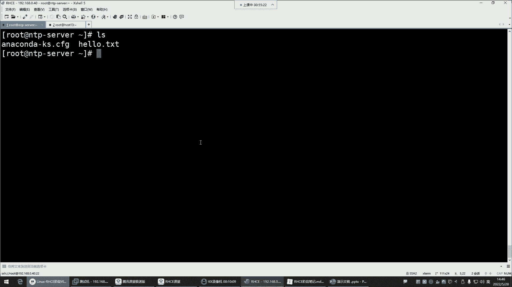
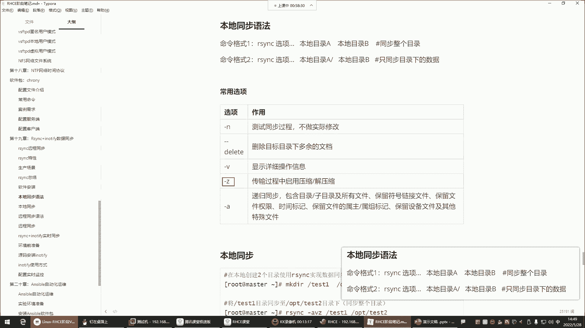
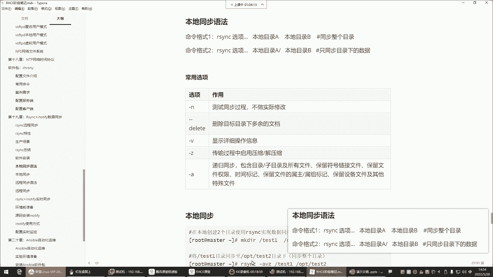
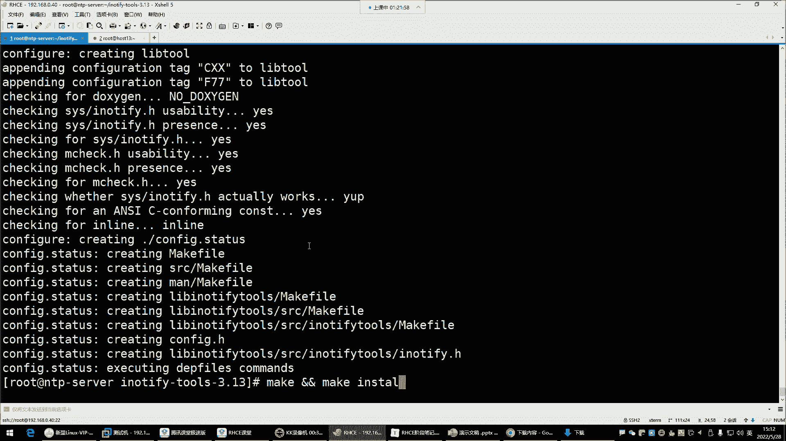

# Linux最全RHCSA+RHCE培训教程合集，小白入门必备！ - P61：红帽RHCE-24.Rsync+Inotify数据增量备份 - -Book思议8 - BV1ZV4y1v7c8

那接下来讲什么呢？接下来我们讲这个i think加innotify叫数据同步。哎，这个都是同步。这个数据同步同步什么玩意儿呢？这玩意儿看看这个i think啊，它可以帮你实现那种数据备份。

他这个备份是怎么备份呢？叫做。本地备份或者说远程备份都可以。这个ithink是一个开源的快速的多功能的实现本地或远程主机的一个数据的同步与增量备份的优秀工具。注意。就是主要应用在数据备份。

跟数据同步这个领域。那这个东西一般什么场景呢？就是比如说企业服务器啊需要做备份。企业里面呢一般会有那种单独的服务器。😡，搞一个单独服务器。什么呢？典型的。那个NFS。NFS哈就是上一课给大家讲的。😊。

NF4它不就是一个网络的这种什么呢？叫做附加存储吗？那别人是不是就是NFS服务器可以把自己的文件夹共享给这个主机，是不是啊？那共享给这个主机的话，那他把他的文件夹给它挂载过来。比如说他们两个之间。

是一个挂载的关系。它是挂载了NFS的这个什么呢？那个文件夹了，到自己的本机了。那到自己本机以后呢。😊，那这个时候我们想做数据备份。那这个数据备份啊一般。我们一般就是可以通过哪种方式呢？比较典型的。

你像常用的命令里边是不是有什么CP啊，是不是啊踏压缩都可以做备份嗯。😊，对，没错。哎，这个理解还是对的哈。😊，算增量。但是呢我现在跟你们说说这个这个CP跟它的它的这个优点与缺点哈。

这个优点与缺点是什么呢？你比如说咱们就拿这一个文件来说啊，这是一个文件。😊，啊，这是一个文件哈。那这个文件呢我们比如说。😊，第一天的时候，他呢产生了两条数据。产生两条数据。好。

那接下来呢我对这两条数据呢，我做了一个备份。那这个数据是不是两条啊？😡，啊，那两条数据我在备份的时候，那这是我的一个备份的。对啊，这是我的一个备份的一个文件。我给它放到哪儿了？

放到我的这个NTP服务器了。备份过去了，注意啊，我现在是说这两个服器啊，我在做备份好。😊，那现在呢我这个备份文件一啊叫备份文件一。备份文件一。那这个一呢里边有两有两个文，有两条数据。

那随着这个文件呢又什么呢？又这个。产生数据了，又产生了两条是吧？好，那现在这个文件里边又增加了两条数据。那由于这个考虑的数据安全性呢，我还得对这个文件做备份。那说这时候又对这个文件。做了一个拷贝。啊。

那就是备份文件2。第一次的时候是吧，两条第二条呢，第二次的时候呢又多了一些啊，就变成备份文件二了。那这个备份文件2的话呢。里边你有你想象一下，是不是有曾经你备份过一次的两条数据啊，而这两条呢是新产生的。

那你这次第二次备份的时候，是不是前面这两条就多余了呀？😡，有点多余了。是吧那如果这个文件现在哎又随着什么呢？又随着服务器的运行，又产生了几条数据了，又产生了两条。😊，好。然后呢，你考虑到数据的安全性。

你又给他做备份了。那你在做备份的时候，那我问你，你第三次的时候，这个备份文件里面。这是备份文件3。好，那你的第三次备份文件里边是不是有前两次备份的重复的内容了呀？哎，这能理解吗？各位理解的话。

给我刷个一，就是你拷贝，我CP拷贝，我踏压缩是不是都是不是都是这种情况啊？😡，你看你第三次备份的时候，就等于说前两次备份文件里有的东西，哎，我这个第三次备份是不是都有了呀？

那前两次那是不是就有点浪费存储空间了呀，是不是哈有点浪费了哈？😊，他就是浪费存储空间了。啊，这是传统的拷贝。对，重复了。注意，这种就是传统的拷贝，传统传统的备份方式。而我们所说的增量备份是什么意思呢？

增量备份。它不一样。质量备份。看哈或者说增量同步，哎，这种它是同步的即时帮你备份。我们说什么叫同步哈，就比如说。😊，如果你同步的话，我第一天的时候，我这个文件里面有两有两条数据。然后呢。

我考虑到数据的安全，我把这个文件呢给它备份到这个NFS这个备份服务器里面了。那第二天我这个文件又产生了两条数据。😊，又产生了两条。那接下呢我又对这个文件做了一个备份。那这种同步的话，注意。

如果你用ithink。如果你是用ithink去做这个数据备份的话，那你永远不会考虑会有重复的数据。为什么呢？啊就是你这个文件里面多了两条数据，它会把这两条数据给你干嘛呢？哎给你增加到这个备份文件里面去。

哎，那你曾经已经备份过的那个文件。它能够识别得到。哎，有时候这个好处就是它永远不会出现重复的内容。😡，能理解吧啊，那我这个文件如果又增加一条数据呢？好，你又怎么用ithink做了一个备份。

那ithink它也是能够识别到啊，前面的数据都有了，那干嘛呢？就把这个文件里面新增加的内容给你同步过来。那这样的好处是什么呢？这个好处就是节约存储空间，是不是啊？这就是i think。

那你说这东西是不是比那个CP什么的要好用的多呀？😡，没错。这备份过去是付呃。这个看情况看情况哈，它有一些选项，就是如果你希望他们之间一定要保持一模一样的话。😡，那用选项可以实现。

但如果你说你在备份的时候，它是允许你备份文件的内容比你的这个什么呢？语言文件要多的。没关系，能理解吧啊，这个没有影响。😡，这可以通过选项控制。好。好，喂喂喂好了是吧？好了好了，这个麦接触不是很好。

现在是不是恢复正常了呀？😊，ok继续了哈。😊，所以说理论的话呢，大家了解就行了哈。那接下来。😊，在生产场景的话，怎么用呢？大家可以下去自己去看一看。总之呢，你只要是需要这种同步的备份。

你就可以用asthink。OK吧那接下来呢咱们就下边说说它这玩意儿怎么用。第一呢，要安装它的软件包，它的软件包。😊，叫RSYNC。那这个包有没有呢？如果没有你自己额外安装一下吧，看一下RPM。

RPM然后杠Q。RSYNC没有没有，就亚姆杠外因斯特回车。安装好了。

安装好了之后呢，那注意啊，它是个工具，这玩意没有服务哈，它就是一个工具，拿过来就用就行了。那它的用法呢，第一，命令格式一。😊，看看命令格式一呢是同步整个目录。命令格式二是什么意思呢？

是只同步目录下的数据。好，那这个玩意儿我们现在。

去准备两个目录哈，我们把这个。看看根目录。嗯。呃，建个目录吧，makeDR建一个。RSYNC。太子弹。好，然后再建1个ISYC什么呢？嗯。Back克。把那个太子删把那个太子的删掉吧。RYNC。太死了。

删掉吧。一个就行了。然后。我们现在在自己的家目录来给大家演示一下，我建几个文件，建一个hello。hello点儿TATT。好，我的加目录现在有两个文件是吧？那接下来咱们演示演示它这两种命令格式哈。😊。

大家。这个位置哈注意一下。我现在是做什么呢？叫本地同步。注意哈，我现在是在做本地同步。知道什么叫本地同步吗？就是我这一台主机之间的同步。😡，我这单台主机之间同步哈，并没有跟其他机器在实现同步。好。

那接来呢我要把我root下的这两个文件给它备份。那如果是用命令格式一的话。好，如果我是用命令格式一的话，那这个时候就直接同步整个目录了，整个目录同步过去了。😡，来看RSYNC，然后选项这个选项的话呢。

都可以用哪些呢？也可以先测试一下杠N它是不做实际修改的。

在一般用不用呢啊一般也不用哈。第二个选项叫杠杠delete，叫删除目标目录下多余的文档。哎这个。就有点狠了哈，它怎么狠呢？😊。

假设。如果说我想把我这个root下的这两个文件给它备份到刚刚的根目录下的那个。备迫到跟录。看一下。跟下的RSVC back目录。那如果这个RSVC back目录有文件的话。

如果你加这个杠杠delete是什么结果呢？就是它会把你目录下多余的，只要是在我的root目录没有的，都给你删掉。

能理解吧，哎，这种可是实现一种什么呢？叫做保持这两个目录的数据是完全一致的状态了。啊，他不允许你的目标目录，有多余的文件。😡，好，V显示整个的操作的详细信息Z传输过程中请用压缩压缩Z的话呢。

如果说你在备份的时候，文件内容量比较大的话，可以让它先压缩一下。因为压缩以后是不是就变小了呀啊，他用GZ的格式把你压缩一下。但是这个过程你看不到哈，非常快，压缩以后呢，再去帮你去进行备份。

那这个传输速度是不是就快了呀啊，它也可以自带这种调用压缩格式啊啊后这个过程看不到压缩与假缩的过程，你看不到的。😊，AA的话呢，这个选项就功能非常多了，实现什么呢？就是什么包含目录子目录的所有文件。

保留符号链接，然后保留文件权限，保留文件的时间标记，文件输主数主，你把杠A给它理解成，就是保持所有的备份的属性不变就行了。所有备份的内容属性不变的，就给他备份。好，那接下来我们应该怎么用呢？

我们用AVZ。啊，咱们先不删除目标下对余的文档，就AVZ给我显示详细的操作信息。然后呢，备份的时候给我压缩一下，就实不压缩也行。咱们文件内容少的话呢，咱别压缩了。但一般在工作中呢。

大家可能会用这种杠Z的，能理解吧，所以咱们就直接眼神了哈。😊。

AVZ。所以选项。RSYNC然后杠AVZ后边本地目录谁呢？root。哎，这个注意啊，你如果想直接同步整个目录的话，后边没有这根斜线。看到吗？没有这个目录这个斜线啊。😊，就是你这儿就不要加斜线了。

如果你加了斜线是什么效果呢？如果你如果你加了这根斜线，它代表是。😡，这儿哈同步目录下的数据，所以我们来验证一下。我先什么呢？先不加这根斜线，然后指定这是我的本地目录，同步到另外一个目录是谁呢？

就是RSYCback回车。啊，这个时候你看啊他给你显示说他给你同步了哪些内容过去。第一，root目录进去了吧，第二是目录下的所有文件也进去了。那接下来。😊，看一下那目录是不是有入它目录。

是不是直接把root目录同步过来了啊，那这是第一种方法，是不是就看你加不加这根斜线呢，不加斜线同步整个目录。😊，好，那我们现在把这目录给它删掉IM杠RF。行，上来以后呢，这个目录是不是又变成空的了呀？

那接下来咱们再验证，我不同步整个目录了，我只同步目录下的数据。那接下来。RSYNC然后杠AVZ。目录Aroot目录，哎，加格斜线就代表目录下的内容了，同步到哪儿呢？跟下了RSYNCback回车。

你发现是不是点儿杠。没有那个root了呀啊，是当前目录下的这些文件点杠是不代表是不是代表当前目录，就你当前目录下的这些文件我给你同步过去。那这时候你再看。😊，是不是这两个文件过去了呀？

当然还有一些隐藏的哈，你如果加杠A的话，你可以看到一些隐藏的。😊，莱，你加个杠A，你再看那个目录，当然还有一些隐藏的也过去了。这就是我们所说的什么呢？你本地同步看看你到底想怎么同步了。哎。

这不置大家理解吗？哦，这两种语法格式理解吗？能看得懂吗？看得懂的给我刷个衣上来。😡，有有没有什么问题？😡，是不是就在于那段斜线了呀？😡，好，没有问题。那没有问题。接下来呢两种格式都演示了。

接下来验证它真的是指同步变化的内容吗？我们接下来。😊，在我的这个什么呢？hello点TIT文件里面，咱们写点东西VMhello点TIT写一个什么呢？写一个。😊，hello，意思。Baby。好。

然后保存退出。那是不是我现在给这个文件里面增加内容了呀？那增加内容的话呢，我现在又想对这个新增加的内容给再给它备份一次。😊，好，那这时候再来一遍就RSYNC杠AVZ。

然后把我root目录下的所有备份到根下的RSYNC回车。哎，来，大家注意看。他备份了什么呢？他备份了你的VIM的信息，你VIM的1个hello点TATT这文件了，看到了吗？也就如说这个文件发生变化了。

你看到吗？别的文件好像没有给你重复备份吧，只又给你干嘛呢？同步了这个文件了。为什么呢？因为这个文件发生变化了。这个文件的内容发生变化了。😊，那我们就直接来看。🎼来看这个啊，不是这个机器啊。

我怎么总想点那个机器呢？啊，我们接下来来看RSYCback目录。好，接下来打开这个目录下载hello点TATT哎，你看同步过来了。同步过来了哈那接下来我们再验证一下。😊，我现在呢再往里面增加点内容。

或者说我直接在这建个文件就行了。在我的目录建个文件，touch一个什么呢？它是1个ABC点TATT。😊，我现在再同步，把命令直接拿过来，同步规车。那你看这时候他又说了，他说你这里边有个ABC的TIT。

我给你什么呢？给你。😡，同步过去了。那接下来看看这个目录。是不是ABC点TIT同步过来了，它没有显示的，就证明这个文件没有变化。那如果现在再去改hello点TIT，再往里面增加一个。叉叉O保存退出。

我再同步。回车你看它又是只给你什么呢？哎，只给你同步这个哈lo点TIT别的文件它没动。😡，是不是啊啊这就是叫本地同步，是不是能够看到它确实是只同步什么呢？变化的内容啊，没有变化的。😊。

他是不会去帮你重复去做备份的。O。那你要是CP呢，你要CP的效果可不一样了。每次问你要不要覆盖，每次问你要不要覆盖。😡，😀哈哈。😊，好，这是本地同步。那接下来再给大家验验证一个什么呢？

就是这个刚刚dele。😊。

嗯，对，杠杠delete叫删除目标目录下多余的文档，这个选项有点给力了哈，来看一下。😊。

比方说这个目标目录下有个多余的文件，我们。干嘛呢？我们touch在这个目录下建一个文件，建一个什么呢？啊，建个test点TATT。那现在证明一下，就是我这个备份的目录。多了一个test点TATT是吧？

然后呢，我这个root目录原目录没有那个test点TIT。那现在我如果再同步的话呢，对于这个目标目录新增加的这个文件是不会有任何影响的。你比如说我现在就VMhello点TIT。😊，往里边再写点东西。

下点东西。I口一个。Hello。Baby。🎼B位叉叉O啊，保存退出。接下来。我再同步啊，直把命令翻过来。😊，回车是不是只同步了这个文件呢？哎，那接下来你看看。😊，这个在这个目标目录有变化吗？没有变化。

ts的天提是不没有受到影响，没有哈没有受到影响。但是如果你同步的时候，你加一个杠dele这边。😊，你再加一个选项叫杠杠。Deele它。回车。你看他告诉你什么呢？他告诉你，我给你delete了一个文件。

谁呢？t点TIT。😡，为什么呢？因为这个dele它主要的功能就是要让你这个目标目录的内容跟我的什么呢？这个要同步的目录的内容要完全一致，有多余的给你删掉。😡，能裂吧。呵呵。😊。

所以你这时候再看这个目录就没了paTATT就没了。所以如果你想让它实现什么呢？这种就是如果真的是这两个目录之间一定要保持同步的话，就加杠deelete。如果你有的时候我们可能会觉得哎呀这备份的时候。

那不小心我们把我的语原目录的内容给它误删掉以后，是不是在备份的目录还能找到啊？😊。

是不是啊？所以呢一般这个杠dele别加你备份嘛，是不是你想想你在本地不小心把某个文件给它删了，你是不是还能从备份文从这个备份的地方给它找回来呀？从备份目录啊。那如果你让它加个杠delete了。好。

你再同步的时候，你本地没有这个东西。😡，那他一看还备份目录，有那个文件，是不是也给你删掉了呀，这不就丢了吗？😡，🤧嗯。

能理了吧啊，这就是我们所说的什么呢？就是。😊，杠上delete这个选项有点危险哈，这个选项有点危险。

但是有有有可能说有些情况需要你做这种同步删除的操作，那你家就加这种杠刚delete。啊，那这些选项哎是不是给大家都已经讲的清楚了呀？这些选项现在。ok明白了吗？明白的话给我刷个6。本地同步加这些选项。

用法、命令语法都OK吧。好，O。那接下来呢远程同步注意哈，本地同步是在本机。啊，把lo点贴贴删一点是吧？行，删点再同步一下。

hello点TIT删一行。再同步一下哈。那加不加杠dele呢？你得加。你得加上不车。😊，他同步谁了呢？同步hello点TT了，是不是啊？😡，hello点阶梯发生变化了呀。

所以你VM打开这个目录下的hello点阶梯是不是也少一行？😊，是吧。は。但如果你不加杠刚delete呢。😡，你不加的话。😡，你比如说我我先去改hello点贴贴。😊，删掉一行是吧？你再去什么呢？😡。

再去同步。回车。哎，你们猜这它会变化吗啊。😡，试试哈看看哈。😊，他也变。😊，对他也变哈他也变哈。😊，内容跟文件不一样。他的你文件内容跟文件是不一样的哈。😊，所以这个你要搞清楚哈。好了。

那接下来呢我们就下面说远程同步了哈。😊。

远程同步。远程同步是什么意思呢？就是不同机器之间的同步了。😡，就是我希望我的这个机器。😊，的某一个目录干嘛呢？跟我的远程服务器之间要什么呢？要做一个备份。那这时候就是。实现远程同步。

把本地文件备份到我的远程服务器去，用ithink也很给力。好，那这个时候。呃，来看哈远程同步的用法跟本地的没啥区别。然后我们先回顾一下我们以前学的一条命令SCP。😊。

SCP这条命令是不是远程拷贝啊？比如把hello点TIT以root的身份拷贝给谁呢？192。168点0。13，拷贝到它的哪个目录OPT回车。首次链接输入个ys。输入对方的密码回车是不是拷贝过去了。

这叫远程拷贝。然后你看这个机器的OPT是不是就有一个哈lo点TT了呀？没错，远程拷贝过来了。那远程同步是什么意思呢？就是把SCP换成rthink就行了，就是RSYNC。😊，然后加选项杠AVZ。

然后指定本地的文件是谁？咱们本地还有一个哪个文件呢？我看看哈。😊，还有什么文件呢？我root下。有ABC吗？有ABC的贴梯。放到OPT目录。注意，那就别直接同步文件了，这整个目录下的内容吧，行吧？

我现在要把整个root下的内容干嘛呢？同步到远远程服务器的OPP目录。😡，这叫远程同步飞车密码一飞车。啊，远程命令失败。AVZRSNCAVZ rootot。OPT。呃。看一眼不错哈。连接意外关闭了。

连接失败了，远程命令不存在啊，sorry，远程也要安装I think哈y杠YinsRSYNC。这时候你再来。再来跑一遍会车密码，回车同步了吗？看到吗？是不是？😊，好，给你同步去了。

你看这时候你看到OPT。😊，推车。是不是？把整个root目录下的内容都给你远程拷贝过来了呀。唉，那我现在问一下你们。😊，远程同步的语法。会吗？啊，会不会会的话给我刷个衣裳来。😊。

是不是还给你们回顾一下SCP了呀？😡，嗯。SCP怎么用ithink就怎么用，知道吧？就是多了一个选项而已嘛，这不就是换成ithink的选项了嘛，是不是啊？😡，那剩下有区别吗？没啥区别吧。

就是我同步整个目录下的内容到这个地方是不是一样的？😡，是一样的哈。所以这就是叫什么呢？叫远程同步。呃。不SCP如果想拷贝一些单个文件的话。还蛮实用的哈，单个文件拷贝。SCB不适合备份。

你比如说我这个机器往这个机器传个包。😡，那这个SCP还是蛮合适的。然后你的每台机器都要保持有这个asthink这个工具才行，能理解吧。因为它通过Ithink帮你去执行命令的。所以刚刚才会出现那个报错。

好，那接下来咱们再验证验证什么呢？验证如果本地增加文件再同步的话呢。😊，就是这种最好做免疫。你要明白哈，就是我们如果真的是这个实现这种远程的拷贝的话，提前做好免密SSH。Gun。😡，KG生成个妙段。

然后呢SSH杠。靠贝杠ID。哎，你把这密钥段给它拷贝过去，192。168点0点13。把密钥对拷贝过去，那以后远程同步不用输入密码，直接就过去了。😡，好，现在我们验证本地建个文件pauch个。什么呢？

pa的点TT。好，是不是本地多了个文件呢？那接下来RSYNC，然后杠AVZ。本地root家的。目录同步到谁呢？以root的身份。同同步到192。168。0。13的OPT目录回车。密码都不用输了。

直接同步过去了，是不是看到了吧？test的TT文件过去了。😊，好，然后你生成的这两个公司要也过去了。那远程主机的OPT。你看一眼是不是太斯的点贴贴过来了。哎，这就是远程同步。是永久的。

因为它是文件的方式保存的，是永久的。只要你不删，它就一直可以用。

好，OK那远程同步无非不就是干嘛呢？是不是就换了一个什么呢？多了一个远程主机的一个信息呀，是不是剩下你到底是同步目录的。😊，本身还是同步目录下的内容，是不是就看你自己了呀？😊，哎，这就是远程轮毂。

跟本地没有太大差别没有太大差别哈。好，那下边我们再来说一个i think加in notify。这个呢用的不是很多，我再给大家讲清楚哈，这个为什么用的不是很多。

因为innotify呀它呢比较消耗服务器资源。😊，这个inow的话呢。是内核用于通知用户的一种什么呢？系统变化的机制。它类似于一个小监控系统。类似一个小监控系统，监控什么呢？

比如说我系统里面的某一个目录的文件，或者说就直接监控某一个目录发生变化了，它马上就通知你。比如说你这有一个目录，你这目录里面多了一个文件好，他马上通知你删除了一个文件，他也马上通知你能理解吧？😡，啊。

这样的话呢能我能够让我们立刻的获取这些变化的信息。所以这就类似一个小监控系统。那这个小监控系统它可以帮我们去监监控。比如说我想对我的这个root目录。

我本地的这个root目录哈，我想干嘛呢？😊，让它实现一个自动同步，就只要是我这个目录下面增加了文件了，或者说删除了文件了，你就给我去同步。😡，不是我们手动的。那这个的话呢。

我们就可以用indoify帮我去监控我的这个目录。只要有变化了，然后i think去帮我同步，叫自动。啊，但这种呢比较消耗资源，大家了解一下就行哈。嗯，一般在企业里面不这么玩，在企业里面一般怎么玩呢？

在企业里面就是我们自己写一个curon。😊，还记得吧。crrowowntable杠E，我们自己写一个计划任务，但提前先搞一个脚本，写计划任务的话呢，我们一般就分时日月周，然后后边就备份的脚本。

这个备份脚本里边是什么呢？啊，一般就是batch我的什么这个那是什么叉叉点SH那个备份脚本啊，这脚本里面是你的asin和命令。😊，知道吧？然后什么时间备份，比如每周。一。晚上3点半。三点半。

那我这个脚本里面就是我的那个ithink的备份命令。那我的那个命令不就是我们前面所说的RSYNC然后杠AVZAVZ然后同步同步谁呢？同步本地的某一个目录，然后同步到远程。192的168点0点。好。

这个主机的哪个目录OPT所以说这个脚本里边就是这条命令。好，那这条命令计划任务会帮你在每周一的凌晨3点半去跑一次。跑一次以后，是不是就实现了一个什么呢？叫做自动备份的呀，而且是增量的自动备份吧。😡。

比那个碳压缩是不是要好用啊？啊，而自动的话呢，得需要你用脚本让它一直运行着消耗服器资源。所以那个了解一下就行，知道吧？呃，这个大家知道下就行哈。就是我们如果后期做备份。

I think要结合chrometable。放到胶拌里边。

好，接来呢这个inno的话呢，我们说一说你得去什么呢？提前因为什么呢？因为你想做远程备份，我们都得做好免密，这样的话呢你就不用输入密码了，提前做好免密。

然后接下来呢安装这个包得原码安装这包的话呢在哪儿呢？😊，它的官网在这儿。官方地址哈在这儿。他这个包版本。非常的旧。看一下哈，这里边。这个这就是他的那个包，看到吗？你看2008年的这个包哈。

2008年的到现在十多年了吧，是不是啊？然后你点进去。😡，点进来以后，它现在最新的版本就是3。13的。文件夹点进去啊，这里面就是它那个套包。你把这套包下载下来。用浏览器下载下来，传到我们的机器里面点。

下来。

下来了吗？下了呢哈好下载好了之后呢，我们通过下载。😊，下载内容。还没好呢哈。好，OK在文件夹中显示给它拖到我们这个机器里面去。😊。

我这机器里边。拖进去啊，等一会儿拖不进去是吧，安装一个包，ym杠Yin此到叫LRZSZ这个包可以帮你去实现windows与linux之间的一个文件传输。

这个包。这个名哈。

啊，然后接着呢把这文件。拖进去。

拖下来了之后。它这一个踏包原码的哈。嗯。嗯接下来呢。🎼杠叉F派解压加以后，它生成一个目录CD到这个目录L4。这个原码是不是得需要编译啊，那得安装个TCCC原写的yM杠Y。ins套GCC。🎼好。

安装好GZC以后呢，那接下来点杠confi执行这个脚本，就这个脚本哈。😊，小本。那这个脚本我们还可以怎么用呢？指定安装路径，杠杠help。它也可以让你你我们就看这个脚本的帮助哈。

杠看 help法这个脚本的支持的参数。😊。

可以让你使用这个叫杠杠pro fix指定它的安装路径，看到吗？他说你想安装在哪里，你就指定就行了。在proface中安装与体系结构无关的文件，就是你用这个杠杠pro fix。指定一下。

等于我给它安装在系统的优色locgo啊叫。引楼体饭。就让他叫这个名字。

是不是哈？

多了一个N是吧？好，那其他的小纸嘛，其他的不用了，就直接回车。😊，天儿热是吧，我也热。我也热哈好，环境没有问题。接下来呢make并且make。烟死套。

会编一边安装。

好，安装好了吧，安装好了之后，我们是不是进到那个安装路径啊，user local inify。😊，好，那接下来对于这个目录呢，看它的 bin就行了。这个B目录就是它的命令。这个命令呢你直接干嘛呀？😡。

直接就给他搞个链接，软链接。将命令程序链接到派摄路径以后的话呢方便调用就行了。这是它innotify white是它的程序。他给你提供的这个程序命令。这个包大家知道怎么下吧，我是不是教你们了呀？😡，啊。

那接下来呢。创建个链接就行了。

在这儿。LN杠S来一个软来一个软链接。我当前那个路径就是。软链接一定要绝对入径哈，相对入径不行。😊，fi下的并下的in notify外。

链接到。跟下的哪儿呢？

死病。好，可以了。那以后你在系统的任何位置都可以直接敲它这个命令indentify。外ite tape键补齐了啊，这 tape键就可以补齐了，看到了吗？可以直接可以补齐了。😊，IN加个O补齐。好。

啊，接下来这玩意它怎么用呢？😡，啊它的命令innotify，然后呢选项目标文件。他这个哈。一般你让他监控没啥意义。😡，他光监控呢。一般呢我们也执行一些操作，所以呢我们要通过这种脚本去。

跟ithink去相互结合。所以你安装好以后，不用在命上去用它，就直接通过这个脚本来给大家演示一下。这个脚本看哈是一个死循环的脚本will循环。😊，vi要循环循环，后边是不是得给他一个条件呢？😡。

这个条件就是我的这个命令，我的这个命令去持续的去监控这里边杠RQR呢就是递归监控。比如说你给他一个目录。好，哪个目录呢？比如说监控我的。root目录。

那他会把你这个root目录以及目录下的所有的子文件子目录都给你监控上。所以这个呢叫递归Q的话就减少屏幕输出。因为它每次监控会有屏幕的输出，我们就不要输出结果了，能理解吧？把输出结果给它扔掉。😡，啊。

就正常来讲，输出结果就不要了。然后杠E。😡，监控时如果发发生一些修改的操作，创建的删除的跟权限改变的操作都监控。好，然后呢，这后边就跟上这些参数了哈，杠E后边跟上什么modify呀。

createdele，还有一些权限之类的都指定上。就是我监控这些东西一旦发生变化。😊，发生变化，条件成立了吧。😡，是不是啊？好，调件成立以后，是不是执行度根道理的语句啊，i think去给我干嘛呀？

同步。😊，同步。那这脚本大家什么时候用，什么时候可以拿过来试一试哈。😊。

写个脚本CD到squi上。哎，我跟下怎么没有这目录了呢？呃，建一个吧。🎼scriptcr的脚本目录。接下来呢咱们编写这脚本，就让它叫usthink点SH。

粘贴进来啊粘贴进来。😊。

好。那让他监控哪个目录呢，我们换个目录。别太色一了，我们让他监控我本地的root目录。啊，然后呢下面改一改。健康root目录。要不要同步删除啊，别同步删除了。😡，铜木山竹有点。太危险了，同步给谁呢？

同步给谁？13。啊，通不到它的OPD目录。嗯。这点脚本儿啊。好，这个脚板他就帮你监控是吧？😊，🎼监控以后，右边咱们再来终端，我们去建一个在root下，我去干嘛呢？先建一文件去哈。😊。

touch1个ABC不行了，touch一个test。01点TT。这边有输出吗？有输出了，看到了吗？是不是有输出了，给你接控上了。😡，对，然后那这边有变化吗？拉个4OPD。太子的01过来了，是不是看到了？

好，再建个文件。太测02。回车。有变化吗？他说t测02。跑哪儿去了？看个PD。有没有过来，是不是过来啦？这自动同步了哈。😊，啊，那这脚本扔到后台运行哈。如果跑脚本的话，这脚本放到后台。😊，加个这行权限。

趁着modode加个X。然后呢，让它在后台运行加个and符回撤。就可以了。就可以了。他就在后台在默默的运行上能理解吧？行了。

啊。好了，那这就是。😊，ithink跟indo实现一个什么呢？叫做数据的同步，而且是实时的。但这种用的比较少哈，为什么呢？😊，这种的话呢它比较消耗CPU。所以一般的话呢大家了解一下就行，ok吧。😡。

别让它运行了哈，消消耗内存，消耗CPU消耗内存。所以说呢我们直接给它干嘛呢？直接给它干掉，先让它跑到前台来嗯。😊，ctrl C解除掉。不要在后台运行啊。O。好。行了，那。

我问一下你们哈，这个位置有没有什么问题？嗯，没有问题的，给我刷个一。😊，嗯。学的都挺不错呀。好，那咱们歇会儿吧。😊，今天讲完了吗？肯定能讲完的。你看今天还有一个安斯本，我们就能讲完了哈。😊，啊。

歇会儿吧，各位。😊，休息个10分钟。

