# Linux最全RHCSA+RHCE培训教程合集，小白入门必备！ - P8：红帽RHCSA-8.mv、cat、less、head、tail、rm命令学习 - -Book思议8 - BV1ZV4y1v7c8

哈喽哈喽哈喽，大家能听到我这边的声音吗，啊我回来了，然后耽误了几分钟时间是吧啊，没关系哈，回来的话给我啊，都回来的话。

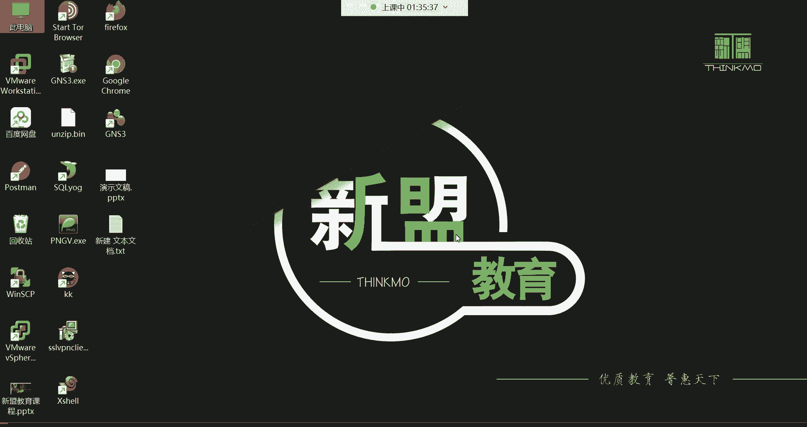

来给我刷个衣裳来哈，我们继续，嗯CP命令讲的也差不多了，然后下边我这里边注意啊，这个笔记里边是有非常多的这个案例的哈，然后这里边有一个小操作啊，什么操作呢啊可以使用点配合CP命令啊。

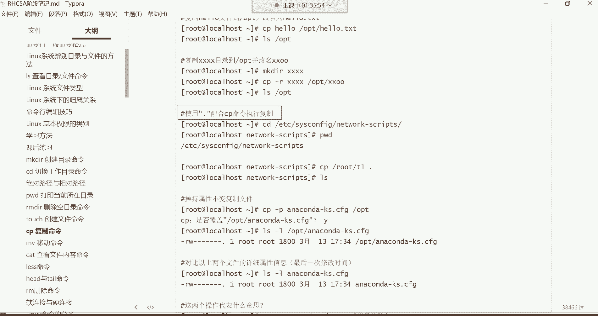

但这个操作的话可用可不用哈，因为前面讲点的话呢，我们并没有收到这个这个点，它的应用场景是吧，那这个时候呢比如我想做一件事，什么事呢，我想这样，我想把那个网卡的配置文件啊，给他拷贝一份CP啊。

我要把etc下的cs tab键，config tab键，然后呢network tab键杠tab键，那个网卡配置文件叫什么呀，是不是叫if c f g啊，啊，你两下tab键就把这个目录下。

所有内容都给你列出来了哈，啊接着呢我要把这个if cf g tab键，eens tab键拷贝到哪儿呢，拷贝到我当前的所在目录啊，那我就直接什么呢，点回车，阿拉斯啊，你看这个文件就被我给拷贝过来了。

看到了吗，是不是就考是不是就拷贝到哪了，哎当前了，就是你当前在哪儿，这个点就代表是哪里啊，所以说这个点呢你可以用作拷贝啊，这样也可以能力了吧，这点你就知道它代表是当前的意思行。

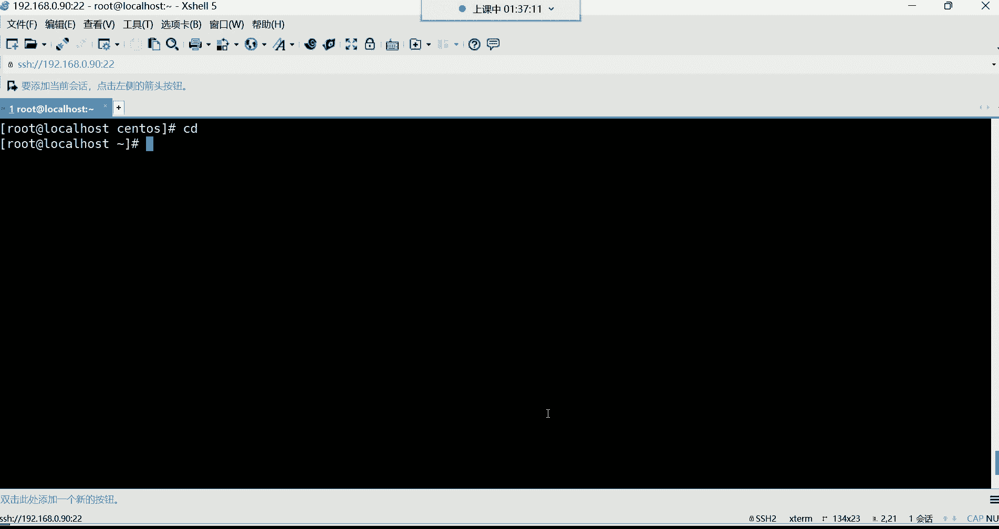

那下面还有一个还有这个，这个呢来给大家说一下。

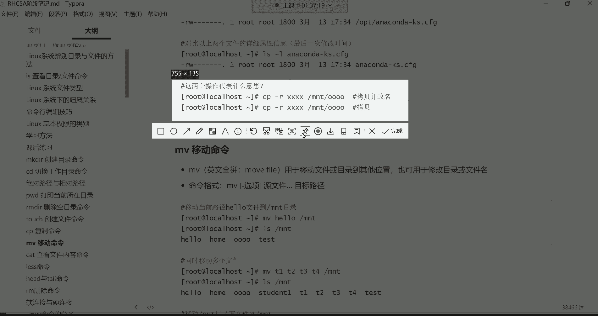

这有两个操作，哼这两个操作，好现在针对这个hello这个文件哈来看一下哈，啊不能说针对于文件针对目录啊，这个这个test这个目录我现在这样，我看一下opt目录啊，我现在这样CP杠R好，我要把test啊。

就是我当前加目录的这个test什么呢，拷贝到OPT目录回车，注意哈，我现在再来一遍回车，你发现这两条命令在拷贝的时候，正常来讲应该是第二次，应该是重复拷贝的吧，你第一次拷贝过去是不是有一个同名的。

第二次拷贝是不是重复拷贝了呀，那重复拷贝的话应该会有提示吧是吧，因为重复拷贝他会问你要不要覆盖，我告诉你，但是没有那个提示，那你们能够理解这两次操作，为什么说没有出现任何的报错呢，细节来了，细节来了哈。

那你看我第一次拷贝看OPT目录啊，是不是拷贝过去了呀，这是第一次拷贝吧，没错吧啊拷贝到这个test，把这个test目录拷贝到OPT下面的，然后第二次我又做了一个拷贝，这样哈，我这样吧，这样吧。

我第二次如果这样做的话呢，它会出现一个什么样的情况呢，啊就是这两次拷贝第一次拷贝过去了，第二次呢就是注意啊，啊第一次由于这个OPT啊，他压根没有这个太字目录啊，我就拷贝过去了，那第二次再拷贝的时候。

那这时候呢如果你不指定这个默认情况下，如果重复拷贝哈。

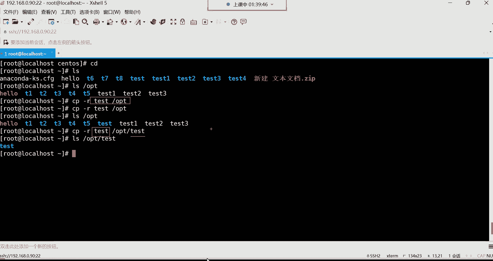

嗯我这个操作我他妈我看一下，我看一下啊，第一次。

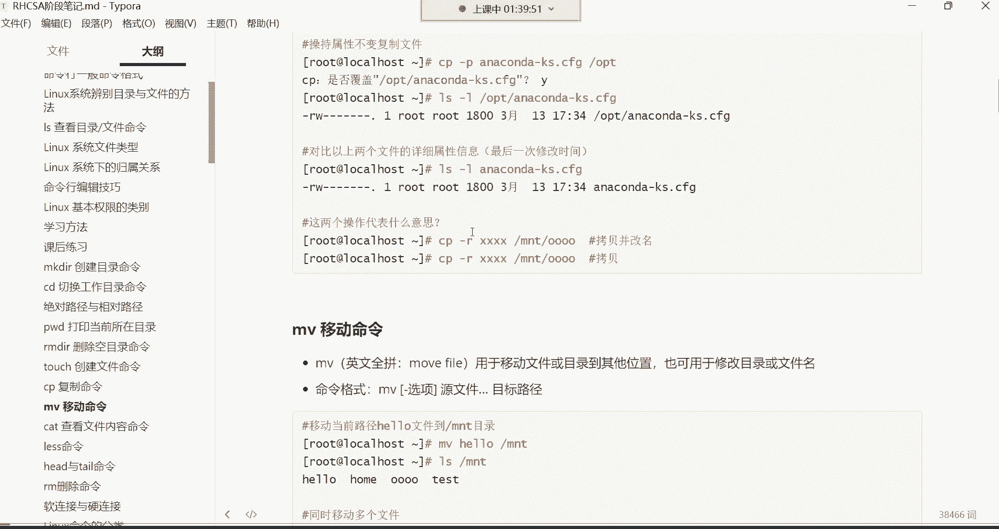

哦是这个操作哈，这个操作这两个操作呀还不太一样啊。

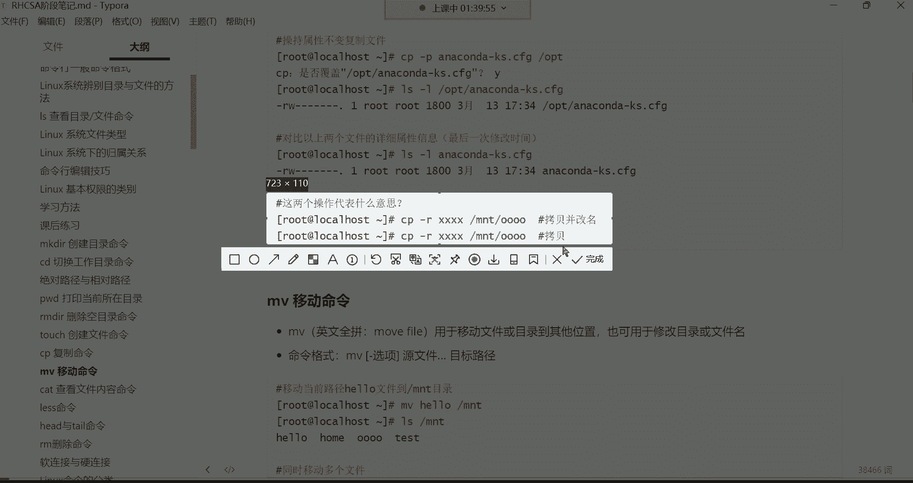

还不太一样，我前面这两种操作是属于重复拷贝了是吧，那重复拷贝的话，正常来讲它会有一些这个什么呢，有些这个覆盖提示的，因为同名了嘛，他问你要不要覆盖，那为什么说这个没有出现这种覆盖提示呢。

是因为这两个目录都是空的啊，这里边没有没有什么东西，所以他没有这种提示，而我们这个操作跟前面还不太一样，你看如果我这样做，我CP咱拷贝目录还是把这个拿哪个目录，拿那个test1来说吧。

拿我这个test1test1这个目录啊，拷贝到OP t下边，让它叫什么呢，让他叫这个嗯，叫叉叉叉，然后第二次呢word命令再给他拿过来翻一遍，注意啊，这种操作就是重复的操作，重复的操作做了两遍。

这两个操作，第一次，第一次操作呢是OPT本身就没有那个什么呢，没有这个test1这个目录，然后我给他拷贝过去，给它改了个名是吧，那第二次拷贝呢，你看我是这样拷贝的，还是拷贝这个test1这个目录。

还是拷贝的OPT目录，那这个时候由于啊，OPT下边已经存在这个叉叉叉叉了，所以我再重复执行的时候，它是属于拷贝到叉叉叉叉下面去看了吗啊，所以这个你要理解的话，就主要是理解它有个改名功能。

主要是有个改名功能，你别到时候拷贝的时候呃，你后面指个名字完了呢，你到时候你自己记不清啊，搞得一头雾水啊，这就不行。

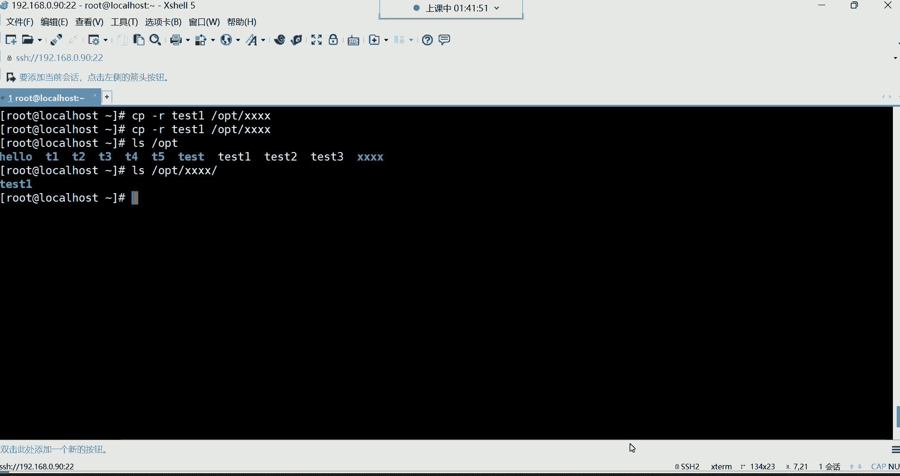

主要是说它这个改名功能一旦改名了，到时候你再拷贝，就肯定是拷贝到他的这个什么新的名字里边，去了好了，那下面说说这个MV吧，MV移动啊。

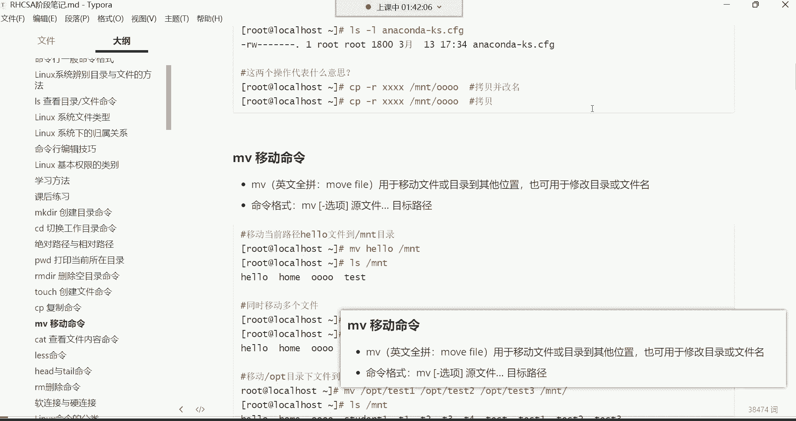

这个移动在windows里面叫什么，叫剪切，看右击剪切，你看啊，剪切剪切在这儿。

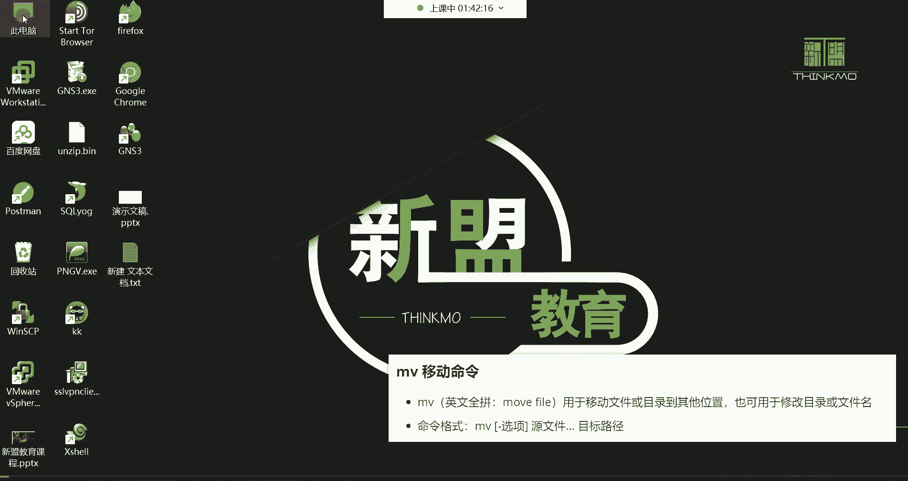

比如我给它剪切到哪里呢，我给它剪切到我的这个C盘啊，比如说这个用户好右击粘贴过来，所以这就属于剪切的操作了，嗯哼这剪切是什么意思，你看就是原文件就消失了，注意原文件没了啊，被你直接剪过来了。

他跟拷贝不一样，拷贝的话它是什么呢，是以一个副本的形式存在的，原文件不消失啊，再给你多一个副本，所以这就是他们两个具体的区别。

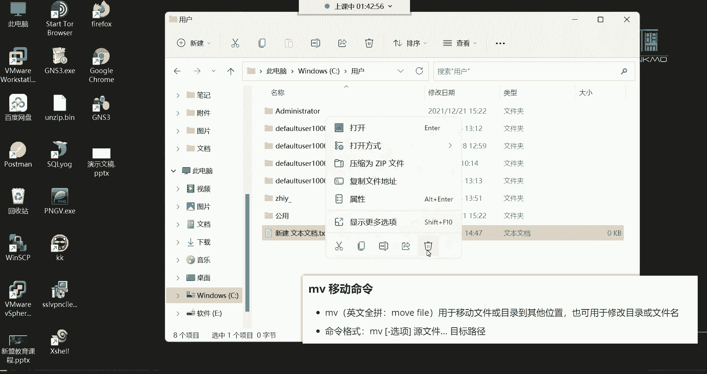

好了，那下面来说说这个MV啊，只不过我们这个里边它不叫剪切，人家叫移动，然后命令呢功能用于移动文件或目录，到其他的位置，其实就是剪切的功能哈，然后它也可以修改目录或文件的名字。

命令格式跟拷贝是一模一样的，所以命令格式我们就不过多啰嗦了哈，那现在我要做个操作，什么操作呢，我要把这个hello这个文件，我要给它移动到我系统的哪个文件呢，哪个路径的OP t啊，这有同名的不行。

给它移动到T1这个目录吧，OP t下的T1啊，这里面没有同名的，那现在MV指定hello移动到OPT下的T1，然后我们打开这个T1，看到了吗，这个hello这个文件就过来了啊，这就是移动，很简单吗。

很简单，这没有什么太多可讲的，然后如果你想移动多个也可以，比如我想把当前下的T6T7T八，这个目录移动到哪里呢，啊移动到这个OPT下的test目录，那就指定OPT下的test目录，好移过去了四。

然后看一下test目录是不是T6T7T八，就被我们给移动过来了呀，嗯讲到哪了。

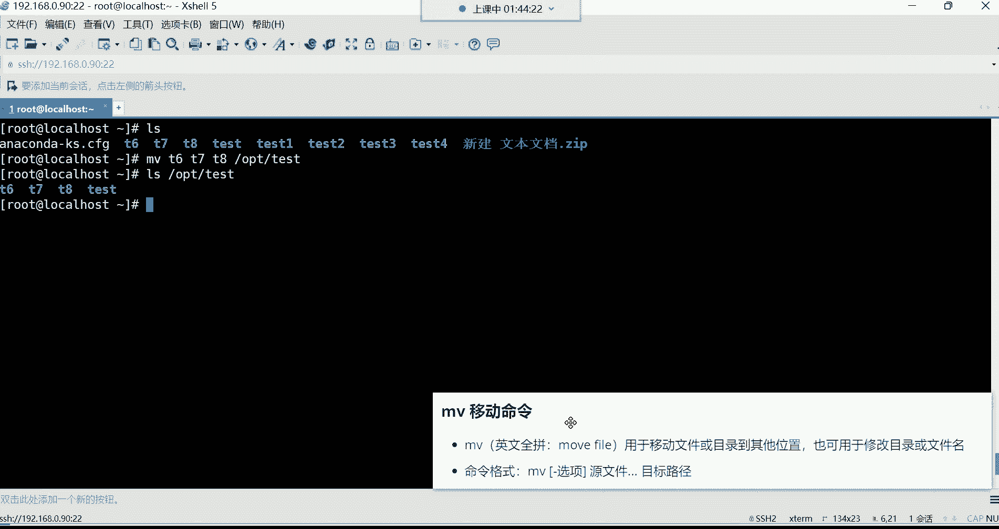

讲到MV1动了，那这个移动就比较简单哈，就是跟前面那个拷贝呢没什么差别啊，指定源文件，然后再指定给它移动到哪里，OK这不就是剪切吗，是不是啊，所以这个没有什么太多可讲的，跟他有个改名功能。

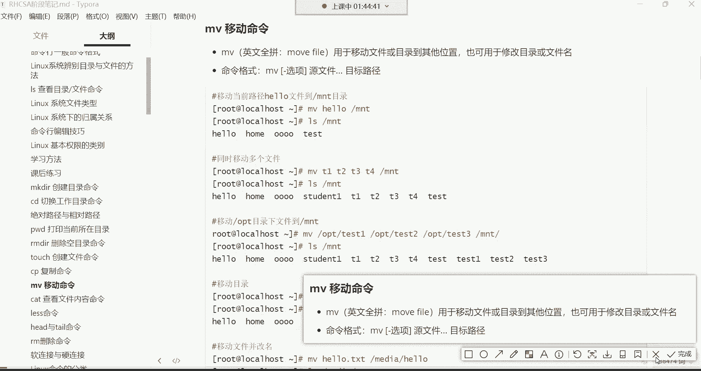

改名功能怎么改呢，就跟拷贝一样，拷贝怎么改名，移动就怎么改名，比如我现在这样，我MV啊，我要把这个，我把谁呢，我把这个test这个目录移动到哪里呢，移动到根下边，让它叫叉叉叉叉叉叉叉，注意哈。

你看我现在是指定了什么test目录，移动到根下边以后叫叉叉叉叉，看根目录，那你看是不是有一个目录名字叫叉叉叉叉叉呀，没错吧，哎这就是移动的时候呢啊顺便改了个名字，但如果你不想改名，那你就你比如说像MV。

把test1移动到根目录下边回车，那他原先叫什么名字，就移过去以后还叫什么名字，能理解吧，啊这就是移动。

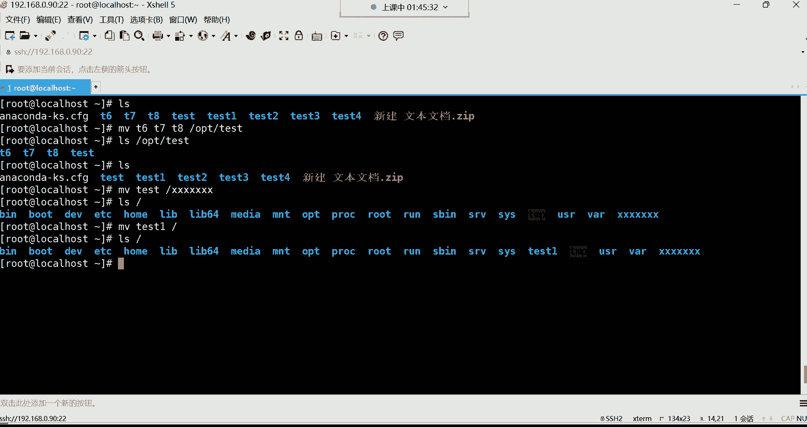

好了，那下边呢这个命令cat叫查看文件内容的命令。

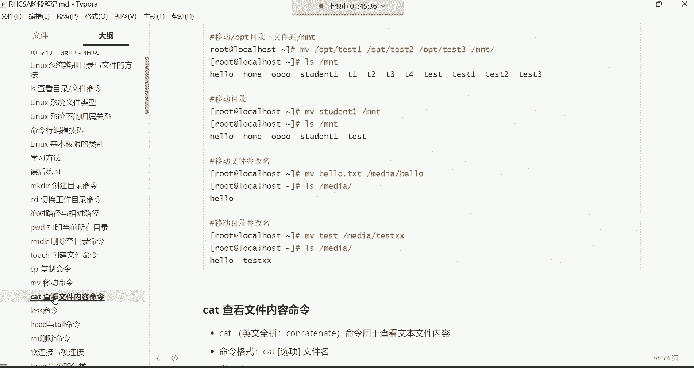

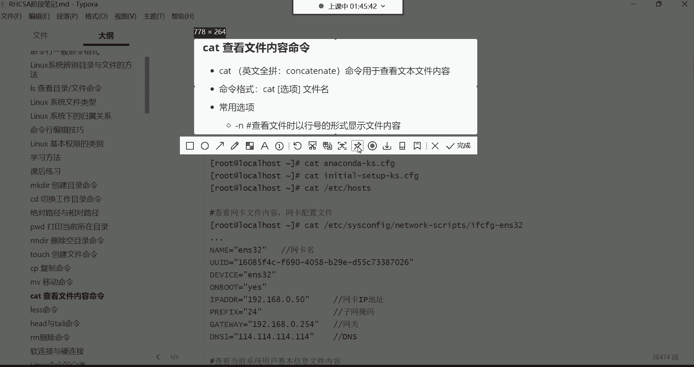

这条命令呢非常的非常的好理解，怎么好理解呢。

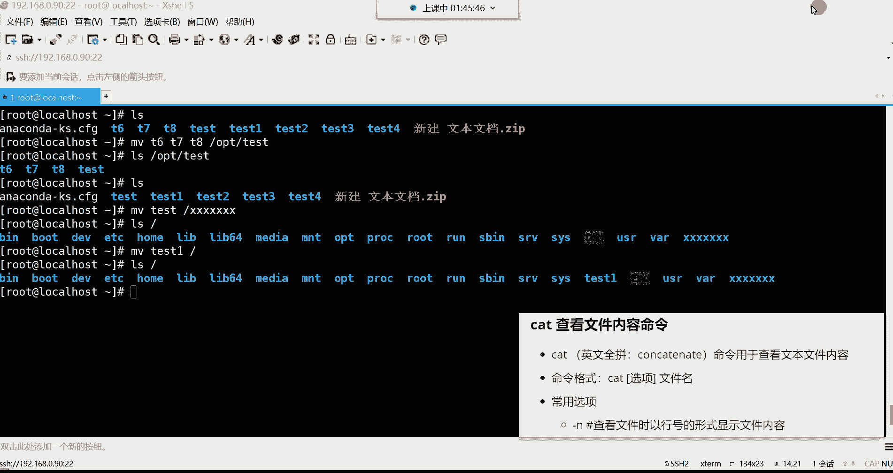

怎么查看文件内容啊，在windows里面怎么查看呢，windows里面有新建一个文件。

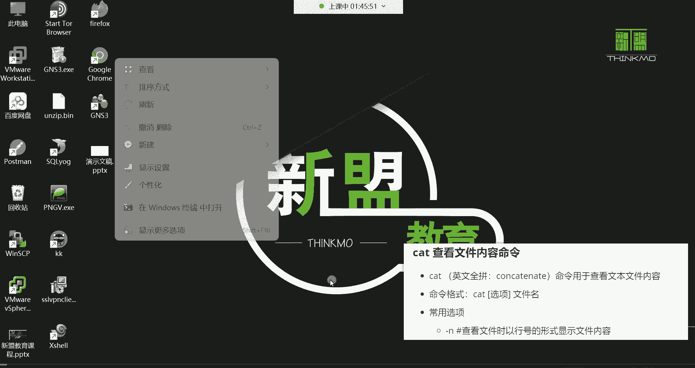

我想看看这个文件是吧，双击我就打开了。

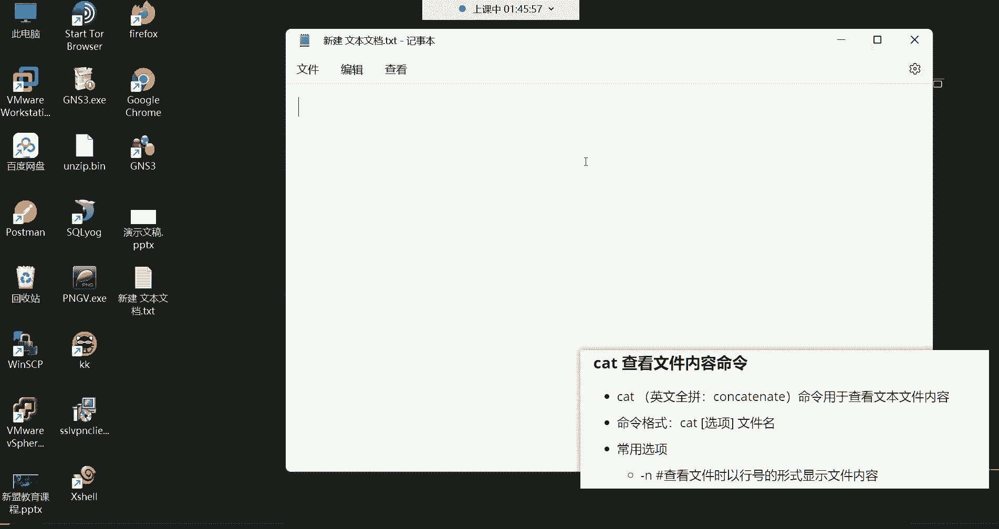

没错吧，就打开它了哈，但是呢这个LINUX这个系统呢。

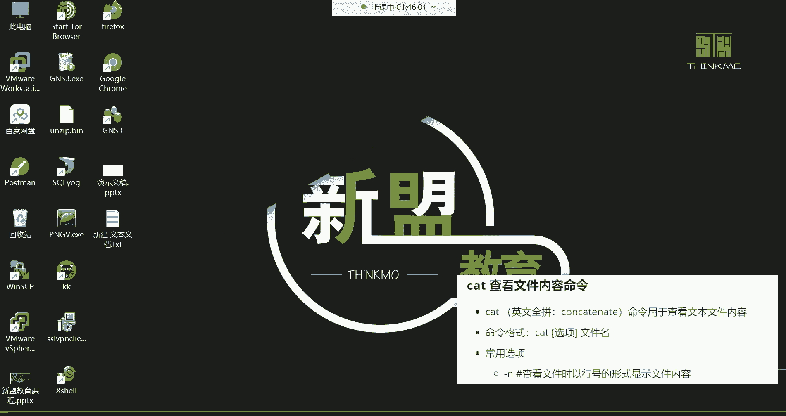

它也没有这个双击的功能，那你只能用命令去看文件的内容，所以这个cat用于查看文件的内容的命令格式，cat文件名就可以了，有一个选项是杠N1会儿再说好，我们查看哪些文件呢，这时候我们要看的文件就比较多了。

Cat，比如说我要看etc下边有一个文件叫pass w d回车，那他现在就帮我把这个文件打开了，然后你们现在也不要纠结，你说这文件里面嗯这些数据代表是什么意思，或者说这个文件的功能是什么功能。

先不要去纠结这些，你现在就知道怎么打开这个文件就可以了啊，用cat命令去打开，然后在打开的时候呢，可能是我们看起来感觉有些乱是吧，这个文件或者说这个文件到底多少行呢，这个文件里的内容多少行啊。

不知道还可以这样，cat杠N再把文件给它调取过来回车，那这时候呢他就帮你把这个文件里的每一行的，前面都给你加了一个行号啊，这个文件总共19行，所以这个cat这个名字最常用的选项，就是一个杠N了。

查看文件时，以行号的形式显示文件的内容是非常简单，cat是命令后面的跟上你要看的文件就可以了，指定它的路径，是什么显示隐藏符号，没有没有什么隐藏符号，好然后在看哪个文件呢。

cat etc下边的f s table这个文件打开它啊，加个补个杠N也行，补个杠N好，这样以行号的形式来看这个文件里的内容，然后再cat etc下的啊，哪个文件呢，host name这个文件。

这个文件是存放我们当前这个主机名的，我们的主机名为什么叫local host呀，是因为在这个文件里边指定了啊，你这个主机名叫local host，然后点后边呢并没有显示哈，你看我我们这个主机名。

它是不显示了一个文件里的，点后面的内容只显示点前面的，所以前面就是local host，OK然后再看etc下边，etc下面有个文件叫渗透OS杠release回车，对这个文件是什么文件呢。

就是我们当前的系统的版本的一个文件，就是我想看我当前系统用的是几版本的，看到没，这文件里面放着呢，就渗透s linux release7。6的版本的，也是存放系统的，还有一个文件。

如果你用的是红帽的那个red hat，那就red hat gun release回车，啊但是是一样子的哈，是一样的啊，都是存放的是你当前系统的版本，那还有哪些文件呢。

还有这个etc下的group这个文件里面我们加个行号，这个文件里面放的是什么呢，放的是我们系统的所有的用户的相关组的信息，而前面那个etc下的pass w d的文件，放的是所有的用户信息啊。

其中包括root超级管理员的信息，也在这个文件里边放着呢，啊后期我们会详细讲这个文件的，现在先知道一下，然后对于cat这条命令就是打开文件嘛是吧。

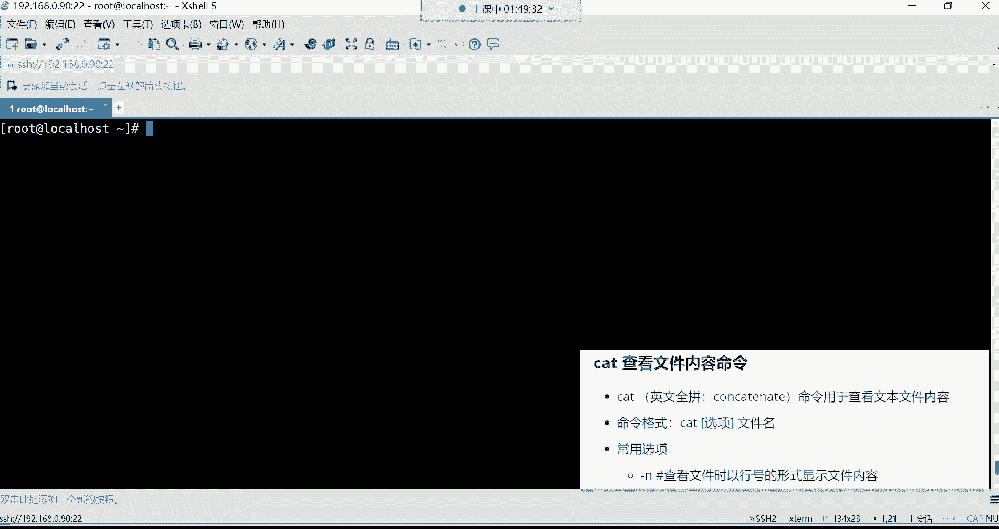

然后还有这个文件叫网卡的文件，那这个路径呢我们已经频繁讲过很多次了。

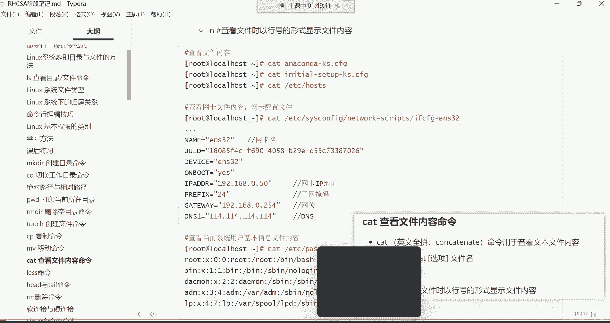

Etc this is config network script，下边有一个if cf g tab键补齐ENS补齐回车啊，这个就是我们网卡的配置文件，就当前我们这个机器的IP地址看到了吗。

IPADDR的位置，就是我们当前的机器的IP地址掩码24位啊，当前的网关还有DNS地址，都在这个文件里面存着呢，后期我们会详细讲这个文件。

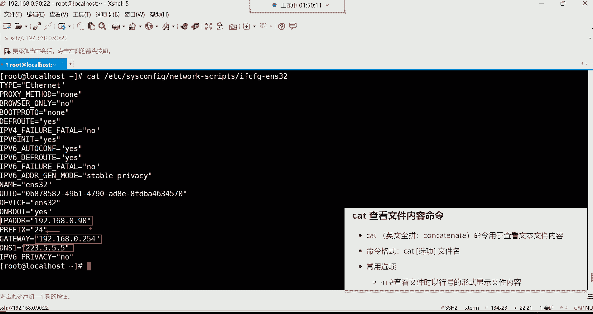

以及怎么去修改网卡IP的啊，后期我们会讲先知道一下啊，然后这里面呢有一有一些常见的文件哈，看了吗，我这里面都有中文的一个讲解，到时候呢啊自己去看一看，看到了吗，就使用cut这个命令。

主要就是那多敲多练啊。

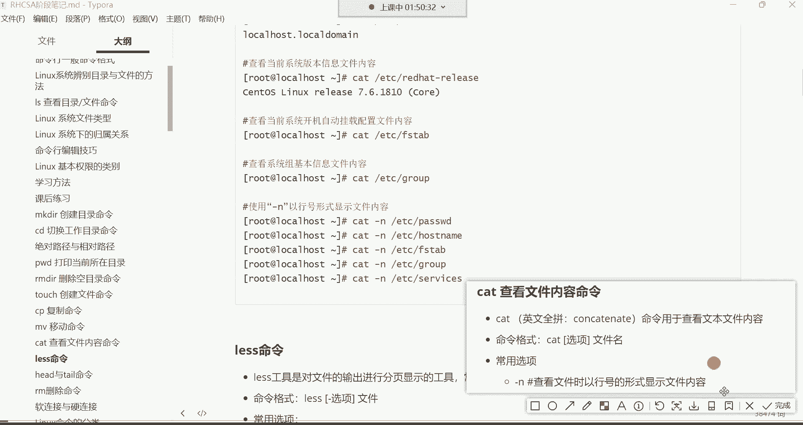

OK这是cat，然后cat这个命令啊有一个小缺点，什么缺点呢，如果我想看一个大文件，哪个大文件呢，你看etc前面是不是有个service s e r tab键补齐，是不是有个service这个文件。

我再加一，即便我加一个杠N的话，杠N显示行号回车，这个文件由于内容太多，你看总共多少行呢，1万多行，1万多行啊，但cat他是把这个所有的内容都给我，显示在我当前的那个屏幕上了啊，显示在我这个屏幕上边。

那我想干嘛，我想往上翻啊，翻到最上边，你看啊，我现在已经翻到最上面了，在这，但是我也就能够看到什么呢，哎前面的1万131行，那我再想往前看就看不了了，划不上去了，看到吗，滑不上去了哈，那怎么办呢。

我想看看前面的内容，那cat就不太合适，cat这条命令啊，只适合查看一些小文件，文件内容比较小，唉，cat呢一次性把内容都给你显示到屏幕上面了啊，这样可以，那有的文件呢比如说内容量比较大。

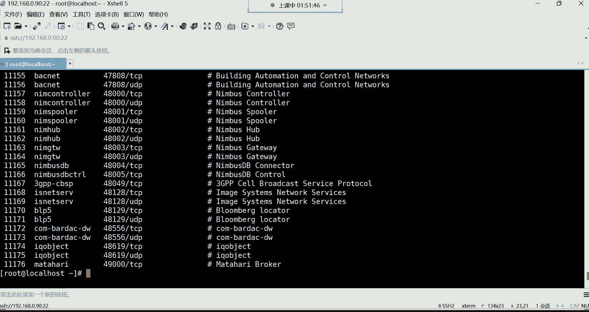

我也不希望它给我显示到屏幕上边。

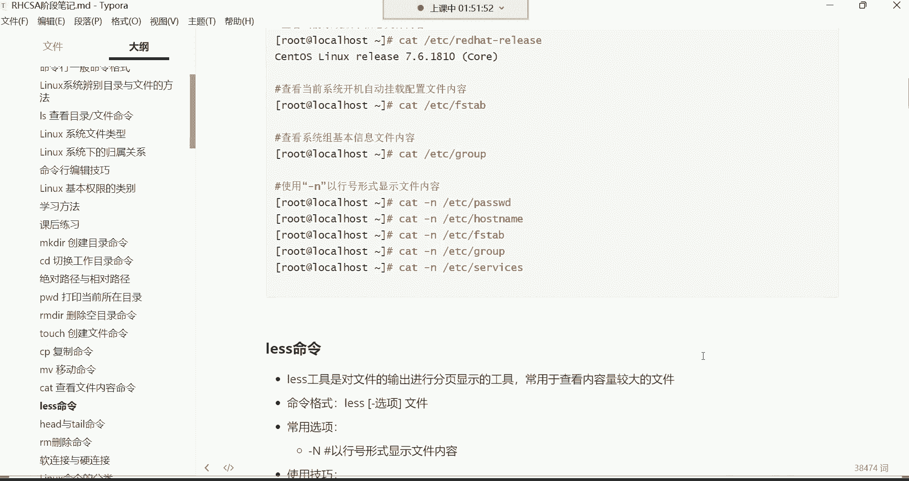

它也显示屏幕上面，把我们前面所有操作的，你看都给顶没了，是不是有的时候我想往前翻一翻啊，看看我们前面的命令的执行后的结果。

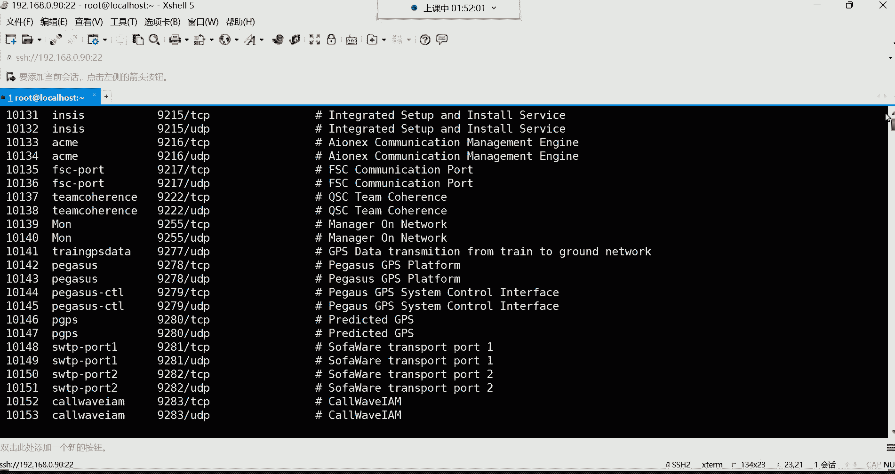

你看看不到了，看到了吗，看不到了哈，所以呢有的时候呢如果你遇到这种需求，就是我不希望给我屏幕搞的就是什么呢，那全都是这个文件的内容，那你可以用这个命令叫less啊，less这条命令，就比较有意思了。

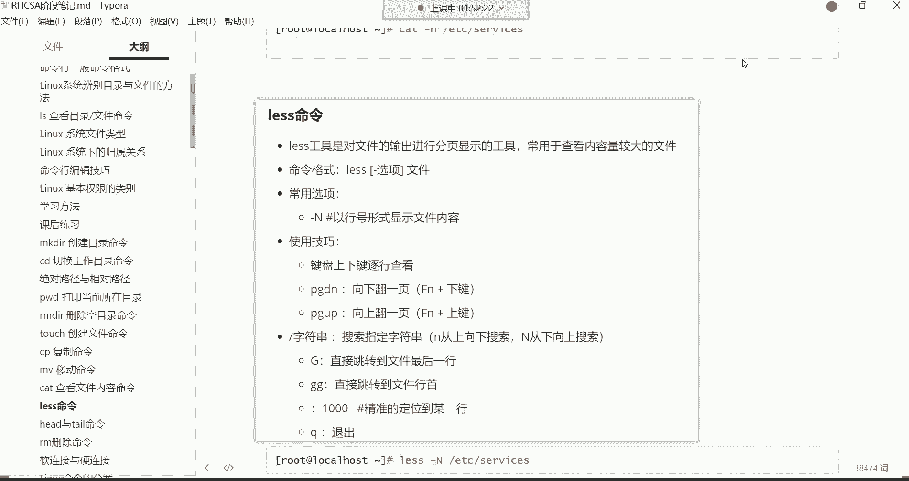

啊control清个屏哈，你看lies呢它也是对文件的内容输出啊，进行一个分页显示的工具啊，这句话不太好理解是吧，你就看后面这句话，就是用于看内容量较大的文件的，less也是帮你打开文件的。

但是呢打开的是比较适合打开，那种内容量较大的文件，它就像什么叫像看书一样，可以帮你进行分页的显示，看书知道吧，一页一页去看，一本书好几千页，那怎么看呢，哎分页一页一页去看，那如果这本书一股脑的是吧。

都给你，就像那个cat一样，都跟你这么说，都给你铺出来了，你发现你不好看啊，所以说这个less命令格式lies，然后它有个常用的选项gun啊，这杠N的话也是以行号的形式显示。

所以但是这个N是大写的N后面的跟上文件名，那就etc下的service啊，给它调取过来回车好，那这时候你看这个less这个命令，它的特点是什么，就是从第一行给你显示，看到了吗，这是文件的第一行是吧。

然后这一页最多显示多少行呢，显示22行，没事吧啊从第一行显示啊，这就是一页，然后在这里边有一些使用技巧，键盘的上下键可以进行翻行啊，你键盘往下翻看到了吗，哎就一行一行的去给你显示了，往回翻啊。

键盘上键就往回翻，下键就往下翻，然后那如果你说我想一页一页的看怎么办呢，你看这是一页是吧，我想翻到下一页，那这时候呢就是叫拍个档啊，向下翻一页，那如果是笔记本键盘，就是FN加你的下键。

如果是大键盘就派个档，因为笔记本键盘没有那个拍个档啊，只有那个FN，然后呢再再加上你键盘的下键啊，那你看啊FN，然后呢拍个档好了，那你看就翻页了，看到了吗，就你看上一页的结束是22行。

那这一页的起始就是23行，那这一页的结束是44行是吧，那我再拍个档，像那一下一页的起始就是45行，没错吧，哎一页一页的去看，那往回翻呢，哦那就pick up，就是你的上键FN加上键就往回翻一行一行的。

一页一页的去翻，看到了吗，哎来回翻页是不是就挺好了呀，好那现在问题来了，比如我那这个文件总共1万多行，我想直接跳到文件最后怎么办呢，大写的G直接跳到文件的最后一行，按你键盘大写的G好看了吗。

要N的最后了，结尾了啊，这是最后一条好，那我现在又想跳转回去怎么办呢，两个小写的G直接跳转到文件行手，那就GG诶，回来了是吧，那你说我想精准的定位到某一行怎么办呢，我想精准的定位到1000行。

因为这样翻也挺慢的，我就想看1000行，看看冒号，英文的冒号在这，那默认就是英文的冒号是吧，那你后面就跟1000就行了，拍个回车，看到了吧，但是它默认是分页显示是吧，你往上翻一翻就行了，看到吗。

哎1000行，从1000往下啊，把这一页就给你显示出来了，所以这可以帮你精准的去定位，那我想退出呢，Q就退出了，你看他退出后的效果哈，Q好，你发现诶真的像看书一样，是不是就把书一合上了。

唉我的屏幕呢也非常的干净，是不是那cat就不一样，cat是把所有东西都给你显示出来了啊，所以如果你想看文件的话呢，2000就2000。

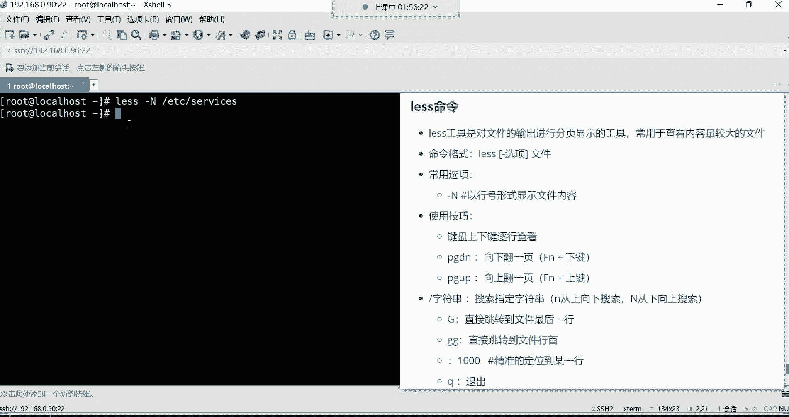

你就指定2000好，那你看这个less还是挺好用的，是不是看大文件的时候用这个less命令哈。

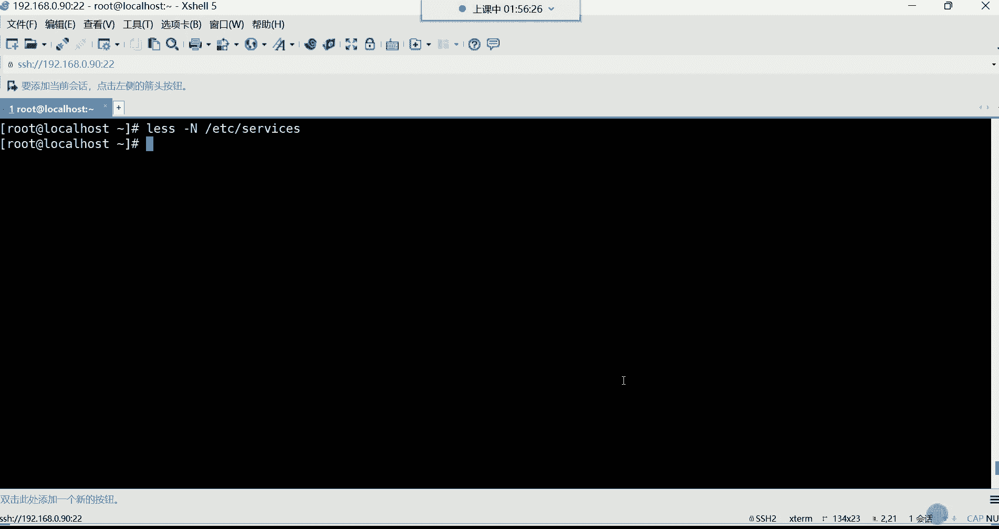

然后除了less以外。

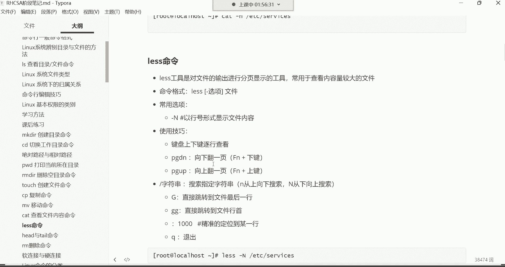

还有哪些命令呢啊像这个汉与tile这个命令，它也可以帮我们去干嘛呀。

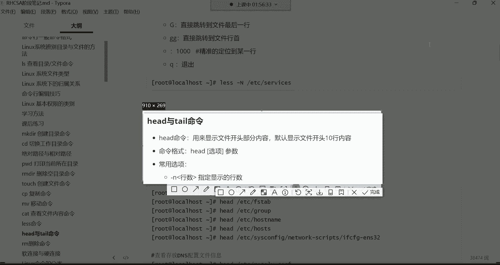

去显示文件的内容，来看一下它怎么显示的，先说ha ha呢是用来显示文件的开头的啊，多少行内容默认显示多少行呢，默认显示文件的开头十行，那怎么玩哈，这玩意儿你看比如现在这44的文件。

我想看到的头十行就看前十行，那你就header后边呢跟上这个文件回车多少行啊，是不是十行啊，他肯定是十行啊，40行哈，这就是前十行啊，那你说哎呀能不能显示行号什么的呀，哈哈加个杠N啊。

但是这杠N可不是说是以行号的形式，给你显示的内容，这个杠N是让你指定显示的行数，什么意思呢，你看它默认是文件的投十行是吧，我现在不想看头声，我想看头20行可以吗，哎杠N来指定的啊。

我们CTRLA把光标调整一下，然后杠N后边空格指定多少呢，比如说20好回车，那这就是这个文件的开头20行，知道吧，我想看开头30行呢，我们清个屏好，CTRL清个屏，那就换成30回车，那这就是30啊。

投30行，你如果想看投300行呢啊，那你就300回车，那这这就是这个文件的投300行是吧，所以说总之它会从文件的第一行往下给你显示，能理解吧啊，然后通过杠N呢这个选项来调整啊。

你要看比如说啊这个文件的开头了多少行，那这个你也可以这样，你不需要加杠N，你比如说你这样啊，就直接杠300，卡了一下是吧，卡了一下挪一下，你比如说我我不加杠杆的话，你直接杠300也行，唉它效果是一样的。

所以你比如说我杠20诶，你看也行，但是你如果这样用的话，那就是什么呢，就是你这个杠跟20之间就不能有空格，看到吗，还不能有空格，有空格，你看它就出现这种情况，什么标准，输入CTRLC的结束掉，啊这不行。

所以必须呢，如果你不想加N的话，你就给他放在一起就可以了啊，这种格式它也认识能力吧，CTRLC非去掉好了，呃如果你加N的话，就不能有，加N的话，必须得有空格了啊，如果你要是比如说我加N杠N。

那你后边就得保留一个空格，你如果不保留空格，你说我给他贴上啊，也行啊也行，这个我还没这个我还没试过，但是我我一般就喜欢什么呢，就直接杠20，就直接杠20就可以了，嗯杠20好了。

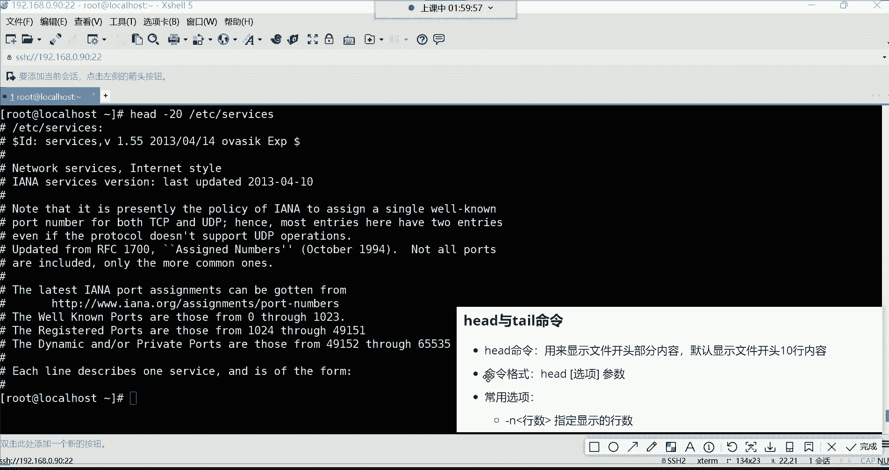

那这是这个焊的这条命令上，显示文件的开头多少行呢，是比较简单呢啊，那你下去你是不是可以针对于我们前面给大家，就是列举的一些常见的文件都可以去练一练呢，没错吧啊看这些文件的开头多少行是吧。

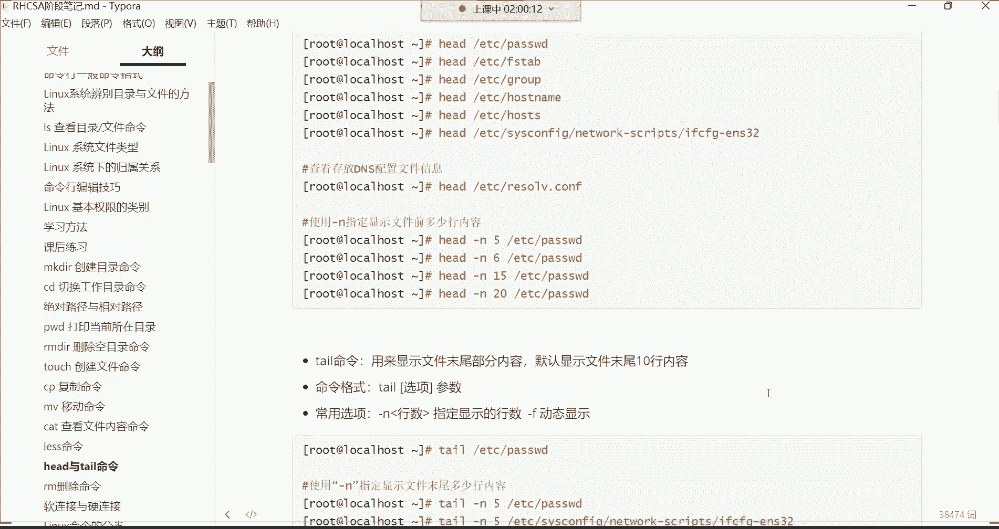

OK然后下边还有一个叫tile这个命令，tail命令呢跟汉是相反啊。

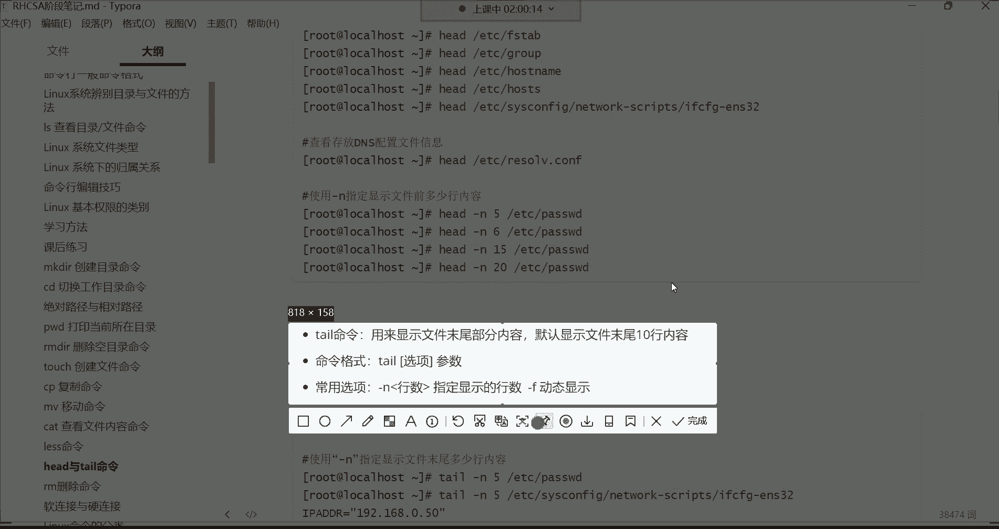

tail是尾的意思，尾是什么意思呢，就是用来显示文件末尾的多少行内容，那默认呢是显示尾十行什么意思呢，你看这一个文件焊的是从上往焊的，是从上往下给你显示能列吧，那有的时候想看文件，比如末尾多少行啊。

能理解吧，那tail就是从下往上给你显示它是这个关系，如果想看文件的末尾的十行，那你用tell你焊的没有办法帮你实现这个功能，能理解吧，焊的只是开头，他有什末尾啊。

所以这时候我们就tail指定etc下的tab键啊，service回车，这是多少行呢，那就是伪十行了，这是末尾十行内容啊，然后那你说我想看末尾20行呢，那你就这样还要杠20啊。

然后ESC加点把这个文件给它调取过来，回车是吧啊，这是末尾20行，你说200行可以吗，当然可以了呀，就看你的需求呗，啊也可以，你说那2000行可以吗，也可以，总之呢从下往上给你显示，就是这样子的哈。

这是太阳，所以这是不是也没有这个，如果你有这种需求的话，你比如说啊我想看一个文件，但我不想看他的全部，我想看的某一部分，那就它要比如说杠五好看哪个文件呢。

eat etc cs config network n e t w tab键，杠tab键，if c tab键一按tab键啊，我就要看这个网卡的文件的末尾五行，你看那关键的信息就都给我显示出来了。

哪些信息呢，嗯IP我的我网卡的IP地址是掩码网关，还有这个DNS这些地址都给我显示出来了啊，所以有这种需求呢可以用嗯，行数超出文件总数的话会怎么样，那就不显示。

你比如说啊我们就直接ta etc的fs table这个文件，这个文件总共多少行啊，1234567，我们换一个文件啊，换一个host name，看主机名文件回车啊，那它要默认显示这个末尾十行。

但是你看他这文件没有那么多啊，没有那么多就有多少显示多少，是这么回事，能理解是吧啊，这是太阳，然后还有一个杠F啊，杠F这个选项是叫动态显示，还要杠F啊，我想看一个文件哪个文件呢啊比如说，好啊。

看OP t下边特别键两下，好啊，这个哪个文件呢，这些都不是文件文件的，注意啊，如果是目录的话，他后面有个小细，后边是有斜线的哈，代表的是目录，如果是文件的，后边是没有斜线的。

咱们就拿这个test1这个文件来说，python1类文件我动态看他注意哈，动态，知道什么动态吗，就是他一直盯着这个文件，只要这个文件有什么任何的风吹草动啊，他就给你显示出来了。

那就是我们右边再复制一个终端，这个复制终端就是再开一个一模一样的终端，那就是说现在我这个系统里面是两个root账号，那这边呢我们干嘛呢，演示一下，演示什么呢，我通过一条命令哈。

这个命令呢我们后面会讲echo，比如echo一个hello，然后给他放到哪了，OP t下的test哪个文件，我看一下哈，test1类文件一回车诶，你看这时候就显示出来了吧。

这个test1这个文件里面多了一句hello，那这个杠F选项可以干嘛，就可以让我们去观察一些日志，有的时候比如说像一些重要的日志文件，你想进行一个排错啊，然后呢你就需要时时去关注它。

比如这个日志啊会产生哪些数据啊，你可以去动态去观察它，杠F选项就可以把你动态的去观察，那怎么结束呢，怎么取消呢，CTRLC就可以了啊，就取消当前正在执行的这个命令，清个屏啊，清个屏，CTRL清个屏。

OK那以上就是这个汉语tail啊。

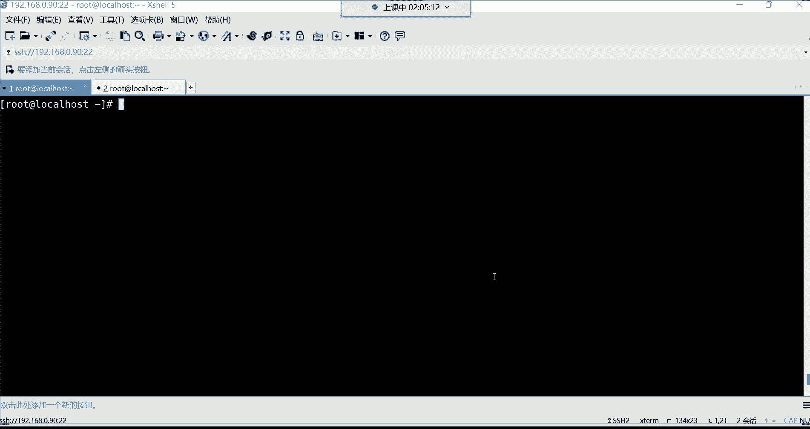

然后接下来呢我们再来给大家讲讲，大家非常感兴趣的一条命令，RM这个哼删除的啊。

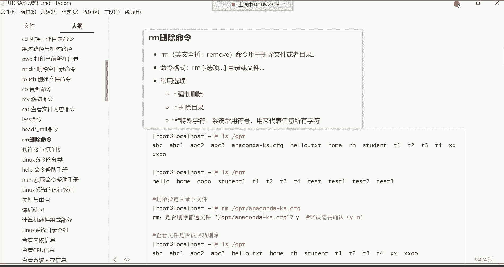

删除的哈，那在讲删除之前呢，我先给大家补充一个嗯。

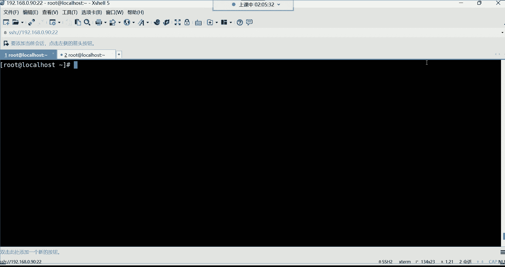

VMVM威尔这个虚拟机它的一个功能啊。

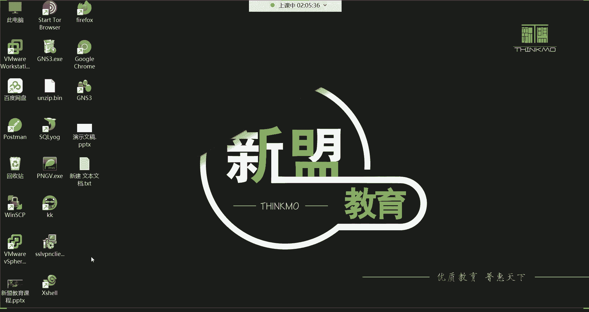

虚拟机里面有个非常好的功能，什么功能呢，找到我们这个虚拟机，右击有个叫快照的功能，然后你选择拍摄快照，然后呢给你这个快照取个名字，快照一是吧，就让它叫什么呢，叫系统的一个嗯初始环境描述想写就写。

不想写就算了，选择拍摄快照好，这个拍摄快照这个功能它有什么用呢，就是我刚刚的那个快照啊，右击选择这个快照，然后呢你看我们选择快照管理哈，快照快照管理器。

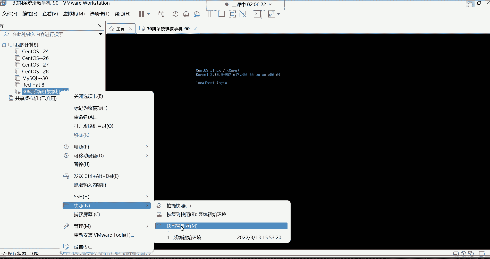

那这里面是不是有个快照啊，这个快照里面保留的是什么呢，就是我当前这个时间，这个系统的一个所有的环境，就等于说，我现在是对我这个系统做了一个什么呢，一个备份，这是你的备份的时间。

那如果随着后期呢我们不断的练习，不断的使用，然后这个系统有一天被你给什么呢，被你给呃玩崩溃了，可能说开机都无法开机了，那你到时候可以干嘛呀，可以通过这个快照帮你恢复一下，你看你点击这个快照。

然后选择转到到时候呢，那它提示你了，如果你想恢复此快照，当前状态将丢失，什么叫当前状态呀，就是你在拍快照的这个时间之后，所有的状态，比如说你建的文件啊，所有的操作呀，它不会给你保留的。

那他会帮你恢复到什么时候呢，就是恢复到你拍快照的这个时间段的系统环境，能理解吧，哎能听懂吗，听懂给我上个医生没，这就是这个快照嗯，今天命令都讲了什么，OK然后呢我们选择是的话呢。

哎那现在我们就在什么环境呢。

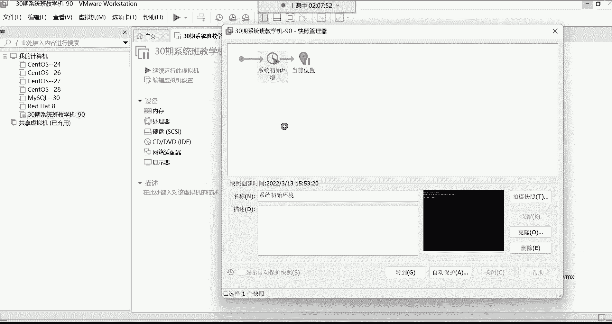

他现在就帮我恢复哈，恢复，那现在我当前系统的环境，就是我当初拍快照的那个环境。

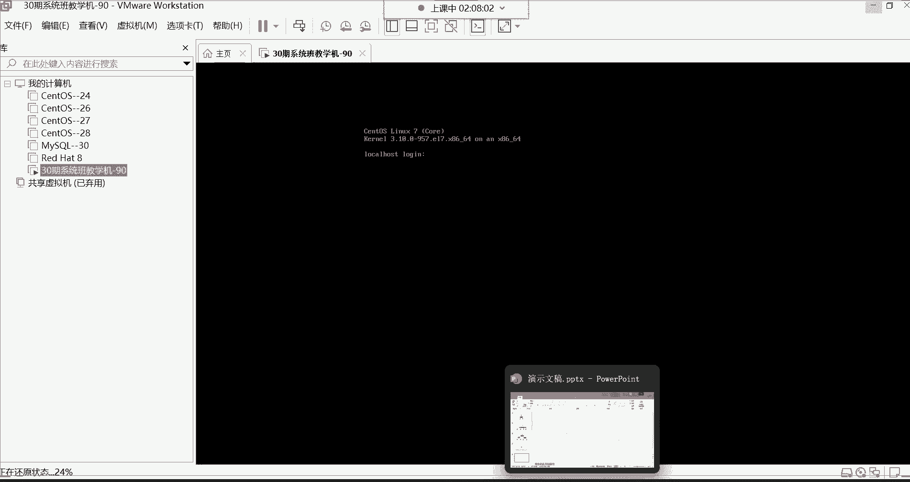

那你当初拍快照的时候，如果我的系统是一个正常的，正常运转的健康的状态，那它就恢复到当初的那个状态，所以说这个快照是个好功能，那以后大家再做，在学习的时候，比如说我们呃后期做一些什么实验。

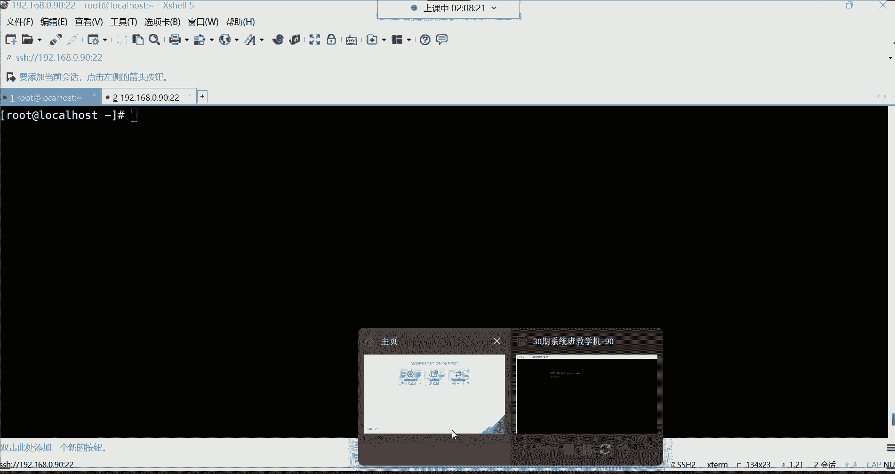

你们想把这个实验的环境给它保留下来，你就可以对于你这个实验环境拍个快照以后呢，又想用那个环境了啊，会通过快照恢复到那个环境里面去就可以了，不需要去重新配啊，支持快照好，那接下来呢我们了解了快照功能了。

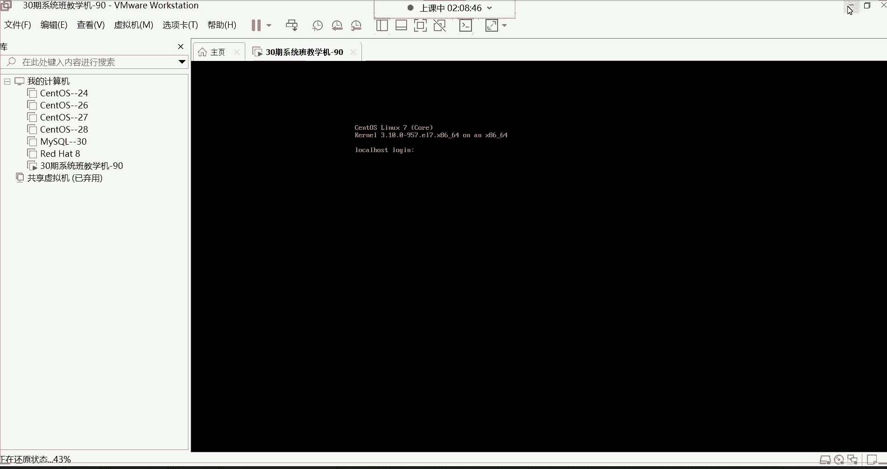

下边咱们就给大家说说什么呢，但我这终端已经掉了哈，因为你拍快照这个终端你还得重新登录，九零，root密码清个屏，这终端掉了关掉吧，因为你一个快照一恢复，就等于你这个机器又重新什么呢啊，又重新开了机一样。

所以说那你想想你机器关机和开机，你终端是不肯定掉啊啊，再重新登录一下，然后下边呢我们来开始给大家讲一讲，讲讲什么呢，讲讲这个RM一个从入门到入狱的一条命令。

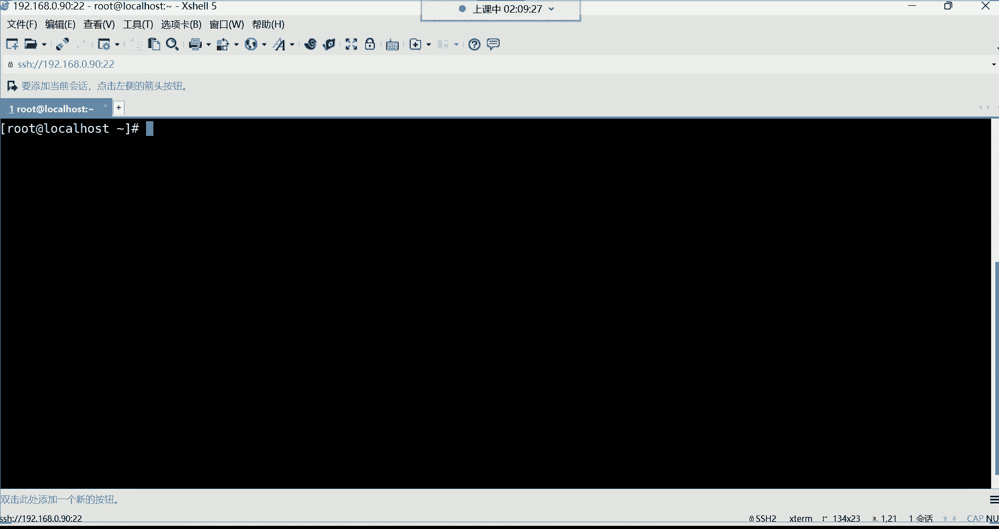

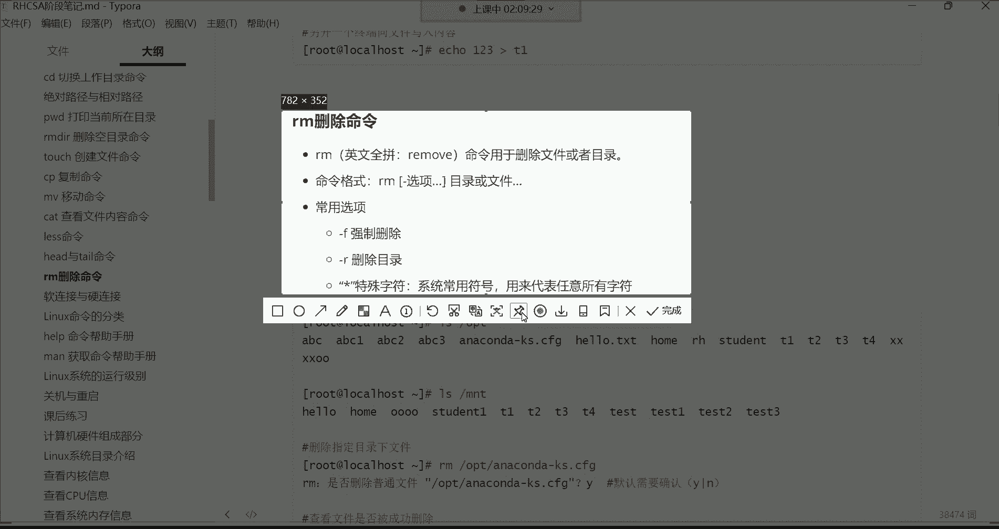

这条命令啊哎呦可是非常的给力啊，也是大家非常感兴趣的一条命令，RM呃就是用于删除文件和目录的啊，反正呢命令也非常的好记，跟L似的啊，就两个字母RM面格式呢也非常的简单啊，非常的简单哈，RM你想删谁。

你就跟上目录和文件名就行了，那我们前面创建了那么多的文件，比如我现在想把这个test2T三T四都给它删掉，那就RM，指定test2test3test四回车，你发现报错了，阿拉斯打开没删。

没有删除成功是吧，为什么呢，因为他们是一个目录，它告诉你它无法删除，因为它们是目录，目录是什么意思呢，就是你想删目录，默认他不行，得加选项啊，如果针对目录删除加一个杠R选项。

所以这时候我们就说RM杠R跟上test2空格，test3啊，如果你想一个一个删呢，就比如说我想删test2回车，那这时候呢，由于啊我们前面给大家讲基本概念的时候，我们就说LINUX这个系统没有回收站。

那没有回收站，我们在做一些删除的时候，你就得小心谨慎，所以系统的话呢它也是会给你一个提示，问你是否删除这个目录，那这里边有两个选择，第一个选择就是回答一个YY就是yes，就是删回车，那就删了。

那如果你不想删，比如RM杠R啊，我删这个test3的时候回车，他也问你如果不想删，我就N回车，那就并没有删除，看到吗，但是test2肯定是被删了，所以这就是他会给你一个提示啊，怕你真的是这个不小心啊。

或者说手抖误删，所以说呢还有一个确认确认的这个步骤，然后一次删一个是吧，那我想删杠r test3空格，test4回车，回答Y回车，Y回车啊，因为你是删两个文件嘛，所以他每个文件都得给你确认一遍。

这就是删除，OK然后想删文件是不需要加杠杆的，这里有个压缩是吧，那RM杠不用啊，它是一个压缩文件，中文的新建tab键补齐，补齐一下，回车，这时候是否删除普通文件Y回车啊，删了没了，看到了吧。

OK然后看看别的路径，在别的路径OPT非常多是吧，好我现在想把OPT目录下面所有都给他删掉，是啊，我现在想删除所有这里边有目录有文件是吧，RM杠二啊，一个一个去删，但是，嗯这样哈。

你可以这样OPT指定OP t下边的星，哈哈这个星呢它是系统当中的一个特殊字符，这个特殊字符是系统里面非常常用的字符，可以用来代表任意所有啊，注意哈叫任意所有，什么叫任意所有啊。

就是说甭管是ABCD的英文字母，还是12345678的数字，这个星都能够表示啊，都能表示它，所以呢，这时候我用星放在这个OPT目录下边了，那是什么意思呢，就是说我要把OPT目录下边的任意所有。

全都给他干掉，那这时候回车，YYYY每删一个都得确认一遍是吧，YYYYY哇，这感觉有些麻烦了是吧，你看哎呦嗯啊这个你看你看哎呦，这这可够麻烦的了，看到了吗，哈哈啊，这哎哟哎哟哎哟哎哟啊没了删没了。

阿拉斯看OPT啊，这算是被我给删干净了啊，不要给伤干净了是吧，把鞋垫去掉了是吧，血的叫血嗯，星肯定是要慎用的哈，你不能说星慎用，是你删除的时候你都要慎，你都要慎用，那我们如果这样删的话。

你发现这OPD目录有很多的数据，这每次都得回答一个Y，这可是有些费劲是吧，所以说还有一个杠F选项叫强制删除，那这时候呢我们打开比如说mt目录啊，我现在就想把整个mt目录下的都给它删除。

但是mt下边你想想他有渗透S目录，在SNS里面还有很多的文件呢是吧，那每次如果说你都回答一个Y的话，感觉也挺麻烦的，所以你可以这样RM rf啊选项放在一起，把这两个选项放在一起，那F的话呢是叫强制删除。

强制删除就是不会再跟你确认了，不会有那个确认的这一步了，就直接把你删掉了，不会再问你了啊，所以这时候你看效果杠2f mt型回车，这时候再打开INT，你发现干净了，是不是啊。

在这个目录下的所有都被你给删掉了，所以这个星号代表任意所有是什么都行，我都能够表示他，所以呢对于这个删除的操作呢，如果你想删文件，你不需要加杠R就想删文件啊，你看我们前面在这个media。

在在这个根目录下面是不是有个media目录啊，这里面也有一些文件，打开根下的media目录回车，你看如果你就想删文件RM那就media下载，别说test一点TT回车啊，回答个Y删了没有加杠杆吧。

如果你也是你删文件的时候，你不不不你不需要什么呢，你不需要这个呃，再次给你确认，你就可以这样RM杠F杠F指定，我要删media下边的test2这个文件test2回车啊，再看这个米莉亚。

你发现test2就没了，是不是啊，我想同时删除很多个呢，2M杠2F嗯，杠F哈，就删文件，media下面的test3，然后再指定media下边的test4，在指定media下面的test点TXT。

然后回车再看这个media目录，调取，没了是吧，只剩一个T2目录被我们给删的干干净净，这就是RM吗，它跟前面我们学的那个REMODRR，这个RMRRMDR这个命令不太一样，因为RMDR只能删除空的。

而二而这个呢RM这个命令啊，你甭管是不是空的，只要你不想要，我都能帮你删掉，所以这个命运就非常给力，嘿那给力就是因为你会经常看到别人说，RM杠RF斜线下的星，那这时候你能够理解这条命令的含义了吗。

这个星是个特殊字符，代表任意所有这个斜线是什么呀，这个斜线是系统的根目录，而RM杠RF呢就是根下的，甭管是目录还是文件，我都强制给它删掉，所以这就是什么呢，删库跑路嘛啊，把整个系统都给删掉了，对呀。

因为你每次删除的时候，你想想你你删你当前在自己的家目录，然后你现在你想删的是谁呢，media目录下边的文件，所以你每次删的时候，你都要指定它的一个所在路径才行啊，你不指定路径是不行的，你不指定路径的话。

你想想他怎么知道这个文件就在media下面的，默认它会从你的家目录去找这个文件的，但你加目录就没有这个文件，它也没有办法帮你删除是吧，哎是这么回事，就指定它所在的路径，要么就是你直接切换到这个目录啊。

也行对，要么你就直接切换到这个目录，然后呢就不需要每次都指定路径了，都可以哈，都可以，没什么影响，然后跟下边我看还有哪哪些目录吗，可以去清理清理了呀。

比如test1目录叉叉叉叉RM杠RF跟一下的test1，回车阿拉斯打开根再删RM跟RF根下的叉叉，叉叉tab键啊，再把这个目录给他干掉，回车阿拉斯看根目录好，被我给删除了，然后再来给大家强调一下。

就是我们这样删，你们可能有的人会担心说啊，那根目录不会被删除吗，根目录会不会被删呢，不会为什么呢，注意哈，我们所有的命令它的特点是什么呢，最后一个参数作为我命令的执行对象，知道吧，而前面它它能识别出来。

这是路径，是路径哈，而真正我这个命令的执行对象是谁，是这个路径下边的它啊，包括前面那个也一样，你看这个命令他知道系统都知道啊，这个命令我应该对TT的一执行，而不是对于根目录也执行，如果要对。

如果我们这样指的话，你比如说像我们前面删，我要删OPT这样哈，我前面2M杠2F啊，删除OPT下面的，比如说什么呃，T下边的什么X1之类的这些文件哈，他会把X1作为我这个命令的一个执行对象。

也是永远都是最后一个参数，作为我命令的执行对象，而前面的都能够识别出来，这是一个路径，知道了吧，好唉这是RM行了，主要就是删除删除啊，然后再来给大家说一下啊，就是我们在这个进行，比如说路径切换呢。

然后在查看的时候呢，你看我现在给你们做两个操作，我现在touch在OPT下面建个文件，建一个test，要是tt plus打开OP，打开OT，你们看一下嗯，如果我只想删除这个目录下的所有目录。

而不删除文件呢，那没有办法实现，没有办法实现，我们来看一下哈，就是现在我这两条命令，你发现它有什么区别吗，都是LSOPT是吧啊，都是IOSOPT，一个是后边跟了一根斜线，你看这是后边有一根斜线。

而且第一条命令呢是没有这根斜线，所以现在我说的是这根斜线的问题，这根斜线的问题，这根斜线就是什么时候可以有这根斜线，什么时候呢可以不需要加这根斜线，你看我这条命令就没有加入DJ斜线，而这条命令加了。

但效果一样，都是打开了OPT目录，是不是我告诉你什么时候可以有，可以没有呢，就是你的命令针对的是目录的时候，而且是一个目录，这单个目录的时候，那后面可以有这种斜线，也可以没有。

但是你这个命令如果说干嘛呢，后面我要看OP的下边的，比如说哎某一个目录，那这时候比如我看这个，比如这时候我就这样了，阿拉斯杠L是吧，看OPT下边的这个test的TT，他们的详细信息回车。

那这根斜线就是你的路径之间的分隔符啊，叫路径分隔符，那还有那这个时候我我如果单纯看文件的话呢，注意下我后面如果在文件后面再补上斜线回车，就不允许，为什么呢，因为它提示你了，说这不是一个目录。

那也说我们如果针对文件操作的话，文件后边是不能有这根斜线的，而而目录后边可以有这根斜线，也可以没有，那都不影响，但是文件后边坚决不能有这种斜线，如果有的话，它会识别为这是一个目录，知道吧。

因为你自己在tab键补齐的时候，你看你看我按tab键补齐了，那如果我再创建一个目录呢，MDR在OPT界面，比如创建一个叉叉叉叉目录，这时候我们在IOS杠L我要补齐这个叉叉tab键。

你看它自动给你补齐一个斜线，看到了吧，所以说对目录来讲呢，后边得有这种斜线啊，对于文件来讲就不能有这种斜线，而如果说你想针对这个目录下面的内容操作，那这根斜线就是路径分隔符，知道吧，好。

这是给大家讲解的一些这个细微方面的内容哈，OK说清楚RM命令了吧，说清楚了是吧啊说清楚之后呢，我们休息一下好吧。

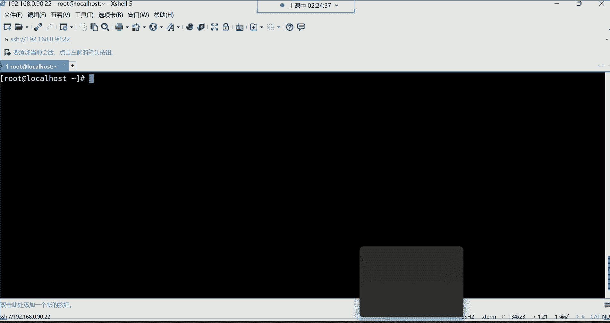

休息一下，然后回回过头来给大家讲讲这个软链接，硬链接啊，我们今天啊差不多能讲到这，第二节课的课后练习，不删库吗，不删库删库干嘛，我们今天呃从这开始啊，争取把这些常用的命令呢啊都给他讲完。

然后呢你们这一周你就会有一个充足的什么呢，这个命令啊可以去互选了啊，要么你卷他，要么他卷你哈哈好。

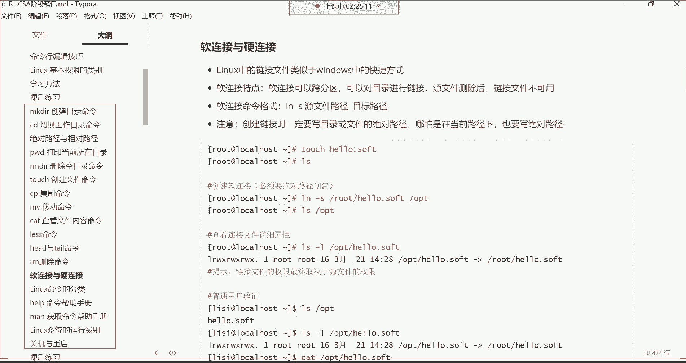