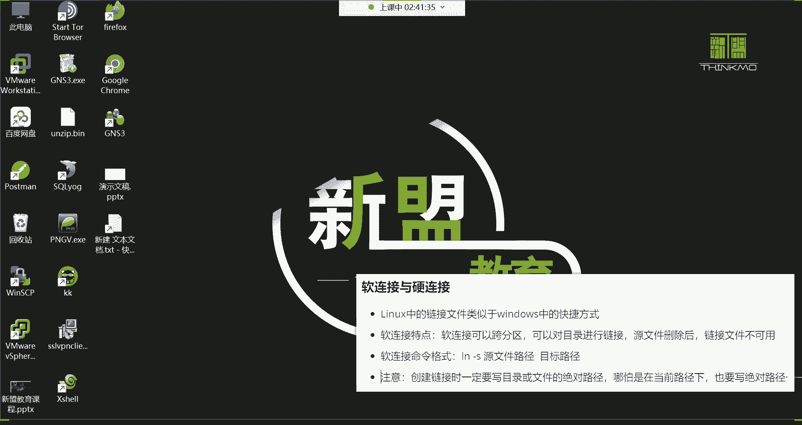
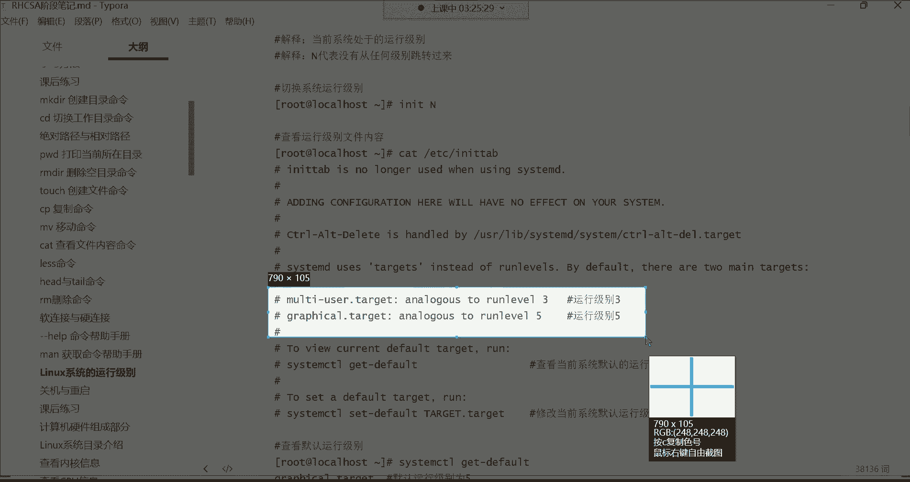

# Linux最全RHCSA+RHCE培训教程合集，小白入门必备！ - P9：红帽RHCSA-9.软链接与硬连接、获取命令帮助、系统运行级别、关机与重启 - -Book思议8 - BV1ZV4y1v7c8

哈喽哈喽哈喽，都回来了吗，嗯回来的话，刷波一，我们继续发车好，接下来呢，我们来讲讲这个软链接与这个硬链接哈，什么叫软链接，什么叫硬链接，我们前边呢再给大家讲基本概念的时候，我们设计了一个什么呢。

啊不是基本概念，是在讲这个阿拉斯命令的时候，我们在讲这个这哈，叫辨别目录与文件方法的时候，这里面有一个什么呢，叫做浅蓝色的链接文件啊，那这个链接文件，就是我接下来要给大家讲解的啊，这个软链接和硬链接了。

那什么是链接文件，我相信你们现在心里已经清楚了。

就是windows里的快捷方式，是不是，那在windows里面我们想创建一个快捷方式。

这非常的简单，右击啊，然后更多选项，比如说这里面一个叫创建快捷方式，好，那这个快捷方式就出来了，那快捷方式的特点是什么呢，就这两个文件之间。

比如说我往这个语言文件注意哈，这个是不是它的原文件，这个是不是我们基于原文件创建的链接呀，好那我现在往源文件里面我写句话啊。

你好，然后呢保存OK然后我们看看这个链接文件诶。

你看也同步了是吧好，那我们往链接文件里边再写一句话LINUX，然后保存好。

那再看原文件诶，你发现也同步了，是不是啊，所以这就是所谓的什么呢，所谓的快捷方式啊，只不过我们叫链接文件而已啊，特点是什么，要相互同步，是不是只要你文件里面有的，我这个呢也给你同步过来。

然后你那个文件里面有的呢我也同步过来，那了解了这个它的特点了，那接下来我们来说一说在LINUX下边。

这个链接文件啊。

软链接与硬链接啊，这有一些区别，一软一硬是吧。

好那咱们呢先干嘛呢，咱们先说说这个，软链接啊，在LINUX系统当中链接文件就类似于windows的快捷方式，那软链接的特点是什么呀，软链接可以跨分区啊。

什么叫跨分区啊，就是不同分区之间啊，比如说我有一个文件，这个文件呢我是在我的电脑里面的哪个分区呢，啊在我的C盘，比如说哈在C盘。

比如说这个文件呢我给它放到我的C盘里边，给它拖到这个C盘，放到这儿，然后呢我再把它的这个快捷方式放到哪儿，放到我的E盘啊，随便拖啊，拖到这个E盘里边啊，可以啊，这叫什么呀，这个就叫做跨分区了，知道吧。

就是这原文件跟他的那个什么呢，跟他的那个链接文件，并没有在同一个分区里边啊，是在不同的分区的，这就叫做跨分区，能听懂是吧，而软链接呢是可以实现这种跨分区的啊，我给你删掉哈，给它删掉没有用。

删了windows里面也给它删掉没有用。

就是给你们演示一下效果，OK这就叫做跨分区。

因为这种很常见的数据备份嘛。

是不是啊，你比如说我我，你比如说我们在做数据备份的时候，那windows比如说我想把我C盘里的一些数据，一些重要数据备份到我的其他的盘里边，这是不是很常见的事情了啊。

所以说这win这个LINUX里边的也一样啊，如果说你想做一些数据的备份与同步的话。

那这个软链接呢是可以帮你实现这个功能的啊。

跨分区啊，去做一个什么呢，做一个软链接啊，这第一个第二个呢可以对目录进行链接，就是那个文件夹哈，也可以让你去创建这个链接，其实这就很好理解了，你看我们现在在跟下边看的这些浅蓝色的，这不都是文件夹吗。

不都是目录嘛是吧，按目录也可以进行链接，给目录来一个快捷方式，然后那特点是什么，原文件删除以后，链接文件不可用，原文件删了以后链接文件不能用。

其实这个很好理解哈，因为它毕竟是一个快捷方式，这是快捷方式哈，真正对应的原文件是帮我们带来功能的。

你看拿这个火狐浏览器来讲，你想想如果我直接把这个FIREFOX啊，这个应用程序文件，如果我给他删掉的话，那我问一下你们，你们觉得这个快捷方式它还有意义吗，肯定没有意义了，是不是因为你原文件删了嘛。

而且而原文件是真正给我们带来功能的，这个程序文件，是不是，所以说你要进一删链接文件就失效了哈，就无用了啊。

这软链接特点，那怎么创建这种软链接呢。

软链接我们就非常的简单，命令格式用N杠S这个命令去创建，我们打开看一下，我们把OP给它清空一下啊，OP t下的星删除OPT下的所有OPT清空了，接下来呢我们在自己的家目录啊，我们不在自己的嗯。

我们进到OPT吧，cad的OPT，然后呢再看一下别的目录啊，然后再拿这个media目录看一下迷恋目录，把medium目录也给它清空一下，星，看一下media目录，好也没了好，那现在我在OPT建个文件。

touch一个hello，点soft啊，就是软的意思，那这个文件创建好了之后，我们来按照这个格式去创建哈哈，LN杠杠S，先指定源文件源文件hello，点soft好，给它链接到哪里呢，给他链接到根下的。

media目录取链接过去哈，然后阿拉斯看这个media目录啊，不是是名字哈，随便取的啊，Hello，点soft，随便起的，不是格式，好那现在你们来看你们来看哈，呃这个文件呢，它就是不太一样啊。

我们阿拉斯杠L看media下的，media下的这个hello deserved，你发现他是一直在闪闪闪是吧，这个闪是什么意思呢，这个闪我前面就讲过，说是链接文件不可用，链接文件不可用，不能用，失效了。

或者说是有故障的文件，那原因是什么原因呢，原因在下边，这有个注意啊，就是我们在创建链接的时候，一定要写它的一个绝对路径，不管是目录还是文件都要写绝对路径，哪怕你在当前路径也要写它的绝对路径。

你看我刚刚在创建的时候，我LN杠S，直接以当前路径就指定了这个文件名，然后给他链接到media目录是吧，但是我并没有指定它的绝对路径，并没有指定OP是吧，因为它在OPT下面嘛，我并没有指定它的绝对路径。

所以就会导致这种链接文件不可用的一个问题，那对于这种情况，那这个你就得给它删掉了，没什么用了，删掉media下边的那个什么呢，hello点soft，然后我再把这个文件给你们删吧。

这可能说你们我们改个名吧，MV这把hello the soft干嘛呢，给它改成叫hello soft，不加点，不然你们也会觉得这是一个扩展名是吧啊，原路径改名啊，就改个名。

把这个路径下的文件还是放在这个路径啊，只不过名字叫hello，点soft hello soft打开，那现在呢我在LN杠S指定OPT下的hello soft，链接到media这个目录回车。

这时候再打开media哎，这就没有任何问题了，看到了吗，这个颜色就对了，浅蓝色了是吧，链接文件，唉，这是没有任何问题的，好。

啊链接文件不可用，昨天没听课是吧，昨天讲的时候呢，这里面有一个叫做辨别目录与文件的方法，这里面有个叫红色闪动文件啊，表示链接文件不可用，看到吗，刚刚我们看的不是闪了。

是不是就是你的这个链接文件创建的不对啊，所以他才会一直闪闪闪在这。

好了那比较简单是吧，这种软链接，然后对于这个软链接的特点呢，就是以后我往这个它的源文件里边，就往这个hello soft这个源文件里面写内容的话，那链接文件也会同步啊，往往链接文件里面写的内容。

原文件呢也会同步，啊是这么回事，然后对于这个链接的权限的话呢，我再给大家啊简单的说一下什么权限呢，我们阿拉四杠L看这个hello点soft，它的权限是这样一个权限，所有者能读能写，所属组呢是只读。

其他人也是只读啊，总共是九个权限位是吧啊，最左侧这三个是所有者的权限，中间这三个是所属组的权限，右边这三个是其他人的权限啊，分别是对应的是这个嗯，我们系统里面的这个，不同类型的用户的一个权限啊。

这是原文件，我们在看这个链接文件，阿拉斯杠l can米莉亚下边的那个链接文件，你看它的权限跟源文件不一样，所有者读写执行是吧，所属组呢读写执行啊，其他人呢读写执行，也就是说对于这个链接文件来讲。

你看他这个权限好像有些大，那就是这个文件在系统上，任何用户都能够对它进行什么呢，里边的内容比如进行增删改查，没有任何问题的，因为权限在这摆着呢嘛读写执行，但是你们不要去被这个链接文件的权限所迷惑。

为什么呢，因为最终呢，这个链接文件的权限是还是要什么呢，要参考原文件的参考原文件，原文件是什么权限，那链接文件它真正的权限就是原文件的权限啊，所以这个大家知道一下好行，这是针对于权限的一个解释哈。

OK然后以后呢它的特点就是什么呢，就是只要是我把内容写到这个，hello soft这个源文件里面了，那个谁呢，那个那个那个链接文件也同步，你看我给你们来个操作和CP。

我把etc下载f s table这个文件里的内容干嘛啊，我给他拷贝到我当前的这个hello soft，这个文件里面去，是否覆盖Y啊，这时候呢我们再看hello在soft这里面就有内容了，看到了吗。

是不是这里面是不是有数据了呀，好这里面有数据以后，那这个时候我们再看media下边的那个什么呢，那个链接文件啊，用cat看诶，你发现是不是也同步过去了呀，没错就同步过去了哈。

所以那以后我再把内容写到链接文件里面呢，那他的那个源文件也同步啊，因为他们是一个相互同步的机制，好了，下面咱们验证这个功能哪些功能呢，原文件删了好，我们如果把原文件删掉以后。

看这个链接文件到底还能不能用啊，第一我们语言文件是这个RM rf，把hello soft删掉，回车没了好，那再看media，你发现这个文件又不对了，看它的详细信息杠L，你看又开闪了是吧，又有问题了。

失效了，链接文件不可用了，这是为什么呢，因为什么呀，因为源文件没了，源文件被你给删了，能列吧，但是对于这种对于这种软链接它的特点，那你要是把这个链接删掉，原文件是不会受到影响的，知道吧。

源文件是不会受到影响的，你比如我们再演示一下，咱们再把这个给他删掉，把米莉亚下的这个给它删掉哈，然后呢我们再在OPT再踏实一个hello soft好，创建好了之后呢。

LNSOPT下的hello soft链接到media下边，然后链接过去以后呢，我们还是拷贝，把比如说etc下的渗透，s release这个文件里的内容，拷贝到OPT下的hello soft文件里面。

要不要覆盖Y这个所谓的覆盖，就是把原先的文件里的内容给他拷贝过来，好，那现在我们可以看到这个文件里面，cut o p t下的对hello soft，这里面有一行，是不是啊，这么系统的版本。

那接下来呢我们就再开media下边那个hello soft，是不是也同步过去了呀，好那现在我把这个链接文件给他删掉，我把media下面这个链接给它删掉，我们看看源文件会受影响吗。

media下的那个hello soft没了啊，再看media没了吧，空了，但是我的源文件不会受到任何的影响的，看里边还是有这个数据，能理解吧，所以你看它的特点，你不能删原文件，删原文件链接就失效。

但你链接删掉以后。

原文件不不受影响，这很好理解，就等于说你如果把这个快捷方式删掉以后，那是不是原原文件不会受到影响啊。

这是软链接，还有对目录进行链接，比如说我现在有一个文件夹啊，我也希望干嘛呢，创建一个链接，make dr创建一个test目录，然后呢，我LN杠S指定OPT下的test链接到media目录。

看米莉亚也一样一样哈，那以后比如说我进到这个test这个目录里面，比如我建个文件，建一个什么呢，呃hello好，那这时候啊test目录多个hello，那你再看那个media目录，它也读个什么呢。

test里边哎他也多个，hello啊，这都是相互同步，OK然后跨分区啊，跨分区的话呢，这个给大家演示一下，我先切一条命令啊，DF杠H，这是看我们当前系统当中的一个分区啊，不不这样看，就这样看哈哈。

在我这个系统当中啊，你看现在有两个分区，一个是SDEDA1，一个是SDA2啊，这两个分区，而这两个分区呢分别啊，SDA2呢是呃是被根分区所使用的一个空间，SDA1呢是被boot这个目录所使用的一个空间。

也就是说你看我们现在根目录下面的所有数据，根目录下面所有数据，当然抛去这个boot目录以外，抛去bot以外用的都是什么呢，SDA2这个分区去存储的数据，唉然后这个boot目录是用什么呢。

是用SDA1这个分区存储的数据，那如果说我现在想干嘛呀，我现在想把我根目录下边的某一个文件给它，链接到bot目录，这就等于说跨了分区了，就等于说我是把SDA2的分区里的文件给他。

放到SDA1这个分区里面看看可不可以，这就是所谓的跨分区好，那现在我们就来演示一下，拿什么来说呢，还是拿这个hello l n杠SOPT下的hello练，CD点点啊，先退回去，less啊，就这样。

LN杠SOPT下的hello soft链接到根下的boot回车，然后看那个bot目录，打开boot目录，看到了没有任何问题，是不是这儿有个叫hello soft啊，给他链接过来了啊，这是软链接特点。

是不是啊，你看都给你们演示了，怎么跨分区，怎么对目录进行链接与文件，删除以后链接文件就不能用了啊，已经没准格式注意事项好了，说清楚以后呢，那紧接着我们就得来说说硬链接啊。

它不太一样。

这个硬链接呀，你看他首先跟软跟软链接完全相反，硬链接不能跨分区诶，软肋也可以夸是吧好，那硬链接也不能对目录进行连接，而软链接可以还有原文件，删除以后，链接文件仍然可用，而软链接不行，软链接原文件一删。

链接文件不能用了，嘿你看他们俩完全就是相反的，哎，那这个时候你说我这个硬链接的特点是什么呀，反正都是相互同步啊，数据会给你同步的，那这时候我们再建个文件，我们它是一个hell，那hard硬的意思。

那现在呢我要对它创建一个硬链接，那我现在就LN命令格式，让它LN没有那个杠S了，源文件路径，目标路径，那LNOT下的hello hel，把它链接到，我先给它链接到哪里呢，先给它连接到根下的不同目录。

先跨分区看看，回车直接就告诉你了，无效的跨设备链接就是不允许你跨设备，不允许你跨分区，是不是不可以跨分区吧，那第二个不可以对目录进行连接，那现在比如说我LN。

我想把test目录是OP t下的test目录链接到哪里呢，mt你看告诉你了，不允许将硬链接指向目录啊，这第二个也不行是吧，第三个源文件删除链接仍然可用，那现在咱们创建一个正常的。

我现在LN指定把OPT下的hell hard，这个文件链接到media下边，诶，这个成功了，拉斯打开media回车，你发现不一样，怎么不一样呢，软链接看LN杠SOPT下的hell soft。

链接到medium目录，打开media目录，你看软链接，首先颜色是不一样的，硬链接呢，你发现这怎么颜色跟普通文件没什么区别啊，是不是看它的原文件，就是一个普通文件嘛，在这儿呢嘛是不是原文件啊。

这是它的链接文件，真的没什么区别，而且你看我现在再给你们来来个操作，不这样我呢再把这个源文件里边呢增加点内容，我CP我再把那个etc下的和host name这个文件。

给他拷贝到我当前的这个hello hard的这个文件里面，输入Y看这个hello hot这个文件，你看这里面就有我当前的主机名了是吧，好，那硬链接那个文件呢肯定是肯定是同步过去了。

直接cat media下边的那个hello heart，你看同步过去了吧，好那现在我把源文件删掉，我们现在删源文件，看看链接文件会不会失效，RM杠F删除hello hard的原文件，删了好了。

原文件被我给删了吧，好那再看谁呢，再看media下面的那个链接文件，你发现诶仍然可以正常去打开它，是不是就没有任何问题，那你说这硬链接这他干的事是什么事儿啊，啊可以改名，可以改名哈，我跟你讲哈。

这硬链接，就等于说你是对这个文件做了一个这个操作，Cp，杠批，而且是保持属性不变的，把OPT下的那个hello hard的文件给它放到了哪呢，media下面这就是硬连接，就等于说你干的是这个事儿。

知道吧，因为硬链接在什么呢，就是它在进行链接的时候，它也是保持属性不变的，给你链接过去的这个就是原文件是什么属性，链接文件仍然是什么属性属性不变，但是他跟这个CP杠P拷贝的操作，还是略有一些差别。

那真正具体的差别就是，你这种拷贝它不会相互同步，你比如说现在这是一个文件，我要把这个文件干嘛，要通过CP命令把它拷贝到另外一个位置啊，就等于说对它做了一个一模一样的备份，是不是好，那不会相互同步。

是什么意思呢，比如说我后期的文件里面又增加了一些内容，又增加了一些内容哈，那这个备份文件是不会自动给它同步过来的，而这种硬链接呢，虽然说也是类似于这种拷贝操作啊，把这个文件干嘛给你再来一个副本儿啊。

放到其他的路径，但是硬链接就是，只要是你的源文件里边增加数据了，哎我也干嘛，我也给你自动同步到我的这个链接文件里面去，是这么回事，所以上边的这个就属于CP杠P拷贝，而下面这个呢就是LN硬链接。

然后它有一个同步的机制啊，是这么回事，能听懂吗，能听懂的给我刷个一，听不懂的刷个二，好没有问题是吧，OK啊，这就是软硬链接啊，王先生没听懂是吗，没听懂多听两遍吧，好吧，没听懂多听两遍啊，哪里不懂。

自己去多自己去实，你把这个你不懂的地方呢，你去实践一下，你自己看到效果你就懂了，但是我觉得这种东西没有啥不好理解的，你你唯一不好理解，你可能会说你说老师，我为什么会需要这种链接啊。

这可这可能是你们所所迷惑的地方，为什么会需要这种链接，就是因为，那在windows里边它需要快捷方式，而LINUX里面呢它需要链接啊，它的本质是一样的，对备份啊，实时备份相互同步，实时备份。

就是就是这意思，这就所谓的硬连接，嗯好，接下来呢嗯软链接和硬链接我们说清楚了。

是不是啊啊说清楚了之后呢，我们下边这个位置呢就大家需要了解的了哈，那LINUX的命令分类，还有帮助手册运行级别，这些都是需要了解的啊，不需要你着重去掌握的嗯，包括命令分类简单的了解一下就行。

在LINUX这个系统下边，命令呢分为内部命令和这个外部命令，什么叫内部命令呢，就是我们这个有一个叫B解释器，自带的一些基本的管理命令啊，就是我们常见的当然非常少哈，可以说是非常非常的少。

这些你都不用去管它，然后还有一个叫外部命令，就是有这个我我们这个自己额外安装的啊，其实我觉得这这个位置，完全大家没有必要去研究它哈，为什么呢，因为这个一点意义都没有，一点意义都没有哈，一点意义都没有。

因为什么呢，因为你甭管是什么命令，最终的我们都得去学习它啊，都得通过它去管理这个系统，是不是啊，所以你没有必要去研究什么内部与外部了，而且这个内部命令非常非常的少，大多数都是什么呢，都是那些外部命令啊。

像我们前面学的，我给你们讲解的什么l s iOS touch cp mv cat，这些都属于外部命令，外部的外部命令怎么来的呢，就是，那个格怒啊，格努那个组织，人家不是软件基金会吗。

就是我们平时用的这些命令都是格斗组织，他们研发出来的，所以你像我第一天给大家讲的时候，我就说为什么LINUX这个全名叫做梗怒，后边再加一个LINUX呢，那是因为LINUX只是一个系统的核心啊。

它只是一个系统的核心而已，那一个系统你想想那它的组成部分非常的多，这玩意儿就你怎么去理解这句话呢，这玩意就像一个汽车一样，你像一个完整的汽车，它光有发动机可以吗，那也就是说这光一个计算机。

它光有一个内核可以吗，它不可以是不是哎，所以说李纳斯这个人他研究出来的，就类似于这个汽车里的最重要的一个部位，发动机啊，就计算机的一个内核知道吧，但是你想想那你一个汽车的外围的一些部件。

你什么这个什么玻璃呀，什么这个什么各种设施，周边的什么设施啊等等等等，哎你这么去理解吧，90%都是格斗组织的，所以李纳斯他搞一个就类似于搞一个，搞了一个发动机，是不是啊，然后呢他就想干嘛呢。

他就想把这个呃，那别人可能说不知道格斗组织啊，所以后来人家就说哎呀，你说你就搞，你就研究一个系统内核，但是呢你说你这内核之上，你90%的东西都是我研究出来的，那怎么办呢，那你得加上我的名字哈哈。

所以这叫格努LINUX，而我们现在用的大部分mini，都是格努这个组织研究出来的，能理解吧，嗯是这么回事儿好，所以说你甭管什么内部命令还是外部命令，总之啊咱们学就完事了，是不是啊。

所以刚刚那一部分呢你没有必要去管它，嗯那下面这一步呢也是大家最为了解的，叫做命令帮助手册，这个帮助手册是干什么用的呢，帮助手册就是哈哈，我们在系统当中呢，呃有有的时候呢。

可能会比如说我前面给大家讲解的这么多命令，可能你们会纳闷，你说老师怎么就知道这个命令会有这些选项啊，是吧，比如说像前面那个IOS这个命令，怎么就知道有这么多选项呢。

美就是每一个命令它都有自己的一个文档啊，叫做这个帮助文档，因为什么呢，因为这个命令来讲，他研究出来以后啊，比如想学习他这条命令的使用，你得看他的什么呢，他的帮助手册，所以说呢在这个系统里面。

就有很多的帮助手册啊，可以帮我们去干嘛，去查这个命令的帮助，其中help呢用的是最少的，最少的用于查看啊，像一些什么呢，就是极为少数的命令的一个帮助，当然我这里面写的一个叫内部命令是吧。

你不用管什么内部外部，你比如说我现在在我先切换到自己的家哈，你比如我现在在用IOS的时候，我发现啊这个LS命令我，我想看看它具体的功能都有哪些，你可以这样help。

回车你发现诶他并没有给你显示他的帮助是吧，为什么呢，他说你可以尝试这个什么呢，用什么慢啊，或者info alice的慢杠KL，或者info alex，但是最好用的是什么呢，叫做。

大部分命令都有一个自己的一个什么呢，一个帮助手册要杠杠，这是一个长选项，注意哈，这是一个命令的常选项，这个长选项可以帮你打开它的一个帮助手册，所以回车，而这时候你看哈，他就给你什么呢，显示出来了。

就是对于这个LSZTL命令，首先它的用法是IOS，然后选项文件看了吗，OK啊具体是干什么用的，然后下边啊以及我这条命令支持的选项，什么杠A杠B杠C看了吗，杠D之类的，哎这就是那包括杠A。

我相信你们应该都认识了吧，我们前面讲过叫不隐藏任何一点开始的项目，就是把隐藏的内容也给你显示出来是吧，你看这个下边，这个时候就是对于阿莱斯这个命令呢，它的一个完整的帮助了，看到了吗，非常多，你发现啊。

IOS这个命令它选项这么多呀，没错，他选项非常多，他恨不得就是把这个26个英文字母，都变成这条命令的选项，但是选项虽然多，我们常用的呢也不可能说全都用得上，啊这就是命令本身的帮助手册。

还有你看这个阿拉斯命令属于哪个组织啊，属于格斗组织的，是不是，哎，这就是命令本身会自带一些帮助文档，你比如我们前面学的那个cat杠杠，这就是把cat的这个什么呢，帮助信息给我们列出来了。

告诉你这个命令它的用法以及它的选项，其中有个杠N是吧，对输出的所有行进行一个编号，看到了吧，还有像前面学的touch杠杠，对这就是什么，这叫命令的帮助啊，命令帮助，但是有的时候在企业当中呢。

这个可企业服务器不是中文系统，是英文系统，企业服务器啊，所以你们是不会看到这些中文的，在企业服务器里面都是英文的，所以如果你的英文不好，你发现这个帮助对于你来讲，其实也没什么太大的意义。

呵呵是吧，还有什么呢，还有像这个除了这个help以外，我们说这个杠杠help吧，补个杠杠哈，行命令帮助手册，刚来哈，我要补个杠杠，用于查看，系统中啊命令的帮助信息，包括使用方法，命令格式命令。

然后呢杠杠还有，好下面就就记这个杠杠help就可以知道吧，好然后下边呢这还有一个慢，这个慢慢的话呢，它也是用来查看系统当中命令的帮助信息的，包括什么使用方法呀，但是慢的会更加详细一些。

慢会给你举一些例子，就是这条命令啊。

怎么用啊，给你举个例子，你可以这样用，就是比old man s看到了吗，哎这个信息呢比刚刚获取的还要什么的还要多，包括什么命令的选项，然后下边你发现这就看不懂了吧，是不是这几乎就看不明白了哈。

是不是你看这个内容比前面那个杠杠，还有号获取的还要多一些，是不是，这里面，那这个阿拉斯，这里面并没有给大家举一些什么例子，如果有的话，那他就呃告诉你了，这里面并没有什么例子哈。

只是告诉你这个命令的大部分的选项啊，每个选项具体的功能，你看这种选项啊，具体呢这是他帮你完成的功能，我告诉你这个杠H的选项啊，它对应的长选项是这个长选项，其实每个短选项都会对应一个长选项，知道吧。

对你用短选项也行，用长选项也行，只不过长选项不太适合我们去记忆吗，好比如杠I，你看杠I它的长选项就是杠杠，i note显示i note号的，所以说对于这种帮助的话呢，除了这个还有什么。

还有这个像什么info之类的哈。

这个音符都不用说了，那已经是一个非常嗯算是老掉牙的一种帮助了。

怎么玩的呢，叫info alex也行，看到了吗，这里面它给你显示出来的就不是这个命令的，具体的什么选项啊，极其少啊，它显示的选项包括命令的用法非常的少，主要是显示这个比如说这个阿拉斯基的命令。

他的一个比如说呃是属于哪一个组织研发的，然后以及当前的版本是多少版本的啊，反正呢他不太适合去看命令的帮助，知道吧，这是早期的时候，非常非常古老的一个帮助信息了。

所以你都不用去管它，所以如果你们真想获取帮助的话呢，你可以选择使用这种什么呢，使用这个man也可以选择使用这个gank hip，但是gank hip相对来讲用的偏多一些，相对来讲偏多一些哈。

但是我也不太建议大家再去这样看，为什么呢，因为英文的大部分看不懂。

你就比如说拿阿莱斯这个命令来说。

我觉得你有那功夫，你还不如去百度百度了是吧，你比如说啊阿拉斯这个命令啊，我记不太清了，嗯然后那时候你还不如你说，你去百度搜搜IOS命令用法，或者说IOS常用的选项功能啊。

这时候你看看在百度里边给你找到的东西，那应该是比较符合我们中国人的一个什么的，一个这个学习的方法，当然透彻了呀，透彻哈，你看如果你去百度的话，你发现这就包括短选项以及对应长选项，哎。

你看这里边是不是比你自己去获取帮助，要强得多呀，没错吧，你去看看吧，那几个常用的选项，啊你去百度去搜这里面都是是不是啊，所以我觉得你如果想获取一个命令帮助的话，你还不如自己去百度。

所以为什么说这个位置是大家作为了解，即可能因为你大多数你都看不懂，而且老外你像这种东西是老外写的这些东西嗯。

其实大多数不太适合人类去理解的，不适合人类去理解哈。

所以这个对命令的帮助呢，我建议建议大家呢就能百度就百度啊，别看他本本身的官方的解释，毕竟太官方了啊，不适合我们去理解啊，然后这个对慢呢有一些快捷操作，这个快捷操作我前面都讲过了，什么时候讲的呢。

在讲less的时候讲过，因为慢，你用慢去获取一个命令的帮助的话，它就是等于用less帮你打开了那个帮助手册，好吧好吧好，下面还有关于这个系统的运行级别啊，运行级别的话呢，这个给大家说一说哈。

这个运行级别有七个啊，对于我们这个系统软件有七个运行级别。

这七个运行级别不需要我们做任何的改动哈，然后我们说说这个不同的运行级别，然后呢它主要的应用场景不太一样，然后那LINUX这个系统，它的默认是在一个标准的级别上边，那哪个是标准级别的，我们先来说啊。

第一个零级别，零级别就是所有的进程都被终止，机器呢有序的停止，然后关机时系统就是零级别，也就是说零级别就是你的系统关机了，知道吧，呵呵就是关机了，所以说我们机器如果一关机，它就处于这个零级别了。

然后嗯哼那一级别呢叫单用户模式，这个所谓的单用户模式啊，后面给你们一个通俗的解释，就是管理员呢在进行系统维护的时候，你可以把你的系统改成这种叫单用户模式，因为一旦变成单用户模式了，什么叫单呐。

就只有超级管理员才能登录系统，别的账号都无法登录，知道吧，而且系统里所有的服务也都处于一个什么呢，关闭状态，那怎么切换呢。

这个命令叫INIT，这哈叫切换系统的运行级别啊，INIT这个N就跟上具体的数字就可以了，那接下来呢我们来演示一下。

比如我现在想切换成这个一级别，in it空格一回车，那现在我这个系统就处于一级别，那我的终端就掉了，你们看我这个终端现在已经已经不好用了哈，为什么呢，嗯因为所有的程序注意哈。

一级别是系统里所有的服务都关闭了，包括我们远程连接的时候，有一个叫SSHD的这个程序，它也是处于一个关闭状态，那如果这个程序一关闭，我们就没有办法通过这种工具，去远程连接这个系统。

所以我的终端就掉退出了。

那这时候怎么办呢，这时候你必须得通过你的机器去登录了，看到了吗，唉通过真机这样才能够登录，这时候输入这，这这这时候你只需要输入密码就行了，默认就是以root的身份在什么呢，再登录，因为单用户嘛。

普通账号是无法登录的，所以这时候输入一回车啊，你看我现在就上来了。

能看清是吧，看这是不是root。

现在登录在这个系统当中呢，啊那别的账号现在是无法登录的好，那你说我怎么知道，现在这个级别就是一个一级别的单用户模式呢，还有一条命令叫做。

叫run level，run level是查看当前系统的运行级别的，所以我们来敲一下这条命令。

好在这敲ru live回车，那你看我我们当前的级别这个位置哈。

三空格一哎，这是什么意思呢，这个三就是你这个系统刚才的级别是三级别，然后呢这个一呢就是现在的级别是一级别，就代表是从三级别又切换到了一级别。

知道吧，那接下来我们再来说这个二级别，二级别叫多用户模式，那多用户模式的正常来讲就允许呃，不同的用户来登录系统了，我们切换一下，然后就INIT空格二回车，啊那这时候你看你就可以正常输入，用谁登录了啊。

我用root登录用户名密码回车，而单用户模式呢你是没有办法去指定用户的，只能用root，不然它就不叫单用户了，而多用户呢你看啊，你可以指定我到底用这个登录是吧，好那这时候你看这个单用户模式呢。

这种多用户模式呢，这个系统是处于一个叫半正常的状态，什么叫半正常呢，就是网络文件系统，NFS这个东西并没有启动，什么叫NFS，这个网络文件系统，就是类似于windows那个网上邻居似的啊。

它是一个做数据共享的啊，做数据共享的哈O那这时候我们再敲一个run来，我回车，那你看我现在就又变成三级别了，是吧啊，从一级别切换到了这个三级别，那这时候呢我就可以远程连接了。

为什么呢，因为它除了NFS以外，那别的程序都是正常启动的，所以这时候我就可以远程登录了，root1密码回车啊。

清个屏，那这个时候我就可以又通过远程终端，去操控它好了，那我们再来说这个三级别啊，叫完全多用户模式，它也有这种NFS的功能，这个NFS我们后面也会讲到底干什么用的好了，然后他这种的话呢。

嗯就属于我们的一个标准的英雄级别了，但是呢是命令行模式的，注意哈，什么叫命令行模式啊，就是没有图形化界面的一个模式。

就这样的模式叫做就叫做命令行模式，看到了吗，没有图形化界面，没有图形界面，那么还有一个标准级别是五级别啊。

但四级别并没有被使用哈，那五级别的话，那是登录后我进入一个带GUI的图形化界面，这个五级别也是一个标准的级别，那我们来切换一下，还能切换过去吗，int空格五，看这边能不能看到图形。

能看到图形吗，你发现诶这也没有图形啊，为什么呢，因为我们在安装系统的时候，你没有安装带图形化的系统，是不是啊，所以如果说，你在安装系统的时候，你的系统不带图形，你切换也没用，能理解吧，切换也无法切换。

但如果你在安装，我们在安装系统的时候，哎我这个系统有图形，那你是可以切换成图形界面的啊，是这么回事，但是呢甭管是三还是五，都是属于叫标准的运行级别，能理解吧，那还有一个运行级别六叫正常系统。

正常关闭并重启，其实这就是重启重启系统啊，那个时候呢就属于六级别，但是我们说说那默认情况下，我们这个系统处于哪个级别呀。

默认情况下呀啊默认情况下我们，呃打开一个文件啊，打开一个文件。

哪个文件呢，嗯有一个这个叫etc下的init table文件，这就是系统运行级别的一个文件。

啊我们啊不行，cat哈，我们没有学过vm cat etc下的i n i t table，这个文件回车打开，打开以后呢，在这里边我来给大家解释解释啊。

这里面我笔记里面写了，你就看这两行就行了。

我们系统呢，它永远会处于一个标准的运行级别啊，在这两个这两个都属于标准的运行级别，要么就是三，要么呢就是五级别啊，这都属于标准的运行级别，那默认是哪个级别，到底是三还是五啊，呃如果说我们安装系统的时候。

并没有安装图形化界面的，那默认肯定是三级别，如果你是安装了图形化界面的，那默认就是五级别，但是呢哪种都可以知道吧，你可以通过这条命令去看一下，你看叫做什么。

叫做这个叫system control get default，拿过来复制粘贴回车，三级别看到了吗，我们当前系统默认是属于这个三级别，一模一样的，看到了吧，唉三级别哈，这是什么呢。

这叫或get就是查看的意思，查看default是默认的意思，查看默认级别默认就是三，那后期想设置的话呢，可以通过这条命令去设置设置哈，但是你我们现在设置没用，为什么呢，因为我们现在如果你想设置的话。

我们没有图形是吧，那这个是五级别图形级别，但是呢你设置也没用，你没有图形化，设置也没用，那时候你再看的话呢，你看这个运行级别就变成五级别了，是不是无级别了，但是你没有图形。

你设置成五级别也没有任何的意义啊，你说我这样给它设置回来呢啊，那就把这个级别换成三的这个单词就行了，CTRLW删掉啊，放上来，OK现在又变成再看一下，获取一下啊，现在又变成这个三级别了，能列吧，三级别。

所以说这个运行级别的，我们不需要做任何的改动。

你只需要知道就行，OK然后下面还有一个这个关机与重启，那这个比较简单，通过命令行的方式呢，我们怎么关机啊，怎么重启那关机的命令来看一下哈，你发现这关机命令怎么这么多呢，没错啊，1net0。

首先就是把我们的运行级别给它改成零，咱们系统就关机了，第二个呢啊这个命令也可以立刻关机啊，像sat down也可以立刻关机，而shut down呢，你后边啊你如果指定十，那杠M10啊。

这样杠H10就是10分钟后关机，但是呢我们对于这个关机的话呢，我们喜欢用这个叫power of power off，所以我这里面给你们这个写了啊，就记这个记这个哈，嗯这个笔记能共享吗。

共享呢当然共享了呀，这笔记我不都传给你们了吗，但是我今天还会把笔记再更新一下，因为我们删了一些没有必要的东西，所以到时候我再把笔记重新更新一下，在摆在我们的课程的网盘里面哈，在链接里面。

而这个重启的话呢，你们就记这个reboot rebot，重启机器，好下面呢就只需要了解即可哈，你不需要去记它。

好啊，这是关机与重启，那我现在如果想关机的话，我就这样power off回车啊，终端就掉了，终端一调的话。

那机器这边就开始关机诶，关了看到了吗，是不是又要关机了，然后这就是我们今天给大家讲解的，这些技术点嗯，从这儿开始啊，这周得好好练习了，是不是，因为你看我们这个命令，这些入门的时候必备的常用的管理命令。

那这个你你们得掌握，然后在这边我跟你讲哈，这一部分是你们只需要了解的内容，只需要了解的内容哈，了解即可，然后别的内容呢像命令啊，什么对目录的管理啊，文件的管理啊，然后这个也是最为了解的啊。

只需要知道就行，不需要去掌握它，然后剩下的就得多多练习了，多多练习吧哈，没关系哈，这种东西不需要去特别熟练的给它记住，我就先用到哪儿啊，复习就可以了好了，那录屏呢我们就停掉了。

然后你们看看有没有什么问题啊。

有问题的话，大家可以发出来。