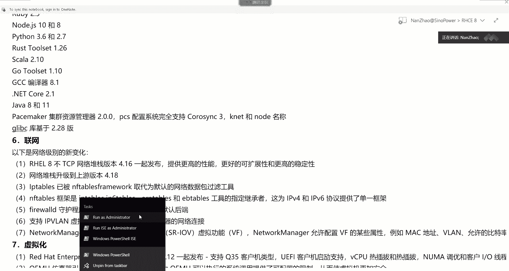
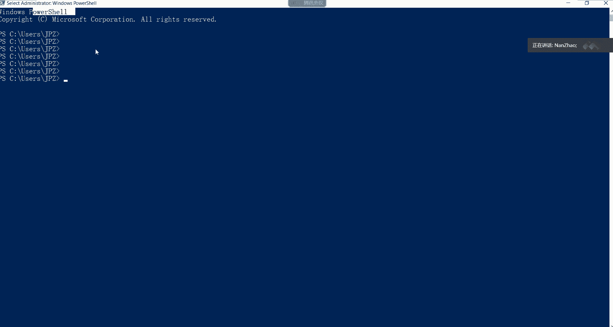
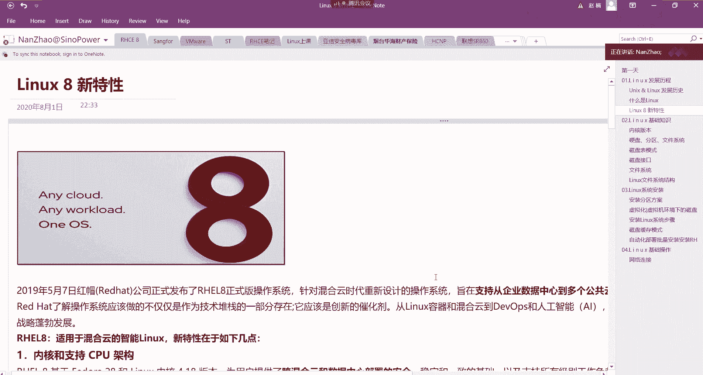

# Linux系统定义及RHEL8.x：P1：2、Linux系统定义及RHEL8.x版本介绍

## 概述
在本节课中，我们将要学习Linux操作系统的核心定义，并详细介绍Red Hat Enterprise Linux 8.x这一重要版本。我们将从Linux的基本概念入手，逐步了解其发展历程、核心组件以及RHEL8.x版本带来的新特性。

---

## Linux系统定义

Linux是一个开源的、类Unix的操作系统内核。它由林纳斯·托瓦兹于1991年首次发布。Linux内核本身并不是一个完整的操作系统，它需要与各种系统软件和应用程序（通常来自GNU项目）结合，才能构成一个功能完整的操作系统，我们常称之为“GNU/Linux”发行版。

Linux系统的核心特点是**开源**和**模块化**。其内核负责管理系统的硬件资源，如CPU、内存和输入/输出设备。一个典型的Linux系统结构可以用以下分层模型表示：

```
应用程序 (Applications)
    ↓
系统库与工具 (Libraries & Tools, e.g., GNU Coreutils)
    ↓
Linux内核 (Linux Kernel)
    ↓
计算机硬件 (Hardware)
```

上一节我们介绍了Linux的基本定义，本节中我们来看看Linux系统的主要组成部分。

### Linux系统的主要组成部分
一个完整的Linux操作系统通常包含以下几个核心部分：



1.  **内核 (Kernel)**：这是系统的核心，充当硬件和软件之间的桥梁。它管理进程、内存、设备驱动和系统调用。
2.  **Shell**：这是用户与内核交互的命令行界面。用户通过输入命令，由Shell解释并传递给内核执行。常见的Shell有Bash、Zsh等。
3.  **系统工具 (System Utilities)**：这些是完成特定任务的程序，例如文件操作（`cp`, `mv`, `ls`）、文本处理（`grep`, `awk`, `sed`）和进程管理（`ps`, `kill`）。GNU项目提供了大量此类工具。
4.  **应用程序 (Applications)**：包括桌面环境（如GNOME、KDE）、办公软件、浏览器等用户直接使用的软件。

---

## Red Hat Enterprise Linux 8.x 介绍

了解了Linux的基础后，我们聚焦到企业级领域一个极具影响力的发行版——Red Hat Enterprise Linux，简称RHEL。RHEL 8.x是其重要的最新系列版本。

RHEL是由红帽公司开发并维护的商业Linux发行版，以其**极高的稳定性、安全性和长期的技术支持**而闻名，广泛应用于服务器、云计算和企业数据中心。



### RHEL 8.x 的主要新特性与变化
RHEL 8引入了多项重要更新，旨在更好地支持现代IT基础设施。以下是其核心变化：

*   **应用流 (Application Streams)**：这是RHEL 8的一项关键创新。传统的软件仓库中，一个软件（如PHP）只有一个固定版本。而应用流允许同一个软件包提供多个主要版本，并可以独立于操作系统核心进行更频繁的更新。这为开发者提供了更大的灵活性。
    *   例如，你可以同时安装PHP 7.2和PHP 7.3，并根据项目需要选择使用哪一个。

*   **默认的桌面环境**：RHEL 8工作站版默认采用**GNOME 3.28**桌面环境，提供了现代化的用户界面和操作体验。

*   **软件包管理**：虽然仍支持YUM，但RHEL 8将**DNF**作为默认的软件包管理器。DNF是YUM的下一代版本，解决了依赖解析和性能方面的一些问题。基本命令与YUM类似，例如安装软件包：
    ```bash
    sudo dnf install package_name
    ```



*   **内核版本**：RHEL 8基于较新的**Linux 4.18内核**，带来了对最新硬件更好的支持、增强的安全特性以及性能改进。

*   **安全增强**：集成了**SELinux**、**系统范围的加密策略**等，并引入了`cockpit`网页控制台，简化了系统管理和监控。

*   **编程语言与数据库**：提供了更新的开发工具链，包括Python 3.6、OpenJDK 11、Node.js 10等。MariaDB 10.3和PostgreSQL 10/9.6作为默认的数据库选项。

---

## 总结
本节课中我们一起学习了Linux操作系统的核心定义，了解了它作为开源内核与GNU工具结合构成完整系统的特点。随后，我们深入介绍了Red Hat Enterprise Linux 8.x这一企业级发行版，重点探讨了其引入的“应用流”、新的软件包管理器DNF、更新的内核以及安全和管理方面的增强特性。理解这些基础概念和版本变化，是进一步学习Linux系统管理和RHCE认证的重要基石。