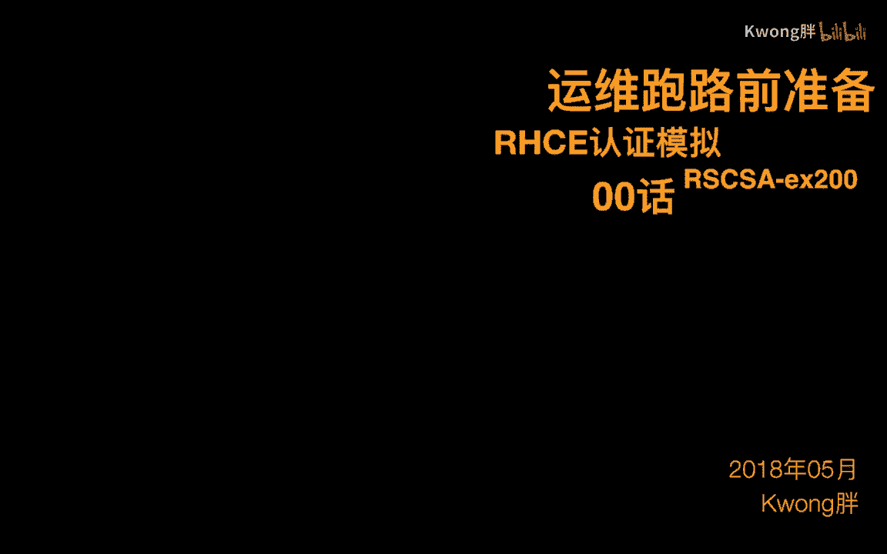
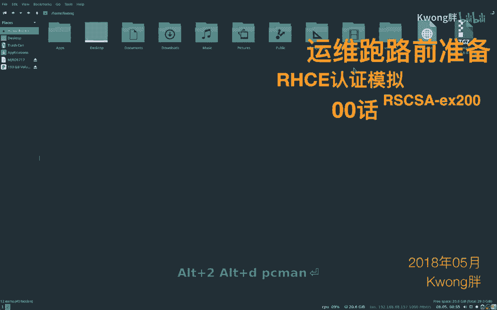
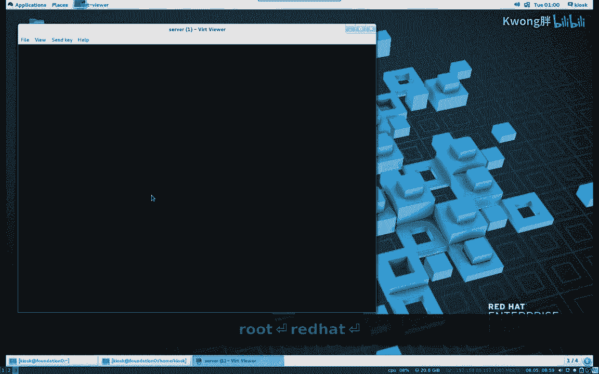
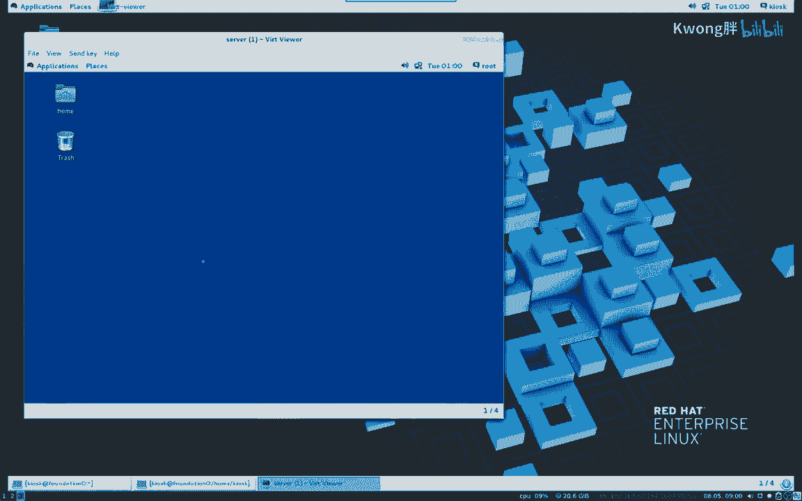
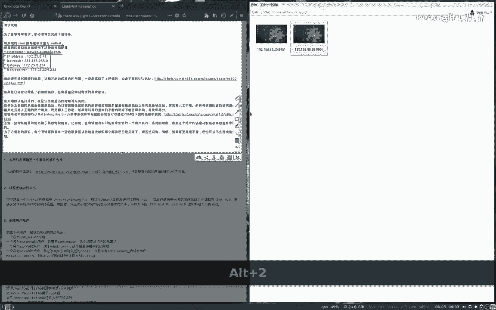

# Linux红帽RHEL之RHCSA模拟题：00章：课程介绍与环境准备 🖥️

在本节课中，我们将要学习RHCSA模拟题系列课程的整体介绍，并完成实验环境的准备工作。我们将了解课程的目标、所需的软件工具以及如何正确配置虚拟机环境，为后续的实践操作打下坚实基础。

## 课程概述与目标 🎯

RHCSA是红帽认证系统管理员的英文缩写。本系列课程旨在通过模拟真实考题，帮助学习者掌握红帽企业Linux（RHEL）的系统管理核心技能。



课程内容基于红帽官方考试大纲设计，涵盖了用户管理、文件权限、存储配置、系统服务管理等关键知识点。完成本系列学习，你将具备通过RHCSA认证考试的理论与实践能力。

## 实验环境准备 🛠️



上一节我们介绍了课程的整体目标，本节中我们来看看搭建实验环境所需的软件与配置步骤。一个稳定、一致的实验环境是高效学习的前提。

以下是搭建实验环境需要准备的软件列表：
*   **虚拟机软件**：推荐使用VMware Workstation或VirtualBox。
*   **操作系统镜像**：需要准备Red Hat Enterprise Linux（RHEL）的ISO安装镜像文件。
*   **终端工具**：Windows系统可使用Xshell、MobaXterm或PuTTY，macOS和Linux系统可直接使用内置终端。

## 虚拟机安装与配置 ⚙️



准备好了必要的软件后，接下来我们需要在虚拟机软件中安装并配置RHEL系统。正确的初始配置能避免后续实验中出现不必要的问题。

以下是创建虚拟机时的关键配置步骤：
1.  **创建新虚拟机**：选择“自定义”安装模式以便进行详细配置。
2.  **选择镜像**：在安装过程中，指向你已下载好的RHEL ISO文件。
3.  **系统配置**：为虚拟机分配至少2GB内存和20GB硬盘空间。
4.  **网络设置**：将网络适配器设置为“桥接模式”或“NAT模式”，确保虚拟机可以访问网络。
5.  **分区设置**：在安装类型中，选择“手动分区”并创建`/boot`、`swap`和`/`分区。



## 系统初始化与基本设置 🔑

系统安装完成后，首次启动需要进行一些基本的初始化设置，这对后续的系统管理和实验操作至关重要。

以下是系统初始化阶段必须完成的几项任务：
*   **接受许可证**：启动后首先需要阅读并接受红帽的许可协议。
*   **完成初始配置**：在“初始设置”界面中，配置系统的语言、时区等基础信息。
*   **创建用户**：为系统创建一个非root的普通用户，并设置密码。
*   **注册系统**：如果你使用的是需要订阅的RHEL版本，可能需要注册系统以获取软件更新。



## 连接虚拟机与熟悉界面 🔌

环境配置的最后一步是学习如何连接到虚拟机并熟悉操作界面。我们将使用SSH工具进行远程连接，这是系统管理员日常工作中最常用的方式。


核心的连接命令是SSH，其基本语法如下：
```bash
ssh username@server_ip_address
```
例如，使用用户`student`连接IP为`192.168.1.100`的虚拟机，命令为：
```bash
ssh student@192.168.1.100
```
输入对应用户的密码后，即可成功登录到远程系统的命令行界面。

---

本节课中我们一起学习了RHCSA模拟题课程的介绍与实验环境的完整搭建流程。我们明确了课程目标，准备了必要的软件，逐步安装了RHEL虚拟机，并完成了系统初始化与远程连接。现在，你已经拥有了一个可供练习的Linux环境，接下来我们就可以正式开始RHCSA核心技能的学习与实践了。