# Linux红帽认证教程：10-04：使用RHEL系统角色配置NTP服务 🕐

在本节课中，我们将学习如何使用RHEL系统角色来配置网络时间协议服务。我们将通过一个具体的练习，演示如何安装系统角色软件包、配置角色路径，并编写一个Playbook来为所有受管节点设置NTP服务器。

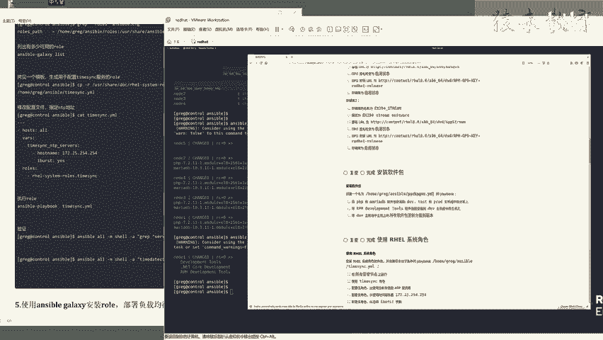

---

## 概述

本节练习要求我们使用红帽提供的系统角色来配置NTP服务。具体步骤包括：安装红帽系统角色软件包，配置Ansible以识别这些角色，然后编写一个Playbook来应用`timesync`角色，并按照题目要求设置特定的NTP服务器地址。

---

## 环境准备与连通性检查

在开始配置之前，必须确保控制节点能够与所有被管理的节点正常通信。

以下是验证步骤：

*   使用 `ansible` 命令的 `ping` 模块检查基础连通性。
*   使用 `ansible` 命令的 `setup` 模块获取主机名，进一步确认通信正常。

执行命令如下：
```bash
ansible all -m ping
ansible all -m setup -a 'filter=ansible_hostname'
```

---

## 安装红帽系统角色软件包

首先，我们需要安装包含红帽官方系统角色的软件包。

执行以下命令进行安装：
```bash
yum install rhel-system-roles
```
安装完成后，系统角色文件将被放置在 `/usr/share/rhel-system-roles/` 目录下。

---

## 配置Ansible角色路径

安装软件包后，需要让Ansible知道这些新角色的位置。这通过修改Ansible的配置文件来实现。

操作步骤如下：

1.  编辑Ansible的主配置文件 `/etc/ansible/ansible.cfg`。
2.  找到 `roles_path` 配置项。
3.  在默认路径后添加冒号，并加上系统角色的路径 `/usr/share/rhel-system-roles`。

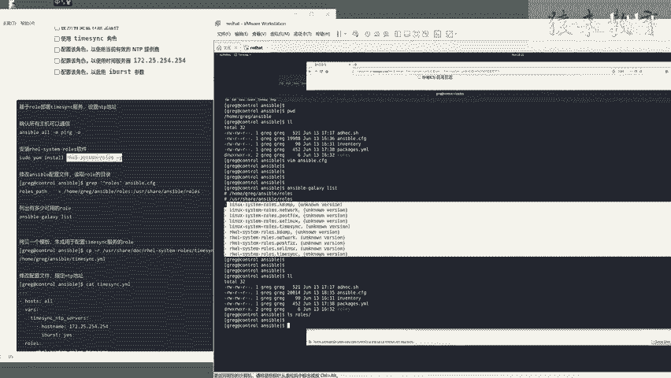

修改后的配置行示例如下：
```
roles_path = /home/student/ansible/roles:/usr/share/rhel-system-roles
```
修改完成后，可以使用以下命令验证Ansible是否能识别这些角色：
```bash
ansible-galaxy role list
```
该命令会列出所有可用的角色，此时应能看到 `/usr/share/rhel-system-roles` 目录下的众多角色，例如 `rhel-system-roles.timesync`。

---

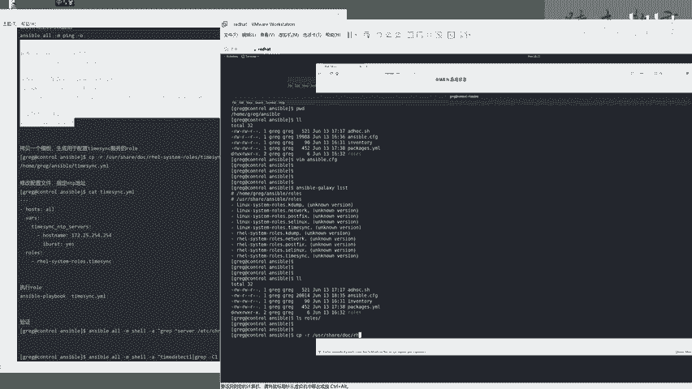

## 编写并配置Playbook

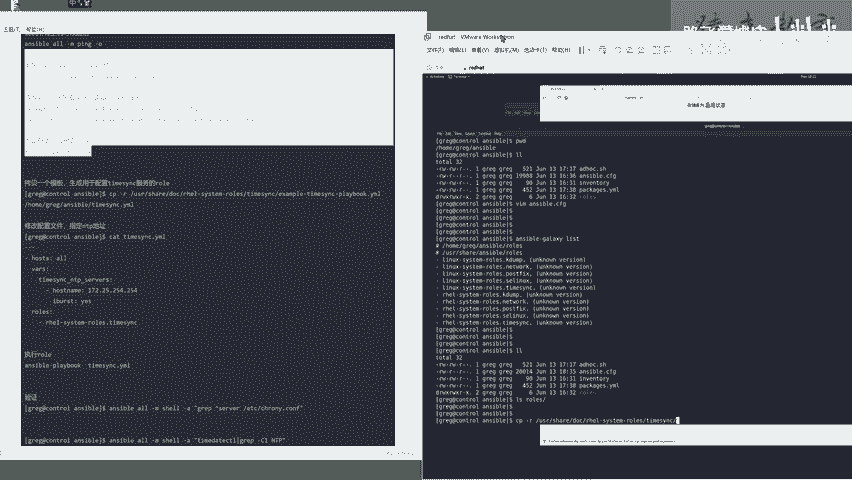

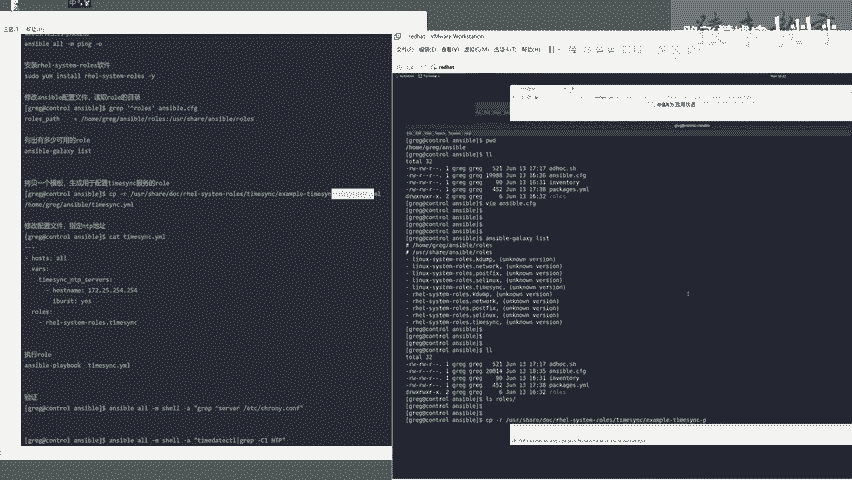

上一节我们配置了角色路径，本节中我们来看看如何编写具体的Playbook来应用角色。

题目要求我们创建一个Playbook文件（例如 `/home/student/ansible/timesync.yml`），并使用 `timesync` 角色。我们可以直接复制红帽提供的示例文件作为基础模板。

执行以下命令复制示例文件：
```bash
cp /usr/share/doc/rhel-system-roles/timesync/examples/timesync-playbook.yml /home/student/ansible/timesync.yml
```

接下来，我们需要根据题目要求修改这个Playbook文件。主要修改点有两处：

1.  **操作主机组**：将默认的 `hosts` 值改为 `all`，以便对所有受管节点生效。
2.  **配置参数**：在 `vars` 部分，设置 `timesync_ntp_servers` 变量，其值为题目提供的NTP服务器地址（例如 `host: 172.25.254.254`），并确保 `timesync_ntp_provider` 为 `chrony`。

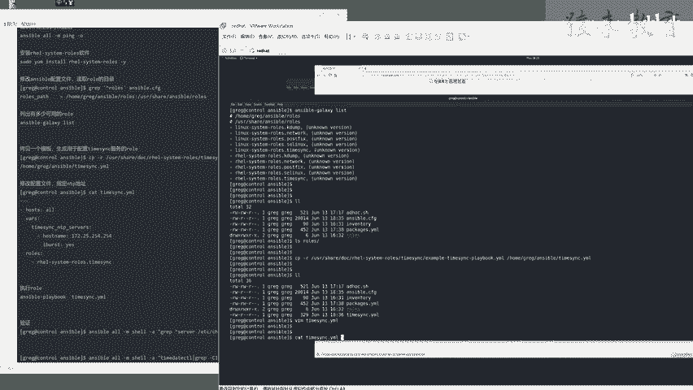

修改后的Playbook核心内容如下：
```yaml
---
- hosts: all
  vars:
    timesync_ntp_servers:
      - hostname: 172.25.254.254
        iburst: yes
    timesync_ntp_provider: chrony
  roles:
    - rhel-system-roles.timesync
```

---

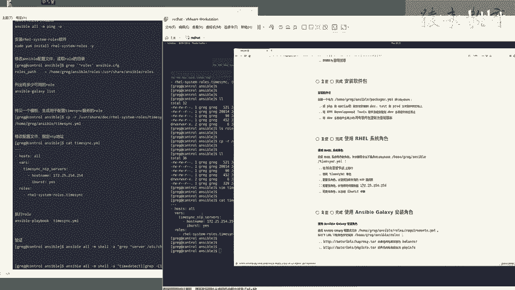

## 执行Playbook并验证结果

Playbook编写完成后，需要执行它以实际配置所有节点。

使用以下命令执行Playbook：
```bash
ansible-playbook /home/student/ansible/timesync.yml
```
执行过程中，Ansible会自动在各节点安装和配置Chrony服务，并指向指定的NTP服务器。

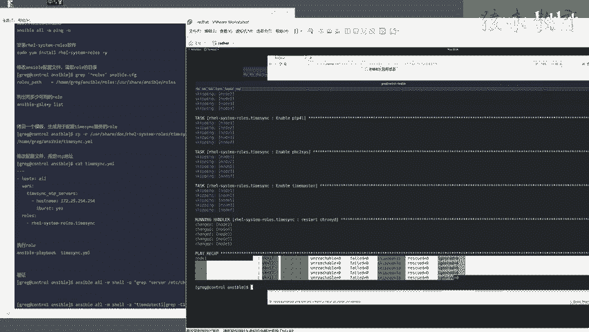

执行完成后，必须进行验证以确保配置已正确应用。

以下是验证步骤：

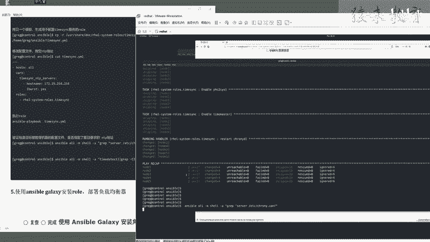

*   **检查配置文件**：在所有受管节点上检查Chrony的配置文件（`/etc/chrony.conf`），确认其中包含了指定的NTP服务器地址。
    ```bash
    ansible all -m shell -a "grep '^server 172.25.254.254' /etc/chrony.conf"
    ```
*   **检查服务状态**：验证时间同步服务是否处于活动状态。
    ```bash
    ansible all -m shell -a "timedatectl status | grep 'NTP synchronized'"
    ```
    如果返回结果为 `NTP synchronized: yes`，则说明时间同步已成功启用。

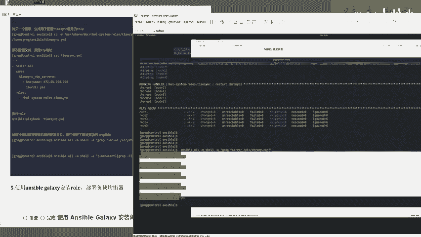

---

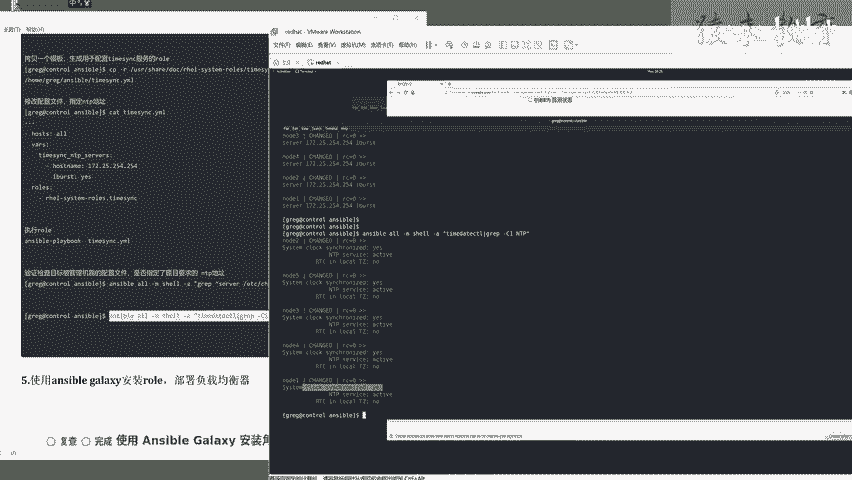

## 总结

本节课中我们一起学习了如何使用RHEL系统角色来高效地配置NTP服务。我们完成了从安装系统角色软件包、配置Ansible路径，到编写、执行和验证Playbook的完整流程。利用系统角色可以大大简化复杂服务的配置过程，提高自动化运维的效率和一致性。