# Linux红帽认证教程：2-02：配置node1的网络设置 🖧

在本节课中，我们将学习如何在RHCSA/RHCE考试环境中，为node1主机配置网络设置。这是考试的第一道题目，也是后续所有操作的基础，如果网络配置错误，将导致后续任务无法进行。

## 概述

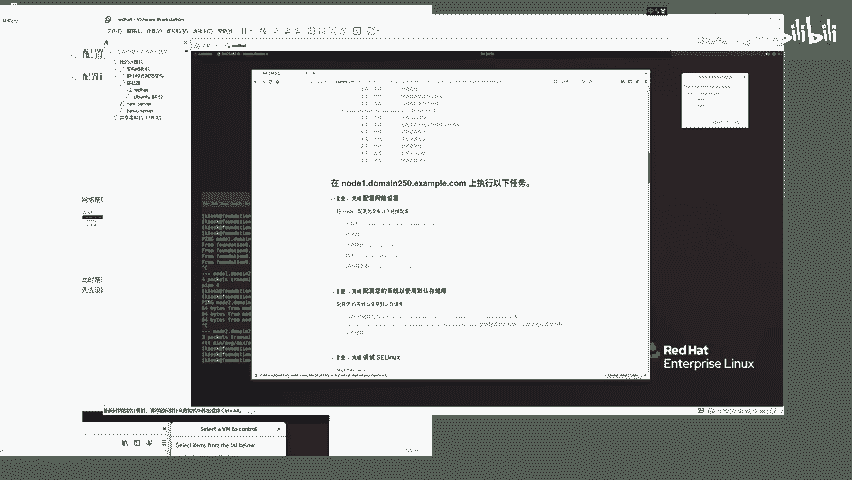

题目要求我们在`node1`主机上配置网络，使其符合指定的IP地址、子网掩码、网关和DNS服务器要求，并设置正确的主机名。由于初始状态下无法通过SSH连接到`node1`，我们必须通过虚拟机控制台直接登录进行操作。

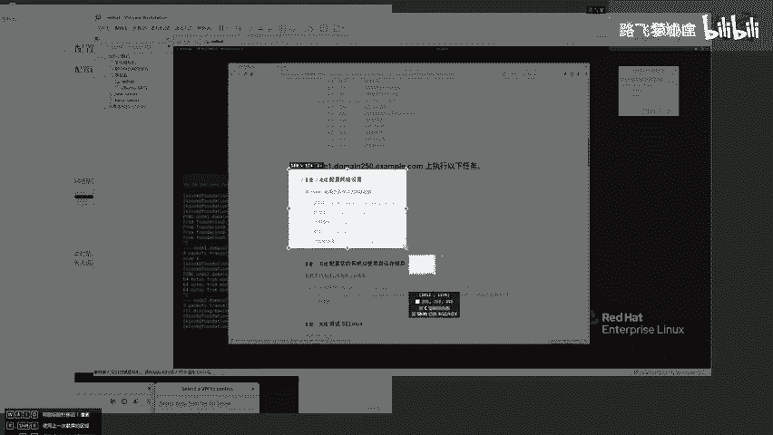

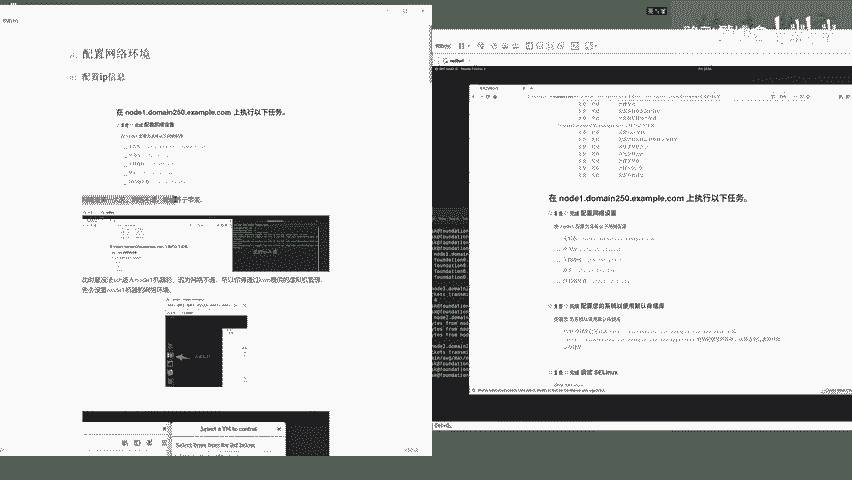

## 访问node1控制台

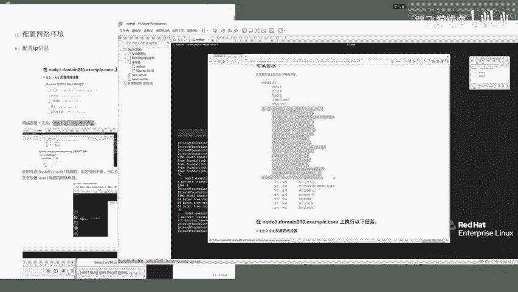

首先，我们需要进入`node1`的虚拟机控制台。在考试环境的图形界面中，通常可以通过以下路径操作：

1.  点击左上角的“虚拟机控制”或类似选项。
2.  在弹出的列表中选择 `node1`。
3.  选择 `Console`（控制台）选项进入。

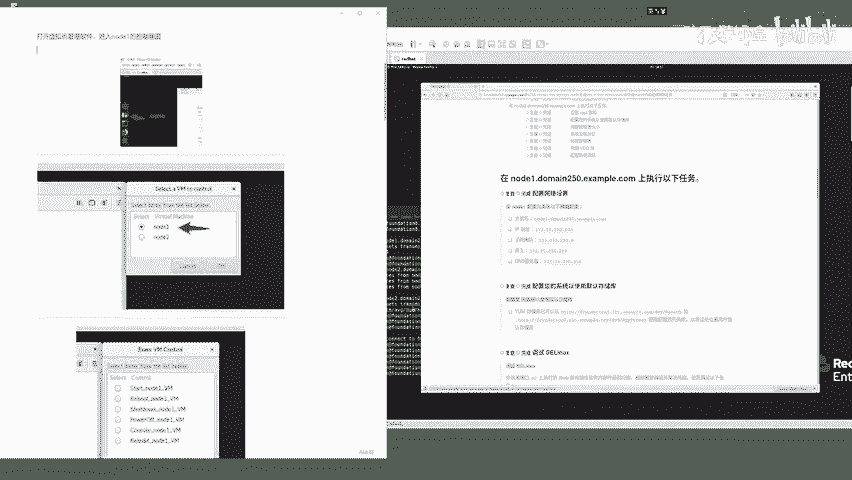

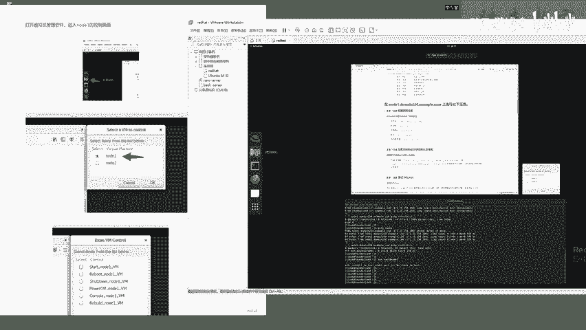

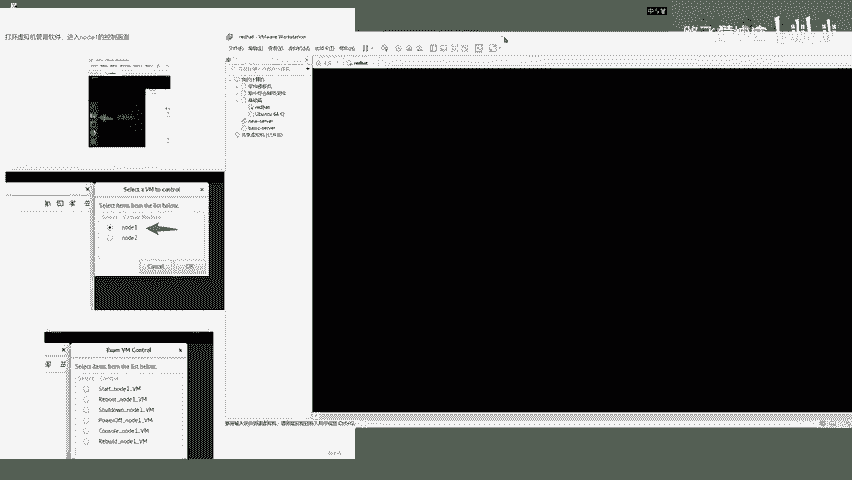

进入控制台后，使用提供的默认凭据登录：
*   **用户名**：`root`
*   **密码**：`flectrag`

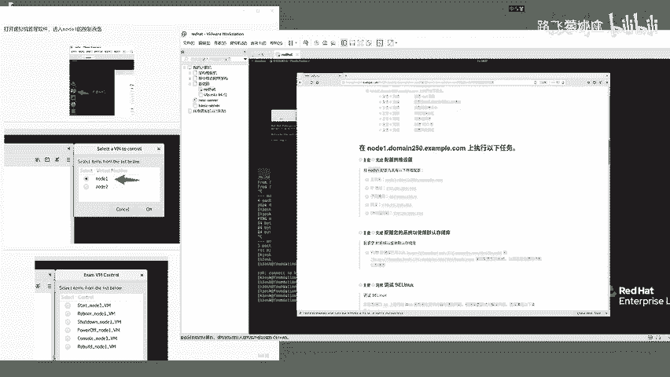

登录成功后，你将看到命令行提示符。

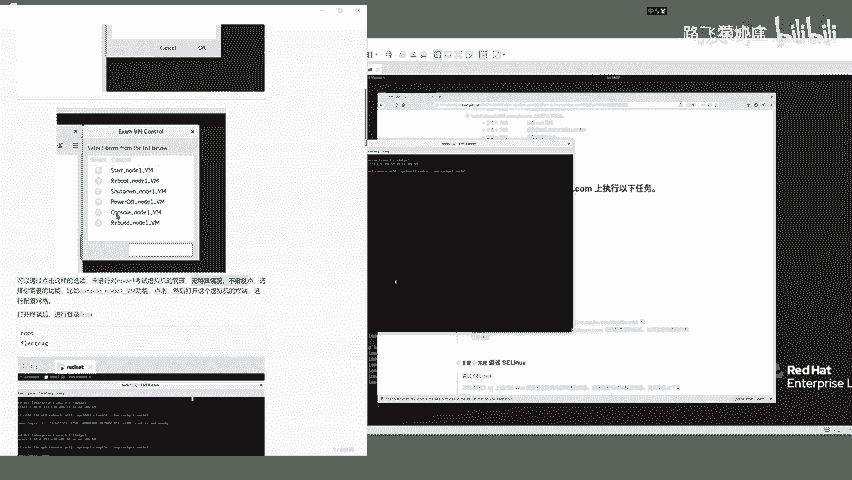

## 检查当前网络状态

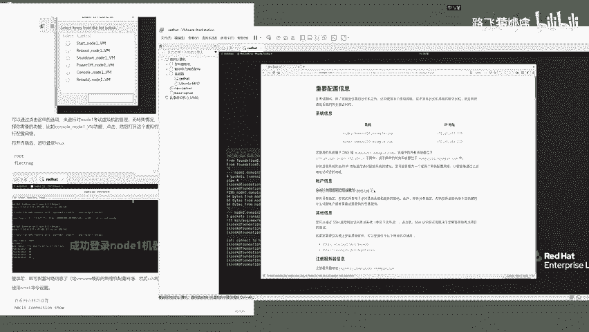

登录后，可以先查看当前的网络配置，确认其不符合题目要求。

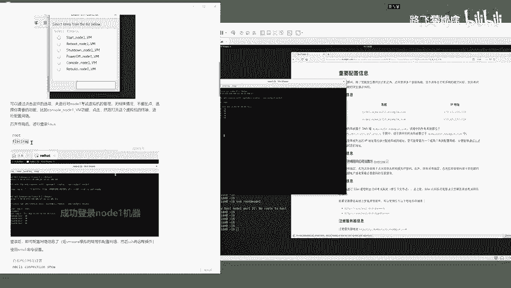

```bash
ip addr show
```

你会发现当前的IP地址并非题目要求的 `172.25.250.100`。

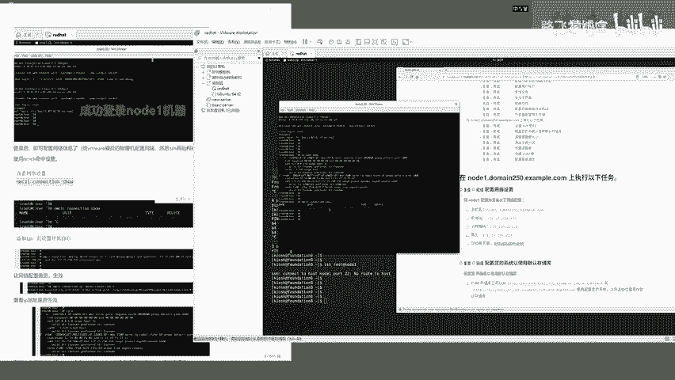

## 配置网络连接

我们将使用 `nmcli` 命令来修改网络配置。首先，查看现有的网络连接名称。

```bash
nmcli connection show
```

你会看到一个连接，其名称类似 `Wired connection 1`（注意名称中包含空格）。

接下来，使用以下命令集修改该连接的配置。**请务必注意，连接名称如果包含空格，必须用引号括起来。**

```bash
nmcli connection modify “Wired connection 1” ipv4.method manual ipv4.addresses 172.25.250.100/24 ipv4.gateway 172.25.250.254 ipv4.dns 172.25.250.254 connection.autoconnect yes
```

**命令参数解析：**
*   `ipv4.method manual`：设置为手动配置IP。
*   `ipv4.addresses 172.25.250.100/24`：设置IP地址为`172.25.250.100`，子网掩码为`255.255.255.0`（`/24`）。
*   `ipv4.gateway 172.25.250.254`：设置网关地址。
*   `ipv4.dns 172.25.250.254`：设置DNS服务器地址。
*   `connection.autoconnect yes`：设置网卡开机自动连接。

配置完成后，需要激活这个连接以使设置生效。

```bash
nmcli connection up “Wired connection 1”
```

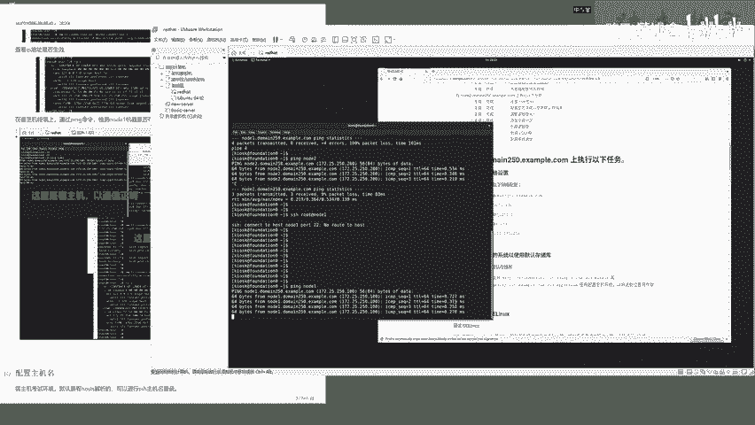

系统会提示连接已成功激活。再次使用 `ip addr show` 命令检查，确认IP地址已变更为 `172.25.250.100`。

## 配置主机名

上一节我们配置了网络，本节我们来看看如何设置主机名。根据题目要求，需要将主机名设置为 `node1.example.com`。

使用 `hostnamectl` 命令修改主机名：

```bash
hostnamectl set-hostname node1.example.com
```

修改后，**需要重新登录系统**才能使新的主机名在Shell提示符中生效。你可以先退出当前SSH会话（如果已建立）或控制台，然后重新登录。

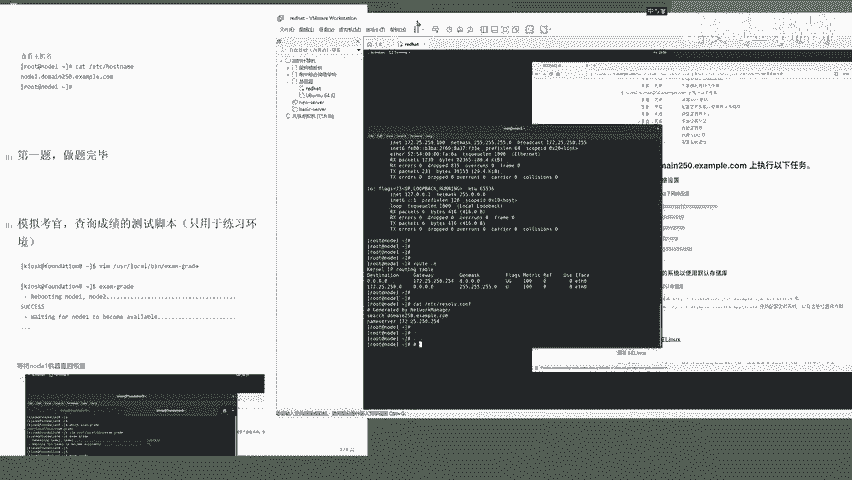

## 验证配置

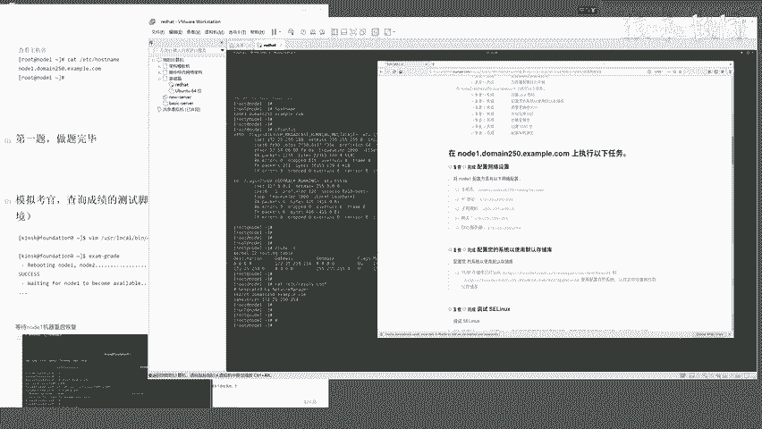

所有配置完成后，必须进行验证，确保每一项都符合题目要求。以下是验证步骤：

1.  **验证IP地址与连通性**：在考试主机的终端（非node1控制台）执行。
    ```bash
    ping 172.25.250.100
    ssh root@node1
    ```
    应能`ping`通该IP，并能使用密码`flectrag`成功SSH登录。

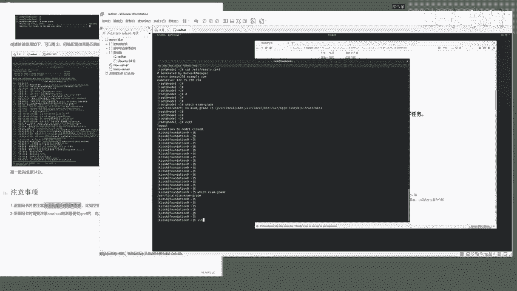

2.  **验证node1上的详细配置**：在SSH登录到`node1`后，执行以下命令。
    *   **验证IP和子网掩码**：
        ```bash
        ip addr show eth0  # 或 ifconfig eth0
        ```
        输出中应包含 `inet 172.25.250.100/24`。
    *   **验证网关**：
        ```bash
        ip route show default
        ```
        或
        ```bash
        route -n
        ```
        默认网关应为 `172.25.250.254`。
    *   **验证DNS**：
        ```bash
        cat /etc/resolv.conf
        ```
        文件中应包含 `nameserver 172.25.250.254`。
    *   **验证主机名**：
        ```bash
        hostname
        ```
        输出应为 `node1.example.com`。

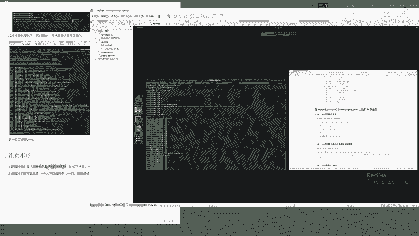

## 注意事项与总结

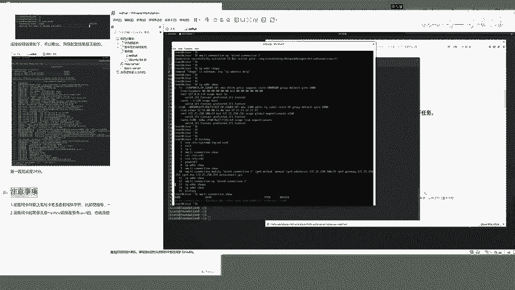

在本节课中，我们一起学习了如何为考试环境中的`node1`主机配置网络。以下是核心要点总结：

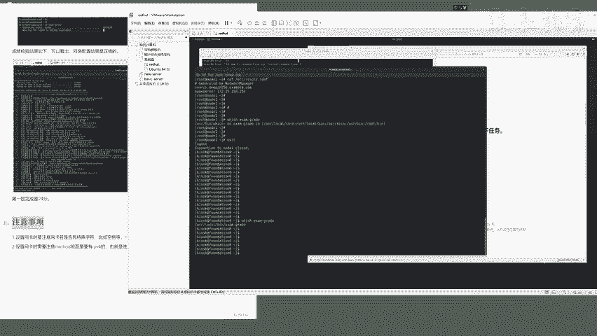

*   **基础重要性**：网络配置是考试的第一题，也是所有后续操作的基础，务必准确无误。
*   **操作路径**：当目标主机网络未通时，需通过虚拟机控制台直接登录配置。
*   **核心命令**：使用 `nmcli connection modify` 命令是配置网络的关键，其语法结构为：
    ```bash
    nmcli connection modify “<连接名>” <属性名> <值> <属性名> <值> ...
    ```
*   **关键细节**：如果网络连接名称包含空格，**必须使用引号**（单引号或双引号）将其括起。
*   **验证步骤**：配置后必须通过`ping`、`ssh`以及检查各项配置文件的方式进行全面验证。

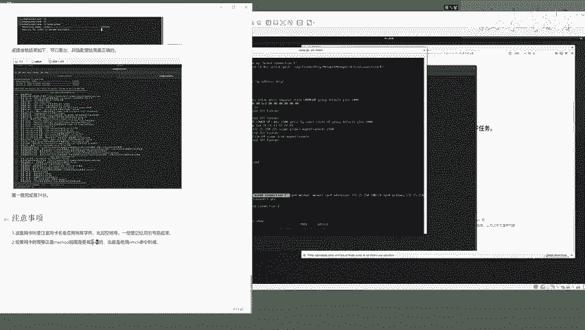

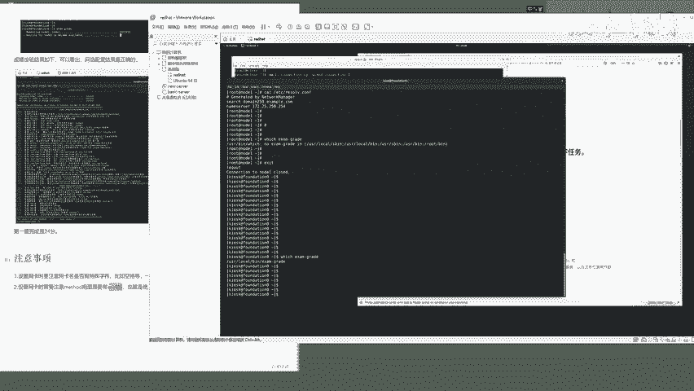

完成以上所有步骤并验证通过后，`node1`的网络配置任务即告完成。你可以关闭控制台窗口，返回考试主机的终端环境，继续后续的题目。