# Linux红帽认证教程：4-04：调试SELinux 🔧

在本节课中，我们将学习如何调试SELinux，以解决因SELinux安全策略导致的服务（如Web服务器）无法在非标准端口上运行的问题。我们将通过修改SELinux规则，允许Apache服务在82端口上运行，并确保相关网页资源可被访问。

---

上一节我们介绍了SELinux的基本概念，本节中我们来看看如何具体操作以解决实际问题。

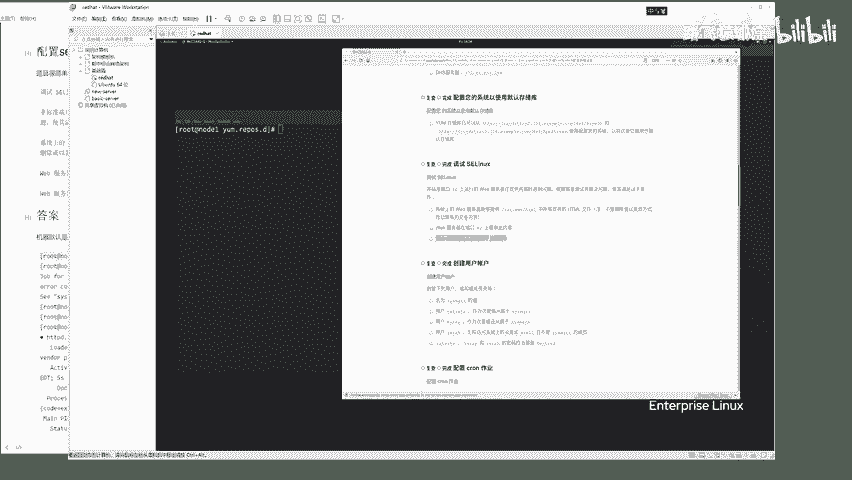

题目要求将Web服务器的默认运行端口修改为82。在SELinux处于强制模式时，此操作会因安全策略限制而失败。我们需要修改SELinux规则以允许此行为。

### 检查服务状态与SELinux

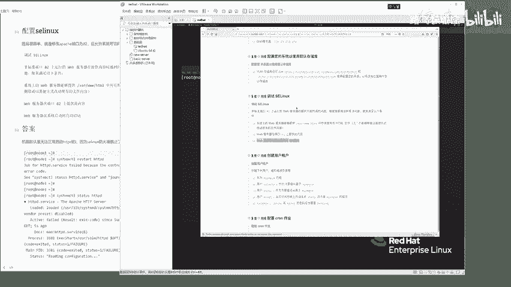

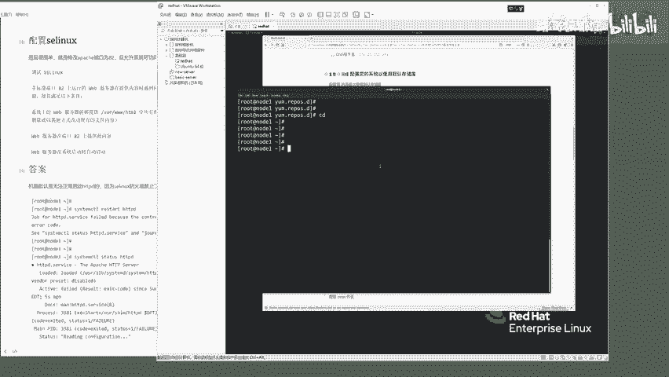

首先，尝试重启Apache服务（`httpd`）会发现启动失败。

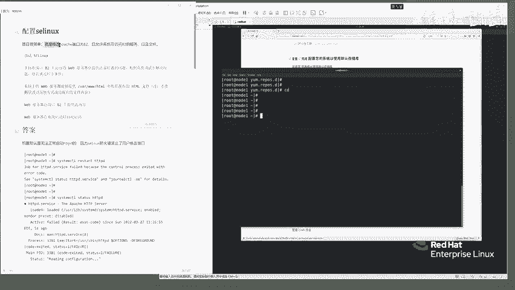

```bash
systemctl restart httpd
systemctl status httpd
```

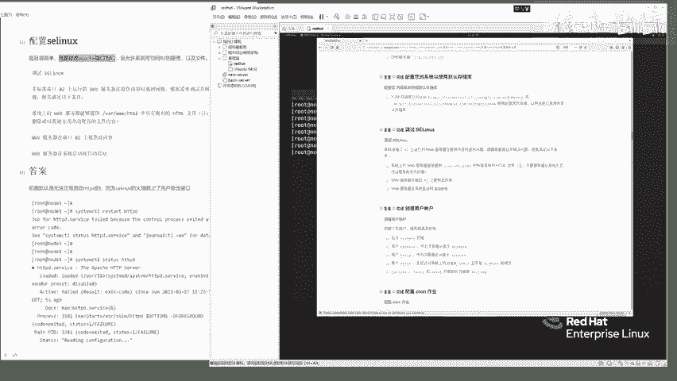

执行`status`命令后，输出信息会提示“权限拒绝”，无法绑定到82端口。这表明是SELinux在阻止服务运行。

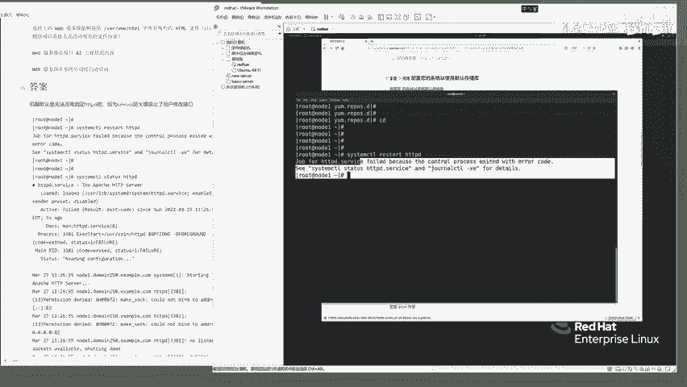

接下来，确认SELinux的当前运行模式。

```bash
getenforce
```

如果返回结果是 **`Enforcing`**，则表示SELinux正处于强制模式，所有策略都在生效。

### 修改SELinux端口规则

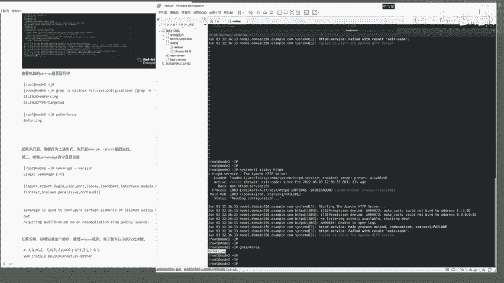

我们需要使用 `semanage` 命令来修改SELinux策略，允许`httpd`服务使用82端口。

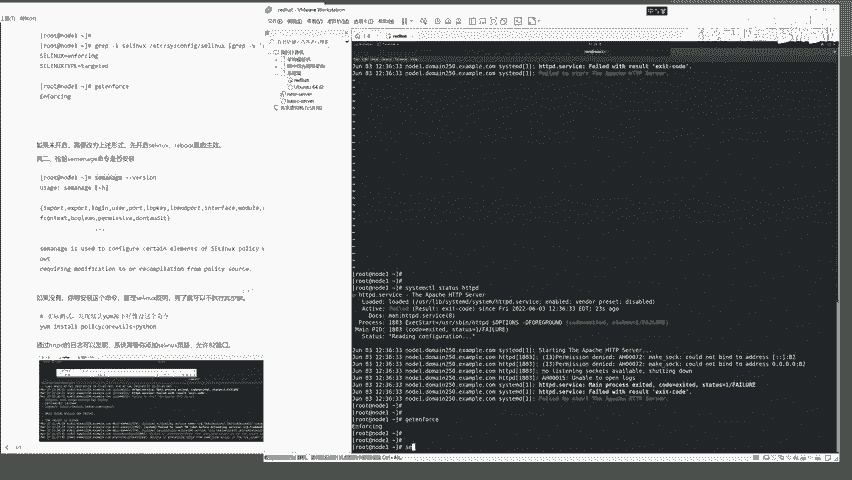

首先，确认 `semanage` 命令可用。

```bash
semanage --version
```

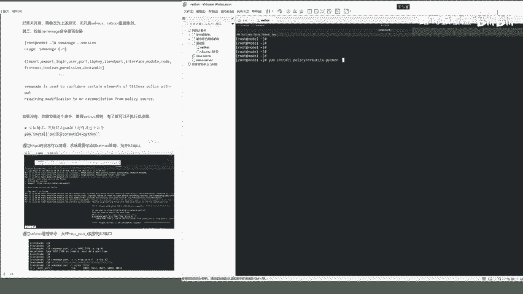

如果命令未安装，可以使用 `yum install policycoreutils-python-utils` 进行安装。但在考试环境中，该命令通常已预装。

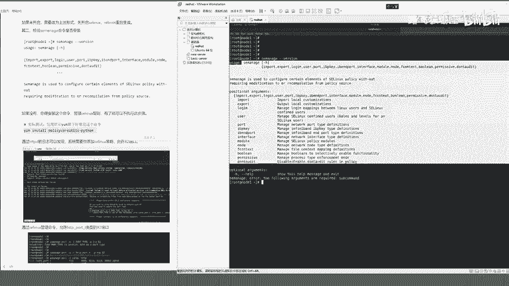

以下是修改端口规则的核心命令：

```bash
semanage port -a -t http_port_t -p tcp 82
```

*   `port -a`: 表示添加一个端口规则。
*   `-t http_port_t`: 指定端口类型为HTTP服务专用。
*   `-p tcp 82`: 指定协议为TCP，端口号为82。

命令执行成功后不会有明显输出。我们可以列出所有已允许的HTTP相关端口进行验证。

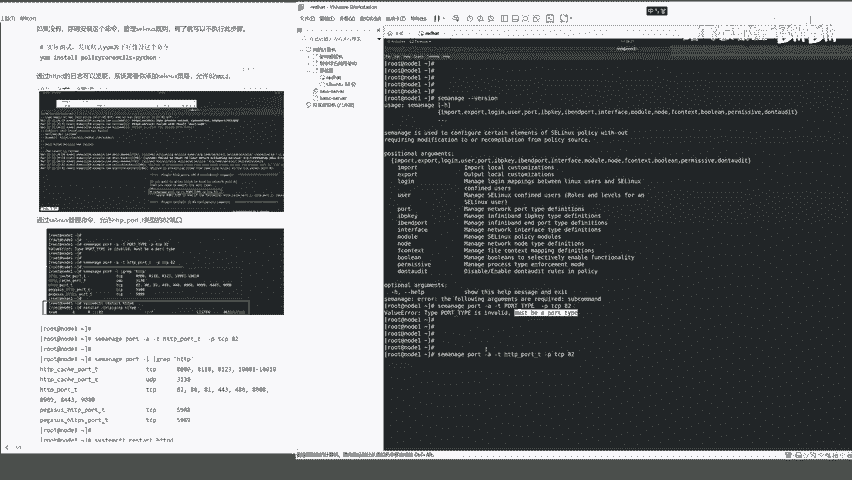

```bash
semanage port -l | grep http
```

在输出列表中，应该能看到 `http_port_t` 类型下包含了 `82/tcp`。

### 配置Web服务器资源

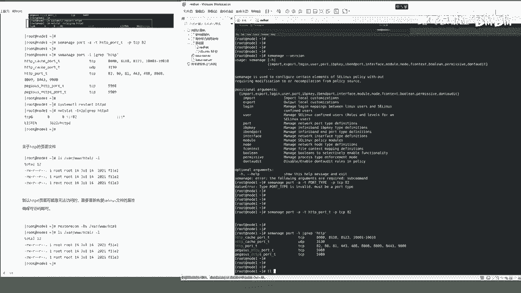

题目要求Web服务器提供 `/var/www/html/` 目录下的网页资源。即使文件存在，SELinux也可能阻止`httpd`进程读取它们。

我们需要使用 `restorecon` 命令来恢复文件正确的SELinux安全上下文。

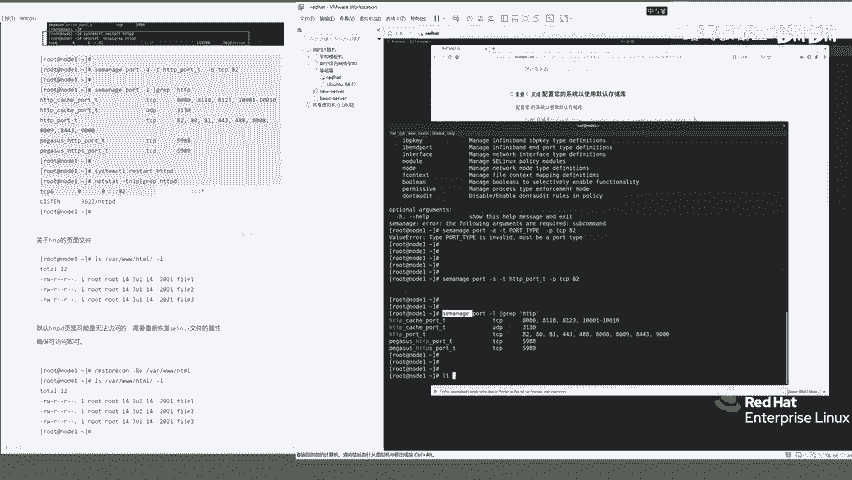

```bash
restorecon -Rv /var/www/html/
```

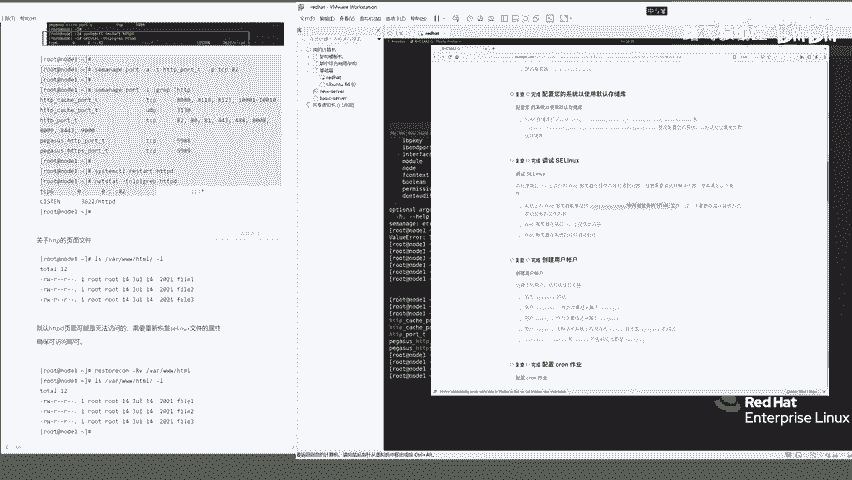

*   `-R`: 递归处理目录下的所有文件。
*   `-v`: 显示详细处理信息。

此命令确保目录及其内容具有`httpd_sys_content_t`类型，从而允许Web服务器访问。

### 验证与设置开机自启

完成上述配置后，重新启动`httpd`服务。

```bash
systemctl restart httpd
systemctl status httpd
```

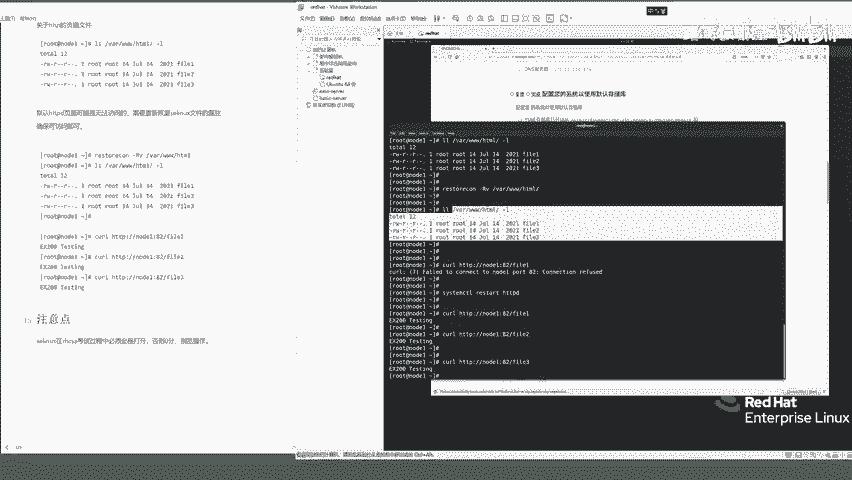

此时服务应能成功启动。我们可以在本地使用`curl`命令测试网页访问。

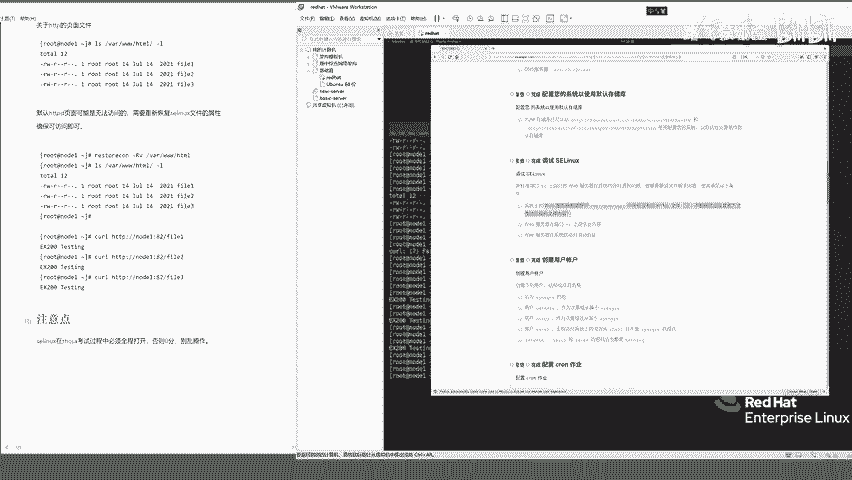

```bash
curl http://node1:82/file1
curl http://node1:82/file2
curl http://node1:82/file3
```

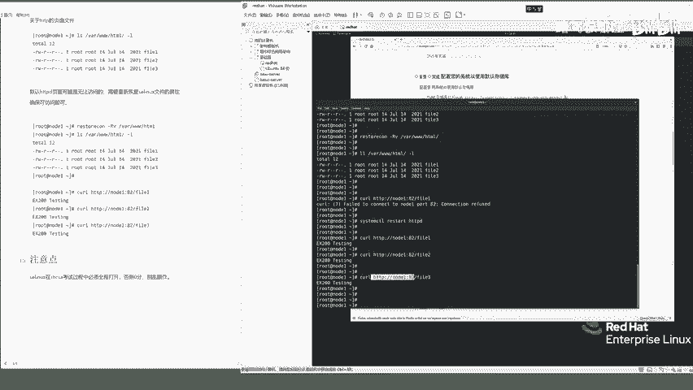

如果能够成功获取到网页内容，则证明配置正确。

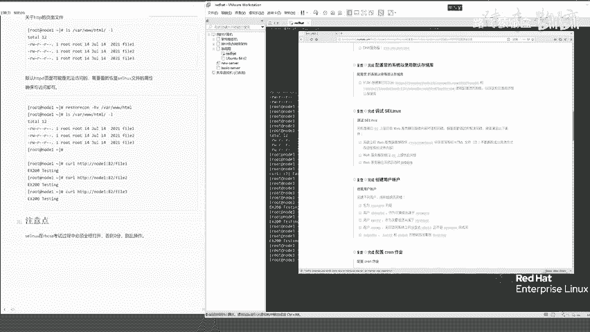

最后，按照题目要求，将Web服务设置为开机自动启动。

```bash
systemctl enable httpd
systemctl is-enabled httpd # 验证是否设置成功
```

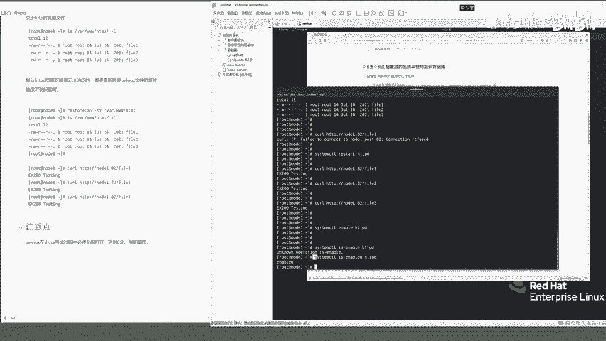

---

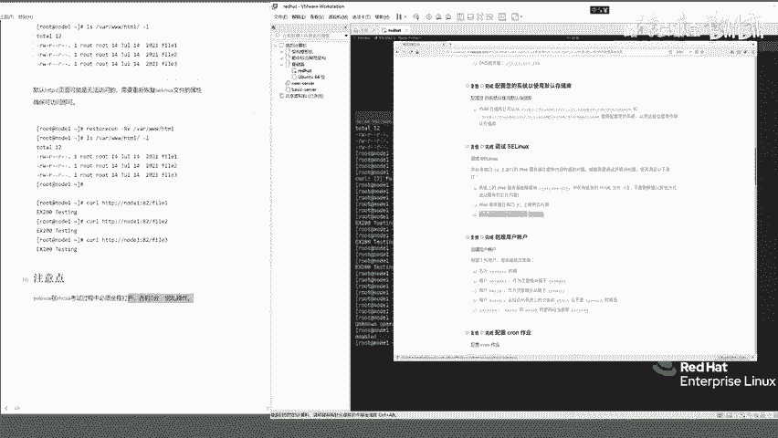

**重要提示**：在红帽认证考试中，请严格按照题目要求操作。不要擅自关闭SELinux或防火墙，否则可能导致任务失败而丢分。始终使用 `getenforce` 确认SELinux处于 **`Enforcing`** 模式，并通过修改策略而非关闭安全机制来解决问题。


---

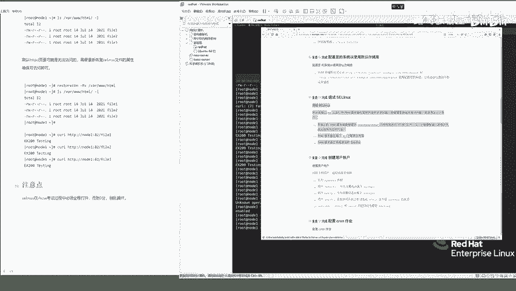

本节课中我们一起学习了如何调试SELinux。核心步骤包括：
1.  诊断SELinux导致的服务启动失败。
2.  使用 **`semanage port -a`** 命令添加允许服务使用特定端口的策略。
3.  使用 **`restorecon`** 命令修复网页资源目录的安全上下文。
4.  验证服务运行状态并设置开机自启。


掌握这些技能，你就能有效管理运行在SELinux环境下的网络服务。