# Linux红帽认证教程：5-05：创建用户账户 👥

在本节课中，我们将学习如何在Linux系统中创建用户账户和用户组，并管理用户的组成员关系与登录权限。这是RHCSA认证考试中的一项基础但重要的技能。

---

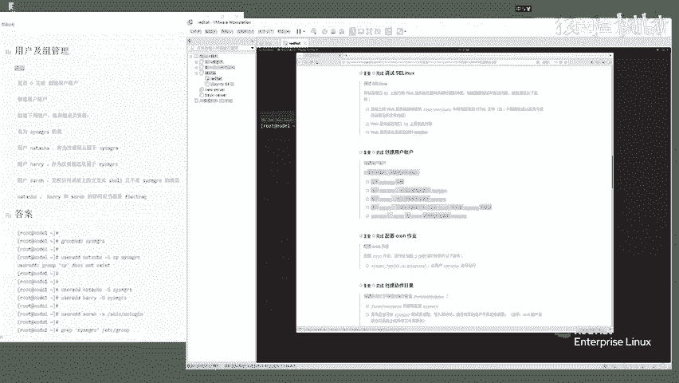

上一节我们介绍了系统的基本操作，本节中我们来看看如何管理用户和组。

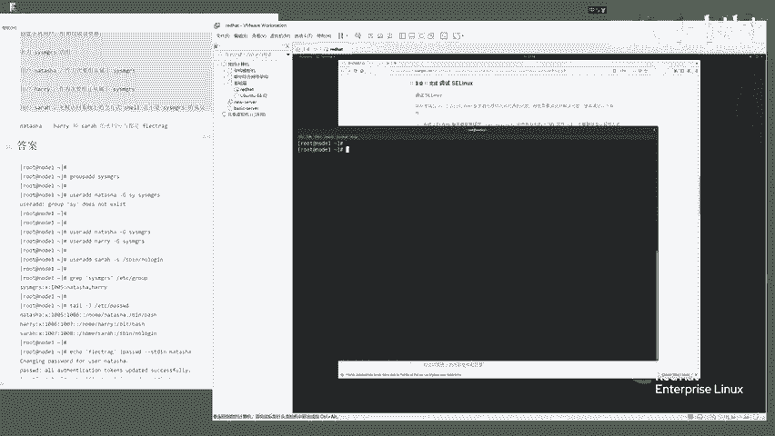

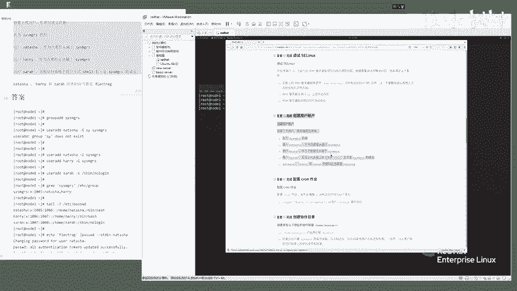

首先，请确保你在正确的机器上操作。根据题目要求，所有操作应在 `node1` 主机上执行。你可以使用 `hostname` 命令来确认当前主机。

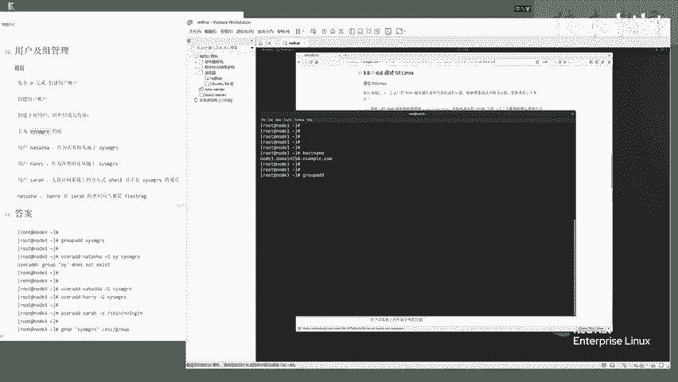

## 创建用户组

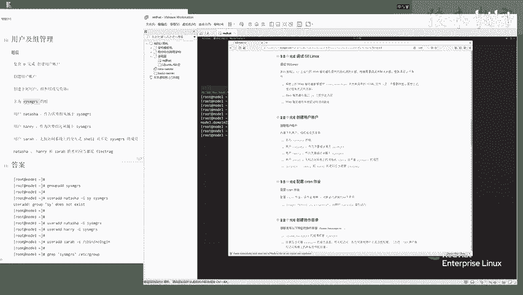

第一项任务是创建一个名为 `sysmgrs` 的用户组。在Linux中，创建组的命令是 `groupadd`。

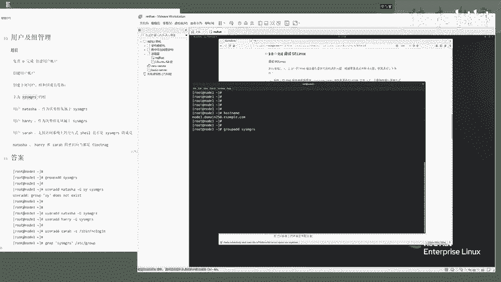

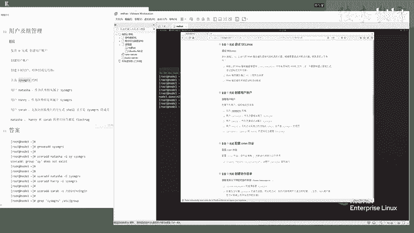

以下是具体操作步骤：

1.  使用 `groupadd` 命令创建组。
    ```bash
    groupadd sysmgrs
    ```
2.  创建完成后，可以使用 `grep` 命令在 `/etc/group` 文件中验证组是否已成功创建。
    ```bash
    grep sysmgrs /etc/group
    ```

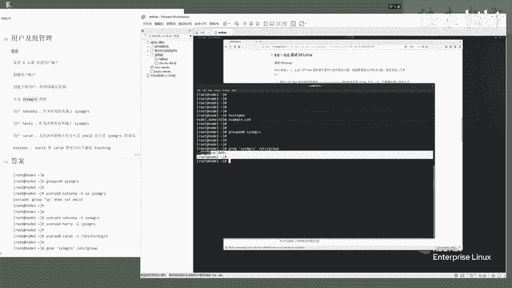


## 创建用户并指定附加组

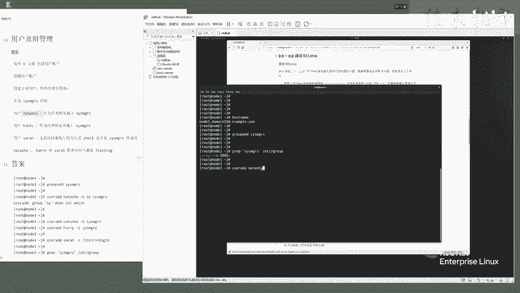

接下来，我们需要创建用户 `natasha` 和 `harry`，并将他们加入到 `sysmgrs` 组中。创建用户的命令是 `useradd`，使用 `-G` 参数可以指定用户的附加组。

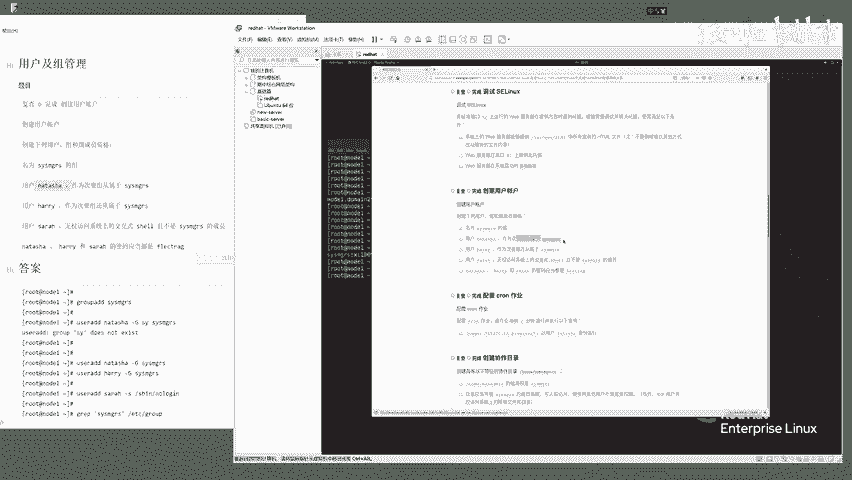

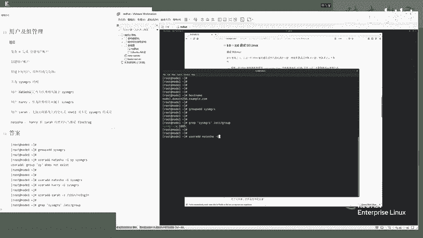

以下是创建 `natasha` 用户的操作步骤：

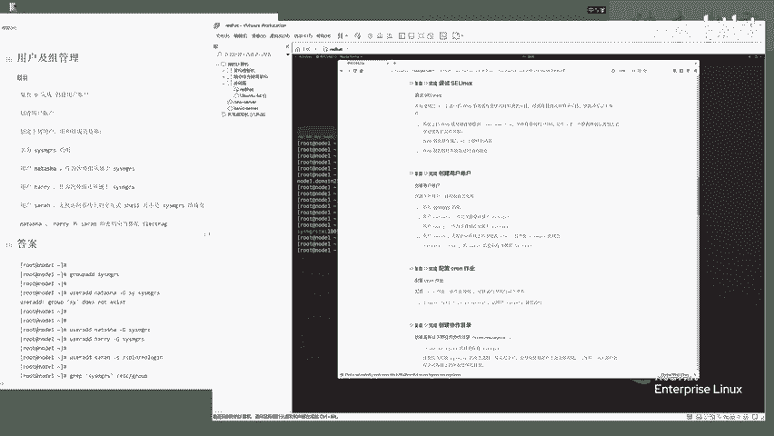

1.  使用 `useradd` 命令创建用户并指定附加组。
    ```bash
    useradd natasha -G sysmgrs
    ```
2.  使用 `id` 命令验证用户及其组信息。
    ```bash
    id natasha
    ```
    输出应显示 `natasha` 用户的主组（通常与用户名相同）以及附加组 `sysmgrs`。

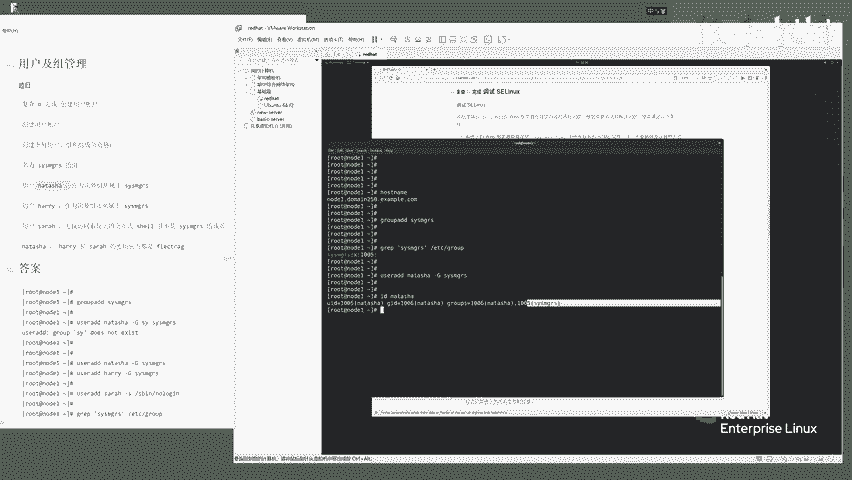

创建 `harry` 用户的操作与上述步骤完全相同，只需替换用户名即可。

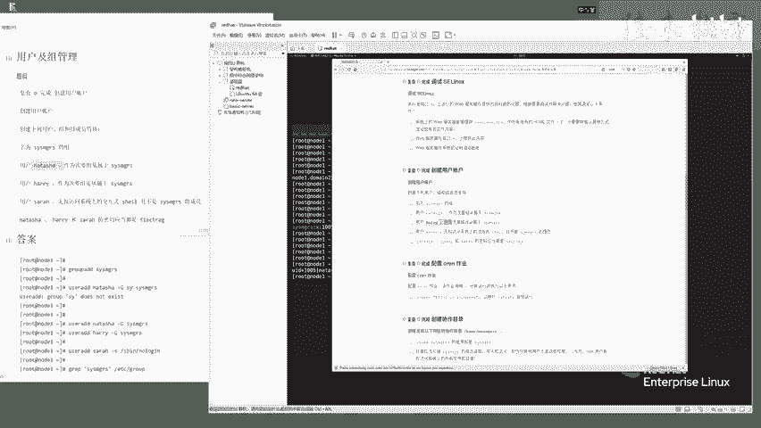

```bash
useradd harry -G sysmgrs
id harry
```

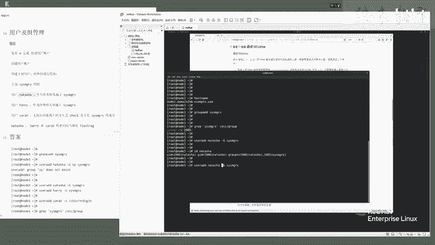

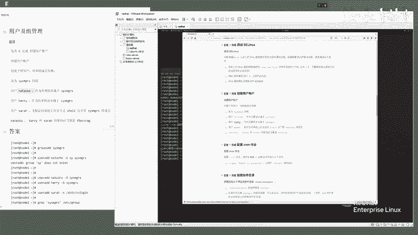

## 创建无交互式Shell访问权限的用户

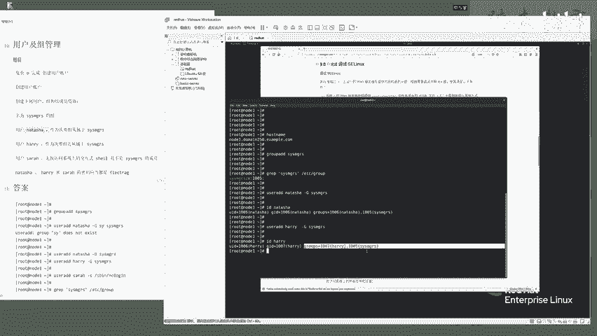

第三个任务是创建用户 `sarah`，该用户无权访问交互式Shell，并且不属于 `sysmgrs` 组。这可以通过在创建用户时指定一个特殊的Shell解释器来实现。

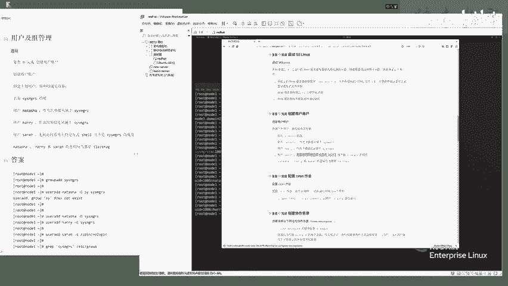

在Linux中，`/sbin/nologin` 是一个特殊的Shell，它会阻止用户进行交互式登录。

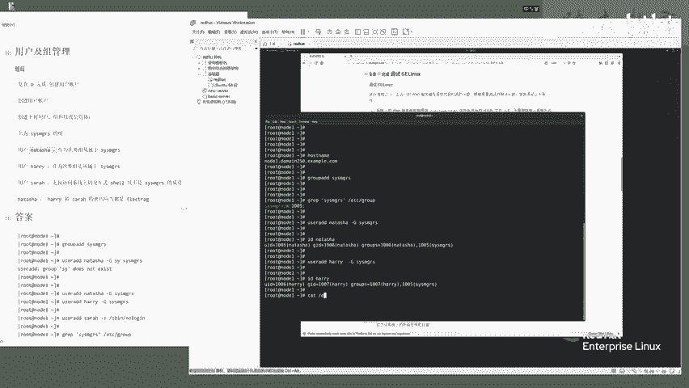

以下是具体操作步骤：

1.  使用 `useradd` 命令创建用户，并通过 `-s` 参数指定其Shell为 `/sbin/nologin`。
    ```bash
    useradd sarah -s /sbin/nologin
    ```
2.  使用 `id` 命令和 `grep` 命令验证用户信息。
    ```bash
    id sarah
    grep sarah /etc/passwd
    ```
    验证结果应显示 `sarah` 不属于 `sysmgrs` 组，且其Shell字段为 `/sbin/nologin`。

## 为用户设置统一密码

最后一项任务是为 `natasha`、`harry` 和 `sarah` 三个用户设置统一的密码 `flectrag`。我们可以使用 `echo` 命令结合管道符 `|` 和 `passwd` 命令的 `--stdin` 参数来非交互式地设置密码。

以下是具体操作步骤：

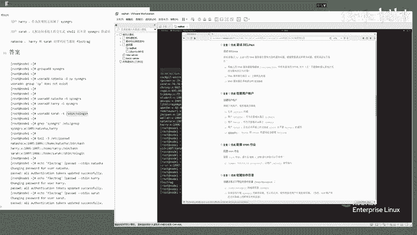

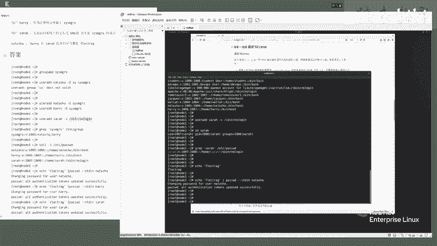

1.  为 `natasha` 用户设置密码。
    ```bash
    echo “flectrag” | passwd --stdin natasha
    ```
2.  为 `harry` 用户设置密码。
    ```bash
    echo “flectrag” | passwd --stdin harry
    ```
3.  为 `sarah` 用户设置密码。
    ```bash
    echo “flectrag” | passwd --stdin sarah
    ```
    每条命令执行成功后，终端会显示 “passwd: all authentication tokens updated successfully.” 的提示。

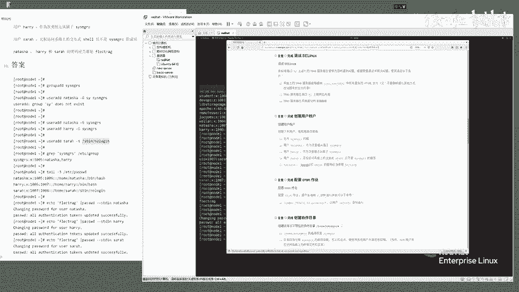

## 验证用户登录权限

所有操作完成后，我们可以通过SSH登录来验证用户的权限设置是否正确。

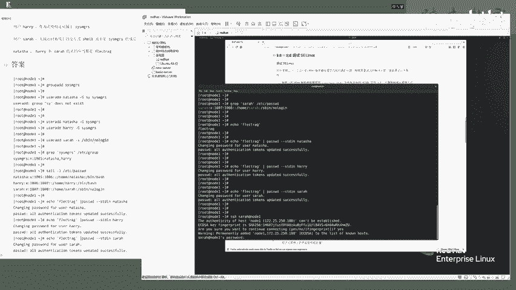

以下是验证步骤：

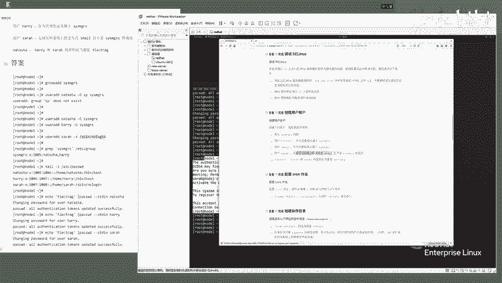

1.  尝试使用 `sarah` 用户登录。由于该用户的Shell被设置为 `/sbin/nologin`，登录将会失败。
    ```bash
    ssh sarah@node1
    # 输入密码 flectrag 后，会收到类似 “This account is currently not available.” 的提示。
    ```
2.  尝试使用 `harry` 用户登录。该用户拥有正常的Shell，应该可以成功登录。
    ```bash
    ssh harry@node1
    # 输入密码 flectrag 后，可以成功登录。使用 `whoami` 命令确认当前用户。
    ```
3.  同样地，`natasha` 用户也应该可以正常登录。
    ```bash
    ssh natasha@node1
    # 输入密码 flectrag 后，可以成功登录。
    ```

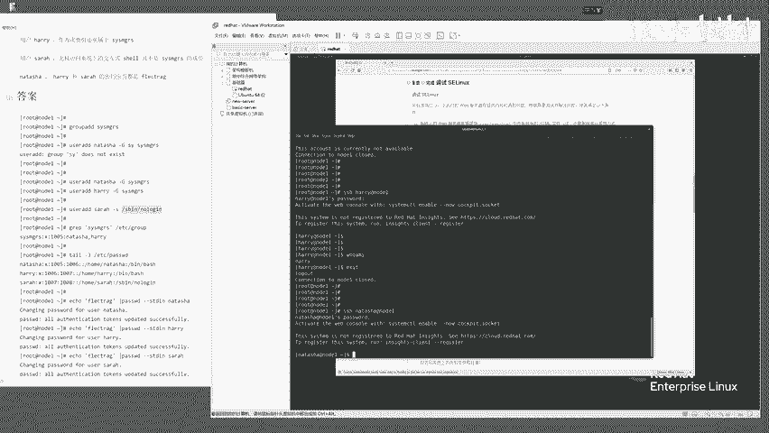

---

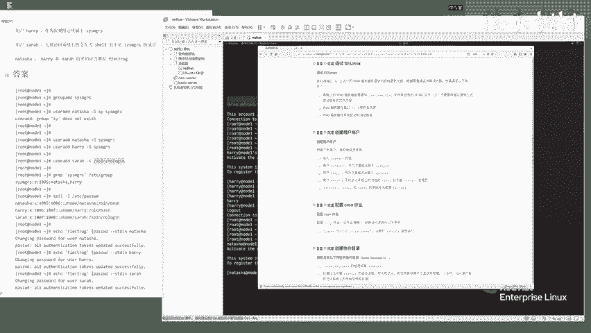

本节课中我们一起学习了Linux用户和组管理的基础操作。我们掌握了如何使用 `groupadd` 创建组，使用 `useradd` 创建用户并指定附加组（`-G`）或登录Shell（`-s`），以及如何使用 `echo` 和 `passwd --stdin` 非交互式地设置用户密码。最后，我们通过SSH登录验证了不同用户的权限配置。这些是系统管理员日常工作中必须掌握的核心技能。