# Linux红帽认证教程：6-00：RHCE考试要求查看 🔍

在本节课中，我们将学习如何查看和准备RHCE考试环境。我们将了解考试系统的启动流程、关键配置信息以及考试过程中的重要注意事项。

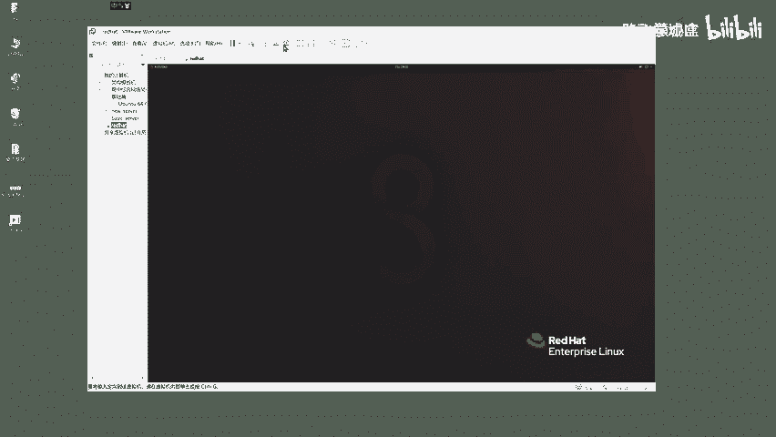

上一节我们完成了RHCSA的考核，本节中我们来看看RHCE的考试环境。

## 环境准备与启动

首先，你需要使用提供的红帽考试练习镜像。以下是启动考试环境的步骤：

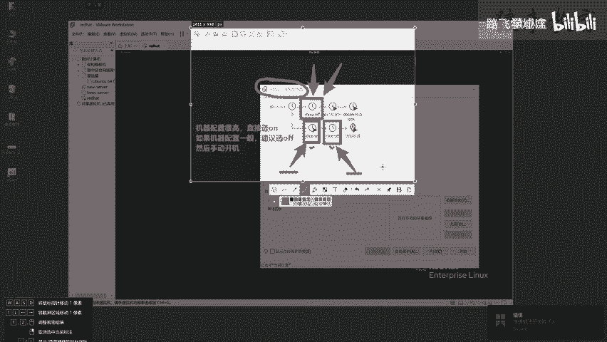

1.  在虚拟机管理界面，点击扳手图标选择虚拟机。
2.  你的机器上应存在三个虚拟机快照。RHCSA的考核镜像已不再使用。
3.  RHCE考试有两个快照选项：
    *   `RHCE on`：基于开机状态的快照。
    *   `RHCE off`：基于关机状态的快照。
4.  机器配置高可直接选择`RHCE on`；配置一般建议选择`RHCE off`然后手动开机。
5.  选择`RHCE off`快照并点击“是”进行恢复。
6.  恢复完成后，点击“开启此虚拟机”。

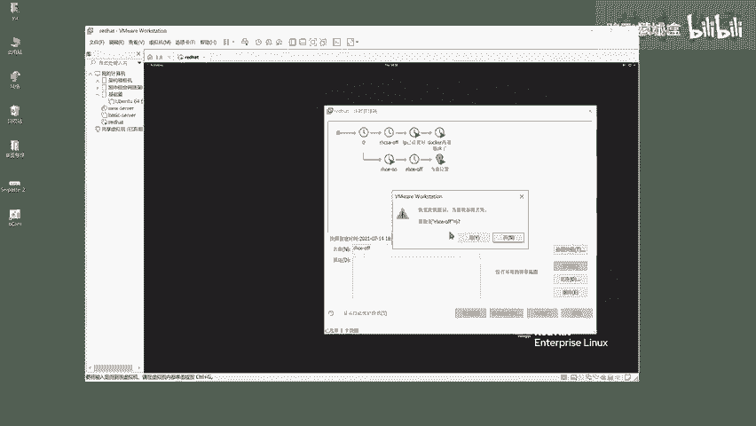

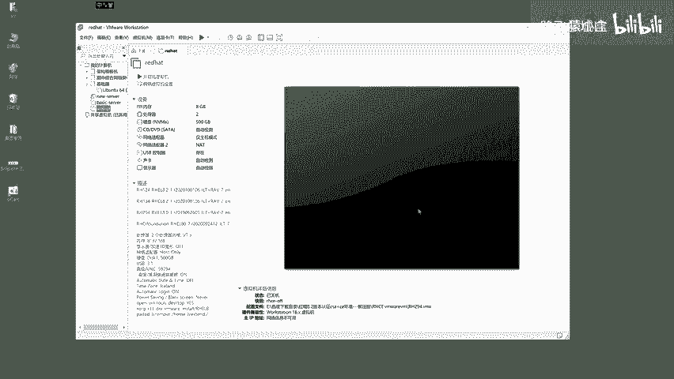

这个过程模拟了在实际考试环境中启动物理考试机。启动后，即可查看考题并逐一解答。


## 考试界面与系统概览

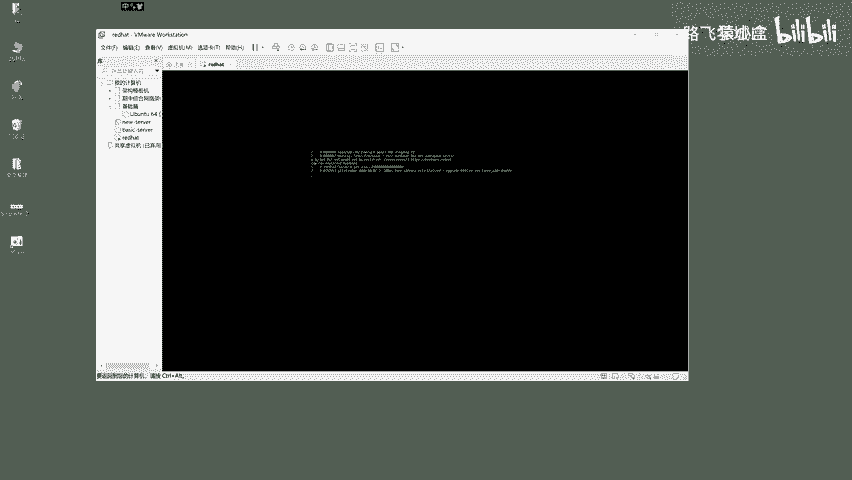

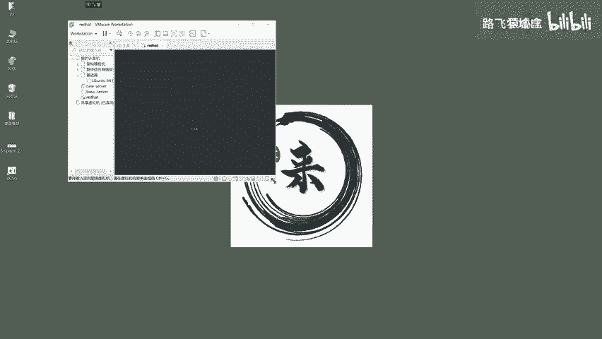

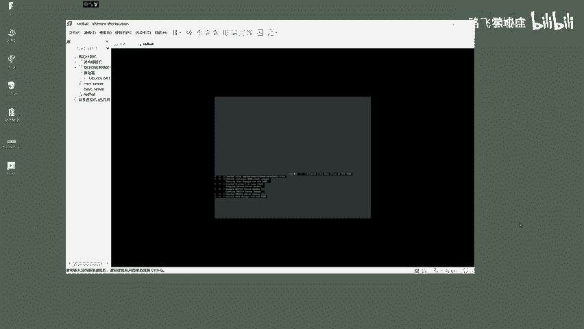

启动后，系统将进入红帽的图形化Linux界面。

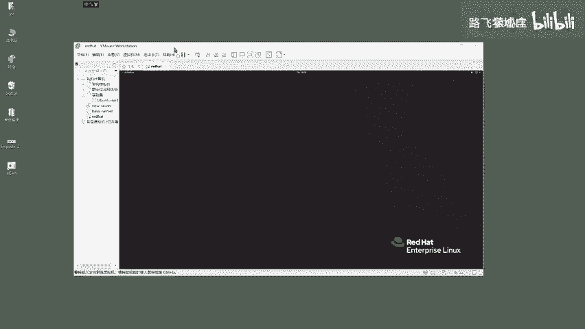

1.  点击左上角的“Activities”标签。
2.  首先选择`View Exam`来查看考试题目。
3.  考试题目界面会显示所有考题和重要的配置信息。

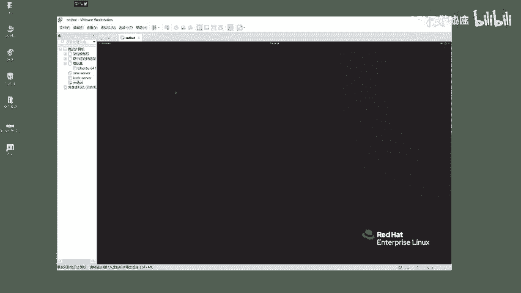

考试期间，除了你操作的台式机（即当前系统），还会使用多个虚拟机。你没有台式机的root权限，但拥有虚拟机的完整root权限。

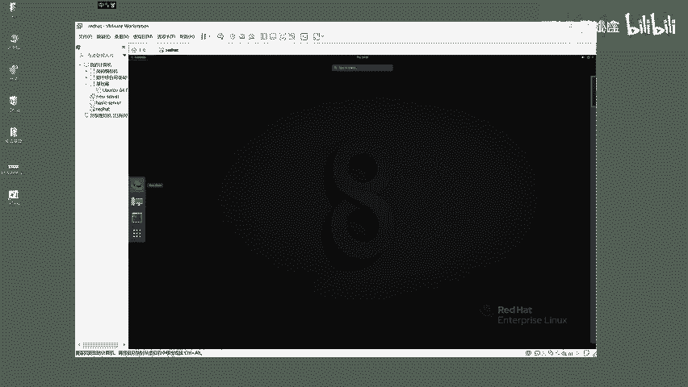

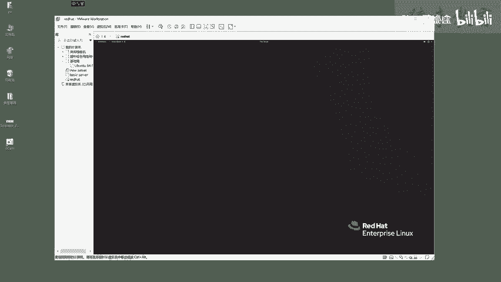

当前你看到的系统就是考场中的台式机。点击“Activities”标签下的`Terminal`，在此终端中操作的就是这台考试台式机。

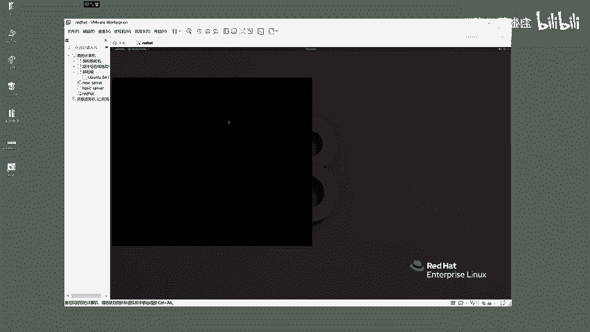

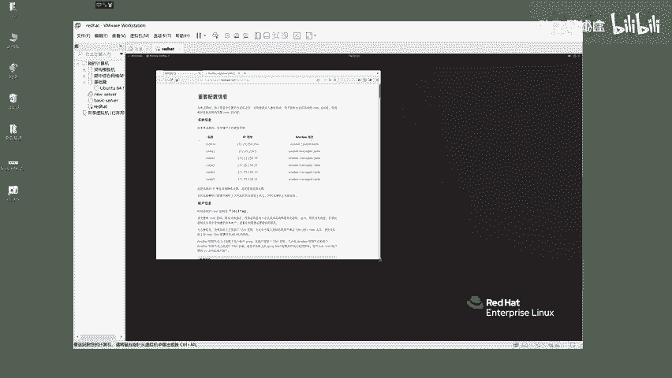

## 虚拟机管理

考试提供了多台虚拟机供你使用。以下是管理它们的方法：

1.  点击“Activities”标签，选择第二个选项`VM Control`。
2.  界面会提供6台机器（node1至node5，以及control）供你管理。
3.  选择任意节点（如node3），点击OK。
4.  下一步可以选择对该机器进行开机、重启、关机或打开控制台（Console）等操作。
5.  打开Console后，会进入该虚拟机的命令行登录界面。

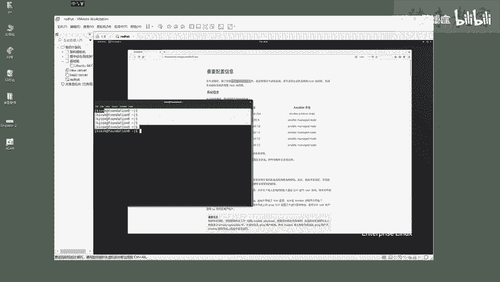

此外，在考试台式机的终端中，你可以输入命令 `virt-manager` 来打开虚拟机管理界面，查看所有考试虚拟机的运行状态（如运行中或关机）。

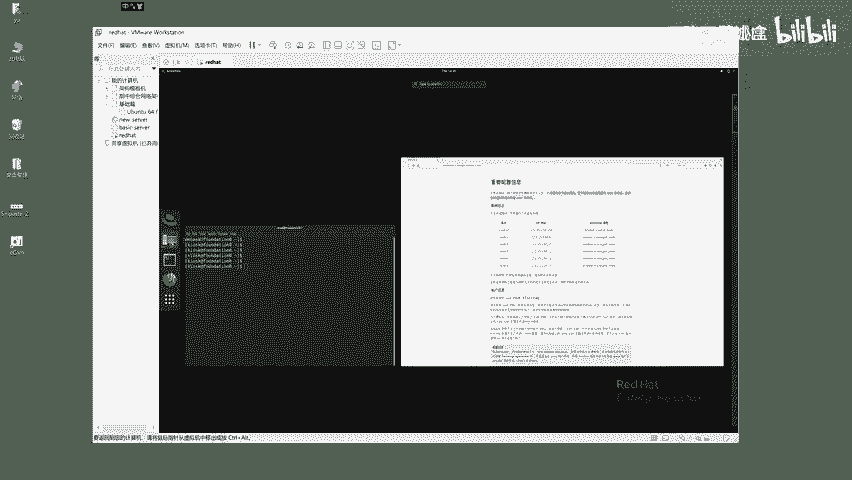

**重要提示**：这些系统的IP地址和主机名均已静态设置完毕，请不要修改。

## 账户与访问信息

以下是系统的账户信息：

*   所有系统的root账户密码均为 `redhat`。
*   你可以使用SSH从管理机连接到其他节点。例如，连接node2的命令是：
    ```bash
    ssh root@node2.lab.example.com
    ```
*   连接成功后，输入密码 `redhat` 即可登录。使用 `exit` 命令可以退回到考试台式机。

**核心考试原则**：在考试中，只操作题目明确要求的事项。任何额外的操作都可能导致失分。

## Ansible管理框架

RHCE考试大量考察SSH协议原理和Ansible批量管理工具的使用。

为了方便考试，所有系统默认已配置好SSH密钥。考试中，你将通过一台“管理节点”使用Ansible来管理其他“被管理节点”。

请注意一个关键用户：`greg` (g-r-e-g)。题目可能在此设置细节考察点，请勿误认为是 `grep` 命令。

**重要路径与权限要求**：
除非题目另有指定，你所有操作生成的Ansible剧本、配置文件和主机清单文件，都必须保存在管理节点的 `/home/greg/ansible` 目录下。
并且，这些文件的权限必须属于 `greg` 用户。所有的 `ansible` 或 `ansible-playbook` 命令都需要以 `greg` 用户身份在管理节点上执行。

## 其他系统配置

考试环境还有以下预设配置：

*   考试机器的防火墙默认不启用。
*   SELinux处于强制（Enforcing）模式。
*   其他资源（如样本仓库、配置文件等）将根据具体题目提供。

## 评分机制

在最终评分前，你的被管理节点（即Ansible操作的目标机器）会被重置到初始状态。
评分时，考官会在你的管理节点上执行你编写的Ansible剧本，并检查被管理节点是否被成功修改为题目要求的状态。
你的得分将基于此评分结果。

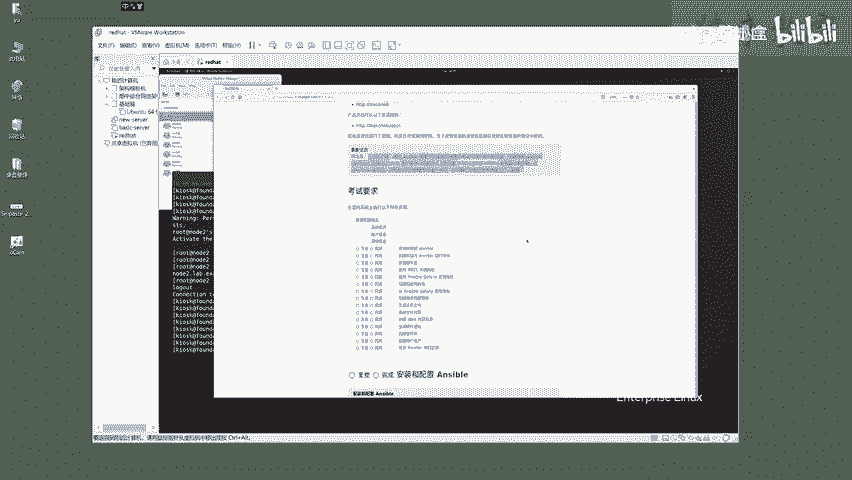

本节课中我们一起学习了RHCE考试环境的查看与启动方法，理解了考试系统的架构（包括台式机与多台虚拟机），明确了关键的用户账户、Ansible工作目录及权限要求，并掌握了考试的评分机制。这些是顺利开始RHCE实操考试的基础。接下来，我们将逐一攻克考试题目。