# Linux红帽认证教程：8-02：创建和运行Ansible临时命令 🚀

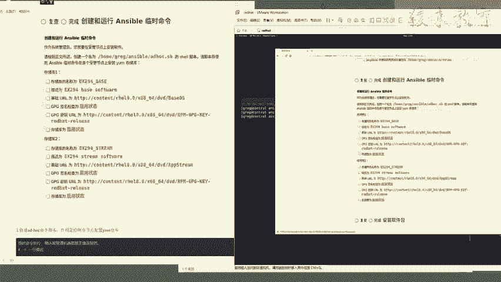

在本节课中，我们将学习如何使用Ansible的临时命令（ad-hoc）来执行自动化任务。我们将通过一道具体的RHCSA/RHCE考试题目，学习如何编写一个Shell脚本，该脚本包含Ansible临时命令，用于在目标主机上配置YUM软件仓库。

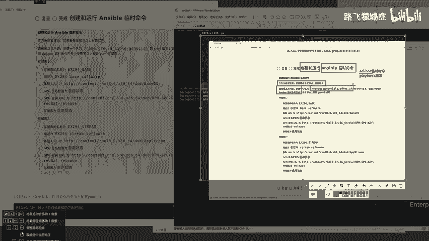

---

## 概述

Ansible有两种主要的使用方式：临时命令（ad-hoc）和剧本（playbook）。本节重点介绍临时命令，它是一种通过命令行快速在远程主机上执行单个任务的方法。我们将通过一个实际例子，学习如何创建一个脚本，使用`yum_repository`模块来配置指定的YUM仓库。

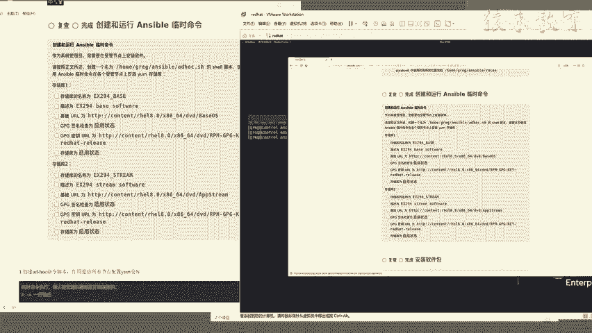

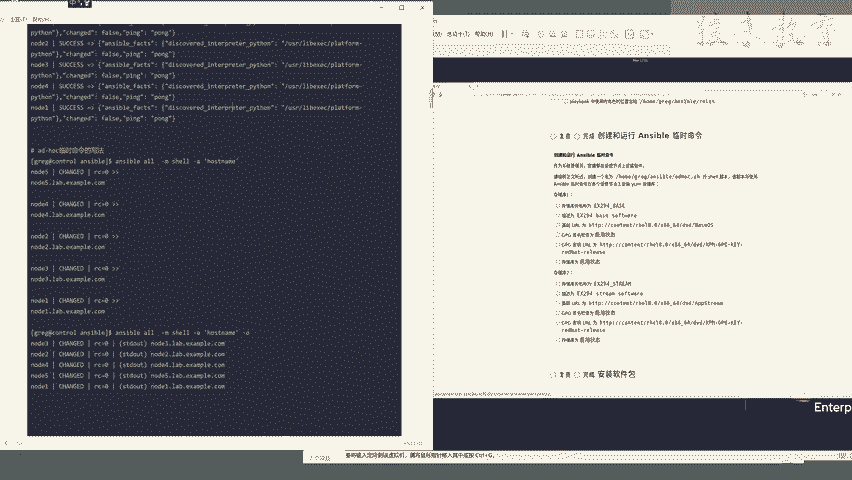

---

## Ansible临时命令基础

上一节我们介绍了Ansible的基本概念。本节中我们来看看如何使用临时命令。

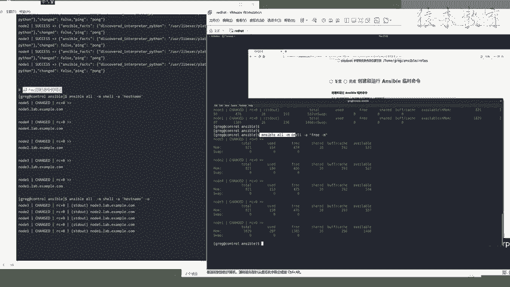

临时命令的基本语法是：
```bash
ansible <主机模式> -m <模块名> -a "<模块参数>"
```
*   `<主机模式>`：指定要操作的主机或主机组，例如 `all` 表示清单中的所有主机。
*   `<模块名>`：指定要使用的Ansible模块。
*   `<模块参数>`：传递给模块的具体参数。

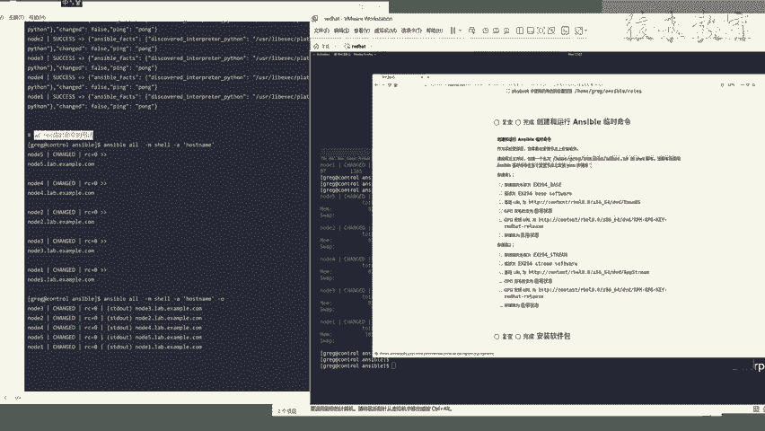

例如，查看所有主机的主机名：
```bash
ansible all -m shell -a "hostname"
```
或者，查看所有主机的内存使用情况：
```bash
ansible all -m shell -a "free -m"
```

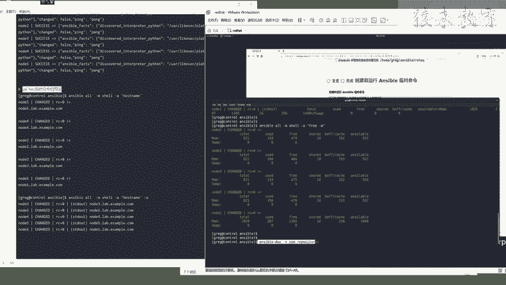

---

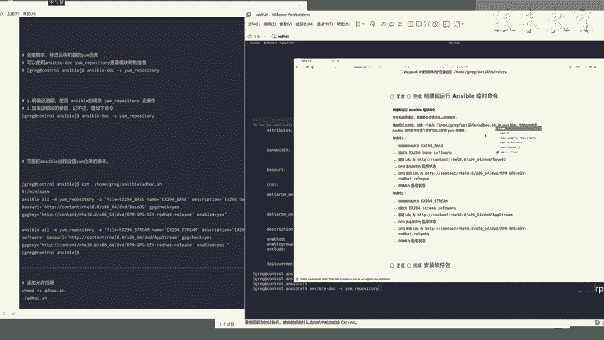

## 题目要求分析

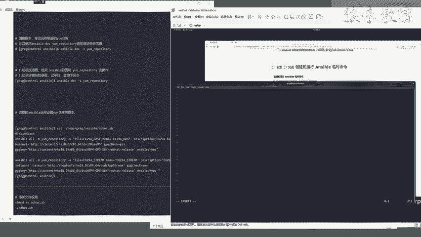

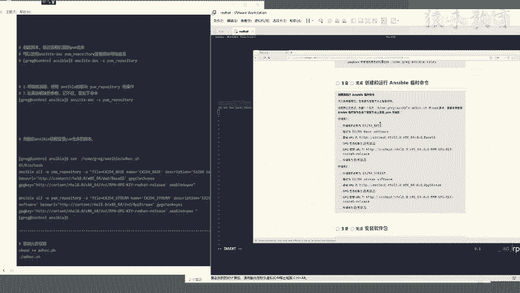

现在，我们来看具体的考试题目要求。题目要求我们创建一个Shell脚本，该脚本使用Ansible临时命令在所有被管理主机上设置两个特定的YUM仓库。

以下是题目的核心要求：
1.  创建一个Shell脚本。
2.  脚本内容为Ansible临时命令。
3.  使用`yum_repository`模块配置两个仓库。
4.  每个仓库需要配置名称、描述、基础URL、GPG检查以及GPG密钥URL等参数。

---

## 关键模块：yum_repository

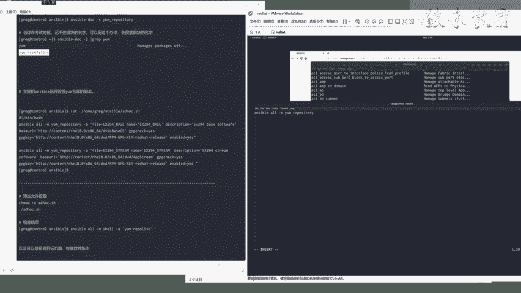

要完成配置YUM仓库的任务，我们需要使用`yum_repository`模块。在编写命令前，可以先查看该模块的帮助文档以了解可用参数。

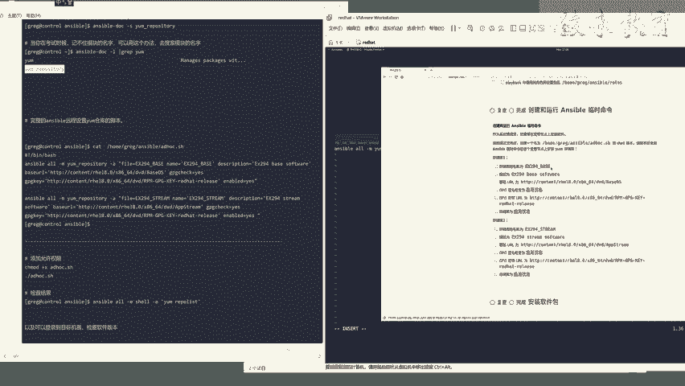

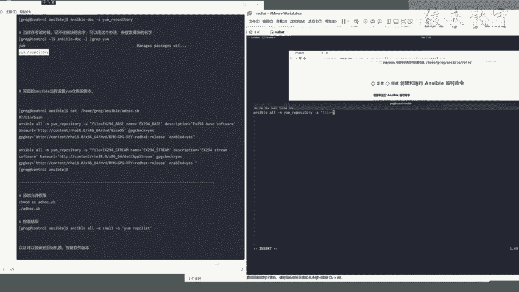

查看模块帮助的命令是：
```bash
ansible-doc -s yum_repository
```
这条命令会列出`yum_repository`模块的所有参数及其说明，例如`name`（仓库ID）、`description`（描述）、`baseurl`（基础URL）、`gpgcheck`（GPG检查）和`gpgkey`（GPG密钥URL）等。

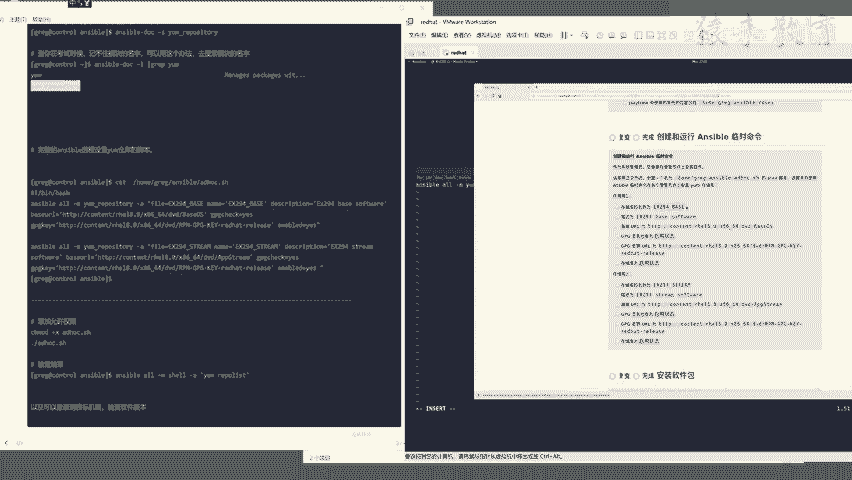

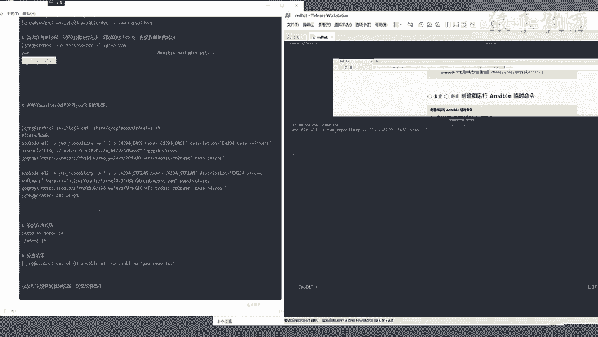

**考试技巧**：如果在考试中记不清模块名或参数，可以使用`ansible-doc -l | grep <关键词>`来搜索相关模块。

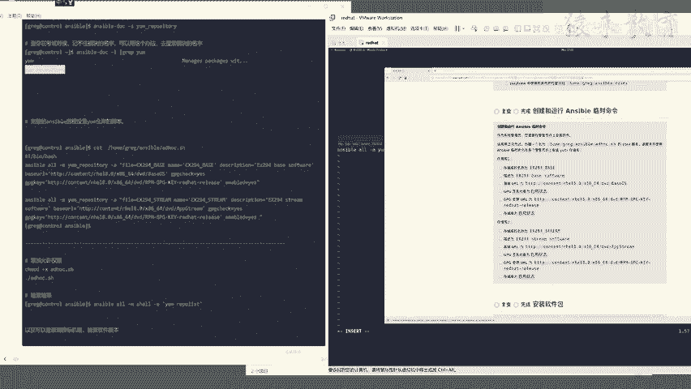

---

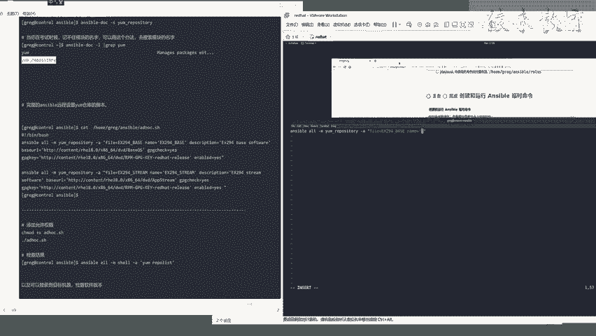

## 编写Shell脚本

根据题目要求，我们需要创建一个名为`/home/greg/ansible/adhoc.sh`的脚本。

以下是脚本内容的构建步骤，我们将逐条解释每个参数的作用。

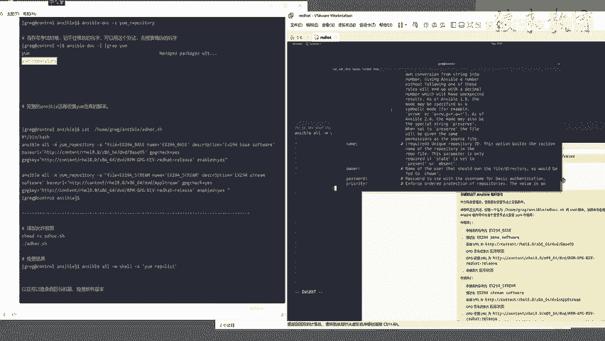

首先，使用`vim`或其他编辑器创建并打开脚本文件：
```bash
vim /home/greg/ansible/adhoc.sh
```

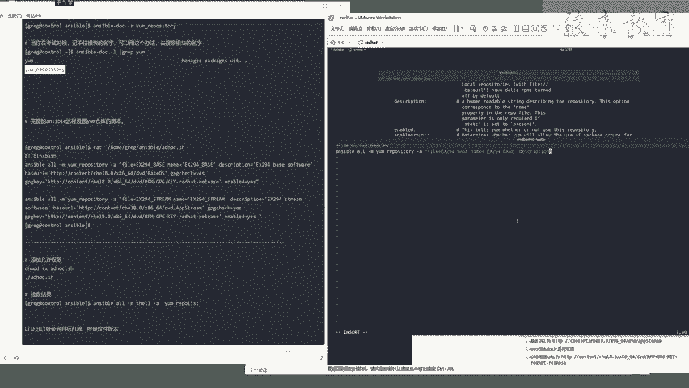

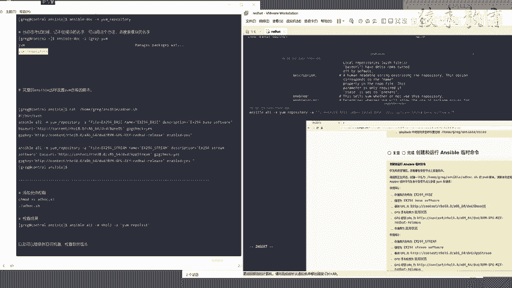

### 配置第一个仓库

第一个仓库的配置要求如下：
*   仓库文件名为 `ex294-base.repo`
*   仓库ID/名称为 `ex294-base`
*   描述为 `Ex294 base software`
*   基础URL为 `http://content.example.com/rhel8.0/x86_64/dvd/BaseOS`
*   启用GPG检查
*   GPG密钥URL为 `http://content.example.com/rhel8.0/x86_64/dvd/RPM-GPG-KEY-redhat-release`
*   仓库状态为启用

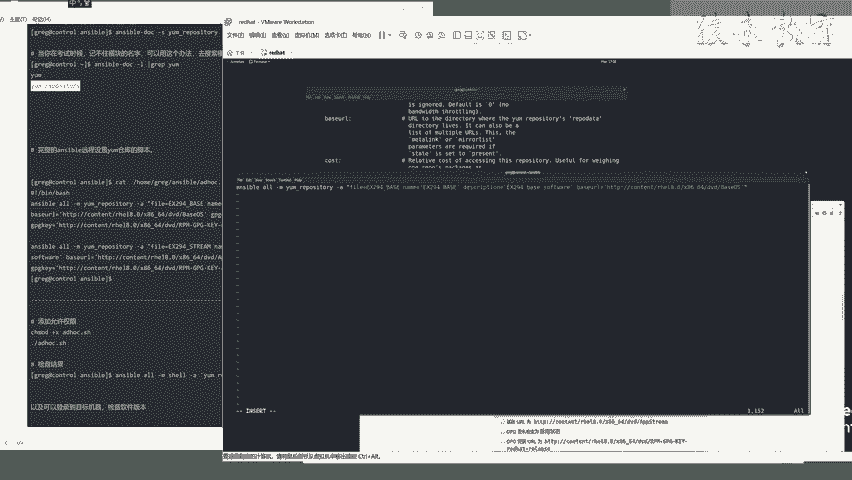

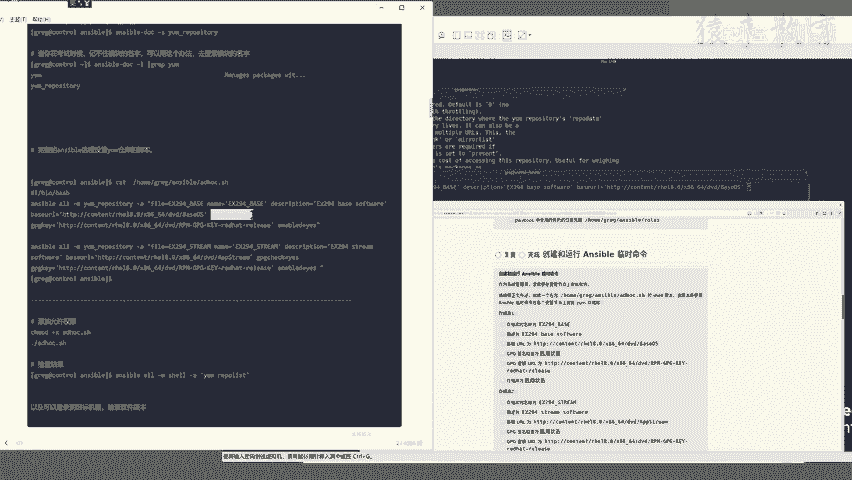

对应的Ansible临时命令为：
```bash
ansible all -m yum_repository -a "file=ex294-base name=ex294-base description='Ex294 base software' baseurl='http://content.example.com/rhel8.0/x86_64/dvd/BaseOS' gpgcheck=yes gpgkey='http://content.example.com/rhel8.0/x86_64/dvd/RPM-GPG-KEY-redhat-release' enabled=yes"
```


**参数解释**：
*   `file`：指定生成的仓库配置文件名称。
*   `name`：仓库的唯一ID。
*   `description`：仓库的描述信息。
*   `baseurl`：软件包的实际获取地址。
*   `gpgcheck=yes`：启用GPG签名验证以保证软件包来源可信。
*   `gpgkey`：指定用于验证的GPG公钥地址。
*   `enabled=yes`：启用此仓库。

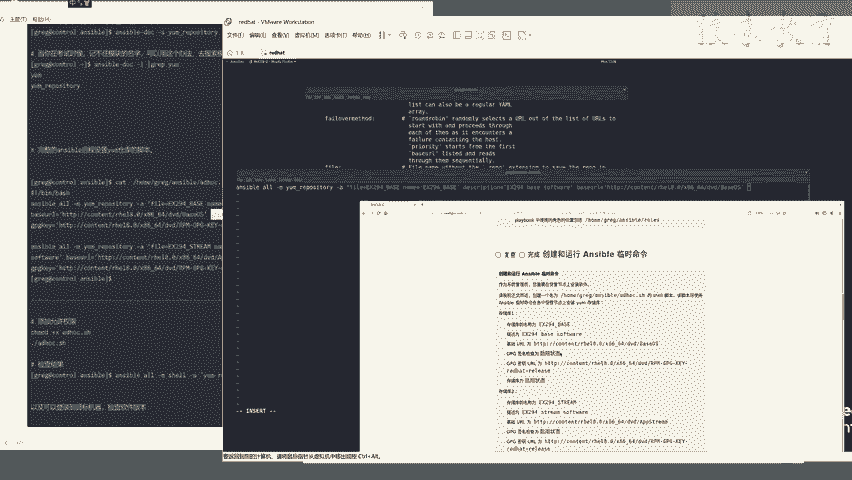

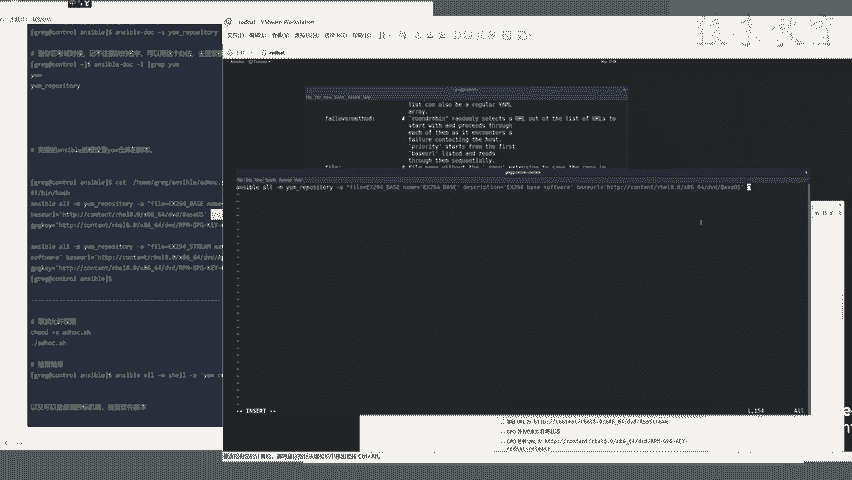

### 配置第二个仓库

第二个仓库的配置要求如下：
*   仓库文件名为 `ex294-stream.repo`
*   仓库ID/名称为 `ex294-stream`
*   描述为 `Ex294 stream software`
*   基础URL为 `http://content.example.com/rhel8.0/x86_64/dvd/AppStream`
*   启用GPG检查
*   GPG密钥URL为 `http://content.example.com/rhel8.0/x86_64/dvd/RPM-GPG-KEY-redhat-release`
*   仓库状态为启用

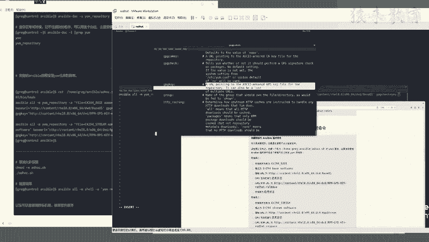

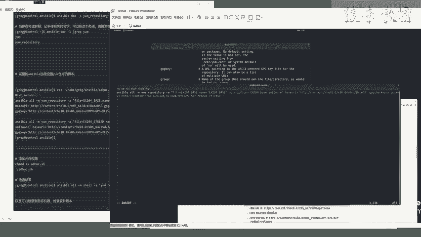

对应的Ansible临时命令为：
```bash
ansible all -m yum_repository -a "file=ex294-stream name=ex294-stream description='Ex294 stream software' baseurl='http://content.example.com/rhel8.0/x86_64/dvd/AppStream' gpgcheck=yes gpgkey='http://content.example.com/rhel8.0/x86_64/dvd/RPM-GPG-KEY-redhat-release' enabled=yes"
```

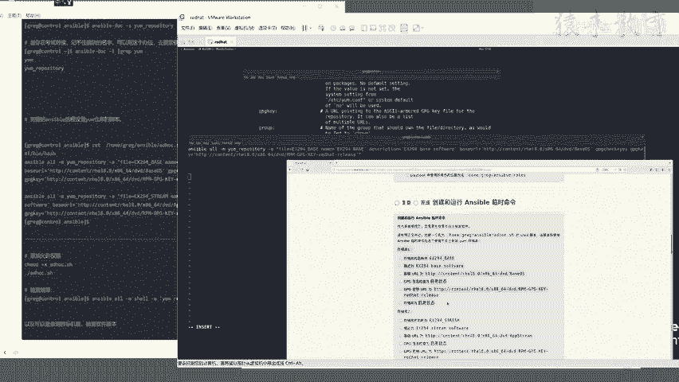

将这两条命令依次写入`/home/greg/ansible/adhoc.sh`脚本文件中，并保存退出。

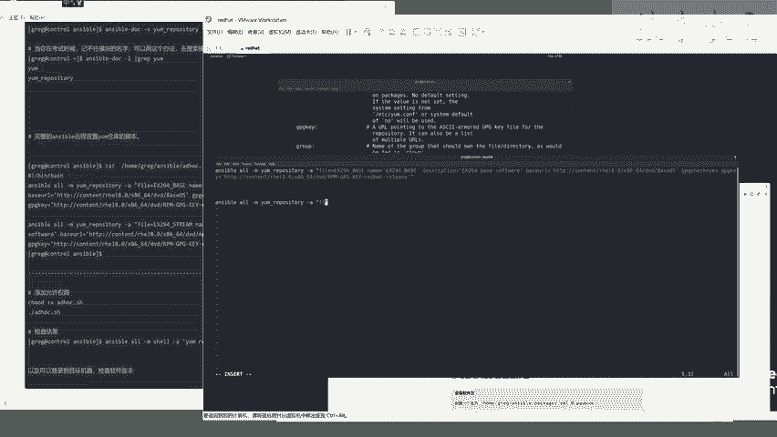

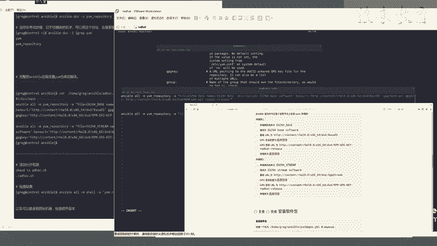

---

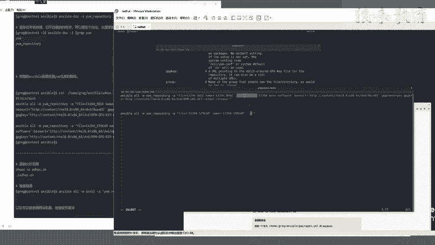

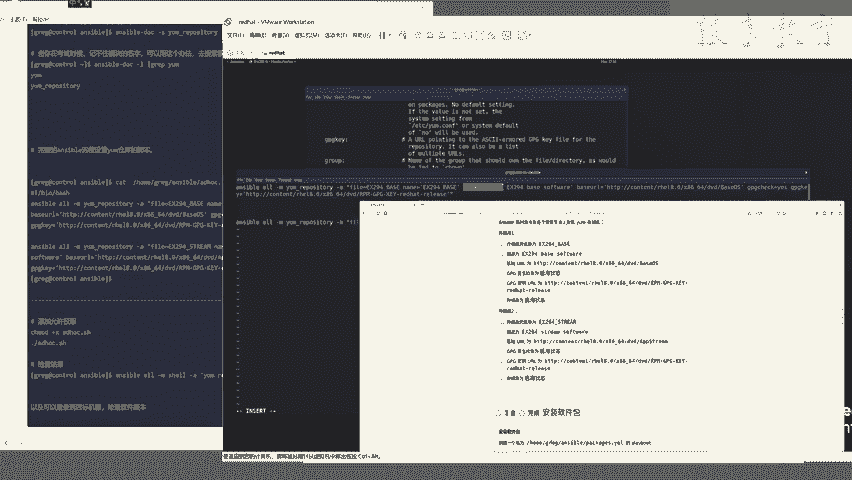

## 执行脚本与验证

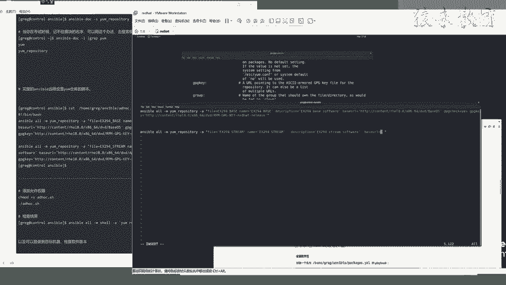

脚本编写完成后，需要执行它以应用配置。

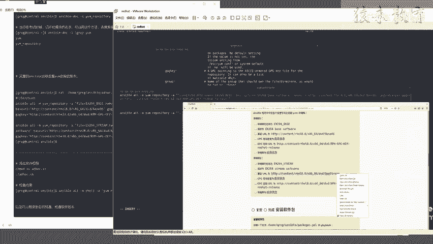


1.  **执行脚本**：
    在命令行中运行以下命令来执行我们编写的脚本：
    ```bash
    sh /home/greg/ansible/adhoc.sh
    ```
    执行后，Ansible会连接到所有目标主机并配置指定的YUM仓库。

2.  **验证结果**：
    为了确认配置是否成功，我们可以使用另一个Ansible临时命令来检查所有主机上已启用的仓库列表：
    ```bash
    ansible all -m shell -a "yum repolist"
    ```
    如果配置成功，输出中应该能看到名为 `ex294-base` 和 `ex294-stream` 的仓库。

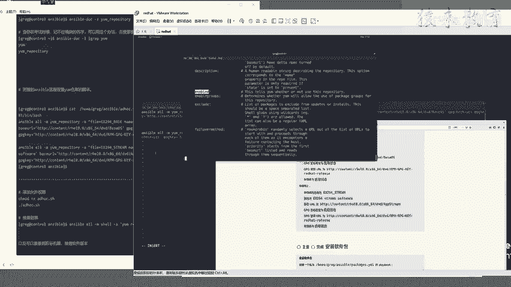

---

## 总结

本节课中我们一起学习了Ansible临时命令的用法。我们通过一道实践题目，完整经历了分析需求、查找模块帮助、编写包含复杂参数的临时命令脚本、执行脚本并验证结果的过程。

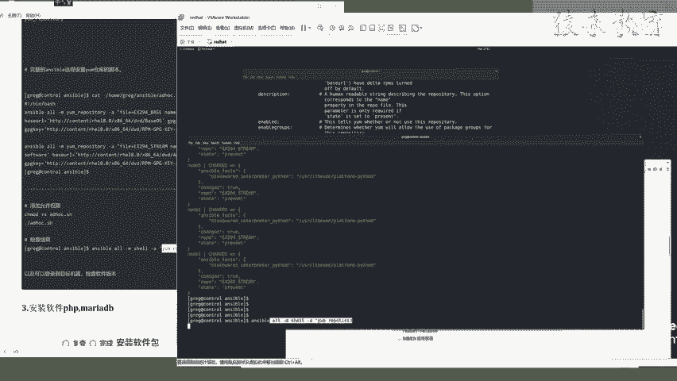

关键点总结：
1.  Ansible临时命令适用于快速执行单一任务。
2.  `yum_repository`模块用于管理YUM仓库配置。
3.  编写脚本时，需仔细对应题目要求的每个参数。
4.  执行后务必进行验证，确保任务成功完成。

掌握临时命令是使用Ansible进行自动化运维的基础，也是红帽认证考试中的常见考点。