# Linux红帽认证教程：9-03：安装软件包 📦

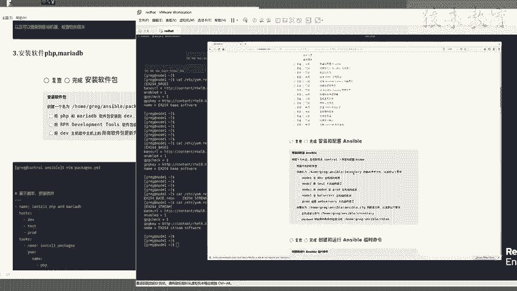

在本节课中，我们将学习如何使用Ansible剧本（Playbook）来安装和更新软件包。这是RHCE认证考试中的一个重要环节，要求我们能够编写YAML格式的剧本，并针对不同的主机组执行特定的软件管理任务。

上一节我们介绍了如何配置Yum仓库，本节中我们来看看如何利用这些仓库来安装和管理软件包。

---

## 任务分析

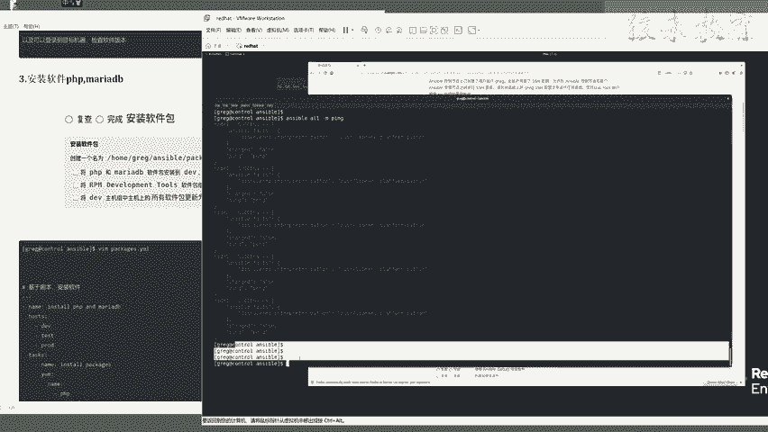

本次任务的核心目标是编写一个Ansible剧本，完成以下三项要求：
1.  在 `dev`、`test` 和 `prod` 主机组上安装 `php` 和 `mariadb` 软件包。
2.  在 `dev` 主机组上安装 `rpm-development` 工具包组。
3.  将 `dev` 主机组中的所有软件包更新到最新版本。

这些任务具有连贯性，如果之前的Yum仓库配置不正确，将无法成功安装软件包。

---

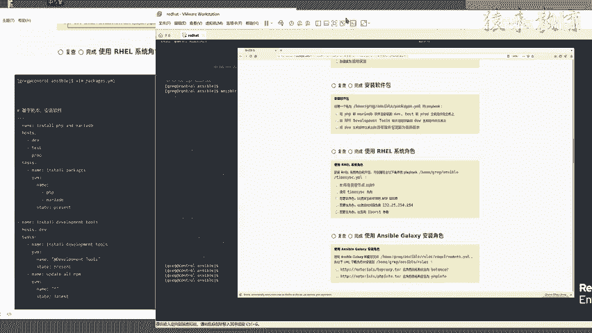

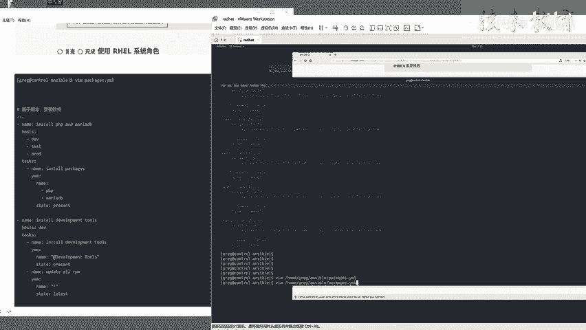

## 准备工作

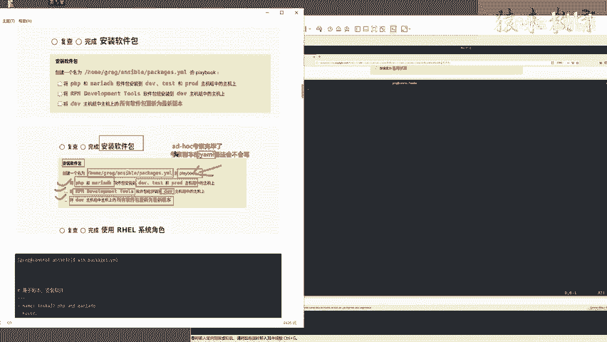

在执行任务前，需要确认两点：
1.  **工作目录**：所有操作必须在 `/home/greg/ansible` 目录下进行，因为Ansible会读取该目录下的 `inventory` 主机清单文件。
2.  **仓库状态**：确保之前配置的Yum仓库已生效。可以使用 `ansible all -m yum_repository -a "list=all"` 命令验证。

---

## 编写剧本

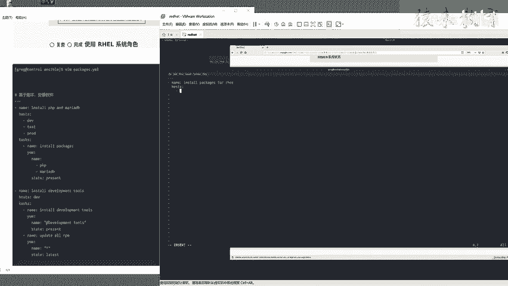

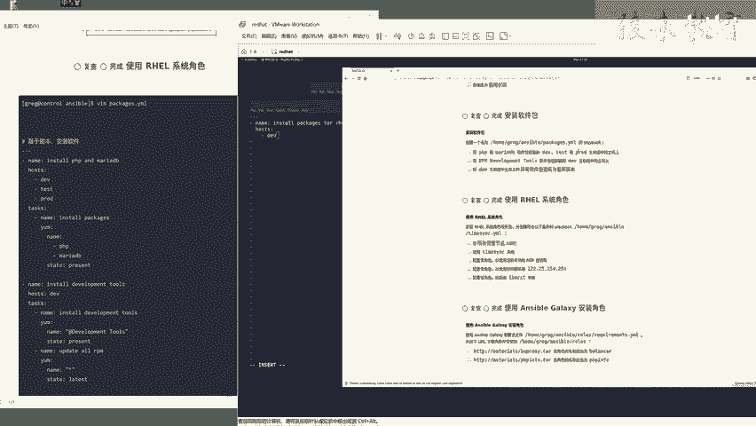

剧本文件位于 `/home/greg/ansible/packages.yml`。我们将按照任务要求，逐步编写YAML内容。

以下是剧本的完整结构和解释：

```yaml
---
- name: Install packages for RHCE
  hosts: dev,test,prod
  tasks:
    - name: Install php and mariadb
      yum:
        name:
          - php
          - mariadb
        state: present

- name: Install and update packages for dev group
  hosts: dev
  tasks:
    - name: Install development tools
      yum:
        name: "@development tools"
        state: present

    - name: Update all packages
      yum:
        name: "*"
        state: latest
```

**核心概念解析：**
*   **`---`**：YAML文件的开头，表示这是一个文档。
*   **`name`**：剧本或任务的描述性名称。
*   **`hosts`**：指定该剧本或任务在哪些主机组上执行。多个主机组用逗号分隔。
*   **`tasks`**：定义要执行的任务列表。
*   **`yum`模块**：Ansible中用于管理RPM软件包的核心模块。
    *   **`name`**：指定软件包名称。安装包组时，需要在名称前加 `@` 符号，例如 `"@development tools"`。使用 `"*"` 表示所有软件包。
    *   **`state`**：定义软件包状态。
        *   `present`：确保软件包已安装。
        *   `latest`：确保软件包已安装，并且是最新版本。

---

## 验证与执行

剧本编写完成后，建议先进行语法检查，然后再执行。

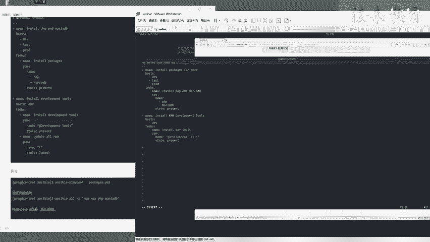

1.  **语法检查**：使用 `ansible-playbook packages.yml --syntax-check` 命令。如果输出没有报错，则语法正确。
2.  **执行剧本**：使用 `ansible-playbook packages.yml` 命令执行剧本。执行过程会显示每台主机的任务执行状态（`CHANGED` 或 `OK`）。

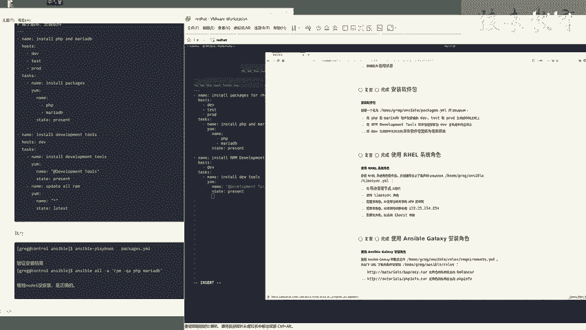

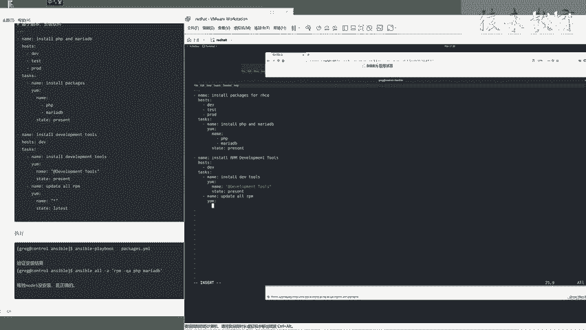

---

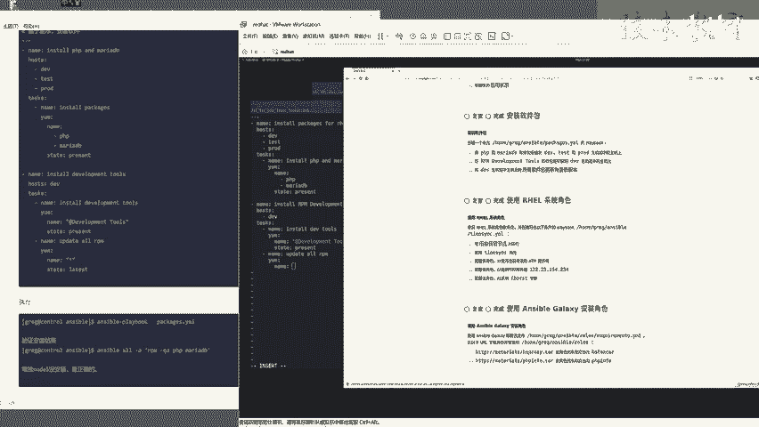

## 任务验证

剧本执行成功后，需要进行验证以确保任务按要求完成。

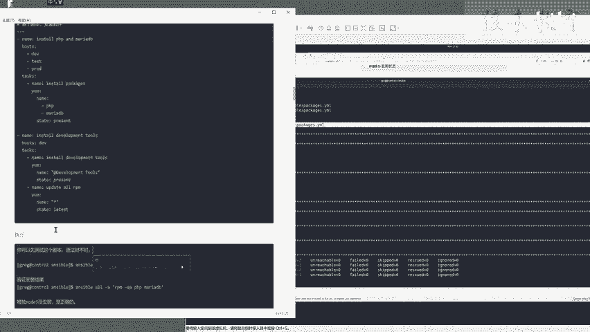

以下是验证各项任务是否成功的命令：

1.  **验证 `php` 和 `mariadb` 安装**：
    ```bash
    ansible dev,test,prod -m shell -a "rpm -qa | grep -E 'php|mariadb'"
    ```
    此命令会在 `dev`、`test`、`prod` 组的所有主机上检查是否安装了相关软件包。

2.  **验证 `development tools` 包组安装**：
    ```bash
    ansible dev -m shell -a "yum grouplist | grep -i development"
    ```
    此命令会在 `dev` 组主机上检查是否安装了开发工具包组。

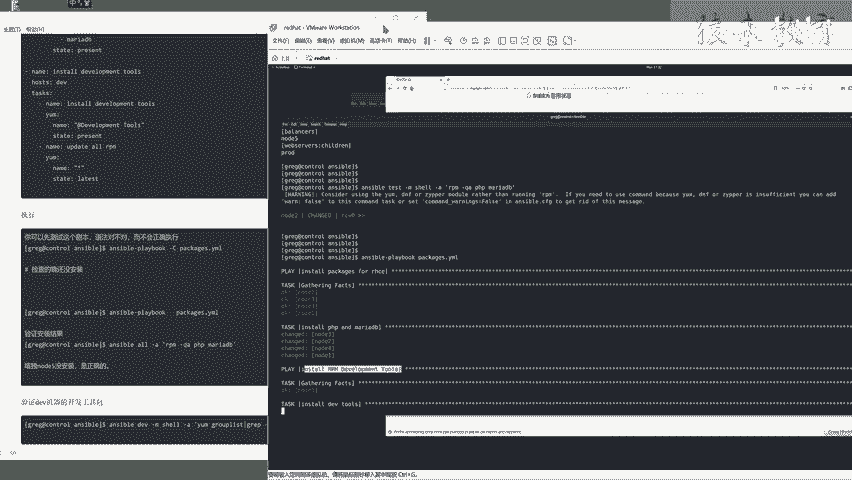

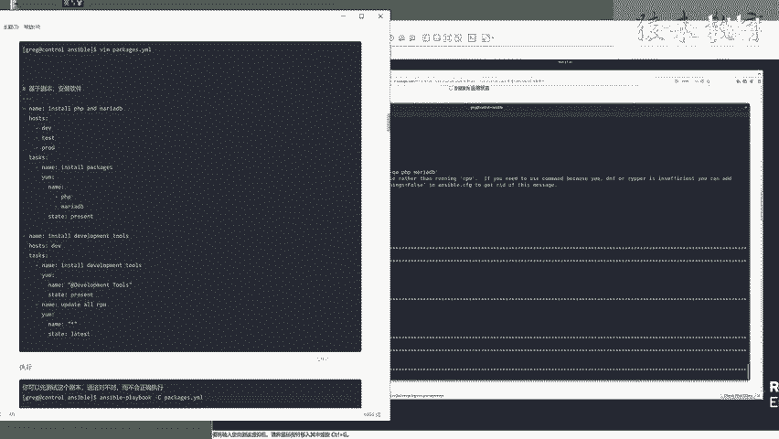

---

## 总结

本节课中我们一起学习了如何编写一个结构化的Ansible剧本来管理软件包。我们掌握了以下关键技能：
*   编写符合RHCE考试要求的YAML格式剧本。
*   使用 `yum` 模块安装单个软件包、软件包组以及更新所有软件。
*   通过 `hosts` 参数精准控制任务执行的目标主机组。
*   在执行前进行语法检查，执行后进行结果验证的良好实践。

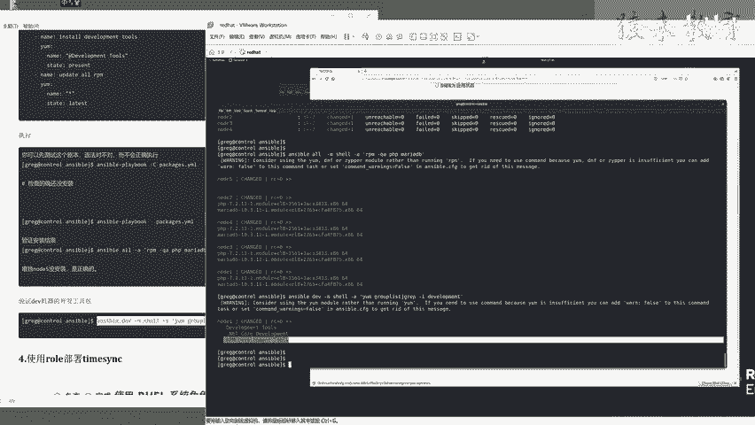

这个任务很好地考察了对Ansible剧本语法、模块参数以及主机模式掌握的熟练程度，是RHCE认证中的典型实操题。