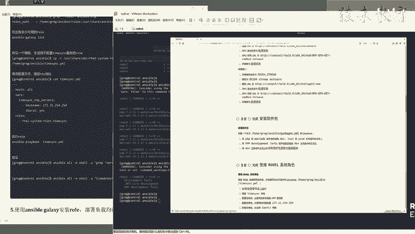

# Linux红帽认证教程、RHCSA、RHCE、RHCA认证【可预约考试】 - P10：10-04 使用rhel角色 - he_nio - BV1Db41197cx

好了同学们，我们呢再来看下一题，下一题呢是要求啊他的这个练习啊又升级了，你看啊他这道题是让你用临时命令，下一题呢让你去安装啊，用usb进去远程的安装软件包，升级到了让你去写playbook，写剧本对吧。

那么这道题呢要求你去使用红帽的一个系统，默认的一个角色，说白了还是安server的一个啊，自动化安装的一个剧本对吧，但是要求让你去使用系统自带的一个，决策功能啊。

你看首先使用红帽提供的answer ver决策，然后你要看好啊，来继续带着大家分析一下，这道题呢要求你去安装红帽的一个系统，角色软件包，而且根据如下要求去创建这么一个ym文件。

所以说这道题啊意思是让你先去装软件，然后呢再复制一份，生成一个题目要求的一个，关于n t p时间设置的一个剧本就行了，然后设置如下参数去修改你的这个剧本，没问题吧，很简单了啊，当然它是指的是角色啊。

来角色呢就是有规章制度目录分啊，目录峰哥的一个这个复更复杂的一个剧本，可以吧，好那么你看啊，第一个要求是要求在所有的机器上执行，那么关于剧本操作的一个主机组，那肯定就是all了，而不是某一个主机组对吧。

那么下一个使用的是，也就是你去安装一个红帽系统角色软件包，要求的是你使用time think这么一个角色，你去拷贝他的一个压码文件是吧，第三个要求配置决策使用当前有效的nt p。

也就是人家提供给你提供好了，这么一个角色日啊，提供好了这么一个n t p的服务器地址好吧，然后还要加上关于n t p的一个同步参数，所以说这就是这道题的一个分析，那么具体怎么做呢，啊来咱们看好啊。

首先按照提要求啊，你呢是使用ctrl这台机器一定要使用对了啊，然后下一个answer ball杠ping，你一定要确保，或者说啊你你你让他们来杠m share杠a host name。

你让他们返回主机名给你啊，是在操作之前，先确保你的ctrl控制节点和这些被管理的节点，是通的是通信的好吧，下一个根据提议，安装红帽的一个系统角色软件包，它的名字呢来yin store，名字叫做这个啊。

来叫做什么呢，i h e r也就是红帽系统system rose这个软件包啊，这个名字你给他记住就行了，然后呢安装，好了，这里呢是complete，装完了对吧，这个呢就把第一个要求系统的一个角色。

红帽的系统角色软件包给它装好了，装好了之后呢，下一步啊也就是题目中要求啊，要求你使用来咱们看一下pdd，这是我们题目要求的home rug，answer ver的一个目录，对不对。

l l你这是不是指定了一个rose一个角色目录啊，对吧，你要确保你的answer ver，点cfg里面有一个rose杠pass，你要确保啊看一下这里啊，默认的一个目录啊。

rose pass角色目录默认只有他，你现在在干嘛呢，加上你安装的这个红帽系统角色的啊，来带着你看一下，你就理解了第一个啊，咱是不是装了一个红帽提供的一个决策软件包，对吧。

第二个呢来l s u s r share answer b rose，你看一下，你安装了刚才这个h e r system rose这个软件啊，它自动给你生成了这么多这么多，这个系统自带的角色，明白吗。

所以说你呢要把这个目录啊给它加到哪呢，加到红帽的一个啊，加到这个看一下，l l l加到这个answer word cfg配置文件中，他才能够去调用它，所以说先把这个目录啊给他拷贝一下，你看啊。

就是你安装了红帽系统角色有哪些角色呀，关于时间的内存崩溃机制的邮件的sa，linux的time sink，你看是不是找到time think这个角色了呀，所以说来先把这个目录啊给他拷问一下。

打开user的配置文件怎么加呢，只需要在rose pass这个结尾啊加个冒号，把你安装的系统决策呀路径写在这儿就可以了，然后呢，你可以利用answer ver gun galaxy这个命令list啊。

列出当前answer可用的角色走，你你看有多少，第一个是home rug and sorrose，这是我们自己生成的这么一个rose目录，对不对，你看里面啥也没有，所以说这啊就显示空的没有。

而我们装的红帽系统角色这个目录中啊，你看是不是有这么多角色让你去试啊，对不对啊，所以说啊来到这儿啊。

咱们是操作完了，下一步呢，根据题目要求生成一个你自己的time seeya，但是你这里面内容咋写啊，内容就是啊你只需要去拷贝就行了，usr share来拷贝。

usr share doc目录下有一个h e r system rose。

里面有一个time sin，来里面有一个example time think playbook。

加上ym特雷布点压码。

你给他考哪儿呢，考到你题目要求的这么一个文件上，可以吧，来拷贝完了呢，咱们就l r看一下，当前是不是就有了一个时间同步的，一个压门儿来，你可以打开它，看一下里面的默认就是host。

你要给哪些机器去修改它的时间服务呢，按照提要求啊，你看你来看是不是所有受管节点呀，那你是不是应该在这啊，把这个配置文件改成or就行了呀，然后玩其他的东西改什么的，改时间服务器说白了不就是指定一个地址嘛。

对不对啊，来把它默认的这些删掉，滴滴滴滴滴滴滴滴滴滴滴滴好了，留下一个谁呢啊，来系统自带的这些不要了，注意了啊，host name冒号后面有个空格啊，把人家题目给你的这个啊时间服务器地址诶。

给它写在这儿好吧，其他你看i boost这个参数默认就是yes or了，然后具体用哪个rose去操作目标机器啊，他这里啊是先定义了一个变量，然后去执行这个系统自带的一个time sink角色啊。

它就会自动执行里面所有的压码，去设置时间服务器了，对不对啊，来所以说保存退出在cat看一下。

没问题吧，到这儿我们这道题啊，就是配置是配置好了，但是你你一定要执行，你明白吧，他虽然说没有告诉你，你要去改了，配置文件要执行啊，你想这道题考察的是什么呀，最终他就是检查所有被管理机器是否正确。

设置了时间服务器的地址啊。

所以说你一定要执行一下，朋友们知道吧，来走，那你看他现在操纵的哪些机器啊，是不是操作的node 12345所有机器啊对吧，你看他现在在干嘛呀，自动的安装这个chony时间服务，安装n t p对吧。

然后呢哎去设置nt p改配置文件啊，就这些事，这就很方便了啊，如果说你要是自己去设置时间服务器的话，诶啊这里啊它是由于还没同步，所以说这里会有一些报错啊，咱们等一等就好了，好了明白吧，看见吧。

他时间这个同步同步上了之后啊，最终结果就正确了。

没问题吧，最后呢咱们可以去验证一下，来怎么验证呢，先去啊，叫检查，检查目标被管理机器的配置文件是否指定了啊，题目要求的n t p地址，先用这么第一条命令是吧。

or利用grab命令啊去找这个crowning这个服务，看一看它是否指定了题目要求的一个254，点254这个时间服务器。

你看node 12345台服务器是不是都加上了呀。

并且有结尾的时间服务的一个，i boost的这么一个参数对吧，没问题啊，好你也可以用这条命令啊，来用这条命令走，这条命呢就是去检查远程机器的，这个叫系统的时间同步啊。

是否是yes，你看都是激活的，所以说咱们这道题啊，叫做使用h e r系统角色设置时间服务器的啊。