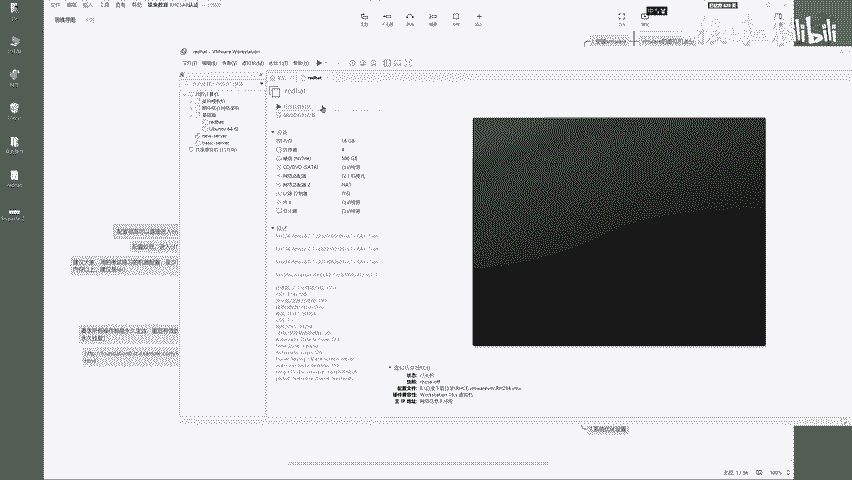
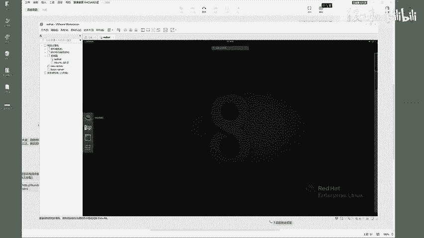
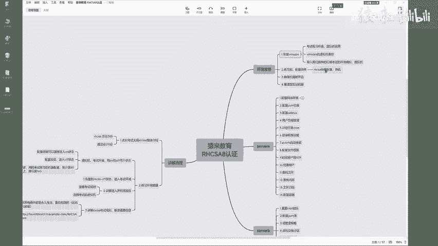
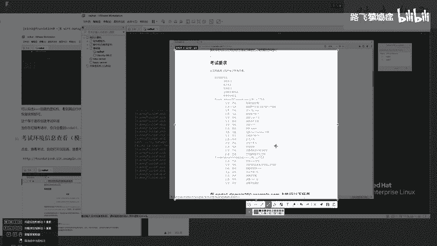

# Linux红帽认证教程、RHCSA、RHCE、RHCA认证【可预约考试】 - P1：1-01 Rhcsa考试环境讲解 - he_nio - BV1Db41197cx

Hello，同学们大家好，我们这一集呢带着大家来看一看，红帽的一个CSA初级认证，他的一个考试的环境准备，可以吧，呃在呃我们呢会给大家提供好一个，红帽考试的一个虚拟机的一个环境啊。

就是让你去模拟真实考试中的，一个机器的一个系统啊，所以说呢你要第一步去安装一个VML，来打开你的外面就长这样啊，啊我们呢会把微米尔的一个安装包，以及啊，这个红帽考试的一个系统的虚拟机的文件。

全部发给大家，然后大家呢只需要去把这个系统啊，导入到外面里面就行了啊，这个都是基本功。

然后呢，你在导入之后就会像我一样。

存在这么一个画面啊，这就是你的一个虚拟机了，来在这个虚拟机虚拟机呢啊。

呃我们有两个就是给大家提供好的一个快照，你看一下啊，点击这个当前这个虚拟机，点击他的一个扳手，这个扳手里面呢有rh cs杠off关机的一个状态，以及r h c e on和r h c e off两个状态。

为什么要这样去做拍照呢，啊，首先啊，我们会先从红帽的一个初级考试题来练习，所以说我们会用这个CSA这个系统的一个备份，大家呢只需要拿到你的机器，点击这个啊，看见没，就这个csgo off。

点击转到就行了，点击是，你就可以进入到这个CSC的一个考试环境了，明白吧，那当你以后去考试啊，做这个C练习题的时候，我们有on和off两个状态，一个说白了就是直接进入到开机的一个画面。

一个是进入到关机的画面，需要你自己主动的再去开机啊，这两个状态其实都是。

因为要看你的机器配置怎么样，你的机器配置很高，你就直接进入到on开机画面，如果说你的机器配置有点低啊，那你可能会这个跑不起来。

建议你可以先进入这个off关机的状态，然后自己再手动的点击开机OK吧，所以说呢咱们就点击这个呃CSAGUO，你可以点转到恢复这个CSA的一次考试环境，OK然后我们就点击开启开启此虚拟机。

给它放在这里就行了，来我们呢啊整个的CSA考试题啊有这么多，它分了两大块啊，第一题啊，第二题，第三题我们呢会一题一题的带着大家去过，把这个题目给他刷一遍啊，那这样呢你在考试的时候啊。

就是已经很轻松很轻松了，OK好，所以说呢再说一遍，你先装微面，然后把我们的这个红帽系统导入进去，然后恢复拍照，OK吧，会叫练习前，你要恢复一个快照，咱们啊，今天是带着大家去部署这个rh cc的。

一个快照恢复啊，然后开机对的吧，来咱们点击这边二好，我这边就已经开机了啊。

这很明显，就是一个红帽操作系统的一个图形化界面，并且咱们是基于最新的红帽八的一次考试环境，OK吧。

进来之后呢，你看哈进来这他有这几个选项啊，叫查看考试环境，第一个这个红帽子下面就是这个vm control。

就是他的一个虚拟机啊，也就是你看到的这个画面就等于什么呀，等于模拟你坐在那个考试的环境中，那个物理机的环，物理机的系统，明白吧，你考试呢其实还是在这个虚拟，就是在这个系统中的一个虚拟机里面。

怎么玩呢，来点这个啊，来点一下，你看点击这个左上角这个小标签active。

点击这个VMCTRL。

看见吗，点完了之后，它就会出现这么一个选项，他们提供了啊。

我们在考这个CSA的时候。

它会有两个，就是它提供了两个机器啊，这两个机器叫做虚拟机啊，提供了这两个虚拟机让你去用来，咱们先看第一个点击来再再来一遍哈，点击这个激活。

点击左下角这个，你可以你也可以先点这个红帽子叫view exam。

打开它看一下它会出现什么啊。

它会出现一个浏览器，让你看见什么呀，看见整个考试的所有的要求，所有的题目大家能看明白吧，这就是cc啊会涉及的所有题目啊，来咱们把这个考试要求啊先给他打开，先放在这，你看哈。

呃来咱们一个一个的说他说重要的配置信息。

咱们这一节就带大家看一看，这个环境怎么去搭建。

首先哈再再说一遍，你是不是要先把你的微面装好。

导入我们的一个虚拟机，然后把这个环境给它跑起来。

把这个系统考试环境给他抛起来，明白吧，下一步呢就是啊。

你肯定是要恢复cc的一个快照啊，来最终呢你就点击左上角这个标签。

点第一个这个红帽子就能够看到考试要求了，来我们带着大家看一看啊，说在考试期间呢，除了您做的这个台式机之外，你还会使用多个虚拟系统，也就是说你现在用的这个东西啊，它等于是那个物理机啊。

就是那个台式机的系统啊，那考试环境其实用的是虚拟系统。

怎么玩呢，来点这点这个VMCTRL第二个看见吗，点一下他这出现了两个节点。

Node 1node2，这是你考试会用到的两个虚拟机，你点第一个啊，点一下看见吗，点OK然后呢他就提供了这么多的选项，让你去选择是开机还是重启，还是啊这个这个打开它的一个控制台，明白吗。

那到这里呢来你可以怎么玩啊，朋友们哈，来你可以在这啊。

继续点击这个左上角这个激活的按钮，然后点击这个terminal。

看见吗，点一下这个terminal意思是啥呢，意思是你所用的这个等于你，你你在教室做的那个台式机，它的一个控制台。

明白吧，来进入到这里之后呢。

啊你看一下，进入到这里之后，你可以输出这么一个命令，叫vert manager，表示让你去打开来，叫打开虚拟机的控制台，查看考试会用到的所有虚拟机的运行状态。

OK吧，来再说一遍，朋友们啊，来我把它拆拆掉，点击左上角这个标签。

点击这个第三个叫终端，看见吗。

点一下，最终呢你会进来这么一个画面啊，你可以将它放大一点啊，来放大的快捷键是Ctrl shift加上一个加号，进入到这之后之后，你可以输入vert manager，单词输错了啊，哦这多了一个U啊。

单词输错的话，它就会提示你命令不存在是吧，你可以输出vert啊，杠manager来输出这么一个命令来走，你打开它之后，这条命令运行完了之后，你就能够看到这么一个啊，叫什么呀。

叫rtual machine manager，叫虚拟机的一个管理工具，然后你会发现呢我们这个cs的一个考试环境啊，会用到note1note二两个虚拟系统啊，那虚拟系统的虚拟系统的就在这了，看见没。

Note 1note2，他现在是不是已经是running的一个状态了啊，那这个就不用你去管了。

你要是想对它进行开机关机管理呢，点击左边这个点击这个。

看见没VMCTRL来点一下，出现这个标签之后，你比如说选选择第一个note一点，OK你要是想开机就点第一个start，你要是想关机，你就你就点击这个shut down或者power of，知道吧。

那这个你你别乱点，朋友们啊，来带着你看一下，第四第五个叫console，看见吗，console就表示打开这个虚拟机的一个画面，来点击OK。

大家看是不是就已经看到了，这么一个叫让你去登录的一个画面啊，这个虚拟机和谁对应的，node1就和这个node1对应起来了，大家能明白吧，好这边呢啊，你只需要知道它是开机运行的状态就行了。

然后你就可以给它关掉了，来点击，OK不用管了，好那这个呢咱们也给它就是擦掉吧，也不用管了，好咱们来看考试要求啊，第一个系统信息，现在你做CSA考试会用到note1，note2这两个机器啊。

用到这两个节点，这两个节点现在都是开机的了，他的IP地址，待会你待会儿你需要去做题，给他设置IP地址，现在他还他还是没有的啊，好这是关于网络的信息，咱们再待会待会做题去操作它就行了，来下一步呢啊。

说这个账户信息，node1的密码默认就是这个FLECTRAG，我们呢就会用到它，好往下走啊，其他信息，就是你可以通过你当前用的这个物理机，也就是这个啊，看看见吗，就这个命令行终端可以去SSH。

登录其他的考试系统，比如说刚才的那个note1note2K吧，好咱们继续往下看啊，然后关于一些啊，关于考试环境，人家给你提供的一些这个域名啊，服务器啊什么的啊，你你你咱们在底下做题用到什么。

就带着大家再回过头来看什么，OK吧，来然后呢就是重要的评测信息，说你的系统啊在重新引导之后会进行评测，也就是最终你在这个来，最终呢你在这个note1note二两个虚拟机上做的。

做题的所有的操作会被考官的一个系统，一个检查的一个系统进行重启，你得保证它重启也是生效的，要不然那就没有分了，对不对啊啊好，这个也是咱们待会儿做题，一题一题，带着大家来看的一个东西好。

然后其他的就没什么了，关于这个考试题目啊，咱们看啊，你呢会需要在。

你呢会需要在这个no1这台机器上做这些题，在note2机器上做这些题，所以说它是不是分了两块。

OK吧好了，这个呢就是我们的一个考试环境了。

咱们呢就是看一下哈整个的考题啊。

呃环境搭建我们已经给大家讲完了，你你就是要确保把你的微面跑起来，把这个考试环境跑起来，这两个机器啊，确保它是运行的，下面呢我们就是根据这些题目一题一题的去做。

就没毛病了，能行吗，好关于这个考试环境啊，这个已经讲完了，关于这个考试的题目呢，咱们看一下哈，rh cs a考题呢分两大块，节点一啊，来这边是node1机器，这边是来note2机器，你要分别做的题啊。

这些题呢咱们就待会儿一题一题的，带着大家去过就OK了。

没什么好。