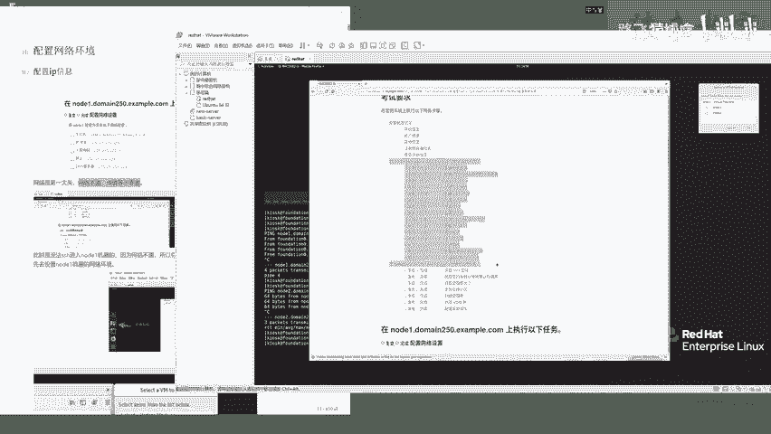

# Linux红帽认证教程、RHCSA、RHCE、RHCA认证【可预约考试】 - P2：2-02 配置node1的网络设置 - he_nio - BV1Db41197cx

好了同学们，我们呢这一节看一下第一题怎么做啊，关于这个cc啊，考试题咱们就把你看从这儿到这儿，是人家这个考试要求，要求你做的所有的题目是吧，来第一题啊，叫做配置网络设置啊。

并且是在node一这台机器上去做的一个设置啊，node一机器它的一个完整的这个主机名叫做他，那你能打开来，大家看啊，我们当前所用的这个环境，它就是一个考试环境，你可以点击它，点击终端啊。

这是你考试机器的一个命令行终端，cat一下etc hosts是你会发现这个机器的，你会发现这个考试机器的一个hosts里面啊，有这些这些ip地址和什么呀，和这些主机名啊，像这个node 1。

你看啊考试呢啊，人家让你用的node一和node 22个机器啊，你看一下node 1 note 2现在是能拼得通的吗，node一你看拼不通对吧，呃由于他写在host host里面。

你ping node一就拼拼到了这个100这个地址，你ping这个note 2他就诶大家会发现什么呀，note 2它是能够拼得通的是吧，所以说你看啊，像这个第一题说在node一机器上执行如下任务。

先把你的node一配置一个网络环境，并且要求按照如下的一个规格啊。

按照这些要求去配置来，咱们先把这个考题啊给它复制下来。

哎就是这个第一题，好这边我已经给大家写好了，第一题咱们看啊，说网络呀是第一大关。

你要是网络不通，那你这个成绩肯定是等于零蛋的是吧，来你你看啊，node一级市场啊，有这么多题呢，你底下这些题呀，你第一步的网络可千万别配错了，配错了。

底下这些题都不生效了，可以吧，来就是你现在呢想去通过ssh去root at node，一想去登录他铁定是不行的，因为刚才我们也看见了，你ping都ping不通，所以说你看端口拒绝了是吧，咱们看啊。

那所以说你没办法通过ssh去连接它，去给它配置这个网络信息，那不可能的，因为你都没办法远程登录，所以说你只能怎么着呀，叫做打开虚拟机管理软件啊，进入node一的控制画面，怎么玩呢。

啊需要大家通过呃这个左上角的一个选项。

点击vm ctrl，然然后呢会出现这么两个选项。

你点击node一看见吗，在这啊点击ok点击这个啊，console node一点击ok，最终呢他就会生成这么一个画面，这个画面就是能够让你去操作node一这个系统的。

进来之后呢，啊来来看一下啊，就是你在这啊可以进入node一的一个虚拟机，没有特殊情况下的话，这些选项啊不要乱点，就选择，最后就是选择这个第五个console。

这个选项没问题吧，然后呢进入到这个画面之后，你可以输入这个账号密码，默认人家给你提供的是什么呀，你看啊，往上走，是不是node一的密码设置为了f l e c t r a g。

ok吧，来你就在这儿啊，点击它r o o t回车，密码默认你是看不见的，别输错了，就行，f l e c t r a g回车来，我们看一下到这儿啊，他是不是就已经进入了，这么一个叫命令提示符了。

就表示你已经成功登录了，没问题吧，来账号密码是root和这个f l e c t r a g好。

进入到这里之后，就表示你能够去操作这台机器了，你看一下a p a d d r秀，你会发现他现在是怎么着呀，来我你我们是想给它解析到什么地址啊，node一给它解析到100这个地址，对不对啊。

那你看他现在给的给的是一个幺零啊，不符合题意，所以说你看往下走，你要去给他ip是100子网掩码，网关dns把这些信息给他设置上去，怎么设置呢，来教大家一个命令，通过这个nm c r i这么这么一个命令。

去操作它就行了，首先呢你可以去看一看，查看这个呃，叫查看网络设置，用nm sci connection show，nm cl，我们点进来啊，nm cli啊，connection show回车。

大家会发现啊，这里呢有这么一个啊网络设备叫device e t h0 。

ok吧，那你呢现在就是要去编辑它，然后给它设置，按照这个要求设置网络信息来用什么命令呢，咱们可以用这个nm c r i，connection modify，modify就表示修改修改谁呢。

修改上面这个呃叫做while connection 1，注意了，要给它加上一个引号啊，来单词别敲错了，connection一啊，先指定这个设备，然后呢给他设置i p v4 啊，这个地址是ipv 4的。

它也支持tab键，如果说你单词记不住，你就i p v4 tab键，你看tab键之后，它就自动的出来了，这么多的信息让你去可以用，那我们是呃来我们呢大家跟着我来敲啊，选择i p v4 。

然后这里有一个method，method，就是要给他设置这个地址信息了，然后ipv 4点address，在输入这个ip v4 点method之后，你要去填入一个值啊，叫mu啊，mu啊。

表示要对他进行管理了，i p v4 点dress，用这个参数后面填入具体的ip地址的值，172。25。250。100，ok吧，来以及呢人家要求的字，网页码是255。2525点。

你呢就在这个ip后面加上一个斜杠，24就行了，到这这个ip地址自动源码就已经ok了，下一个设置谁呢，设置网关用ipv 4点gateway啊，你就用tab键补全就行了，来咱们给它拉长一点啊。

哦他就支持显示这么多啊，字有点小，大家凑合看一下啊，它支不支持放大呀，还支持是吧，诶来放大了，朋友们啊，能看得清楚吧，好到这儿啊，大家看啊，这整个的命令回头大家照着敲就行了。

i p v4 点gateway，就是设置网关地址了，网关呢是172。25。250。254啊，这是网关，咱们还剩下一个什么呀，还剩下一个d n s服务器，继续用这个ip v4 点啊，什么呢。

用dns tab键就行了，172。25。250。254，根据题意去写，自己别瞎写啊，然后最后一个要确保它能够连接，叫自动的开机，自动启用这个网卡叫auto conconnect。

auto connect tab键能够自动补全啊，你能用补全标自己去手敲明白吧，要不然你敲错了，auto connect，yes就行了，回车到这儿啊，就已经配置完毕了，咱们用来给他放小一点啊。

咱们继续用这个ip addr show命令看一下啊，现在还没有生效呢，怎么让它生效呢啊你需要用n m c r i，然后connection up表示去启用它，启用谁呢啊，诶这个名字呀，它也支持tab键。

太好用了，咱们呢就输入一个大写的w tab键，自动的就把这个名字给他，诶，自动的就把这个名字给他敲出来了，ok吧到这儿呢啊你就回车就行了，你看它提示什么呀。

说connection successfully active，说这个网卡已经成功的激活了，咱们i p a d d r诶给敲错了，ip addr show回车，你会发现啊，你这台机器的250。100。

是不是就已经配置成功了呀，到这儿你的这个node一机器啊，第一题就已经做完了，做完了之后，咱们一定要验证一下，怎么验证呢，你可以给它关了啊，来关掉，点击ok这个只是关闭了一个绘画。

不是说把这个机器关机了啊，关了之后，你要确保在你的这个考试的这个机器上，能够去第一个ping得通来走，你你看此时这个250。100，是不是就已经能拼通了呀。

能拼通来ctrl c，以及要确保它能够这个正确的登录ssh root node，一不车诶，输入密码f l e c t r a g不车，来，我们看一下，你现在是不是就是从你的考试的环境。

s s h进入到了这么一个node一级级上来，host内，大家来看啊，哦他这你会发现什么呀，主机名咱们是不是还没改啊，主机名要求改成改成什么呀，改成这个node一这个东西看见吧，来还有下一题啊。

你看进来之后，它默认的主机名叫这个东西，咱们也得改啊，来照着这个笔记啊，进来之后通过host name c t r这条命令去改就行了，来大家看好明确啊，node一点等min 250点exam。com啊。

来我呢就把这个命令啊给大家写好了，大家到时候啊你可以复制粘贴，也可以像我一样在这手敲host name，c t r set host name node一点这个主机名别手敲了，命令你可以手敲啊。

主机名复制粘贴啊，要不然你别写错了，来粘贴走，你ok改完了之后啊，你可以exit退出去，重新的ssh连接进来，f l e c t r a g进来之后，用你的host name命令。

明确看一下这台机器的主机名是否按照题，修改完毕，可以吧，除了这个主机名，咱们挨个检查ip地址啊，你可以用if config看它支不支持也支持ip地址，你看100对吧，斯旺野马net mask。

2525点，ok吧，好网关网关怎么看呢，通过这个来通过root杠n啊，大家会发现root杠n它默认用的gateway，17225250。254，没问题吧，还有最后一个dns服务器。

你呢可以去查看etc resolve这个文件，发现这个文件中的name server，指定的依然是这个考试要求的，250。254能行吗，朋友们好，到这儿啊，你的第一题就已经做完了，做完了之后呢。

啊咱们呃你呢去检查，只需要向我这一边，通过这些命令一步一步的去检查，来到这里好，这个里面啊，它不支持这个输入法，咱们就不说了啊，到这就已经第一题做题完毕啊，然后这边呢啊我呢啊就是我们用的这个机器啊。

它是属于一个呃考试模拟环境，不仅仅是你这个学生，学生一个角度能够去操作这个node一机器。

它呢也是一个考官的一个角度啊，什么意思呢，意思是他这里提供了一个叫exam breed，这么哎咱们看一下啊，us哦，咱们注意了啊，好我现在是不是登录的node一这个机器啊，你注意了，你要退出去啊。

退出去回到这么一个物理机的一个画面，ok吧，然后呢，他这提供了一个叫exam grade的这么一个命令，它其实是一个脚本工具，能够让你去检查每一题的一个这个做题情况啊，说白了就是呃。

叫考官会用这个命令去检查你做题是否正确啊，这里呢咱们就先不去查了，咱们最终啊把node一全部做完之后再去检查它，明白吧，因为它会将你的机器关机好，这个咱们最后再去说它就行了好了，呃。

看一下啊啊这里有个注意事项，就是你在设置网卡的时候，你注意你的网卡名啊，是有特殊字符的，也就是来咱们网上找诶，来咱们继续哦。

咱们已经关掉了是吧，呃再带着大家看一下啊，这个坑要细心啊。

点击vm ctrl，点击node一点击ok来点击这个conso，ok来还是这个画面对吧，你可以点击这个view将它放大呃，放大来再放大ctrl加加诶不对，好了就放就放这么大，差不多了啊，大家看啊。

我我在这边呢写了一个注意事项，是想告诉大家你在做题的时候啊，咱们刚才用的什么命令啊，是不是这个nm c l i啊，connection秀，你会发现这个网络设备的名字呀。

它是有有什么呀，诶这鼠标有点飘啊。

它是有一个空格的，也就是啊你看我的这个第十条命令，你在设置它的这个什么呀，设置它的名字的时候，一定要用引号给它引起来啊，就是我这条命令啊，你你必须是完完全全的复制粘贴的啊，别别写错了。

ok吧好以及呢设置网卡的时候啊，我们每一个命令的前面啊，都是有一个i p v4 的。

ok吧好，那么这第一题啊，咱们就完完全全的给他做完了。

