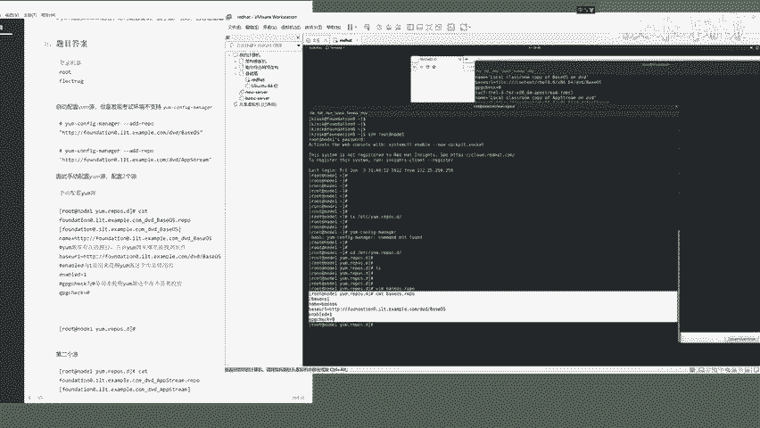
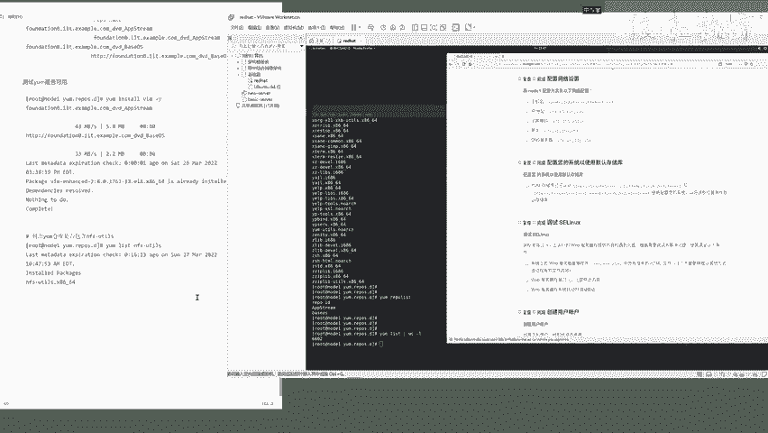

# Linux红帽认证教程、RHCSA、RHCE、RHCA认证【可预约考试】 - P3：3-03 配置默认存储库 - he_nio - BV1Db41197cx

呃来同学们，我们呢再来做这个第二道题，第二道题呢依然是操作node一这台机器啊，题目要求是考察，你会不会给linux设置一个样本仓库啊，说配置您的系统已使用默认的存储库，人家提供给你了两个样本仓库。

ok吧，来这道题的解题思路是什么呢，首先先看一看你的机器啊，它支不支持，要么config manager这个mini，如果说他支持这个命令，你去设置样品就非常简单了，你只需要通过来看一下。

这边老师呢给大家提供了两个命令，你通过这个命令要config manager add report，加上人家给你的这个仓库地址就ok了，自动的就生成了什么呀，生成了两个氧仓库，ok吧。

那如果说你这边对样本仓库不太理解的，回去把于谦老师的这个linux基础课程好好看一看。

ok吧，来所以说这边呢咱们先啊ssh root node，1f l e c t r a g先登录到这台机器，然后来样本仓库默认路径在哪啊，etc样点reports。d，你看它这里面没有任何的什么呀。

一点r e p o结尾的一个样本仓库啊，这些都是linux软件包管理的一个基础知识啊。

如果说啊你你对这一块还不太熟的，你呢需要把老老师的这个linux课程看一看，再来做这些题目，ok吧，当然了，大家跟着我操作也没什么问题啊。

但是你最基本的基本功啊，你要过得去好了，这道题怎么做呢啊首先啊你要注意这些问题，要么config manager，你看这条命令啊，它好不好使，你会发现考试环境啊，这个命令它不支持，那不支持你就没办法了。

你就只能怎么着呢，进入到这个要么仓库目录中啊，自己手动的去创建仓库文件，ok吧好首先呢啊这个命令咱用不了了，咱们只能手动的去创建了，怎么去创建呢啊，先v r m去编辑啊。

咱们只需要去，比如说啊你你呢就这去创，首先啊这个题他没有做额外的要求，他只是让你去使用这两个仓库，没有说仓库的名字叫什么对吧，那你就可以自己去定义了。

咱们叫一个贝斯os来编辑一个base os。

点report可以吧，来打开它，打开它之后写什么呢。

哈首先根据这个样本仓库的一个规则，你可以写一个base os啊，来就叫它结尾的base os就行了，这是给他的样本仓库起一个id叫base os，然后写入name等于什么呢。

啊你也写base os就行了，然后注意了，重点就在下一个参数叫base url等于什么呢。

等于人家给你的地址，这个地址不能写错。

复制粘贴，朋友们听好了，来http这个地址base os，一个字都别敲错啊，复粘贴就行了，然后写入enable等于一，表示这个仓库它是可以启用的，以及j p g check等于零。

表示这个仓库不需要去做校验啊，他直接就是可以用的，ok吧，来你呢在考真实考试的时候，你也是这么写就行了，所以说你在练习的时候，练习期间一定要把这些写法给他记好了，如果说啊来朋友们。

如果说你这些这些配置语法呀记不住诶。

你要是记不住该怎么办呢，来教你一个玩法，你看哈terminal再打开一个终端。

咱们也可以这样啊，new window，你看啊，如果说啊有同学说啊。

超哥说这个具体的参数啊，诶我不会写不会写怎么办呢。

来教你个，我教你个诀窍，诀窍你可以再打开一个什么呀。

这是啊，这是你用的物理机，它的一个这个命令行终端对吧，你可以看这个cat一下etc young reports。d诶，你看人家这个机器，默认是不是提供了一些这个一点r e p o。

结尾的样本仓库给你用啊对吧，哎这个里面没东西，还h e r诶，这个是有的，你看啊，来给你清个屏，所以说你到时候呢可以去参考他物理机给你的，这么一个语法来语法就是先写写上一个中括号。

给这个样本仓库起一个起一个id，然后样本仓库的名字，这个题目没有要求，你就照我这么写就行了，然后base u l l必须写对了，然后你看是不是有jpg jpg check等于零对吧。

以及有一个诶他这没有enable啊，所以说啊你可以看它默认的这个配置，去参考一下语法，当然了，其实就这几个参数，你应该也能背下来，ok吧好这是第一个仓库啊。

咱们就不多说了，第一个仓库，然后呢还有第二个仓库，看见吧，叫app string啊。

咱们再来一个编辑，一个叫做什么呀。

app string来复制一下啊，你就复制粘贴就行了，app string。report好，打开它之后呢，还是写个中括号，然后名字就叫做这个app string就行了，然后name等于一样的就行。

然后base url等于什么呢。

这个一定要用人家提供给你的这个地址，看见吗。

来copy粘贴ok了，enable的注意了啊，有一个d啊，enable的单词别抄错了，等于1g p g check c h e c k等于零，好保存退出，然后呢咱们对比一下这两个配置文件啊。

name base base ur l enable。

enable，好到这儿啊，你呢就把第二题已经做完了，做完了之后呢，来咱们呀要用一条命令去验证一下啊，它是否可用啊，叫样report list回车诶，你看啊。

young report list叫report id，你看是不是就咱们刚才指定的这两个，你看叫中括号叫仓库的一个id是吧啊。

ok了，那你要是想试一试这个仓库是否可用啊。

你可以要install装个vm试试，来看一下它好不好使，你会发现啊这两个仓库啊叫nothing to do啊，这两个仓库啊它其实已经读取到了来，你比如说吧你要install叫nfs youtus啊。

再装一个工具包，诶这个工具包它也装了，装了之后呢啊呃咱们就叫什么呀。

到这儿已经确保你这两个仓库是可以使得了，你比如你再来一个ylist列出你的vm这个工具诶，好不叫做它这个包名不对啊，叫ylist，咱们看一看n f s youtube回车。

你看是不是找到了这么一个工具包啊啊好，其实呢一样list做到这里诶，大家来看啊，刚才我们敲这个叫什么呀，样report list是表示列出你现在有哪些可用的仓库。

咱们是按照提创建了两个仓库对吧。

以及通过ylist，你可以通过管道符wc杠l看一看，你看人家默认给你看app，string base os，你你所创建的这俩仓库里面有6000多个软件包。

ok吧好了，朋友们到这里呢。

第二题就做完了。