# Linux红帽认证教程、RHCSA、RHCE、RHCA认证【可预约考试】 - P4：4-04 调试selinux - he_nio - BV1Db41197cx

我们继续来看第三题啊，这个s1 linux调试s linux这道题考察什么呢，考察你能不能去对这个linux内置的防火墙，进行一个修改啊，是这样的，题目要求的是默认啊web服务器给他。

web服务器把这个运行端口给它改了，改成了82啊，那默认sa linux在运行的话，它是不允许你给它改成82的，也就是你web服务器啊是起不来的啊，然后你你得设置这个sa linux的规则。

它才能够正常运行，第二个啊，关于web服务器啊，它里面呢是系统上的web服务器，提供了这么一个一个网页的一个资源，放在了这个目录下对吧，那么你可以去这个目录下去找这个资源，访问这个网站。

第二个web服务器是运行在82端口的，你得修改s linux规则，允许这个82端口去运行，ok吧，第三个设置web服务器，他要开机自启，所以说这道题考察什么呀，考察两个操作。

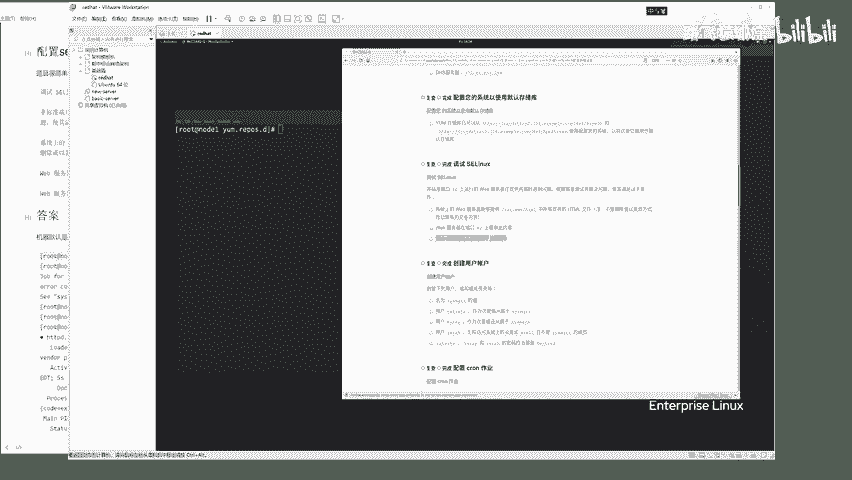

第一个操作是关于s1 linux的一个规则修改，第二个是web服务器的一个运行修改ok吧，然后也是运行在node一机器上的。

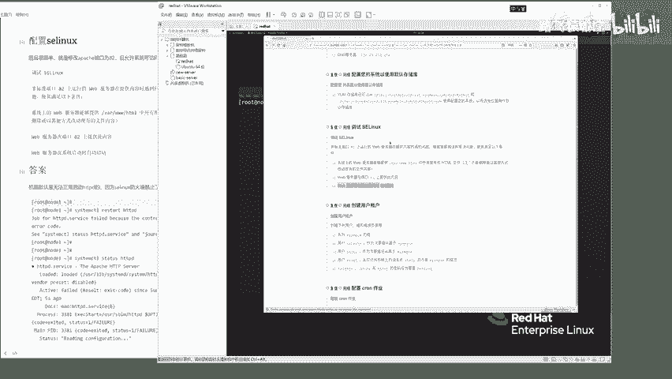

所以说咱们现在已经是登录在node一机器了。

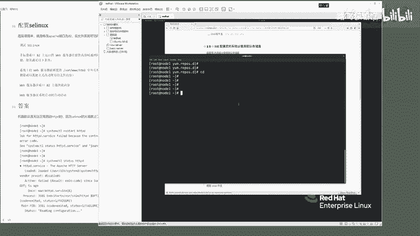

来大家看一下这道题啊，是你要修先修改这个web服务器啊。

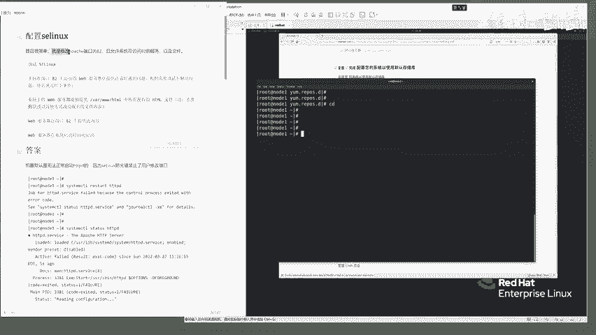

这个web服务器呢默认啊他用的是一个阿帕奇啊。

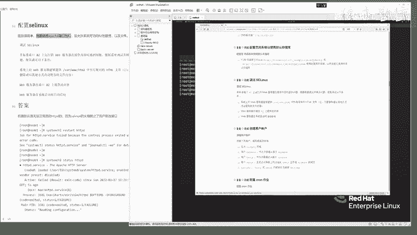

咱们要去修改一个阿帕奇啊，给他的端口改成82好了，看一下这道题怎么做啊，这道题呢你想去restart，用这个系统服务管理命令，想去重启这个http d，你会发现它是起不来的。

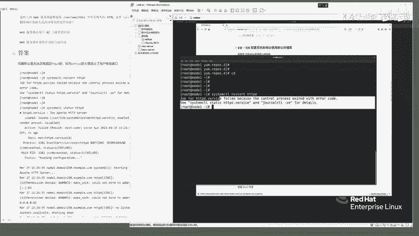

为什么呢，你可以通过status http d看一下来他在说什么呀，说运行权限拒绝，无法让你去绑定一个地址啊，来也就是呢啊来这边是你可以给他改的，字字小一点，再来cs看一下，你看他说什么呀。

是不是说阿帕奇服务啊，不能够运行在82端口上，为什么呀，因为全线拒绝啊，这个权限拒绝啊，就是因为你sa linux在里面搞怪了啊，怎么办呢，啊你呢先叫get enforce这么一个命令。

去查看你的sa linux是否在运行enforcing，看到这个状态就表示它已经运行中了。

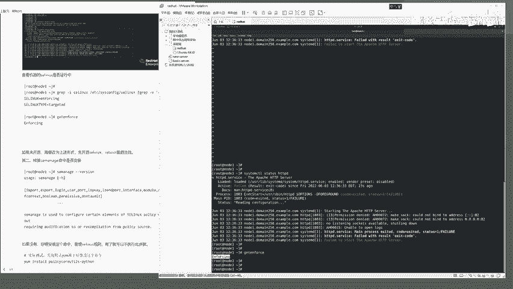

ok吧，来既然它运行中了，我们就得通过命令把s1 linux的规则给改了，怎么改呢，通过这么一个命令叫做s1 manager啊，这么一个s manager这么一个命令啊，来你先看一下这个命令啊。

它是否运行了s e m a n a g e。

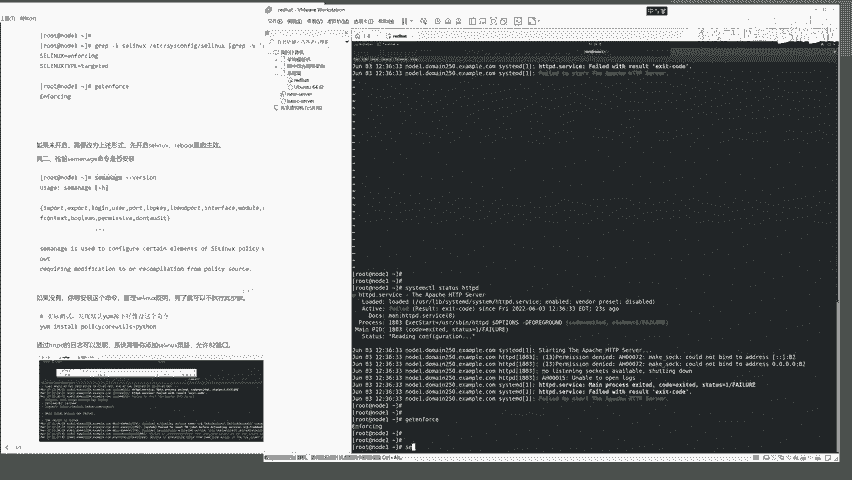

刚刚version能够通过这条命令看到结果的说明，这个命令啊它是正确安装了，ok吧，来如果说你这个命令没有安装呢，那么你得通过如下这条命令去安装啊，但是啊咱们试一下，发现这条命令啊，它不好使。

那就不用管它了，总之呢大家你们在做这道题的时候。

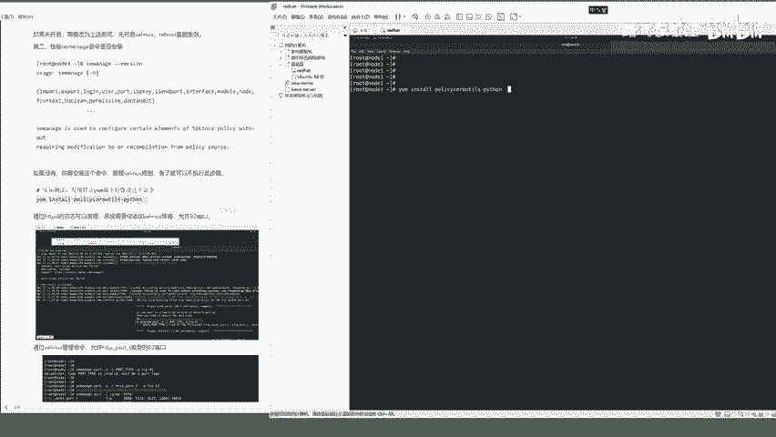

通过s1 manager这个命令能够看到它好使。

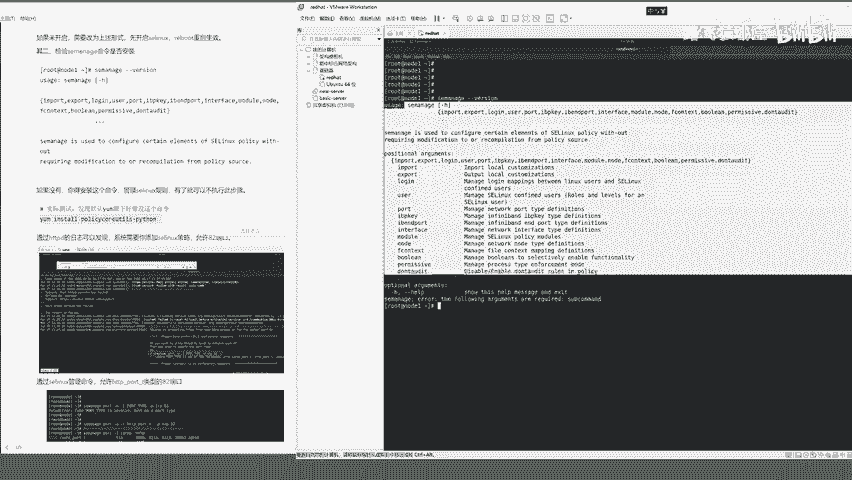

那就ok了，能行吗，怎么用呢，大家看啊，用s1 manager，s e manager port就是指定端口杠a啊，你要去添加添加什么端口呢啊，添加一个规则叫ptap啊，指定一个类型啊，添加一个来杠。

p指的是协议tcp协议的82端口，所以说就是s1 manager添加一个防火，就是一个防火墙规则的意思，添加一个端口类型的规则，然后是82端口的tcp协议，ok来这条命令啊，发现了这条命令啊。

他不让你敲，他说什么呀，说ptap is invalid，也就是你这边输入的杠t这边有问题，他说必须是一个端口的类型，什么意思啊，也就是啊来这里的用法有问题啊，用s1 manager port杠a杠t。

这里啊必须要指定是http port啊，杠t然后杠p指定是tcp协议的82端口走，你。

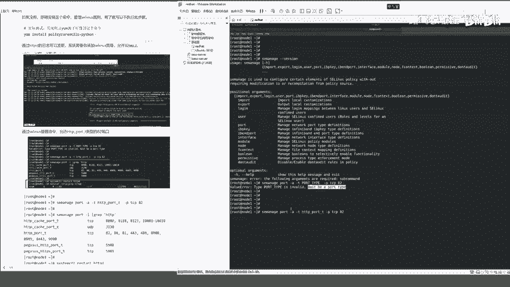

好了，朋友们这边呢啊稍等片刻之后，他就执行成功了，他没有任何的返回结果就表示是最好的结果，说明它是正确执行了，你可以再通过下一条命令叫s1 manager啊，port杠l就是列出它有哪些端口。

列出这个s linux啊，允许哪些端口访问，你直接通过管道符gra，去过滤我们的http相关的回车啊，你会发现这里啊，是不是有一个http port gt是tcp类型的，允许的这些端口可以访问呀对吧。

来到这就没什么问题了，下一步呢你去检查一下题目中要求的啊。

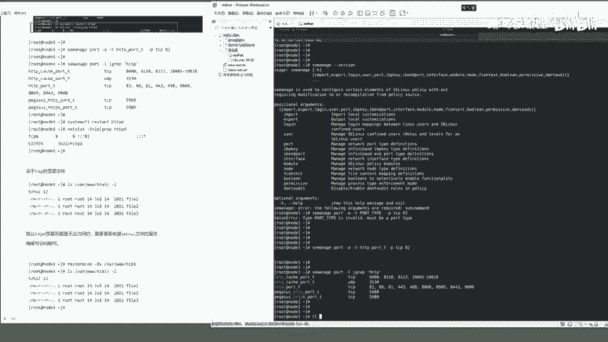

来当然你呢在做练习的时候，老可以去参考老师这样的一个笔记，那如果说你在考试过程中啊，你呢就是当然了，你要去记住这个命令他怎么用，ok吧。

你用这个se manager命令去修改se linux的一个规则好。

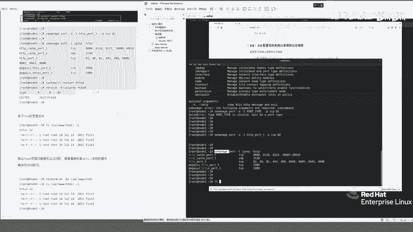

下一步要求在这个目录下去存在html文件。

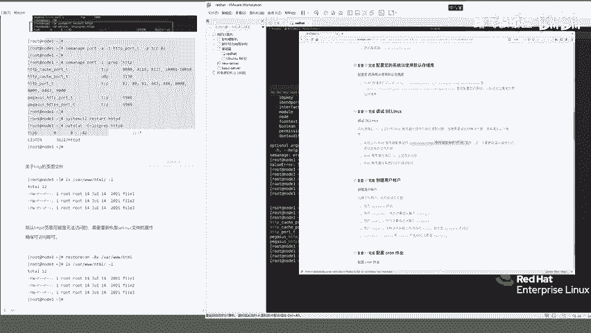

来我们看一看它是否有玩3w html gl，你会发现这里面是不是有三个fire 1 fire 2对吧，来但是啊这仨文件啊，你默认还访问不了它，为什么呢，你还没有添加s1 linux的一个规则。

你呢需要在这，你呢需要在这去修改它，恢复s1 linux能够读取它的一个这个权限啊，通过一个叫restore，叫restore c o n啊，这么一个命令，杠r v加上这个玩玩下的3w h电表回车啊。

这条命令敲完了之后，你再来l r看一下啊，呃这边就是看起来没有发，没有具体发生什么变化是吧，那这条命令你是一定要敲的，敲完之后你确保什么呢，自己在本本地克制下http斜杠啊，node一这台机器的什么呢。

82端口，然后fire一好诶，你会发现什么呀，这边提示端口拒绝，为什么呀，因为你还没有去启动它，来restart hd p d走，你看这次这条命令可以正确执行了吧，来正确执行了之后，你呢你会发现什么呀。

82端口的fire一是可以访问的，来f22 f23 ，发现什么呀，这个h t t p目录下的三个文件。

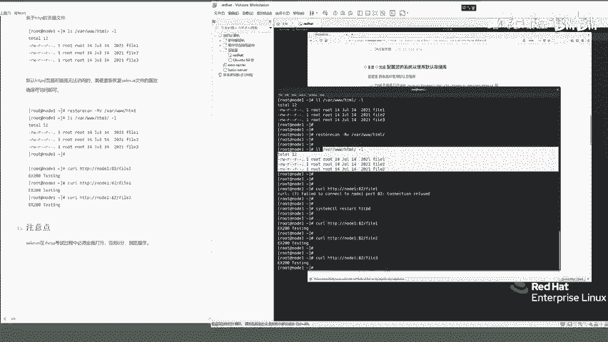

是不是都是可以访问的了，来到这儿啊，你这道题就是你看啊，题目要求这个目录下的文件是可以访问的，没问题吧。

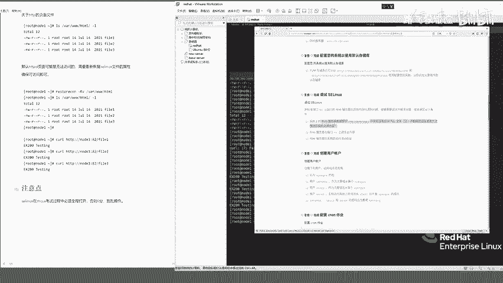

来运行在82端口上，你看这里是不是web服务器。

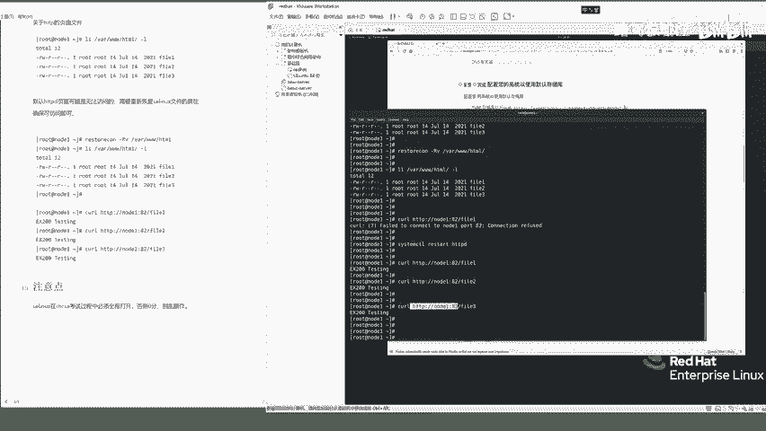

是运行在82端口的呀，对吧，第三个你要设置它什么呀。

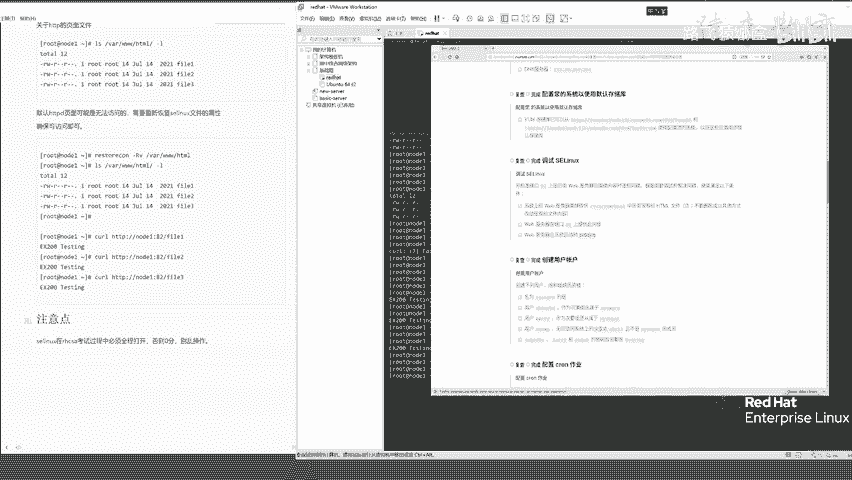

开机自启，不要忘了来system c t r enable啊，http d ok了，这条命令不能忘啊，system city is enable啊，hz b d好，是叫is enable d。

你呢一定要在这检查一下它是enable的。

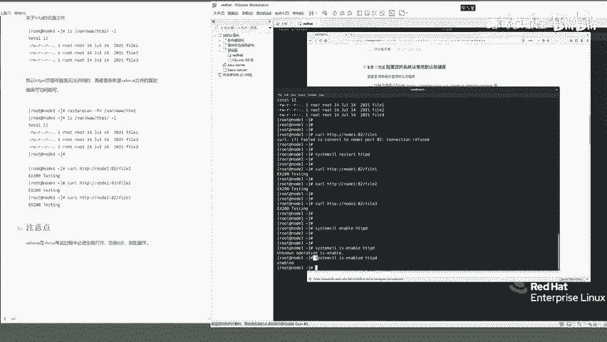

才能够明确，第三题是web服务器是开机自启的，ok吧好了，然后呢啊这道题咱们就已经做完了，然后这儿我给大家写了一个就是注释，你呢一定要确保s1 linux在整个过程中，全部都是打开的。

你呢不要自己去乱操作。

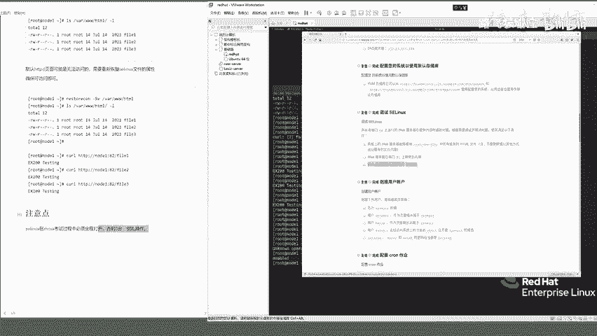

因为咱们自己在学这个linux的时候，一般都会把什么防火墙啊。

s1 linux给它关掉对吧，但是你要注意在考红帽的时候不能关题目，让你干嘛你就干嘛，ok吧，不要自己瞎操作。

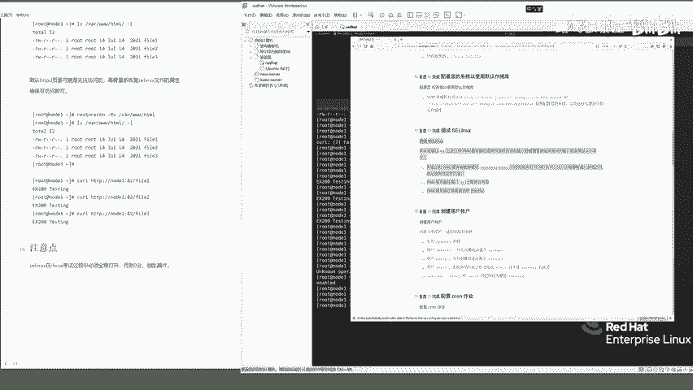

否则都可能导致你没有分能行吗，朋友们啊。

