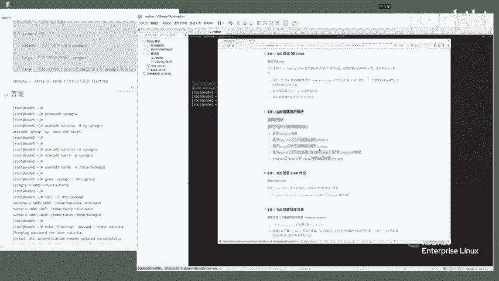

# Linux红帽认证教程、RHCSA、RHCE、RHCA认证【可预约考试】 - P5：5-05 创建用户账户 - he_nio - BV1Db41197cx

好了，同学们，我们的下一题来看这个创建用户账户，这道题呢就是考察你能否去啊，管理linux的一个用户以及组的一个信息啊，根据题意创建用户组，以及用户属于哪个组就行了。

第一题呢是创建一个sese manager一个组，那么你就去考虑创建组用的命令是什么，第二个创建一个用户名字叫做nta，并且呢他还要属于sese managers的一个成员是吧，下一个创建一个用户。

henry，这个harry用户呢，他也是属于这个sese managers这么一个组，ok吧，所以说你看你要创建组，创建两个用户，还得属于这个组，最后一个叫siri啊。

这个sii用户他有一些特殊的要求了，没有权限访问系统上的一个交互式share，并且他不是这个组的成员，然后最后一个要求这三个用户啊，密码都是f l e c t r e g。

那么你就去考虑怎么用linux的命令，去创建这些用户啊，解决它。

记得吧，好了，咱们来根据这边的一个t来看一下好。

首先你还是要明确，这道题是在你的node一机器上去操作的。

所以你这边依然注意啊，检查一下你是否是在一个node一这个基础上好，第一题呢是创建一个sese managers的一个组，那么你就用group，叫group add添加组，然后添加这个组。

他没有任何其他的要求，你就什么都不加，就写上一个组名字就ok了。

让它默认即可，cs啊，来s y s m g r s m g r s，这个单词别敲错了哈。

如果说你对这个单词感觉有点延伸的话。

那么你就copy粘贴啊，ok创建完了之后呢，你可以去检查一下啊，利用我们linux的一个grp mini cs m g r s从哪找的，etc group去找，发现这个用这个组啊。

他就已经创建好了对吧好。

下一个要求呢创建用户拿它上啊，并且它要属于这个组。

那么你就复制它的一个名字，通过一个user add对吧，user a d d去创建一个用户拿他少。

并且他要什么呀，属于这个属于这个sese manager这个组附属于哪个组。

用什么参数啊，用大写的g啊，是改它的附加组改为谁呢。

改为我们的叫semanager这个组来。

ok创建完了，创建完了之后呢，你可以去用d命令验证一下，那他啥走，你发现了啊，nasa用户就已经创建好了，并且他有一个自己的主组叫娜塔莎，然后你看是groups，有一个自己的娜塔莎组。

而且它还属于cs man，这个cm cs managers这么一个系统管理员的一个组啊。

这是一个单词缩写，可以吧，所以说啊第二题第一题两题做完了，最后一个啊，还有三个是吧，来创建harry和他一样啊。

所以说写法一模一样，只不过是user add。

把这个用户名改为我们的harry。

然后创建harry属于cs manager组，回车完了之后呢，你d h a r r y看一下harry它是否有一个附加组。

是sese managers，下一题创建这个sara，这个用户注意了，他的要求是非交互就是什么呀，无权访问这个交互式，谢尔啥意思啊。

来我们可以看一下，cat一下来前面几个命令大家都会敲了吧，ok吧，来cat etc password。

什么叫啊，无权访问交互式线呢，也就是你看啊，像我们的harry用户，他最后一个解释器是bbs，就表示它是一个可登录的，可交互式的一个share解释器啊，那无权访问交互实现怎么办呢。

将它设置为这个s being no log就可以了啊，并且他不是sese managers的一个成员，那么怎么写呢，咱们就只需要在这创建用户，并且杠s就是指定一个解释器啊。

将它设置为不允许登录的状态就可以了，咱们看一下user add创建谁啊，创建这个sara，然后杠s写上s being no log，no log就ok了，然后我们id s a r a h。

我们看一下这个sara用户啊，他现在是没有属于那个cs manager这个组对吧，来咱们可以grap看一下sara etc password啊，你会发现什么呀。

这个用户他最后的一个解释器是has been no log，也就是无权访问交互式，谢尔的意思，好好最后一个呢这三个用户啊，密码都是f l e c t r a g，咱们可以用一种快捷的方式去给它设置密码。

一口用一口命令加上他的密码，一口加上他的密码，你看直接回车，它是不是就把这个密码打印出来了呀，咱们可以交给管道符，交给password，加上谁呢，杠杠s t d in这个参，这个参数就能够非交互式的啊。

就是免得你还要输入密码，直接通过这种方式把密码传给谁呢，传给来拿他上第一个用户。

ok了你看提示你successful对吧。

来再来第二个用户，我们的harry。

ok也是successful了，最后一个sara，没问题吧，朋友们，你看三个都ok了，那么最后呢你可以去尝试着登录一下啊，比如说s s h啊，用谁呢，用这个sara s a r a h登录谁呢。

登录我们的node一朋友们啊，注意你这个用户啊，是不是在node一机器上去创建，那样来回车e输入密码f l e c t r a g诶。

你会发现什么呀，说这个用户不允许登录，为什么呀，来不要忘了啊，我们刚才创建的sara，它是无权访问交互式线，所以说导致他无法登录，ok吧，没问题吧，好所以说sara是不可以了。

换一个咱们换一个harry啊。

h a r r y走，你f l e c t r a g回车，咱们看一下harry它是不是正确的登录上来了呀，来who am i，发现我们仨这个harry是可以正确登录的，没问题啊。

it咱们退出来再测一下最后一个用户，测一个谁啊，那个那他啥对了吧，看一下嗯，那它啥可以登吗，f l e c t r a g走，你那他啥是不是也登录了呀。

ok啊，所以说我们这道题创建linux的一个用户啊，就做完了。

