# Linux红帽认证教程、RHCSA、RHCE、RHCA认证【可预约考试】 - P6：6-00 Rhce考试要求查看 - he_nio - BV1Db41197cx

哈喽观众朋友们大家好啊，首先呢恭喜你来到这一节的一个学习，说明你的hcc啊已经考核过关了，那么呢这一节啊，于超老师呢将会带着你去模拟练习啊，咱们看一看实际的一个hc一的考试环境，要求你做什么题呢。

首先哈关于环境的准备，你依然是用我们的啊，给大家提供的一个红帽的一个考试练习镜像，对吧，你呢点击啊像我一样啊，点击这个扳手，就是选择你的这个虚拟机，点击这个扳手。

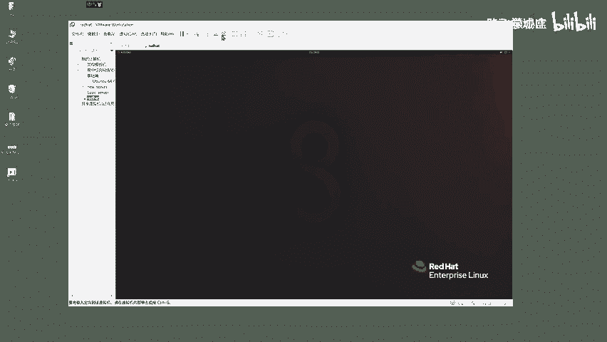

然后呢啊来在你的机器上啊，它应该会存在这个啊和这个以及这个啊，就是呢我这边画出的三个框，应该是你的机器上能够看到的一个，这个虚拟机的一个快照对吧，那么前一个i h csa的一个虚拟机。

咱们已经不去用它了，因为这个cc的一个考核镜像啊，它的一个快照你已经考核通过了，所以说这个咱们放一旁，那么这两个区别在哪呢，一个你看啊是红帽的一个开机状态，一个是红帽的一个啊。

就是c一考试的一个关机状态，明白吧，那么你呢看你的机器啊，你的机器配置很高，直接选on唉如果说机器配置一般建议选off，然后手动开机，这俩呢就是一个是基于开机状态下做的，一个快照，一个是hc啊。

关机下的一个拍照没问题啊。

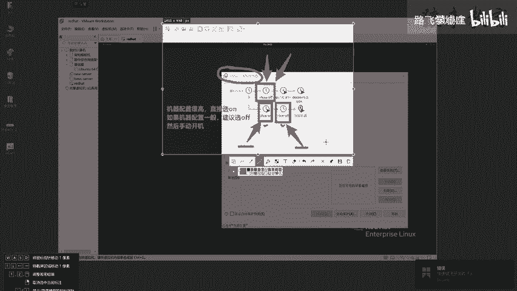

朋友们来，这是第一步，那么你呢做去考试的话，你就像我一样选择这个h c1 off，然后点击是咱们就是在恢复快照了。

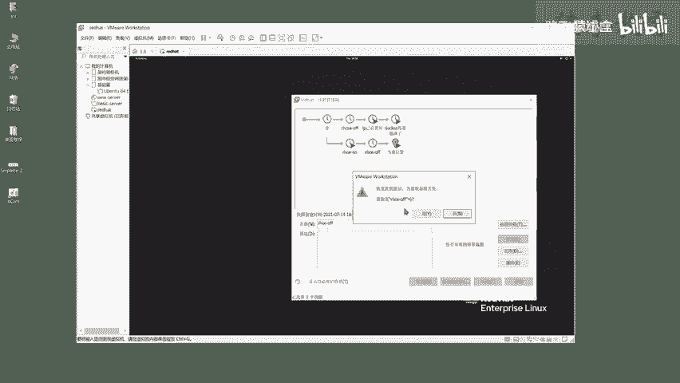

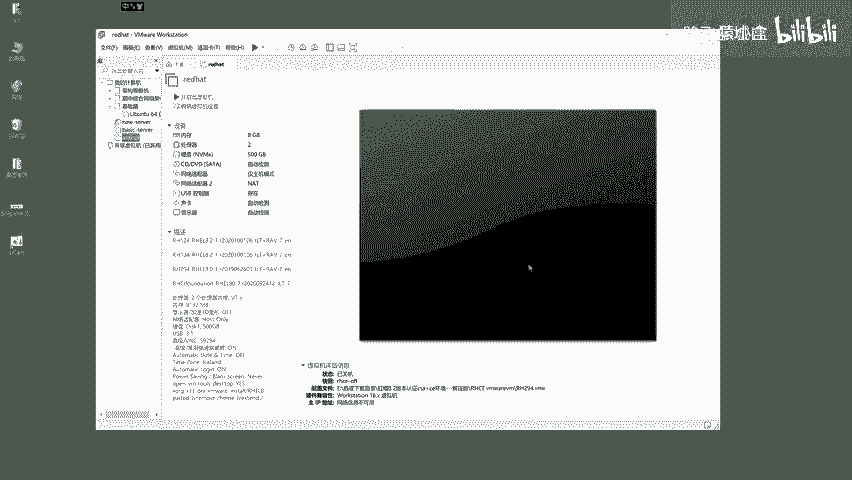

然后呢你点击这个开启此虚拟机。

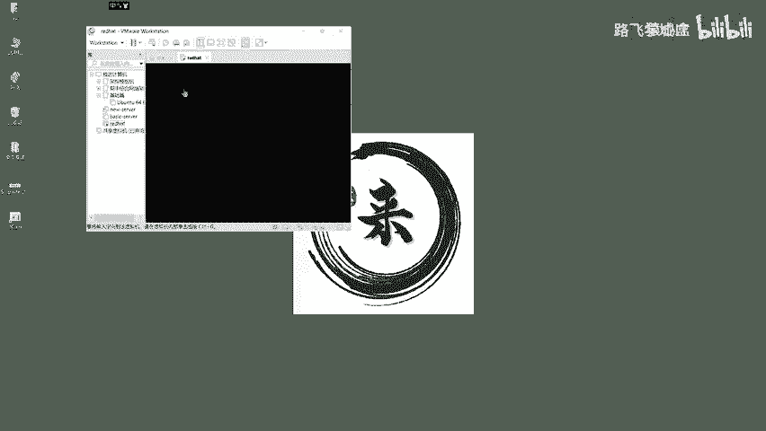

这个就在模拟你在这个实际的考试环境中啊，把这个考试的机器物理机给它打开，打开之后咱们就是查看考题，然后一题一题的去做就没问题了。

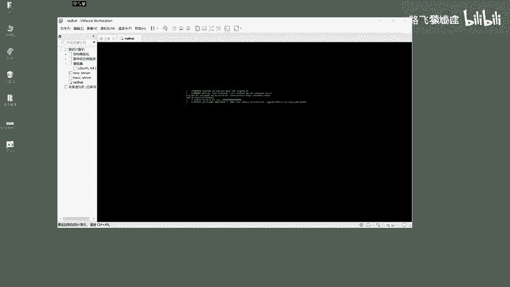

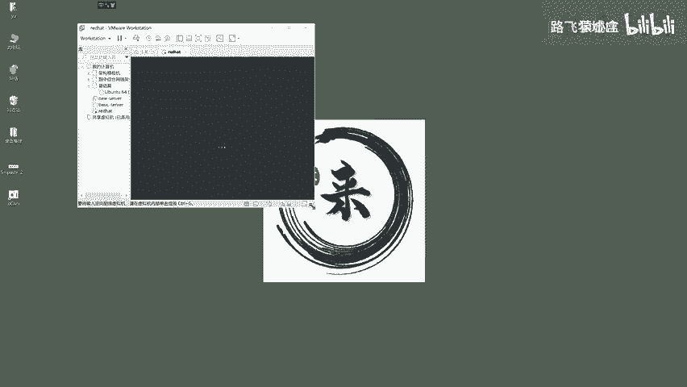

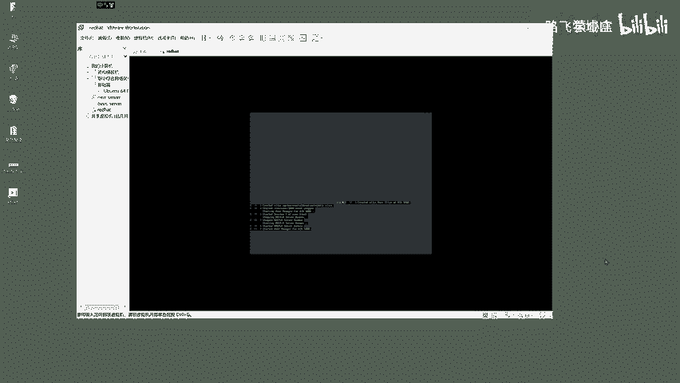

好了，同学们啊，我这边呢是已经把这个考试的环境给他打开了，下一步呢还是和前面啊，超哥带着大家考这个c s a的时候一样的。

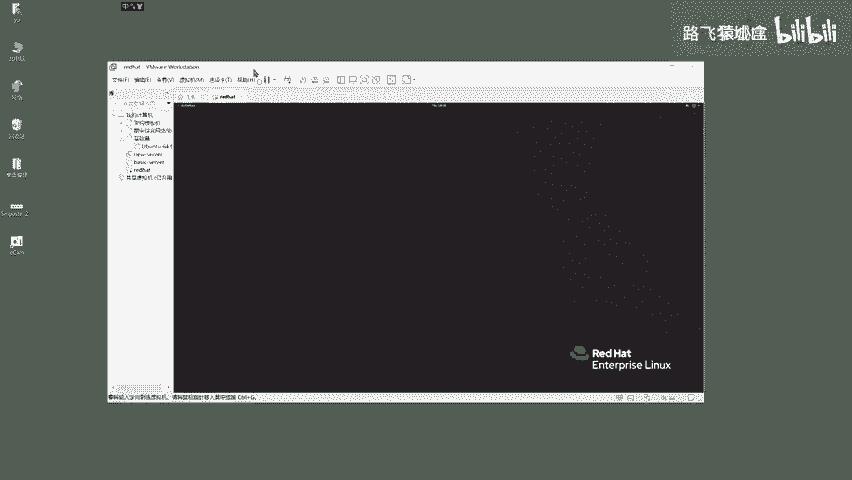

它依然是这么一个红帽的图形化的一个linux界面。

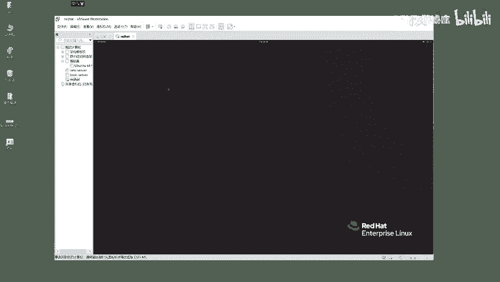

你点击左上角这个激活的一个标签，点一下，首先选择这个view exam，这就是查看考试的题目。

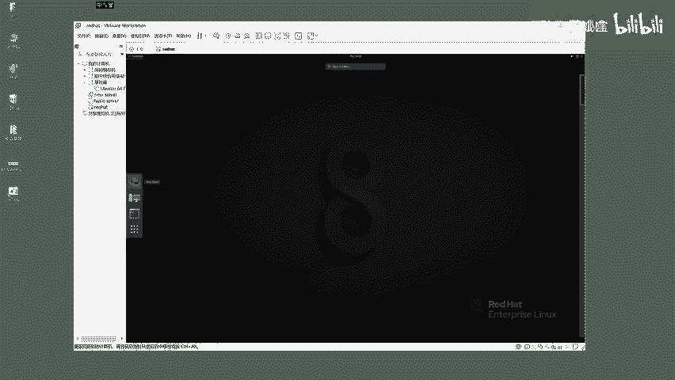

来点一下查看考试题的意思。

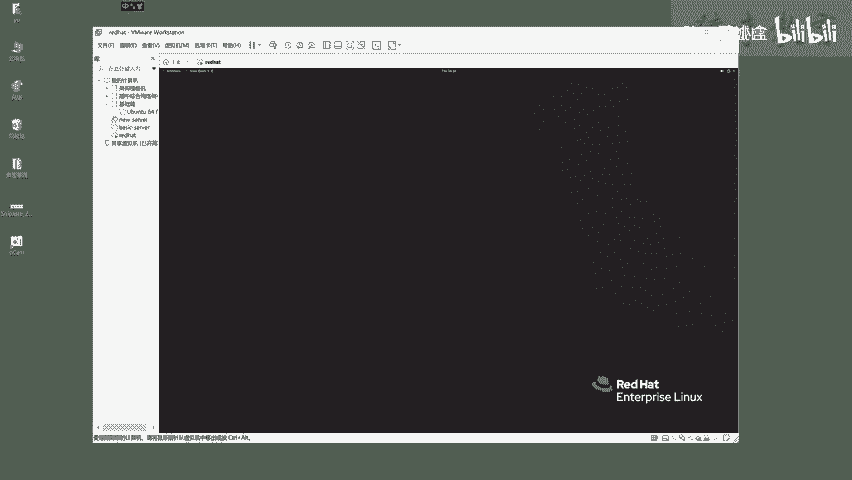

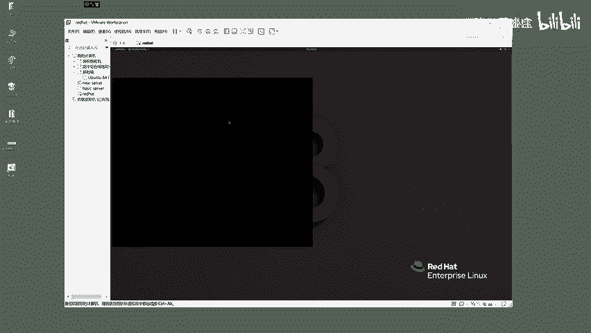

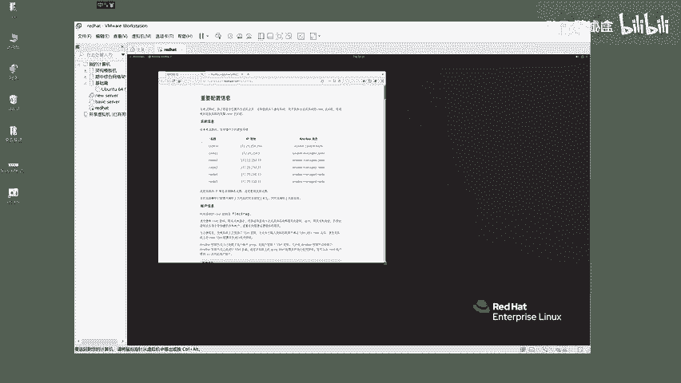

来我们看一下啊，这边就已经把考试题给它打开了，打开了之后啊，你可以给它放大一点，关于这个hc的一个考试题啊，咱们看一下啊，重要的一个配置信息，意思是在考试期间，除了你在考场操作的这个台式机以外。

它还会使用多个虚拟机，让你去进行考试的一个练习，并且你是没有台式机的一个root权限的，但是你有虚拟机的一个完整的root权限，什么意思呢，就是你当前能够看到的这个系统啊。

它就是属于你在考场里面操作的那个台式机，所使用的一个这个red red hat的一个系统，对的，那么你点击左边的一个激活标签，点击这个terminal，打开这个terminal终端之后。

你在这操作的是谁呢，就是你考试的这个台式机。

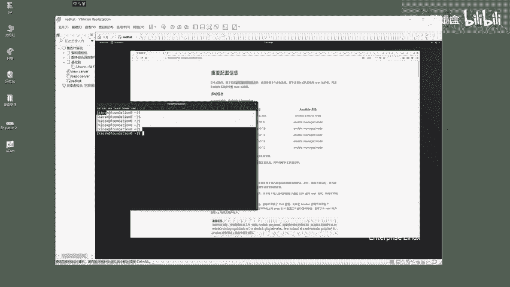

人家说除了台式机以外，还会有多个虚拟系统，怎么选，来点一下，这儿有一个第二个选项叫vm control。

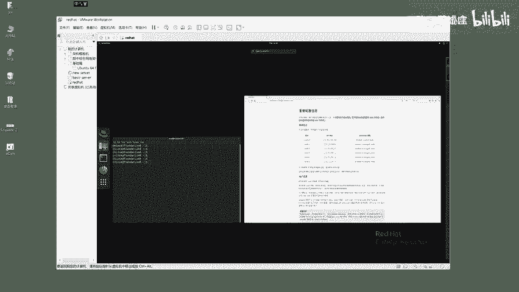

点一下你会发现呢，它提供了12345加上一个control，六台机器给你去用，ok吧，那么这是可以提供某一个选项，你在做某道题的时候呢，想去看一看它的一个状态，你比如咱们选择note 3，点击ok啊。

又到了下一步的一个选项，它提示你可以对这台机器去开机重启关机，或者说打开它的一个console，一个命令行界面，来咱们看一下它的一个conso，你会发现啊，他是不是就在等待着你输入root账号啊。

就是等待你输入linux的一个账号密码去登录它，没问题吧，那么这是考试环境，让你用的台式机，物理机以及用于考试做题的一些虚拟机对吧，他说在考试期间，你可以使用它提供给你的这六台机器，ok吧。

以及呢你可以在在这个物理机的啊，看好了，这是这就是考试的一个物理机的一个环境，你可以输入一个word啊，manager这么一个命令回车，这条命令呢，它就是打开这个虚拟机的一个管理界面。

能够看到人家考场啊，给你提供了六台机器，这六台机器它是running运行的状态，还是说关机的状态，ok吧，那么这些系统啊，来咱们继续看这个r h c的一个考试，要求人家说这些ip地址都是静态设置。

这些ip主机名啊都是设置好的，你不要去改它，没问题吧，那么下一步呢，这是系统的信息，账户用户的信息，所有的系统啊都是root和这个密码来。

比如说咱们ssh root node 2 f l e c t r a g来host内，咱们会发现你是不是已经登录上这个note 2，lab exam。com说明你是不是登录这台机器了，来exit。

再回到我们的一个考试环境的一个物理机，ok吧，那么这是人家给你的账户信息，你呢就根据这个提议啊，说除非题目要求你去简单说，朋友们在考试的时候，只去操作题目中要求你做的事儿，其他操作人家没讲呢。

一概别瞎操作，明白吧，那么如果你瞎操作，可能导致你没有分，那么你就自己踩坑了，然后呢为了方便起见，这些系统啊默认都装好了ssh密钥啊，也就是这个c一的考试题啊，基本上都是基于ssh的一个协议原理。

以及ancier这么一个批量管理的用法啊，你呢能够通过管理机器，通过answer去创去管理其他的机器，那么如果说你对安server还不太熟，对s h的一个维护原理还不熟。

那么你要把这个于谦老师的一个linux的一个课程，再给他看一看，就能够搞定了，能行吗，然后呢人家继续继续看啊，朋友们看好叫什么呀，gr e g哈，你不要linux玩多了。

看到这东西就想到grp g r e p看明白了啊，是j r e g对吧，他可能就是给你留的一个坑，就看你是不是粗心大意啊，大马虎对吧，那么人家告诉你，你可以通过gr 1 g这个用户去管理。

这个其他的机器好了，然后呢，接下来的操作啊说除非另有指定你的所有操作，也就是底下这些题目要求你去写的，answer的剧本，要求你去生成了一些配置文件，主机清单文件都是写在管理机器上的。

一个跟下的home greg就是greg是吧哈，g r e g它的一个answer ver目录中，并且权限要属于这个g r e g，以及所有的answer wer命令啊，都要基于gr e t。

基于管理节点去操作，看见没，人家这儿已经明确给你一个重要信息提示了，这些细节有一个差错，你都没有分啊，所以说把题意先看明白了啊，再往下啊，其他的这些机器啊，就是根据题意来就行了，朋友们啊。

说考试机器的防火墙默认是不启用的，s1 linux是一个强制模式好了，然后呢其他这些资源啊，像样本仓库啊，一些配置文件呢，咱们待会儿就根据提议一道题，一道题的做就行了，可以吧。

然后呢说最后啊最后在评分之前，你的管理节点它将会重置为啊，注意了啊，不是管理节点式，在考试之前就是你你的一个被管理节点，就是answer ver操作的这些机器啊，它都会重置到初始化状态。

然后基于你在安server的一个管理机，进行一个每一道考题的执行，最终让这些被管理的机器能够成功的修改，因此呢考官会基于这个要求评分，你能得多少分。

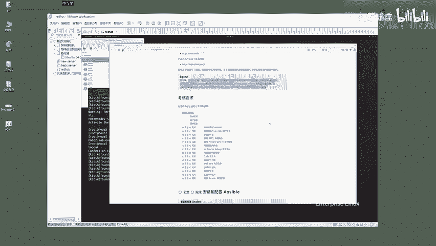

ok吧，那么具体是c一考察您哪些题目都在这儿了，考试要求ok吧，一共这么多题，咱们就一题一题的打败他。

