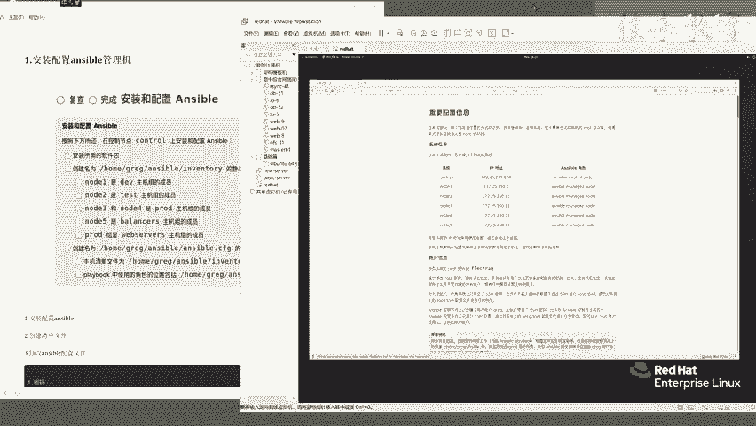

# Linux红帽认证教程、RHCSA、RHCE、RHCA认证【可预约考试】 - P7：7-01 安装配置ansible - he_nio - BV1Db41197cx

好了同学们啊，我们来做c一的第一道题。

咱们还是点击左上方的，这个考题的一个标签是吧。

先把这个考试的一个环境题目给它打开，打开之后呢，咱们继续来分析一下它的题目啊，首先关于g的，关于这个考题啊，它有一些暗坑朋友们，首先他第一题啊是要求安装和配置answer。

你来点一下，点开它之后啊，咱们先看一下它的一个具体的要求，这道题呢来安装和配置answer，不按照如下要求，在控制节点control这台机器上安装和配置，answer wer。

所以说你看第一题先是装安社保，第二题创建一个inventory主机清单文件是吧，按照如下要求去创建，这是第二题，来第一题，第二题，第三题呢咱们看第三题，要求你去创建一个配置文件。

并且去修改它的两个参数，一个是主机清单的路径，一个是肉角色的一个配置文件路径对吧，所以说这是安伯的第一第一大题，但是朋友们这第一大题啊，它有一些暗坑，我带着你分析一波啊，你来看在这道题的要求上呢。

首先啊关于整个的账户信息啊，啊来你你先看这，为了方便起见啊，哎咱们直接看关于安server的吧，来看看这道题，这个要求，他说ancier的控制的节点默认装了一个gg gr，e g用户。

并且有了s h密钥，允许安卓板去操作被管理的机器，看见吧，所以说你的answer吧得用这个用户去操作，而且请请勿去修改greg的这个ssh配置文件啊，也就是他的那个呃公司要啊，不需要你去动的，知道吧。

然后大家看这很重要的一个重要信息，他说除非另有指定你所有的操作呀，包括answer ver的剧本配置文件，主机清单文件都要保存在一个指定的目录中，知道吧，你看所以说你得先创建这个文件夹。

而且它的拥有者就是user，属于greg是吧，而且大家看安斯伯的命令，都要由gr g这个用户，在这个控制节点上去运行，所以说这是他的一个暗坑，你得完成他的一个题目，要求这道题才能做对，知道吧。

那具体怎么做呢，大家来看啊，点击它的命令行终端稍放大一点，咱们先s s h g r e g c o n t r o l，来连接这台机器，密码默认是f l e c t r a g好，连进来之后啊。

咱们说考题要求的目录是他，所以说你是不是要先去m k d i r杠杠p，把这个目录创建一下呀对吧，那你是基于greg用户创建的这个用户，l l杠d home rug enerable。

你看是不是属于这个用户啊，就把刚才这个提议啊是完成了的，那么下面一个操作要求你去装answer，你注意了，我这用了一个速度，你不用速度的话，你看你直接young in store。

想去answer wer杠y啊，他是不让你装的，所以说前面要加上一个度就可以了，那么呢啊我这台机器它是已经装过了。

装过了，咱们就继续，那下一步要求你去创建这个配置文件呢等等，来点击这第一题，咱们要先去创建这个inventor文件是吧，怎么创建啊。

哎是不是touch基于它创建就可以了呀，来l e再看一下这个主机清单文件呢就创好了。

以及有一个unserver的配置文件，这个配置文件啊不是不需要你去手动创建了。

你呢需要这么去做copy吧，e t c anwer ver，人家默认生成的一个answer ver，因为它默认的配置文件里面有很多信息，知道吧，来拷贝一下生成题目要求的home greg。

answer ver这个目录中走，你哦不不是copy啊，是cp啊，cp走没问题吧。

好这俩操作完了呢，你就可以去写，根据题目要求去创建主机清单组了。

所以咱们呢先去编辑home grog inventory，是home rug and server inventory。

打开了之后呢，根据题意来啊，你看咱们先分析一波啊。

说是有这几个主机名，note一属于这个组，node 2属于test组，note 3和note 4属于proud组是吧，note 5属于负载均衡，balance on这个组是吧。

以及最后一个有个有个小难点了，说proud是属于是web server组的一个成员，那么这个题目要求啊怎么去写它呢。

咱们看一下，首先呢先定义一个dv组啊，它里面有个主机成员是note一对吧，再来第二个测试环境啊，叫test note 2，来再来一个proud proud，不一样了，它是有note 3和note 4。

来note 3啊，no来你可以这样会换行note 4。

这样去玩明白吧，来最后一个binson啊。

来把这个名字，你要是单词太长，就复制粘贴也行，balancer啊，里面有一个note 5给它写进来。

最后一个了，有一个叫做web service的一个主机组对吧，这个主机组啊它有一个成员叫做proud。

看见吧，说注意了，大家啊，上面这些写法都是定义一个inserver的，一个主机组的名字，里面有具体的服务器的主机名，知道吧，note一到note 5。

它是指的每一台机器，明白吧，那最后一个题不一样，是proud这个组属于web service这个组是吧，那它的写法呢是web service，然后来一个children啊。

c h r i d d r e n children，就是他的儿子是吧，来里面把proud写进来就可以了，大家呢，cat一下啊，你给他做完之后检查一下写的对不对，这是第一道题的一个就是主机清单文件。

写完了，下一道题呢让你去编辑这个ancier的配置文件，除了他这两个要求啊，朋友们，刚才我是不是给大家讲了，他这里啊有一个重要信息的暗坑啊，你要指定answer ver所有的命令啊。

由这个greg用户去执行，所以说呢这道题大家呢来回头呢。

参考我这个笔记去做啊，来我们先明确一下tree home rug，来answer吧，看一下有一个来ensable。cfg配置文件。

有一个inventory，主机清单文件，咱还差一个，是不是这个目录呀，说剧本中使用的位置啊。

使用的角色位置是他，所以说你还得去创建这个文件夹，mk dr gt给它创建出来，再用脆命令看一下，来配置文件，主机清单，rose目录都有了，这个做完之后，下一步你就是来改它的配置文件了啊。

来咱们呢可以先这样啊，cat home bg and server di，诶answer吧，哦对anwer，wer。cfg，你去直接cut它的话，是不是会会发现它默认很多被注释掉的行量，对吧。

那咱们可以用谢尔三剑客啊，grp命令杠e v我们过滤掉以井号开头的行啊，以及或者空白行对吧，把这个都过滤掉之后，你会发现这默认的配置文件啊，里面就这么点信息，那是不合适的，你呢最后做完。

那确保和我这一样，那就没什么问题了，来咱们先完成他这俩需求，改主题清单，改角色，他的目录路径编辑。

我们可以这样啊，你要是想省事啊，cd到home gg安ser目录中。

你先进来，然后再去编辑安ser叫cfg，你呢看好了啊，先去修改deforce的一些默认配置，大家参考我这写的四条啊，这个配置信息先斜杠搜索in inventory啊，走找到这一行，看见吗。

你看他们enser啊，默认用的主机清单文件啊，是不是来自于这啊，那我们要按照题意要求给他改了，改成什么呢，home下的来，这个名字太长，你可以回头去手敲也行。

朋友们啊，你可以选择手敲，或者说这样，你看啊找个技巧，首先inventory文件是不是指的就是他呀，所以说你来这儿复制粘贴啊，这个是考试考场中给你的一个题目，你可以合理地利用它复制粘贴啊。

咱们确保它百分之百正确，才是最重要的，就是主机清单文件下一个改一个，安就是answer wer的角色的配置文件路径，来把这个路径复制一波，这个名字叫啥呢，叫rose杠pass，你看它默认用的什么呀。

是etc的安server rose，对不对，那把它删掉粘贴，把我们题目要求你的一个设置写进来，那么这个提议要求啊，我们就是搞定了，但是朋友们上面有一个暗坑，看见吗。

重要信息你得修改answer ver的运行，用户继续来看啊，来在哪呢，大家看在这一段就是在这里关于特权设置的，来我们直接去搜索privillages，p r v r l e g e走走好，找到了我呢。

显示个行号让你看，差不多要从340行，大约是在这一行啊，你要记住参数，而不是行号来叫特权设置，怎么改呢，把这个become打开，这几个都打开，你看他默认用的速度是以谁去执行啊。

是不是用的这个root用户啊，对吧，来这个参数啊，就是你看题目要求啊，说是最终answer wer，要基于greg用户在远程机器上去执行命令，那他是不是来题目中有要求啊，看一下说这个gg用户啊。

它是有速度权限的，来你要把这特权更改，其实你会发现啊，咱们只是把注释去掉了，保险起见呢你可以把它注释打开明白吧，来这是一个第二个呢，你看我这有一个remote user，注意了啊，就是这个暗坑啊。

remote user，你看说default user啊，for playbooks什么意思啊，就是题目中要求你answer ver的命令，应该由greg用户去执行。

所以说这个参数这个remote user才用用户啊，一定要改成g r e g才是对的啊，以及它还有一个host key chicken叫主机密钥检查，默认是false，你给它打开也是更靠谱的好吧。

来就这些参数了啊，然后咱们保存退出，再用这个，grab排面里过滤一下它现有的一个信息。

来大家呢回头和我这个笔记对比一下来，这是我们在好题中完成的部分来提议要求的，是不是这俩啊对吧，然后我跟你讲的暗坑啊，就是他没有在题目中说，但是在说明书那一块告诉你了，所以说这个和这个你必须要改不改的话。

你很有可能就踩坑了好吧，然后这一块有特权默认的answer ver啊，会用这个速度去提全明白吧。

好这是第一块，第一块做完了之后啊，我们来看还有一个暗坑是什么呢，就是你要去修改主机清单文件，添加ssh密码，但是这个密码呢你会发现啊。

默认不加也行了，就是在在哪啊，说greg用户啊，默认装了s h mo啊，允许在控制节点和被控，被控制节点之间进行ssh登录。

所以说我这里的一个这个写法，是操作所有主机组给它添加，添加一个安server的密码。

来这里啊，你可以先不加，看一看是否正确，来叫测试哦，这没有中文，那就没法没法写了，咱们就直接来测啊，怎么测呢，answer ball gm ping，你回头啊，用这在配置文件改完之后。

你回头呢用这条命令啊去测一测，看一下主机清单中的文件啊，是否都是通的，你看note 54321是不是全是同类呀。

你看题目中要求的，我们是不是通过ctrl机器管理了这五台机器。

没问题吧，所以说你会发现啊，来dw d cat inventor，我们主机清单文件写的没毛病，对不对啊，以及我这没有去指定指定机器的密码，不指定也行也行，因为人家默认有s h密钥，哎。

除了pm模块的一个用法，你呢还可以用一个，比如说让远程机器返回它的主机名，看一下12345台机器的主机名。

是不是返回来呀，这就说明我们第一题啊，来第一道题的安装server和修改配置文件就ok了啊。

