# Linux红帽认证教程、RHCSA、RHCE、RHCA认证【可预约考试】 - P8：8-02 创建和运行ansible临时命令 - he_nio - BV1Db41197cx

好了同学们，我们来做c一的第二道题。

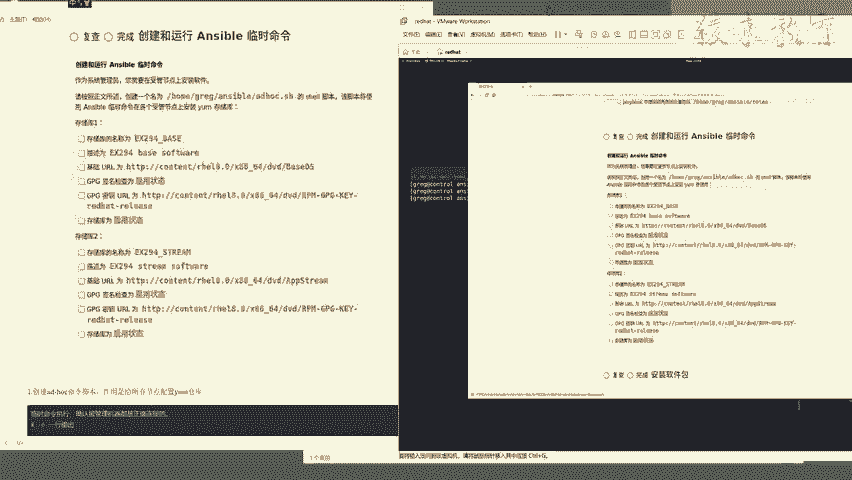

先来带给大家分析一下第二道题的一个要求，你看啊，这道题要求创建和运行answer ver临时命令啊，临时命令什么意思啊，是不是说answer wer啊，它有两种用法，一个是ad hook啊。

临时命令一临时命令，一个是play剧本，对不对啊，那这两种命令这道题呢要求你用的是临时命令，临时命令，你看啊，题目要求是你作为一个运维，需要在被管理的机器上去安装软件是吧，那么按照题目要求。

你要先去创建一个角馅儿脚本。

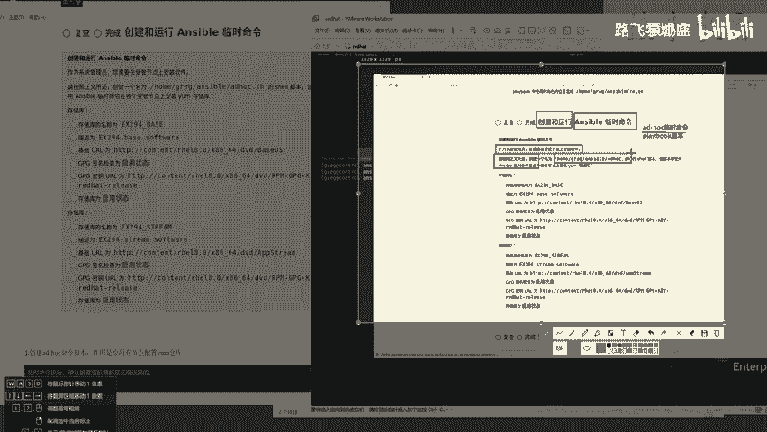

这个脚本的作用，是在目标机器上设置一个样本仓库，所以说这道题呢哎第一个写shell脚本，线脚本里面写入写入什么呢，安卓管的ad hoc命令，这是不是第一个题目要求啊对吧，第二个题目要求呢。

就是看你会不会基于临时命令设置样仓库，这就考察你的安森博尔的模块了好吧，那么第二道题的一个具体的要求，你要设置两个存储库啊，这两个存储库呢分别要设置它的名字呀，u r r啊，描述信息啊，启用啊这些。

所以说第一个你先去琢磨用什么模块能搞定它，以及啊这每一个要求通过什么参数去完成，对的吧，那这里呀就要看你对安server熟不熟了，如果说你对安server都不太熟的话。

你可能需要把余超老师的这个安server的一个，自动化运维的课给他好好看一看就没问题了，好那这里呢咱们先看这道题怎么做啊。

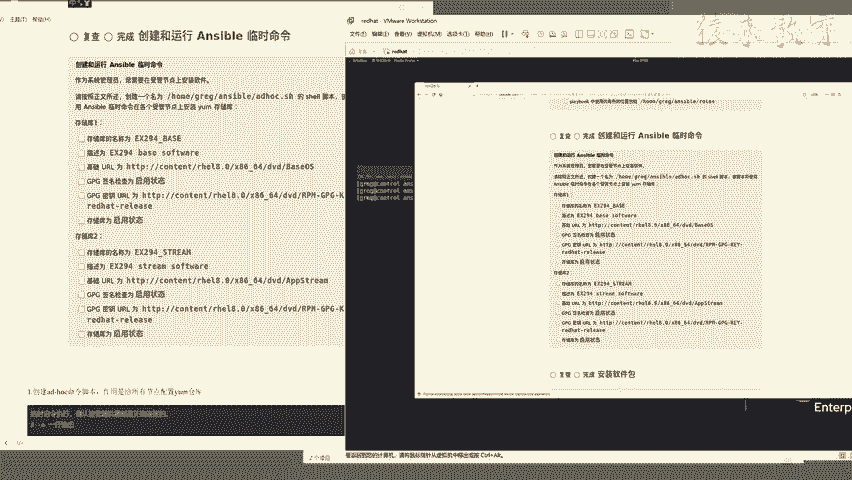

首先先带着大家看一看啊。

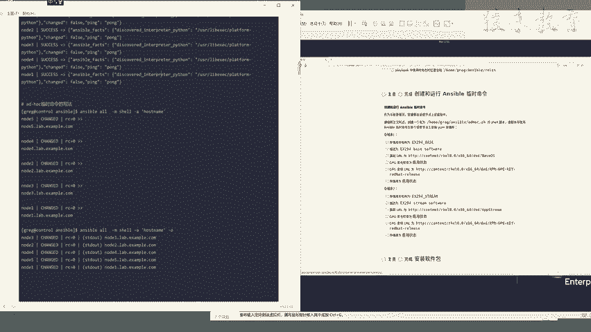

叫answer ver的ad hoc临时命令怎么玩，来临时命令吗，就是基于命令行的临时执行，asser表示操作所有主机清单的机器，那咱们是操作哪些机器啊。

home greg answer able inventory，是不是他呀能明白吧啊，来咱们呢，所以说啊你呢在这个目录下answer b哦，然后是这表示通过answer ver操作所有主机杠。

指定一个模块，你比如说指定信模块杠a指定信号模块的参数，假设你来一个host name回车，你看这里是不是就把这些机器的主机名，让它列出来了，那如果说你想把这个信息啊输出为一行的话，就加一个杠欧来回车。

你会发现它显示的诶就稍微友好一些了对吧，那除了执行host name，你比如说远程的看一看目标机器的内存情况，free gm来咱们会哦，这里就不要加杠欧了，看着不太友好，来不加杠o你会发现啊。

每一台机器的那它的内存情况，是不是全部返回给你了，所以说这是一个临时命令的一个用法。

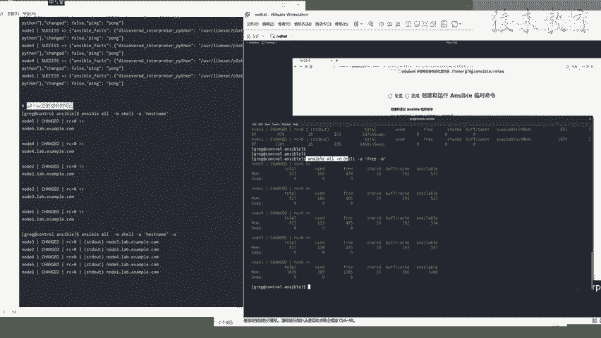

那这道题考察的是设置样本仓库。

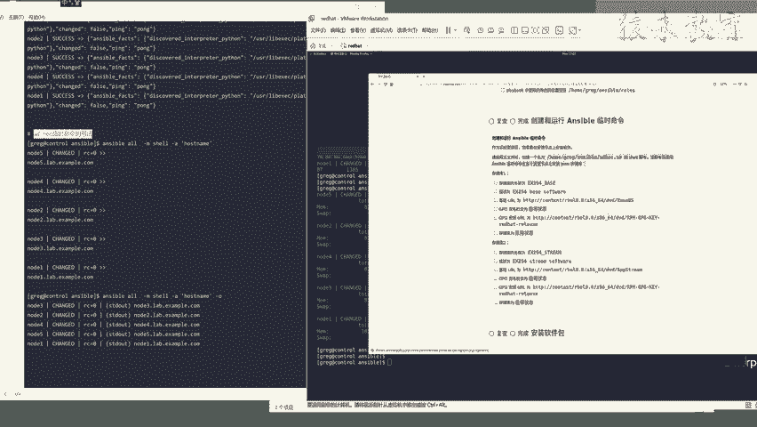

怎么玩呢，你呢要去学这么一个模块，叫answer ver杠doc，查看模块，帮助信息，杠s young reports tra啊，young reporre，这个模块这条命令就是查看它的帮助信息的。

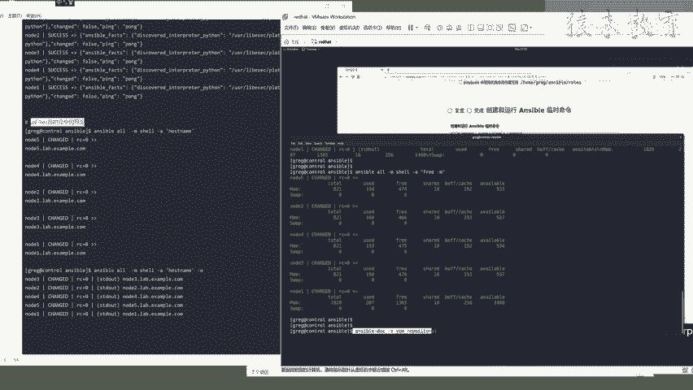

回车，你会发现啊，这个模块是不好使啊，然后呢比如说设置样本仓库的余光眼是否enable，开启这个项目，仓库是否给这个仓库啊设置一个描述信息，对吧好了，那这道题呢考察这个模块你是有数了，对不对。

来先写下来啊，咱们来写在这啊，下一步就是要完成这道题的，先写希儿脚本，咱们把这个脚本啊名字复制一下。

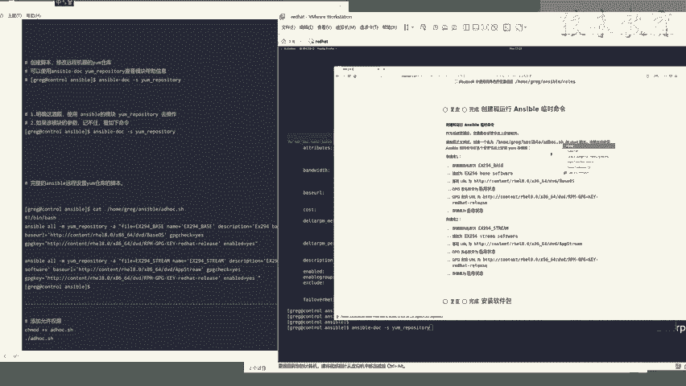

然后呢vm打开这个脚本，在里面写入什么呢。

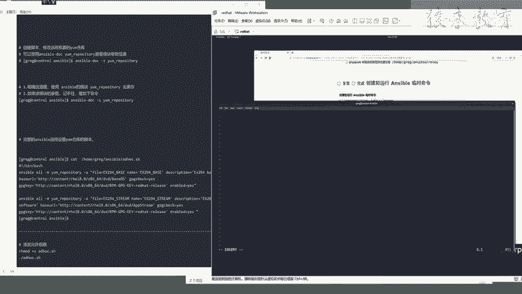

写入临时命令去给所有机器设置一个样本仓库。

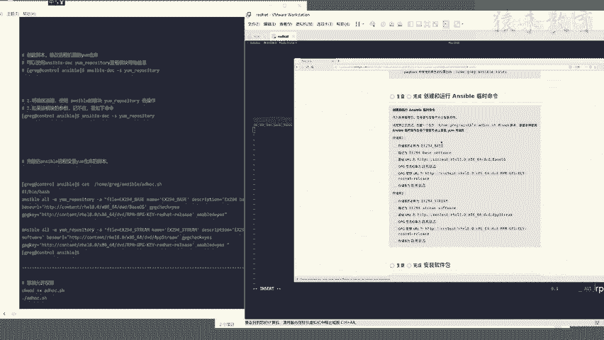

好吧，来具体怎么玩呢，大家来看啊，咱们通过answer ver million，or操作所有主机杠m指定样，reports str r e p o s i t o r y啊，那朋友们如给你一个技巧啊。

也就是来咱们再打开一个终端，fire再打开一个window，打开一个终端啊，交给你一个技巧是什么呢，你可以再开一个终端去连接啊，因为啊，你在考试的时候是拿不到老师的这个笔记的，明白吧。

你呢考试的时候你可以这么去玩s h gregg ctrl啊，f l e c t r a g连上这台机器人，对不对，然后呢你用unserver杠doc啊，然后杠s一样，杠铃，来这边呢就列出了很多模块。

咱们可以grp一样诶，你看一下这个技巧就教给大家了，这一次呢啊来叫，当你在考试时候记不住模块的名字，可以用这个办法去搜索模块的名字，大家看明白吧，answer ver dog杠l。

来这个用法呢是answer ver doc，杠杆l列出所有的模块，graup，去搜索跟样本相关的这个模块的名字对吧，所以说搜索到了这么一个模啊，这个模块的名字你就可以写在你的脚本里面了。

你看如果说你记不住，是不是可以通过这边啊去复制，往这里去粘贴啊，对不对啊，好了，这是一个技巧。

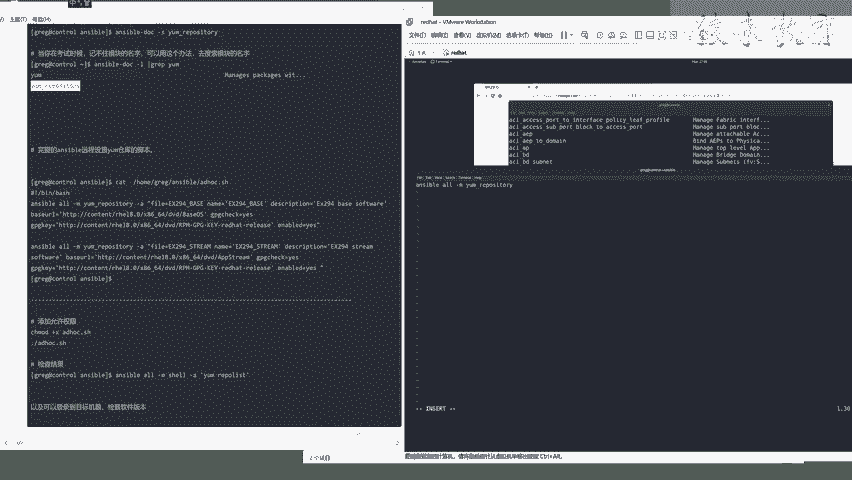

完了呢啊，指定模块杠a后面就是具体的参数了，你要完成人家题目要求的，你看设置一个存储库，名字叫做它这个怎么写来。

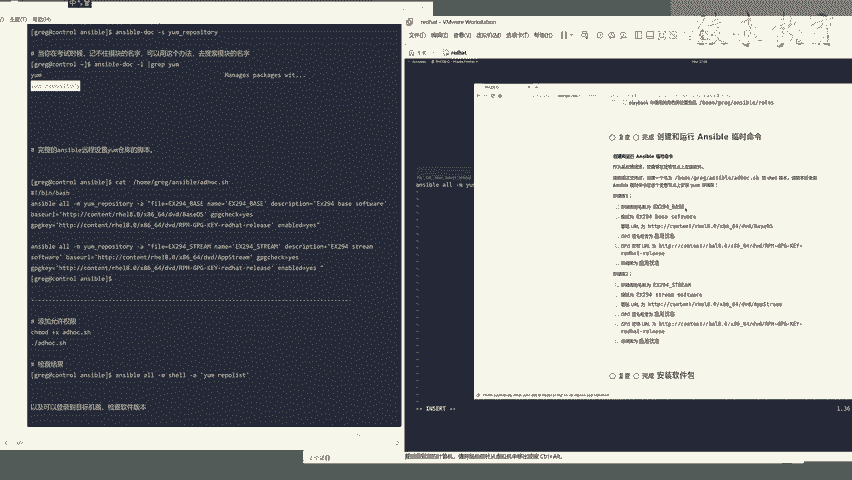

用法就是在双引号中啊，写上一个fire等于他。

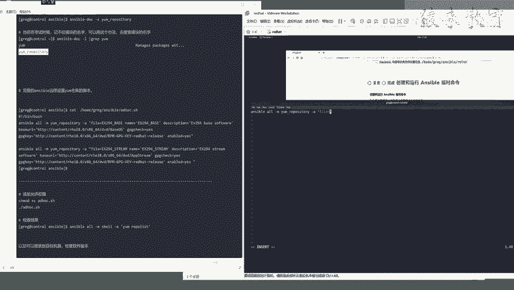

因为人家要求存储库的名称，是它最终生成一个这个仓库文件，名字叫做他知道吧。

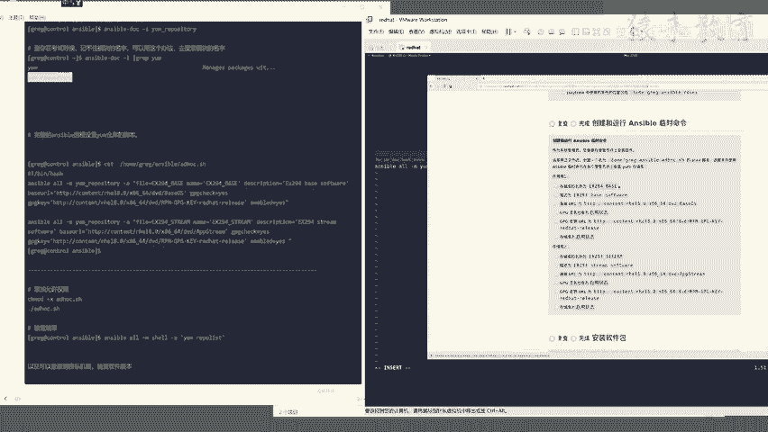

所以说得用fire参数来，完了呢要加上空格，注意了啊，name等于什么呢，啊来你要是想加上引号。

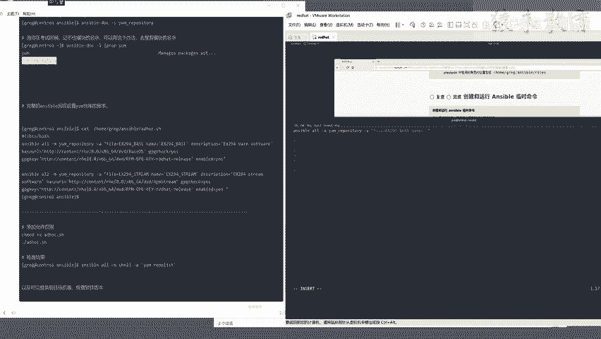

引号嵌套的话，里面就用单引号那说描述诶。

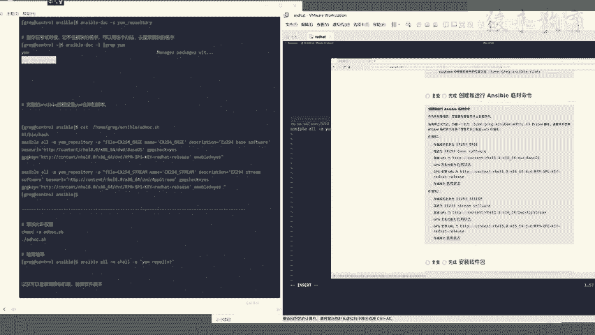

这里啊是存储库的名称啊，这里的name呢来再带着大家看一看啊，你可以点击它的另一个终端unser doc。

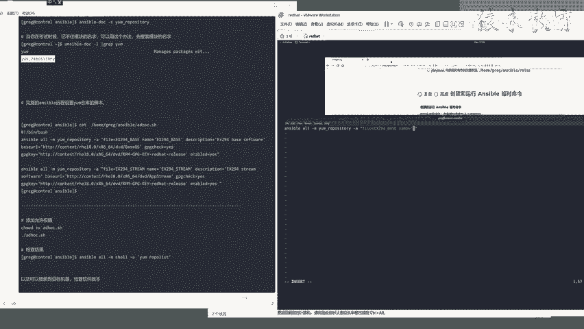

然后是杠s样report to来打开它，咱们来看一看它的这些参数啊，哪个是和他的提议对称的，存储库的名称，也就是让你用哪个参数呢，让你用fire这个参数看见吧。

最终生成一个以r a p o结尾的一个样本仓库，可以吧，来defaults or，然后fire的这个值啊，它默认会用name这个参数的值啊，咱们先找name参数，看有没有。

好有了name是设置设置什么的呀，设置一个仓库的id，知道吧，所以说啊来咱们看这个题目要求啊，存储库的名称叫做他对吧，那你呢先去复制这个名字，然后在这里面啊，你可以这么去记，你写一个name等于它。

然后这个范儿你甚至可以不写了，明白吗，你不写的话，它也会生成这么一个叫ex 294杠base，点r e p o的一个养成文件，ok吧，但是我建议你朋友们跟我一样写明白了好吧，来这是完成了第一个要求。

第二个要求你看描述信息是他对吧，来描述信息先复制一下描述是什么。

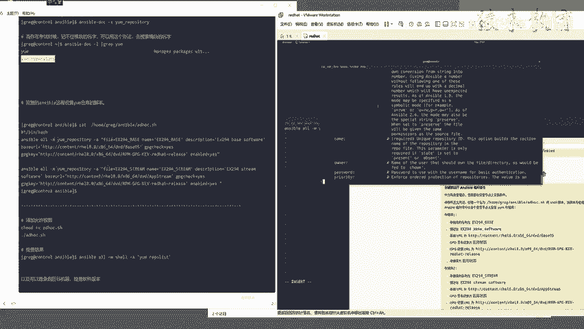

description，咱们网上找参数，这都是教大家一些细节玩法，看见吗，description是不是找到了，来d e s c r i p i o n啊，叫description来。

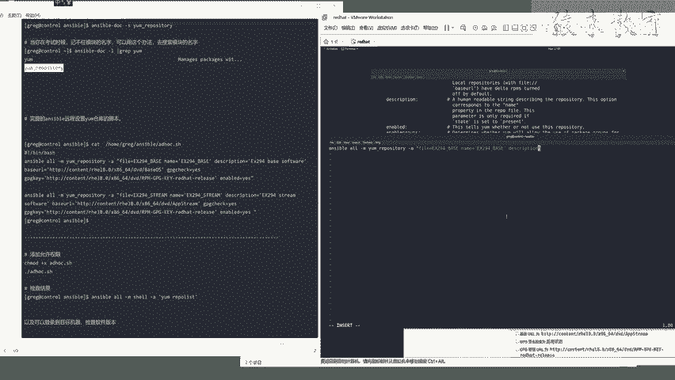

然后等于引号，把我们提要求的这个描述信息写进来，ok吧，下一个基础ui l来给它复制一下o啊。

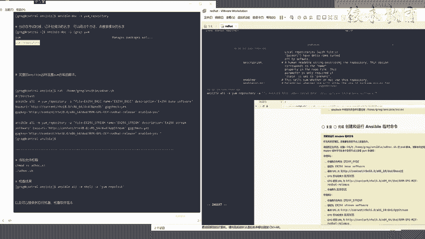

来点击copy啊，下一个参数叫基础u i l是谁呢，就在这带着大家看一看啊，往上找，有一个叫贝斯鱼蛙眼，看见了吧，所以说啊你呢写上一个base，注意了，不要瞎换行啊，不要瞎换行，你就写在一行就行了。

base ur l等于单引号的，把这个余光眼写进来。

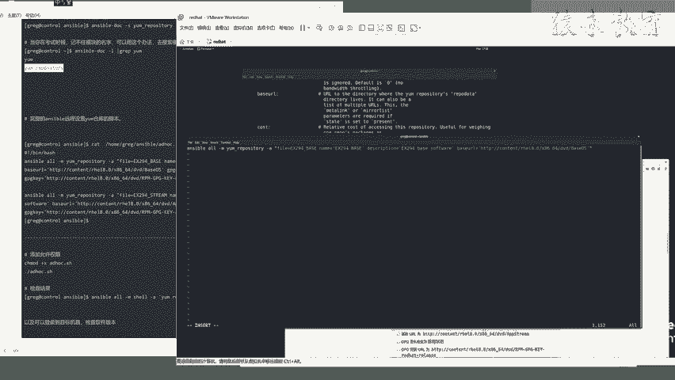

看见吧，千万不要手敲啊，还有一个题目要求是jpg检查是启用状态，咱们呢就用一个叫jpg check，等于yes就可以了。

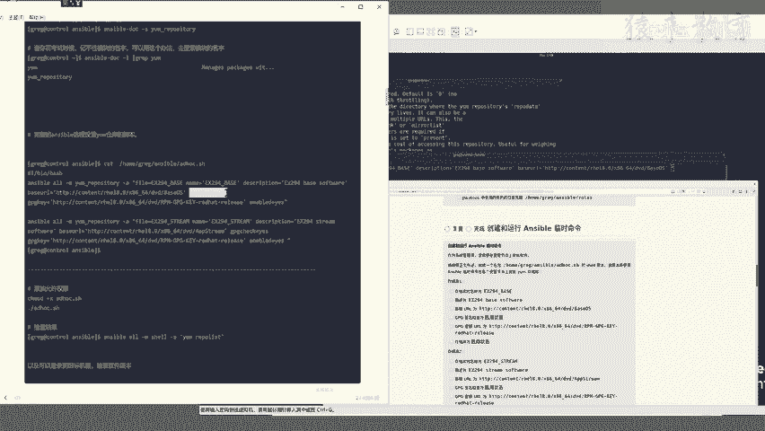

来咱们也可以在这个比这个说明文档中啊，去找到这个参数，你看啊走看见吗，是不是有一个jpg check，它的值可以用什么来，来咱们把这个看见了吗。

就是这道题，jpg签名检查这个参数设置为启用的。

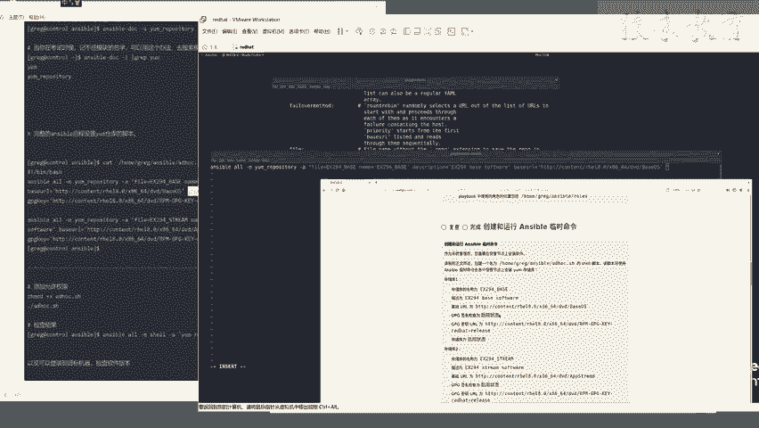

所以说你要买就是这个啊，你得写这个参数叫jpg check copy等于yes。

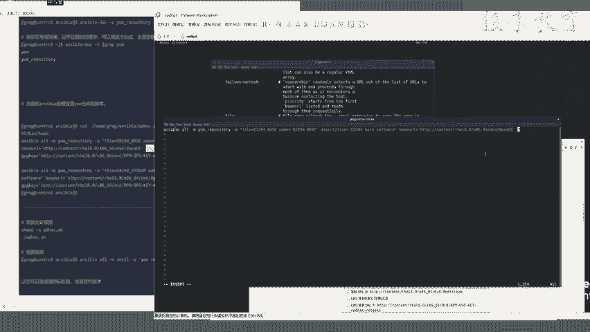

没毛病吧，好最后一个要求jpg密钥，你不是说检查吗，检查你的密钥搁哪啊，密钥搁这儿啊，来把这个u2 l复制一下来，怎么写呢，就是通过这个jpg k这个参数，你看说呃u r l去，就是让你填一个u弯l。

指定一个jpg的key文件所在路径是吧。

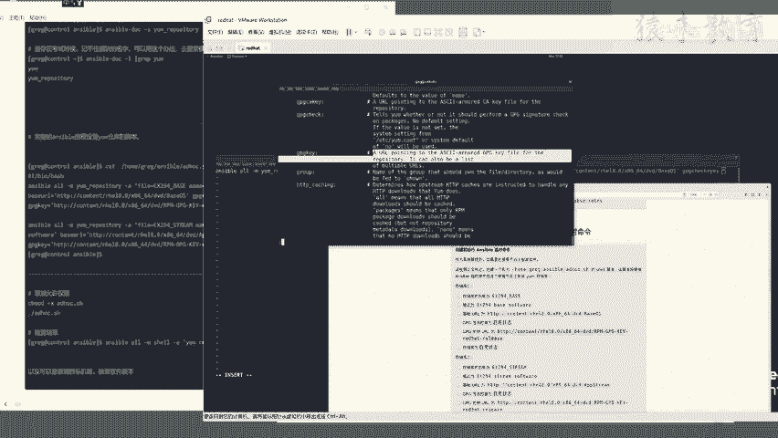

所以说把这个啊copy一下，咱们指定一个参数啊，叫做g p g等于啊来写上个单引号，把题目要求的ur l写进来就o啦。

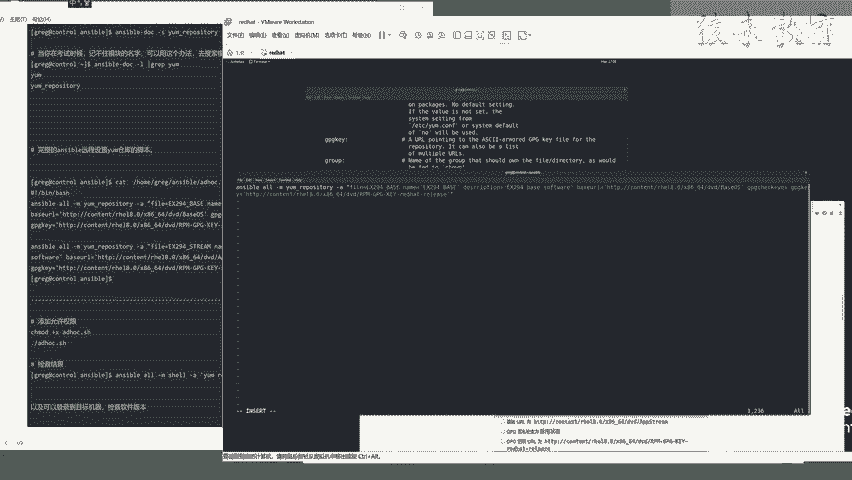

来这是我们第一个仓库就设置完了。

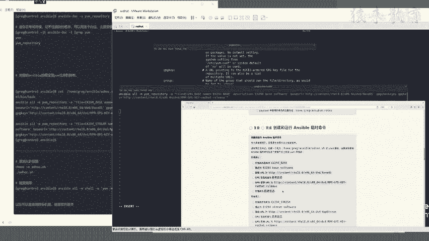

没问题吧，下一个仓库很简单的，朋友们啊，只需要照着上面的写法，answer ver哦，r e p o s i t reposition，杠a啊，继续的。

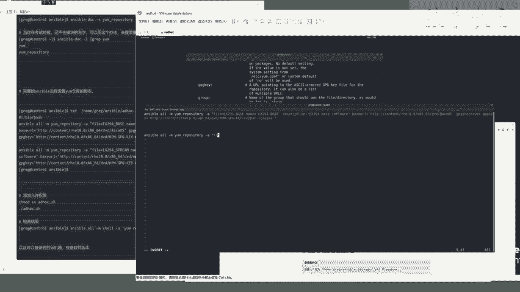

先定义一个fire，fire等于谁啊，第二个仓库是它可以吗。

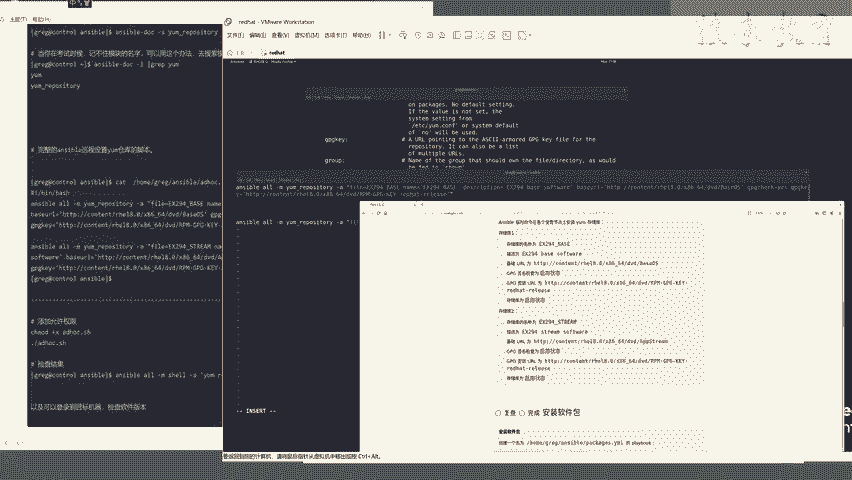

来写个单引号粘贴，然后再来一个name等于粘贴，然后description来给他复制粘贴啊。

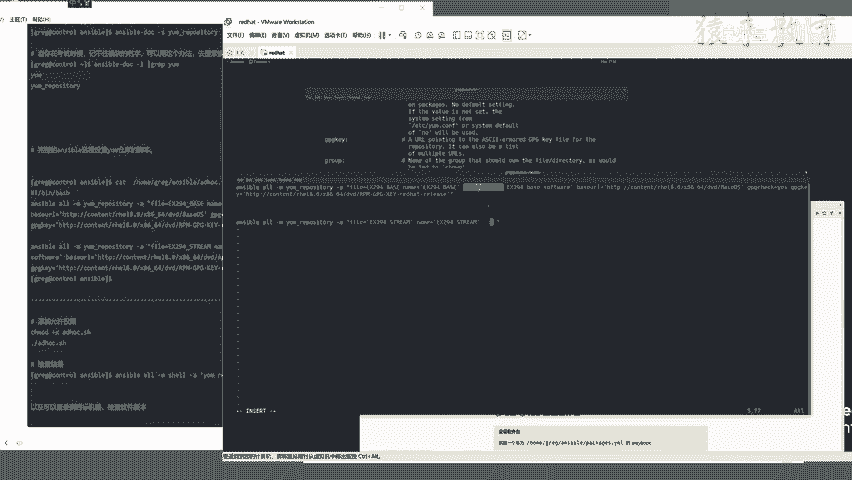

这些单词太长了，你就别敲了，敲更容易出错。

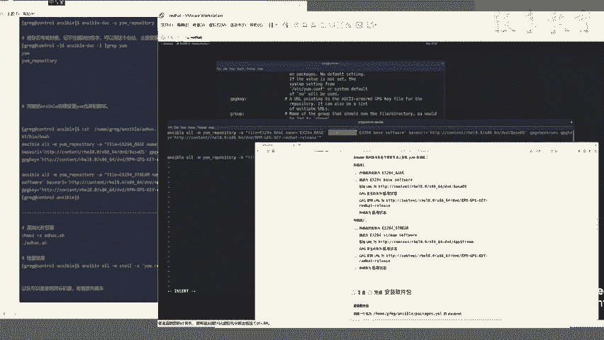

描述信息看见吗，是这个描述为他再下一步叫base u r l copy，所以说呀你要找出做题的技巧。

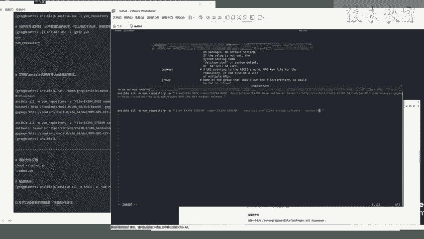

知道吧，base u r l copy走最后一个叫jpg check。

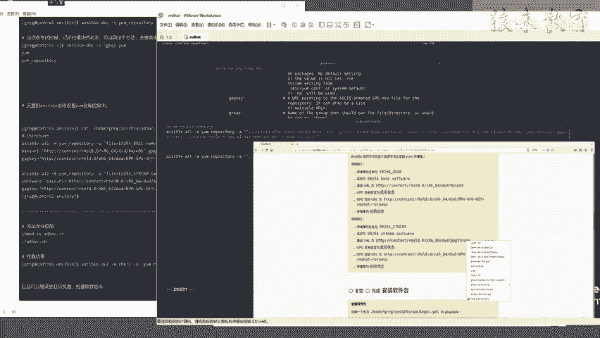

等于yes来copy粘贴对吧，再来还有一个jpg等于第二个仓库的这个ui。

搁这儿来copy诶对吧，然后啊他俩有一个存储库的状态为启用状态，你得给它设置一个诶，enable等于yes，这个咱千万别漏了啊，最后一个要求你得让它启动少一个，你这道题做的都不对啊。

来找enable来看这啊，是不是有个enable的，就是确认它是开机自启的呀，就是这个仓库是启用的，明白吧，开机它就是好使。

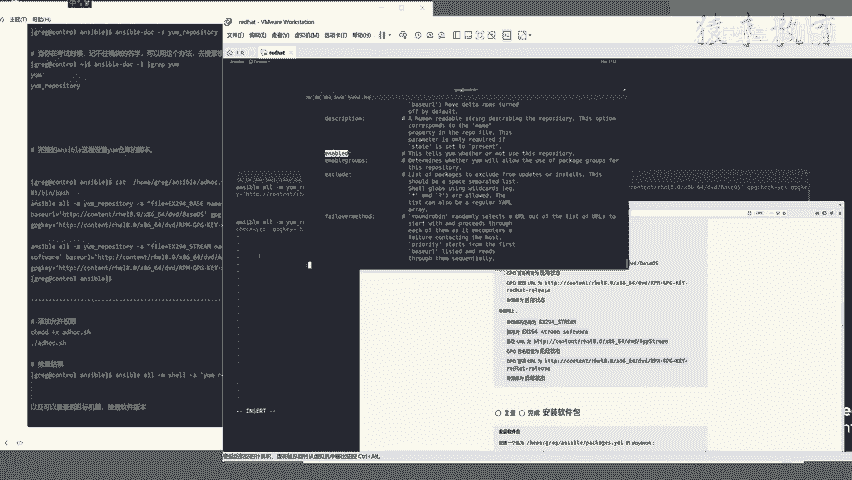

copy来这要加一个enable等于yes，上面也加一个enable的，等于yes，没问题吧，好保存，退出这道题啊，咱们就做完了，是生成了一个馅儿脚本啊，朋友们，你别着急，哎，咱们带着大家看一下啊。

answer b，我们先别着急执行这个剧本啊，别着急执行执行这个希尔脚本，answer or杠m share杠a，然后让诶这样吧，咱们可以用young report list。

样report list这条命你看一看所有目标机器啊，它是否有一个样本仓库，咱们会发现啥呀，说no的12345，这五台机器是不是没有任何的report reporters可用啊，没有任何仓库呢。

他等着什么呢，等着你在这儿去执行这个ad hook，叫s h走，大家看脚本执行完毕了，这个脚本是不是就在帮助帮你去执行，answer ver的临时命令啊，然后最终你去验证它，再用这条命令啊。

去验证一下它的执行结果，来回车，这就是让所有目标机器执行命令。

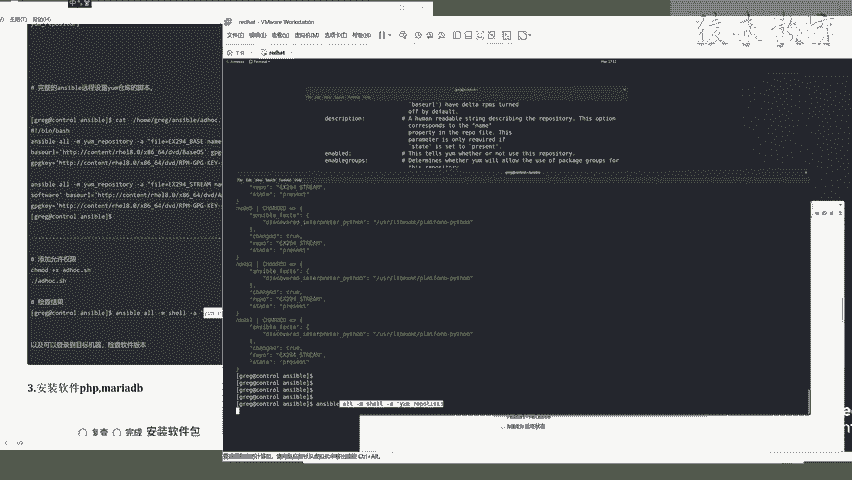

返回它目前可用的仓库是什么，来咱们给他往上拉这道题呢，我们就百分之百的做好了，你看啊，note 5这台机器report id report name，你看有几个，有几个仓库，这是不是第一个仓库对吧。

来第二个仓库叫base string对吧，你看第二个仓库没问题吧，啊，贝斯来ex 294杠贝斯，ex 294杠贝斯，对不对，还有一个ex 294 gun string啊，ex 294杠string。

没问题吧。